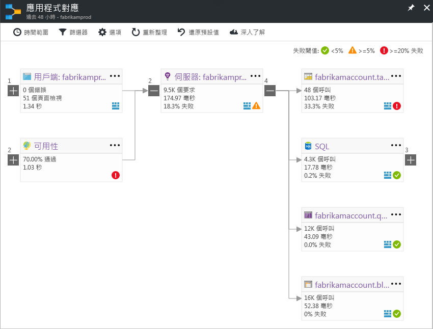

# Application Insights 的應用程式對應Application Map in Application Insights
在[Azure Application Insights](app-insights-overview.md)，應用程式對應為 visual hello 相依性關聯性的應用程式元件的版面配置。In [Azure Application Insights](app-insights-overview.md), Application Map is a visual layout of hello dependency relationships of your application components. 每個元件顯示 Kpi toohelp 負載、 效能、 失敗和警示，例如您找出任何造成效能問題或失敗的元件。Each component shows KPIs such as load, performance, failures, and alerts, toohelp you discover any component causing a performance issue or failure. 您可以按一下任何元件 toomore 從詳細的診斷，例如 Application Insights 事件。You can click through from any component toomore detailed diagnostics, such as Application Insights events. 如果您的應用程式使用 Azure 服務，您也可以按一下透過 tooAzure 診斷，例如 SQL Database Advisor 的建議。If your app uses Azure services, you can also click through tooAzure diagnostics, such as SQL Database Advisor recommendations.

類似其他圖表中，您可以釘選的應用程式對應 toohello Azure 儀表板，可完整運作。Like other charts, you can pin an application map toohello Azure dashboard, where it is fully functional. 

## 開啟 hello 應用程式對應Open hello application map
從您的應用程式的 hello 概觀刀鋒視窗開啟 hello 對應：Open hello map from hello overview blade for your application:

hello 對應可顯示：hello map shows:

* 可用性集合Availability tests
* 用戶端元件 （使用 JavaScript SDK hello 監視）Client-side component (monitored with hello JavaScript SDK)
* 伺服器端元件Server-side component
* Hello 用戶端和伺服器元件的相依性Dependencies of hello client and server components

您可以展開與摺疊相依性連結群組︰You can expand and collapse dependency link groups:

如果您有某種類型 (SQL、HTTP 等) 的許多相依性，它們可能會以群組方式出現。If you have many dependencies of one type (SQL, HTTP etc.), they may appear grouped. 

## 找出問題Spot problems
每個節點都有相關的效能指標，例如 hello 負載、 效能和失敗率，該元件。Each node has relevant performance indicators, such as hello load, performance, and failure rates for that component. 

警告圖示會點出可能的問題。Warning icons highlight possible problems. 橘色的警告表示要求、頁面檢視或相依性呼叫發生失敗。An orange warning means there are failures in requests, page views or dependency calls. 紅色表示失敗率大於 5 %。Red means a failure rate above 5%. 如果您想 tooadjust 這些閾值，請開啟 [選項]。If you want tooadjust these thresholds, open Options.

也會出現作用中警示︰Active alerts also show up: 

如果您使用 SQL Azure，當系統有如何改善效能的建議時，便會出現圖示。If you use SQL Azure, there's an icon that shows when there are recommendations on how you can improve performance. 

按一下任何圖示 tooget 更多詳細資料：Click any icon tooget more details:

## 診斷點選連結Diagnostic click through
每一個 hello 節點 hello 地圖上提供目標的點選連結，以診斷資訊。Each of hello nodes on hello map offers targeted click through for diagnostics. hello 選項 hello hello 節點類型而有所不同。hello options vary depending on hello type of hello node.

Azure 中主控的元件，hello 選項包括 toothem 直接連結。For components that are hosted in Azure, hello options include direct links toothem.

## 篩選和時間範圍Filters and time range
根據預設，hello 對應摘要說明可用的 hello 選擇時間範圍內的所有 hello 資料。By default, hello map summarizes all hello data available for hello chosen time range. 但是，可以先篩選 tooinclude 只在特定作業名稱或相依性。But you can filter it tooinclude only specific operation names or dependencies.

* 作業名稱︰這包括頁面檢視和伺服器端要求類型。Operation name: This includes both page views and server-side request types. 使用此選項，hello 地圖顯示 hello hello 只 hello 選取作業的伺服器/用戶端節點上的 KPI。With this option, hello map shows hello KPI on hello server/client-side node for hello selected operations only. 它會顯示在這些特定作業的 hello 內容中呼叫 hello 相依性。It shows hello dependencies called in hello context of those specific operations.
* 相依性的主檔名： 這包括 hello AJAX 瀏覽器的相依性和伺服器端的相依性。Dependency base name: This includes hello AJAX browser dependencies and server-side dependencies. 如果您要報告自訂相依性遙測，以 hello TrackDependency API，它們也出現在這裡。If you report custom dependency telemetry with hello TrackDependency API, they also appear here. 您可以選取 hello 相依性 tooshow hello 地圖上。You can select hello dependencies tooshow on hello map. 目前這個選項不會篩選 hello 伺服器端要求或 hello 用戶端的分頁檢視。Currently this selection does not filter hello server-side requests, or hello client-side page views.

## 儲存篩選Save filters
toosave hello 篩選已套用，針 hello 篩選過的檢視拖曳至[儀表板](app-insights-dashboards.md)。toosave hello filters you have applied, pin hello filtered view onto a [dashboard](app-insights-dashboards.md).

## 錯誤窗格Error pane
當您按一下 hello map 中的節點時，錯誤窗格會顯示在 hello 彙總失敗，該節點的右側。When you click a node in hello map, an error pane is displayed on hello right-hand side summarizing failures for that node. 失敗會先依作業識別碼群組，然後再依問題識別碼群組。Failures are grouped first by operation ID and then grouped by problem ID.

按一下 上失敗，會在 toohello 發生失敗的最新執行個體。Clicking on a failure takes you toohello most recent instance of that failure.

## 資源健康情況Resource health
對於某些資源類型，資源健全狀況會顯示在 hello hello 錯誤窗格頂端。For some resource types, resource health is displayed at hello top of hello error pane. 例如，按一下 [SQL] 節點會顯示 hello 資料庫健康狀態與任何已引發的警示。For example, clicking a SQL node will show hello database health and any alerts that have fired.

您可以按一下 hello 資源名稱 tooview 標準概觀度量該資源。You can click hello resource name tooview standard overview metrics for that resource.

## 端對端系統應用程式對應End-to-end system app maps

*需要 SDK 2.3 版或更新版本**Requires SDK version 2.3 or higher*

如果您的應用程式具有數個元件-例如後, 端服務此外 toohello web 應用程式層，則您可以顯示所有在一個整合式應用程式對應。If your application has several components - for example, a back-end service in addition toohello web app - then you can show them all on one integrated app map.

hello 應用程式對應尋找遵循以 hello Application Insights SDK 安裝的伺服器之間進行的任何 HTTP 相依性呼叫的伺服器節點。hello app map finds server nodes by following any HTTP dependency calls made between servers with hello Application Insights SDK installed. 每個 Application Insights 資源會假設 toocontain 一部伺服器。Each Application Insights resource is assumed toocontain one server.

### 多角色應用程式對應 (預覽)Multi-role app map (preview)

hello 預覽多角色應用程式對應功能可讓您 toouse hello 應用程式對應具有多個伺服器傳送資料 toohello 相同的 Application Insights 資源 / 檢測金鑰。hello preview multi-role app map feature allows you toouse hello app map with multiple servers sending data toohello same Application Insights resource  / instrumentation key. Hello 對應中的伺服器分散 hello cloud_RoleName 屬性遙測項目上。Servers in hello map are segmented by hello cloud_RoleName property on telemetry items. 設定*多角色應用程式對應*太*上*從 hello 預覽刀鋒視窗 tooenable 這項設定。Set *Multi-role Application Map* too*On* from hello Previews blade tooenable this configuration.

在微服務應用程式，或在其他案例中，您 toocorrelate 事件在單一的 Application Insights 資源內的多部伺服器，可能需要這種方法。This approach may be desired in a micro-services application, or in other scenarios where you want toocorrelate events across multiple servers within a single Application Insights resource.

## 影片Video

> [!VIDEO https://channel9.msdn.com/events/Connect/2016/112/player] 

## 意見反應Feedback
請透過提供意見反應 hello 入口網站的意見反應 選項。Please provide feedback through hello portal feedback option.

## 後續步驟Next steps

* [Azure 入口網站Azure portal](https://portal.azure.com)
