# DevOps 適用的 Application Insights 概觀Overview of Application Insights for DevOps

透過 [Application Insights](app-insights-overview.md)，您可以迅速瞭解您的應用程式在作用中時如何執行和使用。With [Application Insights](app-insights-overview.md), you can quickly find out how your app is performing and being used when it's live. 如果發生問題，它可讓您了解、協助您評估影響，以及協助您判斷原因。If there's a problem, it lets you know about it, helps you assess the impact, and helps you determine the cause.

以下是某個開發 Web 應用程式的小組的敘述：Here's an account from a team that develops web applications:

* *「幾天前，我們部署了次要的 Hotfix。我們沒有執行廣泛測試階段，但很不幸地，有些未預期的變更被合併到裝載中，造成前端與後端之間的不相容。伺服器例外狀況隨即湧現，警報發出，我們便知道了這個情況。在按幾下 Application Insights 入口網站之後，我們從例外狀況堆疊取得了足夠的資訊，而得以縮小問題。我們立即復原並將損害降至最低。Application Insights 使得這個部分的開發作業週期變得非常輕鬆且可行。」**"A couple of days ago, we deployed a 'minor' hotfix. We didn't run a broad test pass, but unfortunately some unexpected change got merged into the payload, causing incompatibility between the front and back ends. Immediately, server exceptions surged, our alert fired, and we were made aware of the situation. A few clicks away on the Application Insights portal, we got enough information from exception callstacks to narrow down the problem. We rolled back immediately and limited the damage. Application Insights has made this part of the devops cycle very easy and actionable."*

在本文中，我們追隨 Fabrikam Bank 中一個開發線上銀行系統 (OBS) 的團隊，了解他們如何使用 Application Insights 快速回應客戶和進行更新。In this article we follow a team in Fabrikam Bank that develops the online banking system (OBS) to see how they use Application Insights to quickly respond to customers and make updates.  

此團隊會處理下圖所示的 DevOps 循環：The team works on a DevOps cycle depicted in the following illustration:

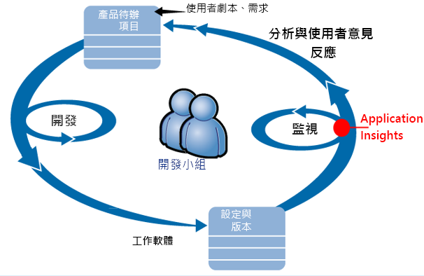

送入其開發待處理項目 (工作清單) 的需求。Requirements feed into their development backlog (task list). 小組努力工作，經常交付可行的軟體 - 通常是對現有的應用程式進行改進和延伸。They work in short sprints, which often deliver working software - usually in the form of improvements and extensions to the existing application. 上線的 app 則會經常更新新功能。The live app is frequently updated with new features. 雖然 app 已經上線，但小組會透過 Application Insights 的協助監視其效能和使用情況。While it's live, the team monitors it for performance and usage with the help of Application Insights. 這項 APM 資料會餵送回其開發待處理項目。This APM data feeds back into their development backlog.

小組使用 Application Insights 密切監視上線 Web 應用程式的下列項目：The team uses Application Insights to monitor the live web application closely for:

* 效能。Performance. 他們想要了解回應時間如何隨著要求計數變化；使用多少 CPU、網路、磁碟和其他資源；以及瓶頸所在。They want to understand how response times vary with request count; how much CPU, network, disk, and other resources are being used; and where the bottlenecks are.
* 失敗。Failures. 如果有例外狀況或失敗的要求，或如果效能計數器超出其舒適範圍，小組必須快速知道以便採取動作。If there are exceptions or failed requests, or if a performance counter goes outside its comfortable range, the team needs to know rapidly so that they can take action.
* 使用狀況。Usage. 當發行新功能時，小組想要知道其使用程度，以及使用者在使用上是否有任何問題。Whenever a new feature is released, the team want to know to what extent it is used, and whether users have any difficulties with it.

接下來討論循環的回饋部分：Let's focus on the feedback part of the cycle:

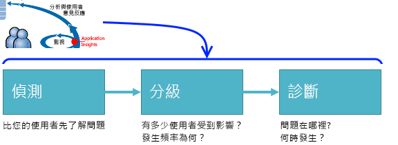

## 偵測可用性不佳Detect poor availability
Marcela Markova 是 OBS 小組的資深開發人員，主導線上效能監視。Marcela Markova is a senior developer on the OBS team, and takes the lead on monitoring online performance. 她設定了數項[可用性測試](app-insights-monitor-web-app-availability.md)：She sets up several [availability tests](app-insights-monitor-web-app-availability.md):

* 用於應用程式主要登陸頁面 (http://fabrikambank.com/onlinebanking/) 的單一 URL 測試。A single-URL test for the main landing page for the app, http://fabrikambank.com/onlinebanking/. 她設定 HTTP 代碼 200 與文字「歡迎使用！」的準則。She sets criteria of HTTP code 200 and text 'Welcome!'. 如果此測試失敗，表示網路或伺服器發生嚴重錯誤，或可能有部署問題。If this test fails, there's something seriously wrong with the network or the servers, or maybe a deployment issue. (或是有人變更了頁面上的「歡迎使用！」(Or someone has changed the Welcome! 訊息，但沒讓她知道。)message on the page without letting her know.)
* 更深入的多步驟測試將會記錄並取得目前帳戶清單，檢查每個頁面上的一些重要詳細資料。A deeper multi-step test, which logs in and gets a current account listing, checking a few key details on each page. 此測試會驗證對帳戶資料庫的連結運作中。This test verifies that the link to the accounts database is working. 她使用虛構的客戶識別碼：其中少數幾個保留供測試目的。She uses a fictitious customer id: a few of them are maintained for test purposes.

透過設定這些測試，Marcela 能確信若要任何中斷情況，小組將快速知道。With these tests set up, Marcela is confident that the team will quickly know about any outage.  

失敗在 Web 測試圖表上會以紅點顯示：Failures show up as red dots on the web test chart:

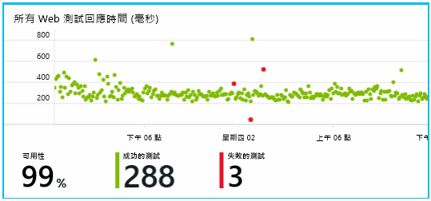

但更重要的是，任何失敗的相關警示會以電子郵件方式寄送給開發小組。But more importantly, an alert about any failure is emailed to the development team. 以該方式，他們幾乎可在所有客戶之前便得知該情況。In that way, they know about it before nearly all the customers.

## 監視效能Monitor Performance
在 Application Insights 中的概觀頁面上，有一個顯示各種[重要度量](app-insights-web-monitor-performance.md)的圖表。On the overview page in Application Insights, there's a chart that shows a variety of [key metrics](app-insights-web-monitor-performance.md).

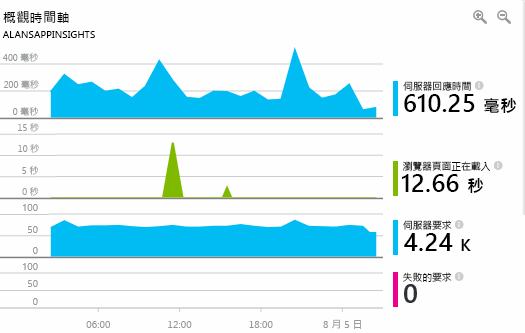

瀏覽器頁面載入時間是從網頁直接傳送的遙測所衍生。Browser page load time is derived from telemetry sent directly from web pages. 伺服器回應時間、伺服器要求計數和失敗的要求計數，都是在 Web 伺服器中測量，然後從該處傳送到 Application Insights。Server response time, server request count, and failed request count are all measured in the web server and sent to Application Insights from there.

Marcela 有些擔心伺服器回應圖形。Marcela is slightly concerned with the server response graph. 此圖表會顯示伺服器自收到使用者瀏覽器的 HTTP 要求，直到傳回回應這段期間的平均時間。This graph shows the average time between when the server receives an HTTP request from a user's browser, and when it returns the response. 在這個圖表中看到差異並無不尋常，因為各系統的負載不同。It isn't unusual to see a variation in this chart, as load on the system varies. 但在此情況下，要求數量些微增加與回應時間大幅增加似乎有某種關係。But in this case, there seems to be a correlation between small rises in the count of requests, and big rises in the response time. 這可能表示系統到達運作極限。That could indicate that the system is operating just at its limits.

她將「伺服器」圖表打開：She opens the Servers charts:

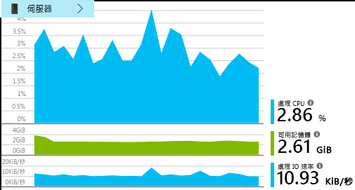

其中似乎沒有資源限制的徵兆，也許伺服器回應圖表中的起伏只是巧合。There seems to be no sign of resource limitation there, so maybe the bumps in the server response charts are just a coincidence.

## 設定警示以符合目標Set alerts to meet goals
儘管如此，她還是會多加留意回應時間。Nevertheless, she'd like to keep an eye on the response times. 如果它們變得太高，她想立即知道。If they go too high, she wants to know about it immediately.

因此，她針對回應時間大於一般臨界值的情況設定了一個[警示](app-insights-metrics-explorer.md)。So she sets an [alert](app-insights-metrics-explorer.md), for response times greater than a typical threshold. 這可以確保當回應時間變慢時她就會知道。This gives her confidence that she'll know about it if response times are slow.

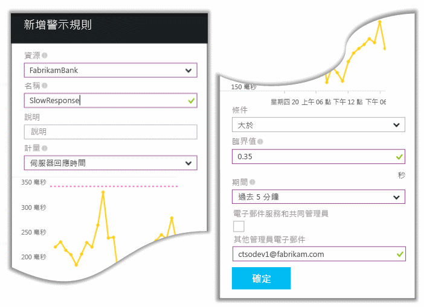

您可以在其他各種不同的度量上設定警示。Alerts can be set on a wide variety of other metrics. 例如，您可以在例外狀況計數變高或可用記憶體變低，或用戶端要求中有尖峰時收到電子郵件。For example, you can receive emails if the exception count becomes high, or the available memory goes low, or if there is a peak in client requests.

## 獲得有關智慧型偵測警示的資訊Stay informed with Smart Detection Alerts
隔天，確實收到了一封來自 Application Insights 的電子郵件。Next day, an alert email does arrive from Application Insights. 但是開啟郵件之後，她發現並不是她所設定的回應時間警示。But when she opens it, she finds it isn't the response time alert that she set. 而是郵件告知她失敗的要求 (也就是傳回 500 或更高數字之失敗代碼的要求) 數目突然提高。Instead, it tells her there's been a sudden rise in failed requests - that is, requests that have returned failure codes of 500 or more.

發生失敗的要求時使用者會看到錯誤，通常是在程式碼中擲出例外狀況之後。Failed requests are where users have seen an error - typically following an exception thrown in the code. 也許他們會看到訊息指出 「抱歉，我們現在無法更新您的詳細資料。 」Maybe they see a message saying "Sorry we couldn't update your details right now." 或者，極度尷尬的是，使用者的螢幕上會顯示堆疊傾印 (出自於 Web 伺服器禮貌回應)。Or, at absolute embarrassing worst, a stack dump appears on the user's screen, courtesy of the web server.

這個警示令人驚訝，因為她上次查看時，失敗的要求計數很低，完全不用擔心。This alert is a surprise, because the last time she looked at it, the failed request count was encouragingly low. 其中一小部分的失敗預期是在忙碌的伺服器中。A small number of failures is to be expected in a busy server.

這也讓她稍微感到驚訝，因為她之前並不需要設定這個警示。It was also a bit of a surprise for her because she didn't have to configure this alert. Application Insights 包含智慧型偵測。Application Insights include Smart Detection. 它會自動調整至您 app 的一般失敗模式，並且「習慣」特定頁面、高負載或和其他計量連結的失敗。It automatically adjusts to your app's usual failure pattern, and "gets used to" failures on a particular page, or under high load, or linked to other metrics. 只有當增加量超出預期的量時它才會發出警示。It raises the alarm only if there's a rise above what it comes to expect.

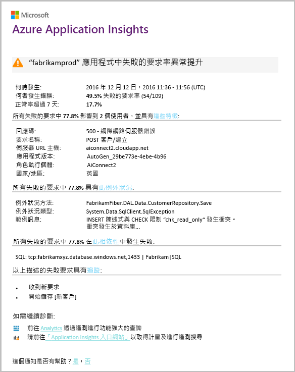

這封電子郵件非常有幫助。This is a very useful email. 它不只是發出警示。It doesn't just raise an alarm. 它也會進行許多分級和診斷工作。It does a lot of the triage and diagnostic work, too.

它會顯示有多少客戶，以及哪些網頁或作業受到影響。It shows how many customers are affected, and which web pages or operations. Marcela 可以決定是否需要動員整個小組來處理此問題，或者可以延後到下週再處理。Marcela can decide whether she needs to get the whole team working on this as a fire drill, or whether it can be ignored until next week.

該電子郵件也顯示發生的特定例外狀況，甚至 - 更有趣的 - 是與對特定資料庫呼叫失敗關聯的失敗。The email also shows that a particular exception occurred, and - even more interesting - that the failure is associated with failed calls to a particular database. 這解釋了為何 Marcela 的團隊即使最近沒有部署任何更新也會突然發生錯誤。This explains why the fault suddenly appeared even though Marcela's team has not deployed any updates recently.

Marcella 會根據這封電子郵件偵測資料庫團隊的主管。Marcella pings the leader of the database team based on this email. 她發現他們在過去半小時釋出了 Hot Fix；而不巧的是，或許是基礎結構有些微小變更...She learns that they released a hot fix in the past half hour; and Oops, maybe there might have been a minor schema change....

因此，在問題發生後的 15 分鐘內，甚至是在檢查紀錄之前，就已經開始修正問題。So the problem is on the way to being fixed, even before investigating logs, and within 15 minutes of it arising. 不過，Marcela 按了一下連結來開啟 Application Insights。However, Marcela clicks the link to open Application Insights. 此時直接開啟了一個失敗的要求，而且她可以在相依性呼叫的關聯清單中看到失敗的資料庫呼叫。It opens straight onto a failed request, and she can see the failed database call in the associated list of dependency calls.

## 偵測例外狀況Detect exceptions
只要一點點設定，就可以將 [例外狀況](app-insights-asp-net-exceptions.md) 自動報告給 Application Insights。With a little bit of setup, [exceptions](app-insights-asp-net-exceptions.md) are reported to Application Insights automatically. 也可以在程式碼中呼叫 [TrackException()](app-insights-api-custom-events-metrics.md#trackexception) ，明確擷取這些例外狀況：They can also be captured explicitly by inserting calls to [TrackException()](app-insights-api-custom-events-metrics.md#trackexception) into the code:  

    var telemetry = new TelemetryClient();
    ...
    try
    { ...
    }
    catch (Exception ex)
    {
       // Set up some properties:
       var properties = new Dictionary <string, string>
         {{"Game", currentGame.Name}};

       var measurements = new Dictionary <string, double>
         {{"Users", currentGame.Users.Count}};

       // Send the exception telemetry:
       telemetry.TrackException(ex, properties, measurements);
    }

Fabrikam 銀行小組制定出一律在發生例外狀況時傳送遙測的作法，除非有明顯的恢復。The Fabrikam Bank team has evolved the practice of always sending telemetry on an exception, unless there's an obvious recovery.  

事實上，其策略甚至比此更為廣泛：他們會在每個客戶對要做的事感到挫折時便傳送遙測，而不論是否與程式碼中的例外狀況對應。In fact, their strategy is even broader than that: They send telemetry in every case where the customer is frustrated in what they wanted to do, whether it corresponds to an exception in the code or not. 例如，如果外部的銀行內傳送系統因為某此作業原因 (不是客戶的錯誤) 而傳回「無法完成此交易」訊息，他們會追蹤該事件。For example, if the external inter-bank transfer system returns a "can't complete this transaction" message for some operational reason (no fault of the customer) then they track that event.

    var successCode = AttemptTransfer(transferAmount, ...);
    if (successCode < 0)
    {
       var properties = new Dictionary <string, string>
            {{ "Code", returnCode, ... }};
       var measurements = new Dictionary <string, double>
         {{"Value", transferAmount}};
       telemetry.TrackEvent("transfer failed", properties, measurements);
    }

TrackException 用來報告例外狀況，因為它會傳送堆疊的副本。TrackException is used to report exceptions because it sends a copy of the stack. TrackEvent 用來報告其他事件。TrackEvent is used to report other events. 您可以在診斷中附加可能有幫助的任何屬性。You can attach any properties that might be useful in diagnosis.

例外狀況和事件會顯示在 [[診斷搜尋](app-insights-diagnostic-search.md)] 刀鋒視窗中。Exceptions and events show up in the [Diagnostic Search](app-insights-diagnostic-search.md) blade. 您可以深入探索，以查看額外屬性和堆疊追蹤。You can drill into them to see the additional properties and stack trace.

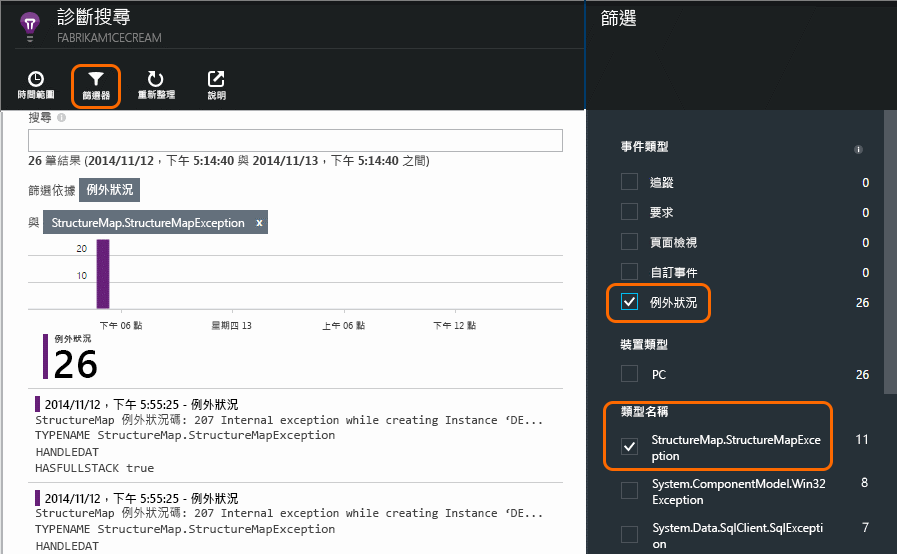

## 主動監視Monitor proactively
Marcela 不會無所事事等候警示。Marcela doesn't just sit around waiting for alerts. 在每次重新部署之後，她都會立即查看[回應時間](app-insights-web-monitor-performance.md) - 除了例外狀況計數之外，也查看整體數據和最緩慢的要求表。Soon after every redeployment, she takes a look at [response times](app-insights-web-monitor-performance.md) - both the overall figure and the table of slowest requests, as well as exception counts.  

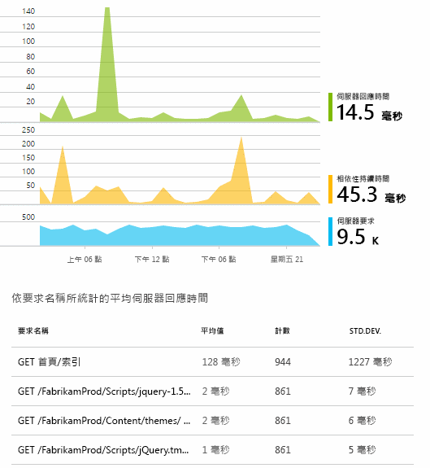

她可以評估每個部署的效能影響，通常是將每週與前一週比較。She can assess the performance effect of every deployment, typically comparing each week with the last. 如果突然有變慢的情況，她會將該情況向相關的開發人員反應。If there's a sudden worsening, she raises that with the relevant developers.

## 分級問題Triage issues
分級 - 評估問題的嚴重性和程度 - 是偵測後的第一個步驟。Triage - assessing the severity and extent of a problem - is the first step after detection. 我們是否應該在半夜打電話給小組？Should we call out the team at midnight? 或是問題可以留到累積的工作中下一次方便的時候？Or can it be left until the next convenient gap in the backlog? 分級時有一些重要的問題。There are some key questions in triage.

發生頻率為何？How often is it happening? [概觀] 分頁的圖表可提供問題的某些觀點。The charts on the Overview blade give some perspective to a problem. 例如，Fabrikam 應用程式在一個晚上產生了四個 Web 測試警示。For example, the Fabrikam application generated four web test alerts one night. 小組在早上查看圖表，可以發現確實出現一些紅點，但多數的測試仍是綠色。Looking at the chart in the morning, the team could see that there were indeed some red dots, though still most of the tests were green. 深入探索可用性圖表，很明顯地，這所有的間歇性問題都來自一個測試位置。Drilling into the availability chart, it was clear that all of these intermittent problems were from one test location. 這顯然是僅影響一個路徑的網路問題，而且很可能可自行解決。This was obviously a network issue affecting only one route, and would most likely clear itself.  

相反地，例外狀況計數或回應時間圖表中明顯且穩定的上升則明顯有其他問題需要注意。By contrast, a dramatic and stable rise in the graph of exception counts or response times is obviously something to panic about.

實用的分級策略是「自己動手做」。A useful triage tactic is Try It Yourself. 如果您遇到相同問題，就會知道它是真的。If you run into the same problem, you know it's real.

哪個部分的使用者受到影響？What fraction of users are affected? 若要獲得約略的答案，請將失敗率除以工作階段計數。To obtain a rough answer, divide the failure rate by the session count.

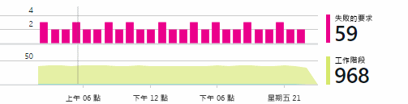

在緩慢回應的情況中，將回應最緩慢的要求表與每個頁面的使用頻率相比較。When there are slow responses, compare the table of slowest-responding requests with the usage frequency of each page.

封鎖案例的重要性如何？How important is the blocked scenario? 如果這是功能性問題，封鎖了特定的使用者劇本，有很大影響嗎？If this is a functional problem blocking a particular user story, does it matter much? 如果客戶無法支付帳單，便很嚴重；如果客戶無法變更其畫面色彩喜好設定，也可以稍候再解決。If customers can't pay their bills, this is serious; if they can't change their screen color preferences, maybe it can wait. 事件或例外狀況的詳細資料或緩慢頁面的身分識別，會告知您客戶發生問題的位置。The detail of the event or exception, or the identity of the slow page, tells you where customers are having trouble.

## 診斷問題Diagnose issues
診斷與偵測不太一樣。Diagnosis isn't quite the same as debugging. 開始追蹤程式碼之前，您應該對問題的原因、位置和發生時機有約略的構念。Before you start tracing through the code, you should have a rough idea of why, where and when the issue is occurring.

**發生時機為何？****When does it happen?** 事件和度量圖表提供的歷程檢視可讓您輕鬆將影響與可能原因產生相互關聯。The historical view provided by the event and metric charts makes it easy to correlate effects with possible causes. 如果回應時間或例外狀況率中有間歇性的尖峰，請查看要求計數：如果尖峰是在相同時間，則可能是資源問題。If there are intermittent peaks in response time or exception rates, look at the request count: if it peaks at the same time, then it looks like a resource problem. 您需要指派更多 CPU 或記憶體嗎？Do you need to assign more CPU or memory? 或者它是無法管理負載的相依性？Or is it a dependency that can't manage the load?

**問題在於我們嗎？****Is it us?**  如果特定類型的要求效能突然下降 - 例如客戶想要對帳單時 - 則可能是外部子系統而非 Web 應用程式有問題。If you have a sudden drop in performance of a particular type of request - for example when the customer wants an account statement - then there's a possibility it might be an external subsystem rather than your web application. 在「計量瀏覽器」中，選取相依性失敗率和相依性期間率，並將其過去幾個小時或幾天的歷程記錄與您偵測到的問題比較。In Metrics Explorer, select the Dependency Failure rate and Dependency Duration rates and compare their histories over the past few hours or days with the problem you detected. 如果有相互關聯的變更，則外部子系統可能是原因所在。If there are correlating changes, then an external subsystem might be to blame.  

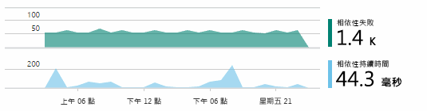

有些緩慢相依性的問題是地理位置問題。Some slow dependency issues are geolocation problems. Fabrikam 銀行使用 Azure virtual 機器，並發現他們誤將 Web 伺服器和帳戶伺服器放置在不同國家/地區。Fabrikam Bank uses Azure virtual machines, and discovered that they had inadvertently located their web server and account server in different countries. 透過移轉其中一部伺服器獲得明顯的改善。A dramatic improvement was brought about by migrating one of them.

**我們做了什麼？****What did we do?** 如果問題似乎不在於相依性，而且如果不是持續有問題，則可能是由於最近的變更而導致。If the issue doesn't appear to be in a dependency, and if it wasn't always there, it's probably caused by a recent change. 度量和事件圖表提供的歷史觀點讓您輕鬆將任何突然的變更與部署產生相互關聯。The historical perspective provided by the metric and event charts makes it easy to correlate any sudden changes with deployments. 它可縮小問題的搜尋範圍。That narrows down the search for the problem.

**發生什麼？****What's going on?** 有些問題很少發生，而且透過離線測試可能難以追蹤。Some problems occur only rarely and can be difficult to track down by testing offline. 我們能做的是嘗試在問題發生時擷取錯誤。All we can do is to try to capture the bug when it occurs live. 您可以在例外狀況報告中檢查堆疊傾印。You can inspect the stack dumps in exception reports. 此外，您可以使用喜好的記錄架構或使用 TrackTrace() 或 TrackEvent() 來編寫追蹤呼叫。In addition, you can write tracing calls, either with your favorite logging framework or with TrackTrace() or TrackEvent().  

Fabrikam 的帳戶間轉送發生間歇性問題，但只有某些帳戶類型有此情況。Fabrikam had an intermittent problem with inter-account transfers, but only with certain account types. 為了更加了解發生的情況，他們在程式碼中的重要點插入了 TrackTrace() 呼叫，附加帳戶類型作為每個呼叫的內容。To understand better what was happening, they inserted TrackTrace() calls at key points in the code, attaching the account type as a property to each call. 那使得要在診斷搜尋中僅篩選掉這些追蹤更為輕鬆。That made it easy to filter out just those traces in Diagnostic Search. 他們也將參數值附加為追蹤呼叫的屬性和測量。They also attached parameter values as properties and measures to the trace calls.

## 回應所發現的問題Respond to discovered issues
診斷問題之後，您可以製訂修正問題的計劃。Once you've diagnosed the issue, you can make a plan to fix it. 也許您需要復原最近的變更，或也許您可以繼續並修正它。Maybe you need to roll back a recent change, or maybe you can just go ahead and fix it. 修正完成後，Application Insights 會告知您是否成功。Once the fix is done, Application Insights tells you whether you succeeded.  

Fabrikam 銀行的開發小組對效能測量採取較使用 Application Insights 之前更具結構的方法。Fabrikam Bank's development team take a more structured approach to performance measurement than they used to before they used Application Insights.

* 他們會在 Application Insights 概觀頁面就特定度量設定效能目標。They set performance targets in terms of specific measures in the Application Insights overview page.
* 他們從頭為應用程式設計效能度量，例如透過「漏斗」測量使用者進度的度量。They design performance measures into the application from the start, such as the metrics that measure user progress through 'funnels.'  

## 監視使用者活動Monitor user activity
當回應時間一直都不錯，而且例外狀況不多時，開發小組可以繼續往可用性的方向努力。When response time is consistently good and there are few exceptions, the dev team can move on to usability. 他們可以思考如何改善使用者體驗，以及如何鼓勵更多使用者達到想要的目標。They can think about how to improve the users' experience, and how to encourage more users to achieve the desired goals.

Application Insights 也可以用來了解使用者在應用程式內執行的動作。Application Insights can also be used to learn what users do with an app. 執行順暢時，小組會想要得知哪些功能最受歡迎、使用者喜歡或感到有困難的部份，以及使用者回來的頻率。Once it's running smoothly, the team would like to know which features are the most popular, what users like or have difficulty with, and how often they come back. 這些資訊有助於將他們近期的工作排定優先順序。That will help them prioritize their upcoming work. 而他們可以計劃測量每個功能的成功度，作為開發週期的一部份。And they can plan to measure the success of each feature as part of the development cycle. 

例如，使用者在網站上的典型使用者旅程是明確的「漏斗圖」。For example, a typical user journey through the web site has a clear "funnel." 許多客戶會研究不同類型的貸款利率。Many customers look at the rates of different types of loan. 少部分的客戶會繼續填寫報價單。A smaller number go on to fill in the quotation form. 在取得報價單的客戶當中，有一部分會繼續，並取得貸款。Of those who get a quotation, a few go ahead and take out the loan.

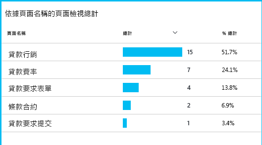

透過找出最多客戶放棄的位置，企業可以思考如何讓更多使用者通過漏斗。By considering where the greatest numbers of customers drop out, the business can work out how to get more users through to the bottom of the funnel. 在某些情況下，可能是使用者體驗 (UX) 失敗 - 例如，很難找到 [下一步] 按鈕，或者指示不太明顯。In some cases, there might be a user experience (UX) failure - for example, the 'next' button is hard to find, or the instructions aren't obvious. 更有可能是因為重要的商業理由放棄：可能是貸款利率太高。More likely, there are more significant business reasons for drop-outs: maybe the loan rates are too high.

無論任何原因，資料都可協助團隊了解使用者在做什麼。Whatever the reasons, the data helps the team work out what users are doing. 此時可以插入更多追蹤呼叫，了解更多細節。More tracking calls can be inserted to work out more detail. TrackEvent() 可以用來計算任何使用者動作，小至個別的按鈕點擊，大到如付清貸款等重要成果。TrackEvent() can be used to count any user actions, from the fine detail of individual button clicks, to significant achievements such as paying off a loan.

團隊一直都有使用者活動的相關資訊。The team is getting used to having information about user activity. 只是現在，每當設計出一個新功能時，就要思考如何取得其使用方式的意見反應。Nowadays, whenever they design a new feature, they work out how they will get feedback about its usage. 團隊如果從一開始就在功能中設計追蹤呼叫，They design tracking calls into the feature from the start. 就可以使用意見反應在每個開發週期中改進功能。They use the feedback to improve the feature in each development cycle.

[深入了解如何追蹤使用量](app-insights-usage-overview.md)。[Read more about tracking usage](app-insights-usage-overview.md).

## 套用 DevOps 週期Apply the DevOps cycle
以上就是一個小組如何使用 Application Insights 來不只是修正個別問題，還改善其開發週期的情況。So that's how one team use Application Insights not just to fix individual issues, but to improve their development lifecycle. 希望這已提供您一些概念，讓您了解 Application Insights 如何協助您在自己的應用程式中進行應用程式效能管理。I hope it has given you some ideas about how Application Insights can help you with application performance management in your own applications.

## 影片Video

> [!VIDEO https://channel9.msdn.com/events/Connect/2016/112/player]

## 後續步驟Next steps
視您的應用程式特性而定，您可以從數種方式著手。You can get started in several ways, depending on the characteristics of your application. 請挑選最適合您的方式：Pick what suits you best:

* [ASP.NET Web 應用程式ASP.NET web application](app-insights-asp-net.md)
* [Java Web 應用程式Java web application](app-insights-java-get-started.md)
* [Node.js Web 應用程式Node.js web application](app-insights-nodejs.md)
* 裝載於 [IIS](app-insights-monitor-web-app-availability.md)、[J2EE](app-insights-java-live.md) 或 [Azure](app-insights-azure.md) 上的已部署應用程式。Already deployed apps, hosted on [IIS](app-insights-monitor-web-app-availability.md), [J2EE](app-insights-java-live.md), or [Azure](app-insights-azure.md).
* [網頁](app-insights-javascript.md) - 單頁應用程式或一般網頁 - 單獨使用此選項或作為任何伺服器選項以外的附加選項。[Web pages](app-insights-javascript.md) - Single Page App or ordinary web page - use this on its own or in addition to any of the server options.
* 可從公用網際網路測試您應用程式的[可用性測試](app-insights-monitor-web-app-availability.md)。[Availability tests](app-insights-monitor-web-app-availability.md) to test your app from the public internet.
