# 什麼是 Application Insights？
Application Insights 是多個平台上的 Web 開發人員所適用的可延伸「應用程式效能管理」(APM) 服務。 它使用 toomonitor 即時 web 應用程式。 它將會自動偵測效能異常。 它包括強大的分析工具 toohelp 您診斷問題和 toounderstand 哪些使用者實際執行應用程式。  其設計目的是 toohelp 持續改善效能和可用性。 這也適用於應用程式上各種不同的平台包括.NET、 Node.js 和 J2EE，裝載在內部部署或 hello 雲端中。 它與您的 devOps 程序整合，並已連線點 tooa 各種不同的開發工具。

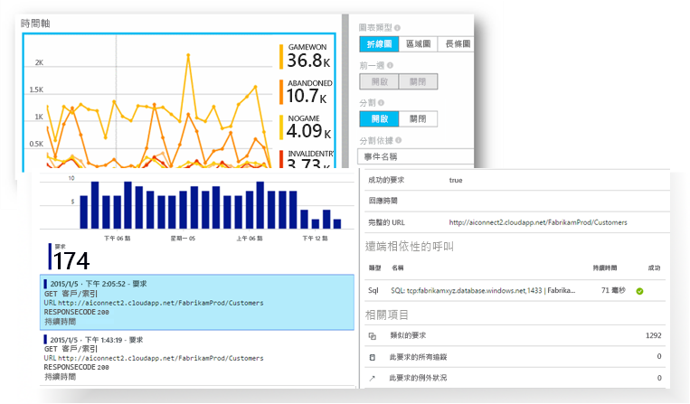

[看看 hello 簡介動畫](https://www.youtube.com/watch?v=fX2NtGrh-Y0)。

## Application Insights 的運作方式
您安裝應用程式中的小型檢測封裝，並設定好 hello Microsoft Azure 入口網站中的 Application Insights 資源。 hello 檢測監視您的應用程式，並傳送遙測資料 toohello 入口網站。 （hello 應用程式可以執行任何位置-沒有 toobe Azure 中裝載）。

您可以檢測不僅 hello web 服務應用程式，而且還要有任何背景元件，並 hello 本身 hello web 網頁中的 JavaScript。 

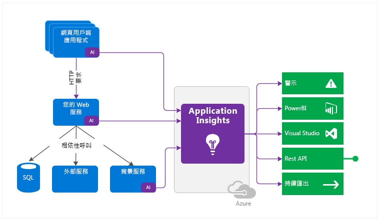

此外，您可以提取遙測的 hello 主機環境，例如效能計數器、 Azure 診斷或 Docker 記錄檔中。 您也可以設定定期傳送綜合要求 tooyour web 服務的 web 測試。

所有這些遙測資料流中經過整合 hello Azure 入口網站，可以套用強大分析與搜尋工具 toohello 未經處理資料。

### Hello 負擔是什麼？
hello 對您的應用程式效能影響會很小。 追蹤呼叫非封鎖性，而且會在個別的執行緒中分批傳送。

## Application Insights 可監視什麼？

Application Insights 旨在 hello 開發團隊，toohelp 您了解如何執行您的應用程式，以及如何被使用。 它可監視︰

* **要求率、回應時間和失敗率** - 找出哪些頁面在每天哪些時段最受歡迎，以及使用者位於何處。 查看哪些頁面的表現最好。 如果您的回應時間和失敗率隨著要求增加而提高，您或許有資源配置問題。 
* **相依比率、回應時間和失敗率** - 找出外部服務是否會使您降低效能。
* **例外狀況**-分析 hello 彙總統計資料，或選擇特定執行個體和下鑽研至 hello 堆疊追蹤和相關的要求。 伺服器和瀏覽器例外狀況都會報告。
* **頁面檢視和載入效能** - 由使用者的瀏覽器報告。
* 來自網頁的 **AJAX 呼叫** - 比率、回應時間和失敗率。
* **使用者和工作階段計數**。
* Windows 或 Linux 伺服器電腦中的**效能計數器**，例如 CPU、記憶體和網路使用量。 
* 來自 Docker 或 Azure 的**主機診斷**。 
* 來自您應用程式的**診斷追蹤記錄檔** - 讓您使追蹤事件與要求相互關聯。
* **自訂事件和度量**，您自行撰寫 hello 用戶端或伺服器程式碼中，tootrack 商務事件，例如項目已售出或遊戲成交。

## 哪裡可以查看我的遙測？

有許多方式 tooexplore 您的資料。 請參閱下列文章：

|  |  |
| --- | --- |
| [**智慧型偵測和手動警示**](app-insights-proactive-diagnostics.md) 警示自動調整 tooyour 應用程式的遙測和觸發程序的一般模式有任務在身時外 hello 一般模式。 您也可以在自訂或標準計量的特定層級上[設定警示](app-insights-alerts.md)。 |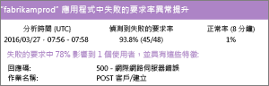 |
| [**應用程式對應**](app-insights-app-map.md) 您的應用程式，警示的關鍵計量與 hello 元件。 |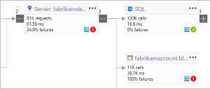  |
| [**分析工具**](app-insights-profiler.md) 檢查 hello 執行設定檔的取樣的要求。 |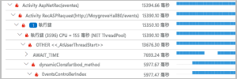 |
| [**使用量分析**](app-insights-usage-overview.md) 分析使用者區隔和保留期。| |
| [**執行個體資料的診斷搜尋**](app-insights-diagnostic-search.md) 搜尋和篩選事件，例如要求、例外狀況、相依性呼叫、記錄追蹤，以及頁面檢視。  |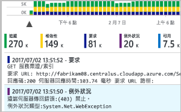 |
| [**彙總資料的計量瀏覽器**](app-insights-metrics-explorer.md) 瀏覽、篩選和分割彙總的資料，例如，要求、錯誤和例外狀況的比率；回應時間、頁面載入時間。 | |
| [**儀表板**](app-insights-dashboards.md#dashboards) 來自多個資源的交互式資料並與其他人員共用。 多元件的應用程式，然後連續顯示 hello 小組室中很棒。 | |
| [**即時計量串流**](app-insights-live-stream.md) 當您部署新組建時，觀賞這些接近即時的效能指標 toomake 確定一切如預期運作。 |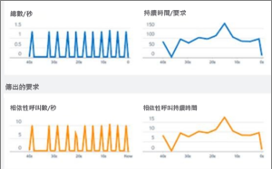 |
| [**分析**](app-insights-analytics.md) 使用這個功能強大的查詢語言，回答有關您應用程式效能和使用方式的艱難問題。 |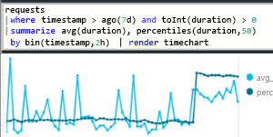 |
| [**Visual Studio**](app-insights-visual-studio.md) 請參閱 hello 程式碼中的效能資料。 移 toocode 從堆疊追蹤。|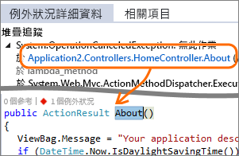 |
| [**快照集偵錯工具**](app-insights-snapshot-debugger.md) 使用參數值，對取樣自即時作業的快照集進行偵錯。|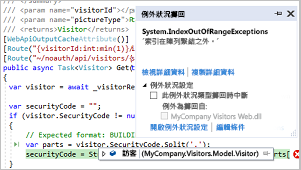 |
| [**Power BI**](app-insights-export-power-bi.md) 整合使用量計量和其他商業智慧。| 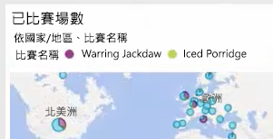|
| [**REST API**](https://dev.applicationinsights.io/) 撰寫程式碼 toorun 查詢透過您的度量和原始資料。| 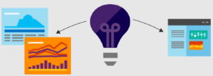 |
| [**連續匯出**](app-insights-export-telemetry.md) 到達時，大量匯出的未經處理資料 toostorage。 |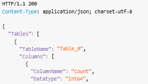 |

## 如何使用 Application Insights？

### 監視
在應用程式中安裝 Application Insights、設定[可用性 Web 測試](app-insights-monitor-web-app-availability.md)，以及︰

* 設定[儀表板](app-insights-dashboards.md)載入、 回應性，與 hello 效能的程式相依性，您小組室 tookeep，頁面載入和 AJAX 呼叫。
* 探索哪些是最慢的 hello 和大部分的失敗要求。
* 監看式[即時資料流](app-insights-live-stream.md)當您部署新的版本，tooknow 立即有關任何降低的情形。

### 偵測、診斷
當您收到警示或發現問題︰

* 評估有多少使用者受到影響。
* 將失敗與例外狀況、相依項目呼叫和追蹤相互關聯。
* 檢查分析工具、快照集、堆疊傾印和追蹤記錄。

### 建置、測量、學習
[測量 hello 效能](app-insights-usage-overview.md)的每個您所部署的新功能。

* 計劃 toomeasure 客戶如何使用新的 UX 或商務功能。
* 在程式碼中撰寫自訂遙測。
* 從您的遙測基底 hello 下一個開發循環上硬碟的辨識項。

## 開始使用
Application Insights 是 hello 的裝載於 Microsoft Azure 和遙測中的許多服務有傳送進行分析及簡報。 讓您執行其他動作之前，您需要訂用帳戶太[Microsoft Azure](http://azure.com)。 免費 toosign，而且如果您選擇 hello 基本[定價方案](https://azure.microsoft.com/pricing/details/application-insights/)的 Application Insights 是免費直到您的應用程式變得 toohave 大量使用。 如果您的組織已有訂用帳戶，他們可以加入您的 Microsoft 帳戶 tooit。

有數種方式啟動 tooget。 從最適合您的方式著手。 您可以加入稍後 hello 其他人。

* **在執行階段： 檢測 hello 伺服器上的 web 應用程式。** 可避免任何更新 toohello 程式碼。 您需要系統管理員存取 tooyour 伺服器。
  * [**內部部署或 VM 上的 IIS**](app-insights-monitor-performance-live-website-now.md)
  * [**Azure Web 應用程式或 VM**](app-insights-monitor-performance-live-website-now.md)
  * [**J2EE**](app-insights-java-live.md)
* **在開發階段： 加入 Application Insights tooyour 程式碼。** 可讓您 toowrite 自訂遙測和 tooinstrument 後端及桌面應用程式。
  * [Visual Studio](app-insights-asp-net.md) 2013 Update 2 或更新版本。
  * [Eclipse](app-insights-java-eclipse.md) 或 [其他工具](app-insights-java-get-started.md) 中的 Java
  * [Node.js](app-insights-nodejs.md)
  * [其他平台](app-insights-platforms.md)
* **[檢測您的網頁](app-insights-javascript.md)**的頁面檢視、AJAX 和其他用戶端遙測。
* **[可用性集合](app-insights-monitor-web-app-availability.md)** - 定期從我們的伺服器 ping 您的網站。

## 後續步驟
在執行階段開始使用︰

* [IIS 伺服器](app-insights-monitor-performance-live-website-now.md)
* [J2EE 伺服器](app-insights-java-live.md)

在開發階段開始使用︰

* [ASP.NET](app-insights-asp-net.md)
* [Java](app-insights-java-get-started.md)
* [Node.js](app-insights-nodejs.md)

## 支援與意見反應
* 疑難排解與問題：
  * [疑難排解][qna]
  * [MSDN 論壇](https://social.msdn.microsoft.com/Forums/vstudio/home?forum=ApplicationInsights)
  * [StackOverflow](http://stackoverflow.com/questions/tagged/ms-application-insights)
* 您的建議：
  * [UserVoice](https://visualstudio.uservoice.com/forums/357324)
* 部落格：
  * [Application Insights 部落格](https://azure.microsoft.com/blog/tag/application-insights)

## 影片

[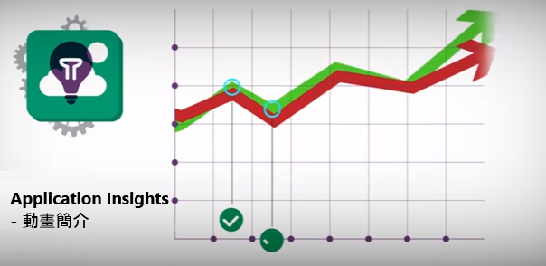](https://www.youtube.com/watch?v=fX2NtGrh-Y0)

> [!VIDEO https://channel9.msdn.com/events/Connect/2016/100/player] 

<!--Link references-->

[android]: https://github.com/Microsoft/ApplicationInsights-Android
[azure]: ../insights-perf-analytics.md
[client]: app-insights-javascript.md
[desktop]: app-insights-windows-desktop.md
[detect]: app-insights-detect-triage-diagnose.md
[greenbrown]: app-insights-asp-net.md
[ios]: https://github.com/Microsoft/ApplicationInsights-iOS
[java]: app-insights-java-get-started.md
[knowUsers]: app-insights-web-track-usage.md
[platforms]: app-insights-platforms.md
[portal]: http://portal.azure.com/
[qna]: app-insights-troubleshoot-faq.md
[redfield]: app-insights-monitor-performance-live-website-now.md
