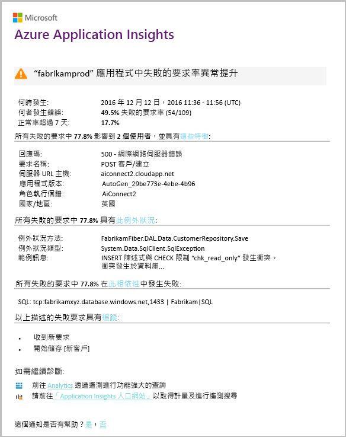

# 智慧型偵測 - 失敗異常
[Application Insights](app-insights-overview.md)自動通知您幾近即時如果您的 web 應用程式遇到 hello 的失敗要求率異常升高。 它會偵測的 HTTP 要求或報告為失敗的相依性呼叫的 hello 率異常升高。 對於要求，失敗的要求通常是回應碼為 400 或更高的要求。 toohelp 分級，並診斷 hello 問題，hello 通知中提供的 hello 特性 hello 失敗及相關的遙測分析。 也有連結 toohello Application Insights 入口網站，以供進一步診斷。 hello 功能需要任何設定或組態，因為它會使用機器學習演算法 toopredict hello 正常失敗率。

這項功能適用於 Java 和 ASP.NET web 應用程式，裝載於雲端 hello 或您自己的伺服器上。 它也適用於產生要求或相依性遙測的任何應用程式 - 例如，如果您有呼叫 [TrackRequest()](app-insights-api-custom-events-metrics.md#trackrequest) 或 [TrackDependency()](app-insights-api-custom-events-metrics.md#trackdependency) 的背景工作角色。

設定好後[Application Insights 專案](app-insights-overview.md)，並提供您的應用程式會產生某些最小量的遙測，智慧失敗異常偵測採用 24 小時您的應用程式，它前面的 toolearn hello 正常行為會開啟，而且可以傳送警示。

以下是警示範例。

> [!NOTE]
> 根據預設，您所取得的郵件格式會比這個範例還簡短。 不過您也可以[交換器 toothis 詳細的格式](#configure-alerts)。
>
>

請注意，它會告訴您︰

* hello 失敗率比較 toonormal 應用程式行為。
* 受影響的使用者人數 – 讓您知道多少 tooworry。
* Hello 失敗相關聯的特性模式。 在此範例中，有特定的回應碼、要求名稱 (操作) 和應用程式版本。 立即會告訴您其中 toostart 尋找程式碼中。 其他可能性則可能是特定的瀏覽器或用戶端作業系統。
* hello 例外狀況、 記錄追蹤和顯示 toobe hello 與相關聯的相依性失敗 （資料庫或其他外部元件） 來區別失敗。
* 直接連結在 Application Insights 中的 hello 遙測 toorelevant 搜尋。

## 智慧型偵測的優點
一般的 [度量警示](app-insights-alerts.md) 會告訴您可能有問題。 但是智慧偵測開始為您執行許多原本必須另外 toodo 自行 hello 分析 hello 診斷工作。 您快速 hello 結果整齊地在封裝中，可幫助您 tooget toohello 根目錄 hello 問題。

## 運作方式
智慧型偵測監視 hello 遙測接收從您的應用程式，並在特定的 hello 失敗率。 此規則會計算哪些 hello 要求的 hello 數目`Successful request`屬性為 false，而且會呼叫哪個 hello hello 相依性數目`Successful call`屬性為 false。 根據預設的要求， `Successful request == (resultCode < 400)` (除非您已經撰寫自訂程式碼太[篩選](app-insights-api-filtering-sampling.md#filtering)產生您自己或[TrackRequest](app-insights-api-custom-events-metrics.md#trackrequest)呼叫)。 

您的應用程式效能具有一般的行為模式。 部分要求或相依性呼叫將會更容易出錯 toofailure 比其他;和 hello 整體的失敗率可能向上負載增加時。 智慧型偵測會使用機器學習 toofind 這些異常狀況。

遙測進入 Application Insights 從您的 web 應用程式，智慧偵測會比較 hello 目前的行為與 hello 模式透過 hello 看到過去幾天。 如果觀察到與先前效能相比，失敗率異常提高，就會觸發分析。

分析觸發時，hello 服務叢集對執行分析 hello 失敗的要求，tootry tooidentify 歸納 hello 失敗的值的模式。 Hello 上述範例中，在 hello 分析已探索最多失敗所需特定結果碼，要求名稱、 伺服器 URL 主機和角色執行個體。 相反地，hello 分析已發現，hello 用戶端作業系統屬性會分散至多個值，因此未列。

當您的服務會使用這些遙測呼叫檢測時，hello 分析會尋找例外狀況，而且其已識別，以及任何與相關聯的追蹤記錄檔的範例 hello 叢集中的要求相關聯的相依性失敗要求。

hello 產生分析會與警示，傳送 tooyou，除非您已無法供設定。

像 hello[您手動設定的警示](app-insights-alerts.md)，您可以檢查 hello hello 警示狀態和設定在 hello 警示刀鋒視窗中的 Application Insights 資源。 但不同於其他警示，您不需要 tooset 註冊，或設定智慧型偵測。 若有需要，您可以將它停用或變更其目標電子郵件地址。

## 設定警示
您可以停用智慧偵測、 變更 hello 電子郵件收件者、 建立 webhook，或選擇加入詳細的 toomore 警示訊息。

開啟 hello 警示 頁面。 失敗的異常狀況隨附以及任何您已手動設定，且您可以查看其是否目前在 hello 警示狀態的警示。

![在 hello 概觀頁面上，按一下警示磚。 或在任何 [度量] 頁面上，按一下 [警示] 按鈕。](./media/app-insights-proactive-failure-diagnostics/021.png)

按一下 hello 警示 tooconfigure 它。

請注意，您可以停用「智慧型偵測」，但無法將它刪除 (或建立另一個「智慧型偵測」)。

#### 詳細的警示
如果您選取 「 取得更詳細的診斷 」 hello 電子郵件會包含更多診斷資訊。 有時候您可能會無法 toodiagnose hello 問題只從 hello 電子郵件中的 hello 資料。

沒有 hello 更詳細的警示有稍微風險可能包含機密資訊，因為它包含例外狀況和追蹤訊息。 不過，只有當您的程式碼允許機密資訊進入這些訊息時，才會發生。

## 分級和診斷警示
警示表示偵測 hello 失敗的要求率異常升高。 原因可能是您的應用程式或其環境有問題。

您可以從 hello 要求以及受影響的使用者數目的百分比，決定如何緊急 hello 問題是。 Hello 上述範例中，在 hello 失敗率 22.5%的比較與正常率 1%，表示不正確的項目正在進行的作業。 在 hello 另一方面，11 只有使用者受到影響。 如果它是您的應用程式時，您會無法 tooassess 嚴重程度的。

在許多情況下，您會快速地從 hello 要求名稱、 例外狀況，提供相依性失敗和追蹤資料可以 toodiagnose hello 問題。

另有一些線索。 例如，在此範例中的 hello 相依性失敗率為 hello 與 hello 例外狀況率 （89.3%) 相同。 這暗示，hello 例外狀況，就會發生直接從 hello 相依性失敗-讓您清楚瞭解 where toostart 尋找程式碼中。

tooinvestigate 此外，每個區段中的 hello 連結會帶您直線 tooa[搜尋頁面](app-insights-diagnostic-search.md)篩選 toohello 相關要求、 例外狀況、 相依性或追蹤。 您也可以開啟 hello [Azure 入口網站](https://portal.azure.com)，瀏覽您的應用程式的 toohello Application Insights 資源，並開啟 hello 失敗刀鋒視窗。

在此範例中，按一下 hello 檢視相依性失敗詳細資料 連結可開啟 hello Application Insights 搜尋刀鋒視窗。 它會顯示 hello SQL 陳述式具有 hello 根本原因的範例： Null 必要欄位在所提供，並且未通過 hello 儲存作業期間執行的驗證。

## 檢閱最近的警示

按一下**智慧偵測**tooget toohello 最新警示：

## Hello 差異為何...
失敗異常的「智慧型偵測」可以與其他相似但不同的 Application Insights 功能互補。

* 您可以設定[度量警示](app-insights-alerts.md)，且可以檢視各種度量，例如 CPU 使用量、要求率、頁面載入時間等等。 您可以使用這些 toowarn 您，比方說，如果您需要 tooadd 更多資源。 相反地，智慧失敗異常偵測涵蓋您在接近即時的方式之後會大幅增加 web 應用程式的失敗的要求率比較 tooweb 應用程式的小範圍的關鍵度量 （目前只失敗的要求率），設計 toonotify正常的行為。

    智慧型偵測會自動調整其回應 tooprevailing 條件中的臨界值。

    智慧的偵測啟動 hello 為您的診斷工作。
* [智慧型效能異常偵測](app-insights-proactive-performance-diagnostics.md)也會使用電腦智慧 toodiscover 異常模式在您的指標，並由您就不需要設定。 但不同於智慧失敗異常偵測，hello 智慧效能異常偵測的目的是 toofind 區段可能格式不提供您使用複寫-例如，透過瀏覽器對特定類型的特定頁面。 hello 分析執行每日，而且如果找到任何結果，可能 toobe 較緊急比警示。 相反地，失敗有異常的 hello 分析會持續執行傳入的遙測，且將會通知您分鐘內是否大於預期伺服器失敗率。

## 如果您收到「智慧型偵測」警示
*為什麼會收到這個警示？*

* 我們偵測到異常升高的 hello 之前期間的失敗的要求速率與相比較 toohello 正常基準。 在分析後 hello 失敗和相關聯的遙測，我們認為您應該尋找問題。

*Hello 通知意思明確有問題？*

* 我們嘗試 tooalert 上應用程式中斷或降級，但只有您可以完全了解 hello 語意以及 hello 影響 hello 應用程式或使用者。

*所以你們會看到我的資料嗎？*

* 否。 hello 服務是完全自動。 只有您會收到 hello 通知。 您的資料是 [不公開的](app-insights-data-retention-privacy.md)。

*是否有 toosubscribe toothis 警示？*

* 否。 傳送要求遙測每個應用程式有 hello 智慧偵測的警示規則。

*我是否可以取消訂閱或取得改成 toomy 同事傳送 hello 通知？*

* 在警示的規則是，按一下 hello 智慧偵測規則 tooconfigure 它。 您可以停用 hello 警示，或變更 hello 警示的收件者。

*我遺失 hello 電子郵件。其中 hello 入口網站中找到 hello 通知？*

* 在 hello 活動記錄檔。 在 Azure 中，開啟您的應用程式的 hello Application Insights 資源，然後選取 活動記錄檔。

*一些 hello 警示大約已知問題，而且我不想 tooreceive 它們。*

* 我們已在稽核記錄檔中抑制警示。

## 後續步驟
這些診斷工具可協助您檢查您的應用程式的遙測 hello:

* [計量瀏覽器](app-insights-metrics-explorer.md)
* [搜尋總管](app-insights-diagnostic-search.md)
* [分析 - 功能強大的查詢語言](app-insights-analytics-tour.md)

智慧型偵測是完全自動的。 但您可能要 tooset 某些更多的警示嗎？

* [手動設定的度量警示](app-insights-alerts.md)
* [可用性 Web 測試](app-insights-monitor-web-app-availability.md)
