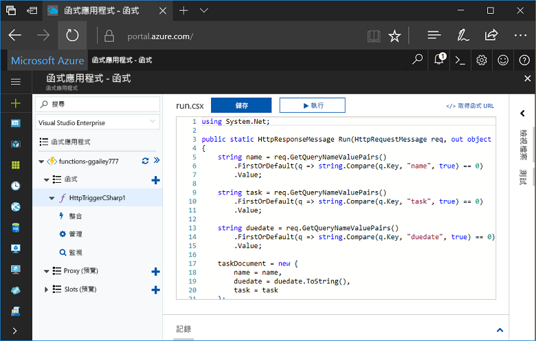
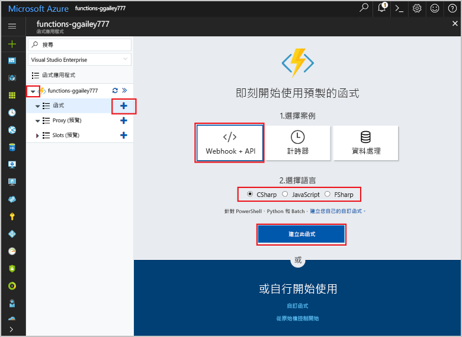
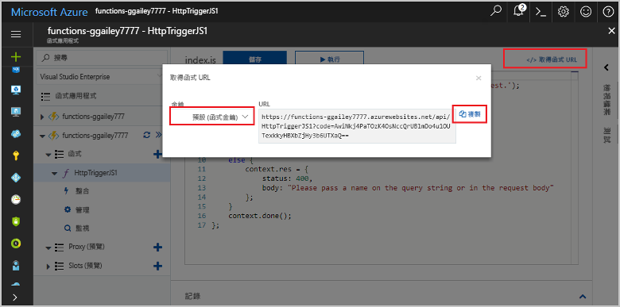
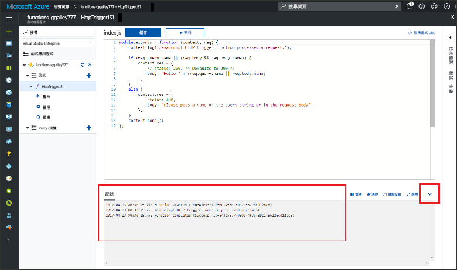

# 在 hello Azure 入口網站中建立您的第一個函式Create your first function in hello Azure portal

Azure 的函式可讓您在無伺服器環境中執行您的程式碼，而不需要 toofirst 建立 VM，或發行 web 應用程式。Azure Functions lets you execute your code in a serverless environment without having toofirst create a VM or publish a web application. 本主題中，了解如何 toouse 函式 toocreate hello Azure 入口網站中的"hello world"函式。In this topic, learn how toouse Functions toocreate a "hello world" function in hello Azure portal.

[!INCLUDE [quickstarts-free-trial-note](../../includes/quickstarts-free-trial-note.md)]

## 登入 tooAzureLog in tooAzure

登入 toohello [Azure 入口網站](https://portal.azure.com/)。Log in toohello [Azure portal](https://portal.azure.com/).

## 建立函數應用程式Create a function app

您必須擁有您的函式的函式應用程式 toohost hello 執行。You must have a function app toohost hello execution of your functions. 函式應用程式可讓您將多個函式群組為邏輯單位，以方便您管理、部署和共用資源。A function app lets you group functions as a logic unit for easier management, deployment, and sharing of resources. 

[!INCLUDE [Create function app Azure portal](../../includes/functions-create-function-app-portal.md)]

[!INCLUDE [functions-portal-favorite-function-apps](../../includes/functions-portal-favorite-function-apps.md)]

接下來，您會在 hello 新函式應用程式中建立函式。Next, you create a function in hello new function app.

## 建立由 HTTP 觸發的函式Create an HTTP triggered function

1. 展開新函式應用程式，然後按一下 hello  **+** 太下一步按鈕**函式**。Expand your new function app, then click hello **+** button next too**Functions**.

2.  在 hello**快速入門**頁面上，選取**WebHook + API**，**選擇的語言**函式，然後按一下**建立此函數**.In hello **Get started quickly** page, select **WebHook + API**, **Choose a language** for your function, and click **Create this function**. 
   
    

函式會建立在選擇 HTTP 觸發函式使用 hello 範本的語言。A function is created in your chosen language using hello template for an HTTP triggered function. 您可以藉由傳送 HTTP 要求執行 hello 新函式。You can run hello new function by sending an HTTP request.

## 測試 hello 函式Test hello function

1. 在新的函式中，按一下 </> 取得函式 URL，選取 預設 (函式索引鍵)，然後按一下複製。In your new function, click **</> Get function URL**, select **default (Function key)**, and then click **Copy**. 

    

2. 貼入瀏覽器的網址列中的 hello 函式的 URL。Paste hello function URL into your browser's address bar. 附加 hello 查詢字串`&name=<yourname>`toothis URL 和按 hello`Enter`您鍵盤 tooexecute hello 要求金鑰。Append hello query string `&name=<yourname>` toothis URL and press hello `Enter` key on your keyboard tooexecute hello request. hello 以下是 hello 回應 hello Edge 瀏覽器中的 hello 函式所傳回的範例：hello following is an example of hello response returned by hello function in hello Edge browser:

    

    URL 包含索引鍵所需，根據預設，tooaccess hello 要求您透過 HTTP 的函式。hello request URL includes a key that is required, by default, tooaccess your function over HTTP.   

3. 當您的函式執行時，追蹤資訊會寫入 toohello 記錄檔。When your function runs, trace information is written toohello logs. toosee hello 追蹤輸出，從上一個執行 hello，tooyour 函式傳回 hello 入口網站中，按一下向上箭號，在 hello 底部 hello 螢幕 tooexpand hello**記錄**。toosee hello trace output from hello previous execution, return tooyour function in hello portal and click hello up arrow at hello bottom of hello screen tooexpand **Logs**. 

   

## 清除資源Clean up resources

[!INCLUDE [Clean up resources](../../includes/functions-quickstart-cleanup.md)]

## 後續步驟Next steps

您已使用簡單的 HTTP 觸發函式建立了函式應用程式。You have created a function app with a simple HTTP triggered function.  

[!INCLUDE [Next steps note](../../includes/functions-quickstart-next-steps.md)]

如需詳細資訊，請參閱 [Azure Functions HTTP 和 webhook 繫結](functions-bindings-http-webhook.md)。For more information, see [Azure Functions HTTP and webhook bindings](functions-bindings-http-webhook.md).

