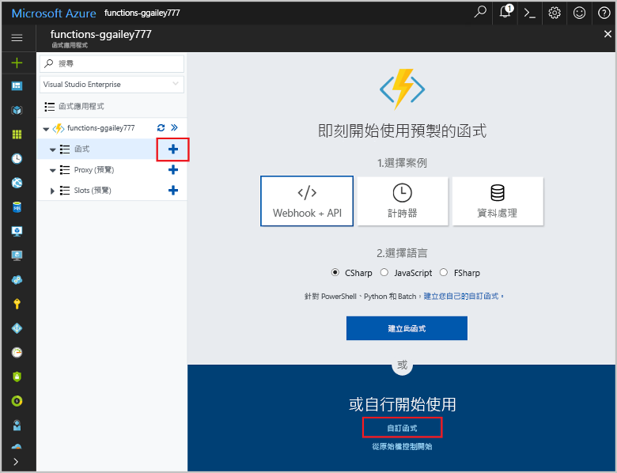

# <a name="create-a-function-triggered-by-a-generic-webhook"></a><span data-ttu-id="cf4d9-103">建立由泛型 Webhook 所觸發的函式</span><span class="sxs-lookup"><span data-stu-id="cf4d9-103">Create a function triggered by a generic webhook</span></span>

<span data-ttu-id="cf4d9-104">Azure Functions 可讓您在無伺服器環境中執行程式碼，而不需要先建立 VM 或發佈 Web 應用程式。</span><span class="sxs-lookup"><span data-stu-id="cf4d9-104">Azure Functions lets you execute your code in a serverless environment without having to first create a VM or publish a web application.</span></span> <span data-ttu-id="cf4d9-105">例如，您可以設定由 Azure 監視器引發之警示所觸發的函式。</span><span class="sxs-lookup"><span data-stu-id="cf4d9-105">For example, you can configure a function to be triggered by an alert raised by Azure Monitor.</span></span> <span data-ttu-id="cf4d9-106">本主題示範如何在將資源群組新增至訂用帳戶時執行 C# 程式碼。</span><span class="sxs-lookup"><span data-stu-id="cf4d9-106">This topic shows you how to execute C# code when a resource group is added to your subscription.</span></span>   


## <a name="prerequisites"></a><span data-ttu-id="cf4d9-108">必要條件</span><span class="sxs-lookup"><span data-stu-id="cf4d9-108">Prerequisites</span></span> 

<span data-ttu-id="cf4d9-109">若要完成本教學課程：</span><span class="sxs-lookup"><span data-stu-id="cf4d9-109">To complete this tutorial:</span></span>

+ <span data-ttu-id="cf4d9-110">如果您沒有 Azure 訂用帳戶，請在開始前建立 [免費帳戶](https://azure.microsoft.com/free/?WT.mc_id=A261C142F) 。</span><span class="sxs-lookup"><span data-stu-id="cf4d9-110">If you don't have an Azure subscription, create a [free account](https://azure.microsoft.com/free/?WT.mc_id=A261C142F) before you begin.</span></span>

[!INCLUDE [functions-portal-favorite-function-apps](../../includes/functions-portal-favorite-function-apps.md)]

## <a name="create-an-azure-function-app"></a><span data-ttu-id="cf4d9-111">建立 Azure 函數應用程式</span><span class="sxs-lookup"><span data-stu-id="cf4d9-111">Create an Azure Function app</span></span>

[!INCLUDE [Create function app Azure portal](../../includes/functions-create-function-app-portal.md)]

<span data-ttu-id="cf4d9-112">接下來，您要在新的函式應用程式中建立函式。</span><span class="sxs-lookup"><span data-stu-id="cf4d9-112">Next, you create a function in the new function app.</span></span>

## <span data-ttu-id="cf4d9-113"><a name="create-function"></a>建立由泛型 Webhook 所觸發的函式</span><span class="sxs-lookup"><span data-stu-id="cf4d9-113"><a name="create-function"></a>Create a generic webhook triggered function</span></span>

1. <span data-ttu-id="cf4d9-114">展開函式應用程式，然後按一下 [Functions] 旁的 [+] 按鈕。</span><span class="sxs-lookup"><span data-stu-id="cf4d9-114">Expand your function app and click the **+** button next to **Functions**.</span></span> <span data-ttu-id="cf4d9-115">如果這個函式是您函式應用程式中的第一個函式，請選取 [自訂函式]。</span><span class="sxs-lookup"><span data-stu-id="cf4d9-115">If this function is the first one in your function app, select **Custom function**.</span></span> <span data-ttu-id="cf4d9-116">這會顯示一組完整的函式範本。</span><span class="sxs-lookup"><span data-stu-id="cf4d9-116">This displays the complete set of function templates.</span></span>

    

2. <span data-ttu-id="cf4d9-118">選取**泛型 WebHook - C#** 範本。</span><span class="sxs-lookup"><span data-stu-id="cf4d9-118">Select the **Generic WebHook - C#** template.</span></span> <span data-ttu-id="cf4d9-119">鍵入您 C# 函式的名稱，然後選取 [建立]。</span><span class="sxs-lookup"><span data-stu-id="cf4d9-119">Type a name for your C# function, then select **Create**.</span></span>

      

2. <span data-ttu-id="cf4d9-121">在您的新函式中，按一下 [取得函式 URL]，然後複製並儲存值。</span><span class="sxs-lookup"><span data-stu-id="cf4d9-121">In your new function, click **</> Get function URL**, then copy and save the value.</span></span> <span data-ttu-id="cf4d9-122">您可以使用此值來設定 Webhook。</span><span class="sxs-lookup"><span data-stu-id="cf4d9-122">You use this value to configure the webhook.</span></span> 

    
         
<span data-ttu-id="cf4d9-124">接下來，您可以在 Azure 監視器的活動記錄警示中建立 Webhook 端點。</span><span class="sxs-lookup"><span data-stu-id="cf4d9-124">Next, you create a webhook endpoint in an activity log alert in Azure Monitor.</span></span> 

## <a name="create-an-activity-log-alert"></a><span data-ttu-id="cf4d9-125">建立活動記錄警示</span><span class="sxs-lookup"><span data-stu-id="cf4d9-125">Create an activity log alert</span></span>

1. <span data-ttu-id="cf4d9-126">在 Azure 入口網站中，巡覽至 [監視器] 服務，選取 [警示]，然後按一下 [新增活動記錄警示]。</span><span class="sxs-lookup"><span data-stu-id="cf4d9-126">In the Azure portal, navigate to the **Monitor** service, select **Alerts**, and click **Add activity log alert**.</span></span>   

    

2. <span data-ttu-id="cf4d9-128">使用表格中所指定的設定︰</span><span class="sxs-lookup"><span data-stu-id="cf4d9-128">Use the settings as specified in the table:</span></span>

    

    | <span data-ttu-id="cf4d9-130">設定</span><span class="sxs-lookup"><span data-stu-id="cf4d9-130">Setting</span></span>      |  <span data-ttu-id="cf4d9-131">建議的值</span><span class="sxs-lookup"><span data-stu-id="cf4d9-131">Suggested value</span></span>   | <span data-ttu-id="cf4d9-132">說明</span><span class="sxs-lookup"><span data-stu-id="cf4d9-132">Description</span></span>                              |
    | ------------ |  ------- | -------------------------------------------------- |
    | <span data-ttu-id="cf4d9-133">**活動記錄警示名稱**</span><span class="sxs-lookup"><span data-stu-id="cf4d9-133">**Activity log alert name**</span></span> | <span data-ttu-id="cf4d9-134">resource-group-create-alert</span><span class="sxs-lookup"><span data-stu-id="cf4d9-134">resource-group-create-alert</span></span> | <span data-ttu-id="cf4d9-135">活動記錄警示的名稱。</span><span class="sxs-lookup"><span data-stu-id="cf4d9-135">Name of the activity log alert.</span></span> |
    | <span data-ttu-id="cf4d9-136">**訂用帳戶**</span><span class="sxs-lookup"><span data-stu-id="cf4d9-136">**Subscription**</span></span> | <span data-ttu-id="cf4d9-137">您的訂用帳戶</span><span class="sxs-lookup"><span data-stu-id="cf4d9-137">Your subscription</span></span> | <span data-ttu-id="cf4d9-138">您將在本教學課程中使用的訂用帳戶。</span><span class="sxs-lookup"><span data-stu-id="cf4d9-138">The subscription you are using for this tutorial.</span></span> | 
    |  <span data-ttu-id="cf4d9-139">**資源群組**</span><span class="sxs-lookup"><span data-stu-id="cf4d9-139">**Resource Group**</span></span> | <span data-ttu-id="cf4d9-140">myResourceGroup</span><span class="sxs-lookup"><span data-stu-id="cf4d9-140">myResourceGroup</span></span> | <span data-ttu-id="cf4d9-141">警示資源所要部署的目標資源群組。</span><span class="sxs-lookup"><span data-stu-id="cf4d9-141">The resource group that the alert resources are deployed to.</span></span> <span data-ttu-id="cf4d9-142">使用相同的資源群組作為您的函式應用程式，就可以輕鬆地讓您在完成教學課程之後予以清除。</span><span class="sxs-lookup"><span data-stu-id="cf4d9-142">Using the same resource group as your function app makes it easier to clean up after you complete the tutorial.</span></span> |
    | <span data-ttu-id="cf4d9-143">**事件類別目錄**</span><span class="sxs-lookup"><span data-stu-id="cf4d9-143">**Event category**</span></span> | <span data-ttu-id="cf4d9-144">管理</span><span class="sxs-lookup"><span data-stu-id="cf4d9-144">Administrative</span></span> | <span data-ttu-id="cf4d9-145">此類別目錄包含對 Azure 資源所做的變更。</span><span class="sxs-lookup"><span data-stu-id="cf4d9-145">This category includes changes made to Azure resources.</span></span>  |
    | <span data-ttu-id="cf4d9-146">**資源類型**</span><span class="sxs-lookup"><span data-stu-id="cf4d9-146">**Resource type**</span></span> | <span data-ttu-id="cf4d9-147">資源群組</span><span class="sxs-lookup"><span data-stu-id="cf4d9-147">Resource groups</span></span> | <span data-ttu-id="cf4d9-148">將警示篩選至資源群組活動。</span><span class="sxs-lookup"><span data-stu-id="cf4d9-148">Filters alerts to resource group activities.</span></span> |
    | <span data-ttu-id="cf4d9-149">**資源群組**</span><span class="sxs-lookup"><span data-stu-id="cf4d9-149">**Resource Group**</span></span><br/><span data-ttu-id="cf4d9-150">和**資源**</span><span class="sxs-lookup"><span data-stu-id="cf4d9-150">and **Resource**</span></span> | <span data-ttu-id="cf4d9-151">全部</span><span class="sxs-lookup"><span data-stu-id="cf4d9-151">All</span></span> | <span data-ttu-id="cf4d9-152">監視所有資源。</span><span class="sxs-lookup"><span data-stu-id="cf4d9-152">Monitor all resources.</span></span> |
    | <span data-ttu-id="cf4d9-153">**作業名稱**</span><span class="sxs-lookup"><span data-stu-id="cf4d9-153">**Operation name**</span></span> | <span data-ttu-id="cf4d9-154">建立資源群組</span><span class="sxs-lookup"><span data-stu-id="cf4d9-154">Create Resource Group</span></span> | <span data-ttu-id="cf4d9-155">將警示篩選至建立作業。</span><span class="sxs-lookup"><span data-stu-id="cf4d9-155">Filters alerts to create operations.</span></span> |
    | <span data-ttu-id="cf4d9-156">**Level**</span><span class="sxs-lookup"><span data-stu-id="cf4d9-156">**Level**</span></span> | <span data-ttu-id="cf4d9-157">資訊</span><span class="sxs-lookup"><span data-stu-id="cf4d9-157">Informational</span></span> | <span data-ttu-id="cf4d9-158">包含資訊層級警示。</span><span class="sxs-lookup"><span data-stu-id="cf4d9-158">Include informational level alerts.</span></span> | 
    | <span data-ttu-id="cf4d9-159">**狀態**</span><span class="sxs-lookup"><span data-stu-id="cf4d9-159">**Status**</span></span> | <span data-ttu-id="cf4d9-160">Succeeded</span><span class="sxs-lookup"><span data-stu-id="cf4d9-160">Succeeded</span></span> | <span data-ttu-id="cf4d9-161">將警示篩選至已順利完成的動作。</span><span class="sxs-lookup"><span data-stu-id="cf4d9-161">Filters alerts to actions that have completed successfully.</span></span> |
    | <span data-ttu-id="cf4d9-162">**動作群組**</span><span class="sxs-lookup"><span data-stu-id="cf4d9-162">**Action group**</span></span> | <span data-ttu-id="cf4d9-163">新增</span><span class="sxs-lookup"><span data-stu-id="cf4d9-163">New</span></span> | <span data-ttu-id="cf4d9-164">建立新的動作群組，以定義引發警示時所採取的動作。</span><span class="sxs-lookup"><span data-stu-id="cf4d9-164">Create a new action group, which defines the action takes when an alert is raised.</span></span> |
    | <span data-ttu-id="cf4d9-165">**動作群組名稱**</span><span class="sxs-lookup"><span data-stu-id="cf4d9-165">**Action group name**</span></span> | <span data-ttu-id="cf4d9-166">function-webhook</span><span class="sxs-lookup"><span data-stu-id="cf4d9-166">function-webhook</span></span> | <span data-ttu-id="cf4d9-167">用於識別動作群組的名稱。</span><span class="sxs-lookup"><span data-stu-id="cf4d9-167">A name to identify the action group.</span></span>  | 
    | <span data-ttu-id="cf4d9-168">**簡短名稱**</span><span class="sxs-lookup"><span data-stu-id="cf4d9-168">**Short name**</span></span> | <span data-ttu-id="cf4d9-169">funcwebhook</span><span class="sxs-lookup"><span data-stu-id="cf4d9-169">funcwebhook</span></span> | <span data-ttu-id="cf4d9-170">動作群組的簡短名稱。</span><span class="sxs-lookup"><span data-stu-id="cf4d9-170">A short name for the action group.</span></span> |  

3. <span data-ttu-id="cf4d9-171">在 [動作] 中，使用如下表中所指定的設定來新增動作：</span><span class="sxs-lookup"><span data-stu-id="cf4d9-171">In **Actions**, add an action using the settings as specified in the table:</span></span> 

    

    | <span data-ttu-id="cf4d9-173">設定</span><span class="sxs-lookup"><span data-stu-id="cf4d9-173">Setting</span></span>      |  <span data-ttu-id="cf4d9-174">建議的值</span><span class="sxs-lookup"><span data-stu-id="cf4d9-174">Suggested value</span></span>   | <span data-ttu-id="cf4d9-175">說明</span><span class="sxs-lookup"><span data-stu-id="cf4d9-175">Description</span></span>                              |
    | ------------ |  ------- | -------------------------------------------------- |
    | <span data-ttu-id="cf4d9-176">**名稱**</span><span class="sxs-lookup"><span data-stu-id="cf4d9-176">**Name**</span></span> | <span data-ttu-id="cf4d9-177">CallFunctionWebhook</span><span class="sxs-lookup"><span data-stu-id="cf4d9-177">CallFunctionWebhook</span></span> | <span data-ttu-id="cf4d9-178">動作的名稱。</span><span class="sxs-lookup"><span data-stu-id="cf4d9-178">A name for the action.</span></span> |
    | <span data-ttu-id="cf4d9-179">**動作類型**</span><span class="sxs-lookup"><span data-stu-id="cf4d9-179">**Action type**</span></span> | <span data-ttu-id="cf4d9-180">Webhook</span><span class="sxs-lookup"><span data-stu-id="cf4d9-180">Webhook</span></span> | <span data-ttu-id="cf4d9-181">警示的回應是呼叫 Webhook URL。</span><span class="sxs-lookup"><span data-stu-id="cf4d9-181">The response to the alert is that a Webhook URL is called.</span></span> |
    | <span data-ttu-id="cf4d9-182">**詳細資料**</span><span class="sxs-lookup"><span data-stu-id="cf4d9-182">**Details**</span></span> | <span data-ttu-id="cf4d9-183">函式 URL</span><span class="sxs-lookup"><span data-stu-id="cf4d9-183">Function URL</span></span> | <span data-ttu-id="cf4d9-184">貼上您之前複製之函式的 Webhook URL。</span><span class="sxs-lookup"><span data-stu-id="cf4d9-184">Paste in the webhook URL of the function that you copied earlier.</span></span> |<span data-ttu-id="cf4d9-185">v</span><span class="sxs-lookup"><span data-stu-id="cf4d9-185">v</span></span>

4. <span data-ttu-id="cf4d9-186">按一下 [確定] 以建立警示和動作群組。</span><span class="sxs-lookup"><span data-stu-id="cf4d9-186">Click **OK** to create the alert and action group.</span></span>  

<span data-ttu-id="cf4d9-187">現在，當您在訂用帳戶中建立資源群組時，即會呼叫此 Webhook。</span><span class="sxs-lookup"><span data-stu-id="cf4d9-187">The webhook is now called when a resource group is created in your subscription.</span></span> <span data-ttu-id="cf4d9-188">接下來，您要更新函式中的程式碼，以處理要求主體中的 JSON 記錄資料。</span><span class="sxs-lookup"><span data-stu-id="cf4d9-188">Next, you update the code in your function to handle the JSON log data in the body of the request.</span></span>   

## <a name="update-the-function-code"></a><span data-ttu-id="cf4d9-189">更新函式程式碼</span><span class="sxs-lookup"><span data-stu-id="cf4d9-189">Update the function code</span></span>

1. <span data-ttu-id="cf4d9-190">在入口網站中巡覽回到您的函式應用程式，然後展開您的函式。</span><span class="sxs-lookup"><span data-stu-id="cf4d9-190">Navigate back to your function app in the portal, and expand your function.</span></span> 

2. <span data-ttu-id="cf4d9-191">在入口網站中使用下列程式碼取代函式中的 C# 指令碼：</span><span class="sxs-lookup"><span data-stu-id="cf4d9-191">Replace the C# script code in the function in the portal with the following code:</span></span>

    ```csharp
    #r "Newtonsoft.Json"
    
    using System;
    using System.Net;
    using Newtonsoft.Json;
    using Newtonsoft.Json.Linq;
    
    public static async Task<object> Run(HttpRequestMessage req, TraceWriter log)
    {
        log.Info($"Webhook was triggered!");
    
        // Get the activityLog object from the JSON in the message body.
        string jsonContent = await req.Content.ReadAsStringAsync();
        JToken activityLog = JObject.Parse(jsonContent.ToString())
            .SelectToken("data.context.activityLog");
    
        // Return an error if the resource in the activity log isn't a resource group. 
        if (activityLog == null || !string.Equals((string)activityLog["resourceType"], 
            "Microsoft.Resources/subscriptions/resourcegroups"))
        {
            log.Error("An error occured");
            return req.CreateResponse(HttpStatusCode.BadRequest, new
            {
                error = "Unexpected message payload or wrong alert received."
            });
        }
    
        // Write information about the created resource group to the streaming log.
        log.Info(string.Format("Resource group '{0}' was {1} on {2}.",
            (string)activityLog["resourceGroupName"],
            ((string)activityLog["subStatus"]).ToLower(), 
            (DateTime)activityLog["submissionTimestamp"]));
    
        return req.CreateResponse(HttpStatusCode.OK);    
    }
    ```

<span data-ttu-id="cf4d9-192">現在，您可以在訂用帳戶中建立新的資源群組，來測試此函式。</span><span class="sxs-lookup"><span data-stu-id="cf4d9-192">Now you can test the function by creating a new resource group in your subscription.</span></span>

## <a name="test-the-function"></a><span data-ttu-id="cf4d9-193">測試函式</span><span class="sxs-lookup"><span data-stu-id="cf4d9-193">Test the function</span></span>

1. <span data-ttu-id="cf4d9-194">按一下 Azure 入口網站左側的資源群組圖示，選取 [+ 新增]，鍵入**資源群組名稱**，然後選取 [建立] 以建立空的資源群組。</span><span class="sxs-lookup"><span data-stu-id="cf4d9-194">Click the resource group icon in the left of the Azure portal, select **+ Add**, type a **Resource group name**, and select **Create** to create an empty resource group.</span></span>
    
    

2. <span data-ttu-id="cf4d9-196">返回您的函式並展開 [記錄] 視窗。</span><span class="sxs-lookup"><span data-stu-id="cf4d9-196">Go back to your function and expand the **Logs** window.</span></span> <span data-ttu-id="cf4d9-197">建立資源群組之後，活動記錄警示會觸發 Webhook 並執行函式。</span><span class="sxs-lookup"><span data-stu-id="cf4d9-197">After the resource group is created, the activity log alert triggers the webhook and the function executes.</span></span> <span data-ttu-id="cf4d9-198">您會看到新資源群組的名稱已寫入記錄。</span><span class="sxs-lookup"><span data-stu-id="cf4d9-198">You see the name of the new resource group written to the logs.</span></span>  

    

3. <span data-ttu-id="cf4d9-200">(選擇性) 請返回並刪除您所建立的資源群組。</span><span class="sxs-lookup"><span data-stu-id="cf4d9-200">(Optional) Go back and delete the resource group that you created.</span></span> <span data-ttu-id="cf4d9-201">請注意，此活動不會觸發函式。</span><span class="sxs-lookup"><span data-stu-id="cf4d9-201">Note that this activity doesn't trigger the function.</span></span> <span data-ttu-id="cf4d9-202">這是因為警示已篩選出刪除作業。</span><span class="sxs-lookup"><span data-stu-id="cf4d9-202">This is because delete operations are filtered out by the alert.</span></span> 

## <a name="clean-up-resources"></a><span data-ttu-id="cf4d9-203">清除資源</span><span class="sxs-lookup"><span data-stu-id="cf4d9-203">Clean up resources</span></span>

[!INCLUDE [Next steps note](../../includes/functions-quickstart-cleanup.md)]

## <a name="next-steps"></a><span data-ttu-id="cf4d9-204">後續步驟</span><span class="sxs-lookup"><span data-stu-id="cf4d9-204">Next steps</span></span>

<span data-ttu-id="cf4d9-205">您已建立函式，此函式會在收到泛型 Webhook 所提出的要求時開始執行。</span><span class="sxs-lookup"><span data-stu-id="cf4d9-205">You have created a function that runs when a request is received from a generic webhook.</span></span> 

[!INCLUDE [Next steps note](../../includes/functions-quickstart-next-steps.md)]

<span data-ttu-id="cf4d9-206">如需 Webhook 觸發程序的詳細資訊，請參閱 [Azure Functions HTTP 和 Webhook 繫結](functions-bindings-http-webhook.md)。</span><span class="sxs-lookup"><span data-stu-id="cf4d9-206">For more information about webhook triggers, see [Azure Functions HTTP and webhook bindings](functions-bindings-http-webhook.md).</span></span> <span data-ttu-id="cf4d9-207">若要深入了解如何使用 C# 開發函式，請參閱 [Azure Functions C# 指令碼開發人員參考](functions-reference-csharp.md)。</span><span class="sxs-lookup"><span data-stu-id="cf4d9-207">To learn more about developing functions in C#, see [Azure Functions C# script developer reference](functions-reference-csharp.md).</span></span>

