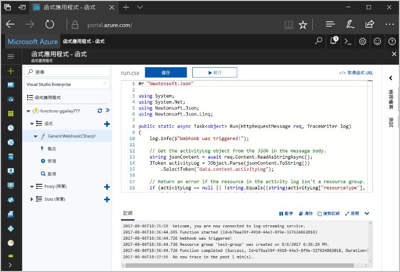
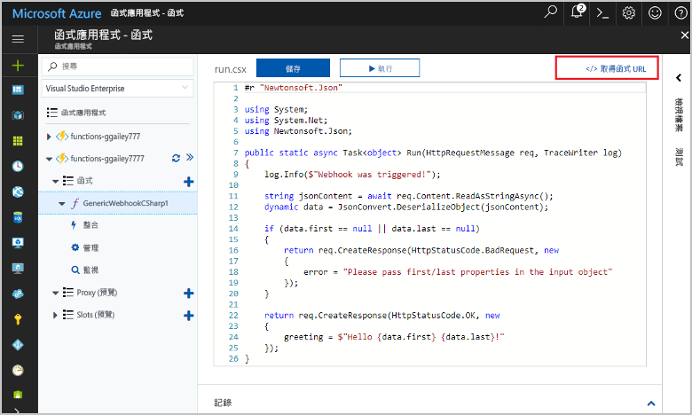
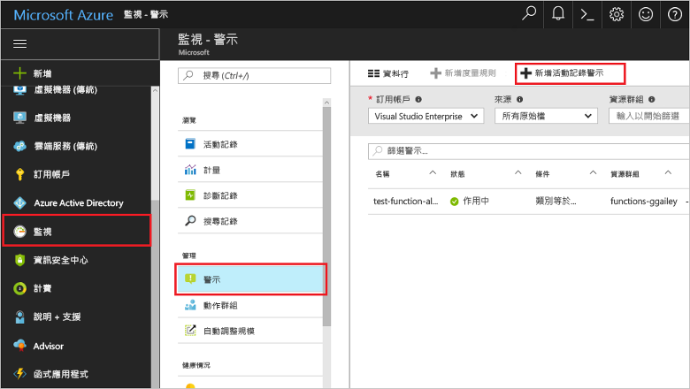
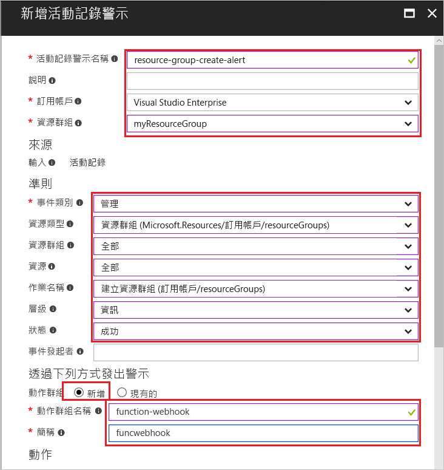
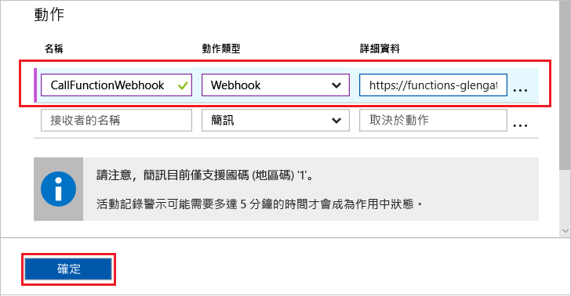
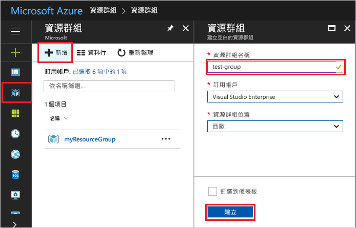
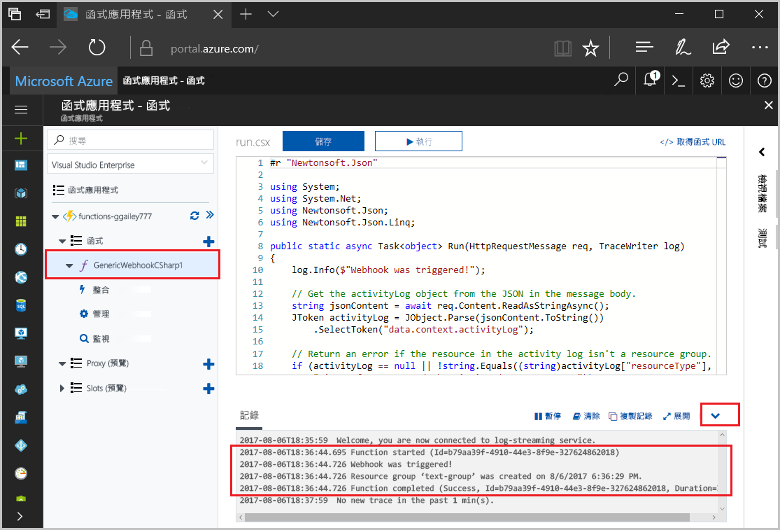

# <a name="create-a-function-triggered-by-a-generic-webhook"></a><span data-ttu-id="b74ab-103">建立由泛型 Webhook 所觸發的函式</span><span class="sxs-lookup"><span data-stu-id="b74ab-103">Create a function triggered by a generic webhook</span></span>

<span data-ttu-id="b74ab-104">Azure 的函式可讓您在無伺服器環境中執行您的程式碼，而不需要 toofirst 建立 VM，或發行 web 應用程式。</span><span class="sxs-lookup"><span data-stu-id="b74ab-104">Azure Functions lets you execute your code in a serverless environment without having toofirst create a VM or publish a web application.</span></span> <span data-ttu-id="b74ab-105">例如，您可以設定由 Azure 監視所產生的警示觸發函式 toobe。</span><span class="sxs-lookup"><span data-stu-id="b74ab-105">For example, you can configure a function toobe triggered by an alert raised by Azure Monitor.</span></span> <span data-ttu-id="b74ab-106">本主題說明如何 tooexecute C# 程式碼的資源群組時加入 tooyour 訂用帳戶。</span><span class="sxs-lookup"><span data-stu-id="b74ab-106">This topic shows you how tooexecute C# code when a resource group is added tooyour subscription.</span></span>   



## <a name="prerequisites"></a><span data-ttu-id="b74ab-108">必要條件</span><span class="sxs-lookup"><span data-stu-id="b74ab-108">Prerequisites</span></span> 

<span data-ttu-id="b74ab-109">toocomplete 本教學課程：</span><span class="sxs-lookup"><span data-stu-id="b74ab-109">toocomplete this tutorial:</span></span>

+ <span data-ttu-id="b74ab-110">如果您沒有 Azure 訂用帳戶，請在開始前建立 [免費帳戶](https://azure.microsoft.com/free/?WT.mc_id=A261C142F) 。</span><span class="sxs-lookup"><span data-stu-id="b74ab-110">If you don't have an Azure subscription, create a [free account](https://azure.microsoft.com/free/?WT.mc_id=A261C142F) before you begin.</span></span>

[!INCLUDE [functions-portal-favorite-function-apps](../../includes/functions-portal-favorite-function-apps.md)]

## <a name="create-an-azure-function-app"></a><span data-ttu-id="b74ab-111">建立 Azure 函數應用程式</span><span class="sxs-lookup"><span data-stu-id="b74ab-111">Create an Azure Function app</span></span>

[!INCLUDE [Create function app Azure portal](../../includes/functions-create-function-app-portal.md)]

<span data-ttu-id="b74ab-112">接下來，您會在 hello 新函式應用程式中建立函式。</span><span class="sxs-lookup"><span data-stu-id="b74ab-112">Next, you create a function in hello new function app.</span></span>

## <span data-ttu-id="b74ab-113"><a name="create-function"></a>建立由泛型 Webhook 所觸發的函式</span><span class="sxs-lookup"><span data-stu-id="b74ab-113"><a name="create-function"></a>Create a generic webhook triggered function</span></span>

1. <span data-ttu-id="b74ab-114">展開您的函式應用程式，然後按一下 hello  **+** 太下一步按鈕**函式**。</span><span class="sxs-lookup"><span data-stu-id="b74ab-114">Expand your function app and click hello **+** button next too**Functions**.</span></span> <span data-ttu-id="b74ab-115">如果此函式是 hello 第一個函式應用程式中的，選取**自訂函式**。</span><span class="sxs-lookup"><span data-stu-id="b74ab-115">If this function is hello first one in your function app, select **Custom function**.</span></span> <span data-ttu-id="b74ab-116">這會顯示 hello 組完整的函式樣板。</span><span class="sxs-lookup"><span data-stu-id="b74ab-116">This displays hello complete set of function templates.</span></span>

    ![在 Azure 入口網站的 hello 函式 [快速入門] 頁面](./media/functions-create-generic-webhook-triggered-function/add-first-function.png)

2. <span data-ttu-id="b74ab-118">選取 hello**泛型 WebHook-C#**範本。</span><span class="sxs-lookup"><span data-stu-id="b74ab-118">Select hello **Generic WebHook - C#** template.</span></span> <span data-ttu-id="b74ab-119">鍵入您 C# 函式的名稱，然後選取 [建立]。</span><span class="sxs-lookup"><span data-stu-id="b74ab-119">Type a name for your C# function, then select **Create**.</span></span>

      

2. <span data-ttu-id="b74ab-121">在新的函數中，按一下  **<> / Get 函式 URL**，然後複製並儲存 hello 值。</span><span class="sxs-lookup"><span data-stu-id="b74ab-121">In your new function, click **</> Get function URL**, then copy and save hello value.</span></span> <span data-ttu-id="b74ab-122">您使用此值 tooconfigure hello webhook。</span><span class="sxs-lookup"><span data-stu-id="b74ab-122">You use this value tooconfigure hello webhook.</span></span> 

    
         
<span data-ttu-id="b74ab-124">接下來，您可以在 Azure 監視器的活動記錄警示中建立 Webhook 端點。</span><span class="sxs-lookup"><span data-stu-id="b74ab-124">Next, you create a webhook endpoint in an activity log alert in Azure Monitor.</span></span> 

## <a name="create-an-activity-log-alert"></a><span data-ttu-id="b74ab-125">建立活動記錄警示</span><span class="sxs-lookup"><span data-stu-id="b74ab-125">Create an activity log alert</span></span>

1. <span data-ttu-id="b74ab-126">在 hello Azure 入口網站中瀏覽 toohello**監視器**服務中，選取**警示**，按一下**新增活動記錄檔警示**。</span><span class="sxs-lookup"><span data-stu-id="b74ab-126">In hello Azure portal, navigate toohello **Monitor** service, select **Alerts**, and click **Add activity log alert**.</span></span>   

    

2. <span data-ttu-id="b74ab-128">使用 hello hello 資料表中所指定的設定：</span><span class="sxs-lookup"><span data-stu-id="b74ab-128">Use hello settings as specified in hello table:</span></span>

    

    | <span data-ttu-id="b74ab-130">設定</span><span class="sxs-lookup"><span data-stu-id="b74ab-130">Setting</span></span>      |  <span data-ttu-id="b74ab-131">建議的值</span><span class="sxs-lookup"><span data-stu-id="b74ab-131">Suggested value</span></span>   | <span data-ttu-id="b74ab-132">說明</span><span class="sxs-lookup"><span data-stu-id="b74ab-132">Description</span></span>                              |
    | ------------ |  ------- | -------------------------------------------------- |
    | <span data-ttu-id="b74ab-133">**活動記錄警示名稱**</span><span class="sxs-lookup"><span data-stu-id="b74ab-133">**Activity log alert name**</span></span> | <span data-ttu-id="b74ab-134">resource-group-create-alert</span><span class="sxs-lookup"><span data-stu-id="b74ab-134">resource-group-create-alert</span></span> | <span data-ttu-id="b74ab-135">Hello 活動記錄檔的警示名稱。</span><span class="sxs-lookup"><span data-stu-id="b74ab-135">Name of hello activity log alert.</span></span> |
    | <span data-ttu-id="b74ab-136">**訂用帳戶**</span><span class="sxs-lookup"><span data-stu-id="b74ab-136">**Subscription**</span></span> | <span data-ttu-id="b74ab-137">您的訂用帳戶</span><span class="sxs-lookup"><span data-stu-id="b74ab-137">Your subscription</span></span> | <span data-ttu-id="b74ab-138">您使用此教學課程中的 hello 訂用帳戶。</span><span class="sxs-lookup"><span data-stu-id="b74ab-138">hello subscription you are using for this tutorial.</span></span> | 
    |  <span data-ttu-id="b74ab-139">**資源群組**</span><span class="sxs-lookup"><span data-stu-id="b74ab-139">**Resource Group**</span></span> | <span data-ttu-id="b74ab-140">myResourceGroup</span><span class="sxs-lookup"><span data-stu-id="b74ab-140">myResourceGroup</span></span> | <span data-ttu-id="b74ab-141">hello hello 警示資源部署至資源群組。</span><span class="sxs-lookup"><span data-stu-id="b74ab-141">hello resource group that hello alert resources are deployed to.</span></span> <span data-ttu-id="b74ab-142">使用在函式應用程式可讓您更輕鬆 tooclean 完成 hello 教學課程之後，hello 相同的資源群組。</span><span class="sxs-lookup"><span data-stu-id="b74ab-142">Using hello same resource group as your function app makes it easier tooclean up after you complete hello tutorial.</span></span> |
    | <span data-ttu-id="b74ab-143">**事件類別目錄**</span><span class="sxs-lookup"><span data-stu-id="b74ab-143">**Event category**</span></span> | <span data-ttu-id="b74ab-144">管理</span><span class="sxs-lookup"><span data-stu-id="b74ab-144">Administrative</span></span> | <span data-ttu-id="b74ab-145">此類別包括 tooAzure 資源所做的變更。</span><span class="sxs-lookup"><span data-stu-id="b74ab-145">This category includes changes made tooAzure resources.</span></span>  |
    | <span data-ttu-id="b74ab-146">**資源類型**</span><span class="sxs-lookup"><span data-stu-id="b74ab-146">**Resource type**</span></span> | <span data-ttu-id="b74ab-147">資源群組</span><span class="sxs-lookup"><span data-stu-id="b74ab-147">Resource groups</span></span> | <span data-ttu-id="b74ab-148">篩選警示 tooresource 群組 」 活動。</span><span class="sxs-lookup"><span data-stu-id="b74ab-148">Filters alerts tooresource group activities.</span></span> |
    | <span data-ttu-id="b74ab-149">**資源群組**</span><span class="sxs-lookup"><span data-stu-id="b74ab-149">**Resource Group**</span></span><br/><span data-ttu-id="b74ab-150">和**資源**</span><span class="sxs-lookup"><span data-stu-id="b74ab-150">and **Resource**</span></span> | <span data-ttu-id="b74ab-151">全部</span><span class="sxs-lookup"><span data-stu-id="b74ab-151">All</span></span> | <span data-ttu-id="b74ab-152">監視所有資源。</span><span class="sxs-lookup"><span data-stu-id="b74ab-152">Monitor all resources.</span></span> |
    | <span data-ttu-id="b74ab-153">**作業名稱**</span><span class="sxs-lookup"><span data-stu-id="b74ab-153">**Operation name**</span></span> | <span data-ttu-id="b74ab-154">建立資源群組</span><span class="sxs-lookup"><span data-stu-id="b74ab-154">Create Resource Group</span></span> | <span data-ttu-id="b74ab-155">篩選警示 toocreate 作業。</span><span class="sxs-lookup"><span data-stu-id="b74ab-155">Filters alerts toocreate operations.</span></span> |
    | <span data-ttu-id="b74ab-156">**Level**</span><span class="sxs-lookup"><span data-stu-id="b74ab-156">**Level**</span></span> | <span data-ttu-id="b74ab-157">資訊</span><span class="sxs-lookup"><span data-stu-id="b74ab-157">Informational</span></span> | <span data-ttu-id="b74ab-158">包含資訊層級警示。</span><span class="sxs-lookup"><span data-stu-id="b74ab-158">Include informational level alerts.</span></span> | 
    | <span data-ttu-id="b74ab-159">**狀態**</span><span class="sxs-lookup"><span data-stu-id="b74ab-159">**Status**</span></span> | <span data-ttu-id="b74ab-160">Succeeded</span><span class="sxs-lookup"><span data-stu-id="b74ab-160">Succeeded</span></span> | <span data-ttu-id="b74ab-161">篩選警示 tooactions 已順利完成。</span><span class="sxs-lookup"><span data-stu-id="b74ab-161">Filters alerts tooactions that have completed successfully.</span></span> |
    | <span data-ttu-id="b74ab-162">**動作群組**</span><span class="sxs-lookup"><span data-stu-id="b74ab-162">**Action group**</span></span> | <span data-ttu-id="b74ab-163">新增</span><span class="sxs-lookup"><span data-stu-id="b74ab-163">New</span></span> | <span data-ttu-id="b74ab-164">建立新的動作群組，定義 hello 動作會引發警示時。</span><span class="sxs-lookup"><span data-stu-id="b74ab-164">Create a new action group, which defines hello action takes when an alert is raised.</span></span> |
    | <span data-ttu-id="b74ab-165">**動作群組名稱**</span><span class="sxs-lookup"><span data-stu-id="b74ab-165">**Action group name**</span></span> | <span data-ttu-id="b74ab-166">function-webhook</span><span class="sxs-lookup"><span data-stu-id="b74ab-166">function-webhook</span></span> | <span data-ttu-id="b74ab-167">此名稱 tooidentify hello 動作群組。</span><span class="sxs-lookup"><span data-stu-id="b74ab-167">A name tooidentify hello action group.</span></span>  | 
    | <span data-ttu-id="b74ab-168">**簡短名稱**</span><span class="sxs-lookup"><span data-stu-id="b74ab-168">**Short name**</span></span> | <span data-ttu-id="b74ab-169">funcwebhook</span><span class="sxs-lookup"><span data-stu-id="b74ab-169">funcwebhook</span></span> | <span data-ttu-id="b74ab-170">Hello 動作群組的簡短名稱。</span><span class="sxs-lookup"><span data-stu-id="b74ab-170">A short name for hello action group.</span></span> |  

3. <span data-ttu-id="b74ab-171">在**動作**，加入使用 hello 設定 hello 資料表中所指定的動作：</span><span class="sxs-lookup"><span data-stu-id="b74ab-171">In **Actions**, add an action using hello settings as specified in hello table:</span></span> 

    

    | <span data-ttu-id="b74ab-173">設定</span><span class="sxs-lookup"><span data-stu-id="b74ab-173">Setting</span></span>      |  <span data-ttu-id="b74ab-174">建議的值</span><span class="sxs-lookup"><span data-stu-id="b74ab-174">Suggested value</span></span>   | <span data-ttu-id="b74ab-175">說明</span><span class="sxs-lookup"><span data-stu-id="b74ab-175">Description</span></span>                              |
    | ------------ |  ------- | -------------------------------------------------- |
    | <span data-ttu-id="b74ab-176">**名稱**</span><span class="sxs-lookup"><span data-stu-id="b74ab-176">**Name**</span></span> | <span data-ttu-id="b74ab-177">CallFunctionWebhook</span><span class="sxs-lookup"><span data-stu-id="b74ab-177">CallFunctionWebhook</span></span> | <span data-ttu-id="b74ab-178">Hello 動作的名稱。</span><span class="sxs-lookup"><span data-stu-id="b74ab-178">A name for hello action.</span></span> |
    | <span data-ttu-id="b74ab-179">**動作類型**</span><span class="sxs-lookup"><span data-stu-id="b74ab-179">**Action type**</span></span> | <span data-ttu-id="b74ab-180">Webhook</span><span class="sxs-lookup"><span data-stu-id="b74ab-180">Webhook</span></span> | <span data-ttu-id="b74ab-181">hello 回應 toohello 警示是稱為 Webhook URL。</span><span class="sxs-lookup"><span data-stu-id="b74ab-181">hello response toohello alert is that a Webhook URL is called.</span></span> |
    | <span data-ttu-id="b74ab-182">**詳細資料**</span><span class="sxs-lookup"><span data-stu-id="b74ab-182">**Details**</span></span> | <span data-ttu-id="b74ab-183">函式 URL</span><span class="sxs-lookup"><span data-stu-id="b74ab-183">Function URL</span></span> | <span data-ttu-id="b74ab-184">貼上您之前複製的 hello 函式的 hello webhook URL 中。</span><span class="sxs-lookup"><span data-stu-id="b74ab-184">Paste in hello webhook URL of hello function that you copied earlier.</span></span> |<span data-ttu-id="b74ab-185">v</span><span class="sxs-lookup"><span data-stu-id="b74ab-185">v</span></span>

4. <span data-ttu-id="b74ab-186">按一下**確定**toocreate hello 警示和動作群組。</span><span class="sxs-lookup"><span data-stu-id="b74ab-186">Click **OK** toocreate hello alert and action group.</span></span>  

<span data-ttu-id="b74ab-187">您的訂用帳戶中建立資源群組時，現在稱為 hello webhook。</span><span class="sxs-lookup"><span data-stu-id="b74ab-187">hello webhook is now called when a resource group is created in your subscription.</span></span> <span data-ttu-id="b74ab-188">接下來，您可以更新 hello 程式碼中您的函式 toohandle hello JSON hello hello 要求主體中的記錄資料。</span><span class="sxs-lookup"><span data-stu-id="b74ab-188">Next, you update hello code in your function toohandle hello JSON log data in hello body of hello request.</span></span>   

## <a name="update-hello-function-code"></a><span data-ttu-id="b74ab-189">更新 hello 函式程式碼</span><span class="sxs-lookup"><span data-stu-id="b74ab-189">Update hello function code</span></span>

1. <span data-ttu-id="b74ab-190">瀏覽後 tooyour 函式的應用程式在 hello 入口網站，然後展開您的函式。</span><span class="sxs-lookup"><span data-stu-id="b74ab-190">Navigate back tooyour function app in hello portal, and expand your function.</span></span> 

2. <span data-ttu-id="b74ab-191">取代下列程式碼的 hello hello 入口網站中的 hello 函式中的 hello C# 指令碼：</span><span class="sxs-lookup"><span data-stu-id="b74ab-191">Replace hello C# script code in hello function in hello portal with hello following code:</span></span>

    ```csharp
    #r "Newtonsoft.Json"
    
    using System;
    using System.Net;
    using Newtonsoft.Json;
    using Newtonsoft.Json.Linq;
    
    public static async Task<object> Run(HttpRequestMessage req, TraceWriter log)
    {
        log.Info($"Webhook was triggered!");
    
        // Get hello activityLog object from hello JSON in hello message body.
        string jsonContent = await req.Content.ReadAsStringAsync();
        JToken activityLog = JObject.Parse(jsonContent.ToString())
            .SelectToken("data.context.activityLog");
    
        // Return an error if hello resource in hello activity log isn't a resource group. 
        if (activityLog == null || !string.Equals((string)activityLog["resourceType"], 
            "Microsoft.Resources/subscriptions/resourcegroups"))
        {
            log.Error("An error occured");
            return req.CreateResponse(HttpStatusCode.BadRequest, new
            {
                error = "Unexpected message payload or wrong alert received."
            });
        }
    
        // Write information about hello created resource group toohello streaming log.
        log.Info(string.Format("Resource group '{0}' was {1} on {2}.",
            (string)activityLog["resourceGroupName"],
            ((string)activityLog["subStatus"]).ToLower(), 
            (DateTime)activityLog["submissionTimestamp"]));
    
        return req.CreateResponse(HttpStatusCode.OK);    
    }
    ```

<span data-ttu-id="b74ab-192">現在您可以在您的訂用帳戶中建立新的資源群組來測試 hello 函式。</span><span class="sxs-lookup"><span data-stu-id="b74ab-192">Now you can test hello function by creating a new resource group in your subscription.</span></span>

## <a name="test-hello-function"></a><span data-ttu-id="b74ab-193">測試 hello 函式</span><span class="sxs-lookup"><span data-stu-id="b74ab-193">Test hello function</span></span>

1. <span data-ttu-id="b74ab-194">按一下 hello 資源群組圖示在 hello hello Azure 入口網站，選取左邊**+ 加**，輸入**資源群組名稱**，然後選取**建立**toocreate 空的資源群組。</span><span class="sxs-lookup"><span data-stu-id="b74ab-194">Click hello resource group icon in hello left of hello Azure portal, select **+ Add**, type a **Resource group name**, and select **Create** toocreate an empty resource group.</span></span>
    
    

2. <span data-ttu-id="b74ab-196">請返回 tooyour 函式，並展開 hello**記錄**視窗。</span><span class="sxs-lookup"><span data-stu-id="b74ab-196">Go back tooyour function and expand hello **Logs** window.</span></span> <span data-ttu-id="b74ab-197">建立 hello 資源群組之後，hello 活動記錄檔的警示觸發程序 hello webhook 和 hello 函式會執行。</span><span class="sxs-lookup"><span data-stu-id="b74ab-197">After hello resource group is created, hello activity log alert triggers hello webhook and hello function executes.</span></span> <span data-ttu-id="b74ab-198">您會看到 hello hello 寫入 toohello 記錄新資源群組名稱。</span><span class="sxs-lookup"><span data-stu-id="b74ab-198">You see hello name of hello new resource group written toohello logs.</span></span>  

    

3. <span data-ttu-id="b74ab-200">（選擇性）請返回並刪除您所建立的 hello 資源群組。</span><span class="sxs-lookup"><span data-stu-id="b74ab-200">(Optional) Go back and delete hello resource group that you created.</span></span> <span data-ttu-id="b74ab-201">請注意，此活動不會觸發 hello 函式。</span><span class="sxs-lookup"><span data-stu-id="b74ab-201">Note that this activity doesn't trigger hello function.</span></span> <span data-ttu-id="b74ab-202">這是因為刪除作業會篩選出 hello 警示。</span><span class="sxs-lookup"><span data-stu-id="b74ab-202">This is because delete operations are filtered out by hello alert.</span></span> 

## <a name="clean-up-resources"></a><span data-ttu-id="b74ab-203">清除資源</span><span class="sxs-lookup"><span data-stu-id="b74ab-203">Clean up resources</span></span>

[!INCLUDE [Next steps note](../../includes/functions-quickstart-cleanup.md)]

## <a name="next-steps"></a><span data-ttu-id="b74ab-204">後續步驟</span><span class="sxs-lookup"><span data-stu-id="b74ab-204">Next steps</span></span>

<span data-ttu-id="b74ab-205">您已建立函式，此函式會在收到泛型 Webhook 所提出的要求時開始執行。</span><span class="sxs-lookup"><span data-stu-id="b74ab-205">You have created a function that runs when a request is received from a generic webhook.</span></span> 

[!INCLUDE [Next steps note](../../includes/functions-quickstart-next-steps.md)]

<span data-ttu-id="b74ab-206">如需 Webhook 觸發程序的詳細資訊，請參閱 [Azure Functions HTTP 和 Webhook 繫結](functions-bindings-http-webhook.md)。</span><span class="sxs-lookup"><span data-stu-id="b74ab-206">For more information about webhook triggers, see [Azure Functions HTTP and webhook bindings](functions-bindings-http-webhook.md).</span></span> <span data-ttu-id="b74ab-207">toolearn 進一步了解開發函式，在 C# 中，請參閱[Azure 函式 C# 指令碼開發人員參考](functions-reference-csharp.md)。</span><span class="sxs-lookup"><span data-stu-id="b74ab-207">toolearn more about developing functions in C#, see [Azure Functions C# script developer reference](functions-reference-csharp.md).</span></span>

