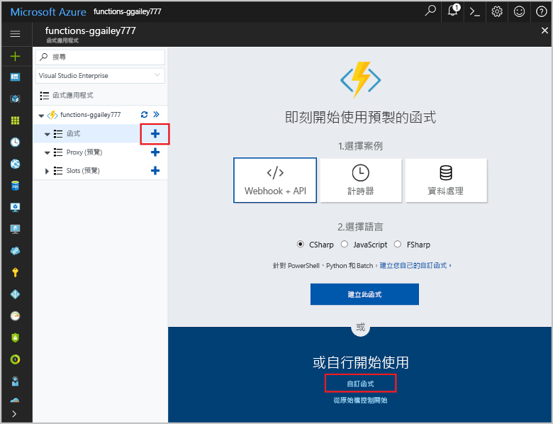

# 建立由 GitHub Webhook 所觸發的函式Create a function triggered by a GitHub webhook

了解如何使用 GitHub 專屬的承載來建立由 HTTP Webhook 要求所觸發的函式。Learn how to create a function that is triggered by an HTTP webhook request with a GitHub-specific payload.

## 必要條件Prerequisites

+ 一個 GitHub 帳戶至少要有一個專案。A GitHub account with at least one project.
+ Azure 訂用帳戶。An Azure subscription. 如果您沒有 Azure 訂用帳戶，請在開始前建立[免費帳戶](https://azure.microsoft.com/free/?WT.mc_id=A261C142F)。If you don't have one, create a [free account](https://azure.microsoft.com/free/?WT.mc_id=A261C142F) before you begin.

[!INCLUDE [functions-portal-favorite-function-apps](../../includes/functions-portal-favorite-function-apps.md)]

## 建立 Azure 函數應用程式Create an Azure Function app

[!INCLUDE [Create function app Azure portal](../../includes/functions-create-function-app-portal.md)]

接下來，您要在新的函式應用程式中建立函式。Next, you create a function in the new function app.

## 建立 GitHub webhook 觸發函式Create a GitHub webhook triggered function

1. 展開函式應用程式，然後按一下 [Functions] 旁的 [+] 按鈕。Expand your function app and click the **+** button next to **Functions**. 如果這是您函式應用程式中的第一個函式，請選取 [自訂函式]。If this is the first function in your function app, select **Custom function**. 這會顯示一組完整的函式範本。This displays the complete set of function templates.

    

2. 針對所需語言選取 **GitHub WebHook** 範本。Select the **GitHub WebHook** template for your desired language. **為您的函式命名**，然後選取 [建立]。**Name your function**, then select **Create**.

      

3. 在您的新函式中，按一下 [</> 取得函式 URL]，然後複製並儲存值。In your new function, click **</> Get function URL**, then copy and save the values. 對 [</> 取得 GitHub 祕密] 執行相同的動作。Do the same thing for **</> Get GitHub secret**. 您可使用這些值在 GitHub 中設定 Webhook。You use these values to configure the webhook in GitHub.

    

接下來，您會在 GitHub 存放庫中建立 Webhook。Next, you create a webhook in your GitHub repository.

## 設定 WebhookConfigure the webhook

1. 在 GitHub 中，瀏覽至您自己的存放庫。In GitHub, navigate to a repository that you own. 您也可以使用已分歧的任何存放庫。You can also use any repository that you have forked. 如果您需要將存放庫分岔，請使用 <https://github.com/Azure-Samples/functions-quickstart>。If you need to fork a repository, use <https://github.com/Azure-Samples/functions-quickstart>.

1. 按一下 [設定]，然後按一下 [Webhook] 和 [新增 Webhook]。Click **Settings**, then click **Webhooks**, and  **Add webhook**.

    

1. 使用資料表中指定的設定，然後按一下 [新增 Webhook]。Use settings as specified in the table, then click **Add webhook**.

    

| 設定Setting | 建議的值Suggested value | 說明Description |
|---|---|---|
| **承載 URL****Payload URL** | 複製的值Copied value | 使用 **</> 取得函式 URL** 所傳回的值。Use the value returned by  **</> Get function URL**. |
| **祕密****Secret**   | 複製的值Copied value | 使用 **</> 取得 GitHub 祕密**所傳回的值。Use the value returned by  **</> Get GitHub secret**. |
| **內容類型****Content type** | application/jsonapplication/json | 函式預期使用 JSON 承載。The function expects a JSON payload. |
| 事件觸發程序Event triggers | 讓我選取個別事件Let me select individual events | 我們只想對問題註解事件來觸發。We only want to trigger on issue comment events.  |
| | 問題註解Issue comment |  |

現在，GitHub Webhook 已設定成在新增問題註解時觸發您的函式。Now, the webhook is configured to trigger your function when a new issue comment is added.

## 測試函式Test the function

1. 在 GitHub 存放庫的新瀏覽器視窗中開啟 [問題] 索引標籤。In your GitHub repository, open the **Issues** tab in a new browser window.

1. 在新視窗中，按一下 [新增問題]，輸入標題，然後按一下 [提交新問題]。In the new window, click **New Issue**, type a title, and then click **Submit new issue**.

1. 在問題中輸入註解，然後按一下 [註解] 。In the issue, type a comment and click **Comment**.

    

1. 返回入口網站，並檢視記錄。Go back to the portal and view the logs. 您應該會看到具有新註解文字的追蹤項目。You should see a trace entry with the new comment text.

     

## 清除資源Clean up resources

[!INCLUDE [Next steps note](../../includes/functions-quickstart-cleanup.md)]

## 後續步驟Next steps

您已建立函式，此函式會在收到 GitHub Webhook 所提出的要求時開始執行。You have created a function that runs when a request is received from a GitHub webhook.

[!INCLUDE [Next steps note](../../includes/functions-quickstart-next-steps.md)]

如需 Webhook 觸發程序的詳細資訊，請參閱 [Azure Functions HTTP 和 Webhook 繫結](functions-bindings-http-webhook.md)。For more information about webhook triggers, see [Azure Functions HTTP and webhook bindings](functions-bindings-http-webhook.md).
