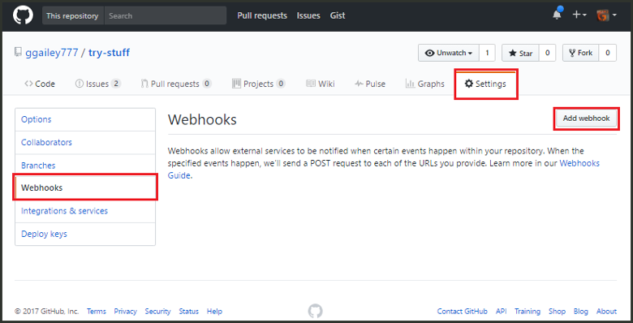

# 建立由 GitHub Webhook 所觸發的函式

深入了解如何 toocreate webhook GitHub 特定裝載與 HTTP 要求所觸發的函式。

## 必要條件

+ 一個 GitHub 帳戶至少要有一個專案。
+ Azure 訂用帳戶。 如果您沒有 Azure 訂用帳戶，請在開始前建立[免費帳戶](https://azure.microsoft.com/free/?WT.mc_id=A261C142F)。

[!INCLUDE [functions-portal-favorite-function-apps](../../includes/functions-portal-favorite-function-apps.md)]

## 建立 Azure 函數應用程式

[!INCLUDE [Create function app Azure portal](../../includes/functions-create-function-app-portal.md)]

接下來，您會在 hello 新函式應用程式中建立函式。

## 建立 GitHub webhook 觸發函式

1. 展開您的函式應用程式，然後按一下 hello  **+** 太下一步按鈕**函式**。 如果 hello 函式應用程式中的第一個函式，請選取**自訂函式**。 這會顯示 hello 組完整的函式樣板。

    ![在 Azure 入口網站的 hello 函式 [快速入門] 頁面](./media/functions-create-github-webhook-triggered-function/add-first-function.png)

2. 選取 hello **GitHub WebHook**所需語言的範本。 **為您的函式命名**，然後選取 [建立]。

      

3. 在新的函數中，按一下  **<> / Get 函式 URL**，然後複製並儲存 hello 值。 請勿 hello 相同的動作，如**<> / 取得 GitHub 密碼**。 您可以使用這些值 tooconfigure hello webhook GitHub 中。

    

接下來，您會在 GitHub 存放庫中建立 Webhook。

## 設定 hello webhook

1. 在 GitHub 中瀏覽您所擁有的 tooa 儲存機制。 您也可以使用已分歧的任何存放庫。 如果您需要 toofork 儲存機制，使用<https://github.com/Azure-Samples/functions-quickstart>。

1. 按一下 [設定]，然後按一下 [Webhook] 和 [新增 Webhook]。

    

1. 使用 hello 資料表中所指定的設定，然後按一下 **新增 webhook**。

    

| 設定 | 建議的值 | 說明 |
|---|---|---|
| **承載 URL** | 複製的值 | 使用所傳回的 hello 值**<> / Get 函式 URL**。 |
| **祕密**   | 複製的值 | 使用所傳回的 hello 值**<> / 取得 GitHub 密碼**。 |
| **內容類型** | application/json | hello 函式必須要有 JSON 裝載。 |
| 事件觸發程序 | 讓我選取個別事件 | 我們只想 tootrigger 問題註解的事件。  |
| | 問題註解 |  |

現在，hello webhook 加入新的問題註解的使用者設定的 tootrigger 是您的函式。

## 測試 hello 函式

1. 在您的 GitHub 儲存機制，開啟 hello**問題**新的瀏覽器視窗中索引標籤。

1. 在 hello 新視窗中，按一下 **新議題**，請輸入標題，然後按一下**提交新議題**。

1. Hello 問題輸入註解，然後按一下**註解**。

    

1. 返回 toohello 入口網站，並檢視 hello 記錄檔。 您應該會看到 hello 新註解文字的追蹤項目。

     

## 清除資源

[!INCLUDE [Next steps note](../../includes/functions-quickstart-cleanup.md)]

## 後續步驟

您已建立函式，此函式會在收到 GitHub Webhook 所提出的要求時開始執行。

[!INCLUDE [Next steps note](../../includes/functions-quickstart-next-steps.md)]

如需 Webhook 觸發程序的詳細資訊，請參閱 [Azure Functions HTTP 和 Webhook 繫結](functions-bindings-http-webhook.md)。
