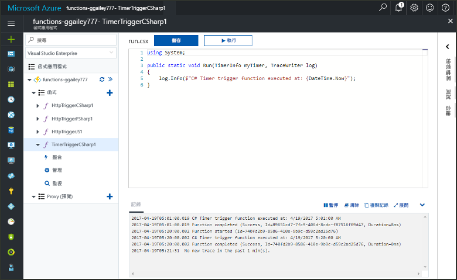
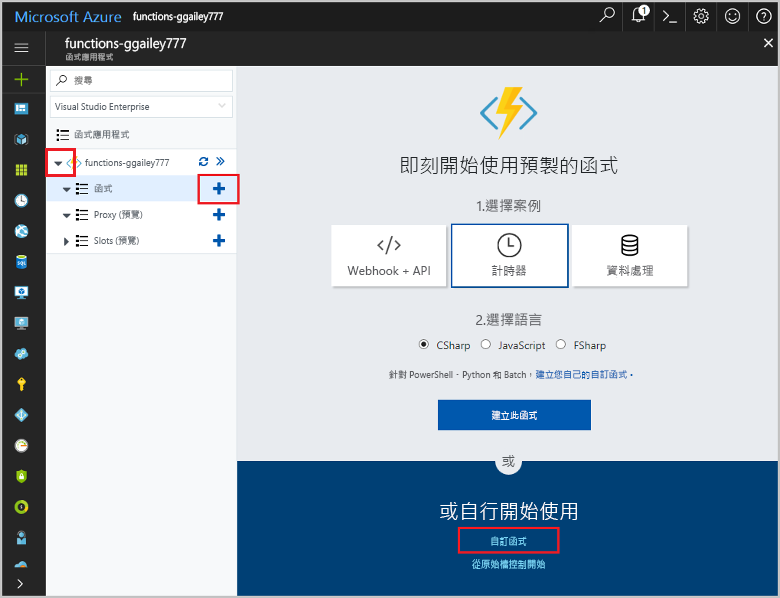
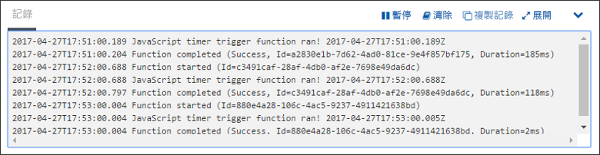
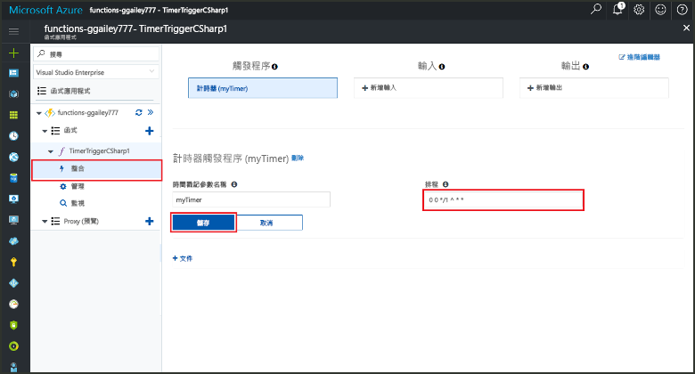

# 在 Azure 中建立由計時器觸發的函式Create a function in Azure that is triggered by a timer

了解如何使用 Azure Functions 來建立函式，並使其按照您定義的排程來執行。Learn how to use Azure Functions to create a function that runs based a schedule that you define.

## 必要條件Prerequisites

若要完成本教學課程：To complete this tutorial:

+ 如果您沒有 Azure 訂用帳戶，請在開始前建立 [免費帳戶](https://azure.microsoft.com/free/?WT.mc_id=A261C142F) 。If you don't have an Azure subscription, create a [free account](https://azure.microsoft.com/free/?WT.mc_id=A261C142F) before you begin.

[!INCLUDE [functions-portal-favorite-function-apps](../../includes/functions-portal-favorite-function-apps.md)]

## 建立 Azure 函數應用程式Create an Azure Function app

[!INCLUDE [Create function app Azure portal](../../includes/functions-create-function-app-portal.md)]

接下來，您要在新的函式應用程式中建立函式。Next, you create a function in the new function app.

## 建立由計時器觸發的函式Create a timer triggered function

1. 展開函式應用程式，然後按一下 [Functions] 旁的 [+] 按鈕。Expand your function app and click the **+** button next to **Functions**. 如果這是您函式應用程式中的第一個函式，請選取 [自訂函式]。If this is the first function in your function app, select **Custom function**. 這會顯示一組完整的函式範本。This displays the complete set of function templates.

    

2. 針對所需語言選取 **TimerTrigger** 的範本。Select the **TimerTrigger** template for your desired language. 然後使用表格中所指定的設定︰Then use the settings as specified in the table:

    

    | 設定Setting | 建議的值Suggested value | 說明Description |
    |---|---|---|
    | **函式命名****Name your function** | TimerTriggerCSharp1TimerTriggerCSharp1 | 定義計時器觸發函式的名稱。Defines the name of your timer triggered function. |
    | **[排程](http://en.wikipedia.org/wiki/Cron#CRON_expression)****[Schedule](http://en.wikipedia.org/wiki/Cron#CRON_expression)** | 0 \*/1 \* \* \* \*0 \*/1 \* \* \* \* | 含有六個欄位的 [CRON 運算式](http://en.wikipedia.org/wiki/Cron#CRON_expression)，它會將函式排程為每分鐘執行一次。A six field [CRON expression](http://en.wikipedia.org/wiki/Cron#CRON_expression) that schedules your function to run every minute. |

2. 按一下 [建立] 。Click **Create**. 系統隨即會以您所選的語言建立函式，並讓它每分鐘執行一次。A function is created in your chosen language that runs every minute.

3. 檢視寫入到記錄的追蹤資訊以確認執行情形。Verify execution by viewing trace information written to the logs.

    

現在，您可以變更函式的排程，使其降低執行頻率，例如降低為每小時一次。Now, you can change the function's schedule so that it runs less often, such as once every hour. 

## 更新計時器排程Update the timer schedule

1. 展開您的函式，然後按一下 [整合]。Expand your function and click **Integrate**. 您可以在這裡定義函式的輸入和輸出繫結，以及設定排程。This is where you define input and output bindings for your function and also set the schedule. 

2. 輸入 `0 0 */1 * * *` 作為新的 [排程] 值，然後按一下 [儲存]。Enter a new **Schedule** value of `0 0 */1 * * *`, and then click **Save**.  

您現在已擁有每小時執行一次的函式。You now have a function that runs once every hour. 

## 清除資源Clean up resources

[!INCLUDE [Next steps note](../../includes/functions-quickstart-cleanup.md)]

## 後續步驟Next steps

您已建立會根據排程來執行的函式。You have created a function that runs based on a schedule.

[!INCLUDE [Next steps note](../../includes/functions-quickstart-next-steps.md)]

如需計時器觸發程序的詳細資訊，請參閱[使用 Azure Functions 排程程式碼執行](functions-bindings-timer.md)。For more information timer triggers, see [Schedule code execution with Azure Functions](functions-bindings-timer.md).