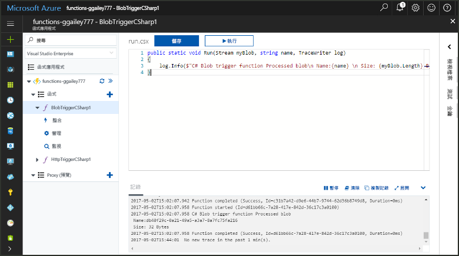
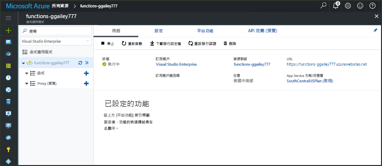
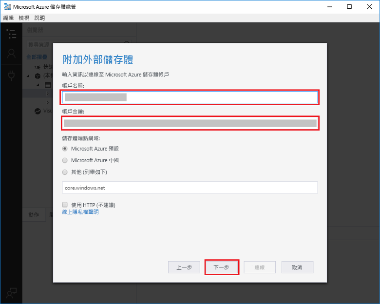
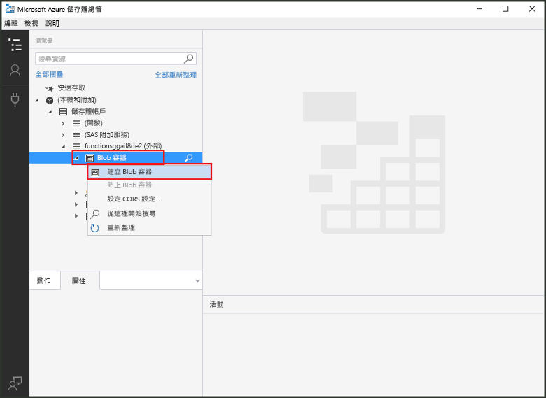
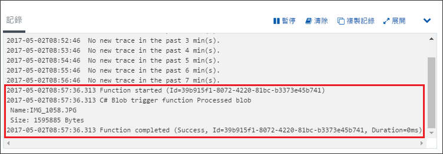

# 建立 Azure Blob 儲存體所觸發的函式

了解如何 toocreate 檔案時所觸發的函式上傳 tooor 在 Azure Blob 儲存體中更新。

## 必要條件

+ 下載並安裝 hello [Microsoft Azure 儲存體總管](http://storageexplorer.com/)。
+ Azure 訂用帳戶。 如果您沒有 Azure 訂用帳戶，請在開始前建立[免費帳戶](https://azure.microsoft.com/free/?WT.mc_id=A261C142F)。

[!INCLUDE [functions-portal-favorite-function-apps](../../includes/functions-portal-favorite-function-apps.md)]

## 建立 Azure 函數應用程式

[!INCLUDE [Create function app Azure portal](../../includes/functions-create-function-app-portal.md)]

接下來，您會在 hello 新函式應用程式中建立函式。

## 建立由 Blob 儲存體所觸發的函式

1. 展開您的函式應用程式，然後按一下 hello  **+** 太下一步按鈕**函式**。 如果 hello 函式應用程式中的第一個函式，請選取**自訂函式**。 這會顯示 hello 組完整的函式樣板。

    ![在 Azure 入口網站的 hello 函式 [快速入門] 頁面](./media/functions-create-storage-blob-triggered-function/add-first-function.png)

2. 選取 hello **BlobTrigger**您想要的語言，以及使用 hello 類似設定 hello 表中所指定的範本。

    

    | 設定 | 建議的值 | 說明 |
    |---|---|---|
    | **路徑**   | mycontainer/{name}    | 受監視 Blob 儲存體中的位置。 hello hello blob 檔案名稱傳入 hello 繫結作為 hello_名稱_參數。  |
    | **儲存體帳戶連線** | AzureWebJobStorage | 您可以使用應用程式的函式，已經使用 hello 儲存體帳戶連接或另外新建一個。  |
    | **函式命名** | 函式應用程式中的唯一名稱 | 這個由 blob 所觸發之函式的名稱。 |

3. 按一下**建立**toocreate 您的函式。

接下來，您連接 tooyour Azure 儲存體帳戶，並建立 hello **mycontainer**容器。

## 建立 hello 容器

1. 在您的函式中，按一下 [整合]，展開 [文件]，然後複製**帳戶名稱**和**帳戶金鑰**。 您使用這些認證 tooconnect toohello 儲存體帳戶。 如果您已連接儲存體帳戶，略過 toostep 4。

    

1. 執行 hello [Microsoft Azure 儲存體總管](http://storageexplorer.com/)工具，請按一下 hello 連接 hello 左邊的圖示，請選擇**使用儲存體帳戶名稱和金鑰**，然後按一下**下一步**。

    

1. 輸入 hello**帳戶名稱**和**帳戶金鑰**從步驟 1 中，按一下 **下一步**然後**連接**。 

    

1. 展開 hello 附加儲存體帳戶，以滑鼠右鍵按一下**Blob 容器**，按一下 **建立 blob 容器**，型別`mycontainer`，然後按下 enter。

    

有 blob 容器之後，您可以上傳檔案 toohello 容器來測試 hello 函式。

## 測試 hello 函式

1. 在 hello Azure 入口網站，瀏覽 tooyour 函式展開 hello**記錄**底部 hello hello 頁面，並確定該記錄檔資料流不已暫停。

1. 在儲存體總管中，依序展開您的儲存體帳戶、[Blob 容器] 和 [mycontainer]。 依序按一下 [上傳] 和 [上傳檔案...]。

    

1. 在 hello**將檔案上傳**對話方塊方塊中，按一下 hello**檔案**欄位。 瀏覽 tooa 檔案儲存在本機電腦，例如映像檔、 選取它，然後按一下**開啟**然後**上傳**。

1. 返回 tooyour 函數記錄檔，並確認該 hello blob 的讀取。

   

    >[!NOTE]
    > 當函式應用程式執行 hello 預設耗用量計劃時，可能會觸發函式的總 tooseveral hello 已加入或更新的 blob 和 hello 之間的分鐘的延遲。 如果您不想讓 Blob 所觸發的函式延遲太久，請考慮在 App Service 方案執行函式應用程式。

## 清除資源

[!INCLUDE [Next steps note](../../includes/functions-quickstart-cleanup.md)]

## 後續步驟

您已建立 Blob 儲存體 blob 加入 tooor 更新時執行的函式。 

[!INCLUDE [Next steps note](../../includes/functions-quickstart-next-steps.md)]

如需 Blob 儲存體觸發程序的詳細資訊，請參閱 [Azure Functions Blob 儲存體繫結](functions-bindings-storage-blob.md)。
