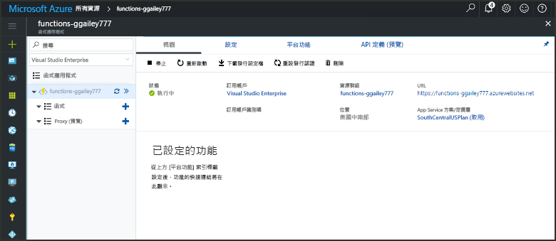

# 建立 Azure 佇列儲存體所觸發的函式Create a function triggered by Azure Queue storage

了解如何 toocreate 郵件時所觸發的函式提交 tooan Azure 儲存體佇列。Learn how toocreate a function triggered when messages are submitted tooan Azure Storage queue.

## 必要條件Prerequisites

- 下載並安裝 hello [Microsoft Azure 儲存體總管](http://storageexplorer.com/)。Download and install hello [Microsoft Azure Storage Explorer](http://storageexplorer.com/).

- Azure 訂用帳戶。An Azure subscription. 如果您沒有 Azure 訂用帳戶，請在開始前建立[免費帳戶](https://azure.microsoft.com/free/?WT.mc_id=A261C142F)。If you don't have one, create a [free account](https://azure.microsoft.com/free/?WT.mc_id=A261C142F) before you begin.

[!INCLUDE [functions-portal-favorite-function-apps](../../includes/functions-portal-favorite-function-apps.md)]

## 建立 Azure 函數應用程式Create an Azure Function app

[!INCLUDE [Create function app Azure portal](../../includes/functions-create-function-app-portal.md)]

接下來，您會在 hello 新函式應用程式中建立函式。Next, you create a function in hello new function app.

## 建立由佇列觸發的函式Create a Queue triggered function

1. 展開您的函式應用程式，然後按一下 hello  **+** 太下一步按鈕**函式**。Expand your function app and click hello **+** button next too**Functions**. 如果 hello 函式應用程式中的第一個函式，請選取**自訂函式**。If this is hello first function in your function app, select **Custom function**. 這會顯示 hello 組完整的函式樣板。This displays hello complete set of function templates.

    ![在 Azure 入口網站的 hello 函式 [快速入門] 頁面](./media/functions-create-storage-queue-triggered-function/add-first-function.png)

2. 選取 hello **QueueTrigger**您想要的語言，以及使用 hello 類似設定 hello 表中所指定的範本。Select hello **QueueTrigger** template for your desired language, and  use hello settings as specified in hello table.

    
    
    | 設定Setting | 建議的值Suggested value | 說明Description |
    |---|---|---|
    | **佇列名稱****Queue name**   | myqueue-itemsmyqueue-items    | 名稱的 hello 佇列 tooconnect tooin 儲存體帳戶。Name of hello queue tooconnect tooin your Storage account. |
    | **儲存體帳戶連線****Storage account connection** | AzureWebJobStorageAzureWebJobStorage | 您可以使用應用程式的函式，已經使用 hello 儲存體帳戶連接或另外新建一個。You can use hello storage account connection already being used by your function app, or create a new one.  |
    | **函式命名****Name your function** | 函式應用程式中的唯一名稱Unique in your function app | 這個由佇列所觸發之函式的名稱。Name of this queue triggered function. |

3. 按一下**建立**toocreate 您的函式。Click **Create** toocreate your function.

接下來，您連接 tooyour Azure 儲存體帳戶，並建立 hello **myqueue 項目**儲存體佇列。Next, you connect tooyour Azure Storage account and create hello **myqueue-items** storage queue.

## 建立 hello 佇列Create hello queue

1. 在您的函式中，按一下 [整合]，展開 [文件]，然後複製**帳戶名稱**和**帳戶金鑰**。In your function, click **Integrate**, expand **Documentation**, and copy both **Account name** and **Account key**. 您使用這些認證 tooconnect toohello 儲存體帳戶。You use these credentials tooconnect toohello storage account. 如果您已連接儲存體帳戶，略過 toostep 4。If you have already connected your storage account, skip toostep 4.

    vv

1. 執行 hello [Microsoft Azure 儲存體總管](http://storageexplorer.com/)工具，請按一下 hello 連接 hello 左邊的圖示，請選擇**使用儲存體帳戶名稱和金鑰**，然後按一下**下一步**。Run hello [Microsoft Azure Storage Explorer](http://storageexplorer.com/) tool, click hello connect icon on hello left, choose **Use a storage account name and key**, and click **Next**.

    

1. 輸入 hello**帳戶名稱**和**帳戶金鑰**從步驟 1 中，按一下 **下一步**然後**連接**。Enter hello **Account name** and **Account key** from step 1, click **Next** and then **Connect**.

    

1. 展開 hello 附加儲存體帳戶，以滑鼠右鍵按一下**佇列**，按一下 **建立佇列**，型別`myqueue-items`，然後按下 enter。Expand hello attached storage account, right-click **Queues**, click **Create queue**, type `myqueue-items`, and then press enter.

    

您已經有儲存體佇列，您可以藉由新增訊息 toohello 佇列測試 hello 函式。Now that you have a storage queue, you can test hello function by adding a message toohello queue.

## 測試 hello 函式Test hello function

1. 在 hello Azure 入口網站，瀏覽 tooyour 函式展開 hello**記錄**底部 hello hello 頁面，並確定該記錄檔資料流不已暫停。Back in hello Azure portal, browse tooyour function expand hello **Logs** at hello bottom of hello page and make sure that log streaming isn't paused.

1. 在儲存體總管中，依序展開您的儲存體帳戶、[佇列] 和 [myqueue-items]，然後按一下 [新增訊息]。In Storage Explorer, expand your storage account, **Queues**, and **myqueue-items**, then click **Add message**.

    

1. 將您的 "Hello World!" 輸入Type your "Hello World!" 在 [訊息文字] 訊息中，然後按一下 [確定]。message in **Message text** and click **OK**.

1. 等候數秒鐘，然後返回 tooyour 函數記錄檔並確認已從 hello 佇列讀取該 hello 新訊息。Wait for a few seconds, then go back tooyour function logs and verify that hello new message has been read from hello queue.

    

1. 在 儲存體總管 中，按一下 **重新整理**並確認該 hello 訊息已處理，而且已不存在於 hello 佇列。Back in Storage Explorer, click **Refresh** and verify that hello message has been processed and is no longer in hello queue.

## 清除資源Clean up resources

[!INCLUDE [Next steps note](../../includes/functions-quickstart-cleanup.md)]

## 後續步驟Next steps

您已建立執行時加入 tooa 儲存體佇列訊息的函式。You have created a function that runs when a message is added tooa storage queue.

[!INCLUDE [Next steps note](../../includes/functions-quickstart-next-steps.md)]

如需佇列儲存體觸發程序的詳細資訊，請參閱 [Azure Functions 儲存體佇列繫結](functions-bindings-storage-queue.md)。For more information about Queue storage triggers, see [Azure Functions Storage queue bindings](functions-bindings-storage-queue.md).