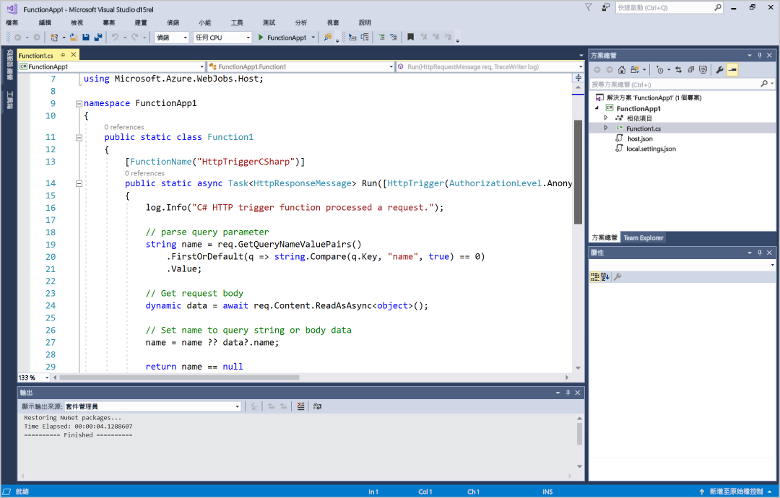
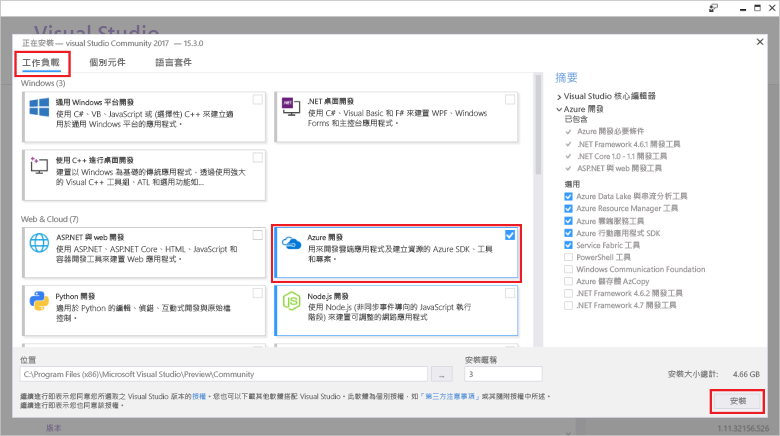
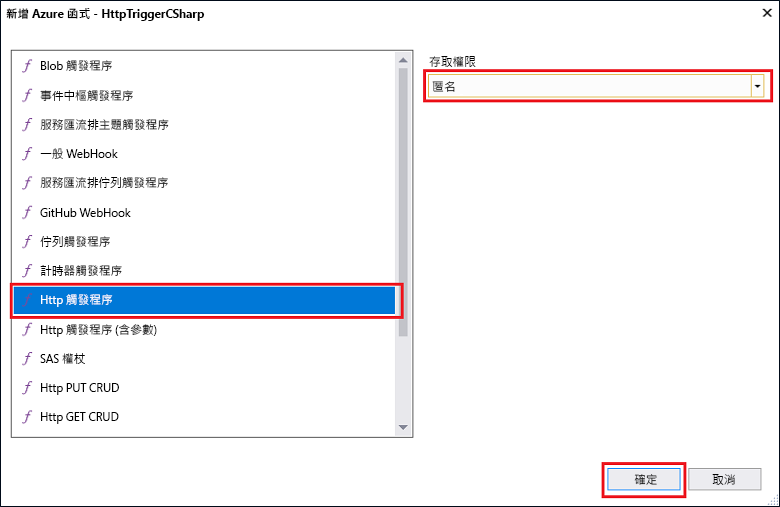

# 使用 Visual Studio 建立第一個函式Create your first function using Visual Studio

Azure Functions 可讓您在無伺服器環境中執行程式碼，而不需要先建立 VM 或發佈 Web 應用程式。Azure Functions lets you execute your code in a serverless environment without having to first create a VM or publish a web application.

在本主題中，您將了解如何使用 Visual Studio 2017 Tools for Azure Functions 在本機建立及測試 "hello world" 函式。In this topic, you learn how to use the Visual Studio 2017 tools for Azure Functions to create and test a "hello world" function locally. 您接著會將函式程式碼發行至 Azure。You will then publish the function code to Azure. 這些工具可在 Visual Studio 2017 15.3 版或更新版本的 Azure 開發工作負載中取得。These tools are available as part of the Azure development workload in Visual Studio 2017 version 15.3, or a later version.

## 必要條件Prerequisites

若要完成本教學課程，請安裝：To complete this tutorial, install:

* [Visual Studio 2017 15.3 版](https://www.visualstudio.com/vs/preview/)，包括 **Azure 開發**工作負載。[Visual Studio 2017 version 15.3](https://www.visualstudio.com/vs/preview/), including the **Azure development** workload.

    
    
    >[!NOTE]  
    安裝或升級至 Visual Studio 2017 版本 15.3 之後，您可能也需要手動更新 Visual Studio 2017 Tools for Azure Functions。After you install or upgrade to Visual Studio 2017 version 15.3, you might also need to manually update the Visual Studio 2017 tools for Azure Functions. 您可以從 [工具] 功能表的 [延伸模組和更新...] 下的 > [更新] > [Visual Studio Marketplace] > [Azure Functions and Web Jobs Tools] > [更新] 更新工具。You can update the tools from the **Tools** menu under **Extensions and Updates...** > **Updates** > **Visual Studio Marketplace** > **Azure Functions and Web Jobs Tools** > **Update**. 

[!INCLUDE [quickstarts-free-trial-note](../../includes/quickstarts-free-trial-note.md)] 

## 在 Visual Studio 中建立 Azure Functions 專案Create an Azure Functions project in Visual Studio

[!INCLUDE [Create a project using the Azure Functions template](../../includes/functions-vstools-create.md)]

您現在已建立專案，即可建立第一個函式。Now that you have created the project, you can create your first function.

## 建立函式Create the function

1. 在 [方案總管] 中，於專案節點上按一下滑鼠右鍵，然後選取 [新增] > [新增項目]。In **Solution Explorer**, right-click on your project node and select **Add** > **New Item**. 選取 [Azure Function]，然後按一下 [新增]。Select **Azure Function** and click **Add**.

2. 選取 [HttpTrigger]，輸入 [函式名稱]，針對 [存取權限] 選取 [匿名]，然後按一下 [建立]。Select **HttpTrigger**, type a **Function Name**, select **Anonymous** for **Access Rights**, and click **Create**. 建立的函式會由任何用戶端的 HTTP 要求存取。The function created is accessed by an HTTP request from any client. 

    

    這會將一個程式碼檔案新增至您的專案，其中包含實作函式程式碼的類別。A code file is added to your project that contains a class that implements your function code. 此程式碼是以範本為基礎，會接收名稱值並將其回應回去。This code is based on a template, which receives a name value and echos it back. **FunctionName** 屬性會設定您的函式名稱。The **FunctionName** attribute sets the name of your function. **HttpTrigger** 屬性表示觸發函式的訊息。The **HttpTrigger** attribute indicates the message that triggers the function. 

    

您現在已建立 HTTP 觸發的函式，可以在本機電腦上進行測試。Now that you have created an HTTP-triggered function, you can test it on your local computer.

## 在本機測試函式Test the function locally

Azure Functions Core Tools 可讓您在本機開發電腦上執行 Azure Functions 專案。Azure Functions Core Tools lets you run Azure Functions project on your local development computer. 第一次從 Visual Studio 啟動函式時，系統會提示您安裝這些工具。You are prompted to install these tools the first time you start a function from Visual Studio.  

1. 若要測試您的函式，請按 F5。To test your function, press F5. 如果出現提示，接受來自 Visual Studio 之下載及安裝 Azure Functions Core (CLI) 工具的要求。If prompted, accept the request from Visual Studio to download and install Azure Functions Core (CLI) tools.  您可能也需要啟用防火牆例外狀況，工具才能處理 HTTP 要求。You may also need to enable a firewall exception so that the tools can handle HTTP requests.

2. 從 Azure Functions 執行階段輸出複製函式的 URL。Copy the URL of your function from the Azure Functions runtime output.  

    

3. 將 HTTP 要求的 URL 貼到瀏覽器的網址列。Paste the URL for the HTTP request into your browser's address bar. 將查詢字串 `&name=<yourname>` 附加至此 URL 並執行要求。Append the query string `&name=<yourname>` to this URL and execute the request. 下圖顯示瀏覽器中對於函式傳回之本機 GET 要求所做出的回應︰The following shows the response in the browser to the local GET request returned by the function: 

    

4. 若要停止偵錯，請按一下 Visual Studio 工具列上的 [停止] 按鈕。To stop debugging, click the **Stop** button on the Visual Studio toolbar.

確認函式在本機電腦上正確執行之後，就可以將專案發佈到 Azure。After you have verified that the function runs correctly on your local computer, it's time to publish the project to Azure.

## 將專案發佈到 AzurePublish the project to Azure

您的 Azure 訂用帳戶中必須具有函式應用程式，才可以發佈您的專案。You must have a function app in your Azure subscription before you can publish your project. 您可以直接從 Visual Studio 建立函式應用程式。You can create a function app right from Visual Studio.

[!INCLUDE [Publish the project to Azure](../../includes/functions-vstools-publish.md)]

## 在 Azure 中測試您的函式Test your function in Azure

1. 從發行設定檔頁面複製函式應用程式的基底 URL。Copy the base URL of the function app from the Publish profile page. 使用新的基底 URL，取代在本機測試函式時所使用之 URL 的 `localhost:port` 部分。Replace the `localhost:port` portion of the URL you used when testing the function locally with the new base URL. 如同以往，務必將查詢字串 `&name=<yourname>` 附加至此 URL 並執行要求。As before, make sure to append the query string `&name=<yourname>` to this URL and execute the request.

    呼叫 HTTP URL 觸發函式的 URL 如下所示：The URL that calls your HTTP triggered function looks like this:

        http://<functionappname>.azurewebsites.net/api/<functionname>?name=<yourname> 

2. 將 HTTP 要求的新 URL 貼到瀏覽器的網址列。Paste this new URL for the HTTP request into your browser's address bar. 下圖顯示瀏覽器中對於函式傳回之遠端 GET 要求所做出的回應︰The following shows the response in the browser to the remote GET request returned by the function: 

    
 
## 後續步驟Next steps

您已透過 Visual Studio，使用簡單的 HTTP 觸發函式建立 C# 函式應用程式。You have used Visual Studio to create a C# function app with a simple HTTP triggered function. 

+ 若要了解如何設定專案以支援其他類型的觸發程序和繫結，請參閱 [Azure Functions Tools for Visual Studio](functions-develop-vs.md) 中的[設定專案以進行本機開發](functions-develop-vs.md#configure-the-project-for-local-development)一節。To learn how to configure your project to support other types of triggers and bindings, see the [Configure the project for local development](functions-develop-vs.md#configure-the-project-for-local-development) section in [Azure Functions Tools for Visual Studio](functions-develop-vs.md).
+ 若要深入了解如何使用 Azure Functions Core Tools 進行本機測試和偵錯，請參閱[在本機編碼和測試 Azure Functions](functions-run-local.md)。To learn more about local testing and debugging using the Azure Functions Core Tools, see [Code and test Azure Functions locally](functions-run-local.md). 
+ 若要深入了解如何將函式開發為 .NET 類別庫，請參閱[搭配使用 .NET 類別庫與 Azure Functions](functions-dotnet-class-library.md)。To learn more about developing functions as .NET class libraries, see [Using .NET class libraries with Azure Functions](functions-dotnet-class-library.md). 

