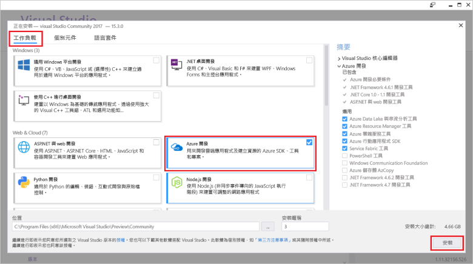

# <a name="azure-functions-tools-for-visual-studio"></a>Azure Functions Tools for Visual Studio  

Azure 的函式 Tools for Visual Studio 2017 是可讓您開發、 測試及部署 C# 函式 tooAzure 的 Visual Studio 的擴充功能。 如果這是您 Azure 函式的第一個體驗，您可以深入[簡介 tooAzure 函式](functions-overview.md)。

hello Azure 函式工具提供下列優點 hello: 

* 在本機開發電腦上編輯、建置及執行函數。 
* 發行您的 Azure 函式直接專案 tooAzure。 
* 直接在 hello 而不是維護個別 function.json 繫結定義的 C# 程式碼中使用 WebJobs 屬性 toodeclare 函式繫結。
* 開發及部署預先編譯的 C# 函數。 預先編譯的函數提供的冷啟動效能比 C# 指令碼型函數更好。 
* 同時有所有的 Visual Studio 開發的 hello 優點的程式碼在 C# 函式。 

本主題說明如何 toouse hello Azure 函式工具的 Visual Studio 2017 toodevelop 您在 C# 中的函式。 您也學到如何 toopublish 您的專案 tooAzure 做為.NET 組件。

## <a name="prerequisites"></a>必要條件

Azure 的函式工具隨附於 hello Azure 的開發工作負載的[Visual Studio 2017 版本 15.3](https://www.visualstudio.com/vs/)，或更新版本。 請確定您包含 hello **Azure 開發**Visual Studio 2017 版本 15.3 安裝中的工作負載：



toocreate 和部署函式，您也需要：

* 有效的 Azure 訂用帳戶。 如果您還沒有 Azure 訂用帳戶，可以使用[免費帳戶](https://azure.microsoft.com/free/?WT.mc_id=A261C142F)。

* Azure 儲存體帳戶。 toocreate 儲存體帳戶，請參閱[建立儲存體帳戶](../storage/common/storage-create-storage-account.md#create-a-storage-account)。  
## <a name="create-an-azure-functions-project"></a>建立 Azure Functions 專案 

[!INCLUDE [Create a project using hello Azure Functions](../../includes/functions-vstools-create.md)]


## <a name="configure-hello-project-for-local-development"></a>設定本機開發的 hello 專案

當您建立新的專案使用 hello Azure 函式範本時，您會得到空白 C# 專案，其中包含下列檔案的 hello:

* **host.json**： 可讓您設定 hello 函式的主機。 這些設定同時適用於在本機執行及在 Azure 中執行。 如需詳細資訊，請參閱 [host.json](https://github.com/Azure/azure-webjobs-sdk-script/wiki/host.json) \(英文\) 參考文章。
    
* **local.settings.json**：維持在本機執行函數時所使用的設定。 Azure 不會使用這些設定，它們由 hello [Azure 函式的核心工具](functions-run-local.md)。 使用此檔案 toospecify 設定，例如連接字串 tooother Azure 服務。 加入新的索引鍵 toohello**值**陣列中每個專案中的函式所需的連接。 如需詳細資訊，請參閱[本機設定檔案](functions-run-local.md#local-settings-file)hello Azure 函式的核心工具主題。

hello 函式執行階段會在內部使用的 Azure 儲存體帳戶。 所有觸發程序 HTTP 和 webhook 以外的類型，您必須設定 hello **Values.AzureWebJobsStorage**金鑰 tooa 有效 Azure 儲存體帳戶連接字串。

[!INCLUDE [Note toonot use local storage](../../includes/functions-local-settings-note.md)]

 tooset hello 儲存體帳戶連接字串：

1. 在 Visual Studio 中開啟**Cloud Explorer**，依序展開**儲存體帳戶** > **儲存體帳戶**，然後選取**屬性**和複製 hello**主要連接字串**值。   

2. 在專案中，開啟 hello local.settings.json 專案檔，並設定 hello hello 值**AzureWebJobsStorage** toohello 連接字串複製的索引鍵。

3. 重複 hello 上一個步驟 tooadd 唯一索引鍵 toohello**值**函式所需的任何其他連接的陣列。  

## <a name="create-a-function"></a>建立函式

預先編譯的函式，在 hello hello 函式所使用的繫結會定義套用 hello 程式碼中的屬性。 當您使用 hello Azure 函式工具 toocreate 從提供的 hello 範本函式時，這些屬性適用於您。 

1. 在 [方案總管] 中，於專案節點上按一下滑鼠右鍵，然後選取 [新增] > [新增項目]。 選取**Azure 函式**，輸入**名稱**hello 類別，然後按一下**新增**。

2. 選擇您的觸發程序，設定 hello 繫結屬性，然後按一下**建立**。 hello 下列範例顯示 hello 設定時建立佇列儲存體觸發函式。 

    
    
    連接字串的索引鍵，名為**QueueStorage**提供，就定義在 hello local.settings.json 檔案。 
 
3. 檢查 hello 新加入的類別。 您會看到靜態**執行**方法中，屬性具有 hello **FunctionName**屬性。 這個屬性表示 hello 方法 hello hello 函式的進入點。 

    比方說，下列 C# 類別的 hello 表示基本佇列儲存體觸發函式：

    ````csharp
    using System;
    using Microsoft.Azure.WebJobs;
    using Microsoft.Azure.WebJobs.Host;
    
    namespace FunctionApp1
    {
        public static class Function1
        {
            [FunctionName("QueueTriggerCSharp")]        
            public static void Run([QueueTrigger("myqueue-items", Connection = "QueueStorage")]string myQueueItem, TraceWriter log)
            {
                log.Info($"C# Queue trigger function processed: {myQueueItem}");
            }
        }
    } 
    ````
 
    繫結特定的屬性會套用的 tooeach 繫結提供參數 toohello 進入點方法。 hello 屬性會採用 hello 做為參數的繫結資訊。 Hello 上述範例中，在 hello 第一個參數具有**QueueTrigger**套用屬性，指出觸發佇列函式。 hello 佇列名稱和連接字串設定名稱會當做參數傳遞。  

## <a name="testing-functions"></a>測試函式

Azure Functions Core Tools 可讓您在本機開發電腦上執行 Azure Functions 專案。 您必須提示的 tooinstall 這些工具 hello 從 Visual Studio 啟動函式的第一次。  

tootest 您的函式，請按 F5。 如果出現提示，請接受從 Visual Studio toodownload hello 要求，並安裝 Azure 函式核心 (CLI) 工具。  您也可能需要 tooenable 防火牆例外，好讓 hello 工具可以處理 HTTP 要求。

Hello 專案時執行，您可以測試您的程式碼，您會測試已部署的函式時。 如需詳細資訊，請參閱[在 Azure Functions 中測試程式碼的策略](functions-test-a-function.md)。 在偵錯模式下執行時，會依預期在 Visual Studio 中遇到中斷點。 

如需 tootest 佇列如何觸發函式的範例，請參閱 hello[觸發佇列函式的快速入門教學課程](functions-create-storage-queue-triggered-function.md#test-the-function)。  

toolearn 進一步了解使用 hello Azure 函式的核心工具，請參閱[程式碼和測試 Azure 函式在本機](functions-run-local.md)。

## <a name="publish-tooazure"></a>發行 tooAzure

[!INCLUDE [Publish hello project tooAzure](../../includes/functions-vstools-publish.md)]

>[!NOTE]  
>您在 hello local.settings.json 中加入任何設定必須也加入 toohello 函式應用程式在 Azure 中。 系統並不會自動新增這些設定。 在下列其中一種，您可以加入必要的設定 tooyour 函式應用程式：
>
>* [使用 hello Azure 入口網站](functions-how-to-use-azure-function-app-settings.md#settings)。
>* [使用 hello`--publish-local-settings`發行選項，在 hello Azure 函式的核心工具](functions-run-local.md#publish)。
>* [使用 hello Azure CLI](/cli/azure/functionapp/config/appsettings#set)。 

## <a name="next-steps"></a>後續步驟

如需有關 Azure 函式工具，請參閱 hello 常見的問題 > 一節的 hello [Azure 函式的 Visual Studio 2017 Tools](https://blogs.msdn.microsoft.com/webdev/2017/05/10/azure-function-tools-for-visual-studio-2017/)部落格文章。

請參閱 < 了解 hello Azure 函式核心 Tools toolearn[程式碼和測試 Azure 函式在本機](functions-run-local.md)。  
toolearn 進一步了解開發函式做為.NET 類別庫，請參閱[使用.NET 類別庫來搭配 Azure 函式](functions-dotnet-class-library.md)。 本主題也提供如何 toouse 屬性 toodeclare hello Azure 函式所支援的繫結的各種類型的範例。    
