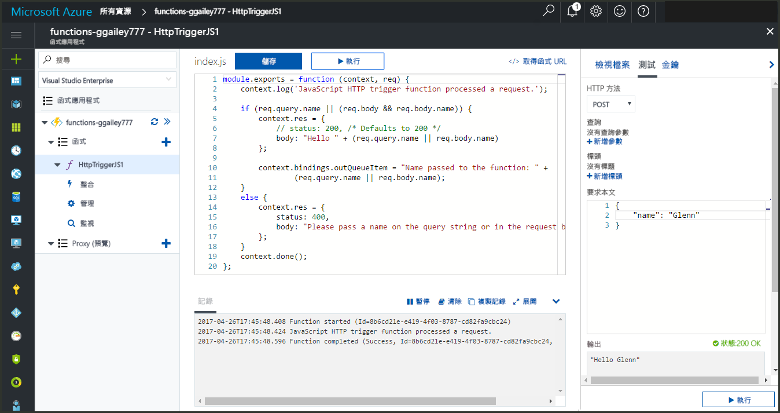
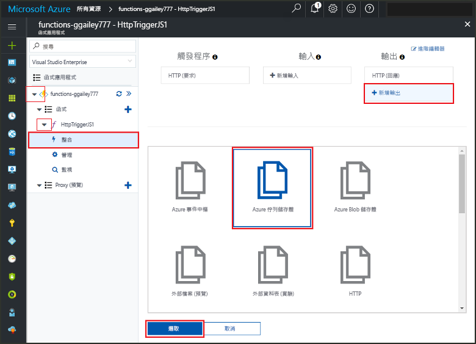
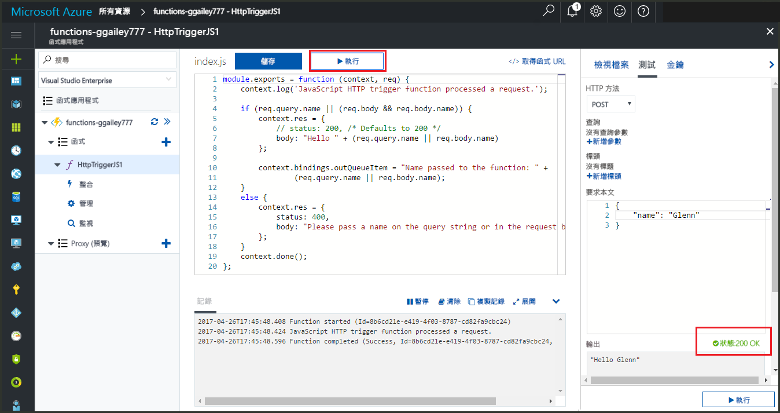
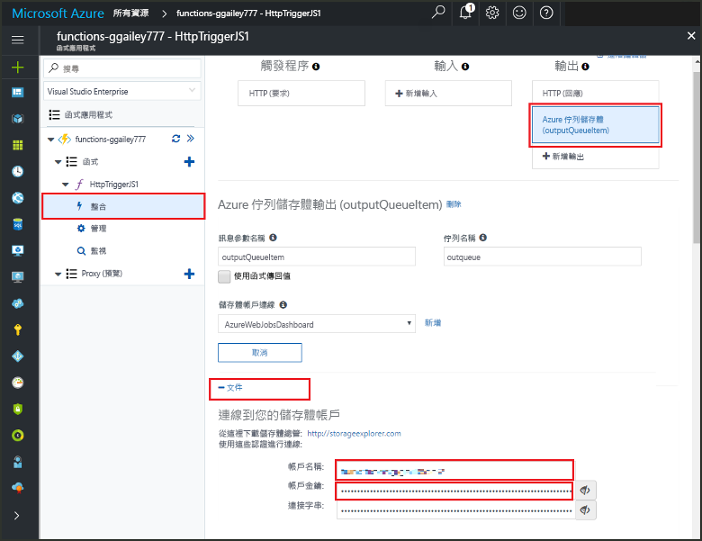

# <a name="add-messages-tooan-azure-storage-queue-using-functions"></a><span data-ttu-id="d2c1c-103">新增訊息 tooan Azure 儲存體佇列函式的使用</span><span class="sxs-lookup"><span data-stu-id="d2c1c-103">Add messages tooan Azure Storage queue using Functions</span></span>

<span data-ttu-id="d2c1c-104">在 Azure 功能中，輸入和輸出繫結會提供從您的函式宣告的方式來 tooconnect tooexternal 服務資料。</span><span class="sxs-lookup"><span data-stu-id="d2c1c-104">In Azure Functions, input and output bindings provide a declarative way tooconnect tooexternal service data from your function.</span></span> <span data-ttu-id="d2c1c-105">本主題中，了解如何 tooupdate 現有的函式所加入的繫結的輸出會傳送訊息 tooAzure 佇列儲存體。</span><span class="sxs-lookup"><span data-stu-id="d2c1c-105">In this topic, learn how tooupdate an existing function by adding an output binding that sends messages tooAzure Queue storage.</span></span>  



## <a name="prerequisites"></a><span data-ttu-id="d2c1c-107">必要條件</span><span class="sxs-lookup"><span data-stu-id="d2c1c-107">Prerequisites</span></span> 

[!INCLUDE [Previous topics](../../includes/functions-quickstart-previous-topics.md)]

* <span data-ttu-id="d2c1c-108">安裝 hello [Microsoft Azure 儲存體總管](http://storageexplorer.com/)。</span><span class="sxs-lookup"><span data-stu-id="d2c1c-108">Install hello [Microsoft Azure Storage Explorer](http://storageexplorer.com/).</span></span>

## <span data-ttu-id="d2c1c-109"><a name="add-binding"></a>新增輸出繫結</span><span class="sxs-lookup"><span data-stu-id="d2c1c-109"><a name="add-binding"></a>Add an output binding</span></span>
 
1. <span data-ttu-id="d2c1c-110">展開函式應用程式和函式。</span><span class="sxs-lookup"><span data-stu-id="d2c1c-110">Expand both your function app and your function.</span></span>

2. <span data-ttu-id="d2c1c-111">選取 [整合] 和 [+ 新輸出]，然後選擇 [Azure 佇列儲存體] 和 [選取]。</span><span class="sxs-lookup"><span data-stu-id="d2c1c-111">Select **Integrate** and **+ New output**, then choose **Azure Queue storage** and choose **Select**.</span></span>
    
    

3. <span data-ttu-id="d2c1c-113">使用 hello hello 資料表中所指定的設定：</span><span class="sxs-lookup"><span data-stu-id="d2c1c-113">Use hello settings as specified in hello table:</span></span> 

    

    | <span data-ttu-id="d2c1c-115">設定</span><span class="sxs-lookup"><span data-stu-id="d2c1c-115">Setting</span></span>      |  <span data-ttu-id="d2c1c-116">建議的值</span><span class="sxs-lookup"><span data-stu-id="d2c1c-116">Suggested value</span></span>   | <span data-ttu-id="d2c1c-117">說明</span><span class="sxs-lookup"><span data-stu-id="d2c1c-117">Description</span></span>                              |
    | ------------ |  ------- | -------------------------------------------------- |
    | <span data-ttu-id="d2c1c-118">**佇列名稱**</span><span class="sxs-lookup"><span data-stu-id="d2c1c-118">**Queue name**</span></span>   | <span data-ttu-id="d2c1c-119">myqueue-items</span><span class="sxs-lookup"><span data-stu-id="d2c1c-119">myqueue-items</span></span>    | <span data-ttu-id="d2c1c-120">hello hello 名稱佇列 tooconnect tooin 儲存體帳戶。</span><span class="sxs-lookup"><span data-stu-id="d2c1c-120">hello name of hello queue tooconnect tooin your Storage account.</span></span> |
    | <span data-ttu-id="d2c1c-121">**儲存體帳戶連線**</span><span class="sxs-lookup"><span data-stu-id="d2c1c-121">**Storage account connection**</span></span> | <span data-ttu-id="d2c1c-122">AzureWebJobStorage</span><span class="sxs-lookup"><span data-stu-id="d2c1c-122">AzureWebJobStorage</span></span> | <span data-ttu-id="d2c1c-123">您可以使用應用程式的函式，已經使用 hello 儲存體帳戶連接或另外新建一個。</span><span class="sxs-lookup"><span data-stu-id="d2c1c-123">You can use hello storage account connection already being used by your function app, or create a new one.</span></span>  |
    | <span data-ttu-id="d2c1c-124">**訊息參數名稱**</span><span class="sxs-lookup"><span data-stu-id="d2c1c-124">**Message parameter name**</span></span> | <span data-ttu-id="d2c1c-125">outputQueueItem</span><span class="sxs-lookup"><span data-stu-id="d2c1c-125">outputQueueItem</span></span> | <span data-ttu-id="d2c1c-126">hello hello 輸出繫結參數的名稱。</span><span class="sxs-lookup"><span data-stu-id="d2c1c-126">hello name of hello output binding parameter.</span></span> | 

4. <span data-ttu-id="d2c1c-127">按一下**儲存**tooadd hello 繫結。</span><span class="sxs-lookup"><span data-stu-id="d2c1c-127">Click **Save** tooadd hello binding.</span></span>
 
<span data-ttu-id="d2c1c-128">既然您已定義的輸出繫結時，您會需要 tooupdate hello 程式碼 toouse hello 繫結 tooadd 訊息 tooa 佇列。</span><span class="sxs-lookup"><span data-stu-id="d2c1c-128">Now that you have an output binding defined, you need tooupdate hello code toouse hello binding tooadd messages tooa queue.</span></span>  

## <a name="update-hello-function-code"></a><span data-ttu-id="d2c1c-129">更新 hello 函式程式碼</span><span class="sxs-lookup"><span data-stu-id="d2c1c-129">Update hello function code</span></span>

1. <span data-ttu-id="d2c1c-130">在 hello 編輯器中選取您函式 toodisplay hello 函式的程式碼。</span><span class="sxs-lookup"><span data-stu-id="d2c1c-130">Select your function toodisplay hello function code in hello editor.</span></span> 

2. <span data-ttu-id="d2c1c-131">對於 C# 函式，更新您的函式定義，如下所示 tooadd hello **outputQueueItem**儲存繫結參數。</span><span class="sxs-lookup"><span data-stu-id="d2c1c-131">For a C# function, update your function definition as follows tooadd hello **outputQueueItem** storage binding parameter.</span></span> <span data-ttu-id="d2c1c-132">若為 JavaScript 函式，請略過此步驟。</span><span class="sxs-lookup"><span data-stu-id="d2c1c-132">Skip this step for a JavaScript function.</span></span>

    ```cs   
    public static async Task<HttpResponseMessage> Run(HttpRequestMessage req, 
        ICollector<string> outputQueueItem, TraceWriter log)
    {
        ....
    }
    ```

3. <span data-ttu-id="d2c1c-133">新增 hello hello 方法會傳回之前，下列程式碼 toohello 函式。</span><span class="sxs-lookup"><span data-stu-id="d2c1c-133">Add hello following code toohello function just before hello method returns.</span></span> <span data-ttu-id="d2c1c-134">使用 hello 適當的程式碼片段函式的 hello 語言。</span><span class="sxs-lookup"><span data-stu-id="d2c1c-134">Use hello appropriate snippet for hello language of your function.</span></span>

    ```javascript
    context.bindings.outputQueueItem = "Name passed toohello function: " + 
                (req.query.name || req.body.name);
    ```

    ```cs
    outputQueueItem.Add("Name passed toohello function: " + name);     
    ```

4. <span data-ttu-id="d2c1c-135">選取**儲存**toosave 變更。</span><span class="sxs-lookup"><span data-stu-id="d2c1c-135">Select **Save** toosave changes.</span></span>

<span data-ttu-id="d2c1c-136">訊息佇列中的加入的 toohello 隨附 hello 值傳遞 toohello HTTP 觸發程序。</span><span class="sxs-lookup"><span data-stu-id="d2c1c-136">hello value passed toohello HTTP trigger is included in a message added toohello queue.</span></span>
 
## <a name="test-hello-function"></a><span data-ttu-id="d2c1c-137">測試 hello 函式</span><span class="sxs-lookup"><span data-stu-id="d2c1c-137">Test hello function</span></span> 

1. <span data-ttu-id="d2c1c-138">儲存 hello 程式碼變更之後，請選取**執行**。</span><span class="sxs-lookup"><span data-stu-id="d2c1c-138">After hello code changes are saved, select **Run**.</span></span> 

    

2. <span data-ttu-id="d2c1c-140">請檢查記錄檔 hello toomake，確定 hello 函式成功。</span><span class="sxs-lookup"><span data-stu-id="d2c1c-140">Check hello logs toomake sure that hello function succeeded.</span></span> <span data-ttu-id="d2c1c-141">名為的新佇列**outqueue** hello 第一次使用函式執行階段 hello 輸出繫結時所建立儲存體帳戶。</span><span class="sxs-lookup"><span data-stu-id="d2c1c-141">A new queue named **outqueue** is created in your Storage account by hello Functions runtime when hello output binding is first used.</span></span>

<span data-ttu-id="d2c1c-142">接下來，您可以連接 tooyour 儲存體帳戶 tooverify hello 新佇列和加入 tooit 的 hello 訊息。</span><span class="sxs-lookup"><span data-stu-id="d2c1c-142">Next, you can connect tooyour storage account tooverify hello new queue and hello message you added tooit.</span></span> 

## <a name="connect-toohello-queue"></a><span data-ttu-id="d2c1c-143">連接 toohello 佇列</span><span class="sxs-lookup"><span data-stu-id="d2c1c-143">Connect toohello queue</span></span>

<span data-ttu-id="d2c1c-144">如果您已安裝存放裝置總管並連接 tooyour 儲存體帳戶，略過 hello 前三個步驟。</span><span class="sxs-lookup"><span data-stu-id="d2c1c-144">Skip hello first three steps if you have already installed Storage Explorer and connected it tooyour storage account.</span></span>    

1. <span data-ttu-id="d2c1c-145">在您的函式中，選擇 **整合**和新的 hello **Azure 佇列儲存體**輸出繫結，然後展開**文件**。</span><span class="sxs-lookup"><span data-stu-id="d2c1c-145">In your function, choose **Integrate** and hello new **Azure Queue storage** output binding, then expand **Documentation**.</span></span> <span data-ttu-id="d2c1c-146">複製**帳戶名稱**和**帳戶金鑰**。</span><span class="sxs-lookup"><span data-stu-id="d2c1c-146">Copy both **Account name** and **Account key**.</span></span> <span data-ttu-id="d2c1c-147">您使用這些認證 tooconnect toohello 儲存體帳戶。</span><span class="sxs-lookup"><span data-stu-id="d2c1c-147">You use these credentials tooconnect toohello storage account.</span></span>
 
    

2. <span data-ttu-id="d2c1c-149">執行 hello [Microsoft Azure 儲存體總管](http://storageexplorer.com/)工具、 選取 hello 連接 hello 左邊的圖示，請選擇**使用儲存體帳戶名稱和金鑰**，然後選取**下一步**。</span><span class="sxs-lookup"><span data-stu-id="d2c1c-149">Run hello [Microsoft Azure Storage Explorer](http://storageexplorer.com/) tool, select hello connect icon on hello left, choose **Use a storage account name and key**, and select **Next**.</span></span>

    
    
3. <span data-ttu-id="d2c1c-151">貼上 hello**帳戶名稱**和**帳戶金鑰**從步驟 1 到其對應的欄位，然後選取 **下一步**，和**連接**。</span><span class="sxs-lookup"><span data-stu-id="d2c1c-151">Paste hello **Account name** and **Account key** from step 1 into their corresponding fields, then select **Next**, and **Connect**.</span></span> 
  
    

4. <span data-ttu-id="d2c1c-153">依序展開 hello 附加儲存體帳戶**佇列**並確認佇列名為**myqueue 項目**存在。</span><span class="sxs-lookup"><span data-stu-id="d2c1c-153">Expand hello attached storage account, expand **Queues** and verify that a queue named **myqueue-items** exists.</span></span> <span data-ttu-id="d2c1c-154">您也應該看到已經 hello 佇列中的訊息。</span><span class="sxs-lookup"><span data-stu-id="d2c1c-154">You should also see a message already in hello queue.</span></span>  
 
    
 

## <a name="clean-up-resources"></a><span data-ttu-id="d2c1c-156">清除資源</span><span class="sxs-lookup"><span data-stu-id="d2c1c-156">Clean up resources</span></span>

[!INCLUDE [Next steps note](../../includes/functions-quickstart-cleanup.md)]

## <a name="next-steps"></a><span data-ttu-id="d2c1c-157">後續步驟</span><span class="sxs-lookup"><span data-stu-id="d2c1c-157">Next steps</span></span>

<span data-ttu-id="d2c1c-158">您已加入的輸出繫結 tooan 現有函式。</span><span class="sxs-lookup"><span data-stu-id="d2c1c-158">You have added an output binding tooan existing function.</span></span> 

[!INCLUDE [Next steps note](../../includes/functions-quickstart-next-steps.md)]

<span data-ttu-id="d2c1c-159">如需繫結 tooQueue 儲存體的詳細資訊，請參閱[Azure 函式儲存體佇列繫結](functions-bindings-storage-queue.md)。</span><span class="sxs-lookup"><span data-stu-id="d2c1c-159">For more information about binding tooQueue storage, see [Azure Functions Storage queue bindings](functions-bindings-storage-queue.md).</span></span> 


