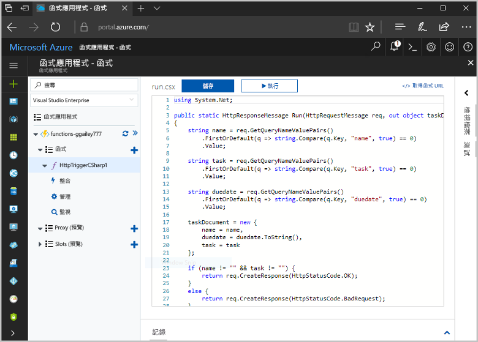
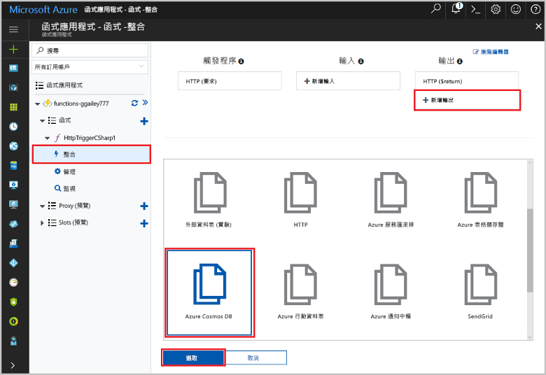
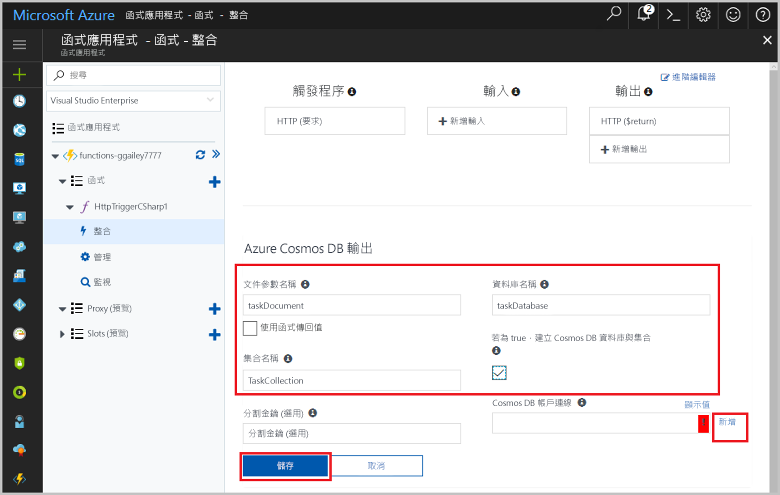
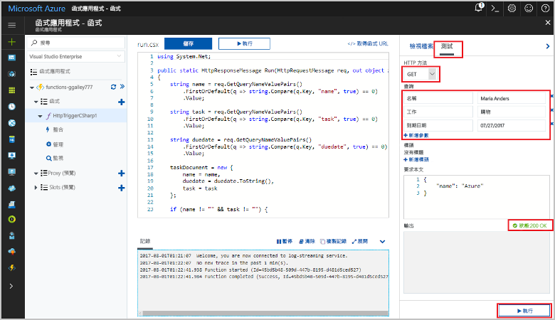
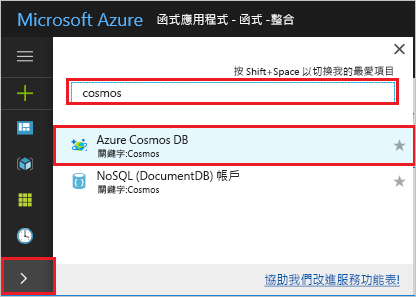
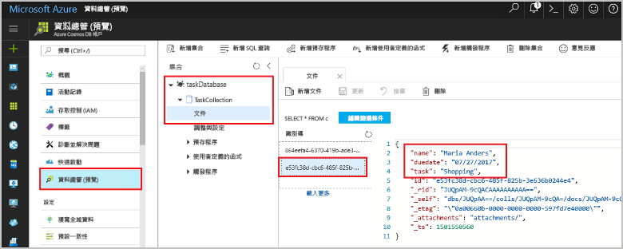

# <a name="store-unstructured-data-using-azure-functions-and-cosmos-db"></a><span data-ttu-id="7ef09-104">使用 Azure Functions 和 Cosmos DB 儲存非結構化資料</span><span class="sxs-lookup"><span data-stu-id="7ef09-104">Store unstructured data using Azure Functions and Cosmos DB</span></span>

<span data-ttu-id="7ef09-105">[Azure Cosmos DB](https://azure.microsoft.com/services/cosmos-db/) 是儲存非結構化和 JSON 資料的好方法。</span><span class="sxs-lookup"><span data-stu-id="7ef09-105">[Azure Cosmos DB](https://azure.microsoft.com/services/cosmos-db/) is a great way to store unstructured and JSON data.</span></span> <span data-ttu-id="7ef09-106">Cosmos DB 與 Azure Functions 結合，能夠讓儲存資料輕鬆快速，所使用的程式碼比起在關聯式資料庫中儲存資料所需的程式碼更少。</span><span class="sxs-lookup"><span data-stu-id="7ef09-106">Combined with Azure Functions, Cosmos DB makes storing data quick and easy with much less code than required for storing data in a relational database.</span></span>

<span data-ttu-id="7ef09-107">在 Azure Functions 中，輸入和輸出繫結會提供宣告式方法，以便從函式連線到外部服務資料。</span><span class="sxs-lookup"><span data-stu-id="7ef09-107">In Azure Functions, input and output bindings provide a declarative way to connect to external service data from your function.</span></span> <span data-ttu-id="7ef09-108">在本主題中，了解如何更新現有的 C# 函式，以新增可在 Cosmos DB 文件中儲存非結構化資料的輸出繫結。</span><span class="sxs-lookup"><span data-stu-id="7ef09-108">In this topic, learn how to update an existing C# function to add an output binding that stores unstructured data in a Cosmos DB document.</span></span> 



## <a name="prerequisites"></a><span data-ttu-id="7ef09-110">必要條件</span><span class="sxs-lookup"><span data-stu-id="7ef09-110">Prerequisites</span></span>

<span data-ttu-id="7ef09-111">若要完成本教學課程：</span><span class="sxs-lookup"><span data-stu-id="7ef09-111">To complete this tutorial:</span></span>

[!INCLUDE [Previous quickstart note](../../includes/functions-quickstart-previous-topics.md)]

## <a name="add-an-output-binding"></a><span data-ttu-id="7ef09-112">新增輸出繫結</span><span class="sxs-lookup"><span data-stu-id="7ef09-112">Add an output binding</span></span>

1. <span data-ttu-id="7ef09-113">展開函式應用程式和函式。</span><span class="sxs-lookup"><span data-stu-id="7ef09-113">Expand both your function app and your function.</span></span>

1. <span data-ttu-id="7ef09-114">選取 [整合] 和 [+ 新增輸出]，其位於頁面的右上方。</span><span class="sxs-lookup"><span data-stu-id="7ef09-114">Select **Integrate** and **+ New Output**, which is at the top right of the page.</span></span> <span data-ttu-id="7ef09-115">選擇 [Azure Cosmos DB]，然後按一下 [選取]。</span><span class="sxs-lookup"><span data-stu-id="7ef09-115">Choose **Azure Cosmos DB**, and click **Select**.</span></span>

    

3. <span data-ttu-id="7ef09-117">使用表格中所指定的 [Azure Cosmos DB 輸出] 設定：</span><span class="sxs-lookup"><span data-stu-id="7ef09-117">Use the **Azure Cosmos DB output** settings as specified in the table:</span></span> 

    

    | <span data-ttu-id="7ef09-119">設定</span><span class="sxs-lookup"><span data-stu-id="7ef09-119">Setting</span></span>      | <span data-ttu-id="7ef09-120">建議的值</span><span class="sxs-lookup"><span data-stu-id="7ef09-120">Suggested value</span></span>  | <span data-ttu-id="7ef09-121">說明</span><span class="sxs-lookup"><span data-stu-id="7ef09-121">Description</span></span>                                |
    | ------------ | ---------------- | ------------------------------------------ |
    | <span data-ttu-id="7ef09-122">**文件參數名稱**</span><span class="sxs-lookup"><span data-stu-id="7ef09-122">**Document parameter name**</span></span> | <span data-ttu-id="7ef09-123">taskDocument</span><span class="sxs-lookup"><span data-stu-id="7ef09-123">taskDocument</span></span> | <span data-ttu-id="7ef09-124">該名稱參考程式碼中的 Cosmos DB 物件。</span><span class="sxs-lookup"><span data-stu-id="7ef09-124">Name that refers to the Cosmos DB object in code.</span></span> |
    | <span data-ttu-id="7ef09-125">**資料庫名稱**</span><span class="sxs-lookup"><span data-stu-id="7ef09-125">**Database name**</span></span> | <span data-ttu-id="7ef09-126">taskDatabase</span><span class="sxs-lookup"><span data-stu-id="7ef09-126">taskDatabase</span></span> | <span data-ttu-id="7ef09-127">用於儲存文件的資料庫名稱。</span><span class="sxs-lookup"><span data-stu-id="7ef09-127">Name of database to save documents.</span></span> |
    | <span data-ttu-id="7ef09-128">**集合名稱**</span><span class="sxs-lookup"><span data-stu-id="7ef09-128">**Collection name**</span></span> | <span data-ttu-id="7ef09-129">TaskCollection</span><span class="sxs-lookup"><span data-stu-id="7ef09-129">TaskCollection</span></span> | <span data-ttu-id="7ef09-130">Cosmos DB 資料庫的集合名稱。</span><span class="sxs-lookup"><span data-stu-id="7ef09-130">Name of collection of Cosmos DB databases.</span></span> |
    | <span data-ttu-id="7ef09-131">**如果為 true，就會建立 Cosmos DB 資料庫和集合**</span><span class="sxs-lookup"><span data-stu-id="7ef09-131">**If true, creates the Cosmos DB database and collection**</span></span> | <span data-ttu-id="7ef09-132">已檢查</span><span class="sxs-lookup"><span data-stu-id="7ef09-132">Checked</span></span> | <span data-ttu-id="7ef09-133">集合尚未存在，因此加以建立。</span><span class="sxs-lookup"><span data-stu-id="7ef09-133">The collection doesn't already exist, so create it.</span></span> |

4. <span data-ttu-id="7ef09-134">選取 [Cosmos DB 文件連線] 標籤旁的 [新增]，然後選取 [+ 新建]。</span><span class="sxs-lookup"><span data-stu-id="7ef09-134">Select **New** next to the **Cosmos DB document connection** label, and select **+ Create new**.</span></span> 

5. <span data-ttu-id="7ef09-135">使用表格中所指定的 [新增帳戶] 設定︰</span><span class="sxs-lookup"><span data-stu-id="7ef09-135">Use the **New account** settings as specified in the table:</span></span> 

    

    | <span data-ttu-id="7ef09-137">設定</span><span class="sxs-lookup"><span data-stu-id="7ef09-137">Setting</span></span>      | <span data-ttu-id="7ef09-138">建議的值</span><span class="sxs-lookup"><span data-stu-id="7ef09-138">Suggested value</span></span>  | <span data-ttu-id="7ef09-139">說明</span><span class="sxs-lookup"><span data-stu-id="7ef09-139">Description</span></span>                                |
    | ------------ | ---------------- | ------------------------------------------ |
    | <span data-ttu-id="7ef09-140">**識別碼**</span><span class="sxs-lookup"><span data-stu-id="7ef09-140">**ID**</span></span> | <span data-ttu-id="7ef09-141">資料庫名稱</span><span class="sxs-lookup"><span data-stu-id="7ef09-141">Name of database</span></span> | <span data-ttu-id="7ef09-142">Cosmos DB 資料庫的唯一識別碼</span><span class="sxs-lookup"><span data-stu-id="7ef09-142">Unique ID for the Cosmos DB database</span></span>  |
    | <span data-ttu-id="7ef09-143">**API**</span><span class="sxs-lookup"><span data-stu-id="7ef09-143">**API**</span></span> | <span data-ttu-id="7ef09-144">SQL (DocumentDB)</span><span class="sxs-lookup"><span data-stu-id="7ef09-144">SQL (DocumentDB)</span></span> | <span data-ttu-id="7ef09-145">選取文件資料庫 API。</span><span class="sxs-lookup"><span data-stu-id="7ef09-145">Select the document database API.</span></span>  |
    | <span data-ttu-id="7ef09-146">**訂用帳戶**</span><span class="sxs-lookup"><span data-stu-id="7ef09-146">**Subscription**</span></span> | <span data-ttu-id="7ef09-147">Azure 訂閱</span><span class="sxs-lookup"><span data-stu-id="7ef09-147">Azure Subscription</span></span> | <span data-ttu-id="7ef09-148">Azure 訂閱</span><span class="sxs-lookup"><span data-stu-id="7ef09-148">Azure Subscription</span></span>  |
    | <span data-ttu-id="7ef09-149">**資源群組**</span><span class="sxs-lookup"><span data-stu-id="7ef09-149">**Resource Group**</span></span> | <span data-ttu-id="7ef09-150">myResourceGroup</span><span class="sxs-lookup"><span data-stu-id="7ef09-150">myResourceGroup</span></span> |  <span data-ttu-id="7ef09-151">使用含有您的函式應用程式的現有資源群組。</span><span class="sxs-lookup"><span data-stu-id="7ef09-151">Use the existing resource group that contains your function app.</span></span> |
    | <span data-ttu-id="7ef09-152">**位置**</span><span class="sxs-lookup"><span data-stu-id="7ef09-152">**Location**</span></span>  | <span data-ttu-id="7ef09-153">WestEurope</span><span class="sxs-lookup"><span data-stu-id="7ef09-153">WestEurope</span></span> | <span data-ttu-id="7ef09-154">選取您的函式應用程式或其他使用已儲存文件的應用程式附近的位置。</span><span class="sxs-lookup"><span data-stu-id="7ef09-154">Select a location near to either your function app or to other apps that use the stored documents.</span></span>  |

6. <span data-ttu-id="7ef09-155">按一下 [確定]  以建立資料庫。</span><span class="sxs-lookup"><span data-stu-id="7ef09-155">Click **OK** to create the database.</span></span> <span data-ttu-id="7ef09-156">建立資料庫可能需要幾分鐘的時間。</span><span class="sxs-lookup"><span data-stu-id="7ef09-156">It may take a few minutes to create the database.</span></span> <span data-ttu-id="7ef09-157">建立資料庫之後，資料庫連接字串會儲存為函式應用程式設定。</span><span class="sxs-lookup"><span data-stu-id="7ef09-157">After the database is created, the database connection string is stored as a function app setting.</span></span> <span data-ttu-id="7ef09-158">此應用程式設定的名稱會插入在 **Cosmos DB 帳戶連接字串**中。</span><span class="sxs-lookup"><span data-stu-id="7ef09-158">The name of this app setting is inserted in **Cosmos DB account connection**.</span></span> 
 
8. <span data-ttu-id="7ef09-159">設定連接字串之後，請選取 [儲存] 以建立繫結。</span><span class="sxs-lookup"><span data-stu-id="7ef09-159">After the connection string is set, select **Save** to create the binding.</span></span>

## <a name="update-the-function-code"></a><span data-ttu-id="7ef09-160">更新函式程式碼</span><span class="sxs-lookup"><span data-stu-id="7ef09-160">Update the function code</span></span>

<span data-ttu-id="7ef09-161">將現有 C# 函式程式碼取代為下列程式碼：</span><span class="sxs-lookup"><span data-stu-id="7ef09-161">Replace the existing C# function code with the following code:</span></span>

```csharp
using System.Net;

public static HttpResponseMessage Run(HttpRequestMessage req, out object taskDocument, TraceWriter log)
{
    string name = req.GetQueryNameValuePairs()
        .FirstOrDefault(q => string.Compare(q.Key, "name", true) == 0)
        .Value;

    string task = req.GetQueryNameValuePairs()
        .FirstOrDefault(q => string.Compare(q.Key, "task", true) == 0)
        .Value;

    string duedate = req.GetQueryNameValuePairs()
        .FirstOrDefault(q => string.Compare(q.Key, "duedate", true) == 0)
        .Value;

    taskDocument = new {
        name = name,
        duedate = duedate.ToString(),
        task = task
    };

    if (name != "" && task != "") {
        return req.CreateResponse(HttpStatusCode.OK);
    }
    else {
        return req.CreateResponse(HttpStatusCode.BadRequest);
    }
}

```
<span data-ttu-id="7ef09-162">此程式碼範例會讀取 HTTP 要求查詢字串，並將它們指派給 `taskDocument` 物件中的欄位。</span><span class="sxs-lookup"><span data-stu-id="7ef09-162">This code sample reads the HTTP Request query strings and assigns them to fields in the `taskDocument` object.</span></span> <span data-ttu-id="7ef09-163">`taskDocument` 繫結會從此繫結參數傳送物件資料，以便儲存在繫結的文件資料庫中。</span><span class="sxs-lookup"><span data-stu-id="7ef09-163">The `taskDocument` binding sends the object data from this binding parameter to be stored in the bound document database.</span></span> <span data-ttu-id="7ef09-164">第一次執行函式時會建立資料庫。</span><span class="sxs-lookup"><span data-stu-id="7ef09-164">The database is created the first time the function runs.</span></span>

## <a name="test-the-function-and-database"></a><span data-ttu-id="7ef09-165">測試函式和資料庫</span><span class="sxs-lookup"><span data-stu-id="7ef09-165">Test the function and database</span></span>

1. <span data-ttu-id="7ef09-166">展開右側視窗，然後選取 [測試]。</span><span class="sxs-lookup"><span data-stu-id="7ef09-166">Expand the right window and select **Test**.</span></span> <span data-ttu-id="7ef09-167">在 [查詢] 之下，按一下 [+ 新增參數] 並將下列參數新增至查詢字串：</span><span class="sxs-lookup"><span data-stu-id="7ef09-167">Under **Query**, click **+ Add parameter** and add the following parameters to the query string:</span></span>

    + `name`
    + `task`
    + `duedate`

2. <span data-ttu-id="7ef09-168">按一下 [執行] 並確認會傳回 200 狀態。</span><span class="sxs-lookup"><span data-stu-id="7ef09-168">Click **Run** and verify that a 200 status is returned.</span></span>

    

1. <span data-ttu-id="7ef09-170">在 Azure 入口網站的左側，展開圖示列，在搜尋欄位中輸入 `cosmos`，然後選取 [Azure Cosmos DB]。</span><span class="sxs-lookup"><span data-stu-id="7ef09-170">On the left side of the Azure portal, expand the icon bar, type `cosmos` in the search field, and select **Azure Cosmos DB**.</span></span>

    

2. <span data-ttu-id="7ef09-172">選取您建立的資料庫，然後選取 [資料總管]。</span><span class="sxs-lookup"><span data-stu-id="7ef09-172">Select the database you created, then select **Data Explorer**.</span></span> <span data-ttu-id="7ef09-173">展開 [集合] 節點，選取新文件，並確認文件包含您的查詢字串值，以及一些額外的中繼資料。</span><span class="sxs-lookup"><span data-stu-id="7ef09-173">Expand the **Collections** nodes, select the new document, and confirm that the document contains your query string values, along with some additional metadata.</span></span> 

    

<span data-ttu-id="7ef09-175">您已將繫結成功新增至可在 Cosmos DB 資料庫中儲存非結構化資料的 HTTP 觸發程序。</span><span class="sxs-lookup"><span data-stu-id="7ef09-175">You have successfully added a binding to your HTTP trigger that stores unstructured data in a Cosmos DB database.</span></span>

[!INCLUDE [Clean-up section](../../includes/clean-up-section-portal.md)]

## <a name="next-steps"></a><span data-ttu-id="7ef09-176">後續步驟</span><span class="sxs-lookup"><span data-stu-id="7ef09-176">Next steps</span></span>

[!INCLUDE [functions-quickstart-next-steps](../../includes/functions-quickstart-next-steps.md)]

<span data-ttu-id="7ef09-177">如需繫結至 Cosmos DB 資料庫的詳細資訊，請參閱 [Azure Functions Cosmos DB 繫結](functions-bindings-documentdb.md)。</span><span class="sxs-lookup"><span data-stu-id="7ef09-177">For more information about binding to a Cosmos DB database, see [Azure Functions Cosmos DB bindings](functions-bindings-documentdb.md).</span></span>
