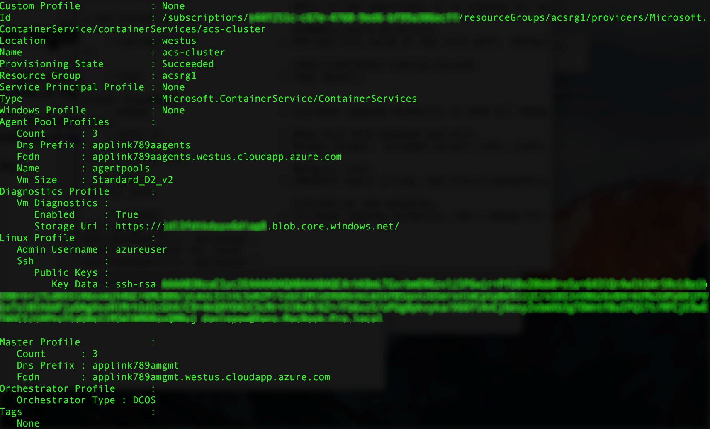

# <a name="deploy-a-docker-container-hosting-solution-using-hello-azure-cli-20"></a>部署 Docker 容器主機使用 Azure CLI 2.0 hello 的解決方案

使用 hello `az acs` hello Azure CLI 2.0 toocreate 中的命令和管理 Azure 容器服務中的叢集。 您也可以部署與 Azure 容器服務的叢集使用 hello [Azure 入口網站](container-service-deployment.md)或 hello Azure 容器服務 Api。

如需有關說明`az acs`命令，傳送嗨`-h`參數 tooany 命令。 例如： `az acs create -h`。


## <a name="prerequisites"></a>必要條件
Azure 容器服務叢集使用 toocreate hello Azure CLI 2.0，您必須：
* 有一個 Azure 帳戶 ([取得免費試用帳戶](https://azure.microsoft.com/pricing/free-trial/))
* 已安裝並設定 hello [Azure CLI 2.0](/cli/azure/install-az-cli2)

## <a name="get-started"></a>開始使用 
### <a name="log-in-tooyour-account"></a>登入 tooyour 帳戶
```azurecli
az login 
```

以互動方式遵循 hello 提示 toolog 中。 在其他方法 toolog，請參閱[開始使用 Azure CLI 2.0](/cli/azure/get-started-with-az-cli2)。

### <a name="set-your-azure-subscription"></a>設定您的 Azure 訂用帳戶

如果您有多個 Azure 訂用帳戶，設定 hello 預設訂用帳戶。 例如：

```
az account set --subscription "f66xxxxx-xxxx-xxxx-xxx-zgxxxx33cha5"
```


### <a name="create-a-resource-group"></a>建立資源群組
建議您建立每個叢集的資源群組。 指定[可使用](https://azure.microsoft.com/en-us/regions/services/) Azure Container Service 的 Azure 區域。 例如：

```azurecli
az group create -n acsrg1 -l "westus"
```
輸出是類似 toohello 下列：


## <a name="create-an-azure-container-service-cluster"></a>建立 Azure Container Service 叢集

toocreate 叢集中，使用`az acs create`。
Hello 叢集名稱和 hello hello hello 先前步驟中建立的資源群組名稱是必要的參數。 

其他的輸入是設定 toodefault 值 （請參閱下列畫面 hello） 除非覆寫使用其個別的交換器。 例如，hello orchestrator 會設定預設 tooDC/OS。 如果您未指定其中一個，DNS 名稱前置詞會根據建立 hello 叢集名稱。


### <a name="quick-acs-create-using-defaults"></a>使用預設值的快速 `acs create`
如果您有 SSH RSA 公開金鑰檔`id_rsa.pub`hello 預設位置 (或建立一個用於[OS X 和 Linux](../../virtual-machines/linux/mac-create-ssh-keys.md)或[Windows](../../virtual-machines/linux/ssh-from-windows.md))，使用類似 hello 下列命令：

```azurecli
az acs create -n acs-cluster -g acsrg1 -d applink789
```
如果您沒有 SSH 公開金鑰，請使用此第二個命令。 此命令以 hello`--generate-ssh-keys`切換為您建立一個。

```azurecli
az acs create -n acs-cluster -g acsrg1 -d applink789 --generate-ssh-keys
```

輸入 hello 命令之後，請等候約 10 分鐘的 hello 叢集 toobe 建立。 hello 命令輸出中包含 hello 主機和代理程式節點和 SSH 命令 tooconnect toohello 第一個主機的完整的網域的名稱 (Fqdn)。 以下是簡短的輸出︰


> [!TIP]
> hello [Kubernetes 逐步解說](../kubernetes/container-service-kubernetes-walkthrough.md)示範如何 toouse`az acs create`與預設值 toocreate Kubernetes 叢集。
>

## <a name="manage-acs-clusters"></a>管理 ACS 叢集

使用其他`az acs`命令 toomanage 您的叢集。 以下是一些範例。

### <a name="list-clusters-under-a-subscription"></a>列出訂用帳戶之下的叢集

```azurecli
az acs list --output table
```

### <a name="list-clusters-in-a-resource-group"></a>列出資源群組中的叢集

```azurecli
az acs list -g acsrg1 --output table
```


### <a name="display-details-of-a-container-service-cluster"></a>顯示容器服務叢集的詳細資料

```azurecli
az acs show -g acsrg1 -n acs-cluster --output list
```




### <a name="scale-hello-cluster"></a>標尺 hello 叢集
允許相應放大和相應縮小代理程式節點。 hello 參數`new-agent-count`是 hello 新 hello ACS 叢集中的代理程式數目。

```azurecli
az acs scale -g acsrg1 -n acs-cluster --new-agent-count 4
```


## <a name="delete-a-container-service-cluster"></a>刪除容器服務叢集
```azurecli
az acs delete -g acsrg1 -n acs-cluster 
```
此命令不會刪除所有資源 （網路和儲存體） 建立 hello 容器服務時建立。 toodelete 所有資源，建議您部署的不同資源群組中每個叢集。 然後，在 hello 叢集已不再需要時刪除 hello 資源群組。

## <a name="next-steps"></a>後續步驟
既然您有一個可運作的叢集，請參閱這些文件來了解連接和管理的詳細資料：

* [Tooan Azure 容器服務叢集連線](../container-service-connect.md)
* [使用 Azure Container Service 和 DC/OS](container-service-mesos-marathon-rest.md)
* [使用 Azure Container Service 和 Docker Swarm](container-service-docker-swarm.md)
* [使用 Azure Container Service 和 Kubernetes](../kubernetes/container-service-kubernetes-walkthrough.md)