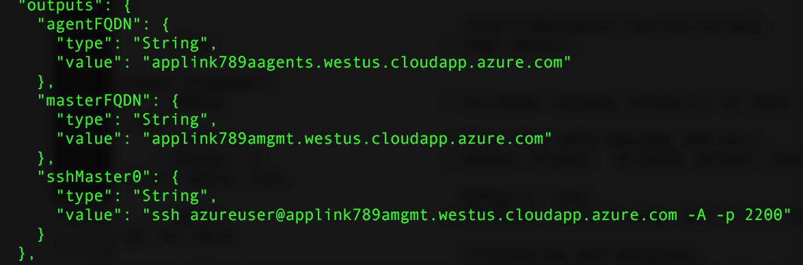

# <a name="deploy-a-docker-container-hosting-solution-using-hello-azure-cli-20"></a><span data-ttu-id="e2758-103">部署 Docker 容器主機使用 Azure CLI 2.0 hello 的解決方案</span><span class="sxs-lookup"><span data-stu-id="e2758-103">Deploy a Docker container hosting solution using hello Azure CLI 2.0</span></span>

<span data-ttu-id="e2758-104">使用 hello `az acs` hello Azure CLI 2.0 toocreate 中的命令和管理 Azure 容器服務中的叢集。</span><span class="sxs-lookup"><span data-stu-id="e2758-104">Use hello `az acs` commands in hello Azure CLI 2.0 toocreate and manage clusters in Azure Container Service.</span></span> <span data-ttu-id="e2758-105">您也可以部署與 Azure 容器服務的叢集使用 hello [Azure 入口網站](container-service-deployment.md)或 hello Azure 容器服務 Api。</span><span class="sxs-lookup"><span data-stu-id="e2758-105">You can also deploy an Azure Container Service cluster by using hello [Azure portal](container-service-deployment.md) or hello Azure Container Service APIs.</span></span>

<span data-ttu-id="e2758-106">如需有關說明`az acs`命令，傳送嗨`-h`參數 tooany 命令。</span><span class="sxs-lookup"><span data-stu-id="e2758-106">For help on `az acs` commands, pass hello `-h` parameter tooany command.</span></span> <span data-ttu-id="e2758-107">例如： `az acs create -h`。</span><span class="sxs-lookup"><span data-stu-id="e2758-107">For example: `az acs create -h`.</span></span>


## <a name="prerequisites"></a><span data-ttu-id="e2758-108">必要條件</span><span class="sxs-lookup"><span data-stu-id="e2758-108">Prerequisites</span></span>
<span data-ttu-id="e2758-109">Azure 容器服務叢集使用 toocreate hello Azure CLI 2.0，您必須：</span><span class="sxs-lookup"><span data-stu-id="e2758-109">toocreate an Azure Container Service cluster using hello Azure CLI 2.0, you must:</span></span>
* <span data-ttu-id="e2758-110">有一個 Azure 帳戶 ([取得免費試用帳戶](https://azure.microsoft.com/pricing/free-trial/))</span><span class="sxs-lookup"><span data-stu-id="e2758-110">have an Azure account ([get a free trial](https://azure.microsoft.com/pricing/free-trial/))</span></span>
* <span data-ttu-id="e2758-111">已安裝並設定 hello [Azure CLI 2.0](/cli/azure/install-az-cli2)</span><span class="sxs-lookup"><span data-stu-id="e2758-111">have installed and set up hello [Azure CLI 2.0](/cli/azure/install-az-cli2)</span></span>

## <a name="get-started"></a><span data-ttu-id="e2758-112">開始使用</span><span class="sxs-lookup"><span data-stu-id="e2758-112">Get started</span></span> 
### <a name="log-in-tooyour-account"></a><span data-ttu-id="e2758-113">登入 tooyour 帳戶</span><span class="sxs-lookup"><span data-stu-id="e2758-113">Log in tooyour account</span></span>
```azurecli
az login 
```

<span data-ttu-id="e2758-114">以互動方式遵循 hello 提示 toolog 中。</span><span class="sxs-lookup"><span data-stu-id="e2758-114">Follow hello prompts toolog in interactively.</span></span> <span data-ttu-id="e2758-115">在其他方法 toolog，請參閱[開始使用 Azure CLI 2.0](/cli/azure/get-started-with-az-cli2)。</span><span class="sxs-lookup"><span data-stu-id="e2758-115">For other methods toolog in, see [Get started with Azure CLI 2.0](/cli/azure/get-started-with-az-cli2).</span></span>

### <a name="set-your-azure-subscription"></a><span data-ttu-id="e2758-116">設定您的 Azure 訂用帳戶</span><span class="sxs-lookup"><span data-stu-id="e2758-116">Set your Azure subscription</span></span>

<span data-ttu-id="e2758-117">如果您有多個 Azure 訂用帳戶，設定 hello 預設訂用帳戶。</span><span class="sxs-lookup"><span data-stu-id="e2758-117">If you have more than one Azure subscription, set hello default subscription.</span></span> <span data-ttu-id="e2758-118">例如：</span><span class="sxs-lookup"><span data-stu-id="e2758-118">For example:</span></span>

```
az account set --subscription "f66xxxxx-xxxx-xxxx-xxx-zgxxxx33cha5"
```


### <a name="create-a-resource-group"></a><span data-ttu-id="e2758-119">建立資源群組</span><span class="sxs-lookup"><span data-stu-id="e2758-119">Create a resource group</span></span>
<span data-ttu-id="e2758-120">建議您建立每個叢集的資源群組。</span><span class="sxs-lookup"><span data-stu-id="e2758-120">We recommend that you create a resource group for every cluster.</span></span> <span data-ttu-id="e2758-121">指定[可使用](https://azure.microsoft.com/en-us/regions/services/) Azure Container Service 的 Azure 區域。</span><span class="sxs-lookup"><span data-stu-id="e2758-121">Specify an Azure region in which Azure Container Service is [available](https://azure.microsoft.com/en-us/regions/services/).</span></span> <span data-ttu-id="e2758-122">例如：</span><span class="sxs-lookup"><span data-stu-id="e2758-122">For example:</span></span>

```azurecli
az group create -n acsrg1 -l "westus"
```
<span data-ttu-id="e2758-123">輸出是類似 toohello 下列：</span><span class="sxs-lookup"><span data-stu-id="e2758-123">Output is similar toohello following:</span></span>


## <a name="create-an-azure-container-service-cluster"></a><span data-ttu-id="e2758-125">建立 Azure Container Service 叢集</span><span class="sxs-lookup"><span data-stu-id="e2758-125">Create an Azure Container Service cluster</span></span>

<span data-ttu-id="e2758-126">toocreate 叢集中，使用`az acs create`。</span><span class="sxs-lookup"><span data-stu-id="e2758-126">toocreate a cluster, use `az acs create`.</span></span>
<span data-ttu-id="e2758-127">Hello 叢集名稱和 hello hello hello 先前步驟中建立的資源群組名稱是必要的參數。</span><span class="sxs-lookup"><span data-stu-id="e2758-127">A name for hello cluster and hello name of hello resource group created in hello previous step are mandatory parameters.</span></span> 

<span data-ttu-id="e2758-128">其他的輸入是設定 toodefault 值 （請參閱下列畫面 hello） 除非覆寫使用其個別的交換器。</span><span class="sxs-lookup"><span data-stu-id="e2758-128">Other inputs are set toodefault values (see hello following screen) unless overwritten using their respective switches.</span></span> <span data-ttu-id="e2758-129">例如，hello orchestrator 會設定預設 tooDC/OS。</span><span class="sxs-lookup"><span data-stu-id="e2758-129">For example, hello orchestrator is set by default tooDC/OS.</span></span> <span data-ttu-id="e2758-130">如果您未指定其中一個，DNS 名稱前置詞會根據建立 hello 叢集名稱。</span><span class="sxs-lookup"><span data-stu-id="e2758-130">And if you don't specify one, a DNS name prefix is created based on hello cluster name.</span></span>


### <a name="quick-acs-create-using-defaults"></a><span data-ttu-id="e2758-132">使用預設值的快速 `acs create`</span><span class="sxs-lookup"><span data-stu-id="e2758-132">Quick `acs create` using defaults</span></span>
<span data-ttu-id="e2758-133">如果您有 SSH RSA 公開金鑰檔`id_rsa.pub`hello 預設位置 (或建立一個用於[OS X 和 Linux](../../virtual-machines/linux/mac-create-ssh-keys.md)或[Windows](../../virtual-machines/linux/ssh-from-windows.md))，使用類似 hello 下列命令：</span><span class="sxs-lookup"><span data-stu-id="e2758-133">If you have an SSH RSA public key file `id_rsa.pub` in hello default location (or created one for [OS X and Linux](../../virtual-machines/linux/mac-create-ssh-keys.md) or [Windows](../../virtual-machines/linux/ssh-from-windows.md)), use a command like hello following:</span></span>

```azurecli
az acs create -n acs-cluster -g acsrg1 -d applink789
```
<span data-ttu-id="e2758-134">如果您沒有 SSH 公開金鑰，請使用此第二個命令。</span><span class="sxs-lookup"><span data-stu-id="e2758-134">If you don't have an SSH public key, use this second command.</span></span> <span data-ttu-id="e2758-135">此命令以 hello`--generate-ssh-keys`切換為您建立一個。</span><span class="sxs-lookup"><span data-stu-id="e2758-135">This command with hello `--generate-ssh-keys` switch creates one for you.</span></span>

```azurecli
az acs create -n acs-cluster -g acsrg1 -d applink789 --generate-ssh-keys
```

<span data-ttu-id="e2758-136">輸入 hello 命令之後，請等候約 10 分鐘的 hello 叢集 toobe 建立。</span><span class="sxs-lookup"><span data-stu-id="e2758-136">After you enter hello command, wait for about 10 minutes for hello cluster toobe created.</span></span> <span data-ttu-id="e2758-137">hello 命令輸出中包含 hello 主機和代理程式節點和 SSH 命令 tooconnect toohello 第一個主機的完整的網域的名稱 (Fqdn)。</span><span class="sxs-lookup"><span data-stu-id="e2758-137">hello command output includes fully qualified domain names (FQDNs) of hello master and agent nodes and an SSH command tooconnect toohello first master.</span></span> <span data-ttu-id="e2758-138">以下是簡短的輸出︰</span><span class="sxs-lookup"><span data-stu-id="e2758-138">Here is abbreviated output:</span></span>



> [!TIP]
> <span data-ttu-id="e2758-140">hello [Kubernetes 逐步解說](../kubernetes/container-service-kubernetes-walkthrough.md)示範如何 toouse`az acs create`與預設值 toocreate Kubernetes 叢集。</span><span class="sxs-lookup"><span data-stu-id="e2758-140">hello [Kubernetes walkthrough](../kubernetes/container-service-kubernetes-walkthrough.md) shows how toouse `az acs create` with default values toocreate a Kubernetes cluster.</span></span>
>

## <a name="manage-acs-clusters"></a><span data-ttu-id="e2758-141">管理 ACS 叢集</span><span class="sxs-lookup"><span data-stu-id="e2758-141">Manage ACS clusters</span></span>

<span data-ttu-id="e2758-142">使用其他`az acs`命令 toomanage 您的叢集。</span><span class="sxs-lookup"><span data-stu-id="e2758-142">Use additional `az acs` commands toomanage your cluster.</span></span> <span data-ttu-id="e2758-143">以下是一些範例。</span><span class="sxs-lookup"><span data-stu-id="e2758-143">Here are some examples.</span></span>

### <a name="list-clusters-under-a-subscription"></a><span data-ttu-id="e2758-144">列出訂用帳戶之下的叢集</span><span class="sxs-lookup"><span data-stu-id="e2758-144">List clusters under a subscription</span></span>

```azurecli
az acs list --output table
```

### <a name="list-clusters-in-a-resource-group"></a><span data-ttu-id="e2758-145">列出資源群組中的叢集</span><span class="sxs-lookup"><span data-stu-id="e2758-145">List clusters in a resource group</span></span>

```azurecli
az acs list -g acsrg1 --output table
```


### <a name="display-details-of-a-container-service-cluster"></a><span data-ttu-id="e2758-147">顯示容器服務叢集的詳細資料</span><span class="sxs-lookup"><span data-stu-id="e2758-147">Display details of a container service cluster</span></span>

```azurecli
az acs show -g acsrg1 -n acs-cluster --output list
```


### <a name="scale-hello-cluster"></a><span data-ttu-id="e2758-149">標尺 hello 叢集</span><span class="sxs-lookup"><span data-stu-id="e2758-149">Scale hello cluster</span></span>
<span data-ttu-id="e2758-150">允許相應放大和相應縮小代理程式節點。</span><span class="sxs-lookup"><span data-stu-id="e2758-150">Both scaling in and scaling out of agent nodes are allowed.</span></span> <span data-ttu-id="e2758-151">hello 參數`new-agent-count`是 hello 新 hello ACS 叢集中的代理程式數目。</span><span class="sxs-lookup"><span data-stu-id="e2758-151">hello parameter `new-agent-count` is hello new number of agents in hello ACS cluster.</span></span>

```azurecli
az acs scale -g acsrg1 -n acs-cluster --new-agent-count 4
```


## <a name="delete-a-container-service-cluster"></a><span data-ttu-id="e2758-153">刪除容器服務叢集</span><span class="sxs-lookup"><span data-stu-id="e2758-153">Delete a container service cluster</span></span>
```azurecli
az acs delete -g acsrg1 -n acs-cluster 
```
<span data-ttu-id="e2758-154">此命令不會刪除所有資源 （網路和儲存體） 建立 hello 容器服務時建立。</span><span class="sxs-lookup"><span data-stu-id="e2758-154">This command does not delete all resources (network and storage) created while creating hello container service.</span></span> <span data-ttu-id="e2758-155">toodelete 所有資源，建議您部署的不同資源群組中每個叢集。</span><span class="sxs-lookup"><span data-stu-id="e2758-155">toodelete all resources easily, it is recommended you deploy each cluster in a distinct resource group.</span></span> <span data-ttu-id="e2758-156">然後，在 hello 叢集已不再需要時刪除 hello 資源群組。</span><span class="sxs-lookup"><span data-stu-id="e2758-156">Then, delete hello resource group when hello cluster is no longer required.</span></span>

## <a name="next-steps"></a><span data-ttu-id="e2758-157">後續步驟</span><span class="sxs-lookup"><span data-stu-id="e2758-157">Next steps</span></span>
<span data-ttu-id="e2758-158">既然您有一個可運作的叢集，請參閱這些文件來了解連接和管理的詳細資料：</span><span class="sxs-lookup"><span data-stu-id="e2758-158">Now that you have a functioning cluster, see these documents for connection and management details:</span></span>

* [<span data-ttu-id="e2758-159">Tooan Azure 容器服務叢集連線</span><span class="sxs-lookup"><span data-stu-id="e2758-159">Connect tooan Azure Container Service cluster</span></span>](../container-service-connect.md)
* [<span data-ttu-id="e2758-160">使用 Azure Container Service 和 DC/OS</span><span class="sxs-lookup"><span data-stu-id="e2758-160">Work with Azure Container Service and DC/OS</span></span>](container-service-mesos-marathon-rest.md)
* [<span data-ttu-id="e2758-161">使用 Azure Container Service 和 Docker Swarm</span><span class="sxs-lookup"><span data-stu-id="e2758-161">Work with Azure Container Service and Docker Swarm</span></span>](container-service-docker-swarm.md)
* [<span data-ttu-id="e2758-162">使用 Azure Container Service 和 Kubernetes</span><span class="sxs-lookup"><span data-stu-id="e2758-162">Work with Azure Container Service and Kubernetes</span></span>](../kubernetes/container-service-kubernetes-walkthrough.md)