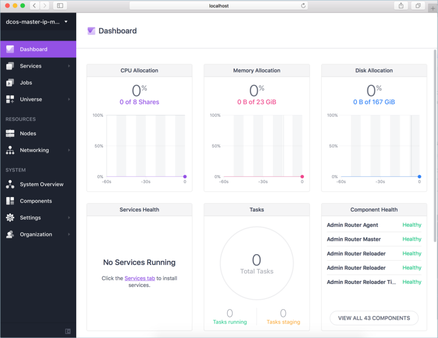
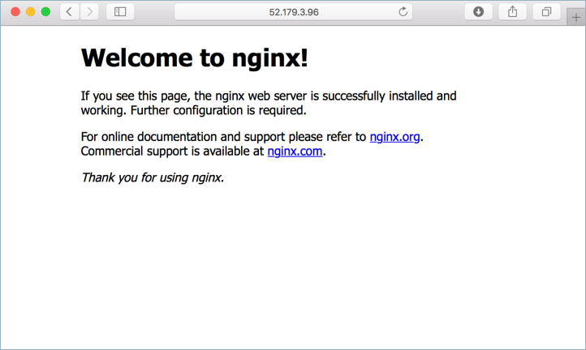

# <a name="deploy-a-dcos-cluster"></a>部署 DC/OS 叢集

DC/OS 所提供的分散式平台可執行現代及容器化的應用程式。 透過 Azure Container Service 可簡單又快速地佈建生產環境就緒 DC/OS 叢集。 DC/OS 叢集並執行基本的工作負載需要 toodeploy 此快速入門的詳細資料 hello 基本步驟。

如果您沒有 Azure 訂用帳戶，請在開始前建立 [免費帳戶](https://azure.microsoft.com/free/?WT.mc_id=A261C142F) 。

本教學課程需要 hello Azure CLI 版本 2.0.4 或更新版本。 執行`az --version`toofind hello 版本。 如果您需要 tooupgrade，請參閱[安裝 Azure CLI 2.0]( /cli/azure/install-azure-cli)。 

## <a name="log-in-tooazure"></a>登入 tooAzure 

登入 Azure 訂用帳戶以 hello tooyour [az 登入](/cli/azure/#login)命令，並遵循螢幕上指示 hello。

```azurecli
az login
```

## <a name="create-a-resource-group"></a>建立資源群組

建立資源群組以 hello [az 群組建立](/cli/azure/group#create)命令。 Azure 資源群組是在其中部署與管理 Azure 資源的邏輯容器。 

hello 下列範例會建立名為的資源群組*myResourceGroup*在 hello *eastus*位置。

```azurecli
az group create --name myResourceGroup --location eastus
```

## <a name="create-dcos-cluster"></a>建立 DC/OS 叢集

建立以 hello DC/OS 叢集[az acs 建立](/cli/azure/acs#create)命令。

hello 下列範例會建立名為 DC/OS 叢集*myDCOSCluster*並建立 SSH 金鑰，如果它們尚不存在。 toouse 一組特定的金鑰，請使用 hello`--ssh-key-value`選項。  

```azurecli
az acs create \
  --orchestrator-type dcos \
  --resource-group myResourceGroup \
  --name myDCOSCluster \
  --generate-ssh-keys
```

幾分鐘之後，hello 命令完成，且傳回 hello 部署的相關資訊。

## <a name="connect-toodcos-cluster"></a>TooDC/OS 叢集連線

一旦建立 DC/OS 叢集之後，可透過 SSH 通道加以存取。 執行下列命令 tooreturn hello 公用 IP 位址的 hello DC/OS master hello。 此 IP 位址是儲存在變數中，而且用於 hello 下一個步驟。

```azurecli
ip=$(az network public-ip list --resource-group myResourceGroup --query "[?contains(name,'dcos-master')].[ipAddress]" -o tsv)
```

toocreate hello SSH 通道，執行下列命令的 hello 並遵循螢幕上指示 hello。 如果連接埠 80 已在使用中，hello 命令將會失敗。 更新 hello 通道連接埠 tooone 不在使用中，例如`85:localhost:80`。 

```azurecli
sudo ssh -i ~/.ssh/id_rsa -fNL 80:localhost:80 -p 2200 azureuser@$ip
```

進行測試 hello SSH 通道，請瀏覽過`http://localhost`。 如果連接埠已使用 80，其他調整 hello 位置 toomatch。 

如果已成功建立 hello SSH 通道，則會傳回 hello DC/OS 入口網站。



## <a name="install-dcos-cli"></a>安裝 DC/OS CLI

hello DC/OS 命令列介面是使用的 toomanage DC/OS 叢集中，從命令列 hello。 安裝使用 hello hello DC/OS cli [az acs dcos 安裝 cli](/azure/acs/dcos#install-cli)命令。 如果您使用 Azure CloudShell，hello DC/OS CLI 已安裝。 

如果您執行 hello Azure CLI macOS 或 Linux 上，您可能需要具有 sudo toorun hello 命令。

```azurecli
az acs dcos install-cli
```

之前可使用 CLI 來與 hello 叢集 hello，它必須設定的 toouse hello SSH 通道。 toodo 因此，執行下列命令，如有需要調整 hello 連接埠的 hello。

```azurecli
dcos config set core.dcos_url http://localhost
```

## <a name="run-an-application"></a>執行應用程式

hello 預設排程 ACS DC/OS 叢集中的機制是馬拉松。 馬拉松是使用的 toostart 的應用程式，並管理 hello hello hello DC/OS 叢集上的應用程式狀態。 tooschedule 馬拉松，透過應用程式建立名為*馬拉松 app.json*，並複製 hello 遵循到其中的內容。 

```json
{
  "id": "demo-app",
  "cmd": null,
  "cpus": 1,
  "mem": 32,
  "disk": 0,
  "instances": 1,
  "container": {
    "docker": {
      "image": "nginx",
      "network": "BRIDGE",
      "portMappings": [
        {
          "containerPort": 80,
          "hostPort": 80,
          "protocol": "tcp",
          "name": "80",
          "labels": null
        }
      ]
    },
    "type": "DOCKER"
  },
  "acceptedResourceRoles": [
    "slave_public"
  ]
}
```

執行下列命令 tooschedule hello 應用程式 toorun hello DC/OS 叢集上的 hello。

```azurecli
dcos marathon app add marathon-app.json
```

hello 應用程式中，執行下列命令的 hello toosee hello 部署狀態。

```azurecli
dcos marathon app list
```

當 hello**等候**資料行值會從切換*True*太*False*，應用程式部署已完成。

```azurecli
ID     MEM  CPUS  TASKS  HEALTH  DEPLOYMENT  WAITING  CONTAINER  CMD   
/test   32   1     1/1    ---       ---      False      DOCKER   None
```

收到 hello 公用 IP 位址的 hello DC/OS 叢集代理程式。

```azurecli
az network public-ip list --resource-group myResourceGroup --query "[?contains(name,'dcos-agent')].[ipAddress]" -o tsv
```

瀏覽 toothis 位址傳回 hello 預設 NGINX 站台。



## <a name="delete-dcos-cluster"></a>刪除 DC/OS 叢集

當不再需要您可以使用 hello [az 群組刪除](/cli/azure/group#delete)命令 tooremove hello 資源群組、 DC/OS 叢集，以及所有相關的資源。

```azurecli
az group delete --name myResourceGroup --no-wait
```

## <a name="next-steps"></a>後續步驟

在這個快速入門中，您已部署的作業系統 DC/叢集，並擁有 hello 叢集上執行簡單的 Docker 容器。 進一步了解 Azure 容器服務，toolearn 繼續 toohello ACS 教學課程。

> [!div class="nextstepaction"]
> [管理 ACS DC/OS 叢集](container-service-dcos-manage-tutorial.md)