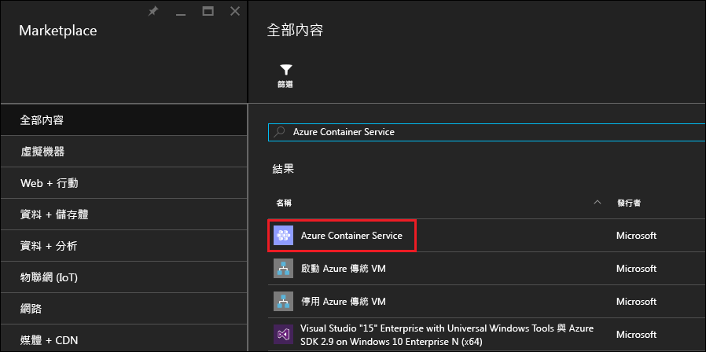
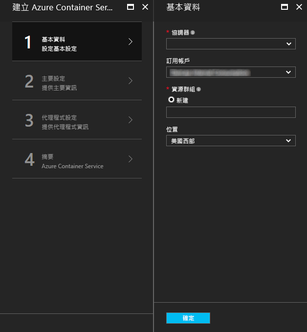
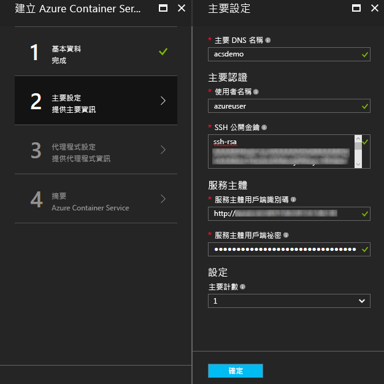
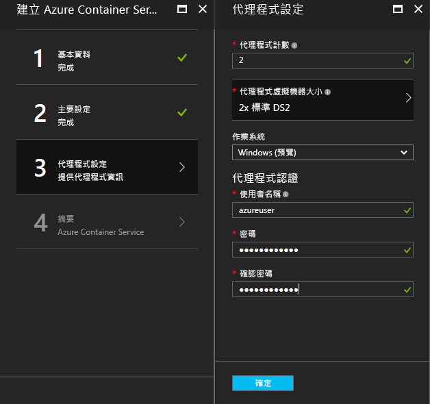
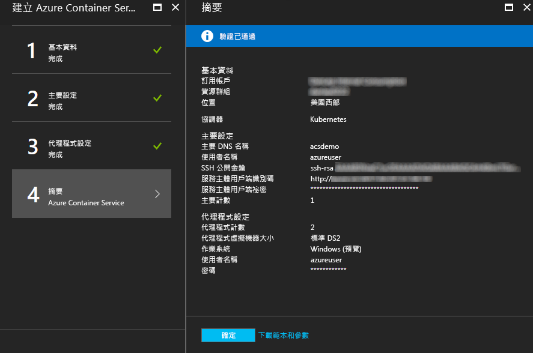
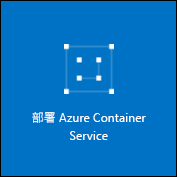

# <a name="deploy-a-docker-container-hosting-solution-using-hello-azure-portal"></a><span data-ttu-id="4f682-104">部署 Docker 容器主機使用 hello Azure 入口網站的解決方案</span><span class="sxs-lookup"><span data-stu-id="4f682-104">Deploy a Docker container hosting solution using hello Azure portal</span></span>


<span data-ttu-id="4f682-105">Azure Container Service 支援快速部署常用的開放原始碼容器叢集和協調流程解決方案。</span><span class="sxs-lookup"><span data-stu-id="4f682-105">Azure Container Service provides rapid deployment of popular open-source container clustering and orchestration solutions.</span></span> <span data-ttu-id="4f682-106">這份文件會引導您使用 hello Azure 入口網站或 Azure Resource Manager 快速入門範本部署與 Azure 容器服務的叢集。</span><span class="sxs-lookup"><span data-stu-id="4f682-106">This document walks you through deploying an Azure Container Service cluster by using hello Azure portal or an Azure Resource Manager quickstart template.</span></span> 

<span data-ttu-id="4f682-107">您也可以部署與 Azure 容器服務的叢集使用 hello [Azure CLI 2.0](container-service-create-acs-cluster-cli.md)或 hello Azure 容器服務 Api。</span><span class="sxs-lookup"><span data-stu-id="4f682-107">You can also deploy an Azure Container Service cluster by using hello [Azure CLI 2.0](container-service-create-acs-cluster-cli.md) or hello Azure Container Service APIs.</span></span>

<span data-ttu-id="4f682-108">若為背景，請參閱 [Azure Container Service 簡介](../container-service-intro.md)。</span><span class="sxs-lookup"><span data-stu-id="4f682-108">For background, see [Azure Container Service introduction](../container-service-intro.md).</span></span>


## <a name="prerequisites"></a><span data-ttu-id="4f682-109">必要條件</span><span class="sxs-lookup"><span data-stu-id="4f682-109">Prerequisites</span></span>

* <span data-ttu-id="4f682-110">**Azure 訂用帳戶**：如果您沒有帳戶，請註冊[免費試用](http://azure.microsoft.com/pricing/free-trial/?WT.mc_id=AA4C1C935)。</span><span class="sxs-lookup"><span data-stu-id="4f682-110">**Azure subscription**: If you don't have one, sign up for a [free trial](http://azure.microsoft.com/pricing/free-trial/?WT.mc_id=AA4C1C935).</span></span> <span data-ttu-id="4f682-111">針對較大的叢集，請考慮隨用隨付訂用帳戶或其他購買選項。</span><span class="sxs-lookup"><span data-stu-id="4f682-111">For a larger cluster, consider a pay-as-you go subscription or other purchase options.</span></span>

    > [!NOTE]
    > <span data-ttu-id="4f682-112">您的 Azure 訂用帳戶使用量和[資源配額](../../azure-subscription-service-limits.md)，例如核心配額，可以限制 hello 您部署的 hello 叢集大小。</span><span class="sxs-lookup"><span data-stu-id="4f682-112">Your Azure subscription usage and [resource quotas](../../azure-subscription-service-limits.md), such as cores quotas, can limit hello size of hello cluster you deploy.</span></span> <span data-ttu-id="4f682-113">toorequest 增加配額，開啟[線上客戶支援要求](../../azure-supportability/how-to-create-azure-support-request.md)不收費。</span><span class="sxs-lookup"><span data-stu-id="4f682-113">toorequest a quota increase, open an [online customer support request](../../azure-supportability/how-to-create-azure-support-request.md) at no charge.</span></span>
    >

* <span data-ttu-id="4f682-114">**SSH RSA 公開金鑰**： 部署時透過 hello 入口網站或一個 hello Azure 快速入門範本，您必須 tooprovide hello 公開金鑰來驗證對 Azure 容器服務的虛擬機器。</span><span class="sxs-lookup"><span data-stu-id="4f682-114">**SSH RSA public key**: When deploying through hello portal or one of hello Azure quickstart templates, you need tooprovide hello public key for authentication against Azure Container Service virtual machines.</span></span> <span data-ttu-id="4f682-115">toocreate 安全殼層 (SSH) 的 RSA 金鑰，請參閱 hello [OS X 和 Linux](../../virtual-machines/linux/mac-create-ssh-keys.md)或[Windows](../../virtual-machines/linux/ssh-from-windows.md)指引。</span><span class="sxs-lookup"><span data-stu-id="4f682-115">toocreate Secure Shell (SSH) RSA keys, see hello [OS X and Linux](../../virtual-machines/linux/mac-create-ssh-keys.md) or [Windows](../../virtual-machines/linux/ssh-from-windows.md) guidance.</span></span> 

* <span data-ttu-id="4f682-116">**服務主體的用戶端識別碼和密碼**(只有 Kubernetes): 如需詳細資訊和指導方針 toocreate Azure Active Directory 服務主體，請參閱[hello Kubernetes 叢集的服務主體相關](../kubernetes/container-service-kubernetes-service-principal.md)。</span><span class="sxs-lookup"><span data-stu-id="4f682-116">**Service principal client ID and secret** (Kubernetes only): For more information and guidance toocreate an Azure Active Directory service principal, see [About hello service principal for a Kubernetes cluster](../kubernetes/container-service-kubernetes-service-principal.md).</span></span>


## <a name="create-a-cluster-by-using-hello-azure-portal"></a><span data-ttu-id="4f682-117">使用 hello Azure 入口網站中建立叢集</span><span class="sxs-lookup"><span data-stu-id="4f682-117">Create a cluster by using hello Azure portal</span></span>
1. <span data-ttu-id="4f682-118">選取 登入 Azure 入口網站 toohello**新增**，並搜尋 hello Azure Marketplace 中的**Azure 容器服務**。</span><span class="sxs-lookup"><span data-stu-id="4f682-118">Sign in toohello Azure portal, select **New**, and search hello Azure Marketplace for **Azure Container Service**.</span></span>

      <br />

2. <span data-ttu-id="4f682-120">按一下 [Azure Container Service]，然後按一下 [建立]。</span><span class="sxs-lookup"><span data-stu-id="4f682-120">Click **Azure Container Service**, and click **Create**.</span></span>

3. <span data-ttu-id="4f682-121">在 hello**基本概念**刀鋒視窗中，輸入下列資訊的 hello:</span><span class="sxs-lookup"><span data-stu-id="4f682-121">On hello **Basics** blade, enter hello following information:</span></span>

    * <span data-ttu-id="4f682-122">**Orchestrator**： 選取其中一個 hello 容器 orchestrators toodeploy hello 叢集上。</span><span class="sxs-lookup"><span data-stu-id="4f682-122">**Orchestrator**: Select one of hello container orchestrators toodeploy on hello cluster.</span></span>
        * <span data-ttu-id="4f682-123">**DC/OS**：部署 DC/OS 叢集。</span><span class="sxs-lookup"><span data-stu-id="4f682-123">**DC/OS**: Deploys a DC/OS cluster.</span></span>
        * <span data-ttu-id="4f682-124">**Swarm**：部署 Docker Swarm 叢集。</span><span class="sxs-lookup"><span data-stu-id="4f682-124">**Swarm**: Deploys a Docker Swarm cluster.</span></span>
        * <span data-ttu-id="4f682-125">**Kubernetes**：部署 Kubernetes 叢集。</span><span class="sxs-lookup"><span data-stu-id="4f682-125">**Kubernetes**: Deploys a Kubernetes cluster.</span></span>
    * <span data-ttu-id="4f682-126">**訂用帳戶**：選取 Azure 訂用帳戶。</span><span class="sxs-lookup"><span data-stu-id="4f682-126">**Subscription**: Select an Azure subscription.</span></span>
    * <span data-ttu-id="4f682-127">**資源群組**： 輸入新的資源群組的 hello 部署 hello 名稱。</span><span class="sxs-lookup"><span data-stu-id="4f682-127">**Resource group**: Enter hello name of a new resource group for hello deployment.</span></span>
    * <span data-ttu-id="4f682-128">**位置**： 選取 hello Azure 容器服務部署的 Azure 區域。</span><span class="sxs-lookup"><span data-stu-id="4f682-128">**Location**: Select an Azure region for hello Azure Container Service deployment.</span></span> <span data-ttu-id="4f682-129">如需可用性，請查看[依區域提供的產品](https://azure.microsoft.com/regions/services/)。</span><span class="sxs-lookup"><span data-stu-id="4f682-129">For availability, check [Products available by region](https://azure.microsoft.com/regions/services/).</span></span>
    
      <br />
    
    <span data-ttu-id="4f682-131">按一下**確定**當您準備好 tooproceed。</span><span class="sxs-lookup"><span data-stu-id="4f682-131">Click **OK** when you're ready tooproceed.</span></span>

4. <span data-ttu-id="4f682-132">在 hello**主要組態**刀鋒視窗中，輸入下列 hello Linux 主要節點或節點 （部分設定都是特定 tooeach orchestrator） 的 hello 叢集中設定的 hello:</span><span class="sxs-lookup"><span data-stu-id="4f682-132">On hello **Master configuration** blade, enter hello following settings for hello Linux master node or nodes in hello cluster (some settings are specific tooeach orchestrator):</span></span>

    * <span data-ttu-id="4f682-133">**主要 DNS 名稱**: hello 使用前置詞 toocreate 唯一完整網域名稱 (FQDN) 的 hello master。</span><span class="sxs-lookup"><span data-stu-id="4f682-133">**Master DNS name**: hello prefix used toocreate a unique fully qualified domain name (FQDN) for hello master.</span></span> <span data-ttu-id="4f682-134">主要 FQDN 是 hello 表單的 hello*前置詞*管理*位置*。 cloudapp.azure.com。</span><span class="sxs-lookup"><span data-stu-id="4f682-134">hello master FQDN is of hello form *prefix*mgmt.*location*.cloudapp.azure.com.</span></span>
    * <span data-ttu-id="4f682-135">**使用者名稱**: hello hello 叢集中的 hello Linux 虛擬機器的每個帳戶的使用者名稱。</span><span class="sxs-lookup"><span data-stu-id="4f682-135">**User name**: hello user name for an account on each of hello Linux virtual machines in hello cluster.</span></span>
    * <span data-ttu-id="4f682-136">**SSH RSA 公開金鑰**： 新增 hello 公用金鑰 toobe 用於驗證 hello Linux 虛擬機器。</span><span class="sxs-lookup"><span data-stu-id="4f682-136">**SSH RSA public key**: Add hello public key toobe used for authentication against hello Linux virtual machines.</span></span> <span data-ttu-id="4f682-137">請務必此機碼包含沒有分行符號，並包含 hello`ssh-rsa`前置詞。</span><span class="sxs-lookup"><span data-stu-id="4f682-137">It is important that this key contains no line breaks, and it includes hello `ssh-rsa` prefix.</span></span> <span data-ttu-id="4f682-138">hello`username@domain`是選擇性的後置。</span><span class="sxs-lookup"><span data-stu-id="4f682-138">hello `username@domain` postfix is optional.</span></span> <span data-ttu-id="4f682-139">hello 機碼看起來應該類似下列 hello: **...ssh rsa AAAAB3Nz <>......UcyupgH azureuser@linuxvm** 。</span><span class="sxs-lookup"><span data-stu-id="4f682-139">hello key should look something like hello following: **ssh-rsa AAAAB3Nz...<...>...UcyupgH azureuser@linuxvm**.</span></span> 
    * <span data-ttu-id="4f682-140">**服務主體**： 如果您選取 hello Kubernetes orchestrator，請輸入 Azure Active Directory**服務主體的用戶端識別碼**（也稱為 hello appId） 和**服務主體的用戶端密碼**（密碼）。</span><span class="sxs-lookup"><span data-stu-id="4f682-140">**Service principal**: If you selected hello Kubernetes orchestrator, enter an Azure Active Directory **Service principal client ID** (also called hello appId) and **Service principal client secret** (password).</span></span> <span data-ttu-id="4f682-141">如需詳細資訊，請參閱[hello Kubernetes 叢集的服務主體相關](../kubernetes/container-service-kubernetes-service-principal.md)。</span><span class="sxs-lookup"><span data-stu-id="4f682-141">For more information, see [About hello service principal for a Kubernetes cluster](../kubernetes/container-service-kubernetes-service-principal.md).</span></span>
    * <span data-ttu-id="4f682-142">**主要計數**: hello hello 叢集中的主機數目。</span><span class="sxs-lookup"><span data-stu-id="4f682-142">**Master count**: hello number of masters in hello cluster.</span></span>
    * <span data-ttu-id="4f682-143">**VM 診斷**： 針對某些 orchestrators，您可以啟用 hello 母片上的 VM 診斷。</span><span class="sxs-lookup"><span data-stu-id="4f682-143">**VM diagnostics**: For some orchestrators, you can enable VM diagnostics on hello masters.</span></span>

      <br />

    <span data-ttu-id="4f682-145">按一下**確定**當您準備好 tooproceed。</span><span class="sxs-lookup"><span data-stu-id="4f682-145">Click **OK** when you're ready tooproceed.</span></span>

5. <span data-ttu-id="4f682-146">在 hello**代理程式設定**刀鋒視窗中，輸入下列資訊的 hello:</span><span class="sxs-lookup"><span data-stu-id="4f682-146">On hello **Agent configuration** blade, enter hello following information:</span></span>

    * <span data-ttu-id="4f682-147">**代理程式計數**： 如需 Docker 群集和 Kubernetes，這個值會是 hello 的 hello 代理程式規模集中的代理程式的初始數目。</span><span class="sxs-lookup"><span data-stu-id="4f682-147">**Agent count**: For Docker Swarm and Kubernetes, this value is hello initial number of agents in hello agent scale set.</span></span> <span data-ttu-id="4f682-148">DC/作業系統，對於 hello 的私用規模集中的代理程式的初始數目。</span><span class="sxs-lookup"><span data-stu-id="4f682-148">For DC/OS, it is hello initial number of agents in a private scale set.</span></span> <span data-ttu-id="4f682-149">此外，也會建立 DC/OS 的公用擴展集，其中包含預先決定的代理程式數目。</span><span class="sxs-lookup"><span data-stu-id="4f682-149">Additionally, a public scale set is created for DC/OS, which contains a predetermined number of agents.</span></span> <span data-ttu-id="4f682-150">hello 這個公用的規模集中的代理程式數目取決於 hello hello 叢集中的主機數目： 一個主要，一個公用代理程式和三個或五個主機的兩個公用的代理程式。</span><span class="sxs-lookup"><span data-stu-id="4f682-150">hello number of agents in this public scale set is determined by hello number of masters in hello cluster: one public agent for one master, and two public agents for three or five masters.</span></span>
    * <span data-ttu-id="4f682-151">**代理程式的虛擬機器大小**: hello hello 代理程式的虛擬機器的大小。</span><span class="sxs-lookup"><span data-stu-id="4f682-151">**Agent virtual machine size**: hello size of hello agent virtual machines.</span></span>
    * <span data-ttu-id="4f682-152">**作業系統**： 此設定為目前選取 hello Kubernetes orchestrator 時，才可以使用。</span><span class="sxs-lookup"><span data-stu-id="4f682-152">**Operating system**: This setting is currently available only if you selected hello Kubernetes orchestrator.</span></span> <span data-ttu-id="4f682-153">選擇 Linux 散發套件或 Windows Server 作業系統 toorun hello 代理程式上。</span><span class="sxs-lookup"><span data-stu-id="4f682-153">Choose either a Linux distribution or a Windows Server operating system toorun on hello agents.</span></span> <span data-ttu-id="4f682-154">此設定會決定您的叢集可以執行 Linux 或 Windows 容器應用程式。</span><span class="sxs-lookup"><span data-stu-id="4f682-154">This setting determines whether your cluster can run Linux or Windows container apps.</span></span> 

        > [!NOTE]
        > <span data-ttu-id="4f682-155">對於 Kubernetes 叢集，Windows 容器支援處於預覽階段。</span><span class="sxs-lookup"><span data-stu-id="4f682-155">Windows container support is in preview for Kubernetes clusters.</span></span> <span data-ttu-id="4f682-156">在 DC/OS 和 Swarm 叢集上，Azure Container Service 中目前只支援 Linux 代理程式。</span><span class="sxs-lookup"><span data-stu-id="4f682-156">On DC/OS and Swarm clusters, only Linux agents are currently supported in Azure Container Service.</span></span>

    * <span data-ttu-id="4f682-157">**代理程式認證**： 如果您選取 hello Windows 作業系統，請輸入系統管理員**使用者名**和**密碼**hello 代理程式 」 的 Vm。</span><span class="sxs-lookup"><span data-stu-id="4f682-157">**Agent credentials**: If you selected hello Windows operating system, enter an administrator **User name** and **Password** for hello agent VMs.</span></span> 

      <br />

    <span data-ttu-id="4f682-159">按一下**確定**當您準備好 tooproceed。</span><span class="sxs-lookup"><span data-stu-id="4f682-159">Click **OK** when you're ready tooproceed.</span></span>

6. <span data-ttu-id="4f682-160">服務驗證完成後請按一下 [確定]。</span><span class="sxs-lookup"><span data-stu-id="4f682-160">After service validation finishes, click **OK**.</span></span>

      <br />

7. <span data-ttu-id="4f682-162">檢閱 hello 條款。</span><span class="sxs-lookup"><span data-stu-id="4f682-162">Review hello terms.</span></span> <span data-ttu-id="4f682-163">toostart hello 部署程序中，按一下 **建立**。</span><span class="sxs-lookup"><span data-stu-id="4f682-163">toostart hello deployment process, click **Create**.</span></span>

    <span data-ttu-id="4f682-164">如果您已選擇 toopin hello 部署 toohello Azure 入口網站，您可以看到 hello 部署狀態。</span><span class="sxs-lookup"><span data-stu-id="4f682-164">If you've elected toopin hello deployment toohello Azure portal, you can see hello deployment status.</span></span>

      <br />

<span data-ttu-id="4f682-166">hello 部署需要數分鐘 toocomplete。</span><span class="sxs-lookup"><span data-stu-id="4f682-166">hello deployment takes several minutes toocomplete.</span></span> <span data-ttu-id="4f682-167">然後，hello Azure 容器服務叢集可供使用。</span><span class="sxs-lookup"><span data-stu-id="4f682-167">Then, hello Azure Container Service cluster is ready for use.</span></span>


## <a name="create-a-cluster-by-using-a-quickstart-template"></a><span data-ttu-id="4f682-168">使用快速入門範本建立叢集</span><span class="sxs-lookup"><span data-stu-id="4f682-168">Create a cluster by using a quickstart template</span></span>
<span data-ttu-id="4f682-169">Azure 快速入門範本是可用 toodeploy Azure 容器服務中的叢集。</span><span class="sxs-lookup"><span data-stu-id="4f682-169">Azure quickstart templates are available toodeploy a cluster in Azure Container Service.</span></span> <span data-ttu-id="4f682-170">hello 提供快速入門範本可以修改的 tooinclude 額外或進階 Azure 組態。</span><span class="sxs-lookup"><span data-stu-id="4f682-170">hello provided quickstart templates can be modified tooinclude additional or advanced Azure configuration.</span></span> <span data-ttu-id="4f682-171">toocreate 利用 Azure 快速入門範本與 Azure 容器服務的叢集，您需要 Azure 訂用帳戶。</span><span class="sxs-lookup"><span data-stu-id="4f682-171">toocreate an Azure Container Service cluster by using an Azure quickstart template, you need an Azure subscription.</span></span> <span data-ttu-id="4f682-172">如果您沒有訂用帳戶，請註冊[免費試用](http://azure.microsoft.com/pricing/free-trial/?WT.mc_id=AA4C1C935)。</span><span class="sxs-lookup"><span data-stu-id="4f682-172">If you don't have one, then sign up for a [free trial](http://azure.microsoft.com/pricing/free-trial/?WT.mc_id=AA4C1C935).</span></span> 

<span data-ttu-id="4f682-173">請遵循這些步驟 toodeploy 叢集中使用的範本和 hello Azure CLI 2.0 (請參閱[安裝和設定指示](/cli/azure/install-az-cli2))。</span><span class="sxs-lookup"><span data-stu-id="4f682-173">Follow these steps toodeploy a cluster using a template and hello Azure CLI 2.0 (see [installation and setup instructions](/cli/azure/install-az-cli2)).</span></span>

> [!NOTE] 
> <span data-ttu-id="4f682-174">如果您在 Windows 系統上，您可以使用類似步驟 toodeploy 範本，使用 Azure PowerShell。</span><span class="sxs-lookup"><span data-stu-id="4f682-174">If you're on a Windows system, you can use similar steps toodeploy a template using Azure PowerShell.</span></span> <span data-ttu-id="4f682-175">請參閱本節稍後的步驟。</span><span class="sxs-lookup"><span data-stu-id="4f682-175">See steps later in this section.</span></span> <span data-ttu-id="4f682-176">您也可以部署範本，以透過 hello[入口網站](../../azure-resource-manager/resource-group-template-deploy-portal.md)或其他方法。</span><span class="sxs-lookup"><span data-stu-id="4f682-176">You can also deploy a template through hello [portal](../../azure-resource-manager/resource-group-template-deploy-portal.md) or other methods.</span></span>

1. <span data-ttu-id="4f682-177">toodeploy DC/OS、 Docker Swarm，或 Kubernetes 叢集中，會選取其中一個 hello 可用的快速入門範本從 GitHub。</span><span class="sxs-lookup"><span data-stu-id="4f682-177">toodeploy a DC/OS, Docker Swarm, or Kubernetes cluster, select one of hello available quickstart templates from GitHub.</span></span> <span data-ttu-id="4f682-178">部分清單如下。</span><span class="sxs-lookup"><span data-stu-id="4f682-178">A partial list follows.</span></span> <span data-ttu-id="4f682-179">hello DC/OS 和群集範本是 hello 相同，除了 hello 預設 orchestrator 選取項目。</span><span class="sxs-lookup"><span data-stu-id="4f682-179">hello DC/OS and Swarm templates are hello same, except for hello default orchestrator selection.</span></span>

    * [<span data-ttu-id="4f682-180">DC/OS 範本</span><span class="sxs-lookup"><span data-stu-id="4f682-180">DC/OS template</span></span>](https://github.com/Azure/azure-quickstart-templates/tree/master/101-acs-dcos)
    * [<span data-ttu-id="4f682-181">Swarm 範本</span><span class="sxs-lookup"><span data-stu-id="4f682-181">Swarm template</span></span>](https://github.com/Azure/azure-quickstart-templates/tree/master/101-acs-swarm)
    * [<span data-ttu-id="4f682-182">Kubernetes 範本</span><span class="sxs-lookup"><span data-stu-id="4f682-182">Kubernetes template</span></span>](https://github.com/Azure/azure-quickstart-templates/tree/master/101-acs-kubernetes)

2. <span data-ttu-id="4f682-183">登入 Azure 帳戶 tooyour (`az login`)，並確定該 hello Azure CLI 連線的 tooyour Azure 訂用帳戶。</span><span class="sxs-lookup"><span data-stu-id="4f682-183">Log in tooyour Azure account (`az login`), and make sure that hello Azure CLI is connected tooyour Azure subscription.</span></span> <span data-ttu-id="4f682-184">您可以使用下列命令的 hello 看到 hello 預設訂用帳戶：</span><span class="sxs-lookup"><span data-stu-id="4f682-184">You can see hello default subscription by using hello following command:</span></span>

    ```azurecli
    az account show
    ```
    
    <span data-ttu-id="4f682-185">如果您有一個以上的訂用帳戶，以及需要 tooset 不同的預設訂用帳戶，執行`az account set --subscription`並指定 hello 訂用帳戶識別碼或名稱。</span><span class="sxs-lookup"><span data-stu-id="4f682-185">If you have more than one subscription and need tooset a different default subscription, run `az account set --subscription` and specify hello subscription ID or name.</span></span>

3. <span data-ttu-id="4f682-186">最佳做法，請將新的資源群組用於 hello 部署。</span><span class="sxs-lookup"><span data-stu-id="4f682-186">As a best practice, use a new resource group for hello deployment.</span></span> <span data-ttu-id="4f682-187">toocreate 資源群組、 使用 hello`az group create`命令指定的資源群組名稱和位置：</span><span class="sxs-lookup"><span data-stu-id="4f682-187">toocreate a resource group, use hello `az group create` command specify a resource group name and location:</span></span> 

    ```azurecli
    az group create --name "RESOURCE_GROUP" --location "LOCATION"
    ```

4. <span data-ttu-id="4f682-188">建立 JSON 檔案包含 hello 所需的範本參數。</span><span class="sxs-lookup"><span data-stu-id="4f682-188">Create a JSON file containing hello required template parameters.</span></span> <span data-ttu-id="4f682-189">下載 hello 參數檔名為`azuredeploy.parameters.json`，伴隨著 hello Azure 容器服務範本`azuredeploy.json`GitHub 中。</span><span class="sxs-lookup"><span data-stu-id="4f682-189">Download hello parameters file named `azuredeploy.parameters.json` that accompanies hello Azure Container Service template `azuredeploy.json` in GitHub.</span></span> <span data-ttu-id="4f682-190">輸入您叢集所需的參數值。</span><span class="sxs-lookup"><span data-stu-id="4f682-190">Enter required parameter values for your cluster.</span></span> 

    <span data-ttu-id="4f682-191">例如，toouse hello [DC/OS 範本](https://github.com/Azure/azure-quickstart-templates/tree/master/101-acs-dcos)，提供的參數值`dnsNamePrefix`和`sshRSAPublicKey`。</span><span class="sxs-lookup"><span data-stu-id="4f682-191">For example, toouse hello [DC/OS template](https://github.com/Azure/azure-quickstart-templates/tree/master/101-acs-dcos), supply parameter values for `dnsNamePrefix` and `sshRSAPublicKey`.</span></span> <span data-ttu-id="4f682-192">請參閱中的 hello 描述`azuredeploy.json`及其他參數的選項。</span><span class="sxs-lookup"><span data-stu-id="4f682-192">See hello descriptions in `azuredeploy.json` and options for other parameters.</span></span>  
 

5. <span data-ttu-id="4f682-193">建立容器服務叢集藉由傳遞 hello 部署參數檔案以 hello 下列命令，其中：</span><span class="sxs-lookup"><span data-stu-id="4f682-193">Create a Container Service cluster by passing hello deployment parameters file with hello following command, where:</span></span>

    * <span data-ttu-id="4f682-194">**RESOURCE_GROUP** hello hello hello 先前步驟中所建立的資源群組名稱。</span><span class="sxs-lookup"><span data-stu-id="4f682-194">**RESOURCE_GROUP** is hello name of hello resource group that you created in hello previous step.</span></span>
    * <span data-ttu-id="4f682-195">**DEPLOYMENT_NAME** （選擇性） 是提供 toohello 部署的名稱。</span><span class="sxs-lookup"><span data-stu-id="4f682-195">**DEPLOYMENT_NAME** (optional) is a name you give toohello deployment.</span></span>
    * <span data-ttu-id="4f682-196">**TEMPLATE_URI** hello hello 部署檔案的位置`azuredeploy.json`。</span><span class="sxs-lookup"><span data-stu-id="4f682-196">**TEMPLATE_URI** is hello location of hello deployment file `azuredeploy.json`.</span></span> <span data-ttu-id="4f682-197">此 URI 必須是 hello 未經處理的檔案，不指標 toohello GitHub UI。</span><span class="sxs-lookup"><span data-stu-id="4f682-197">This URI must be hello Raw file, not a pointer toohello GitHub UI.</span></span> <span data-ttu-id="4f682-198">toofind 此 URI，選取 hello`azuredeploy.json`檔案在 GitHub 中，然後按一下 hello **Raw**  按鈕。</span><span class="sxs-lookup"><span data-stu-id="4f682-198">toofind this URI, select hello `azuredeploy.json` file in GitHub, and click hello **Raw** button.</span></span>  

    ```azurecli
    az group deployment create -g RESOURCE_GROUP -n DEPLOYMENT_NAME --template-uri TEMPLATE_URI --parameters @azuredeploy.parameters.json
    ```

    <span data-ttu-id="4f682-199">您也可以提供參數以 JSON 格式的字串 hello 命令列上。</span><span class="sxs-lookup"><span data-stu-id="4f682-199">You can also provide parameters as a JSON-formatted string on hello command line.</span></span> <span data-ttu-id="4f682-200">使用類似 toohello 下列命令：</span><span class="sxs-lookup"><span data-stu-id="4f682-200">Use a command similar toohello following:</span></span>

    ```azurecli
    az group deployment create -g RESOURCE_GROUP -n DEPLOYMENT_NAME --template-uri TEMPLATE_URI --parameters "{ \"param1\": {\"value1\"} … }"
    ```

    > [!NOTE]
    > <span data-ttu-id="4f682-201">hello 部署需要數分鐘 toocomplete。</span><span class="sxs-lookup"><span data-stu-id="4f682-201">hello deployment takes several minutes toocomplete.</span></span>
    > 

### <a name="equivalent-powershell-commands"></a><span data-ttu-id="4f682-202">對等的 PowerShell 命令</span><span class="sxs-lookup"><span data-stu-id="4f682-202">Equivalent PowerShell commands</span></span>
<span data-ttu-id="4f682-203">您也可以使用 PowerShell 部署 Azure Container Service 叢集範本。</span><span class="sxs-lookup"><span data-stu-id="4f682-203">You can also deploy an Azure Container Service cluster template with PowerShell.</span></span> <span data-ttu-id="4f682-204">這份文件以 hello 1.0 版根據[Azure PowerShell 模組](https://azure.microsoft.com/blog/azps-1-0/)。</span><span class="sxs-lookup"><span data-stu-id="4f682-204">This document is based on hello version 1.0 [Azure PowerShell module](https://azure.microsoft.com/blog/azps-1-0/).</span></span>

1. <span data-ttu-id="4f682-205">toodeploy DC/OS、 Docker Swarm，或 Kubernetes 叢集中，會選取其中一個 hello 可用的快速入門範本從 GitHub。</span><span class="sxs-lookup"><span data-stu-id="4f682-205">toodeploy a DC/OS, Docker Swarm, or Kubernetes cluster, select one of hello available quickstart templates from GitHub.</span></span> <span data-ttu-id="4f682-206">部分清單如下。</span><span class="sxs-lookup"><span data-stu-id="4f682-206">A partial list follows.</span></span> <span data-ttu-id="4f682-207">請注意，hello DC/OS 和群集範本是 hello 相同，與 hello 例外狀況的 hello 預設 orchestrator 選取項目。</span><span class="sxs-lookup"><span data-stu-id="4f682-207">Note that hello DC/OS and Swarm templates are hello same, with hello exception of hello default orchestrator selection.</span></span>

    * [<span data-ttu-id="4f682-208">DC/OS 範本</span><span class="sxs-lookup"><span data-stu-id="4f682-208">DC/OS template</span></span>](https://github.com/Azure/azure-quickstart-templates/tree/master/101-acs-dcos)
    * [<span data-ttu-id="4f682-209">Swarm 範本</span><span class="sxs-lookup"><span data-stu-id="4f682-209">Swarm template</span></span>](https://github.com/Azure/azure-quickstart-templates/tree/master/101-acs-swarm)
    * [<span data-ttu-id="4f682-210">Kubernetes 範本</span><span class="sxs-lookup"><span data-stu-id="4f682-210">Kubernetes template</span></span>](https://github.com/Azure/azure-quickstart-templates/tree/master/101-acs-kubernetes)

2. <span data-ttu-id="4f682-211">之前在您的 Azure 訂用帳戶中建立叢集，確認您的 PowerShell 工作階段具有已登入 tooAzure。</span><span class="sxs-lookup"><span data-stu-id="4f682-211">Before creating a cluster in your Azure subscription, verify that your PowerShell session has been signed in tooAzure.</span></span> <span data-ttu-id="4f682-212">您可以以 hello`Get-AzureRMSubscription`命令：</span><span class="sxs-lookup"><span data-stu-id="4f682-212">You can do this with hello `Get-AzureRMSubscription` command:</span></span>

    ```powershell
    Get-AzureRmSubscription
    ```

3. <span data-ttu-id="4f682-213">如果您需要 toosign tooAzure 中的，使用 hello`Login-AzureRMAccount`命令：</span><span class="sxs-lookup"><span data-stu-id="4f682-213">If you need toosign in tooAzure, use hello `Login-AzureRMAccount` command:</span></span>

    ```powershell
    Login-AzureRmAccount
    ```

4. <span data-ttu-id="4f682-214">最佳做法，請將新的資源群組用於 hello 部署。</span><span class="sxs-lookup"><span data-stu-id="4f682-214">As a best practice, use a new resource group for hello deployment.</span></span> <span data-ttu-id="4f682-215">toocreate 資源群組、 使用 hello`New-AzureRmResourceGroup`命令，並指定資源群組名稱和目的地區域：</span><span class="sxs-lookup"><span data-stu-id="4f682-215">toocreate a resource group, use hello `New-AzureRmResourceGroup` command, and specify a resource group name and destination region:</span></span>

    ```powershell
    New-AzureRmResourceGroup -Name GROUP_NAME -Location REGION
    ```

5. <span data-ttu-id="4f682-216">建立資源群組之後，您可以使用下列命令的 hello 建立您的叢集。</span><span class="sxs-lookup"><span data-stu-id="4f682-216">After you create a resource group, you can create your cluster with hello following command.</span></span> <span data-ttu-id="4f682-217">hello hello URI 需要範本會指定以 hello`-TemplateUri`參數。</span><span class="sxs-lookup"><span data-stu-id="4f682-217">hello URI of hello desired template is specified with hello `-TemplateUri` parameter.</span></span> <span data-ttu-id="4f682-218">當您執行此命令時，PowerShell 會提示您輸入部署參數值。</span><span class="sxs-lookup"><span data-stu-id="4f682-218">When you run this command, PowerShell prompts you for deployment parameter values.</span></span>

    ```powershell
    New-AzureRmResourceGroupDeployment -Name DEPLOYMENT_NAME -ResourceGroupName RESOURCE_GROUP_NAME -TemplateUri TEMPLATE_URI
    ```

#### <a name="provide-template-parameters"></a><span data-ttu-id="4f682-219">提供範本參數</span><span class="sxs-lookup"><span data-stu-id="4f682-219">Provide template parameters</span></span>
<span data-ttu-id="4f682-220">如果您熟悉 PowerShell，您知道您可以輸入減號 （-），然後按 hello TAB 鍵循環 hello 可用 cmdlet 的參數。</span><span class="sxs-lookup"><span data-stu-id="4f682-220">If you're familiar with PowerShell, you know that you can cycle through hello available parameters for a cmdlet by typing a minus sign (-) and then pressing hello TAB key.</span></span> <span data-ttu-id="4f682-221">相同的功能也適用於您在範本中定義的參數。</span><span class="sxs-lookup"><span data-stu-id="4f682-221">This same functionality also works with parameters that you define in your template.</span></span> <span data-ttu-id="4f682-222">只要您輸入 hello 範本名稱，hello cmdlet 提取 hello 範本、 剖析 hello 參數，並以動態方式加入 hello 範本參數 toohello 命令。</span><span class="sxs-lookup"><span data-stu-id="4f682-222">As soon as you type hello template name, hello cmdlet fetches hello template, parses hello parameters, and adds hello template parameters toohello command dynamically.</span></span> <span data-ttu-id="4f682-223">這使得輕鬆 toospecify hello 範本參數的值。</span><span class="sxs-lookup"><span data-stu-id="4f682-223">This makes it easy toospecify hello template parameter values.</span></span> <span data-ttu-id="4f682-224">如果您忘記必要的參數值時，PowerShell 會提示您輸入 hello 值。</span><span class="sxs-lookup"><span data-stu-id="4f682-224">And, if you forget a required parameter value, PowerShell prompts you for hello value.</span></span>

<span data-ttu-id="4f682-225">以下是 hello 完整命令，以包含的參數。</span><span class="sxs-lookup"><span data-stu-id="4f682-225">Here is hello full command, with parameters included.</span></span> <span data-ttu-id="4f682-226">Hello 資源名稱的 hello 提供您自己的值。</span><span class="sxs-lookup"><span data-stu-id="4f682-226">Provide your own values for hello names of hello resources.</span></span>

```powershell
New-AzureRmResourceGroupDeployment -ResourceGroupName RESOURCE_GROUP_NAME-TemplateURI TEMPLATE_URI -adminuser value1 -adminpassword value2 ....
```

## <a name="next-steps"></a><span data-ttu-id="4f682-227">後續步驟</span><span class="sxs-lookup"><span data-stu-id="4f682-227">Next steps</span></span>
<span data-ttu-id="4f682-228">既然您有一個可運作的叢集，請參閱這些文件來了解連接和管理的詳細資料：</span><span class="sxs-lookup"><span data-stu-id="4f682-228">Now that you have a functioning cluster, see these documents for connection and management details:</span></span>

* [<span data-ttu-id="4f682-229">Tooan Azure 容器服務叢集連線</span><span class="sxs-lookup"><span data-stu-id="4f682-229">Connect tooan Azure Container Service cluster</span></span>](../container-service-connect.md)
* [<span data-ttu-id="4f682-230">使用 Azure Container Service 和 DC/OS</span><span class="sxs-lookup"><span data-stu-id="4f682-230">Work with Azure Container Service and DC/OS</span></span>](container-service-mesos-marathon-rest.md)
* [<span data-ttu-id="4f682-231">使用 Azure Container Service 和 Docker Swarm</span><span class="sxs-lookup"><span data-stu-id="4f682-231">Work with Azure Container Service and Docker Swarm</span></span>](container-service-docker-swarm.md)
* [<span data-ttu-id="4f682-232">使用 Azure Container Service 和 Kubernetes</span><span class="sxs-lookup"><span data-stu-id="4f682-232">Work with Azure Container Service and Kubernetes</span></span>](../kubernetes/container-service-kubernetes-walkthrough.md)
