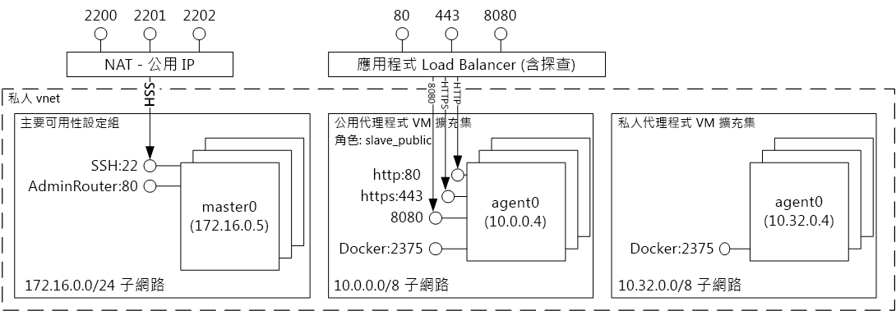
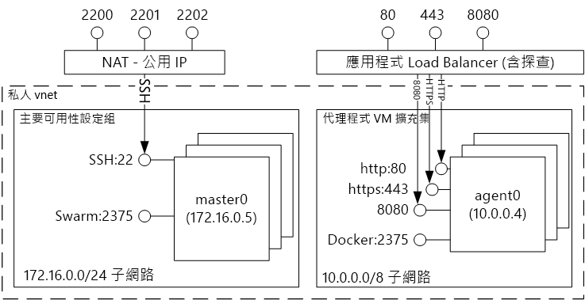
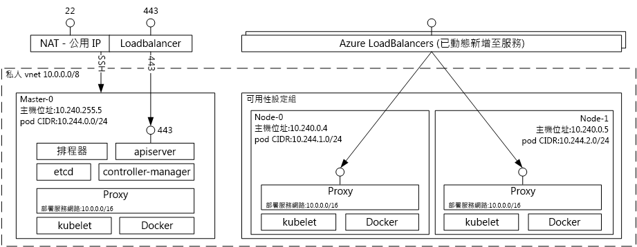

# 裝載 Azure 容器服務方案的簡介 tooDocker 容器Introduction tooDocker container hosting solutions with Azure Container Service 
Azure 容器服務簡化了 toocreate、 設定和管理所預先設定的 toorun 容器化應用程式的虛擬機器的叢集。Azure Container Service makes it simpler for you toocreate, configure, and manage a cluster of virtual machines that are preconfigured toorun containerized applications. 它使用受歡迎開放原始碼排程和協調流程工具的最佳化組態。It uses an optimized configuration of popular open-source scheduling and orchestration tools. 這可讓您 toouse 您現有的技術，或運用社群專業知識，toodeploy 大量且不斷主體和管理容器應用程式在 Microsoft Azure 上。This enables you toouse your existing skills, or draw upon a large and growing body of community expertise, toodeploy and manage container-based applications on Microsoft Azure.

Azure 容器服務會利用您的應用程式容器是完全可攜 hello Docker 容器格式 tooensure。Azure Container Service leverages hello Docker container format tooensure that your application containers are fully portable. 它也支援您所選擇的馬拉松和 DC/OS、 Docker Swarm，或 Kubernetes，以便您可以調整的容器，這些應用程式 toothousands 或甚至數以萬計。It also supports your choice of Marathon and DC/OS, Docker Swarm, or Kubernetes so that you can scale these applications toothousands of containers, or even tens of thousands.

藉由使用 Azure 容器服務，您可以利用企業級功能的 Azure，同時仍維持應用程式可攜性-包括 hello 協調流程層級的可攜性。By using Azure Container Service, you can take advantage of the enterprise-grade features of Azure, while still maintaining application portability--including portability at hello orchestration layers.

## 使用 Azure 容器服務Using Azure Container Service
我們使用 Azure 容器服務的目標是使用開放原始碼工具和技術，現在都可以在我們的客戶之間的熱門 tooprovide 容器主機環境。Our goal with Azure Container Service is tooprovide a container hosting environment by using open-source tools and technologies that are popular among our customers today. toothis 結束時，就會公開 hello 標準應用程式開發介面端點如您所選擇的 orchestrator （DC/OS，Docker Swarm，或 Kubernetes）。toothis end, we expose hello standard API endpoints for your chosen orchestrator (DC/OS, Docker Swarm, or Kubernetes). 藉由使用這些端點，您可以利用能夠 toothose 端點進行交談的任何軟體。By using these endpoints, you can leverage any software that is capable of talking toothose endpoints. 例如，在 hello Docker Swarm 端點的 hello 情況下，您可能會選擇 toouse hello Docker 命令列介面 (CLI)。For example, in hello case of hello Docker Swarm endpoint, you might choose toouse hello Docker command-line interface (CLI). DC/作業系統，您可能會選擇 hello DCOS CLI。For DC/OS, you might choose hello DCOS CLI. 若為 Kubernetes，您可以選擇 `kubectl`。For Kubernetes, you might choose `kubectl`.

## 使用 Azure Container Service 建立 Docker 叢集Creating a Docker cluster by using Azure Container Service
toobegin 使用 Azure 容器服務，您部署 Azure 容器服務叢集透過 hello 入口網站 (搜尋 hello Marketplace 的**Azure 容器服務**)，使用 Azure Resource Manager 範本 ([Docker廣域](https://github.com/Azure/azure-quickstart-templates/tree/master/101-acs-swarm)， [DC/OS](https://github.com/Azure/azure-quickstart-templates/tree/master/101-acs-dcos)，或[Kubernetes](https://github.com/Azure/azure-quickstart-templates/tree/master/101-acs-kubernetes))，或以 hello [Azure CLI 2.0](container-service-create-acs-cluster-cli.md)。toobegin using Azure Container Service, you deploy an Azure Container Service cluster via hello portal (search hello Marketplace for **Azure Container Service**), by using an Azure Resource Manager template ([Docker Swarm](https://github.com/Azure/azure-quickstart-templates/tree/master/101-acs-swarm), [DC/OS](https://github.com/Azure/azure-quickstart-templates/tree/master/101-acs-dcos), or [Kubernetes](https://github.com/Azure/azure-quickstart-templates/tree/master/101-acs-kubernetes)), or with hello [Azure CLI 2.0](container-service-create-acs-cluster-cli.md). hello 提供快速入門範本可以修改的 tooinclude 額外或進階 Azure 組態。hello provided quickstart templates can be modified tooinclude additional or advanced Azure configuration. 如需詳細資訊，請參閱[部署 Azure Container Service 叢集](container-service-deployment.md)。For more information, see [Deploy an Azure Container Service cluster](container-service-deployment.md).

## 部署應用程式Deploying an application
Azure Container Service 提供協調流程的選擇：Docker Swarm 、DC/OS 或 Kubernetes。Azure Container Service provides a choice of Docker Swarm, DC/OS, or Kubernetes for orchestration. 部署應用程式的方式取決於您所選擇的 Orchestrator。How you deploy your application depends on your choice of orchestrator.

### 使用 DC/OSUsing DC/OS
DC/OS 是分散式作業系統 hello Apache Mesos 分散式的系統的核心為基礎。DC/OS is a distributed operating system based on hello Apache Mesos distributed systems kernel. Apache Mesos 就會放在 hello Apache Software Foundation，並列出一些 hello[中的最大名稱 IT](http://mesos.apache.org/documentation/latest/powered-by-mesos/)做為使用者及參與者。Apache Mesos is housed at hello Apache Software Foundation and lists some of hello [biggest names in IT](http://mesos.apache.org/documentation/latest/powered-by-mesos/) as users and contributors.

DC/OS 和 Apache Mesos 包含令人印象深刻的功能集︰DC/OS and Apache Mesos include an impressive feature set:

* 經實證的延展性Proven scalability
* 使用 Apache ZooKeeper 進行主要和從屬容錯複寫Fault-tolerant replicated master and slaves using Apache ZooKeeper
* 支援 Docker 格式的容器Support for Docker-formatted containers
* 在工作與 Linux 容器之間的原生隔離Native isolation between tasks with Linux containers
* 多資源排程 (記憶體、CPU、磁碟和連接埠)Multiresource scheduling (memory, CPU, disk, and ports)
* 用於開發全新平行應用程式的 Java、Python 和 C++ APIJava, Python, and C++ APIs for developing new parallel applications
* 用於檢視叢集狀態的 Web UIA web UI for viewing cluster state

根據預設，在 Azure 容器服務上執行的 DC/OS 會包括 hello 馬拉松協調流程平台，用來設定排程的工作負載。By default, DC/OS running on Azure Container Service includes hello Marathon orchestration platform for scheduling workloads. 不過，包含以 hello DC/OS 部署 ACS 是 hello Mesosphere Universe 的可以加入 tooyour 服務的服務。However, included with hello DC/OS deployment of ACS is hello Mesosphere Universe of services that can be added tooyour service. 服務在 hello Universe 包括 Spark、 Hadoop、 Cassandra，以及執行更多。Services in hello Universe include Spark, Hadoop, Cassandra, and much more.

#### 使用 MarathonUsing Marathon
馬拉松是整個叢集 init 和服務在 cgroups-，或在 hello 情況下，Azure 容器服務，Docker 格式化容器的控制系統。Marathon is a cluster-wide init and control system for services in cgroups--or, in hello case of Azure Container Service, Docker-formatted containers. Marathon 提供 Web UI，您可以用它來部署您的應用程式。Marathon provides a web UI from which you can deploy your applications. 您可以在 `http://DNS_PREFIX.REGION.cloudapp.azure.com` 這樣的 URL 存取此程式：其中 DNS\_PREFIX 及 REGION 兩者都在部署時定義。You can access this at a URL that looks something like `http://DNS_PREFIX.REGION.cloudapp.azure.com` where DNS\_PREFIX and REGION are both defined at deployment time. 當然，您也可以提供您自己的 DNS 名稱。Of course, you can also provide your own DNS name. 如需有關執行的容器使用 hello 馬拉松 web UI 的詳細資訊，請參閱[DC/OS 容器管理透過 hello 馬拉松 web UI](container-service-mesos-marathon-ui.md)。For more information on running a container using hello Marathon web UI, see [DC/OS container management through hello Marathon web UI](container-service-mesos-marathon-ui.md).

您也可以使用 REST Api hello 與馬拉松進行通訊。You can also use hello REST APIs for communicating with Marathon. 有許多可用於每個工具的用戶端程式庫。There are a number of client libraries that are available for each tool. 這些資料涵蓋多種語言-和當然，您可以使用任何語言的 hello HTTP 通訊協定。They cover a variety of languages--and, of course, you can use hello HTTP protocol in any language. 此外，許多受歡迎的 DevOps 工具都提供 Marathon 的支援。In addition, many popular DevOps tools provide support for Marathon. 當您使用 Azure Container Service 叢集時，這為作業小組提供了最大的彈性。This provides maximum flexibility for your operations team when you are working with an Azure Container Service cluster. 如需有關使用 hello 馬拉松 REST API 來執行容器的詳細資訊，請參閱[透過 hello 馬拉松 REST API 的 DC/OS 容器管理](container-service-mesos-marathon-rest.md)。For more information on running a container by using hello Marathon REST API, see [DC/OS container management through hello Marathon REST API](container-service-mesos-marathon-rest.md).

### 使用 Docker SwarmUsing Docker Swarm
Docker Swarm 為 Docker 提供原生叢集。Docker Swarm provides native clustering for Docker. 因為 Docker Swarm 兼具 hello 標準 Docker 的 API，任何已經與 Docker 精靈通訊的工具可以使用 Azure 容器服務群集 tootransparently 標尺 toomultiple 主機。Because Docker Swarm serves hello standard Docker API, any tool that already communicates with a Docker daemon can use Swarm tootransparently scale toomultiple hosts on Azure Container Service.

[!INCLUDE [container-service-swarm-mode-note](../../../includes/container-service-swarm-mode-note.md)]

管理容器群集叢集上的支援的工具包括但不限於下列 hello:Supported tools for managing containers on a Swarm cluster include, but are not limited to, hello following:

* DokkuDokku
* Docker CLI 與 Docker ComposeDocker CLI and Docker Compose
* KraneKrane
* JenkinsJenkins

### 使用 KubernetesUsing Kubernetes
Kubernetes 是常用的開放原始碼生產等級容器 Orchestrator 工具。Kubernetes is a popular open-source, production-grade container orchestrator tool. Kubernetes 能自動化部署、調整和管理容器化應用程式。Kubernetes automates deployment, scaling, and management of containerized applications. 因為它是開放原始碼解決方案，而由 hello 開放原始碼社群所驅動，它會順暢地執行於 Azure 容器服務，而且可以使用的 toodeploy 大規模 Azure 容器服務上的容器。Because it is an open-source solution and is driven by hello open-source community, it runs seamlessly on Azure Container Service and can be used toodeploy containers at scale on Azure Container Service.

它包含一組豐富的功能，包括︰It has a rich set of features including:
* 水平調整Horizontal scaling
* 服務探索和負載平衡Service discovery and load balancing
* 密碼和組態管理Secrets and configuration management
* API 型的自動化推出和復原API-based automated rollouts and rollbacks
* 自我修復Self-healing

## 影片Videos
開始使用 Azure Container Service (101)：Getting started with Azure Container Service (101):  

> [!VIDEO https://channel9.msdn.com/Shows/Azure-Friday/Azure-Container-Service-101/player]
>
>

建置應用程式使用 hello Azure 容器服務 (組建 2016)Building Applications Using hello Azure Container Service (Build 2016)

> [!VIDEO https://channel9.msdn.com/Events/Build/2016/B822/player]
>
>

## 後續步驟Next steps

部署使用 hello 的容器服務叢集[入口網站](container-service-deployment.md)或[Azure CLI 2.0](container-service-create-acs-cluster-cli.md)。Deploy a container service cluster using hello [portal](container-service-deployment.md) or [Azure CLI 2.0](container-service-create-acs-cluster-cli.md).
