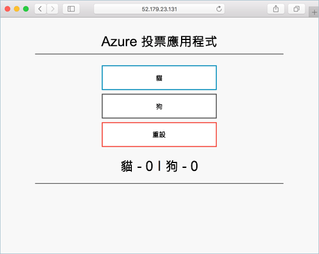

# <a name="deploy-docker-ce-cluster"></a>部署 Docker CE 叢集

在這個快速入門，Docker CE 叢集已部署使用 Azure CLI hello。 然後部署並 hello 叢集上執行多個容器應用程式，其中包含 web 前端和 Redis 執行個體。 Hello 應用程式完成後，會透過可存取網際網路的 hello。

Azure Container Service 上的 Docker CE 處於預覽狀態，**不得用於生產工作負載**。

如果您沒有 Azure 訂用帳戶，請在開始前建立 [免費帳戶](https://azure.microsoft.com/free/?WT.mc_id=A261C142F) 。

如果您選擇 tooinstall，並在本機上使用 hello CLI，本快速入門會要求執行 hello Azure CLI 版本 2.0.4 或更新版本。 執行`az --version`toofind hello 版本。 如果您需要 tooinstall 或升級，請參閱[安裝 Azure CLI 2.0]( /cli/azure/install-azure-cli)。

## <a name="create-a-resource-group"></a>建立資源群組

建立資源群組以 hello [az 群組建立](/cli/azure/group#create)命令。 Azure 資源群組是在其中部署與管理 Azure 資源的邏輯群組。

hello 下列範例會建立名為的資源群組*myResourceGroup*在 hello *ukwest*位置。

```azurecli-interactive
az group create --name myResourceGroup --location ukwest
```

輸出：

```json
{
  "id": "/subscriptions/00000000-0000-0000-0000-000000000000/resourceGroups/myResourceGroup",
  "location": "westcentralus",
  "managedBy": null,
  "name": "myResourceGroup",
  "properties": {
    "provisioningState": "Succeeded"
  },
  "tags": null
}
```

## <a name="create-docker-swarm-cluster"></a>建立 Docker Swarm 叢集

在 Azure 容器服務中建立 Docker CE 叢集以 hello [az acs 建立](/cli/azure/acs#create)命令。 

hello 下列範例會建立名為叢集*mySwarmCluster*一個 Linux 的主要節點和三個 Linux 代理程式節點。

```azurecli-interactive
az acs create --name mySwarmCluster --orchestrator-type dockerce --resource-group myResourceGroup --generate-ssh-keys
```

幾分鐘之後，hello 命令完成，並傳回 hello 叢集的 json 格式資訊。

## <a name="connect-toohello-cluster"></a>Toohello 叢集連線

這個整個快速入門，您需要 hello hello Docker Swarm master 和 hello Docker 代理程式集區的 FQDN。 執行下列命令 tooreturn 兩者 hello master 和代理程式的 Fqdn 的 hello。


```bash
az acs list --resource-group myResourceGroup --query '[*].{Master:masterProfile.fqdn,Agent:agentPoolProfiles[0].fqdn}' -o table
```

輸出：

```bash
Master                                                               Agent
-------------------------------------------------------------------  --------------------------------------------------------------------
myswarmcluster-myresourcegroup-d5b9d4mgmt.ukwest.cloudapp.azure.com  myswarmcluster-myresourcegroup-d5b9d4agent.ukwest.cloudapp.azure.com
```

建立 SSH 通道 toohello 群集 master。 取代`MasterFQDN`hello FQDN hello 群集主要地址。

```bash
ssh -p 2200 -fNL localhost:2374:/var/run/docker.sock azureuser@MasterFQDN
```

設定 hello`DOCKER_HOST`環境變數。 這可讓您針對 hello Docker Swarm toorun docker 命令而不需要 toospecify hello hello 主機名稱。

```bash
export DOCKER_HOST=localhost:2374
```

現在您已經準備就緒 toorun hello Docker Swarm 上的 Docker 服務。


## <a name="run-hello-application"></a>執行 hello 應用程式

建立名為`azure-vote.yaml`並複製 hello 遵循到其中的內容。


```yaml
version: '3'
services:
  azure-vote-back:
    image: redis
    ports:
        - "6379:6379"

  azure-vote-front:
    image: microsoft/azure-vote-front:redis-v1
    environment:
      REDIS: azure-vote-back
    ports:
        - "80:80"
```

執行 hello [docker 堆疊部署](https://docs.docker.com/engine/reference/commandline/stack_deploy/)命令 toocreate hello Azure 投票服務。

```bash
docker stack deploy azure-vote --compose-file azure-vote.yaml
```

輸出：

```bash
Creating network azure-vote_default
Creating service azure-vote_azure-vote-back
Creating service azure-vote_azure-vote-front
```

使用 hello [docker 堆疊 ps](https://docs.docker.com/engine/reference/commandline/stack_ps/)命令 tooreturn hello 部署狀態的 hello 應用程式。

```bash
docker stack ps azure-vote
```

一次 hello`CURRENT STATE`每個服務是`Running`，準備 hello 應用程式時。

```bash
ID                  NAME                            IMAGE                                 NODE                               DESIRED STATE       CURRENT STATE                ERROR               PORTS
tnklkv3ogu3i        azure-vote_azure-vote-front.1   microsoft/azure-vote-front:redis-v1   swarmm-agentpool0-66066781000004   Running             Running 5 seconds ago                            
lg99i4hy68r9        azure-vote_azure-vote-back.1    redis:latest                          swarmm-agentpool0-66066781000002   Running             Running about a minute ago
```

## <a name="test-hello-application"></a>測試 hello 應用程式

瀏覽 toohello hello 群集代理程式集區 tootest 出 hello Azure 投票應用程式的 FQDN。



## <a name="delete-cluster"></a>刪除叢集
當不再需要 hello 叢集時，您可以使用 hello [az 群組刪除](/cli/azure/group#delete)命令 tooremove hello 資源群組、 容器服務，以及所有相關的資源。

```azurecli-interactive
az group delete --name myResourceGroup --yes --no-wait
```

## <a name="get-hello-code"></a>取得 hello 程式碼

在這個快速入門中，預先建立的容器映像已使用的 toocreate Docker 服務。 hello 相關應用程式程式碼，Dockerfile 中，且可在 GitHub 上編輯檔案。

[https://github.com/Azure-Samples/azure-voting-app-redis](https://github.com/Azure-Samples/azure-voting-app-redis.git)

## <a name="next-steps"></a>後續步驟

在這個快速入門中，您可以部署 Docker Swarm 叢集並部署多個容器應用程式 tooit。

有關使用 Visual Studio Team Services，整合 Docker 暖 toolearn 繼續 toohello CI/CD 與 Docker Swarm VSTS。

> [!div class="nextstepaction"]
> [搭配 Docker Swarm 和 VSTS 的 CI/CD](./container-service-docker-swarm-setup-ci-cd.md)