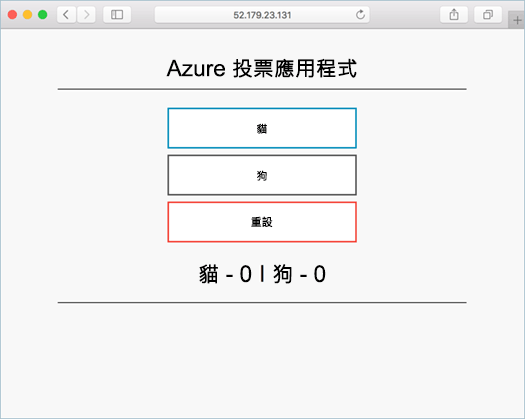

# <a name="deploy-kubernetes-cluster-for-linux-containers"></a><span data-ttu-id="2b57b-103">部署適用於 Linux 容器的 Kubernetes 叢集</span><span class="sxs-lookup"><span data-stu-id="2b57b-103">Deploy Kubernetes cluster for Linux containers</span></span>

<span data-ttu-id="2b57b-104">在這個快速入門，Kubernetes 叢集已部署使用 Azure CLI hello。</span><span class="sxs-lookup"><span data-stu-id="2b57b-104">In this quick start, a Kubernetes cluster is deployed using hello Azure CLI.</span></span> <span data-ttu-id="2b57b-105">然後部署並 hello 叢集上執行多個容器應用程式，其中包含 web 前端和 Redis 執行個體。</span><span class="sxs-lookup"><span data-stu-id="2b57b-105">A multi-container application consisting of web front end and a Redis instance is then deployed and run on hello cluster.</span></span> <span data-ttu-id="2b57b-106">Hello 應用程式完成後，會透過可存取網際網路的 hello。</span><span class="sxs-lookup"><span data-stu-id="2b57b-106">Once completed, hello application is accessible over hello internet.</span></span> 

<span data-ttu-id="2b57b-107">Python 是撰寫本文件中使用的 hello 範例應用程式。</span><span class="sxs-lookup"><span data-stu-id="2b57b-107">hello example application used in this document is written in Python.</span></span> <span data-ttu-id="2b57b-108">hello 概念與這裡所詳述的步驟可以使用的 toodeploy 到 Kubernetes 叢集中的任何容器映像。</span><span class="sxs-lookup"><span data-stu-id="2b57b-108">hello concepts and steps detailed here can be used toodeploy any container image into a Kubernetes cluster.</span></span> <span data-ttu-id="2b57b-109">hello 程式碼、 Dockerfile 中，以及預先建立的 Kubernetes 資訊清單檔案相關的 toothis 專案位於[GitHub](https://github.com/Azure-Samples/azure-voting-app-redis.git)。</span><span class="sxs-lookup"><span data-stu-id="2b57b-109">hello code, Dockerfile, and pre-created Kubernetes manifest files related toothis project are available on [GitHub](https://github.com/Azure-Samples/azure-voting-app-redis.git).</span></span>



<span data-ttu-id="2b57b-111">本快速入門假設 Kubernetes 概念的基本瞭解，如 Kubernetes 的詳細資訊請參閱 hello [Kubernetes 文件]( https://kubernetes.io/docs/home/)。</span><span class="sxs-lookup"><span data-stu-id="2b57b-111">This quick start assumes a basic understanding of Kubernetes concepts, for detailed information on Kubernetes see hello [Kubernetes documentation]( https://kubernetes.io/docs/home/).</span></span>

<span data-ttu-id="2b57b-112">如果您沒有 Azure 訂用帳戶，請在開始前建立 [免費帳戶](https://azure.microsoft.com/free/?WT.mc_id=A261C142F) 。</span><span class="sxs-lookup"><span data-stu-id="2b57b-112">If you don't have an Azure subscription, create a [free account](https://azure.microsoft.com/free/?WT.mc_id=A261C142F) before you begin.</span></span>

[!INCLUDE [cloud-shell-try-it.md](../../../includes/cloud-shell-try-it.md)]

<span data-ttu-id="2b57b-113">如果您選擇 tooinstall，並在本機上使用 hello CLI，本快速入門會要求執行 hello Azure CLI 版本 2.0.4 或更新版本。</span><span class="sxs-lookup"><span data-stu-id="2b57b-113">If you choose tooinstall and use hello CLI locally, this quickstart requires that you are running hello Azure CLI version 2.0.4 or later.</span></span> <span data-ttu-id="2b57b-114">執行`az --version`toofind hello 版本。</span><span class="sxs-lookup"><span data-stu-id="2b57b-114">Run `az --version` toofind hello version.</span></span> <span data-ttu-id="2b57b-115">如果您需要 tooinstall 或升級，請參閱[安裝 Azure CLI 2.0]( /cli/azure/install-azure-cli)。</span><span class="sxs-lookup"><span data-stu-id="2b57b-115">If you need tooinstall or upgrade, see [Install Azure CLI 2.0]( /cli/azure/install-azure-cli).</span></span> 

## <a name="create-a-resource-group"></a><span data-ttu-id="2b57b-116">建立資源群組</span><span class="sxs-lookup"><span data-stu-id="2b57b-116">Create a resource group</span></span>

<span data-ttu-id="2b57b-117">建立資源群組以 hello [az 群組建立](/cli/azure/group#create)命令。</span><span class="sxs-lookup"><span data-stu-id="2b57b-117">Create a resource group with hello [az group create](/cli/azure/group#create) command.</span></span> <span data-ttu-id="2b57b-118">Azure 資源群組是在其中部署與管理 Azure 資源的邏輯群組。</span><span class="sxs-lookup"><span data-stu-id="2b57b-118">An Azure resource group is a logical group in which Azure resources are deployed and managed.</span></span> 

<span data-ttu-id="2b57b-119">hello 下列範例會建立名為的資源群組*myResourceGroup*在 hello *westeurope*位置。</span><span class="sxs-lookup"><span data-stu-id="2b57b-119">hello following example creates a resource group named *myResourceGroup* in hello *westeurope* location.</span></span>

```azurecli-interactive 
az group create --name myResourceGroup --location westeurope
```

<span data-ttu-id="2b57b-120">輸出：</span><span class="sxs-lookup"><span data-stu-id="2b57b-120">Output:</span></span>

```json
{
  "id": "/subscriptions/00000000-0000-0000-0000-000000000000/resourceGroups/myResourceGroup",
  "location": "westeurope",
  "managedBy": null,
  "name": "myResourceGroup",
  "properties": {
    "provisioningState": "Succeeded"
  },
  "tags": null
}
```

## <a name="create-kubernetes-cluster"></a><span data-ttu-id="2b57b-121">建立 Kubernetes 叢集</span><span class="sxs-lookup"><span data-stu-id="2b57b-121">Create Kubernetes cluster</span></span>

<span data-ttu-id="2b57b-122">在 Azure 容器服務中建立 Kubernetes 叢集以 hello [az acs 建立](/cli/azure/acs#create)命令。</span><span class="sxs-lookup"><span data-stu-id="2b57b-122">Create a Kubernetes cluster in Azure Container Service with hello [az acs create](/cli/azure/acs#create) command.</span></span> <span data-ttu-id="2b57b-123">hello 下列範例會建立名為叢集*myK8sCluster*一個 Linux 的主要節點和三個 Linux 代理程式節點。</span><span class="sxs-lookup"><span data-stu-id="2b57b-123">hello following example creates a cluster named *myK8sCluster* with one Linux master node and three Linux agent nodes.</span></span>

```azurecli-interactive 
az acs create --orchestrator-type kubernetes --resource-group myResourceGroup --name myK8sCluster --generate-ssh-keys 
```

<span data-ttu-id="2b57b-124">幾分鐘之後，hello 命令完成，並傳回 hello 叢集的 json 格式資訊。</span><span class="sxs-lookup"><span data-stu-id="2b57b-124">After several minutes, hello command completes and returns json formatted information about hello cluster.</span></span> 

## <a name="connect-toohello-cluster"></a><span data-ttu-id="2b57b-125">Toohello 叢集連線</span><span class="sxs-lookup"><span data-stu-id="2b57b-125">Connect toohello cluster</span></span>

<span data-ttu-id="2b57b-126">toomanage Kubernetes 叢集中，使用[kubectl](https://kubernetes.io/docs/user-guide/kubectl/)，hello Kubernetes 命令列用戶端。</span><span class="sxs-lookup"><span data-stu-id="2b57b-126">toomanage a Kubernetes cluster, use [kubectl](https://kubernetes.io/docs/user-guide/kubectl/), hello Kubernetes command-line client.</span></span> 

<span data-ttu-id="2b57b-127">如果您是使用 Azure CloudShell，則已安裝 kubectl。</span><span class="sxs-lookup"><span data-stu-id="2b57b-127">If you're using Azure CloudShell, kubectl is already installed.</span></span> <span data-ttu-id="2b57b-128">如果您想 tooinstall 它在本機，您可以使用 hello [az acs kubernetes 安裝 cli](/cli/azure/acs/kubernetes#install-cli)命令。</span><span class="sxs-lookup"><span data-stu-id="2b57b-128">If you want tooinstall it locally, you can use hello [az acs kubernetes install-cli](/cli/azure/acs/kubernetes#install-cli) command.</span></span>

<span data-ttu-id="2b57b-129">tooconfigure kubectl tooconnect tooyour Kubernetes 叢集，請執行 hello [az acs kubernetes 取得認證](/cli/azure/acs/kubernetes#get-credentials)命令。</span><span class="sxs-lookup"><span data-stu-id="2b57b-129">tooconfigure kubectl tooconnect tooyour Kubernetes cluster, run hello [az acs kubernetes get-credentials](/cli/azure/acs/kubernetes#get-credentials) command.</span></span> <span data-ttu-id="2b57b-130">這個步驟會下載認證並設定 hello Kubernetes CLI toouse 它們。</span><span class="sxs-lookup"><span data-stu-id="2b57b-130">This step downloads credentials and configures hello Kubernetes CLI toouse them.</span></span>

```azurecli-interactive 
az acs kubernetes get-credentials --resource-group=myResourceGroup --name=myK8sCluster
```

<span data-ttu-id="2b57b-131">tooverify hello 連接 tooyour 叢集中，使用 hello [kubectl 取得](https://kubernetes.io/docs/user-guide/kubectl/v1.6/#get)命令 tooreturn hello 叢集節點的清單。</span><span class="sxs-lookup"><span data-stu-id="2b57b-131">tooverify hello connection tooyour cluster, use hello [kubectl get](https://kubernetes.io/docs/user-guide/kubectl/v1.6/#get) command tooreturn a list of hello cluster nodes.</span></span>

```azurecli-interactive
kubectl get nodes
```

<span data-ttu-id="2b57b-132">輸出：</span><span class="sxs-lookup"><span data-stu-id="2b57b-132">Output:</span></span>

```bash
NAME                    STATUS                     AGE       VERSION
k8s-agent-14ad53a1-0    Ready                      10m       v1.6.6
k8s-agent-14ad53a1-1    Ready                      10m       v1.6.6
k8s-agent-14ad53a1-2    Ready                      10m       v1.6.6
k8s-master-14ad53a1-0   Ready,SchedulingDisabled   10m       v1.6.6
```

## <a name="run-hello-application"></a><span data-ttu-id="2b57b-133">執行 hello 應用程式</span><span class="sxs-lookup"><span data-stu-id="2b57b-133">Run hello application</span></span>

<span data-ttu-id="2b57b-134">Kubernetes 資訊清單檔會定義 hello 叢集，包括什麼容器映像應執行所需的狀態。</span><span class="sxs-lookup"><span data-stu-id="2b57b-134">A Kubernetes manifest file defines a desired state for hello cluster, including what container images should be running.</span></span> <span data-ttu-id="2b57b-135">針對此範例中，並使用的 toocreate 所有物件所需 toorun hello Azure 投票應用程式資訊清單。</span><span class="sxs-lookup"><span data-stu-id="2b57b-135">For this example, a manifest is used toocreate all objects needed toorun hello Azure Vote application.</span></span> 

<span data-ttu-id="2b57b-136">建立名為`azure-vote.yml`並複製到其中下列 YAML hello。</span><span class="sxs-lookup"><span data-stu-id="2b57b-136">Create a file named `azure-vote.yml` and copy into it hello following YAML.</span></span> <span data-ttu-id="2b57b-137">如果您在 Azure Cloud Shell 中作業，可以使用 vi 或 Nano 建立這個檔案，猶如使用虛擬或實體系統。</span><span class="sxs-lookup"><span data-stu-id="2b57b-137">If you are working in Azure Cloud Shell, this file can be created using vi or Nano as if working on a virtual or physical system.</span></span>

```yaml
apiVersion: apps/v1beta1
kind: Deployment
metadata:
  name: azure-vote-back
spec:
  replicas: 1
  template:
    metadata:
      labels:
        app: azure-vote-back
    spec:
      containers:
      - name: azure-vote-back
        image: redis
        ports:
        - containerPort: 6379
          name: redis
---
apiVersion: v1
kind: Service
metadata:
  name: azure-vote-back
spec:
  ports:
  - port: 6379
  selector:
    app: azure-vote-back
---
apiVersion: apps/v1beta1
kind: Deployment
metadata:
  name: azure-vote-front
spec:
  replicas: 1
  template:
    metadata:
      labels:
        app: azure-vote-front
    spec:
      containers:
      - name: azure-vote-front
        image: microsoft/azure-vote-front:redis-v1
        ports:
        - containerPort: 80
        env:
        - name: REDIS
          value: "azure-vote-back"
---
apiVersion: v1
kind: Service
metadata:
  name: azure-vote-front
spec:
  type: LoadBalancer
  ports:
  - port: 80
  selector:
    app: azure-vote-front
```

<span data-ttu-id="2b57b-138">使用 hello [kubectl 建立](https://kubernetes.io/docs/user-guide/kubectl/v1.6/#create)命令 toorun hello 應用程式。</span><span class="sxs-lookup"><span data-stu-id="2b57b-138">Use hello [kubectl create](https://kubernetes.io/docs/user-guide/kubectl/v1.6/#create) command toorun hello application.</span></span>

```azurecli-interactive
kubectl create -f azure-vote.yml
```

<span data-ttu-id="2b57b-139">輸出：</span><span class="sxs-lookup"><span data-stu-id="2b57b-139">Output:</span></span>

```bash
deployment "azure-vote-back" created
service "azure-vote-back" created
deployment "azure-vote-front" created
service "azure-vote-front" created
```

## <a name="test-hello-application"></a><span data-ttu-id="2b57b-140">測試 hello 應用程式</span><span class="sxs-lookup"><span data-stu-id="2b57b-140">Test hello application</span></span>

<span data-ttu-id="2b57b-141">Hello 應用程式執行時， [Kubernetes 服務](https://kubernetes.io/docs/concepts/services-networking/service/)建立公開 hello 應用程式前端 toohello 網際網路。</span><span class="sxs-lookup"><span data-stu-id="2b57b-141">As hello application is run, a [Kubernetes service](https://kubernetes.io/docs/concepts/services-networking/service/) is created that exposes hello application front end toohello internet.</span></span> <span data-ttu-id="2b57b-142">此程序可能需要幾分鐘的時間 toocomplete。</span><span class="sxs-lookup"><span data-stu-id="2b57b-142">This process can take a few minutes toocomplete.</span></span> 

<span data-ttu-id="2b57b-143">toomonitor 進度，使用 hello [kubectl 取得服務](https://kubernetes.io/docs/user-guide/kubectl/v1.6/#get)命令與 hello`--watch`引數。</span><span class="sxs-lookup"><span data-stu-id="2b57b-143">toomonitor progress, use hello [kubectl get service](https://kubernetes.io/docs/user-guide/kubectl/v1.6/#get) command with hello `--watch` argument.</span></span>

```azurecli-interactive
kubectl get service azure-vote-front --watch
```

<span data-ttu-id="2b57b-144">一開始 hello**外部 IP** hello *azure 投票前*服務會顯示為*暫止*。</span><span class="sxs-lookup"><span data-stu-id="2b57b-144">Initially hello **EXTERNAL-IP** for hello *azure-vote-front* service appears as *pending*.</span></span> <span data-ttu-id="2b57b-145">一旦 hello 外部 IP 位址已從*暫止*tooan *IP 位址*，使用`CTRL-C`toostop hello kubectl 監看式程序。</span><span class="sxs-lookup"><span data-stu-id="2b57b-145">Once hello EXTERNAL-IP address has changed from *pending* tooan *IP address*, use `CTRL-C` toostop hello kubectl watch process.</span></span> 
  
```bash
azure-vote-front   10.0.34.242   <pending>     80:30676/TCP   7s
azure-vote-front   10.0.34.242   52.179.23.131   80:30676/TCP   2m
```

<span data-ttu-id="2b57b-146">您現在可以瀏覽 toohello 外部 IP 位址 toosee hello Azure 投票應用程式。</span><span class="sxs-lookup"><span data-stu-id="2b57b-146">You can now browse toohello external IP address toosee hello Azure Vote App.</span></span>

  

## <a name="delete-cluster"></a><span data-ttu-id="2b57b-148">刪除叢集</span><span class="sxs-lookup"><span data-stu-id="2b57b-148">Delete cluster</span></span>
<span data-ttu-id="2b57b-149">當不再需要 hello 叢集時，您可以使用 hello [az 群組刪除](/cli/azure/group#delete)命令 tooremove hello 資源群組、 容器服務，以及所有相關的資源。</span><span class="sxs-lookup"><span data-stu-id="2b57b-149">When hello cluster is no longer needed, you can use hello [az group delete](/cli/azure/group#delete) command tooremove hello resource group, container service, and all related resources.</span></span>

```azurecli-interactive 
az group delete --name myResourceGroup --yes --no-wait
```

## <a name="get-hello-code"></a><span data-ttu-id="2b57b-150">取得 hello 程式碼</span><span class="sxs-lookup"><span data-stu-id="2b57b-150">Get hello code</span></span>

<span data-ttu-id="2b57b-151">在這個快速入門中，預先建立的容器映像已使用的 toocreate Kubernetes 部署。</span><span class="sxs-lookup"><span data-stu-id="2b57b-151">In this quick start, pre-created container images have been used toocreate a Kubernetes deployment.</span></span> <span data-ttu-id="2b57b-152">hello 相關應用程式程式碼，Dockerfile 中，且可在 GitHub 上 Kubernetes 資訊清單檔案。</span><span class="sxs-lookup"><span data-stu-id="2b57b-152">hello related application code, Dockerfile, and Kubernetes manifest file are available on GitHub.</span></span>

[<span data-ttu-id="2b57b-153">https://github.com/Azure-Samples/azure-voting-app-redis</span><span class="sxs-lookup"><span data-stu-id="2b57b-153">https://github.com/Azure-Samples/azure-voting-app-redis</span></span>](https://github.com/Azure-Samples/azure-voting-app-redis.git)

## <a name="next-steps"></a><span data-ttu-id="2b57b-154">後續步驟</span><span class="sxs-lookup"><span data-stu-id="2b57b-154">Next steps</span></span>

<span data-ttu-id="2b57b-155">在這個快速入門中，您可以部署 Kubernetes 叢集，再部署多個容器應用程式 tooit。</span><span class="sxs-lookup"><span data-stu-id="2b57b-155">In this quick start, you deployed a Kubernetes cluster and deployed a multi-container application tooit.</span></span> 

<span data-ttu-id="2b57b-156">深入了解 Azure 容器服務和完整的程式碼 toodeployment 範例中，逐步 toolearn 繼續 toohello Kubernetes 叢集教學課程。</span><span class="sxs-lookup"><span data-stu-id="2b57b-156">toolearn more about Azure Container Service, and walk through a complete code toodeployment example, continue toohello Kubernetes cluster tutorial.</span></span>

> [!div class="nextstepaction"]
> [<span data-ttu-id="2b57b-157">管理 ACS Kubernetes 叢集</span><span class="sxs-lookup"><span data-stu-id="2b57b-157">Manage an ACS Kubernetes cluster</span></span>](./container-service-tutorial-kubernetes-prepare-app.md)
