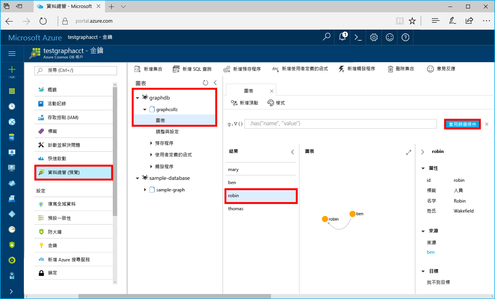

# <a name="azure-cosmos-db-build-a-net-application-using-hello-graph-api"></a><span data-ttu-id="1b9b0-103">Azure Cosmos DB： 建置使用 hello Graph API 的.NET 應用程式</span><span class="sxs-lookup"><span data-stu-id="1b9b0-103">Azure Cosmos DB: Build a .NET application using hello Graph API</span></span>

<span data-ttu-id="1b9b0-104">Azure Cosmos DB 是 Microsoft 的全域分散式多模型資料庫服務。</span><span class="sxs-lookup"><span data-stu-id="1b9b0-104">Azure Cosmos DB is Microsoft’s globally distributed multi-model database service.</span></span> <span data-ttu-id="1b9b0-105">您可以快速建立與查詢文件、 索引鍵/值，以及 graph 資料庫，全部都是從 hello 全域發佈和核心 Azure Cosmos DB hello 的水平縮放功能獲益。</span><span class="sxs-lookup"><span data-stu-id="1b9b0-105">You can quickly create and query document, key/value, and graph databases, all of which benefit from hello global distribution and horizontal scale capabilities at hello core of Azure Cosmos DB.</span></span> 

<span data-ttu-id="1b9b0-106">本快速入門示範如何 toocreate Azure Cosmos DB 帳戶、 資料庫和圖形 （容器） 使用 hello Azure 入口網站。</span><span class="sxs-lookup"><span data-stu-id="1b9b0-106">This quick start demonstrates how toocreate an Azure Cosmos DB account, database, and graph (container) using hello Azure portal.</span></span> <span data-ttu-id="1b9b0-107">然後建置並執行主控台應用程式根據 hello [Graph API](graph-sdk-dotnet.md) （預覽）。</span><span class="sxs-lookup"><span data-stu-id="1b9b0-107">You then build and run a console app built on hello [Graph API](graph-sdk-dotnet.md) (preview).</span></span>  

## <a name="prerequisites"></a><span data-ttu-id="1b9b0-108">必要條件</span><span class="sxs-lookup"><span data-stu-id="1b9b0-108">Prerequisites</span></span>

<span data-ttu-id="1b9b0-109">如果您還沒有安裝 Visual Studio 2017，您可以下載並使用 hello**可用** [Visual Studio 2017 Community Edition](https://www.visualstudio.com/downloads/)。</span><span class="sxs-lookup"><span data-stu-id="1b9b0-109">If you don’t already have Visual Studio 2017 installed, you can download and use hello **free** [Visual Studio 2017 Community Edition](https://www.visualstudio.com/downloads/).</span></span> <span data-ttu-id="1b9b0-110">請確定您啟用**Azure 開發**hello Visual Studio 安裝期間。</span><span class="sxs-lookup"><span data-stu-id="1b9b0-110">Make sure that you enable **Azure development** during hello Visual Studio setup.</span></span>

[!INCLUDE [quickstarts-free-trial-note](../../includes/quickstarts-free-trial-note.md)]

## <a name="create-a-database-account"></a><span data-ttu-id="1b9b0-111">建立資料庫帳戶</span><span class="sxs-lookup"><span data-stu-id="1b9b0-111">Create a database account</span></span>

[!INCLUDE [cosmos-db-create-dbaccount-graph](../../includes/cosmos-db-create-dbaccount-graph.md)]

## <a name="add-a-graph"></a><span data-ttu-id="1b9b0-112">新增圖形</span><span class="sxs-lookup"><span data-stu-id="1b9b0-112">Add a graph</span></span>

[!INCLUDE [cosmos-db-create-graph](../../includes/cosmos-db-create-graph.md)]

## <a name="clone-hello-sample-application"></a><span data-ttu-id="1b9b0-113">複製 hello 範例應用程式</span><span class="sxs-lookup"><span data-stu-id="1b9b0-113">Clone hello sample application</span></span>

<span data-ttu-id="1b9b0-114">現在讓我們從 github，複製 Graph API 應用程式設定 hello 連接字串，並執行它。</span><span class="sxs-lookup"><span data-stu-id="1b9b0-114">Now let's clone a Graph API app from github, set hello connection string, and run it.</span></span> <span data-ttu-id="1b9b0-115">您會看到是多麼的輕鬆 toowork 資料以程式設計的方式。</span><span class="sxs-lookup"><span data-stu-id="1b9b0-115">You'll see how easy it is toowork with data programmatically.</span></span> 

1. <span data-ttu-id="1b9b0-116">開啟 git 終端機視窗，例如 git bash 和`cd`tooa 工作目錄。</span><span class="sxs-lookup"><span data-stu-id="1b9b0-116">Open a git terminal window, such as git bash, and `cd` tooa working directory.</span></span>  

2. <span data-ttu-id="1b9b0-117">執行下列命令 tooclone hello 範例儲存機制的 hello。</span><span class="sxs-lookup"><span data-stu-id="1b9b0-117">Run hello following command tooclone hello sample repository.</span></span> 

    ```bash
    git clone https://github.com/Azure-Samples/azure-cosmos-db-graph-dotnet-getting-started.git
    ```

3. <span data-ttu-id="1b9b0-118">Visual Studio，並開啟 hello 方案檔，然後開啟。</span><span class="sxs-lookup"><span data-stu-id="1b9b0-118">Then open Visual Studio and open hello solution file.</span></span> 

## <a name="review-hello-code"></a><span data-ttu-id="1b9b0-119">檢閱 hello 程式碼</span><span class="sxs-lookup"><span data-stu-id="1b9b0-119">Review hello code</span></span>

<span data-ttu-id="1b9b0-120">讓我們進行快速檢閱 hello 應用程式中的情況。</span><span class="sxs-lookup"><span data-stu-id="1b9b0-120">Let's make a quick review of what's happening in hello app.</span></span> <span data-ttu-id="1b9b0-121">開啟 hello Program.cs 檔案，而且您會發現這行程式碼建立 hello Azure Cosmos DB 資源。</span><span class="sxs-lookup"><span data-stu-id="1b9b0-121">Open hello Program.cs file and you'll find that these lines of code create hello Azure Cosmos DB resources.</span></span> 

* <span data-ttu-id="1b9b0-122">hello DocumentClient 會初始化。</span><span class="sxs-lookup"><span data-stu-id="1b9b0-122">hello DocumentClient is initialized.</span></span> <span data-ttu-id="1b9b0-123">在 hello 預覽中，我們可以加入圖形延伸模組 API hello Azure Cosmos DB 用戶端上。</span><span class="sxs-lookup"><span data-stu-id="1b9b0-123">In hello preview, we added a graph extension API on hello Azure Cosmos DB client.</span></span> <span data-ttu-id="1b9b0-124">我們會努力分開 hello Azure Cosmos DB 用戶端和資源，獨立圖形用戶端。</span><span class="sxs-lookup"><span data-stu-id="1b9b0-124">We are working on a standalone graph client decoupled from hello Azure Cosmos DB client and resources.</span></span>

    ```csharp
    using (DocumentClient client = new DocumentClient(
        new Uri(endpoint),
        authKey,
        new ConnectionPolicy { ConnectionMode = ConnectionMode.Direct, ConnectionProtocol = Protocol.Tcp }))
    ```

* <span data-ttu-id="1b9b0-125">已建立新資料庫。</span><span class="sxs-lookup"><span data-stu-id="1b9b0-125">A new database is created.</span></span>

    ```csharp
    Database database = await client.CreateDatabaseIfNotExistsAsync(new Database { Id = "graphdb" });
    ```

* <span data-ttu-id="1b9b0-126">已建立新圖形。</span><span class="sxs-lookup"><span data-stu-id="1b9b0-126">A new graph is created.</span></span>

    ```csharp
    DocumentCollection graph = await client.CreateDocumentCollectionIfNotExistsAsync(
        UriFactory.CreateDatabaseUri("graphdb"),
        new DocumentCollection { Id = "graph" },
        new RequestOptions { OfferThroughput = 1000 });
    ```
* <span data-ttu-id="1b9b0-127">一系列的 Gremlin 步驟會執行使用 hello`CreateGremlinQuery`方法。</span><span class="sxs-lookup"><span data-stu-id="1b9b0-127">A series of Gremlin steps are executed using hello `CreateGremlinQuery` method.</span></span>

    ```csharp
    // hello CreateGremlinQuery method extensions allow you tooexecute Gremlin queries and iterate
    // results asychronously
    IDocumentQuery<dynamic> query = client.CreateGremlinQuery<dynamic>(graph, "g.V().count()");
    while (query.HasMoreResults)
    {
        foreach (dynamic result in await query.ExecuteNextAsync())
        {
            Console.WriteLine($"\t {JsonConvert.SerializeObject(result)}");
        }
    }

    ```

## <a name="update-your-connection-string"></a><span data-ttu-id="1b9b0-128">更新您的連接字串</span><span class="sxs-lookup"><span data-stu-id="1b9b0-128">Update your connection string</span></span>

<span data-ttu-id="1b9b0-129">現在請返回 Azure 入口網站 tooget toohello 您的連接字串資訊並將它複製到 hello 應用程式。</span><span class="sxs-lookup"><span data-stu-id="1b9b0-129">Now go back toohello Azure portal tooget your connection string information and copy it into hello app.</span></span>

1. <span data-ttu-id="1b9b0-130">在 Visual Studio 2017，開啟 hello App.config 檔案。</span><span class="sxs-lookup"><span data-stu-id="1b9b0-130">In Visual Studio 2017, open hello App.config file.</span></span> 

2. <span data-ttu-id="1b9b0-131">在 hello Azure 入口網站，Azure Cosmos DB 帳戶中，按一下 **金鑰**在 hello 左瀏覽。</span><span class="sxs-lookup"><span data-stu-id="1b9b0-131">In hello Azure portal, in your Azure Cosmos DB account, click **Keys** in hello left navigation.</span></span> 

    

3. <span data-ttu-id="1b9b0-133">複製您**URI**值從 hello 入口網站，並將其 hello App.config 中的 hello 端點索引鍵的值。Hello 前面螢幕擷取畫面 toocopy hello 值中所示，您可以使用 hello [複製] 按鈕。</span><span class="sxs-lookup"><span data-stu-id="1b9b0-133">Copy your **URI** value from hello portal and make it hello value of hello Endpoint key in App.config. You can use hello copy button as shown in hello preceding screenshot toocopy hello value.</span></span>

    `<add key="Endpoint" value="https://FILLME.documents.azure.com:443" />`

4. <span data-ttu-id="1b9b0-134">複製您**主索引鍵**值從 hello 入口網站，並使其 hello App.config 中的 hello AuthKey 索引鍵的值，然後儲存您的變更。</span><span class="sxs-lookup"><span data-stu-id="1b9b0-134">Copy your **PRIMARY KEY** value from hello portal, and make it hello value of hello AuthKey key in App.config, then save your changes.</span></span> 

    `<add key="AuthKey" value="FILLME" />`

<span data-ttu-id="1b9b0-135">您現在已更新您的應用程式與它需要與 Azure Cosmos DB toocommunicate 所有 hello 資訊。</span><span class="sxs-lookup"><span data-stu-id="1b9b0-135">You've now updated your app with all hello info it needs toocommunicate with Azure Cosmos DB.</span></span> 

## <a name="run-hello-console-app"></a><span data-ttu-id="1b9b0-136">執行 hello 主控台應用程式</span><span class="sxs-lookup"><span data-stu-id="1b9b0-136">Run hello console app</span></span>

1. <span data-ttu-id="1b9b0-137">在 Visual Studio 中，以滑鼠右鍵按一下 hello **GraphGetStarted**專案中**方案總管 中**，然後按一下**管理 NuGet 封裝**。</span><span class="sxs-lookup"><span data-stu-id="1b9b0-137">In Visual Studio, right-click on hello **GraphGetStarted** project in **Solution Explorer** and then click **Manage NuGet Packages**.</span></span> 

2. <span data-ttu-id="1b9b0-138">在 hello NuGet**瀏覽**方塊中，輸入*Microsoft.Azure.Graphs*並檢查 hello**包含發行前版本**方塊。</span><span class="sxs-lookup"><span data-stu-id="1b9b0-138">In hello NuGet **Browse** box, type *Microsoft.Azure.Graphs* and check hello **Includes prerelease** box.</span></span> 

3. <span data-ttu-id="1b9b0-139">從 hello 結果中，安裝 hello **Microsoft.Azure.Graphs**程式庫。</span><span class="sxs-lookup"><span data-stu-id="1b9b0-139">From hello results, install hello **Microsoft.Azure.Graphs** library.</span></span> <span data-ttu-id="1b9b0-140">這會安裝 hello Azure Cosmos DB 圖形延伸模組程式庫封裝和所有相依性。</span><span class="sxs-lookup"><span data-stu-id="1b9b0-140">This installs hello Azure Cosmos DB graph extension library package and all dependencies.</span></span>

    <span data-ttu-id="1b9b0-141">如果您收到有關檢閱變更 toohello 方案，請按一下**確定**。</span><span class="sxs-lookup"><span data-stu-id="1b9b0-141">If you get a message about reviewing changes toohello solution, click **OK**.</span></span> <span data-ttu-id="1b9b0-142">如果您收到關於接受授權的訊息，請按一下 [我接受]。</span><span class="sxs-lookup"><span data-stu-id="1b9b0-142">If you get a message about license acceptance, click **I accept**.</span></span>

4. <span data-ttu-id="1b9b0-143">按一下 CTRL + F5 toorun hello 應用程式。</span><span class="sxs-lookup"><span data-stu-id="1b9b0-143">Click CTRL + F5 toorun hello application.</span></span>

   <span data-ttu-id="1b9b0-144">hello 主控台視窗會顯示 hello 頂點與所加入 toohello 圖形的邊緣。</span><span class="sxs-lookup"><span data-stu-id="1b9b0-144">hello console window displays hello vertexes and edges being added toohello graph.</span></span> <span data-ttu-id="1b9b0-145">Hello 指令碼完成時，按 ENTER 鍵兩次 tooclose hello 主控台視窗。</span><span class="sxs-lookup"><span data-stu-id="1b9b0-145">When hello script completes, press ENTER twice tooclose hello console window.</span></span> 

## <a name="browse-using-hello-data-explorer"></a><span data-ttu-id="1b9b0-146">瀏覽使用 hello 資料總管</span><span class="sxs-lookup"><span data-stu-id="1b9b0-146">Browse using hello Data Explorer</span></span>

<span data-ttu-id="1b9b0-147">您現在可以移回 tooData 總管 hello Azure 入口網站中的和瀏覽並查詢新的圖形資料。</span><span class="sxs-lookup"><span data-stu-id="1b9b0-147">You can now go back tooData Explorer in hello Azure portal and browse and query your new graph data.</span></span>

1. <span data-ttu-id="1b9b0-148">在 Data 總管 hello 新資料庫會出現在 hello 圖形窗格。</span><span class="sxs-lookup"><span data-stu-id="1b9b0-148">In Data Explorer, hello new database appears in hello Graphs pane.</span></span> <span data-ttu-id="1b9b0-149">展開 graphdb、graphcollz，然後按一下圖形。</span><span class="sxs-lookup"><span data-stu-id="1b9b0-149">Expand **graphdb**, **graphcollz**, and then click **Graph**.</span></span>

2. <span data-ttu-id="1b9b0-150">按一下 hello**套用篩選**按鈕 toouse hello 預設查詢 tooview hello 圖形中的所有 hello verticies。</span><span class="sxs-lookup"><span data-stu-id="1b9b0-150">Click hello **Apply Filter** button toouse hello default query tooview all hello verticies in hello graph.</span></span> <span data-ttu-id="1b9b0-151">hello 圖形窗格中會顯示 hello hello 範例應用程式所產生的資料。</span><span class="sxs-lookup"><span data-stu-id="1b9b0-151">hello data generated by hello sample app is displayed in hello Graphs pane.</span></span>

    <span data-ttu-id="1b9b0-152">您可以拉出 hello 圖形，您可以展開 hello 圖形的顯示空間、 新增其他 verticies，並移動 verticies hello 上的顯示的介面。</span><span class="sxs-lookup"><span data-stu-id="1b9b0-152">You can zoom in and out of hello graph, you can expand hello graph display space, add additional verticies, and move verticies on hello display surface.</span></span>

    

## <a name="review-slas-in-hello-azure-portal"></a><span data-ttu-id="1b9b0-154">在 hello Azure 入口網站中檢視 Sla</span><span class="sxs-lookup"><span data-stu-id="1b9b0-154">Review SLAs in hello Azure portal</span></span>

[!INCLUDE [cosmosdb-tutorial-review-slas](../../includes/cosmos-db-tutorial-review-slas.md)]

## <a name="clean-up-resources"></a><span data-ttu-id="1b9b0-155">清除資源</span><span class="sxs-lookup"><span data-stu-id="1b9b0-155">Clean up resources</span></span>

<span data-ttu-id="1b9b0-156">如果您不打算 toocontinue toouse 此應用程式，刪除所有資源本快速入門以建立 hello Azure 入口網站以 hello 下列步驟：</span><span class="sxs-lookup"><span data-stu-id="1b9b0-156">If you're not going toocontinue toouse this app, delete all resources created by this quickstart in hello Azure portal with hello following steps:</span></span> 

1. <span data-ttu-id="1b9b0-157">Hello Azure 入口網站中的 hello 左側功能表中按一下**資源群組**，然後按一下您所建立的 hello 資源的 hello 名稱。</span><span class="sxs-lookup"><span data-stu-id="1b9b0-157">From hello left-hand menu in hello Azure portal, click **Resource groups** and then click hello name of hello resource you created.</span></span> 
2. <span data-ttu-id="1b9b0-158">在資源群組頁面上，按一下 **刪除**，在 hello 文字方塊中，輸入 hello 資源 toodelete hello 名稱，然後按一下**刪除**。</span><span class="sxs-lookup"><span data-stu-id="1b9b0-158">On your resource group page, click **Delete**, type hello name of hello resource toodelete in hello text box, and then click **Delete**.</span></span>

## <a name="next-steps"></a><span data-ttu-id="1b9b0-159">後續步驟</span><span class="sxs-lookup"><span data-stu-id="1b9b0-159">Next steps</span></span>

<span data-ttu-id="1b9b0-160">本快速入門中，您學到如何 toocreate Azure Cosmos DB 帳戶，建立使用 hello 資料總管 中，而圖形，並執行應用程式。</span><span class="sxs-lookup"><span data-stu-id="1b9b0-160">In this quickstart, you've learned how toocreate an Azure Cosmos DB account, create a graph using hello Data Explorer, and run an app.</span></span> <span data-ttu-id="1b9b0-161">您現在可以使用 Gremlin 來建置更複雜的查詢和實作強大的圖形周遊邏輯。</span><span class="sxs-lookup"><span data-stu-id="1b9b0-161">You can now build more complex queries and implement powerful graph traversal logic using Gremlin.</span></span> 

> [!div class="nextstepaction"]
> [<span data-ttu-id="1b9b0-162">使用 Gremlin 進行查詢</span><span class="sxs-lookup"><span data-stu-id="1b9b0-162">Query using Gremlin</span></span>](tutorial-query-graph.md)

