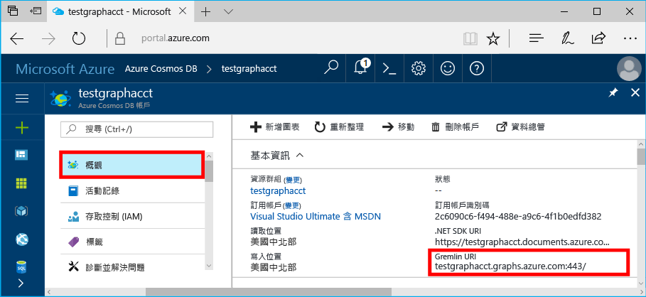
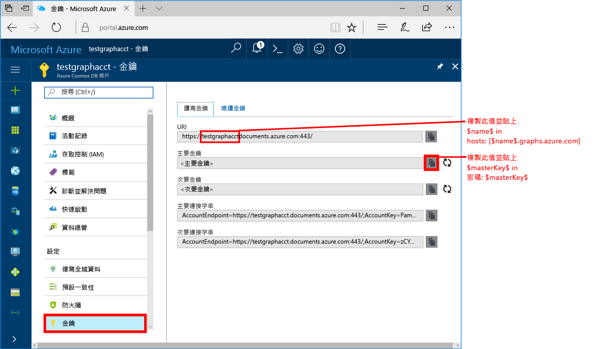
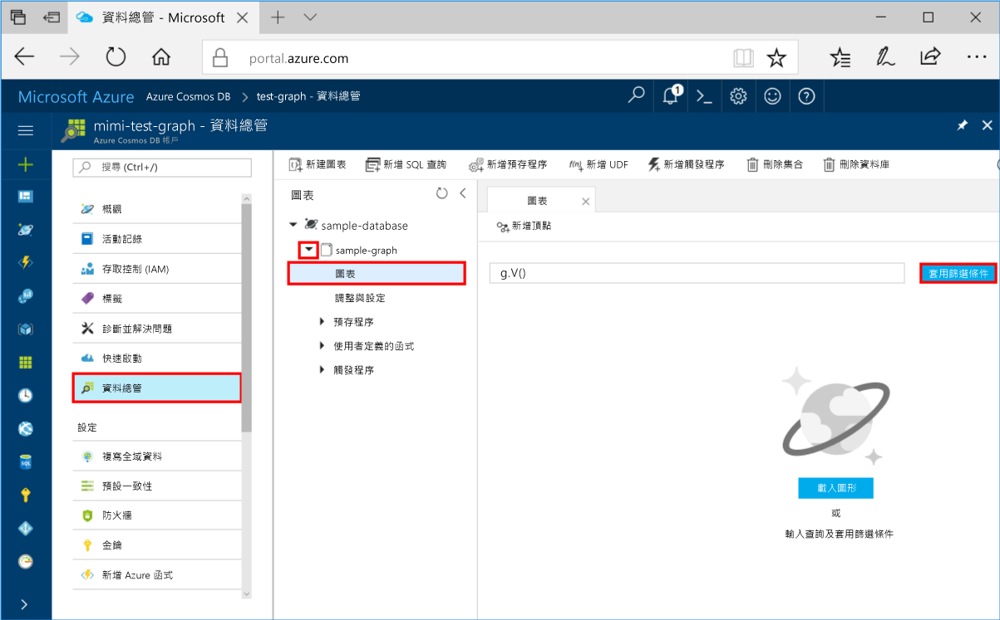
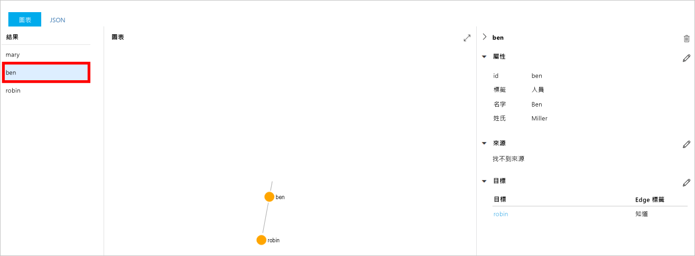
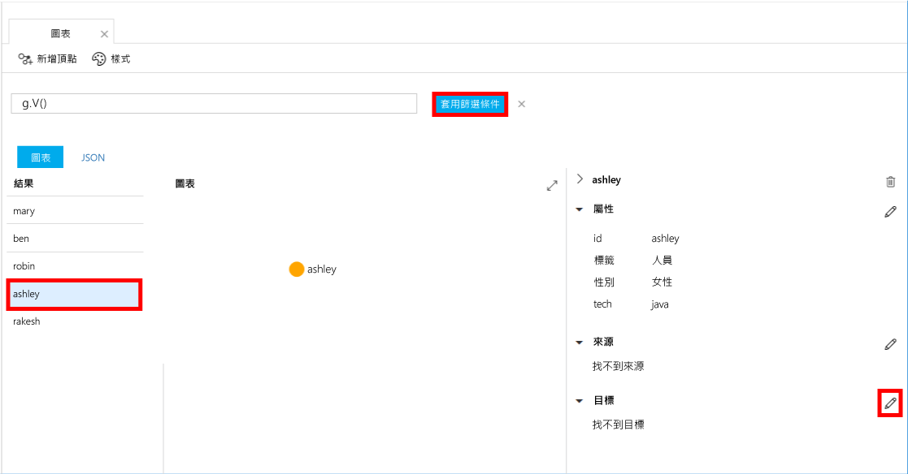

# <a name="azure-cosmos-db-create-a-graph-database-using-java-and-hello-azure-portal"></a><span data-ttu-id="3364c-103">Azure Cosmos DB： 建立圖表資料庫使用 Java 和 hello Azure 入口網站</span><span class="sxs-lookup"><span data-stu-id="3364c-103">Azure Cosmos DB: Create a graph database using Java and hello Azure portal</span></span>

<span data-ttu-id="3364c-104">Azure Cosmos DB 是 Microsoft 的全域分散式多模型資料庫服務。</span><span class="sxs-lookup"><span data-stu-id="3364c-104">Azure Cosmos DB is Microsoft’s globally distributed multi-model database service.</span></span> <span data-ttu-id="3364c-105">您可以快速建立與查詢文件、 索引鍵/值，以及 graph 資料庫，全部都是從 hello 全域發佈和核心 Azure Cosmos DB hello 的水平縮放功能獲益。</span><span class="sxs-lookup"><span data-stu-id="3364c-105">You can quickly create and query document, key/value, and graph databases, all of which benefit from hello global distribution and horizontal scale capabilities at hello core of Azure Cosmos DB.</span></span> 

<span data-ttu-id="3364c-106">本快速入門建立圖形 Azure Cosmos DB 資料庫使用 hello Azure 入口網站的工具。</span><span class="sxs-lookup"><span data-stu-id="3364c-106">This quickstart creates a graph database using hello Azure portal tools for Azure Cosmos DB.</span></span> <span data-ttu-id="3364c-107">本快速入門也會顯示如何 tooquickly 建立 Java 主控台應用程式使用圖形資料庫使用 hello OSS [Gremlin Java](https://mvnrepository.com/artifact/org.apache.tinkerpop/gremlin-driver)驅動程式。</span><span class="sxs-lookup"><span data-stu-id="3364c-107">This quickstart also shows you how tooquickly create a Java console app using a graph database using hello OSS [Gremlin Java](https://mvnrepository.com/artifact/org.apache.tinkerpop/gremlin-driver) driver.</span></span> <span data-ttu-id="3364c-108">本快速入門中的 hello 指示之後只能在能夠執行 Java 任何作業系統上。</span><span class="sxs-lookup"><span data-stu-id="3364c-108">hello instructions in this quickstart can be followed on any operating system that is capable of running Java.</span></span> <span data-ttu-id="3364c-109">本快速入門能讓您熟悉建立和修改在 hello UI 或以程式設計的方式，無論是您的喜好設定的圖形資源。</span><span class="sxs-lookup"><span data-stu-id="3364c-109">This quickstart familiarizes you with creating and modifying graph resources in either hello UI or programmatically, whichever is your preference.</span></span> 

## <a name="prerequisites"></a><span data-ttu-id="3364c-110">必要條件</span><span class="sxs-lookup"><span data-stu-id="3364c-110">Prerequisites</span></span>

* [<span data-ttu-id="3364c-111">Java Development Kit (JDK) 1.7+</span><span class="sxs-lookup"><span data-stu-id="3364c-111">Java Development Kit (JDK) 1.7+</span></span>](http://www.oracle.com/technetwork/java/javase/downloads/jdk8-downloads-2133151.html)
    * <span data-ttu-id="3364c-112">在 Ubuntu，執行`apt-get install default-jdk`tooinstall hello JDK。</span><span class="sxs-lookup"><span data-stu-id="3364c-112">On Ubuntu, run `apt-get install default-jdk` tooinstall hello JDK.</span></span>
    * <span data-ttu-id="3364c-113">為確定 tooset hello JAVA_HOME 環境變數 toopoint toohello hello JDK 安裝的資料夾。</span><span class="sxs-lookup"><span data-stu-id="3364c-113">Be sure tooset hello JAVA_HOME environment variable toopoint toohello folder where hello JDK is installed.</span></span>
* <span data-ttu-id="3364c-114">[下載](http://maven.apache.org/download.cgi)和[安裝 ](http://maven.apache.org/install.html) [Maven](http://maven.apache.org/) 二進位封存檔</span><span class="sxs-lookup"><span data-stu-id="3364c-114">[Download](http://maven.apache.org/download.cgi) and [install](http://maven.apache.org/install.html) a [Maven](http://maven.apache.org/) binary archive</span></span>
    * <span data-ttu-id="3364c-115">您可以執行 Ubuntu， `apt-get install maven` tooinstall Maven。</span><span class="sxs-lookup"><span data-stu-id="3364c-115">On Ubuntu, you can run `apt-get install maven` tooinstall Maven.</span></span>
* [<span data-ttu-id="3364c-116">Git</span><span class="sxs-lookup"><span data-stu-id="3364c-116">Git</span></span>](https://www.git-scm.com/)
    * <span data-ttu-id="3364c-117">您可以執行 Ubuntu， `sudo apt-get install git` tooinstall Git。</span><span class="sxs-lookup"><span data-stu-id="3364c-117">On Ubuntu, you can run `sudo apt-get install git` tooinstall Git.</span></span>

[!INCLUDE [quickstarts-free-trial-note](../../includes/quickstarts-free-trial-note.md)]

## <a name="create-a-database-account"></a><span data-ttu-id="3364c-118">建立資料庫帳戶</span><span class="sxs-lookup"><span data-stu-id="3364c-118">Create a database account</span></span>

<span data-ttu-id="3364c-119">您可以建立圖表資料庫之前，您需要 toocreate Gremlin （圖形） 資料庫帳戶與 Azure Cosmos DB。</span><span class="sxs-lookup"><span data-stu-id="3364c-119">Before you can create a graph database, you need toocreate a Gremlin (Graph) database account with Azure Cosmos DB.</span></span>

[!INCLUDE [cosmos-db-create-dbaccount-graph](../../includes/cosmos-db-create-dbaccount-graph.md)]

## <a name="add-a-graph"></a><span data-ttu-id="3364c-120">新增圖形</span><span class="sxs-lookup"><span data-stu-id="3364c-120">Add a graph</span></span>

<span data-ttu-id="3364c-121">您現在可以使用 hello 資料總管工具 hello Azure 入口網站 toocreate 圖形資料庫中。</span><span class="sxs-lookup"><span data-stu-id="3364c-121">You can now use hello Data Explorer tool in hello Azure portal toocreate a graph database.</span></span> 

1. <span data-ttu-id="3364c-122">在 hello Azure 入口網站，在 hello 左側瀏覽功能表中，按一下 **資料總管 （預覽）**。</span><span class="sxs-lookup"><span data-stu-id="3364c-122">In hello Azure portal, in hello left navigation menu, click **Data Explorer (Preview)**.</span></span> 
2. <span data-ttu-id="3364c-123">在 hello**資料總管 （預覽）**刀鋒視窗中，按一下**新圖形**，然後使用下列資訊的 hello hello 頁面中填入：</span><span class="sxs-lookup"><span data-stu-id="3364c-123">In hello **Data Explorer (Preview)** blade, click **New Graph**, then fill in hello page using hello following information:</span></span>

    

    <span data-ttu-id="3364c-125">設定</span><span class="sxs-lookup"><span data-stu-id="3364c-125">Setting</span></span>|<span data-ttu-id="3364c-126">建議的值</span><span class="sxs-lookup"><span data-stu-id="3364c-126">Suggested value</span></span>|<span data-ttu-id="3364c-127">說明</span><span class="sxs-lookup"><span data-stu-id="3364c-127">Description</span></span>
    ---|---|---
    <span data-ttu-id="3364c-128">資料庫識別碼</span><span class="sxs-lookup"><span data-stu-id="3364c-128">Database ID</span></span>|<span data-ttu-id="3364c-129">sample-database</span><span class="sxs-lookup"><span data-stu-id="3364c-129">sample-database</span></span>|<span data-ttu-id="3364c-130">hello 新的資料庫識別碼。</span><span class="sxs-lookup"><span data-stu-id="3364c-130">hello ID for your new database.</span></span> <span data-ttu-id="3364c-131">資料庫名稱的長度必須介於 1 到 255 個字元，且不能包含 `/ \ # ?` 或尾端空格。</span><span class="sxs-lookup"><span data-stu-id="3364c-131">Database names must be between 1 and 255 characters, and cannot contain `/ \ # ?` or a trailing space.</span></span>
    <span data-ttu-id="3364c-132">圖形識別碼</span><span class="sxs-lookup"><span data-stu-id="3364c-132">Graph ID</span></span>|<span data-ttu-id="3364c-133">sample-graph</span><span class="sxs-lookup"><span data-stu-id="3364c-133">sample-graph</span></span>|<span data-ttu-id="3364c-134">新的圖形的 hello 識別碼。</span><span class="sxs-lookup"><span data-stu-id="3364c-134">hello ID for your new graph.</span></span> <span data-ttu-id="3364c-135">圖形名稱具有 hello 相同字元做為資料庫 id 的需求。</span><span class="sxs-lookup"><span data-stu-id="3364c-135">Graph names have hello same character requirements as database ids.</span></span>
    <span data-ttu-id="3364c-136">儲存體容量</span><span class="sxs-lookup"><span data-stu-id="3364c-136">Storage Capacity</span></span>| <span data-ttu-id="3364c-137">10 GB</span><span class="sxs-lookup"><span data-stu-id="3364c-137">10 GB</span></span>|<span data-ttu-id="3364c-138">保留 hello 預設值。</span><span class="sxs-lookup"><span data-stu-id="3364c-138">Leave hello default value.</span></span> <span data-ttu-id="3364c-139">這是 hello hello 資料庫儲存容量。</span><span class="sxs-lookup"><span data-stu-id="3364c-139">This is hello storage capacity of hello database.</span></span>
    <span data-ttu-id="3364c-140">Throughput</span><span class="sxs-lookup"><span data-stu-id="3364c-140">Throughput</span></span>|<span data-ttu-id="3364c-141">400 RU</span><span class="sxs-lookup"><span data-stu-id="3364c-141">400 RUs</span></span>|<span data-ttu-id="3364c-142">保留 hello 預設值。</span><span class="sxs-lookup"><span data-stu-id="3364c-142">Leave hello default value.</span></span> <span data-ttu-id="3364c-143">您可以向上延展 hello 輸送量稍後如果您想要 tooreduce 延遲。</span><span class="sxs-lookup"><span data-stu-id="3364c-143">You can scale up hello throughput later if you want tooreduce latency.</span></span>
    <span data-ttu-id="3364c-144">資料分割索引鍵</span><span class="sxs-lookup"><span data-stu-id="3364c-144">Partition key</span></span>|<span data-ttu-id="3364c-145">保留空白</span><span class="sxs-lookup"><span data-stu-id="3364c-145">Leave blank</span></span>|<span data-ttu-id="3364c-146">為了 hello 本快速入門，保留 hello 資料分割索引鍵為空白。</span><span class="sxs-lookup"><span data-stu-id="3364c-146">For hello purpose of this quickstart, leave hello partition key blank.</span></span>

3. <span data-ttu-id="3364c-147">一旦填寫 hello 表單，按一下 **確定**。</span><span class="sxs-lookup"><span data-stu-id="3364c-147">Once hello form is filled out, click **OK**.</span></span>

## <a name="clone-hello-sample-application"></a><span data-ttu-id="3364c-148">複製 hello 範例應用程式</span><span class="sxs-lookup"><span data-stu-id="3364c-148">Clone hello sample application</span></span>

<span data-ttu-id="3364c-149">現在讓我們複製從 github 設定 hello 連接字串，並執行它的圖形應用程式。</span><span class="sxs-lookup"><span data-stu-id="3364c-149">Now let's clone a graph app from github, set hello connection string, and run it.</span></span> <span data-ttu-id="3364c-150">您會看到是多麼的輕鬆 toowork 資料以程式設計的方式。</span><span class="sxs-lookup"><span data-stu-id="3364c-150">You see how easy it is toowork with data programmatically.</span></span> 

1. <span data-ttu-id="3364c-151">開啟 git 終端機視窗，例如 git bash 和`cd`tooa 工作目錄。</span><span class="sxs-lookup"><span data-stu-id="3364c-151">Open a git terminal window, such as git bash, and `cd` tooa working directory.</span></span>  

2. <span data-ttu-id="3364c-152">執行下列命令 tooclone hello 範例儲存機制的 hello。</span><span class="sxs-lookup"><span data-stu-id="3364c-152">Run hello following command tooclone hello sample repository.</span></span> 

    ```bash
    git clone https://github.com/Azure-Samples/azure-cosmos-db-graph-java-getting-started.git
    ```

## <a name="review-hello-code"></a><span data-ttu-id="3364c-153">檢閱 hello 程式碼</span><span class="sxs-lookup"><span data-stu-id="3364c-153">Review hello code</span></span>

<span data-ttu-id="3364c-154">讓我們進行快速檢閱 hello 應用程式中的情況。</span><span class="sxs-lookup"><span data-stu-id="3364c-154">Let's make a quick review of what's happening in hello app.</span></span> <span data-ttu-id="3364c-155">開啟 hello`Program.java`從 hello \src\GetStarted 資料夾檔案，並尋找這行程式碼。</span><span class="sxs-lookup"><span data-stu-id="3364c-155">Open hello `Program.java` file from hello \src\GetStarted folder and find these lines of code.</span></span> 

* <span data-ttu-id="3364c-156">hello Gremlin`Client`初始化中的 hello 組態從`src/remote.yaml`。</span><span class="sxs-lookup"><span data-stu-id="3364c-156">hello Gremlin `Client` is initialized from hello configuration in `src/remote.yaml`.</span></span>

    ```java
    cluster = Cluster.build(new File("src/remote.yaml")).create();
    ...
    client = cluster.connect();
    ```

* <span data-ttu-id="3364c-157">一系列的 Gremlin 步驟會執行使用 hello`client.submit`方法。</span><span class="sxs-lookup"><span data-stu-id="3364c-157">A series of Gremlin steps are executed using hello `client.submit` method.</span></span>

    ```java
    ResultSet results = client.submit(gremlin);

    CompletableFuture<List<Result>> completableFutureResults = results.all();
    List<Result> resultList = completableFutureResults.get();

    for (Result result : resultList) {
        System.out.println(result.toString());
    }
    ```

## <a name="update-your-connection-string"></a><span data-ttu-id="3364c-158">更新您的連接字串</span><span class="sxs-lookup"><span data-stu-id="3364c-158">Update your connection string</span></span>

1. <span data-ttu-id="3364c-159">開啟 hello src/remote.yaml 檔案。</span><span class="sxs-lookup"><span data-stu-id="3364c-159">Open hello src/remote.yaml file.</span></span> 

3. <span data-ttu-id="3364c-160">填寫您*主機*， *username*，和*密碼*hello src/remote.yaml 檔案中的值。</span><span class="sxs-lookup"><span data-stu-id="3364c-160">Fill in your *hosts*, *username*, and *password* values in hello src/remote.yaml file.</span></span> <span data-ttu-id="3364c-161">hello 的其餘 hello 設定，不需要變更 toobe。</span><span class="sxs-lookup"><span data-stu-id="3364c-161">hello rest of hello settings do not need toobe changed.</span></span>

    <span data-ttu-id="3364c-162">設定</span><span class="sxs-lookup"><span data-stu-id="3364c-162">Setting</span></span>|<span data-ttu-id="3364c-163">建議的值</span><span class="sxs-lookup"><span data-stu-id="3364c-163">Suggested value</span></span>|<span data-ttu-id="3364c-164">說明</span><span class="sxs-lookup"><span data-stu-id="3364c-164">Description</span></span>
    ---|---|---
    <span data-ttu-id="3364c-165">主機</span><span class="sxs-lookup"><span data-stu-id="3364c-165">Hosts</span></span>|<span data-ttu-id="3364c-166">[***.graphs.azure.com]</span><span class="sxs-lookup"><span data-stu-id="3364c-166">[***.graphs.azure.com]</span></span>|<span data-ttu-id="3364c-167">請參閱本表格後的 hello 螢幕擷取畫面。</span><span class="sxs-lookup"><span data-stu-id="3364c-167">See hello screenshot following this table.</span></span> <span data-ttu-id="3364c-168">此值為 hello Gremlin URI 的 hello Azure 入口網站，以方括號，以 hello 尾端 hello [概觀] 頁面上： 443 / 已移除。</span><span class="sxs-lookup"><span data-stu-id="3364c-168">This value is hello Gremlin URI value on hello Overview page of hello Azure portal, in square brackets, with hello trailing :443/ removed.</span></span><br><br><span data-ttu-id="3364c-169">此值也可以擷取從 hello 金鑰 索引標籤，移除 https://、 變更文件 toographs 並移除尾端 hello 使用 hello URI 值： 443 /。</span><span class="sxs-lookup"><span data-stu-id="3364c-169">This value can also be retrieved from hello Keys tab, using hello URI value by removing https://, changing documents toographs, and removing hello trailing :443/.</span></span>
    <span data-ttu-id="3364c-170">使用者名稱</span><span class="sxs-lookup"><span data-stu-id="3364c-170">Username</span></span>|<span data-ttu-id="3364c-171">/dbs/sample-database/colls/sample-graph</span><span class="sxs-lookup"><span data-stu-id="3364c-171">/dbs/sample-database/colls/sample-graph</span></span>|<span data-ttu-id="3364c-172">hello hello 形式的資源`/dbs/<db>/colls/<coll>`其中`<db>`是現有的資料庫名稱和`<coll>`是現有的集合名稱。</span><span class="sxs-lookup"><span data-stu-id="3364c-172">hello resource of hello form `/dbs/<db>/colls/<coll>` where `<db>` is your existing database name and `<coll>` is your existing collection name.</span></span>
    <span data-ttu-id="3364c-173">密碼</span><span class="sxs-lookup"><span data-stu-id="3364c-173">Password</span></span>|<span data-ttu-id="3364c-174">您的主要金鑰</span><span class="sxs-lookup"><span data-stu-id="3364c-174">*Your primary master key*</span></span>|<span data-ttu-id="3364c-175">請參閱本表格後續 hello 第二個螢幕擷取畫面。</span><span class="sxs-lookup"><span data-stu-id="3364c-175">See hello second screenshot following this table.</span></span> <span data-ttu-id="3364c-176">這個值會是 hello 的您可以擷取 hello 金鑰 頁面上 hello 主要金鑰 方塊中的 Azure 入口網站的主要金鑰。</span><span class="sxs-lookup"><span data-stu-id="3364c-176">This value is your primary key, which you can retrieve from hello Keys page of hello Azure portal, in hello Primary Key box.</span></span> <span data-ttu-id="3364c-177">複製 hello 使用 hello [複製] 按鈕上 hello hello 方塊右邊的值。</span><span class="sxs-lookup"><span data-stu-id="3364c-177">Copy hello value using hello copy button on hello right side of hello box.</span></span>

    <span data-ttu-id="3364c-178">Hello 主機值，複製 hello **Gremlin URI**值從 hello**概觀**頁面。</span><span class="sxs-lookup"><span data-stu-id="3364c-178">For hello Hosts value, copy hello **Gremlin URI** value from hello **Overview** page.</span></span> <span data-ttu-id="3364c-179">如果是空的請參閱 hello 之前建立 hello Gremlin URI 從 hello 金鑰刀鋒視窗的相關資料表中的 hello 主機資料列中的 hello 指示。</span><span class="sxs-lookup"><span data-stu-id="3364c-179">If it's empty, see hello instructions in hello Hosts row in hello preceding table about creating hello Gremlin URI from hello Keys blade.</span></span>
<span data-ttu-id="3364c-180"></span><span class="sxs-lookup"><span data-stu-id="3364c-180"></span></span>

    <span data-ttu-id="3364c-181">Hello 密碼值，複製 [hello**主索引鍵**從 hello**金鑰**刀鋒視窗：![主索引鍵 hello Azure 入口網站中的檢視與複製金鑰] 頁面](./media/create-graph-java/keys.png)</span><span class="sxs-lookup"><span data-stu-id="3364c-181">For hello Password value, copy hello **Primary key** from hello **Keys** blade: </span></span>

## <a name="run-hello-console-app"></a><span data-ttu-id="3364c-182">執行 hello 主控台應用程式</span><span class="sxs-lookup"><span data-stu-id="3364c-182">Run hello console app</span></span>

1. <span data-ttu-id="3364c-183">在 hello git 終端機視窗， `cd` toohello azure-cosmos-db-graph-java-getting-started 資料夾。</span><span class="sxs-lookup"><span data-stu-id="3364c-183">In hello git terminal window, `cd` toohello azure-cosmos-db-graph-java-getting-started folder.</span></span>

2. <span data-ttu-id="3364c-184">在 hello git 終端機視窗，輸入`mvn package`tooinstall hello 需要 Java 封裝。</span><span class="sxs-lookup"><span data-stu-id="3364c-184">In hello git terminal window, type `mvn package` tooinstall hello required Java packages.</span></span>

3. <span data-ttu-id="3364c-185">Hello git 終端機視窗，在執行`mvn exec:java -D exec.mainClass=GetStarted.Program`在 hello 終端機視窗 toostart Java 應用程式。</span><span class="sxs-lookup"><span data-stu-id="3364c-185">In hello git terminal window, run `mvn exec:java -D exec.mainClass=GetStarted.Program` in hello terminal window toostart your Java application.</span></span>

<span data-ttu-id="3364c-186">hello 終端機視窗會顯示 hello 頂點加入 toohello 圖形。</span><span class="sxs-lookup"><span data-stu-id="3364c-186">hello terminal window displays hello vertices being added toohello graph.</span></span> <span data-ttu-id="3364c-187">Hello 程式完成之後，請切換後 toohello Azure 入口網站在網際網路瀏覽器中。</span><span class="sxs-lookup"><span data-stu-id="3364c-187">Once hello program completes, switch back toohello Azure portal in your internet browser.</span></span> 

<a id="add-sample-data"></a>
## <a name="review-and-add-sample-data"></a><span data-ttu-id="3364c-188">檢閱並新增範例資料</span><span class="sxs-lookup"><span data-stu-id="3364c-188">Review and add sample data</span></span>

<span data-ttu-id="3364c-189">您現在可以移回 tooData 總管，並查看 hello 頂點加入 toohello 圖形，並加入其他資料點。</span><span class="sxs-lookup"><span data-stu-id="3364c-189">You can now go back tooData Explorer and see hello vertices added toohello graph, and add additional data points.</span></span>

1. <span data-ttu-id="3364c-190">在資料總管 中，展開 hello**範例資料庫**/**範例圖形**，按一下 **圖形**，然後按一下**套用篩選**.</span><span class="sxs-lookup"><span data-stu-id="3364c-190">In Data Explorer, expand hello **sample-database**/**sample-graph**, click **Graph**, and then click **Apply Filter**.</span></span> 

   

2. <span data-ttu-id="3364c-192">在 hello**結果**清單中，您會發現 hello 新使用者加入 toohello 圖形。</span><span class="sxs-lookup"><span data-stu-id="3364c-192">In hello **Results** list, notice hello new users added toohello graph.</span></span> <span data-ttu-id="3364c-193">選取**ben**並確認他已連線 toorobin 的注意。</span><span class="sxs-lookup"><span data-stu-id="3364c-193">Select **ben** and notice that he's connected toorobin.</span></span> <span data-ttu-id="3364c-194">您可以在 hello 圖表總管上移動 hello 頂點，放大和縮小，並展開 hello 圖表總管介面的 hello 大小。</span><span class="sxs-lookup"><span data-stu-id="3364c-194">You can move hello vertices around on hello graph explorer, zoom in and out, and expand hello size of hello graph explorer surface.</span></span> 

   

3. <span data-ttu-id="3364c-196">讓我們加入一些新的使用者 toohello 圖形使用 hello 資料總管。</span><span class="sxs-lookup"><span data-stu-id="3364c-196">Let's add a few new users toohello graph using hello Data Explorer.</span></span> <span data-ttu-id="3364c-197">按一下 hello**新頂點**按鈕 tooadd 資料 tooyour 圖形。</span><span class="sxs-lookup"><span data-stu-id="3364c-197">Click hello **New Vertex** button tooadd data tooyour graph.</span></span>

   

4. <span data-ttu-id="3364c-199">輸入的標籤*人員*然後輸入的 hello 下列索引鍵和值 toocreate hello 第一個頂點 hello 圖形中的。</span><span class="sxs-lookup"><span data-stu-id="3364c-199">Enter a label of *person* then enter hello following keys and values toocreate hello first vertex in hello graph.</span></span> <span data-ttu-id="3364c-200">請注意，您可以在圖形中為每個人建立獨特的屬性。</span><span class="sxs-lookup"><span data-stu-id="3364c-200">Notice that you can create unique properties for each person in your graph.</span></span> <span data-ttu-id="3364c-201">只有 hello 識別碼索引鍵為必要項目。</span><span class="sxs-lookup"><span data-stu-id="3364c-201">Only hello id key is required.</span></span>

    <span data-ttu-id="3364c-202">key</span><span class="sxs-lookup"><span data-stu-id="3364c-202">key</span></span>|<span data-ttu-id="3364c-203">value</span><span class="sxs-lookup"><span data-stu-id="3364c-203">value</span></span>|<span data-ttu-id="3364c-204">注意事項</span><span class="sxs-lookup"><span data-stu-id="3364c-204">Notes</span></span>
    ----|----|----
    <span data-ttu-id="3364c-205">id</span><span class="sxs-lookup"><span data-stu-id="3364c-205">id</span></span>|<span data-ttu-id="3364c-206">ashley</span><span class="sxs-lookup"><span data-stu-id="3364c-206">ashley</span></span>|<span data-ttu-id="3364c-207">hello hello 頂點的唯一識別碼。</span><span class="sxs-lookup"><span data-stu-id="3364c-207">hello unique identifier for hello vertex.</span></span> <span data-ttu-id="3364c-208">如果您未指定識別碼，系統會為您產生一個。</span><span class="sxs-lookup"><span data-stu-id="3364c-208">If you don't specify an id, one is generated for you.</span></span>
    <span data-ttu-id="3364c-209">gender</span><span class="sxs-lookup"><span data-stu-id="3364c-209">gender</span></span>|<span data-ttu-id="3364c-210">female</span><span class="sxs-lookup"><span data-stu-id="3364c-210">female</span></span>| 
    <span data-ttu-id="3364c-211">tech</span><span class="sxs-lookup"><span data-stu-id="3364c-211">tech</span></span> | <span data-ttu-id="3364c-212">java</span><span class="sxs-lookup"><span data-stu-id="3364c-212">java</span></span> | 

    > [!NOTE]
    > <span data-ttu-id="3364c-213">在本快速入門中，我們會建立非資料分割集合。</span><span class="sxs-lookup"><span data-stu-id="3364c-213">In this quickstart we create a non-partitioned collection.</span></span> <span data-ttu-id="3364c-214">不過，如果您藉由指定資料分割索引鍵 hello 集合建立期間建立資料分割的集合，則您需要 tooinclude hello 資料分割索引鍵做為索引鍵中每個新的頂點。</span><span class="sxs-lookup"><span data-stu-id="3364c-214">However, if you create a partitioned collection by specifying a partition key during hello collection creation, then you need tooinclude hello partition key as a key in each new vertex.</span></span> 

5. <span data-ttu-id="3364c-215">按一下 [確定] 。</span><span class="sxs-lookup"><span data-stu-id="3364c-215">Click **OK**.</span></span> <span data-ttu-id="3364c-216">您可能需要 tooexpand 螢幕 toosee**確定**hello 底部囉 」 畫面上。</span><span class="sxs-lookup"><span data-stu-id="3364c-216">You may need tooexpand your screen toosee **OK** on hello bottom of hello screen.</span></span>

6. <span data-ttu-id="3364c-217">再次按一下 [新增頂點] 並新增額外的新使用者。</span><span class="sxs-lookup"><span data-stu-id="3364c-217">Click **New Vertex** again and add an additional new user.</span></span> <span data-ttu-id="3364c-218">輸入的標籤*人員*然後輸入 hello 下列索引鍵和值：</span><span class="sxs-lookup"><span data-stu-id="3364c-218">Enter a label of *person* then enter hello following keys and values:</span></span>

    <span data-ttu-id="3364c-219">key</span><span class="sxs-lookup"><span data-stu-id="3364c-219">key</span></span>|<span data-ttu-id="3364c-220">value</span><span class="sxs-lookup"><span data-stu-id="3364c-220">value</span></span>|<span data-ttu-id="3364c-221">注意事項</span><span class="sxs-lookup"><span data-stu-id="3364c-221">Notes</span></span>
    ----|----|----
    <span data-ttu-id="3364c-222">id</span><span class="sxs-lookup"><span data-stu-id="3364c-222">id</span></span>|<span data-ttu-id="3364c-223">rakesh</span><span class="sxs-lookup"><span data-stu-id="3364c-223">rakesh</span></span>|<span data-ttu-id="3364c-224">hello hello 頂點的唯一識別碼。</span><span class="sxs-lookup"><span data-stu-id="3364c-224">hello unique identifier for hello vertex.</span></span> <span data-ttu-id="3364c-225">如果您未指定識別碼，系統會為您產生一個。</span><span class="sxs-lookup"><span data-stu-id="3364c-225">If you don't specify an id, one is generated for you.</span></span>
    <span data-ttu-id="3364c-226">gender</span><span class="sxs-lookup"><span data-stu-id="3364c-226">gender</span></span>|<span data-ttu-id="3364c-227">male</span><span class="sxs-lookup"><span data-stu-id="3364c-227">male</span></span>| 
    <span data-ttu-id="3364c-228">school</span><span class="sxs-lookup"><span data-stu-id="3364c-228">school</span></span>|<span data-ttu-id="3364c-229">MIT</span><span class="sxs-lookup"><span data-stu-id="3364c-229">MIT</span></span>| 

7. <span data-ttu-id="3364c-230">按一下 [確定] 。</span><span class="sxs-lookup"><span data-stu-id="3364c-230">Click **OK**.</span></span> 

8. <span data-ttu-id="3364c-231">按一下**套用篩選**hello 預設值`g.V()`篩選器。</span><span class="sxs-lookup"><span data-stu-id="3364c-231">Click **Apply Filter** with hello default `g.V()` filter.</span></span> <span data-ttu-id="3364c-232">所有 hello 使用者現在會顯示在 hello**結果**清單。</span><span class="sxs-lookup"><span data-stu-id="3364c-232">All of hello users now show in hello **Results** list.</span></span> <span data-ttu-id="3364c-233">當您加入更多資料，您可以使用篩選器 toolimit 您的結果。</span><span class="sxs-lookup"><span data-stu-id="3364c-233">As you add more data, you can use filters toolimit your results.</span></span> <span data-ttu-id="3364c-234">根據預設，使用資料總管`g.V()`tooretrieve 所有頂點圖形，但您可以都變更該 tooa 不同[graph 查詢](tutorial-query-graph.md)，例如`g.V().count()`，tooreturn JSON 格式的 hello 圖形中的所有 hello 頂點的計數。</span><span class="sxs-lookup"><span data-stu-id="3364c-234">By default, Data Explorer uses `g.V()` tooretrieve all vertices in a graph, but you can change that tooa different [graph query](tutorial-query-graph.md), such as `g.V().count()`, tooreturn a count of all hello vertices in hello graph in JSON format.</span></span>

9. <span data-ttu-id="3364c-235">現在我們可以連線 rakesh 和 ashley。</span><span class="sxs-lookup"><span data-stu-id="3364c-235">Now we can connect rakesh and ashley.</span></span> <span data-ttu-id="3364c-236">請確定**ashley** hello 中選取**結果**清單，然後按一下 hello [編輯] 按鈕旁邊太**目標**上右下方。</span><span class="sxs-lookup"><span data-stu-id="3364c-236">Ensure **ashley** in selected in hello **Results** list, then click hello edit button next too**Targets** on lower right side.</span></span> <span data-ttu-id="3364c-237">您可能需要 toowiden 您視窗 toosee hello**屬性**區域。</span><span class="sxs-lookup"><span data-stu-id="3364c-237">You may need toowiden your window toosee hello **Properties** area.</span></span>

   

10. <span data-ttu-id="3364c-239">在 [hello**目標**方塊中，輸入*rakesh*，在 hello**邊緣標籤**方塊中，輸入*知道*，然後按一下hello] 核取方塊。</span><span class="sxs-lookup"><span data-stu-id="3364c-239">In hello **Target** box type *rakesh*, and in hello **Edge label** box type *knows*, and then click hello check box.</span></span>

   ![在 [資料總管] 中新增 ashley 與 rakesh 之間的連線](./media/create-graph-java/azure-cosmosdb-data-explorer-set-target.png)

11. <span data-ttu-id="3364c-241">現在選取**rakesh** hello 結果清單和 ashley 和 rakesh 是否已連線，請參閱。</span><span class="sxs-lookup"><span data-stu-id="3364c-241">Now select **rakesh** from hello results list and see that ashley and rakesh are connected.</span></span> 

   ![[資料總管] 中連線的兩個頂點](./media/create-graph-java/azure-cosmosdb-graph-explorer.png)

    <span data-ttu-id="3364c-243">您也可以使用資料總管 toocreate 預存程序，Udf，觸發程序 tooperform 伺服器端商務邏輯也做為標尺的輸送量。</span><span class="sxs-lookup"><span data-stu-id="3364c-243">You can also use Data Explorer toocreate stored procedures, UDFs, and triggers tooperform server-side business logic as well as scale throughput.</span></span> <span data-ttu-id="3364c-244">資料總管會公開所有 hello 程式設計的內建資料存取提供 hello Api，但提供讓您輕鬆存取 tooyour 資料 hello Azure 入口網站中。</span><span class="sxs-lookup"><span data-stu-id="3364c-244">Data Explorer exposes all of hello built-in programmatic data access available in hello APIs, but provides easy access tooyour data in hello Azure portal.</span></span>


## <a name="review-slas-in-hello-azure-portal"></a><span data-ttu-id="3364c-245">在 hello Azure 入口網站中檢視 Sla</span><span class="sxs-lookup"><span data-stu-id="3364c-245">Review SLAs in hello Azure portal</span></span>

[!INCLUDE [cosmosdb-tutorial-review-slas](../../includes/cosmos-db-tutorial-review-slas.md)]

## <a name="clean-up-resources"></a><span data-ttu-id="3364c-246">清除資源</span><span class="sxs-lookup"><span data-stu-id="3364c-246">Clean up resources</span></span>

<span data-ttu-id="3364c-247">如果您不打算 toocontinue toouse 此應用程式，刪除所有資源本快速入門以建立 hello Azure 入口網站以 hello 下列步驟：</span><span class="sxs-lookup"><span data-stu-id="3364c-247">If you're not going toocontinue toouse this app, delete all resources created by this quickstart in hello Azure portal with hello following steps:</span></span> 

1. <span data-ttu-id="3364c-248">Hello Azure 入口網站中的 hello 左側功能表中按一下**資源群組**，然後按一下您所建立的 hello 資源的 hello 名稱。</span><span class="sxs-lookup"><span data-stu-id="3364c-248">From hello left-hand menu in hello Azure portal, click **Resource groups** and then click hello name of hello resource you created.</span></span> 
2. <span data-ttu-id="3364c-249">在資源群組頁面上，按一下 **刪除**，在 hello 文字方塊中，輸入 hello 資源 toodelete hello 名稱，然後按一下**刪除**。</span><span class="sxs-lookup"><span data-stu-id="3364c-249">On your resource group page, click **Delete**, type hello name of hello resource toodelete in hello text box, and then click **Delete**.</span></span>

## <a name="next-steps"></a><span data-ttu-id="3364c-250">後續步驟</span><span class="sxs-lookup"><span data-stu-id="3364c-250">Next steps</span></span>

<span data-ttu-id="3364c-251">本快速入門中，您學到如何 toocreate Azure Cosmos DB 帳戶，建立使用 hello 資料總管 中，而圖形，並執行應用程式。</span><span class="sxs-lookup"><span data-stu-id="3364c-251">In this quickstart, you've learned how toocreate an Azure Cosmos DB account, create a graph using hello Data Explorer, and run an app.</span></span> <span data-ttu-id="3364c-252">您現在可以使用 Gremlin 來建置更複雜的查詢和實作強大的圖形周遊邏輯。</span><span class="sxs-lookup"><span data-stu-id="3364c-252">You can now build more complex queries and implement powerful graph traversal logic using Gremlin.</span></span> 

> [!div class="nextstepaction"]
> [<span data-ttu-id="3364c-253">使用 Gremlin 進行查詢</span><span class="sxs-lookup"><span data-stu-id="3364c-253">Query using Gremlin</span></span>](tutorial-query-graph.md)

