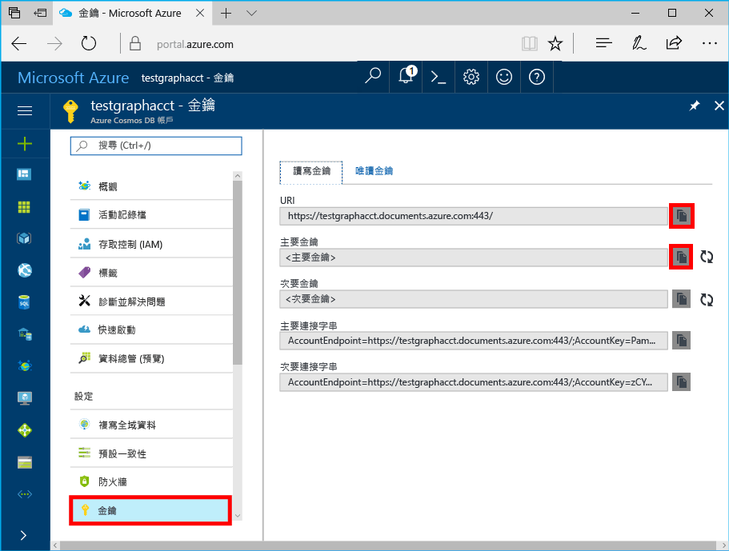

# <a name="azure-cosmos-db-build-a-nodejs-application-by-using-graph-api"></a>Azure Cosmos DB：使用圖形 API 來建置 Node.js 應用程式

Azure 的 Cosmos DB 是來自 Microsoft 的全域散發的 hello 多模型資料庫服務。 您可以快速建立與查詢文件、 索引鍵/值，以及 graph 資料庫，全部都是從 hello 全域發佈和核心 Azure Cosmos DB hello 的水平縮放功能獲益。 

快速入門本文示範如何 toocreate Azure Cosmos DB 說明 Graph API （預覽）、 資料庫和圖形使用 hello Azure 入口網站。 然後建置並執行主控台應用程式使用 hello 開放原始碼[Gremlin Node.js](https://www.npmjs.com/package/gremlin-secure)驅動程式。  

> [!NOTE]
> hello npm 模組`gremlin-secure`是修改的版`gremlin`模組，但是有 SSL 和 SASL Azure Cosmos DB 連接所需的支援。 原始程式碼位於 [GitHub](https://github.com/CosmosDB/gremlin-javascript)。
>

## <a name="prerequisites"></a>必要條件

您可以執行此範例之前，您必須擁有下列必要條件 hello:
* [Node.js](https://nodejs.org/en/) 0.10.29 版或更新版本
* [Git](http://git-scm.com/)

[!INCLUDE [quickstarts-free-trial-note](../../includes/quickstarts-free-trial-note.md)]

## <a name="create-a-database-account"></a>建立資料庫帳戶

[!INCLUDE [cosmos-db-create-dbaccount-graph](../../includes/cosmos-db-create-dbaccount-graph.md)]

## <a name="add-a-graph"></a>新增圖形

[!INCLUDE [cosmos-db-create-graph](../../includes/cosmos-db-create-graph.md)]

## <a name="clone-hello-sample-application"></a>複製 hello 範例應用程式

現在讓我們從 GitHub，複製 Graph API 應用程式設定 hello 連接字串，並執行它。 您會看到是多麼的輕鬆 toowork 資料以程式設計的方式。 

1. 開啟 Git 終端機視窗，例如 Git Bash，並將變更 (透過`cd`命令) tooa 工作目錄。  

2. 執行下列命令 tooclone hello 範例儲存機制的 hello。 

    ```bash
    git clone https://github.com/Azure-Samples/azure-cosmos-db-graph-nodejs-getting-started.git
    ```

3. 開啟 Visual Studio 中的 hello 方案檔。 

## <a name="review-hello-code"></a>檢閱 hello 程式碼

讓我們進行快速檢閱 hello 應用程式中的情況。 開啟 hello`app.js`檔案，而且您會發現下列幾行程式碼的 hello。 

* hello Gremlin 用戶端會建立。

    ```nodejs
    const client = Gremlin.createClient(
        443, 
        config.endpoint, 
        { 
            "session": false, 
            "ssl": true, 
            "user": `/dbs/${config.database}/colls/${config.collection}`,
            "password": config.primaryKey
        });
    ```

  hello 組態都位於`config.js`，我們在 hello 下列區段中編輯。

* 一系列的 Gremlin 步驟會執行以 hello`client.execute`方法。

    ```nodejs
    console.log('Running Count'); 
    client.execute("g.V().count()", { }, (err, results) => {
        if (err) return console.error(err);
        console.log(JSON.stringify(results));
        console.log();
    });
    ```

## <a name="update-your-connection-string"></a>更新您的連接字串

1. 開啟 hello config.js 檔案。 

2. 在 config.js，填入 hello config.endpoint 金鑰以 hello **Gremlin URI**值從 hello**概觀**hello Azure 入口網站頁面。 

    `config.endpoint = "GRAPHENDPOINT";`

    

   如果 hello **Gremlin URI**值是空的您可以從 hello 產生 hello 值**金鑰**hello 使用入口網站中，hello 頁面**URI**移除 https:// 以及變更的值文件 toographs。

   hello Gremlin 端點必須只有 hello 主機名稱，如果沒有 hello 通訊協定/連接埠號碼，例如`mygraphdb.graphs.azure.com`(不`https://mygraphdb.graphs.azure.com`或`mygraphdb.graphs.azure.com:433`)。

3. 在 config.js，填入 hello config.primaryKey 值入 hello**主索引鍵**值從 hello**金鑰**hello Azure 入口網站頁面。 

    `config.primaryKey = "PRIMARYKEY";`

   

4. 輸入 hello 資料庫名稱，以及 config.database 和 config.collection hello 值 （容器） 的圖形名稱。 

您完成的 config.js 檔案範例應如下所示︰

```nodejs
var config = {}

// Note that this must not have HTTPS or hello port number
config.endpoint = "testgraphacct.graphs.azure.com";
config.primaryKey = "Pams6e7LEUS7LJ2Qk0fjZf3eGo65JdMWHmyn65i52w8ozPX2oxY3iP0yu05t9v1WymAHNcMwPIqNAEv3XDFsEg==";
config.database = "graphdb"
config.collection = "Persons"

module.exports = config;
```

## <a name="run-hello-console-app"></a>執行 hello 主控台應用程式

1. 開啟 終端機視窗，並變更 (透過`cd`命令) toohello hello 專案中所包含的 hello package.json 檔案的安裝目錄。  

2. 執行`npm install`tooinstall hello 所需的 npm 模組，包括`gremlin-secure`。

3. 執行`node app.js`中終端機 toostart 應用程式節點。

## <a name="browse-with-data-explorer"></a>使用資料總管進行瀏覽

現在可以移回 tooData 總管在 Azure 入口網站 tooview hello、 查詢、 修改及使用新的圖形資料。

在 Data 總管 hello 新資料庫會出現在 hello**圖形**窗格。 展開 hello 資料庫，後面接著 hello 集合，然後按一下 **圖形**。

hello hello 範例應用程式所產生的資料會顯示在 hello hello 內的下一個窗格**圖形**索引標籤上，當您按一下**套用篩選**。

請嘗試完成`g.V()`與`.has('firstName', 'Thomas')`tootest hello 篩選器。 請注意 hello 值會區分大小寫。

## <a name="review-slas-in-hello-azure-portal"></a>在 hello Azure 入口網站中檢視 Sla

[!INCLUDE [cosmosdb-tutorial-review-slas](../../includes/cosmos-db-tutorial-review-slas.md)]

## <a name="clean-up-your-resources"></a>清除資源

如果您不打算使用此應用程式的 toocontinue，刪除您建立這份文件中執行 hello 下列的所有資源： 

1. 在 hello Azure 入口網站，在 hello 左的導覽功能表上，按一下 **資源群組**，然後按一下您所建立的 hello 資源 hello 名稱。 
2. 在資源群組頁面上，按一下 **刪除**，輸入 hello hello 資源 toobe 刪除，名稱，然後按一下**刪除**。

## <a name="next-steps"></a>後續步驟

在本文中，您學到如何 toocreate Azure Cosmos DB 帳戶，使用資料總管 中，建立的圖形和執行應用程式。 您現在可以使用 Gremlin 來建置更複雜的查詢，以及實作強大的圖形周遊邏輯。 

> [!div class="nextstepaction"]
> [使用 Gremlin 進行查詢](tutorial-query-graph.md)
