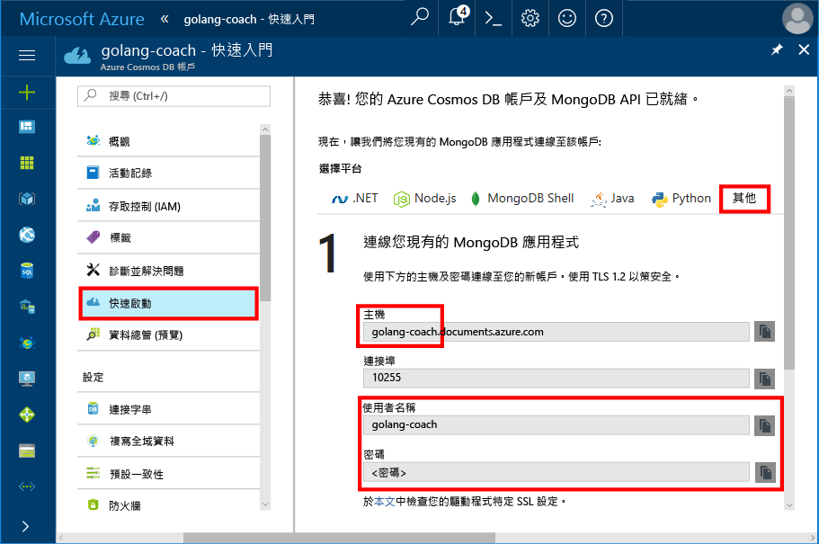
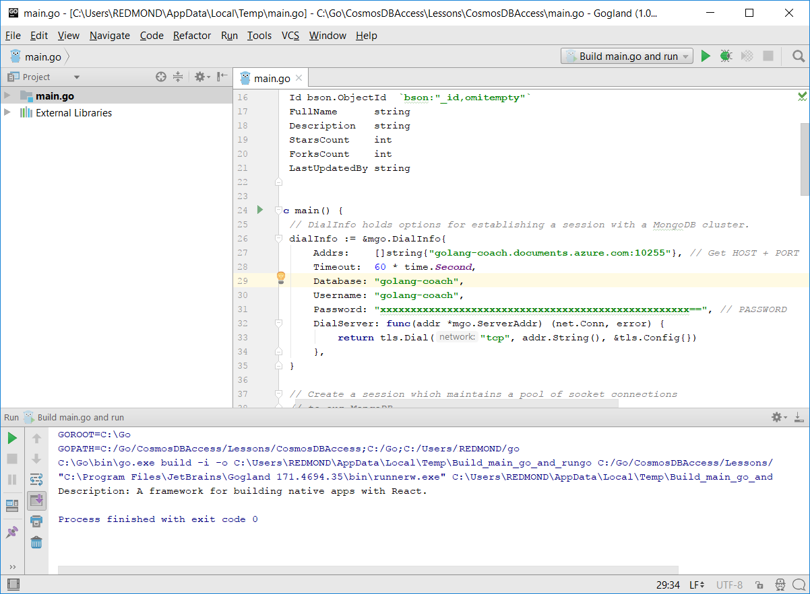
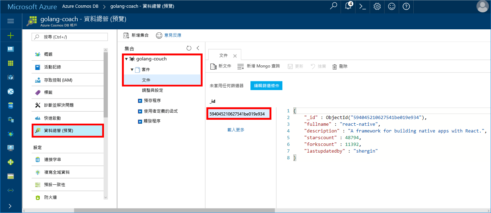

# <a name="azure-cosmos-db-build-a-mongodb-api-console-app-with-golang-and-hello-azure-portal"></a><span data-ttu-id="b340e-103">Azure Cosmos DB： 建置與 Golang MongoDB API 主控台應用程式和 hello Azure 入口網站</span><span class="sxs-lookup"><span data-stu-id="b340e-103">Azure Cosmos DB: Build a MongoDB API console app with Golang and hello Azure portal</span></span>

<span data-ttu-id="b340e-104">Azure Cosmos DB 是 Microsoft 的全域分散式多模型資料庫服務。</span><span class="sxs-lookup"><span data-stu-id="b340e-104">Azure Cosmos DB is Microsoft’s globally distributed multi-model database service.</span></span> <span data-ttu-id="b340e-105">您可以快速建立與查詢文件、 索引鍵/值，以及 graph 資料庫，全部都是從 hello 全域發佈和核心 Azure Cosmos DB hello 的水平縮放功能獲益。</span><span class="sxs-lookup"><span data-stu-id="b340e-105">You can quickly create and query document, key/value, and graph databases, all of which benefit from hello global distribution and horizontal scale capabilities at hello core of Azure Cosmos DB.</span></span>

<span data-ttu-id="b340e-106">本快速入門示範如何將現有的 toouse [MongoDB](https://docs.microsoft.com/en-us/azure/cosmos-db/mongodb-introduction)撰寫應用程式[Golang](https://golang.org/)並將它連接 tooyour Azure Cosmos DB 資料庫支援 MongoDB 用戶端連線。</span><span class="sxs-lookup"><span data-stu-id="b340e-106">This quick-start demonstrates how toouse an existing [MongoDB](https://docs.microsoft.com/en-us/azure/cosmos-db/mongodb-introduction) app written in [Golang](https://golang.org/) and connect it tooyour Azure Cosmos DB database, which supports MongoDB client connections.</span></span>

<span data-ttu-id="b340e-107">換句話說，Golang 應用程式只會知道它連接 tooa 資料庫使用 MongoDB Api。</span><span class="sxs-lookup"><span data-stu-id="b340e-107">In other words, your Golang application only knows that it's connecting tooa database using MongoDB APIs.</span></span> <span data-ttu-id="b340e-108">是透明 toohello hello 資料的應用程式會儲存在 Azure Cosmos DB。</span><span class="sxs-lookup"><span data-stu-id="b340e-108">It is transparent toohello application that hello data is stored in Azure Cosmos DB.</span></span>

## <a name="prerequisites"></a><span data-ttu-id="b340e-109">必要條件</span><span class="sxs-lookup"><span data-stu-id="b340e-109">Prerequisites</span></span>

- <span data-ttu-id="b340e-110">Azure 訂用帳戶。</span><span class="sxs-lookup"><span data-stu-id="b340e-110">An Azure subscription.</span></span> <span data-ttu-id="b340e-111">如果您沒有 Azure 訂用帳戶，請在開始前建立[免費帳戶](https://azure.microsoft.com/free) 。</span><span class="sxs-lookup"><span data-stu-id="b340e-111">If you don’t have an Azure subscription, create a [free account](https://azure.microsoft.com/free) before you begin.</span></span>
- <span data-ttu-id="b340e-112">[移](https://golang.org/dl/)hello 的基本知識和[移](https://golang.org/)語言。</span><span class="sxs-lookup"><span data-stu-id="b340e-112">[Go](https://golang.org/dl/) and a basic knowledge of hello [Go](https://golang.org/) language.</span></span>
- <span data-ttu-id="b340e-113">IDE — Jetbrains 的 [Gogland](https://www.jetbrains.com/go/)、Microsoft 的 [Visual Studio 程式碼](https://code.visualstudio.com/) 或 [Atom](https://atom.io/)。</span><span class="sxs-lookup"><span data-stu-id="b340e-113">An IDE — [Gogland](https://www.jetbrains.com/go/) by Jetbrains, [Visual Studio Code](https://code.visualstudio.com/) by Microsoft, or [Atom](https://atom.io/).</span></span> <span data-ttu-id="b340e-114">在本教學課程中，我是使用 Goglang。</span><span class="sxs-lookup"><span data-stu-id="b340e-114">In this tutorial, I'm using Goglang.</span></span>

<a id="create-account"></a>
## <a name="create-a-database-account"></a><span data-ttu-id="b340e-115">建立資料庫帳戶</span><span class="sxs-lookup"><span data-stu-id="b340e-115">Create a database account</span></span>

[!INCLUDE [cosmos-db-create-dbaccount](../../includes/cosmos-db-create-dbaccount-mongodb.md)]

## <a name="clone-hello-sample-application"></a><span data-ttu-id="b340e-116">複製 hello 範例應用程式</span><span class="sxs-lookup"><span data-stu-id="b340e-116">Clone hello sample application</span></span>

<span data-ttu-id="b340e-117">複製 hello 範例應用程式，並安裝所需的 hello 封裝。</span><span class="sxs-lookup"><span data-stu-id="b340e-117">Clone hello sample application and install hello required packages.</span></span>

1. <span data-ttu-id="b340e-118">建立預設為 C:\Go\ hello GOROOT\src 資料夾內名為 CosmosDBSample 資料夾。</span><span class="sxs-lookup"><span data-stu-id="b340e-118">Create a folder named CosmosDBSample inside hello GOROOT\src folder, which is C:\Go\ by default.</span></span>
2. <span data-ttu-id="b340e-119">執行下列命令，例如 git bash tooclone hello 範例儲存機制使用 git 終端機視窗，into hello CosmosDBSample 資料夾 hello。</span><span class="sxs-lookup"><span data-stu-id="b340e-119">Run hello following command using a git terminal window such as git bash tooclone hello sample repository into hello CosmosDBSample folder.</span></span> 

    ```bash
    git clone https://github.com/Azure-Samples/azure-cosmos-db-mongodb-golang-getting-started.git
    ```
3.  <span data-ttu-id="b340e-120">執行下列命令 tooget hello mgo 套件 hello。</span><span class="sxs-lookup"><span data-stu-id="b340e-120">Run hello following command tooget hello mgo package.</span></span> 

    ```
    go get gopkg.in/mgo.v2
    ```

<span data-ttu-id="b340e-121">hello [mgo](http://labix.org/mgo)驅動程式 (phishing 英文發音如為*mango*) 是[MongoDB](http://www.mongodb.org/) hello 驅動程式[移語言](http://golang.org/)實作 rich 而且也測試在下列標準 Go 慣用語非常簡單的 API 功能的選取範圍。</span><span class="sxs-lookup"><span data-stu-id="b340e-121">hello [mgo](http://labix.org/mgo) driver (pronounced as *mango*) is a [MongoDB](http://www.mongodb.org/) driver for hello [Go language](http://golang.org/) that implements a rich and well tested selection of features under a very simple API following standard Go idioms.</span></span>

<a id="connection-string"></a>

## <a name="update-your-connection-string"></a><span data-ttu-id="b340e-122">更新您的連接字串</span><span class="sxs-lookup"><span data-stu-id="b340e-122">Update your connection string</span></span>

<span data-ttu-id="b340e-123">現在請返回 Azure 入口網站 tooget toohello 您的連接字串資訊並將它複製到 hello 應用程式。</span><span class="sxs-lookup"><span data-stu-id="b340e-123">Now go back toohello Azure portal tooget your connection string information and copy it into hello app.</span></span>

1. <span data-ttu-id="b340e-124">按一下**快速入門**在 hello 左的導覽功能表，然後按一下**其他**hello 移至應用程式所需的 tooview hello 連接字串資訊。</span><span class="sxs-lookup"><span data-stu-id="b340e-124">Click **Quick start** in hello left navigation menu, and then click **Other** tooview hello connection string information required by hello Go application.</span></span>

2. <span data-ttu-id="b340e-125">在 Goglang，hello GOROOT\CosmosDBSample 目錄中開啟 hello main.go 檔案並更新如下列幾行程式碼使用 hello Azure 入口網站中的 hello 連接字串資訊 hello 下列螢幕擷取畫面所示的 hello。</span><span class="sxs-lookup"><span data-stu-id="b340e-125">In Goglang, open hello main.go file in hello GOROOT\CosmosDBSample directory and update hello following lines of code using hello connection string information from hello Azure portal as shown in hello following screenshot.</span></span> 

    <span data-ttu-id="b340e-126">hello 資料庫名稱是 hello hello 前置詞**主機**hello Azure 入口網站的連接字串 窗格中的值。</span><span class="sxs-lookup"><span data-stu-id="b340e-126">hello Database name is hello prefix of hello **Host** value in hello Azure portal connection string pane.</span></span> <span data-ttu-id="b340e-127">Hello 帳戶 hello 圖所示，hello 資料庫名稱會是 golang 指導。</span><span class="sxs-lookup"><span data-stu-id="b340e-127">For hello account shown in hello image below, hello Database name is golang-coach.</span></span>

    ```go
    Database: "hello prefix of hello Host value in hello Azure portal",
    Username: "hello Username in hello Azure portal",
    Password: "hello Password in hello Azure portal",
    ```

    

3. <span data-ttu-id="b340e-129">儲存 hello main.go 檔案。</span><span class="sxs-lookup"><span data-stu-id="b340e-129">Save hello main.go file.</span></span>

## <a name="review-hello-code"></a><span data-ttu-id="b340e-130">檢閱 hello 程式碼</span><span class="sxs-lookup"><span data-stu-id="b340e-130">Review hello code</span></span>

<span data-ttu-id="b340e-131">讓我們進行快速檢閱 hello main.go 檔案中的情況。</span><span class="sxs-lookup"><span data-stu-id="b340e-131">Let's make a quick review of what's happening in hello main.go file.</span></span> 

### <a name="connecting-hello-go-app-tooazure-cosmos-db"></a><span data-ttu-id="b340e-132">連接到應用程式 tooAzure Cosmos DB hello</span><span class="sxs-lookup"><span data-stu-id="b340e-132">Connecting hello Go app tooAzure Cosmos DB</span></span>

<span data-ttu-id="b340e-133">Azure Cosmos DB 支援 hello 啟用 SSL MongoDB。</span><span class="sxs-lookup"><span data-stu-id="b340e-133">Azure Cosmos DB supports hello SSL-enabled MongoDB.</span></span> <span data-ttu-id="b340e-134">tooconnect tooan 啟用 SSL MongoDB，您需要 toodefine hello **DialServer**函式在[mgo。DialInfo](http://gopkg.in/mgo.v2#DialInfo)，並讓使用 hello [tls。*撥號*](http://golang.org/pkg/crypto/tls#Dial)函式 tooperform hello 連線。</span><span class="sxs-lookup"><span data-stu-id="b340e-134">tooconnect tooan SSL-enabled MongoDB, you need toodefine hello **DialServer** function in [mgo.DialInfo](http://gopkg.in/mgo.v2#DialInfo), and make use of hello [tls.*Dial*](http://golang.org/pkg/crypto/tls#Dial) function tooperform hello connection.</span></span>

<span data-ttu-id="b340e-135">遵循 Golang 程式碼片段的 hello 與 Azure Cosmos DB MongoDB API 連線 hello 移至應用程式。</span><span class="sxs-lookup"><span data-stu-id="b340e-135">hello following Golang code snippet connects hello Go app with Azure Cosmos DB MongoDB API.</span></span> <span data-ttu-id="b340e-136">hello *DialInfo*類別保存選項建立工作階段使用 MongoDB 的叢集。</span><span class="sxs-lookup"><span data-stu-id="b340e-136">hello *DialInfo* class holds options for establishing a session with a MongoDB cluster.</span></span>

```go
// DialInfo holds options for establishing a session with a MongoDB cluster.
dialInfo := &mgo.DialInfo{
    Addrs:    []string{"golang-couch.documents.azure.com:10255"}, // Get HOST + PORT
    Timeout:  60 * time.Second,
    Database: "database", // It can be anything
    Username: "username", // Username
    Password: "Azure database connect password from Azure Portal", // PASSWORD
    DialServer: func(addr *mgo.ServerAddr) (net.Conn, error) {
        return tls.Dial("tcp", addr.String(), &tls.Config{})
    },
}

// Create a session which maintains a pool of socket connections
// tooour Azure Cosmos DB MongoDB database.
session, err := mgo.DialWithInfo(dialInfo)

if err != nil {
    fmt.Printf("Can't connect toomongo, go error %v\n", err)
    os.Exit(1)
}

defer session.Close()

// SetSafe changes hello session safety mode.
// If hello safe parameter is nil, hello session is put in unsafe mode, 
// and writes become fire-and-forget,
// without error checking. hello unsafe mode is faster since operations won't hold on waiting for a confirmation.
// 
session.SetSafe(&mgo.Safe{})
```

<span data-ttu-id="b340e-137">hello **mgo。Dial()**方法可在沒有 SSL 連線。</span><span class="sxs-lookup"><span data-stu-id="b340e-137">hello **mgo.Dial()** method is used when there is no SSL connection.</span></span> <span data-ttu-id="b340e-138">SSL 連接，hello **mgo。DialWithInfo()**的方法。</span><span class="sxs-lookup"><span data-stu-id="b340e-138">For an SSL connection, hello **mgo.DialWithInfo()** method is required.</span></span>

<span data-ttu-id="b340e-139">執行個體的 hello **DialWIthInfo {}**物件是使用的 toocreate hello 工作階段物件。</span><span class="sxs-lookup"><span data-stu-id="b340e-139">An instance of hello **DialWIthInfo{}** object is used toocreate hello session object.</span></span> <span data-ttu-id="b340e-140">一旦建立 hello 工作階段之後，您可以使用下列程式碼片段的 hello 存取 hello 集合：</span><span class="sxs-lookup"><span data-stu-id="b340e-140">Once hello session is established, you can access hello collection by using hello following code snippet:</span></span>

```go
collection := session.DB(“database”).C(“package”)
```

<a id="create-document"></a>

### <a name="create-a-document"></a><span data-ttu-id="b340e-141">建立文件</span><span class="sxs-lookup"><span data-stu-id="b340e-141">Create a document</span></span>

```go
// Model
type Package struct {
    Id bson.ObjectId  `bson:"_id,omitempty"`
    FullName      string
    Description   string
    StarsCount    int
    ForksCount    int
    LastUpdatedBy string
}

// insert Document in collection
err = collection.Insert(&Package{
    FullName:"react",
    Description:"A framework for building native apps with React.",
    ForksCount: 11392,
    StarsCount:48794,
    LastUpdatedBy:"shergin",

})

if err != nil {
    log.Fatal("Problem inserting data: ", err)
    return
}
```

### <a name="query-or-read-a-document"></a><span data-ttu-id="b340e-142">查詢或閱讀文件</span><span class="sxs-lookup"><span data-stu-id="b340e-142">Query or read a document</span></span>

<span data-ttu-id="b340e-143">Azure Cosmos DB 支援針對儲存於每個集合的 JSON 文件進行豐富查詢。</span><span class="sxs-lookup"><span data-stu-id="b340e-143">Azure Cosmos DB supports rich queries against JSON documents stored in each collection.</span></span> <span data-ttu-id="b340e-144">hello 下列範例程式碼顯示您可以針對 hello 文件集合中執行的查詢。</span><span class="sxs-lookup"><span data-stu-id="b340e-144">hello following sample code shows a query that you can run against hello documents in your collection.</span></span>

```go
// Get a Document from hello collection
result := Package{}
err = collection.Find(bson.M{"fullname": "react"}).One(&result)
if err != nil {
    log.Fatal("Error finding record: ", err)
    return
}

fmt.Println("Description:", result.Description)
```


### <a name="update-a-document"></a><span data-ttu-id="b340e-145">更新文件</span><span class="sxs-lookup"><span data-stu-id="b340e-145">Update a document</span></span>

```go
// Update a document
updateQuery := bson.M{"_id": result.Id}
change := bson.M{"$set": bson.M{"fullname": "react-native"}}
err = collection.Update(updateQuery, change)
if err != nil {
    log.Fatal("Error updating record: ", err)
    return
}
```

### <a name="delete-a-document"></a><span data-ttu-id="b340e-146">刪除文件</span><span class="sxs-lookup"><span data-stu-id="b340e-146">Delete a document</span></span>

<span data-ttu-id="b340e-147">Azure Cosmos DB 支援刪除 JSON 文件。</span><span class="sxs-lookup"><span data-stu-id="b340e-147">Azure Cosmos DB supports deleting JSON documents.</span></span>

```go
// Delete a document
query := bson.M{"_id": result.Id}
err = collection.Remove(query)
if err != nil {
   log.Fatal("Error deleting record: ", err)
   return
}
```
    
## <a name="run-hello-app"></a><span data-ttu-id="b340e-148">執行 hello 應用程式</span><span class="sxs-lookup"><span data-stu-id="b340e-148">Run hello app</span></span>

1. <span data-ttu-id="b340e-149">在 Goglang，確定您 GOPATH (適用於**檔案**，**設定**，**移**， **GOPATH**) 包含 hello 位置中的 hellogopkg 已安裝，也就是 USERPROFILE\go 預設。</span><span class="sxs-lookup"><span data-stu-id="b340e-149">In Goglang, ensure that your GOPATH (available under **File**, **Settings**, **Go**, **GOPATH**) include hello location in which hello gopkg was installed, which is USERPROFILE\go by default.</span></span> 
2. <span data-ttu-id="b340e-150">使執行 hello 應用程式後，您可以看到 hello 文件註解刪除 hello 文件中，行 91 96 的 hello 行。</span><span class="sxs-lookup"><span data-stu-id="b340e-150">Comment out hello lines that delete hello document, lines 91-96, so that you can see hello document after running hello app.</span></span>
3. <span data-ttu-id="b340e-151">在 Goglang 中，按一下 執行，然後按一下執行 建置 main.go 並執行。</span><span class="sxs-lookup"><span data-stu-id="b340e-151">In Goglang, click **Run**, and then click **Run 'Build main.go and run'**.</span></span>

    <span data-ttu-id="b340e-152">hello 應用程式完成，並顯示 hello 文件中建立 hello 描述[建立文件](#create-document)。</span><span class="sxs-lookup"><span data-stu-id="b340e-152">hello app finishes and displays hello description of hello document created in [Create a document](#create-document).</span></span>
    
    ```
    Description: A framework for building native apps with React.
    
    Process finished with exit code 0
    ```

    
    
## <a name="review-your-document-in-data-explorer"></a><span data-ttu-id="b340e-154">在資料總管中檢閱您的文件</span><span class="sxs-lookup"><span data-stu-id="b340e-154">Review your document in Data Explorer</span></span>

<span data-ttu-id="b340e-155">請返回 Azure 入口網站 toosee toohello 資料總管文件。</span><span class="sxs-lookup"><span data-stu-id="b340e-155">Go back toohello Azure portal toosee your document in Data Explorer.</span></span>

1. <span data-ttu-id="b340e-156">按一下**資料總管 （預覽）**在 hello 左的導覽功能表上，依序展開**golang 指導**，**封裝**，然後按一下**文件**。</span><span class="sxs-lookup"><span data-stu-id="b340e-156">Click **Data Explorer (Preview)** in hello left navigation menu, expand **golang-coach**, **package**, and then click **Documents**.</span></span> <span data-ttu-id="b340e-157">在 hello**文件**索引標籤上，按一下 hello \_hello 右窗格中的識別碼 toodisplay hello 文件。</span><span class="sxs-lookup"><span data-stu-id="b340e-157">In hello **Documents** tab, click hello \_id toodisplay hello document in hello right pane.</span></span> 

    
    
2. <span data-ttu-id="b340e-159">您可以接著使用 hello 文件內嵌並按一下 **更新**toosave 它。</span><span class="sxs-lookup"><span data-stu-id="b340e-159">You can then work with hello document inline and click **Update** toosave it.</span></span> <span data-ttu-id="b340e-160">您也可以刪除 hello 文件，或建立新文件或查詢。</span><span class="sxs-lookup"><span data-stu-id="b340e-160">You can also delete hello document, or create new documents or queries.</span></span>

## <a name="review-slas-in-hello-azure-portal"></a><span data-ttu-id="b340e-161">在 hello Azure 入口網站中檢視 Sla</span><span class="sxs-lookup"><span data-stu-id="b340e-161">Review SLAs in hello Azure portal</span></span>

[!INCLUDE [cosmosdb-tutorial-review-slas](../../includes/cosmos-db-tutorial-review-slas.md)]

## <a name="clean-up-resources"></a><span data-ttu-id="b340e-162">清除資源</span><span class="sxs-lookup"><span data-stu-id="b340e-162">Clean up resources</span></span>

<span data-ttu-id="b340e-163">如果您不打算 toocontinue toouse 此應用程式，刪除所有資源本快速入門以建立 hello Azure 入口網站以 hello 下列步驟：</span><span class="sxs-lookup"><span data-stu-id="b340e-163">If you're not going toocontinue toouse this app, delete all resources created by this quickstart in hello Azure portal with hello following steps:</span></span>

1. <span data-ttu-id="b340e-164">Hello Azure 入口網站中的 hello 左側功能表中按一下**資源群組**，然後按一下您所建立的 hello 資源的 hello 名稱。</span><span class="sxs-lookup"><span data-stu-id="b340e-164">From hello left-hand menu in hello Azure portal, click **Resource groups** and then click hello name of hello resource you created.</span></span> 
2. <span data-ttu-id="b340e-165">在資源群組頁面上，按一下 **刪除**，在 hello 文字方塊中，輸入 hello 資源 toodelete hello 名稱，然後按一下**刪除**。</span><span class="sxs-lookup"><span data-stu-id="b340e-165">On your resource group page, click **Delete**, type hello name of hello resource toodelete in hello text box, and then click **Delete**.</span></span>

## <a name="next-steps"></a><span data-ttu-id="b340e-166">後續步驟</span><span class="sxs-lookup"><span data-stu-id="b340e-166">Next steps</span></span>

<span data-ttu-id="b340e-167">本快速入門中，您學到如何 toocreate Azure Cosmos DB 帳戶和執行 Golang 應用程式使用 hello API MongoDB。</span><span class="sxs-lookup"><span data-stu-id="b340e-167">In this quickstart, you've learned how toocreate an Azure Cosmos DB account and run a Golang app using hello API for MongoDB.</span></span> <span data-ttu-id="b340e-168">您現在可以匯入的其他資料 tooyour Cosmos DB 帳戶。</span><span class="sxs-lookup"><span data-stu-id="b340e-168">You can now import additional data tooyour Cosmos DB account.</span></span> 

> [!div class="nextstepaction"]
> [<span data-ttu-id="b340e-169">資料匯入至 Azure Cosmos DB hello MongoDB 應用程式開發介面</span><span class="sxs-lookup"><span data-stu-id="b340e-169">Import data into Azure Cosmos DB for hello MongoDB API</span></span>](mongodb-migrate.md)
