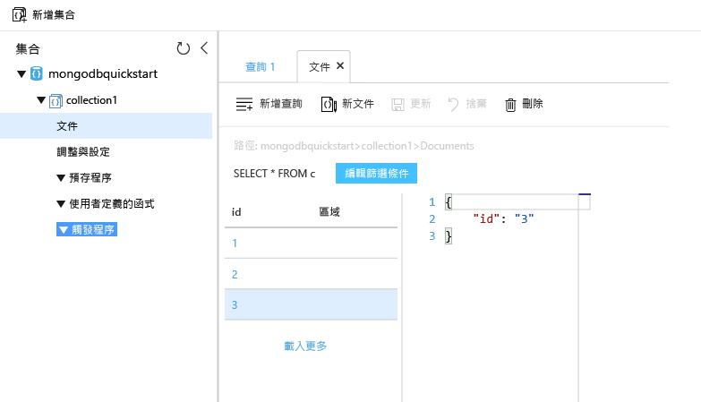

# <a name="azure-cosmos-db-migrate-an-existing-nodejs-mongodb-web-app"></a><span data-ttu-id="cdf49-103">Azure Cosmos DB︰移轉現有的 Node.js MongoDB Web 應用程式</span><span class="sxs-lookup"><span data-stu-id="cdf49-103">Azure Cosmos DB: Migrate an existing Node.js MongoDB web app</span></span> 

<span data-ttu-id="cdf49-104">Azure Cosmos DB 是 Microsoft 的全域分散式多模型資料庫服務。</span><span class="sxs-lookup"><span data-stu-id="cdf49-104">Azure Cosmos DB is Microsoft’s globally distributed multi-model database service.</span></span> <span data-ttu-id="cdf49-105">您可以快速建立及查詢文件、索引鍵/值及圖形資料庫，所有這些都受惠於位於 Azure Cosmos DB 核心的全域散發和水平調整功能。</span><span class="sxs-lookup"><span data-stu-id="cdf49-105">You can quickly create and query document, key/value, and graph databases, all of which benefit from the global distribution and horizontal scale capabilities at the core of Azure Cosmos DB.</span></span> 

<span data-ttu-id="cdf49-106">本快速入門示範如何使用以 Node.js 撰寫的現有 [MongoDB](mongodb-introduction.md) 應用程式，並將它連線到可支援 MongoDB 用戶端連線的 Azure Cosmos DB 資料庫。</span><span class="sxs-lookup"><span data-stu-id="cdf49-106">This quickstart demonstrates how to use an existing [MongoDB](mongodb-introduction.md) app written in Node.js and connect it to your Azure Cosmos DB database, which supports MongoDB client connections.</span></span> <span data-ttu-id="cdf49-107">換句話說，您的 Node.js 應用程式只知道它使用 MongoDB API 連線到資料庫。</span><span class="sxs-lookup"><span data-stu-id="cdf49-107">In other words, your Node.js application only knows that it's connecting to a database using MongoDB APIs.</span></span> <span data-ttu-id="cdf49-108">對於資料儲存在 Azure Cosmos DB 中的應用程式而言是透明的。</span><span class="sxs-lookup"><span data-stu-id="cdf49-108">It is transparent to the application that the data is stored in Azure Cosmos DB.</span></span>

<span data-ttu-id="cdf49-109">完成之後，您的 MEAN 應用程式 (MongoDB、Express、AngularJS 及 Node.js) 將會在 [Azure Cosmos DB](https://azure.microsoft.com/services/cosmos-db/) 上執行。</span><span class="sxs-lookup"><span data-stu-id="cdf49-109">When you are done, you will have a MEAN application (MongoDB, Express, AngularJS, and Node.js) running on [Azure Cosmos DB](https://azure.microsoft.com/services/cosmos-db/).</span></span> 


[!INCLUDE [cloud-shell-try-it](../../includes/cloud-shell-try-it.md)]

<span data-ttu-id="cdf49-111">如果您選擇在本機安裝和使用 CLI，本主題會要求您執行 Azure CLI 2.0 版或更新版本。</span><span class="sxs-lookup"><span data-stu-id="cdf49-111">If you choose to install and use the CLI locally, this topic requires that you are running the Azure CLI version 2.0 or later.</span></span> <span data-ttu-id="cdf49-112">執行 `az --version` 以尋找版本。</span><span class="sxs-lookup"><span data-stu-id="cdf49-112">Run `az --version` to find the version.</span></span> <span data-ttu-id="cdf49-113">如果您需要安裝或升級，請參閱[安裝 Azure CLI 2.0]( /cli/azure/install-azure-cli)。</span><span class="sxs-lookup"><span data-stu-id="cdf49-113">If you need to install or upgrade, see [Install Azure CLI 2.0]( /cli/azure/install-azure-cli).</span></span> 

## <a name="prerequisites"></a><span data-ttu-id="cdf49-114">必要條件</span><span class="sxs-lookup"><span data-stu-id="cdf49-114">Prerequisites</span></span> 
<span data-ttu-id="cdf49-115">除了 Azure CLI，您還需要在本機安裝 [Node.js](https://nodejs.org/) 和 [Git](http://www.git-scm.com/downloads)，才能執行 `npm` 和 `git` 命令。</span><span class="sxs-lookup"><span data-stu-id="cdf49-115">In addition to Azure CLI, you need [Node.js](https://nodejs.org/) and [Git](http://www.git-scm.com/downloads) installed locally to run `npm` and `git` commands.</span></span>

<span data-ttu-id="cdf49-116">您應具備 Node.js 的使用知識。</span><span class="sxs-lookup"><span data-stu-id="cdf49-116">You should have working knowledge of Node.js.</span></span> <span data-ttu-id="cdf49-117">本快速入門通常不是為了協助您開發 Node.js 應用程式。</span><span class="sxs-lookup"><span data-stu-id="cdf49-117">This quickstart is not intended to help you with developing Node.js applications in general.</span></span>

## <a name="clone-the-sample-application"></a><span data-ttu-id="cdf49-118">複製範例應用程式</span><span class="sxs-lookup"><span data-stu-id="cdf49-118">Clone the sample application</span></span>

<span data-ttu-id="cdf49-119">開啟 Git 終端機視窗 (例如 Git Bash)，然後使用 `cd` 來切換到工作目錄。</span><span class="sxs-lookup"><span data-stu-id="cdf49-119">Open a git terminal window, such as git bash, and `cd` to a working directory.</span></span>  

<span data-ttu-id="cdf49-120">執行下列命令來複製範例存放庫。</span><span class="sxs-lookup"><span data-stu-id="cdf49-120">Run the following commands to clone the sample repository.</span></span> <span data-ttu-id="cdf49-121">此範例存放庫包含預設 [MEAN.js](http://meanjs.org/) 應用程式。</span><span class="sxs-lookup"><span data-stu-id="cdf49-121">This sample repository contains the default [MEAN.js](http://meanjs.org/) application.</span></span> 

```bash
git clone https://github.com/prashanthmadi/mean
```

## <a name="run-the-application"></a><span data-ttu-id="cdf49-122">執行應用程式</span><span class="sxs-lookup"><span data-stu-id="cdf49-122">Run the application</span></span>

<span data-ttu-id="cdf49-123">安裝必要的封裝，然後啟動應用程式。</span><span class="sxs-lookup"><span data-stu-id="cdf49-123">Install the required packages and start the application.</span></span>

```bash
cd mean
npm install
npm start
```

## <a name="log-in-to-azure"></a><span data-ttu-id="cdf49-124">登入 Azure</span><span class="sxs-lookup"><span data-stu-id="cdf49-124">Log in to Azure</span></span>

<span data-ttu-id="cdf49-125">如果您要使用已安裝的 Azure CLI，請使用 [az login](/cli/azure/#login) 命令來登入 Azure 訂用帳戶，並遵循畫面上的指示進行。</span><span class="sxs-lookup"><span data-stu-id="cdf49-125">If you are using an installed Azure CLI, log in to your Azure subscription with the [az login](/cli/azure/#login) command and follow the on-screen directions.</span></span> <span data-ttu-id="cdf49-126">如果您是使用 Azure Cloud Shell，可以跳過此步驟。</span><span class="sxs-lookup"><span data-stu-id="cdf49-126">You can skip this step if you're using the Azure Cloud Shell.</span></span>

```azurecli
az login 
``` 
   
## <a name="add-the-azure-cosmos-db-module"></a><span data-ttu-id="cdf49-127">新增 Azure Cosmos DB 模組</span><span class="sxs-lookup"><span data-stu-id="cdf49-127">Add the Azure Cosmos DB module</span></span>

<span data-ttu-id="cdf49-128">如果您是使用已安裝的 Azure CLI，請檢查是否已安裝 `cosmosdb` 元件，方法是執行 `az` 命令。</span><span class="sxs-lookup"><span data-stu-id="cdf49-128">If you are using an installed Azure CLI, check to see if the `cosmosdb` component is already installed by running the `az` command.</span></span> <span data-ttu-id="cdf49-129">如果 `cosmosdb` 位於基底命令清單中，請繼續進行下一個命令。</span><span class="sxs-lookup"><span data-stu-id="cdf49-129">If `cosmosdb` is in the list of base commands, proceed to the next command.</span></span> <span data-ttu-id="cdf49-130">如果您是使用 Azure Cloud Shell，可以跳過此步驟。</span><span class="sxs-lookup"><span data-stu-id="cdf49-130">You can skip this step if you're using the Azure Cloud Shell.</span></span>

<span data-ttu-id="cdf49-131">如果 `cosmosdb` 不在基底命令的清單中，請重新安裝 [Azure CLI 2.0]( /cli/azure/install-azure-cli)。</span><span class="sxs-lookup"><span data-stu-id="cdf49-131">If `cosmosdb` is not in the list of base commands, reinstall [Azure CLI 2.0]( /cli/azure/install-azure-cli).</span></span>

## <a name="create-a-resource-group"></a><span data-ttu-id="cdf49-132">建立資源群組</span><span class="sxs-lookup"><span data-stu-id="cdf49-132">Create a resource group</span></span>

<span data-ttu-id="cdf49-133">使用 [az group create](../azure-resource-manager/resource-group-overview.md) 來建立[資源群組](/cli/azure/group#create)。</span><span class="sxs-lookup"><span data-stu-id="cdf49-133">Create a [resource group](../azure-resource-manager/resource-group-overview.md) with the [az group create](/cli/azure/group#create).</span></span> <span data-ttu-id="cdf49-134">Azure 資源群組是在其中部署與管理 Azure 資源 (如 Web 應用程式、資料庫和儲存體帳戶) 的邏輯容器。</span><span class="sxs-lookup"><span data-stu-id="cdf49-134">An Azure resource group is a logical container into which Azure resources like web apps, databases and storage accounts are deployed and managed.</span></span> 

<span data-ttu-id="cdf49-135">下列範例會在西歐區域中建立一個資源群組。</span><span class="sxs-lookup"><span data-stu-id="cdf49-135">The following example creates a resource group in the West Europe region.</span></span> <span data-ttu-id="cdf49-136">選擇資源群組的唯一名稱。</span><span class="sxs-lookup"><span data-stu-id="cdf49-136">Choose a unique name for the resource group.</span></span>

<span data-ttu-id="cdf49-137">如果您是使用 Azure Cloud Shell，請按一下 [試用]、遵循畫面上的提示登入，然後將命令複製到命令提示字元。</span><span class="sxs-lookup"><span data-stu-id="cdf49-137">If you are using Azure Cloud Shell, click **Try It**, follow the onscreen prompts to login, then copy the command into the command prompt.</span></span>

```azurecli-interactive
az group create --name myResourceGroup --location "West Europe"
```

## <a name="create-an-azure-cosmos-db-account"></a><span data-ttu-id="cdf49-138">建立 Azure Cosmos DB 帳戶</span><span class="sxs-lookup"><span data-stu-id="cdf49-138">Create an Azure Cosmos DB account</span></span>

<span data-ttu-id="cdf49-139">使用 [az cosmosdb create](/cli/azure/cosmosdb#create) 命令來建立 Azure Cosmos DB 帳戶。</span><span class="sxs-lookup"><span data-stu-id="cdf49-139">Create an Azure Cosmos DB account with the [az cosmosdb create](/cli/azure/cosmosdb#create) command.</span></span>

<span data-ttu-id="cdf49-140">在下列命令中，請在您看見 `<cosmosdb-name>` 預留位置的地方，替代成您自己的唯一 Azure Cosmos DB 帳戶名稱。</span><span class="sxs-lookup"><span data-stu-id="cdf49-140">In the following command, please substitute your own unique Azure Cosmos DB account name where you see the `<cosmosdb-name>` placeholder.</span></span> <span data-ttu-id="cdf49-141">這個唯一名稱會用來作為 Azure Cosmos DB 端點 (`https://<cosmosdb-name>.documents.azure.com/`) 的一部分，所以這個名稱在 Azure 中的所有 Azure Cosmos DB 帳戶上必須是唯一的。</span><span class="sxs-lookup"><span data-stu-id="cdf49-141">This unique name will be used as part of your Azure Cosmos DB endpoint (`https://<cosmosdb-name>.documents.azure.com/`), so the name needs to be unique across all Azure Cosmos DB accounts in Azure.</span></span> 

```azurecli-interactive
az cosmosdb create --name <cosmosdb-name> --resource-group myResourceGroup --kind MongoDB
```

<span data-ttu-id="cdf49-142">`--kind MongoDB` 參數會啟用 MongoDB 用戶端連接。</span><span class="sxs-lookup"><span data-stu-id="cdf49-142">The `--kind MongoDB` parameter enables MongoDB client connections.</span></span>

<span data-ttu-id="cdf49-143">建立 Azure Cosmos DB 帳戶之後，Azure CLI 會顯示類似下列範例的資訊。</span><span class="sxs-lookup"><span data-stu-id="cdf49-143">When the Azure Cosmos DB account is created, the Azure CLI shows information similar to the following example.</span></span> 

> [!NOTE]
> <span data-ttu-id="cdf49-144">此範例會使用 JSON 作為 Azure CLI 輸出格式，這是預設值。</span><span class="sxs-lookup"><span data-stu-id="cdf49-144">This example uses JSON as the Azure CLI output format, which is the default.</span></span> <span data-ttu-id="cdf49-145">若要使用另一種輸出格式，請參閱 [Azure CLI 2.0 命令的輸出格式](https://docs.microsoft.com/cli/azure/format-output-azure-cli)。</span><span class="sxs-lookup"><span data-stu-id="cdf49-145">To use another output format, see [Output formats for Azure CLI 2.0 commands](https://docs.microsoft.com/cli/azure/format-output-azure-cli).</span></span>

```json
{
  "databaseAccountOfferType": "Standard",
  "documentEndpoint": "https://<cosmosdb-name>.documents.azure.com:443/",
  "id": "/subscriptions/00000000-0000-0000-0000-000000000000/resourceGroups/myResourceGroup/providers/Microsoft.Document
DB/databaseAccounts/<cosmosdb-name>",
  "kind": "MongoDB",
  "location": "West Europe",
  "name": "<cosmosdb-name>",
  "readLocations": [
    {
      "documentEndpoint": "https://<cosmosdb-name>-westeurope.documents.azure.com:443/",
      "failoverPriority": 0,
      "id": "<cosmosdb-name>-westeurope",
      "locationName": "West Europe",
      "provisioningState": "Succeeded"
    }
  ],
  "resourceGroup": "myResourceGroup",
  "type": "Microsoft.DocumentDB/databaseAccounts",
  "writeLocations": [
    {
      "documentEndpoint": "https://<cosmosdb-name>-westeurope.documents.azure.com:443/",
      "failoverPriority": 0,
      "id": "<cosmosdb-name>-westeurope",
      "locationName": "West Europe",
      "provisioningState": "Succeeded"
    }
  ]
} 
```

## <a name="connect-your-nodejs-application-to-the-database"></a><span data-ttu-id="cdf49-146">將 Node.js 應用程式連線到資料庫</span><span class="sxs-lookup"><span data-stu-id="cdf49-146">Connect your Node.js application to the database</span></span>

<span data-ttu-id="cdf49-147">在此步驟中，您要使用 MongoDB 連接字串，將 MEAN.js 範例應用程式連線至您剛才建立的 Azure Cosmos DB 資料庫。</span><span class="sxs-lookup"><span data-stu-id="cdf49-147">In this step, you connect your MEAN.js sample application to an Azure Cosmos DB database you just created, using a MongoDB connection string.</span></span> 

<a name="devconfig"></a>
## <a name="configure-the-connection-string-in-your-nodejs-application"></a><span data-ttu-id="cdf49-148">在 Node.js 應用程式中設定連接字串</span><span class="sxs-lookup"><span data-stu-id="cdf49-148">Configure the connection string in your Node.js application</span></span>

<span data-ttu-id="cdf49-149">在您的 MEAN.js 存放庫中，開啟 `config/env/local-development.js`。</span><span class="sxs-lookup"><span data-stu-id="cdf49-149">In your MEAN.js repository, open `config/env/local-development.js`.</span></span>

<span data-ttu-id="cdf49-150">以下列程式碼取代此檔案的內容。</span><span class="sxs-lookup"><span data-stu-id="cdf49-150">Replace the content of this file with the following code.</span></span> <span data-ttu-id="cdf49-151">務必也要使用您的 Azure Cosmos DB 帳戶名稱來取代這兩個 `<cosmosdb-name>` 預留位置。</span><span class="sxs-lookup"><span data-stu-id="cdf49-151">Be sure to also replace the two `<cosmosdb-name>` placeholders with your Azure Cosmos DB account name.</span></span>

```javascript
'use strict';

module.exports = {
  db: {
    uri: 'mongodb://<cosmosdb-name>:<primary_master_key>@<cosmosdb-name>.documents.azure.com:10255/mean-dev?ssl=true&sslverifycertificate=false'
  }
};
```

## <a name="retrieve-the-key"></a><span data-ttu-id="cdf49-152">擷取金鑰</span><span class="sxs-lookup"><span data-stu-id="cdf49-152">Retrieve the key</span></span>

<span data-ttu-id="cdf49-153">若要連線至 Azure Cosmos DB 資料庫，您需要資料庫金鑰。</span><span class="sxs-lookup"><span data-stu-id="cdf49-153">In order to connect to an Azure Cosmos DB database, you need the database key.</span></span> <span data-ttu-id="cdf49-154">使用 [az cosmosdb list-keys](/cli/azure/cosmosdb#list-keys) 命令來擷取主要金鑰。</span><span class="sxs-lookup"><span data-stu-id="cdf49-154">Use the [az cosmosdb list-keys](/cli/azure/cosmosdb#list-keys) command to retrieve the primary key.</span></span>

```azurecli-interactive
az cosmosdb list-keys --name <cosmosdb-name> --resource-group myResourceGroup --query "primaryMasterKey"
```

<span data-ttu-id="cdf49-155">Azure CLI 會輸出類似下列範例的資訊。</span><span class="sxs-lookup"><span data-stu-id="cdf49-155">The Azure CLI outputs information similar to the following example.</span></span> 

```json
"RUayjYjixJDWG5xTqIiXjC..."
```

<span data-ttu-id="cdf49-156">複製 `primaryMasterKey` 的值。</span><span class="sxs-lookup"><span data-stu-id="cdf49-156">Copy the value of `primaryMasterKey`.</span></span> <span data-ttu-id="cdf49-157">將此值貼到 `local-development.js` 中的 `<primary_master_key>` 上。</span><span class="sxs-lookup"><span data-stu-id="cdf49-157">Paste this over the  `<primary_master_key>` in `local-development.js`.</span></span>

<span data-ttu-id="cdf49-158">儲存您的變更。</span><span class="sxs-lookup"><span data-stu-id="cdf49-158">Save your changes.</span></span>

### <a name="run-the-application-again"></a><span data-ttu-id="cdf49-159">再次執行應用程式。</span><span class="sxs-lookup"><span data-stu-id="cdf49-159">Run the application again.</span></span>

<span data-ttu-id="cdf49-160">再次執行 `npm start`。</span><span class="sxs-lookup"><span data-stu-id="cdf49-160">Run `npm start` again.</span></span> 

```bash
npm start
```

<span data-ttu-id="cdf49-161">主控台訊息現在應告訴您開發環境已啟動並在執行中。</span><span class="sxs-lookup"><span data-stu-id="cdf49-161">A console message should now tell you that the development environment is up and running.</span></span> 

<span data-ttu-id="cdf49-162">在瀏覽器中，瀏覽至 `http://localhost:3000`。</span><span class="sxs-lookup"><span data-stu-id="cdf49-162">Navigate to `http://localhost:3000` in a browser.</span></span> <span data-ttu-id="cdf49-163">按一下上層功能表中的 [註冊]，然後嘗試建立兩位虛擬使用者。</span><span class="sxs-lookup"><span data-stu-id="cdf49-163">Click **Sign Up** in the top menu and try to create two dummy users.</span></span> 

<span data-ttu-id="cdf49-164">MEAN.js 範例應用程式會將使用者資料儲存於資料庫中。</span><span class="sxs-lookup"><span data-stu-id="cdf49-164">The MEAN.js sample application stores user data in the database.</span></span> <span data-ttu-id="cdf49-165">如果您成功且 MEAN.js 自動登入至所建立的使用者，則您的 Cosmos DB 連線正在運作中。</span><span class="sxs-lookup"><span data-stu-id="cdf49-165">If you are successful and MEAN.js automatically signs into the created user, then your Azure Cosmos DB connection is working.</span></span> 


## <a name="view-data-in-data-explorer"></a><span data-ttu-id="cdf49-167">在資料總管中檢視資料</span><span class="sxs-lookup"><span data-stu-id="cdf49-167">View data in Data Explorer</span></span>

<span data-ttu-id="cdf49-168">可以在 Azure 入口網站中檢視、查詢 Azure Cosmos DB 所儲存的資料，以及在其上執行商務邏輯。</span><span class="sxs-lookup"><span data-stu-id="cdf49-168">Data stored by an Azure Cosmos DB is available to view, query, and run business-logic on in the Azure portal.</span></span>

<span data-ttu-id="cdf49-169">若要檢視、查詢及處理在前一個步驟中建立的使用者資料，請在 Web 瀏覽器中登入 [Azure 入口網站](https://portal.azure.com)。</span><span class="sxs-lookup"><span data-stu-id="cdf49-169">To view, query, and work with the user data created in the previous step, login to the [Azure portal](https://portal.azure.com) in your web browser.</span></span>

<span data-ttu-id="cdf49-170">在頂端的 [搜尋] 方塊中，輸入 Azure Cosmos DB。</span><span class="sxs-lookup"><span data-stu-id="cdf49-170">In the top Search box, type Azure Cosmos DB.</span></span> <span data-ttu-id="cdf49-171">當您的 Cosmos DB 帳戶刀鋒視窗開啟時，選取您的 Cosmos DB 帳戶。</span><span class="sxs-lookup"><span data-stu-id="cdf49-171">When your Cosmos DB account blade opens, select your Cosmos DB account.</span></span> <span data-ttu-id="cdf49-172">在左側導覽中，按一下 [資料總管]。</span><span class="sxs-lookup"><span data-stu-id="cdf49-172">In the left navigation, click Data Explorer.</span></span> <span data-ttu-id="cdf49-173">在 [集合] 窗格中展開您的集合，然後您可以檢視集合中的文件、查詢資料，甚至是建立及執行預存程序、觸發程序和 UDF。</span><span class="sxs-lookup"><span data-stu-id="cdf49-173">Expand your collection in the Collections pane, and then you can view the documents in the collection, query the data, and even create and run stored procedures, triggers, and UDFs.</span></span> 




## <a name="deploy-the-nodejs-application-to-azure"></a><span data-ttu-id="cdf49-175">將 Node.js 應用程式部署至 Azure</span><span class="sxs-lookup"><span data-stu-id="cdf49-175">Deploy the Node.js application to Azure</span></span>

<span data-ttu-id="cdf49-176">在此步驟中，您要將已與 MongoDB 連線接的 Node.js 應用程式部署至 Azure Cosmos DB。</span><span class="sxs-lookup"><span data-stu-id="cdf49-176">In this step, you deploy your MongoDB-connected Node.js application to Azure Cosmos DB.</span></span>

<span data-ttu-id="cdf49-177">您可能已注意到，您稍早變更的組態檔適用於開發環境 (`/config/env/local-development.js`)。</span><span class="sxs-lookup"><span data-stu-id="cdf49-177">You may have noticed that the configuration file that you changed earlier is for the development environment (`/config/env/local-development.js`).</span></span> <span data-ttu-id="cdf49-178">當您將應用程式部署至 App Service 時，它會依照預設在生產環境中執行。</span><span class="sxs-lookup"><span data-stu-id="cdf49-178">When you deploy your application to App Service, it will run in the production environment by default.</span></span> <span data-ttu-id="cdf49-179">所以現在，您需要對個別的組態檔進行相同的變更。</span><span class="sxs-lookup"><span data-stu-id="cdf49-179">So now, you need to make the same change to the respective configuration file.</span></span>

<span data-ttu-id="cdf49-180">在您的 MEAN.js 存放庫中，開啟 `config/env/production.js`。</span><span class="sxs-lookup"><span data-stu-id="cdf49-180">In your MEAN.js repository, open `config/env/production.js`.</span></span>

<span data-ttu-id="cdf49-181">在 `db` 物件中，取代 `uri` 的值，如下列範例中所示。</span><span class="sxs-lookup"><span data-stu-id="cdf49-181">In the `db` object, replace the value of `uri` as show in the following example.</span></span> <span data-ttu-id="cdf49-182">請務必取代預留位置，如同之前一樣。</span><span class="sxs-lookup"><span data-stu-id="cdf49-182">Be sure to replace the placeholders as before.</span></span>

```javascript
'mongodb://<cosmosdb-name>:<primary_master_key>@<cosmosdb-name>.documents.azure.com:10255/mean?ssl=true&sslverifycertificate=false',
```

> [!NOTE] 
> <span data-ttu-id="cdf49-183">`ssl=true` 選項很重要，因為 [Azure Cosmos DB 需要 SSL](connect-mongodb-account.md#connection-string-requirements)。</span><span class="sxs-lookup"><span data-stu-id="cdf49-183">The `ssl=true` option is important because [Azure Cosmos DB requires SSL](connect-mongodb-account.md#connection-string-requirements).</span></span> 
>
>

<span data-ttu-id="cdf49-184">在終端機中，將所有的變更認可至 Git。</span><span class="sxs-lookup"><span data-stu-id="cdf49-184">In the terminal, commit all your changes into Git.</span></span> <span data-ttu-id="cdf49-185">您可以複製這兩個命令，以便同時執行它們。</span><span class="sxs-lookup"><span data-stu-id="cdf49-185">You can copy both commands to run them together.</span></span>

```bash
git add .
git commit -m "configured MongoDB connection string"
```
## <a name="clean-up-resources"></a><span data-ttu-id="cdf49-186">清除資源</span><span class="sxs-lookup"><span data-stu-id="cdf49-186">Clean up resources</span></span>

<span data-ttu-id="cdf49-187">如果您將不繼續使用此應用程式，請使用下列步驟，在 Azure 入口網站中刪除本快速入門所建立的所有資源：</span><span class="sxs-lookup"><span data-stu-id="cdf49-187">If you're not going to continue to use this app, delete all resources created by this quickstart in the Azure portal with the following steps:</span></span>

1. <span data-ttu-id="cdf49-188">從 Azure 入口網站的左側功能表中，按一下 [資源群組]，然後按一下您所建立資源的名稱。</span><span class="sxs-lookup"><span data-stu-id="cdf49-188">From the left-hand menu in the Azure portal, click **Resource groups** and then click the name of the resource you created.</span></span> 
2. <span data-ttu-id="cdf49-189">在資源群組頁面上，按一下 [刪除]，在文字方塊中輸入要刪除之資源的名稱，然後按一下 [刪除]。</span><span class="sxs-lookup"><span data-stu-id="cdf49-189">On your resource group page, click **Delete**, type the name of the resource to delete in the text box, and then click **Delete**.</span></span>

## <a name="next-steps"></a><span data-ttu-id="cdf49-190">後續步驟</span><span class="sxs-lookup"><span data-stu-id="cdf49-190">Next steps</span></span>

<span data-ttu-id="cdf49-191">在本快速入門中，您已了解如何建立 Azure Cosmos DB 帳戶，以及如何使用 [資料總管] 建立 MongoDB 集合。</span><span class="sxs-lookup"><span data-stu-id="cdf49-191">In this quickstart, you've learned how to create an Azure Cosmos DB account and create a MongoDB collection using the Data Explorer.</span></span> <span data-ttu-id="cdf49-192">您現在可以將 MongoDB 資料移轉到 Azure Cosmos DB。</span><span class="sxs-lookup"><span data-stu-id="cdf49-192">You can now migrate your MongoDB data to Azure Cosmos DB.</span></span>  

> [!div class="nextstepaction"]
> [<span data-ttu-id="cdf49-193">將 MongoDB 資料匯入到 Azure Cosmos DB</span><span class="sxs-lookup"><span data-stu-id="cdf49-193">Import MongoDB data into Azure Cosmos DB</span></span>](mongodb-migrate.md)
