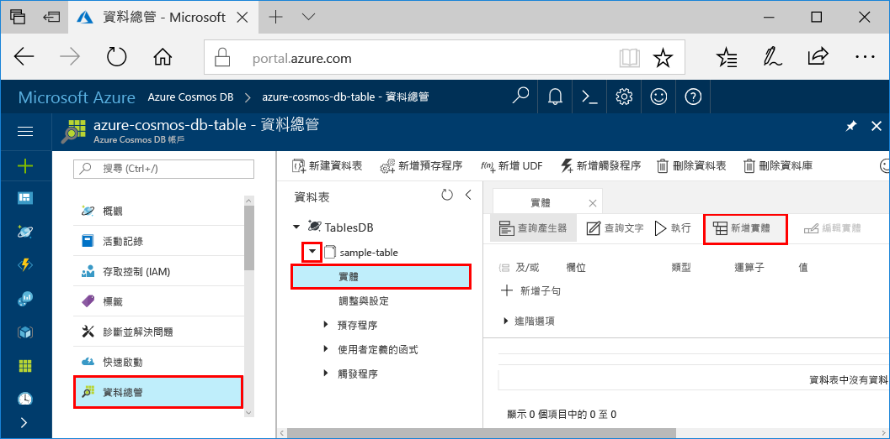

# <a name="azure-cosmos-db-build-a-net-application-using-hello-table-api"></a><span data-ttu-id="88d2c-103">Azure Cosmos DB： 建置使用 hello 表格 API 的.NET 應用程式</span><span class="sxs-lookup"><span data-stu-id="88d2c-103">Azure Cosmos DB: Build a .NET application using hello Table API</span></span>

<span data-ttu-id="88d2c-104">Azure Cosmos DB 是 Microsoft 的全域分散式多模型資料庫服務。</span><span class="sxs-lookup"><span data-stu-id="88d2c-104">Azure Cosmos DB is Microsoft’s globally distributed multi-model database service.</span></span> <span data-ttu-id="88d2c-105">您可以快速建立與查詢文件、 索引鍵/值，以及 graph 資料庫，全部都是從 hello 全域發佈和核心 Azure Cosmos DB hello 的水平縮放功能獲益。</span><span class="sxs-lookup"><span data-stu-id="88d2c-105">You can quickly create and query document, key/value, and graph databases, all of which benefit from hello global distribution and horizontal scale capabilities at hello core of Azure Cosmos DB.</span></span> 

<span data-ttu-id="88d2c-106">本快速入門示範如何 toocreate Azure Cosmos DB 帳戶，並建立該帳戶使用 hello Azure 入口網站內的資料表。</span><span class="sxs-lookup"><span data-stu-id="88d2c-106">This quick start demonstrates how toocreate an Azure Cosmos DB account, and create a table within that account using hello Azure portal.</span></span> <span data-ttu-id="88d2c-107">您將撰寫程式碼 tooinsert、 更新和刪除實體，然後執行一些查詢，使用新的 hello [Windows Azure 儲存體 Premium 資料表](https://aka.ms/premiumtablenuget)NuGet 封裝 （預覽）。</span><span class="sxs-lookup"><span data-stu-id="88d2c-107">You'll then write code tooinsert, update, and delete entities, and run some queries using hello new [Windows Azure Storage Premium Table](https://aka.ms/premiumtablenuget) (preview) package from NuGet.</span></span> <span data-ttu-id="88d2c-108">此媒體櫃具有 hello 相同的類別和方法簽章為 hello 公用[Windows Azure 儲存體 SDK](https://www.nuget.org/packages/WindowsAzure.Storage)，但也有 hello 能力 tooconnect tooAzure Cosmos DB 帳戶使用 hello[表格 API](table-introduction.md) （預覽）。</span><span class="sxs-lookup"><span data-stu-id="88d2c-108">This library has hello same classes and method signatures as hello public [Windows Azure Storage SDK](https://www.nuget.org/packages/WindowsAzure.Storage), but also has hello ability tooconnect tooAzure Cosmos DB accounts using hello [Table API](table-introduction.md) (preview).</span></span> 

## <a name="prerequisites"></a><span data-ttu-id="88d2c-109">必要條件</span><span class="sxs-lookup"><span data-stu-id="88d2c-109">Prerequisites</span></span>

<span data-ttu-id="88d2c-110">如果您還沒有安裝 Visual Studio 2017，您可以下載並使用 hello**可用** [Visual Studio 2017 Community Edition](https://www.visualstudio.com/downloads/)。</span><span class="sxs-lookup"><span data-stu-id="88d2c-110">If you don’t already have Visual Studio 2017 installed, you can download and use hello **free** [Visual Studio 2017 Community Edition](https://www.visualstudio.com/downloads/).</span></span> <span data-ttu-id="88d2c-111">請確定您啟用**Azure 開發**hello Visual Studio 安裝期間。</span><span class="sxs-lookup"><span data-stu-id="88d2c-111">Make sure that you enable **Azure development** during hello Visual Studio setup.</span></span>

[!INCLUDE [quickstarts-free-trial-note](../../includes/quickstarts-free-trial-note.md)]

## <a name="create-a-database-account"></a><span data-ttu-id="88d2c-112">建立資料庫帳戶</span><span class="sxs-lookup"><span data-stu-id="88d2c-112">Create a database account</span></span>

[!INCLUDE [cosmos-db-create-dbaccount-table](../../includes/cosmos-db-create-dbaccount-table.md)]

## <a name="add-a-table"></a><span data-ttu-id="88d2c-113">新增資料表</span><span class="sxs-lookup"><span data-stu-id="88d2c-113">Add a table</span></span>

[!INCLUDE [cosmos-db-create-table](../../includes/cosmos-db-create-table.md)]

## <a name="add-sample-data"></a><span data-ttu-id="88d2c-114">新增範例資料</span><span class="sxs-lookup"><span data-stu-id="88d2c-114">Add sample data</span></span>

<span data-ttu-id="88d2c-115">您現在可以新增資料 tooyour 新資料表使用資料檔案總管 （預覽）。</span><span class="sxs-lookup"><span data-stu-id="88d2c-115">You can now add data tooyour new table using Data Explorer (Preview).</span></span>

1. <span data-ttu-id="88d2c-116">在資料總管中，展開 **sample-table**，按一下 實體，然後按一下新增實體。</span><span class="sxs-lookup"><span data-stu-id="88d2c-116">In Data Explorer, expand **sample-table**, click **Entities**, and then click **Add Entity**.</span></span>

   
2. <span data-ttu-id="88d2c-118">現在加入資料 toohello PartitionKey 值 方塊和 RowKey 值 方塊中，並按一下**加入實體**。</span><span class="sxs-lookup"><span data-stu-id="88d2c-118">Now add data toohello PartitionKey value box and RowKey value box, and click **Add Entity**.</span></span>

   
  
    <span data-ttu-id="88d2c-120">您現在可以將多個實體 tooyour 資料表加入、 編輯您的實體，或查詢資料的資料總管。</span><span class="sxs-lookup"><span data-stu-id="88d2c-120">You can now add more entities tooyour table, edit your entities, or query your data in Data Explorer.</span></span> <span data-ttu-id="88d2c-121">資料總管也是您可以在此調整您的輸送量，並將預存程序、 使用者定義函數和觸發程序 tooyour 資料表。</span><span class="sxs-lookup"><span data-stu-id="88d2c-121">Data Explorer is also where you can scale your throughput and add stored procedures, user defined functions, and triggers tooyour table.</span></span>

## <a name="clone-hello-sample-application"></a><span data-ttu-id="88d2c-122">複製 hello 範例應用程式</span><span class="sxs-lookup"><span data-stu-id="88d2c-122">Clone hello sample application</span></span>

<span data-ttu-id="88d2c-123">現在讓我們來複製資料表中的應用程式 github 設定 hello 連接字串，並執行它。</span><span class="sxs-lookup"><span data-stu-id="88d2c-123">Now let's clone a Table app from github, set hello connection string, and run it.</span></span> <span data-ttu-id="88d2c-124">您會看到是多麼的輕鬆 toowork 資料以程式設計的方式。</span><span class="sxs-lookup"><span data-stu-id="88d2c-124">You'll see how easy it is toowork with data programmatically.</span></span> 

1. <span data-ttu-id="88d2c-125">開啟 git 終端機視窗，例如 git bash 和`cd`tooa 工作目錄。</span><span class="sxs-lookup"><span data-stu-id="88d2c-125">Open a git terminal window, such as git bash, and `cd` tooa working directory.</span></span>  

2. <span data-ttu-id="88d2c-126">執行下列命令 tooclone hello 範例儲存機制的 hello。</span><span class="sxs-lookup"><span data-stu-id="88d2c-126">Run hello following command tooclone hello sample repository.</span></span> 

    ```bash
    git clone https://github.com/Azure-Samples/azure-cosmos-db-table-dotnet-getting-started.git
    ```

3. <span data-ttu-id="88d2c-127">然後在 Visual Studio 中開啟 hello 方案檔。</span><span class="sxs-lookup"><span data-stu-id="88d2c-127">Then open hello solution file in Visual Studio.</span></span> 

## <a name="review-hello-code"></a><span data-ttu-id="88d2c-128">檢閱 hello 程式碼</span><span class="sxs-lookup"><span data-stu-id="88d2c-128">Review hello code</span></span>

<span data-ttu-id="88d2c-129">讓我們進行快速檢閱 hello 應用程式中的情況。</span><span class="sxs-lookup"><span data-stu-id="88d2c-129">Let's make a quick review of what's happening in hello app.</span></span> <span data-ttu-id="88d2c-130">開啟 hello Program.cs 檔案，而且您會發現這行程式碼建立 hello Azure Cosmos DB 資源。</span><span class="sxs-lookup"><span data-stu-id="88d2c-130">Open hello Program.cs file and you'll find that these lines of code create hello Azure Cosmos DB resources.</span></span> 

* <span data-ttu-id="88d2c-131">hello CloudTableClient 會初始化。</span><span class="sxs-lookup"><span data-stu-id="88d2c-131">hello CloudTableClient is initialized.</span></span>

    ```csharp
    CloudStorageAccount storageAccount = CloudStorageAccount.Parse(connectionString); 
    CloudTableClient tableClient = storageAccount.CreateCloudTableClient();
    ```

* <span data-ttu-id="88d2c-132">如果資料表不存在，將會建立資料表。</span><span class="sxs-lookup"><span data-stu-id="88d2c-132">A new table is created if it does not exist.</span></span>

    ```csharp
    CloudTable table = tableClient.GetTableReference("people");
    table.CreateIfNotExists();
    ```

* <span data-ttu-id="88d2c-133">已建立新的資料表容器。</span><span class="sxs-lookup"><span data-stu-id="88d2c-133">A new Table container is created.</span></span> <span data-ttu-id="88d2c-134">您會注意到此程式碼非常類似 tooregular Azure 資料表儲存體 SDK。</span><span class="sxs-lookup"><span data-stu-id="88d2c-134">You will notice this code very similar tooregular Azure Table storage SDK.</span></span> 

    ```csharp
    CustomerEntity item = new CustomerEntity()
                {
                    PartitionKey = Guid.NewGuid().ToString(),
                    RowKey = Guid.NewGuid().ToString(),
                    Email = $"{GetRandomString(6)}@contoso.com",
                    PhoneNumber = "425-555-0102",
                    Bio = GetRandomString(1000)
                };
    ```

## <a name="update-your-connection-string"></a><span data-ttu-id="88d2c-135">更新您的連接字串</span><span class="sxs-lookup"><span data-stu-id="88d2c-135">Update your connection string</span></span>

<span data-ttu-id="88d2c-136">現在我們將更新 hello 連接字串資訊，使您的應用程式可以彼此通訊 tooAzure Cosmos DB。</span><span class="sxs-lookup"><span data-stu-id="88d2c-136">Now we'll update hello connection string information so your app can talk tooAzure Cosmos DB.</span></span> 

1. <span data-ttu-id="88d2c-137">在 Visual Studio 中，開啟 hello app.config 檔案。</span><span class="sxs-lookup"><span data-stu-id="88d2c-137">In Visual Studio, open hello app.config file.</span></span> 

2. <span data-ttu-id="88d2c-138">在 hello [Azure 入口網站](http://portal.azure.com/)，請在 hello Azure Cosmos DB 左導覽功能表中按一下**連接字串**。</span><span class="sxs-lookup"><span data-stu-id="88d2c-138">In hello [Azure portal](http://portal.azure.com/), in hello Azure Cosmos DB left navigation menu, click **Connection String**.</span></span> <span data-ttu-id="88d2c-139">然後在 hello 新窗格中按一下針對 hello 的連接字串 hello [複製] 按鈕。</span><span class="sxs-lookup"><span data-stu-id="88d2c-139">Then in hello new pane click hello copy button for hello connection string.</span></span> 

    

3. <span data-ttu-id="88d2c-141">Hello 值貼到 hello app.config 檔案，做為 hello PremiumStorageConnectionString hello 值。</span><span class="sxs-lookup"><span data-stu-id="88d2c-141">Paste hello value into hello app.config file as hello value of hello PremiumStorageConnectionString.</span></span> 

    `<add key="PremiumStorageConnectionString" 
        value="DefaultEndpointsProtocol=https;AccountName=MYSTORAGEACCOUNT;AccountKey=AUTHKEY;TableEndpoint=https://COSMOSDB.documents.azure.com" />`    

    <span data-ttu-id="88d2c-142">您可以保留 hello StandardStorageConnectionString 原狀。</span><span class="sxs-lookup"><span data-stu-id="88d2c-142">You can leave hello StandardStorageConnectionString as is.</span></span>

<span data-ttu-id="88d2c-143">您現在已更新您的應用程式與它需要與 Azure Cosmos DB toocommunicate 所有 hello 資訊。</span><span class="sxs-lookup"><span data-stu-id="88d2c-143">You've now updated your app with all hello info it needs toocommunicate with Azure Cosmos DB.</span></span> 

## <a name="run-hello-web-app"></a><span data-ttu-id="88d2c-144">執行 hello web 應用程式</span><span class="sxs-lookup"><span data-stu-id="88d2c-144">Run hello web app</span></span>

1. <span data-ttu-id="88d2c-145">在 Visual Studio 中，以滑鼠右鍵按一下 hello **PremiumTableGetStarted**專案中**方案總管 中**，然後按一下**管理 NuGet 封裝**。</span><span class="sxs-lookup"><span data-stu-id="88d2c-145">In Visual Studio, right-click on hello **PremiumTableGetStarted** project in **Solution Explorer** and then click **Manage NuGet Packages**.</span></span> 

2. <span data-ttu-id="88d2c-146">在 hello NuGet**瀏覽**方塊中，輸入*WindowsAzure.Storage PremiumTable*。</span><span class="sxs-lookup"><span data-stu-id="88d2c-146">In hello NuGet **Browse** box, type *WindowsAzure.Storage-PremiumTable*.</span></span>

3. <span data-ttu-id="88d2c-147">檢查 hello**包含發行前版本**方塊。</span><span class="sxs-lookup"><span data-stu-id="88d2c-147">Check hello **Include prerelease** box.</span></span> 

4. <span data-ttu-id="88d2c-148">從 hello 結果中，安裝 hello **WindowsAzure.Storage PremiumTable**程式庫。</span><span class="sxs-lookup"><span data-stu-id="88d2c-148">From hello results, install hello **WindowsAzure.Storage-PremiumTable** library.</span></span> <span data-ttu-id="88d2c-149">這會安裝 hello 預覽 Azure Cosmos DB 資料表 API 套件，以及所有相依性。</span><span class="sxs-lookup"><span data-stu-id="88d2c-149">This installs hello preview Azure Cosmos DB Table API package as well as all dependencies.</span></span> <span data-ttu-id="88d2c-150">請注意，這不同於 hello Windows Azure 儲存體套件使用的 Azure 資料表儲存體 NuGet 封裝。</span><span class="sxs-lookup"><span data-stu-id="88d2c-150">Note that this is a different NuGet package than hello Windows Azure Storage package used by Azure Table storage.</span></span> 

5. <span data-ttu-id="88d2c-151">按一下 CTRL + F5 toorun hello 應用程式。</span><span class="sxs-lookup"><span data-stu-id="88d2c-151">Click CTRL + F5 toorun hello application.</span></span>

    <span data-ttu-id="88d2c-152">hello 主控台視窗會顯示 hello 資料加入、 擷取、 查詢、 取代和 hello 資料表中刪除。</span><span class="sxs-lookup"><span data-stu-id="88d2c-152">hello console window displays hello data being added, retrieved, queried, replaced and deleted from hello table.</span></span> <span data-ttu-id="88d2c-153">Hello 指令碼完成時，請按任何鍵 tooclose hello 主控台視窗。</span><span class="sxs-lookup"><span data-stu-id="88d2c-153">When hello script completes, press any key tooclose hello console window.</span></span> 
    
    

6. <span data-ttu-id="88d2c-155">如果您想 toosee hello 新中的實體資料總管 中，只是標記為註解中程式碼行 188 208 program.cs，因此這些檔案不刪除，然後再次執行 hello 範例。</span><span class="sxs-lookup"><span data-stu-id="88d2c-155">If you want toosee hello new entities in Data Explorer, just comment out lines 188-208 in program.cs so they aren't deleted, then run hello sample again.</span></span> 

    <span data-ttu-id="88d2c-156">您現在可以移回 tooData 總管 中，按一下 **重新整理**，依序展開 hello**人員**資料表，並按一下**實體**，，然後使用這項新資料。</span><span class="sxs-lookup"><span data-stu-id="88d2c-156">You can now go back tooData Explorer, click **Refresh**, expand hello **people** table and click **Entities**, and then work with this new data.</span></span> 

    

## <a name="review-slas-in-hello-azure-portal"></a><span data-ttu-id="88d2c-158">在 hello Azure 入口網站中檢視 Sla</span><span class="sxs-lookup"><span data-stu-id="88d2c-158">Review SLAs in hello Azure portal</span></span>

[!INCLUDE [cosmosdb-tutorial-review-slas](../../includes/cosmos-db-tutorial-review-slas.md)]

## <a name="clean-up-resources"></a><span data-ttu-id="88d2c-159">清除資源</span><span class="sxs-lookup"><span data-stu-id="88d2c-159">Clean up resources</span></span>

<span data-ttu-id="88d2c-160">如果您不打算 toocontinue toouse 此應用程式，刪除所有資源本快速入門以建立 hello Azure 入口網站以 hello 下列步驟：</span><span class="sxs-lookup"><span data-stu-id="88d2c-160">If you're not going toocontinue toouse this app, delete all resources created by this quickstart in hello Azure portal with hello following steps:</span></span> 

1. <span data-ttu-id="88d2c-161">Hello Azure 入口網站中的 hello 左側功能表中按一下**資源群組**，然後按一下您所建立的 hello 資源的 hello 名稱。</span><span class="sxs-lookup"><span data-stu-id="88d2c-161">From hello left-hand menu in hello Azure portal, click **Resource groups** and then click hello name of hello resource you created.</span></span> 
2. <span data-ttu-id="88d2c-162">在資源群組頁面上，按一下 **刪除**，在 hello 文字方塊中，輸入 hello 資源 toodelete hello 名稱，然後按一下**刪除**。</span><span class="sxs-lookup"><span data-stu-id="88d2c-162">On your resource group page, click **Delete**, type hello name of hello resource toodelete in hello text box, and then click **Delete**.</span></span>

## <a name="next-steps"></a><span data-ttu-id="88d2c-163">後續步驟</span><span class="sxs-lookup"><span data-stu-id="88d2c-163">Next steps</span></span>

<span data-ttu-id="88d2c-164">本快速入門中，您學到如何 toocreate Azure Cosmos DB 帳戶，建立使用 hello 資料總管 中，資料表及執行應用程式。</span><span class="sxs-lookup"><span data-stu-id="88d2c-164">In this quickstart, you've learned how toocreate an Azure Cosmos DB account, create a table using hello Data Explorer, and run an app.</span></span>  <span data-ttu-id="88d2c-165">現在您可以查詢資料，可使用 hello 表格 API。</span><span class="sxs-lookup"><span data-stu-id="88d2c-165">Now you can query your data using hello Table API.</span></span>  

> [!div class="nextstepaction"]
> [<span data-ttu-id="88d2c-166">查詢使用 hello 表格 API</span><span class="sxs-lookup"><span data-stu-id="88d2c-166">Query using hello Table API</span></span>](tutorial-query-table.md)

