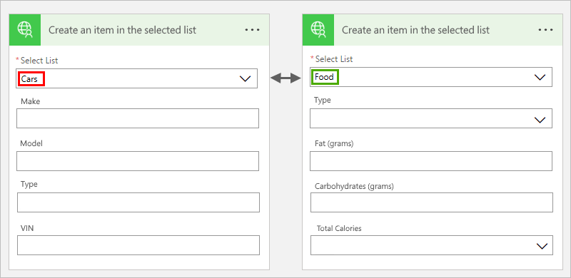

# <a name="extend-your-custom-connectors-openapi-with-advanced-functionality"></a>以進階功能擴充您自訂連接器的 OpenAPI

若要為 Azure Logic Apps、Microsoft Flow 或 Microsoft PowerApps 建立自訂連接器，您必須提供 OpenAPI 定義檔，這是一個非特定語言專屬的機器可讀文件，用來描述 API 作業與參數。 除了 OpenAPI 的現成功能之外，為 Logic Apps 和 Flow 建立自訂連接器時，您也可以包含下列這些 OpenAPI 擴充功能：

* [`summary`](#summary)
* [`x-ms-summary`](#x-ms-summary)
* [`description`](#description)
* [`x-ms-visibility`](#x-ms-visibility)
* [`x-ms-dynamic-values`](#x-ms-dynamic-values)
* [`x-ms-dynamic-schema`](#x-ms-dynamic-schema)

以下是有關這些擴充功能的更多詳細資料：

<a name="summary"></a>

## <a name="summary"></a>summary

指定動作 (作業) 的標題。 </br>
適用於：作業 </br>
建議：針對 `summary` 使用「句首大寫」。 </br>
範例："When an event is added to calendar" 或 "Send an email"


``` json
"actions" {
  "Send_an_email": {
    /// Other action properties here...
    "summary": "Send an email",
    /// Other action properties here...
  }
},
```

<a name="x-ms-summary"></a>

## <a name="x-ms-summary"></a>x-ms-summary

指定實體的標題。 </br>
適用於：參數、回應結構描述 </br>
建議：針對 `x-ms-summary` 使用「字首大寫」。 </br>
範例："Calendar ID"、"Subject"、"Event Description" 等


``` json
"actions" {
  "Send_an_email": {
    /// Other action properties here...
    "parameters": [ 
      {
        /// Other parameters here...
        "x-ms-summary": "Subject",
        /// Other parameters here...
      }
    ]
  }
},
```

<a name="description"></a>

## <a name="description"></a>說明

指定有關作業之功能或實體之格式與函式的詳細說明。 </br>
適用於：作業、參數、回應結構描述 </br>
建議：針對 `description` 使用「句首大寫」。 </br>
範例："This operation triggers when a new event is added to the calendar"、"Specify the subject of the mail" 等


``` json
"actions" {
  "Send_an_email": {
     "description": "Specify the subject of the mail",
     /// Other action properties here...
  }
},
```

<a name="visibility"></a>

## <a name="x-ms-visibility"></a>x-ms-visibility

指定使用者面對實體時的可見性。 </br>
可能的值：`important`、`advanced`及 `internal` </br>
適用於：作業、參數、結構描述

* `important` 作業和參數一律會優先對使用者顯示。
* `advanced` 作業和參數會隱藏在額外的功能表底下。
* `internal` 作業和參數不會對使用者顯示。

> [!NOTE] 
> 針對 `internal` 和 `required` 參數，您**必須**為這些參數提供預設值。

範例：[查看更多] 功能表及 [顯示進階選項] 功能表會隱藏 `advanced` 作業和參數。


``` json
"actions" {
  "Send_an_email": {
     /// Other action properties here...
     "parameters": [
         {
           "name": "Subject",
           "type": "string",
           "description": "Specify the subject of the mail",
           "x-ms-summary": "Subject",
           "x-ms-visibility": "important",
           /// Other parameter properties here...
         }
     ]
     /// Other action properties here...
  }
},
```

<a name="x-ms-dynamic-values"></a>

## <a name="x-ms-dynamic-values"></a>x-ms-dynamic-values

為使用者顯示已填入資訊的清單，以便他們選取作業的輸入參數。 </br>
適用於：參數 </br>
使用方式：將 `x-ms-dynamic-values` 物件新增到參數的定義中。 例如，請參閱這個 [OpenAPI 範例](https://procsi.blob.core.windows.net/blog-images/sampleDynamicSwagger.json)。


### <a name="properties-for-x-ms-dynamic-values"></a>x-ms-dynamic-values 的屬性

| 名稱 | 必要或選用 | 說明 | 
| ---- | -------------------- | ----------- | 
| **operationID** | 必要 | 填入清單時所要呼叫的作業 | 
| **value-path** | 必要 | `value-collection` 內的物件中參考參數值的路徑字串。 </br>如果未指定 `value-collection`，就會以陣列形式來評估回應。 | 
| **value-title** | 選用 | `value-collection` 內的物件中參考值描述的路徑字串。 </br>如果未指定 `value-collection`，就會以陣列形式來評估回應。 | 
| **value-collection** | 選用 | 在回應承載中評估為物件陣列的路徑字串 | 
| **參數** | 選用 | 一個物件，其屬性會指定叫用 dynamic-values 作業時所需的輸入參數 | 
|||| 

以下是一個說明 `x-ms-dynamic-values` 中屬性的範例：

``` json
"x-ms-dynamic-values": {
  "operationId": "PopulateDropdown",
  "value-path": "name",
  "value-title": "properties/displayName",
  "value-collection": "value",
  "parameters": {
     "staticParameter": "<value>",
     "dynamicParameter": {
        "parameter": "<value-to-pass-to-dynamicParameter>"
     }
  }
}
```

## <a name="example-all-the-openapi-extensions-up-to-this-point"></a>範例：到目前為止的所有 OpenAPI 擴充功能

``` json
"/api/lists/{listID-dynamic}": {
    "get": {
        "description": "Get items from a single list - uses dynamic values and outputs dynamic schema",
        "summary": "Gets items from the selected list",
        "operationID": "GetListItems",
        "parameters": [
           {
             "name": "listID-dynamic",
             "type": "string",
             "in": "path",
             "description": "Select the list from where you want outputs",
             "required": true,
             "x-ms-summary": "Select List",
             "x-ms-dynamic-values": {
                "operationID": "GetLists",
                "value-path": "id",
                "value-title": "name"
             }
           }
        ]
    }
}
```

<a name="x-ms-dynamic schema"></a>

## <a name="x-ms-dynamic-schema"></a>x-ms-dynamic-schema

指出目前參數或回應的結構描述是動態的。 此物件可以叫用此欄位的值所定義的作業、動態探索結構描述，以及顯示適當的 UI 來收集使用者輸入或顯示可用的欄位。 

適用於：參數、回應

使用方式：將 `x-ms-dynamic-schema` 物件新增到要求參數或回應本文定義中。 例如，請參閱這個 [OpenAPI 範例](https://procsi.blob.core.windows.net/blog-images/sampleDynamicSwagger.json)。

此範例說明輸入表單如何依據使用者從下拉式清單中選取的項目發生變更：



而以下範例則顯示輸出如何依據使用者從下拉式清單中選取的項目發生變更。 在此版本中，使用者選取了 [Cars]：

![所選項目 [Cars] 的 "x-ms-dynamic-schema-response"](./media/custom-connector-openapi-extensions/x-ms-dynamic-schema-output1.png)

在此版本中，使用者選取了 [Food]：

![所選項目 [Food] 的 "x-ms-dynamic-schema-response"](./media/custom-connector-openapi-extensions/x-ms-dynamic-schema-output2.png)

### <a name="properties-for-x-ms-dynamic-schema"></a>x-ms-dynamic-schema 的屬性

| 名稱 | 必要或選用 | 說明 | 
| ---- | -------------------- | ----------- | 
| **operationID** | 必要 | 擷取結構描述時所要呼叫的作業 | 
| **參數** | 必要 | 一個物件，其屬性會指定叫用 dynamic-schema 作業時所需的輸入參數 | 
| **value-path** |選用 | 參考具有結構描述之屬性的路徑字串。 </br>如果未指定，系統就會假設回應之根物件的屬性中包含結構描述。 | 
|||| 

以下是一個動態參數的範例：

``` json
{
  "name": "dynamicListSchema",
  "in": "body",
  "description": "Dynamic schema for items in the selected list",
  "schema": {
    "type": "object",
    "x-ms-dynamic-schema": {
        "operationID": "GetListSchema",
        "parameters": {
          "listID": {
            "parameter": "listID-dynamic"
          }
        },
        "value-path": "items"
    }
  }
}
```

以下是一個動態回應的範例：

``` json
"DynamicResponseGetListSchema": {
   "type": "object",
   "x-ms-dynamic-schema": {
      "operationID": "GetListSchema",
      "parameters": {
         "listID": {
            "parameter": "listID-dynamic"
         }
      },
      "value-path": "items"
    }
}
```

## <a name="next-steps"></a>後續步驟

* [描述您的自訂 API 和連接器](../logic-apps/custom-connector-api-postman-collection.md)
* [Logic Apps：註冊您的連接器](../logic-apps/logic-apps-custom-connector-register.md)
* [Flow：註冊您的連接器](https://ms.flow.microsoft.com/documentation/register-custom-api/#register-your-custom-connector)