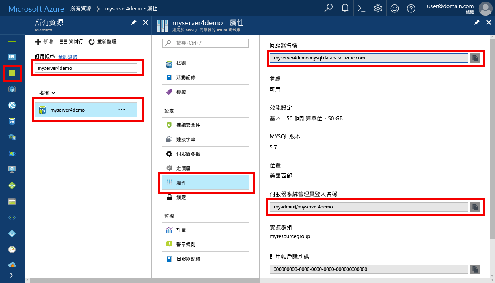

# <a name="migrate-your-mysql-database-to-azure-database-for-mysql-using-dump-and-restore"></a><span data-ttu-id="1daab-103">使用傾印和還原來將 MySQL 資料庫移轉至適用於 MySQL 的 Azure 資料庫</span><span class="sxs-lookup"><span data-stu-id="1daab-103">Migrate your MySQL database to Azure Database for MySQL using dump and restore</span></span>
<span data-ttu-id="1daab-104">本文將說明兩個常見方法，讓您可在適用於 MySQL 的 Azure 資料庫中用來備份和還原資料庫</span><span class="sxs-lookup"><span data-stu-id="1daab-104">This article explains two common ways to back up and restore databases in your Azure Database for MySQL</span></span>
- <span data-ttu-id="1daab-105">從命令列傾印和還原 (使用 mysqldump)</span><span class="sxs-lookup"><span data-stu-id="1daab-105">Dump and restore from the command-line (using mysqldump)</span></span> 
- <span data-ttu-id="1daab-106">使用 PHPMyAdmin 傾印和還原</span><span class="sxs-lookup"><span data-stu-id="1daab-106">Dump and restore using PHPMyAdmin</span></span> 

## <a name="before-you-begin"></a><span data-ttu-id="1daab-107">開始之前</span><span class="sxs-lookup"><span data-stu-id="1daab-107">Before you begin</span></span>
<span data-ttu-id="1daab-108">若要逐步執行本作法指南，您需要具備：</span><span class="sxs-lookup"><span data-stu-id="1daab-108">To step through this how-to guide, you need to have:</span></span>
- [<span data-ttu-id="1daab-109">建立適用於 MySQL 的 Azure 資料庫伺服器 - Azure 入口網站</span><span class="sxs-lookup"><span data-stu-id="1daab-109">Create Azure Database for MySQL server - Azure portal</span></span>](quickstart-create-mysql-server-database-using-azure-portal.md)
- <span data-ttu-id="1daab-110">已安裝於電腦上的 [mysqldump](https://dev.mysql.com/doc/refman/5.7/en/mysqldump.html) 命令列公用程式。</span><span class="sxs-lookup"><span data-stu-id="1daab-110">[mysqldump](https://dev.mysql.com/doc/refman/5.7/en/mysqldump.html) command-line utility installed on a machine.</span></span>
- <span data-ttu-id="1daab-111">MySQL Workbench [MySQL Workbench 下載](https://dev.mysql.com/downloads/workbench/)、Toad、Navicat 或用來執行傾印和還原命令的其他第三方 MySQL 工具。</span><span class="sxs-lookup"><span data-stu-id="1daab-111">MySQL Workbench [MySQL Workbench Download](https://dev.mysql.com/downloads/workbench/), Toad, Navicat, or other third-party MySQL tool to do dump and restore commands.</span></span>

## <a name="use-common-tools"></a><span data-ttu-id="1daab-112">使用一般工具</span><span class="sxs-lookup"><span data-stu-id="1daab-112">Use common tools</span></span>
<span data-ttu-id="1daab-113">使用一般公用程式和工具 (例如 MySQL Workbench、mysqldump、Toad 或 Navicat) 從遠端連線，然後將資料還原至適用於 MySQL 的 Azure 資料庫。</span><span class="sxs-lookup"><span data-stu-id="1daab-113">Use common utilities and tools such as MySQL Workbench, mysqldump, Toad, or Navicat to remotely connect and restore data into Azure Database for MySQL.</span></span> <span data-ttu-id="1daab-114">在具有網際網路連接的用戶端電腦上使用這類工具，來連接到適用於 MySQL 的 Azure 資料庫。</span><span class="sxs-lookup"><span data-stu-id="1daab-114">Use such tools on your client machine with an internet connection to connect to the Azure Database for MySQL.</span></span> <span data-ttu-id="1daab-115">如需使用 SSL 加密連接的最佳安全性作法，請參閱[在適用於 MySQL 的 Azure 資料庫中設定 SSL 連線能力](concepts-ssl-connection-security.md)。</span><span class="sxs-lookup"><span data-stu-id="1daab-115">Use an SSL encrypted connection for best security practices, see also [Configure SSL connectivity in Azure Database for MySQL](concepts-ssl-connection-security.md).</span></span> <span data-ttu-id="1daab-116">在移轉到適用於 MySQL 的 Azure 資料庫時，您不需要將傾印檔案移至任何特定的雲端位置。</span><span class="sxs-lookup"><span data-stu-id="1daab-116">You do not need to move the dump files to any special cloud location when migrating to Azure Database for MySQL.</span></span> 

## <a name="common-uses-for-dump-and-restore"></a><span data-ttu-id="1daab-117">傾印和還原的常見用途</span><span class="sxs-lookup"><span data-stu-id="1daab-117">Common uses for dump and restore</span></span>
<span data-ttu-id="1daab-118">您可以在數個常見案例中使用 MySQL 公用程式 (例如 mysqldump 和 mysqlpump)，將資料庫傾印和載入至 Azure MySQL Database。</span><span class="sxs-lookup"><span data-stu-id="1daab-118">You may use MySQL utilities such as mysqldump and mysqlpump to dump and load databases into an Azure MySQL Database in several common scenarios.</span></span> <span data-ttu-id="1daab-119">在其他案例中，您可以改為使用[匯入和匯出](concepts-migrate-import-export.md)方法。</span><span class="sxs-lookup"><span data-stu-id="1daab-119">In other scenarios, you may use the [Import and Export](concepts-migrate-import-export.md) approach instead.</span></span>

- <span data-ttu-id="1daab-120">當您移轉整個資料庫時，使用資料庫傾印。</span><span class="sxs-lookup"><span data-stu-id="1daab-120">Use database dumps when you are migrating the entire database.</span></span> <span data-ttu-id="1daab-121">這項建議在您移動大量 MySQL 資料，或當您想要將即時網站或應用程式的服務中斷時間降到最低時會保留。</span><span class="sxs-lookup"><span data-stu-id="1daab-121">This recommendation holds when moving a large amount of MySQL data, or when you want to minimize service interruption for live sites or applications.</span></span> 
-  <span data-ttu-id="1daab-122">將資料載入至適用於 MySQL 的 Azure 資料庫時，請確定資料庫中的所有資料表都使用 InnoDB 儲存引擎。</span><span class="sxs-lookup"><span data-stu-id="1daab-122">Make sure all tables in the database use the InnoDB storage engine when loading data into Azure Database for MySQL.</span></span> <span data-ttu-id="1daab-123">適用於 MySQL 的 Azure 資料庫僅支援 InnoDB 儲存引擎，因此不支援其他儲存引擎。</span><span class="sxs-lookup"><span data-stu-id="1daab-123">Azure Database for MySQL supports only InnoDB Storage engine, and therefore does not support alternative storage engines.</span></span> <span data-ttu-id="1daab-124">如果您的資料表是使用其他儲存引擎設定，請將它們轉換成 InnoDB 引擎格式，然後再移轉至適用於 MySQL 的 Azure 資料庫。</span><span class="sxs-lookup"><span data-stu-id="1daab-124">If your tables are configured with other storage engines, convert them into the InnoDB engine format before migration to Azure Database for MySQL.</span></span>
   <span data-ttu-id="1daab-125">例如，如果您的 WordPress 或 WebApp 使用 MyISAM 資料表，請先藉由移轉至 InnoDB 格式來轉換這些資料表，然後再還原至適用於 MySQL 的 Azure 資料庫。</span><span class="sxs-lookup"><span data-stu-id="1daab-125">For example, if you have a WordPress or WebApp using the MyISAM tables, first convert those tables by migrating into InnoDB format before restoring to Azure Database for MySQL.</span></span> <span data-ttu-id="1daab-126">使用子句 `ENGINE=InnoDB` 以設定建立新資料表時使用的引擎，然後在還原之前將資料傳送到相容的資料表。</span><span class="sxs-lookup"><span data-stu-id="1daab-126">Use the clause `ENGINE=InnoDB` to set the engine used when creating a new table, then transfer the data into the compatible table before the restore.</span></span> 

   ```sql
   INSERT INTO innodb_table SELECT * FROM myisam_table ORDER BY primary_key_columns
   ```
- <span data-ttu-id="1daab-127">若要避免任何相容性問題，請確定當傾印資料庫時，在來源和目的地系統上使用相同版本的 MySQL。</span><span class="sxs-lookup"><span data-stu-id="1daab-127">To avoid any compatibility issues, ensure the same version of MySQL is used on the source and destination systems when dumping databases.</span></span> <span data-ttu-id="1daab-128">例如，如果現有的 MySQL 伺服器是 5.7 版，則您應該將適用於 MySQL 的 Azure 資料庫設定為執行 5.7 版。</span><span class="sxs-lookup"><span data-stu-id="1daab-128">For example, if your existing MySQL server is version 5.7, then you should migrate to Azure Database for MySQL configured to run version 5.7.</span></span> <span data-ttu-id="1daab-129">`mysql_upgrade` 命令在適用於 MySQL 伺服器的 Azure 資料庫中無法運作，因此並不支援。</span><span class="sxs-lookup"><span data-stu-id="1daab-129">The `mysql_upgrade` command does not function in an Azure Database for MySQL server, and is not supported.</span></span> <span data-ttu-id="1daab-130">如果您要在 MySQL 版本之間升級，請先將較低版本的資料庫傾印或匯出到自己環境中較高版本的 MySQL。</span><span class="sxs-lookup"><span data-stu-id="1daab-130">If you need to upgrade across MySQL versions, first dump or export your lower version database into a higher version of MySQL in your own environment.</span></span> <span data-ttu-id="1daab-131">然後執行 `mysql_upgrade`，之後再嘗試移轉至適用於 MySQL 的 Azure 資料庫。</span><span class="sxs-lookup"><span data-stu-id="1daab-131">Then run `mysql_upgrade`, before attempting migration into an Azure Database for MySQL.</span></span>

## <a name="performance-considerations"></a><span data-ttu-id="1daab-132">效能考量</span><span class="sxs-lookup"><span data-stu-id="1daab-132">Performance considerations</span></span>
<span data-ttu-id="1daab-133">若要最佳化效能，請在傾印大型資料庫時注意這些考量：</span><span class="sxs-lookup"><span data-stu-id="1daab-133">To optimize performance, take notice of these considerations when dumping large databases:</span></span>
-   <span data-ttu-id="1daab-134">傾印資料庫時在 mysqldump 中使用 `exclude-triggers` 選項。</span><span class="sxs-lookup"><span data-stu-id="1daab-134">Use the `exclude-triggers` option in mysqldump when dumping databases.</span></span> <span data-ttu-id="1daab-135">從傾印檔案排除觸發程序以避免在資料還原期間引發觸發程序命令。</span><span class="sxs-lookup"><span data-stu-id="1daab-135">Exclude triggers from dump files to avoid the trigger commands firing during the data restore.</span></span> 
-   <span data-ttu-id="1daab-136">避免在傾印非常大型的資料庫時於 mysqldump 中使用 `single-transaction` 選項。</span><span class="sxs-lookup"><span data-stu-id="1daab-136">Avoid the `single-transaction` option in mysqldump when dumping very large databases.</span></span> <span data-ttu-id="1daab-137">在單一交易中傾印許多資料表會導致在還原期間耗用額外儲存體和記憶體資源，並且可能導致效能延遲或資源限制式。</span><span class="sxs-lookup"><span data-stu-id="1daab-137">Dumping many tables within a single transaction causes extra storage and memory resources to be consumed during restore and may cause performance delays or resource constraints.</span></span>
-   <span data-ttu-id="1daab-138">以 SQL 載入時使用多重值插入，以將傾印資料庫時的陳述式執行額外負荷降到最低。</span><span class="sxs-lookup"><span data-stu-id="1daab-138">Use multi-value inserts when loading with SQL to minimize statement execution overhead when dumping databases.</span></span> <span data-ttu-id="1daab-139">使用 mysqldump 公用程式所產生的傾印檔案時，預設會啟用多重值插入。</span><span class="sxs-lookup"><span data-stu-id="1daab-139">When using dump files generated by mysqldump utility, multi-value inserts are enabled by default.</span></span> 
-  <span data-ttu-id="1daab-140">傾印資料庫時在 mysqldump 中使用 `order-by-primary` 選項，以便將資料以主索引鍵的順序編寫指令碼。</span><span class="sxs-lookup"><span data-stu-id="1daab-140">Use the `order-by-primary` option in mysqldump when dumping databases, so that the data is scripted in primary key order.</span></span>
-   <span data-ttu-id="1daab-141">傾印資料時在 mysqldump 中使用 `disable-keys` 選項，以在載入之前停用外部索引鍵限制式。</span><span class="sxs-lookup"><span data-stu-id="1daab-141">Use the `disable-keys` option in mysqldump when dumping data, to disable foreign key constraints before load.</span></span> <span data-ttu-id="1daab-142">停用外部索引鍵檢查會提供效能提升。</span><span class="sxs-lookup"><span data-stu-id="1daab-142">Disabling foreign key checks provides performance gains.</span></span> <span data-ttu-id="1daab-143">啟用限制式並且確認載入之後的資料，以確保參考完整性。</span><span class="sxs-lookup"><span data-stu-id="1daab-143">Enable the constraints and verify the data after the load to ensure referential integrity.</span></span>
-   <span data-ttu-id="1daab-144">適當時使用資料分割資料表。</span><span class="sxs-lookup"><span data-stu-id="1daab-144">Use partitioned tables when appropriate.</span></span>
-   <span data-ttu-id="1daab-145">平行載入資料。</span><span class="sxs-lookup"><span data-stu-id="1daab-145">Load data in parallel.</span></span> <span data-ttu-id="1daab-146">避免會導致您達到資源限制的太多平行處理原則，以及使用 Azure 入口網站中可用的計量監視資源。</span><span class="sxs-lookup"><span data-stu-id="1daab-146">Avoid too much parallelism that would cause you to hit a resource limit, and monitor resources using the metrics available in the Azure portal.</span></span> 
-   <span data-ttu-id="1daab-147">傾印資料庫時在 mysqlpump 中使用 `defer-table-indexes` 選項，以便在載入資料表資料之後建立索引。</span><span class="sxs-lookup"><span data-stu-id="1daab-147">Use the `defer-table-indexes` option in mysqlpump when dumping databases, so that index creation happens after tables data is loaded.</span></span>

## <a name="create-a-backup-file-from-the-command-line-using-mysqldump"></a><span data-ttu-id="1daab-148">使用 mysqldump 從命令列建立備份檔案</span><span class="sxs-lookup"><span data-stu-id="1daab-148">Create a backup file from the command-line using mysqldump</span></span>
<span data-ttu-id="1daab-149">若要在本機內部部署伺服器或虛擬機器中備份現有的 MySQL 資料庫，請執行下列命令：</span><span class="sxs-lookup"><span data-stu-id="1daab-149">To back up an existing MySQL database on the local on-premises server or in a virtual machine, run the following command:</span></span> 
```bash
$ mysqldump --opt -u [uname] -p[pass] [dbname] > [backupfile.sql]
```

<span data-ttu-id="1daab-150">提供的參數如下：</span><span class="sxs-lookup"><span data-stu-id="1daab-150">The parameters to provide are:</span></span>
- <span data-ttu-id="1daab-151">[uname] 您的資料庫使用者名稱</span><span class="sxs-lookup"><span data-stu-id="1daab-151">[uname] Your database username</span></span> 
- <span data-ttu-id="1daab-152">[pass] 您的資料庫密碼 (請注意 -p 與密碼之間沒有空格)</span><span class="sxs-lookup"><span data-stu-id="1daab-152">[pass] The password for your database (note there is no space between -p and the password)</span></span> 
- <span data-ttu-id="1daab-153">[dbname] 您的資料庫名稱</span><span class="sxs-lookup"><span data-stu-id="1daab-153">[dbname] The name of your database</span></span> 
- <span data-ttu-id="1daab-154">[backupfile.sql] 資料庫備份的檔案名稱</span><span class="sxs-lookup"><span data-stu-id="1daab-154">[backupfile.sql] The filename for your database backup</span></span> 
- <span data-ttu-id="1daab-155">[--opt] mysqldump 選項</span><span class="sxs-lookup"><span data-stu-id="1daab-155">[--opt] The mysqldump option</span></span> 

<span data-ttu-id="1daab-156">例如，若要將 MySQL 伺服器上使用者名稱為 'testuser' 且無密碼之名為 'testdb' 的資料庫備份到 testdb_backup.sql 檔案，請使用下列命令。</span><span class="sxs-lookup"><span data-stu-id="1daab-156">For example, to back up a database named 'testdb' on your MySQL server with the username 'testuser' and with no password to a file testdb_backup.sql, use the following command.</span></span> <span data-ttu-id="1daab-157">此命令會將 `testdb` 資料庫備份至名為 `testdb_backup.sql` 的檔案，其中包含重新建立資料庫所需的所有 SQL 陳述式。</span><span class="sxs-lookup"><span data-stu-id="1daab-157">The command backs up the `testdb` database into a file called `testdb_backup.sql`, which contains all the SQL statements needed to re-create the database.</span></span> 

```bash
$ mysqldump -u root -p testdb > testdb_backup.sql
```
<span data-ttu-id="1daab-158">若要在資料庫中選取要備份的特定資料表，請列出以空格分隔的資料表名稱。</span><span class="sxs-lookup"><span data-stu-id="1daab-158">To select specific tables in your database to back up, list the table names separated by spaces.</span></span> <span data-ttu-id="1daab-159">例如，如果只要從 'testdb' 備份 table1 和 table2 資料表，請遵循下列範例：</span><span class="sxs-lookup"><span data-stu-id="1daab-159">For example, to back up only table1 and table2 tables from the 'testdb', follow this example:</span></span> 
```bash
$ mysqldump -u root -p testdb table1 table2 > testdb_tables_backup.sql
```

<span data-ttu-id="1daab-160">若要一次備份多個資料庫，請使用 --database 參數，並列出以空格分隔的資料庫名稱。</span><span class="sxs-lookup"><span data-stu-id="1daab-160">To back up more than one database at once, use the --database switch and list the database names separated by spaces.</span></span> 
```bash
$ mysqldump -u root -p --databases testdb1 testdb3 testdb5 > testdb135_backup.sql 
```
<span data-ttu-id="1daab-161">若要一次備份伺服器中的所有資料庫，您應該使用 --all-databases 選項。</span><span class="sxs-lookup"><span data-stu-id="1daab-161">To back up all the databases in the server at one time, you should use the --all-databases option.</span></span>
```
$ mysqldump -u root -p --all-databases > alldb_backup.sql 
```

## <a name="create-a-database-on-the-target-azure-database-for-mysql-server"></a><span data-ttu-id="1daab-162">在目標適用於 MySQL 伺服器的 Azure 資料庫上建立資料庫</span><span class="sxs-lookup"><span data-stu-id="1daab-162">Create a database on the target Azure Database for MySQL server</span></span>
<span data-ttu-id="1daab-163">在您要移轉資料的目標適用於 MySQL 伺服器的 Azure 資料庫上建立空白資料庫。</span><span class="sxs-lookup"><span data-stu-id="1daab-163">Create an empty database on the target Azure Database for MySQL server where you want to migrate the data.</span></span> <span data-ttu-id="1daab-164">使用例如 MySQL Workbench、Toad 或 Navicat 的工具來建立資料庫。</span><span class="sxs-lookup"><span data-stu-id="1daab-164">Use a tool such as MySQL Workbench, Toad, or Navicat to create the database.</span></span> <span data-ttu-id="1daab-165">資料庫名稱可以與包含傾印資料的資料庫名稱相同，或者您可以建立名稱不同的資料庫。</span><span class="sxs-lookup"><span data-stu-id="1daab-165">The database can have the same name as the database that is contained the dumped data or you can create a database with a different name.</span></span>

<span data-ttu-id="1daab-166">若要連線，在適用於 MySQL 的 Azure 資料庫中的 [屬性] 頁面中找到連線資訊。</span><span class="sxs-lookup"><span data-stu-id="1daab-166">To get connected, locate the connection information on the Properties page in your Azure Database for MySQL.</span></span>
<span data-ttu-id="1daab-167"></span><span class="sxs-lookup"><span data-stu-id="1daab-167"></span></span>

<span data-ttu-id="1daab-168">將連線資訊新增至 MySQL Workbench。</span><span class="sxs-lookup"><span data-stu-id="1daab-168">Add the connection information into your MySQL Workbench.</span></span>
<span data-ttu-id="1daab-169"></span><span class="sxs-lookup"><span data-stu-id="1daab-169"></span></span>


## <a name="restore-your-mysql-database-using-command-line-or-mysql-workbench"></a><span data-ttu-id="1daab-170">使用命令列或 MySQL Workbench 來還原 MySQL 資料庫</span><span class="sxs-lookup"><span data-stu-id="1daab-170">Restore your MySQL database using command-line or MySQL Workbench</span></span>
<span data-ttu-id="1daab-171">建立目標資料庫後，您可以使用 mysql 命令或 MySQL Workbench，從傾印檔案將資料還原至新建立的特定資料庫。</span><span class="sxs-lookup"><span data-stu-id="1daab-171">Once you have created the target database, you can use the mysql command or MySQL Workbench to restore the data into the specific newly created database from the dump file.</span></span>
```bash
mysql -h [hostname] -u [uname] -p[pass] [db_to_restore] < [backupfile.sql]
```
<span data-ttu-id="1daab-172">在此範例中，將資料還原至目標適用於 MySQL 伺服器的 Azure 資料庫上新建立的資料庫。</span><span class="sxs-lookup"><span data-stu-id="1daab-172">In this example, restore the data into the newly created database on the target Azure Database for MySQL server.</span></span>
```bash
$ mysql -h myserver4demo.mysql.database.azure.com -u myadmin@myserver4demo -p testdb < testdb_backup.sql
```

## <a name="export-using-phpmyadmin"></a><span data-ttu-id="1daab-173">使用 PHPMyAdmin 匯出</span><span class="sxs-lookup"><span data-stu-id="1daab-173">Export using PHPMyAdmin</span></span>
<span data-ttu-id="1daab-174">若要匯出，您可以使用一般工具 phpMyAdmin，而您可能已在環境中本機安裝此工具。</span><span class="sxs-lookup"><span data-stu-id="1daab-174">To export, you can use the common tool phpMyAdmin, which you may already have installed locally in your environment.</span></span> <span data-ttu-id="1daab-175">使用 PHPMyAdmin 匯出 MySQL 資料庫：</span><span class="sxs-lookup"><span data-stu-id="1daab-175">To export your MySQL database using PHPMyAdmin:</span></span>
- <span data-ttu-id="1daab-176">開啟 phpMyAdmin。</span><span class="sxs-lookup"><span data-stu-id="1daab-176">Open phpMyAdmin.</span></span>
- <span data-ttu-id="1daab-177">選取您的資料庫。</span><span class="sxs-lookup"><span data-stu-id="1daab-177">Select your database.</span></span> <span data-ttu-id="1daab-178">按一下左邊清單中的資料庫名稱。</span><span class="sxs-lookup"><span data-stu-id="1daab-178">Click the database name in the list on the left.</span></span> 
- <span data-ttu-id="1daab-179">按一下 [匯出] 連結。</span><span class="sxs-lookup"><span data-stu-id="1daab-179">Click the **Export** link.</span></span> <span data-ttu-id="1daab-180">新的分頁隨即出現，以供檢視資料庫的傾印。</span><span class="sxs-lookup"><span data-stu-id="1daab-180">A new page appears to view the dump of database.</span></span>
- <span data-ttu-id="1daab-181">在 [匯出] 區域中，按一下 [全選] 連結來選擇資料庫中的資料表。</span><span class="sxs-lookup"><span data-stu-id="1daab-181">In the Export area, click the **Select All** link to choose the tables in your database.</span></span> 
- <span data-ttu-id="1daab-182">在 [SQL 選項] 區域中，按一下適當的選項。</span><span class="sxs-lookup"><span data-stu-id="1daab-182">In the SQL options area, click the appropriate options.</span></span> 
- <span data-ttu-id="1daab-183">依序按一下 [另存新檔] 和對應的壓縮選項，然後按一下 [執行] 按鈕。</span><span class="sxs-lookup"><span data-stu-id="1daab-183">Click the **Save as file** option and the corresponding compression option and then click the **Go** button.</span></span> <span data-ttu-id="1daab-184">接著應該會出現一個對話方塊，提示您在本機儲存檔案。</span><span class="sxs-lookup"><span data-stu-id="1daab-184">A dialog box should appear prompting you to save the file locally.</span></span>

## <a name="import-using-phpmyadmin"></a><span data-ttu-id="1daab-185">使用 PHPMyAdmin 匯入</span><span class="sxs-lookup"><span data-stu-id="1daab-185">Import using PHPMyAdmin</span></span>
<span data-ttu-id="1daab-186">匯入資料庫的程序與匯出類似。</span><span class="sxs-lookup"><span data-stu-id="1daab-186">Importing your database is similar to exporting.</span></span> <span data-ttu-id="1daab-187">請執行下列動作：</span><span class="sxs-lookup"><span data-stu-id="1daab-187">Do the following actions:</span></span>
- <span data-ttu-id="1daab-188">開啟 phpMyAdmin。</span><span class="sxs-lookup"><span data-stu-id="1daab-188">Open phpMyAdmin.</span></span> 
- <span data-ttu-id="1daab-189">在 [phpMyAdmin 安裝] 分頁中，按一下 [新增] 以新增適用於 MySQL 伺服器的 Azure 資料庫。</span><span class="sxs-lookup"><span data-stu-id="1daab-189">In the phpMyAdmin setup page, click **Add** to add your Azure Database for MySQL server.</span></span> <span data-ttu-id="1daab-190">提供連線詳細資料和登入資訊。</span><span class="sxs-lookup"><span data-stu-id="1daab-190">Provide the connection details and login information.</span></span>
- <span data-ttu-id="1daab-191">建立已適當命名的資料庫，然後在畫面左邊選取它。</span><span class="sxs-lookup"><span data-stu-id="1daab-191">Create an appropriately named database and select it on the left of the screen.</span></span> <span data-ttu-id="1daab-192">若要重寫現有的資料庫，按一下資料庫名稱、選取資料表名稱旁的所有核取方塊，然後選取 [捨棄] 以刪除現有的資料表。</span><span class="sxs-lookup"><span data-stu-id="1daab-192">To rewrite the existing database, click the database name, select all the check boxes beside the table names, and select **Drop** to delete the  existing tables.</span></span> 
- <span data-ttu-id="1daab-193">按一下 **SQL** 連結，以顯示您可以在其中輸入 SQL 命令或上傳 SQL 檔案的分頁。</span><span class="sxs-lookup"><span data-stu-id="1daab-193">Click the **SQL** link to show the page where you can type in SQL commands, or upload your SQL file.</span></span> 
- <span data-ttu-id="1daab-194">您可以使用**瀏覽**按鈕來尋找資料庫檔案。</span><span class="sxs-lookup"><span data-stu-id="1daab-194">Use the **browse** button to find the database file.</span></span> 
- <span data-ttu-id="1daab-195">按一下 [執行] 按鈕以匯出備份、執行 SQL 命令，並重新建立您的資料庫。</span><span class="sxs-lookup"><span data-stu-id="1daab-195">Click the **Go** button to export the backup, execute the SQL commands, and re-create your database.</span></span>

## <a name="next-steps"></a><span data-ttu-id="1daab-196">後續步驟</span><span class="sxs-lookup"><span data-stu-id="1daab-196">Next steps</span></span>
[<span data-ttu-id="1daab-197">將應用程式連線至適用於 MySQL 的 Azure 資料庫</span><span class="sxs-lookup"><span data-stu-id="1daab-197">Connect applications to Azure Database for MySQL</span></span>](./howto-connection-string.md)
