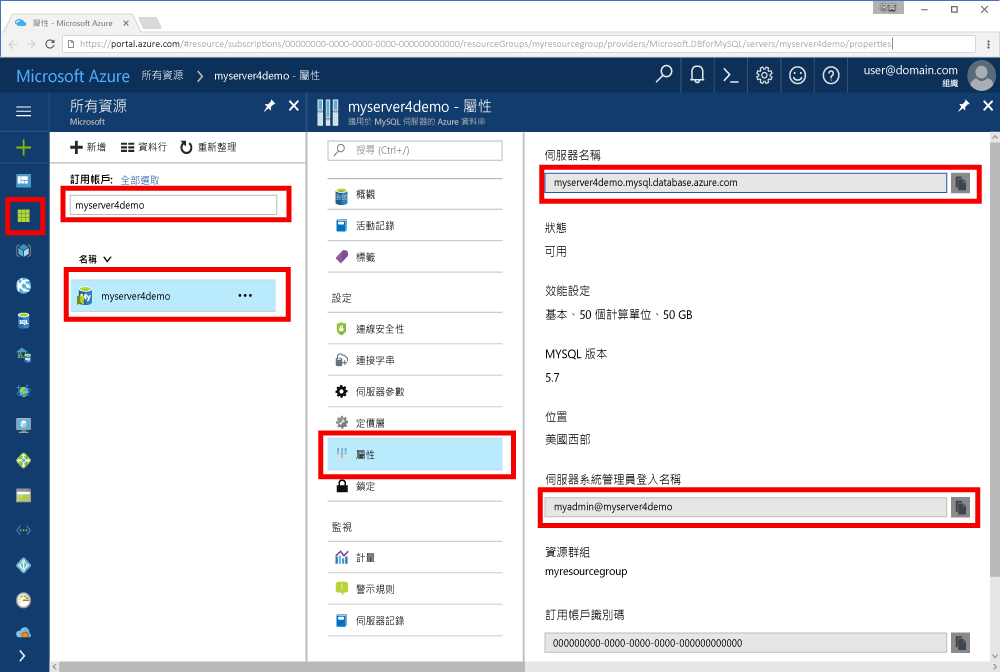

# <a name="azure-database-for-mysql-use-go-language-tooconnect-and-query-data"></a>Azure 資料庫的 MySQL： 使用 Go 語言 tooconnect 和查詢資料
本快速入門示範如何使用 MySQL tooconnect tooan Azure 資料庫程式碼撰寫的 hello[移](https://golang.org/)從 Windows、 Ubuntu Linux 和 Apple macOS 平台的語言。 它會顯示 toouse SQL 陳述式 tooquery，如何插入、 更新和刪除 hello 資料庫中的資料。 本文假設您熟悉開發使用 Go，但是，您就可以與 MySQL 的 Azure 資料庫的新 tooworking。

## <a name="prerequisites"></a>必要條件
本快速入門會使用 hello 資源建立在其中一個這些指南做為起點：
- [使用 Azure 入口網站建立適用於 MySQL 的 Azure 資料庫伺服器](./quickstart-create-mysql-server-database-using-azure-portal.md)
- [使用 Azure CLI 建立適用於 MySQL 的 Azure 資料庫伺服器](./quickstart-create-mysql-server-database-using-azure-cli.md)

## <a name="install-go-and-mysql-connector"></a>安裝 Go 與 MySQL 連接器
安裝[移](https://golang.org/doc/install)和 hello [go sql-驅動程式的 MySQL](https://github.com/go-sql-driver/mysql#installation)自己電腦上。 根據您的平台，請依照下列步驟 hello:

### <a name="windows"></a>Windows
1. [下載](https://golang.org/dl/)並安裝 Microsoft windows 根據 toohello Go[安裝指示](https://golang.org/doc/install)。
2. 啟動 hello 從 hello [開始] 功能表的命令提示字元。
3. 為您的專案產生資料夾，例如 `mkdir  %USERPROFILE%\go\src\mysqlgo`。
4. 將目錄變更至 hello 專案資料夾中，例如`cd %USERPROFILE%\go\src\mysqlgo`。
5. 設定 GOPATH toopoint toohello 原始程式碼目錄的 hello 環境變數。 `set GOPATH=%USERPROFILE%\go`。
6. 安裝 hello [go sql-驅動程式的 mysql](https://github.com/go-sql-driver/mysql#installation)執行 hello`go get github.com/go-sql-driver/mysql`命令。

   在 [摘要] 安裝到]，然後 hello 命令提示字元中執行下列命令：
   ```cmd
   mkdir  %USERPROFILE%\go\src\mysqlgo
   cd %USERPROFILE%\go\src\mysqlgo
   set GOPATH=%USERPROFILE%\go
   go get github.com/go-sql-driver/mysql
   ```

### <a name="linux-ubuntu"></a>Linux (Ubuntu)
1. 啟動 hello Bash 殼層。 
2. 執行 `sudo apt-get install golang-go` 以安裝 Go。
3. 在主目錄中為您的專案產生資料夾，例如 `mkdir -p ~/go/src/mysqlgo/`。
4. 將目錄變更至 hello 資料夾中，例如`cd ~/go/src/mysqlgo/`。
5. 設定 hello GOPATH 環境變數 toopoint tooa 有效的來源目錄，例如您目前的首頁目錄移資料夾。 在 [hello bash 殼層中，執行`export GOPATH=~/go`tooadd hello 走向 hello GOPATH hello 目前的殼層工作階段目錄。
6. 安裝 hello [go sql-驅動程式的 mysql](https://github.com/go-sql-driver/mysql#installation)執行 hello`go get github.com/go-sql-driver/mysql`命令。

   總而言之，就是執行下列 bash 命令：
   ```bash
   sudo apt-get install golang-go
   mkdir -p ~/go/src/mysqlgo/
   cd ~/go/src/mysqlgo/
   export GOPATH=~/go/
   go get github.com/go-sql-driver/mysql
   ```

### <a name="apple-macos"></a>Apple macOS
1. 下載並安裝到根據 toohello[安裝指示](https://golang.org/doc/install)比對您的平台。 
2. 啟動 hello Bash 殼層。 
3. 在主目錄中為您的專案產生資料夾，例如 `mkdir -p ~/go/src/mysqlgo/`。
4. 將目錄變更至 hello 資料夾中，例如`cd ~/go/src/mysqlgo/`。
5. 設定 hello GOPATH 環境變數 toopoint tooa 有效的來源目錄，例如您目前的首頁目錄移資料夾。 在 [hello bash 殼層中，執行`export GOPATH=~/go`tooadd hello 走向 hello GOPATH hello 目前的殼層工作階段目錄。
6. 安裝 hello [go sql-驅動程式的 mysql](https://github.com/go-sql-driver/mysql#installation)執行 hello`go get github.com/go-sql-driver/mysql`命令。

   總而言之，就是安裝 Go，然後執行下列 bash 命令：
   ```bash
   mkdir -p ~/go/src/mysqlgo/
   cd ~/go/src/mysqlgo/
   export GOPATH=~/go/
   go get github.com/go-sql-driver/mysql
   ```

## <a name="get-connection-information"></a>取得連線資訊
取得 MySQL hello 連線所需的資訊 tooconnect toohello Azure 資料庫。 您需要 hello 完整的伺服器名稱和登入認證。

1. 登入 toohello [Azure 入口網站](https://portal.azure.com/)。
2. 在 Azure 入口網站中的 hello 左側功能表中按一下**所有資源**，並搜尋您有 creased，例如 hello 伺服器**myserver4demo**。
3. 按一下伺服器名稱，hello **myserver4demo**。
4. 選取 hello 伺服器**屬性**頁面。 請記下 hello**伺服器名稱**和**伺服器系統管理員登入名稱**。
 
5. 如果您忘記您的伺服器登入資訊，請瀏覽 toohello**概觀**頁面 tooview hello 伺服器系統管理員登入名稱，並視需要重設 hello 密碼。
   

## <a name="build-and-run-go-code"></a>建置並執行 Go 程式碼 
1. toowrite Golang 程式碼，您可以使用簡單的文字編輯器，例如 [記事本] 在 Windows 中， [vi](http://manpages.ubuntu.com/manpages/xenial/man1/nvi.1.html#contenttoc5)或[Nano](https://www.nano-editor.org/) Ubuntu 或在 macOS TextEdit 中。 如果想要使用更豐富的互動式開發環境 (IDE)，您可以選擇 Jetbrains 的 [Gogland](https://www.jetbrains.com/go/)、Microsoft 的 [Visual Studio Code](https://code.visualstudio.com/)，或 [Atom](https://atom.io/)。
2. Hello 移至從 hello 區段下方的程式碼貼入文字檔案，並儲存到專案資料夾中副檔名\*.go，例如 Windows 路徑`%USERPROFILE%\go\src\mysqlgo\createtable.go`或 Linux 路徑`~/go/src/mysqlgo/createtable.go`。
3. 找出 hello `HOST`， `DATABASE`， `USER`，和`PASSWORD`hello 程式碼，並以您自己的值取代 hello 範例值中的常數。 
4. 啟動 hello 命令提示字元，或被殼層。 將目錄切換到專案資料夾。 例如，在 Windows 上為 `cd %USERPROFILE%\go\src\mysqlgo\`。 在 Linux 上為 `cd ~/go/src/mysqlgo/`。  部分所述的 hello IDE 編輯器提供偵錯和執行階段功能而不需要殼層命令。
5. 輸入 hello 命令執行 hello 程式碼`go run createtable.go`toocompile hello 應用程式，並執行它。 
6. 或者，toobuild hello 碼轉換為原生應用程式， `go build createtable.go`，然後啟動`createtable.exe`toorun hello 應用程式。

## <a name="connect-create-table-and-insert-data"></a>連線、建立資料表及插入資料
使用 hello 下列程式碼 tooconnect toohello 伺服器、 建立資料表，以及載入 hello 資料使用**插入**SQL 陳述式。 

hello 程式碼匯入三個封裝： hello [sql 封裝](https://golang.org/pkg/database/sql/)，hello [mysql 移 sql 驅動程式](https://github.com/go-sql-driver/mysql#installation)為 hello 與 hello Azure 資料庫的 MySQL 驅動程式 toocommunicate [fmt 封裝](https://golang.org/pkg/fmt/)列印的輸入和輸出 hello 命令列上的。

hello 程式碼呼叫方法[sql。Open （)](http://go-database-sql.org/accessing.html) tooconnect tooAzure MySQL 和使用方法檢查 hello 連接資料庫的[db。Ping()](https://golang.org/pkg/database/sql/#DB.Ping)。 A[資料庫控制代碼](https://golang.org/pkg/database/sql/#DB)會完全使用，保留 hello hello 的資料庫伺服器的連接集區。 hello 程式碼呼叫 hello [exec （)](https://golang.org/pkg/database/sql/#DB.Exec)方法多次 toorun 數個 DDL 命令。 hello 程式碼也會使用 hello [Prepare()](http://go-database-sql.org/prepared.html)和 exec （) toorun 備妥的陳述式使用不同的參數 tooinsert 三個資料列。 每次自訂 checkError() 方法是使用的 toocheck 如果發生錯誤，而驚慌 tooexit。

取代 hello `host`， `database`， `user`，和`password`常數以您自己的值。 

```Go
package main

import (
    "database/sql"
    "fmt"

    _ "github.com/go-sql-driver/mysql"
)

const (
    host     = "myserver4demo.mysql.database.azure.com"
    database = "quickstartdb"
    user     = "myadmin@myserver4demo"
    password = "yourpassword"
)

func checkError(err error) {
    if err != nil {
        panic(err)
    }
}

func main() {

    // Initialize connection string.
    var connectionString = fmt.Sprintf("%s:%s@tcp(%s:3306)/%s?allowNativePasswords=true", user, password, host, database)

    // Initialize connection object.
    db, err := sql.Open("mysql", connectionString)
    checkError(err)
    defer db.Close()

    err = db.Ping()
    checkError(err)
    fmt.Println("Successfully created connection toodatabase.")

    // Drop previous table of same name if one exists.
    _, err = db.Exec("DROP TABLE IF EXISTS inventory;")
    checkError(err)
    fmt.Println("Finished dropping table (if existed).")

    // Create table.
    _, err = db.Exec("CREATE TABLE inventory (id serial PRIMARY KEY, name VARCHAR(50), quantity INTEGER);")
    checkError(err)
    fmt.Println("Finished creating table.")

    // Insert some data into table.
    sqlStatement, err := db.Prepare("INSERT INTO inventory (name, quantity) VALUES (?, ?);")
    res, err := sqlStatement.Exec("banana", 150)
    checkError(err)
    rowCount, err := res.RowsAffected()
    fmt.Printf("Inserted %d row(s) of data.\n", rowCount)

    res, err = sqlStatement.Exec("orange", 154)
    checkError(err)
    rowCount, err = res.RowsAffected()
    fmt.Printf("Inserted %d row(s) of data.\n", rowCount)

    res, err = sqlStatement.Exec("apple", 100)
    checkError(err)
    rowCount, err = res.RowsAffected()
    fmt.Printf("Inserted %d row(s) of data.\n", rowCount)
    fmt.Println("Done.")
}

```

## <a name="read-data"></a>讀取資料
使用 hello 下列程式碼 tooconnect 並讀取 hello 資料使用**選取**SQL 陳述式。 

hello 程式碼匯入三個封裝： hello [sql 封裝](https://golang.org/pkg/database/sql/)，hello [mysql 移 sql 驅動程式](https://github.com/go-sql-driver/mysql#installation)為 hello 與 hello Azure 資料庫的 MySQL 驅動程式 toocommunicate [fmt 封裝](https://golang.org/pkg/fmt/)列印的輸入和輸出 hello 命令列上的。

hello 程式碼呼叫方法[sql。Open （)](http://go-database-sql.org/accessing.html) tooconnect tooAzure MySQL 和使用方法檢查 hello 連接資料庫的[db。Ping()](https://golang.org/pkg/database/sql/#DB.Ping)。 A[資料庫控制代碼](https://golang.org/pkg/database/sql/#DB)會完全使用，保留 hello hello 的資料庫伺服器的連接集區。 hello 程式碼呼叫 hello [query （)](https://golang.org/pkg/database/sql/#DB.Query)方法 toorun hello select 命令。 然後它會執行[next （)](https://golang.org/pkg/database/sql/#Rows.Next) tooiterate 透過 hello 結果集和[Scan()](https://golang.org/pkg/database/sql/#Rows.Scan) tooparse hello 資料行值儲存到變數中的 hello 值。 每次自訂 checkError() 方法是使用的 toocheck 如果發生錯誤，而驚慌 tooexit。

取代 hello `host`， `database`， `user`，和`password`常數以您自己的值。 

```Go
package main

import (
    "database/sql"
    "fmt"

    _ "github.com/go-sql-driver/mysql"
)

const (
    host     = "myserver4demo.mysql.database.azure.com"
    database = "quickstartdb"
    user     = "myadmin@myserver4demo"
    password = "yourpassword"
)

func checkError(err error) {
    if err != nil {
        panic(err)
    }
}

func main() {

    // Initialize connection string.
    var connectionString = fmt.Sprintf("%s:%s@tcp(%s:3306)/%s?allowNativePasswords=true", user, password, host, database)

    // Initialize connection object.
    db, err := sql.Open("mysql", connectionString)
    checkError(err)
    defer db.Close()

    err = db.Ping()
    checkError(err)
    fmt.Println("Successfully created connection toodatabase.")

    // Variables for printing column data when scanned.
    var (
        id       int
        name     string
        quantity int
    )

    // Read some data from hello table.
    rows, err := db.Query("SELECT id, name, quantity from inventory;")
    checkError(err)
    defer rows.Close()
    fmt.Println("Reading data:")
    for rows.Next() {
        err := rows.Scan(&id, &name, &quantity)
        checkError(err)
        fmt.Printf("Data row = (%d, %s, %d)\n", id, name, quantity)
    }
    err = rows.Err()
    checkError(err)
    fmt.Println("Done.")
}
```

## <a name="update-data"></a>更新資料
使用 hello 下列程式碼 tooconnect 並更新 hello 資料使用**更新**SQL 陳述式。 

hello 程式碼匯入三個封裝： hello [sql 封裝](https://golang.org/pkg/database/sql/)，hello [mysql 移 sql 驅動程式](https://github.com/go-sql-driver/mysql#installation)為 hello 與 hello Azure 資料庫的 MySQL 驅動程式 toocommunicate [fmt 封裝](https://golang.org/pkg/fmt/)列印的輸入和輸出 hello 命令列上的。

hello 程式碼呼叫方法[sql。Open （)](http://go-database-sql.org/accessing.html) tooconnect tooAzure MySQL 和使用方法檢查 hello 連接資料庫的[db。Ping()](https://golang.org/pkg/database/sql/#DB.Ping)。 A[資料庫控制代碼](https://golang.org/pkg/database/sql/#DB)會完全使用，保留 hello hello 的資料庫伺服器的連接集區。 hello 程式碼呼叫 hello [exec （)](https://golang.org/pkg/database/sql/#DB.Exec)方法 toorun hello 更新命令。 每次自訂 checkError() 方法是使用的 toocheck 如果發生錯誤，而驚慌 tooexit。

取代 hello `host`， `database`， `user`，和`password`常數以您自己的值。 

```Go
package main

import (
    "database/sql"
    "fmt"

    _ "github.com/go-sql-driver/mysql"
)

const (
    host     = "myserver4demo.mysql.database.azure.com"
    database = "quickstartdb"
    user     = "myadmin@myserver4demo"
    password = "yourpassword"
)

func checkError(err error) {
    if err != nil {
        panic(err)
    }
}

func main() {

    // Initialize connection string.
    var connectionString = fmt.Sprintf("%s:%s@tcp(%s:3306)/%s?allowNativePasswords=true", user, password, host, database)

    // Initialize connection object.
    db, err := sql.Open("mysql", connectionString)
    checkError(err)
    defer db.Close()

    err = db.Ping()
    checkError(err)
    fmt.Println("Successfully created connection toodatabase.")

    // Modify some data in table.
    rows, err := db.Exec("UPDATE inventory SET quantity = ? WHERE name = ?", 200, "banana")
    checkError(err)
    rowCount, err := rows.RowsAffected()
    fmt.Printf("Deleted %d row(s) of data.\n", rowCount)
    fmt.Println("Done.")
}
```

## <a name="delete-data"></a>刪除資料
使用 hello 下列程式碼 tooconnect 並移除資料使用**刪除**SQL 陳述式。 

hello 程式碼匯入三個封裝： hello [sql 封裝](https://golang.org/pkg/database/sql/)，hello [mysql 移 sql 驅動程式](https://github.com/go-sql-driver/mysql#installation)為 hello 與 hello Azure 資料庫的 MySQL 驅動程式 toocommunicate [fmt 封裝](https://golang.org/pkg/fmt/)列印的輸入和輸出 hello 命令列上的。

hello 程式碼呼叫方法[sql。Open （)](http://go-database-sql.org/accessing.html) tooconnect tooAzure MySQL 和使用方法檢查 hello 連接資料庫的[db。Ping()](https://golang.org/pkg/database/sql/#DB.Ping)。 A[資料庫控制代碼](https://golang.org/pkg/database/sql/#DB)會完全使用，保留 hello hello 的資料庫伺服器的連接集區。 hello 程式碼呼叫 hello [exec （)](https://golang.org/pkg/database/sql/#DB.Exec)方法 toorun hello 的 delete 命令。 每次自訂 checkError() 方法是使用的 toocheck 如果發生錯誤，而驚慌 tooexit。

取代 hello `host`， `database`， `user`，和`password`常數以您自己的值。 

```Go
package main

import (
    "database/sql"
    "fmt"
    _ "github.com/go-sql-driver/mysql"
)

const (
    host     = "myserver4demo.mysql.database.azure.com"
    database = "quickstartdb"
    user     = "myadmin@myserver4demo"
    password = "yourpassword"
)

func checkError(err error) {
    if err != nil {
        panic(err)
    }
}

func main() {

    // Initialize connection string.
    var connectionString = fmt.Sprintf("%s:%s@tcp(%s:3306)/%s?allowNativePasswords=true", user, password, host, database)

    // Initialize connection object.
    db, err := sql.Open("mysql", connectionString)
    checkError(err)
    defer db.Close()

    err = db.Ping()
    checkError(err)
    fmt.Println("Successfully created connection toodatabase.")

    // Modify some data in table.
    rows, err := db.Exec("DELETE FROM inventory WHERE name = ?", "orange")
    checkError(err)
    rowCount, err := rows.RowsAffected()
    fmt.Printf("Deleted %d row(s) of data.\n", rowCount)
    fmt.Println("Done.")
}
```

## <a name="next-steps"></a>後續步驟
> [!div class="nextstepaction"]
> [使用匯出和匯入來移轉資料庫](./concepts-migrate-import-export.md)
