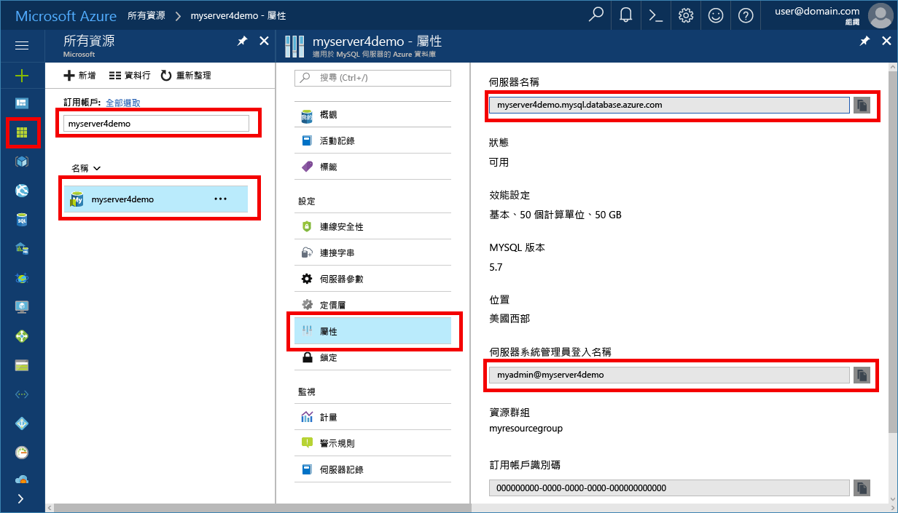

# <a name="azure-database-for-mysql-use-nodejs-to-connect-and-query-data"></a><span data-ttu-id="7d01e-103">Azure Database for MySQL︰使用 Node.js 連線及查詢資料</span><span class="sxs-lookup"><span data-stu-id="7d01e-103">Azure Database for MySQL: Use Node.js to connect and query data</span></span>
<span data-ttu-id="7d01e-104">本快速入門示範如何從 Windows、Ubuntu Linux 和 Mac 平台使用 [Node.js](https://nodejs.org/) 來連線到 Azure Database for MySQL。</span><span class="sxs-lookup"><span data-stu-id="7d01e-104">This quickstart demonstrates how to connect to an Azure Database for MySQL using [Node.js](https://nodejs.org/) from Windows, Ubuntu Linux, and Mac platforms.</span></span> <span data-ttu-id="7d01e-105">它會顯示如何使用 SQL 陳述式來查詢、插入、更新和刪除資料庫中的資料。</span><span class="sxs-lookup"><span data-stu-id="7d01e-105">It shows how to use SQL statements to query, insert, update, and delete data in the database.</span></span> <span data-ttu-id="7d01e-106">本文中的步驟假設您已熟悉使用 Node.js 進行開發，但不熟悉 Azure Database for MySQLL。</span><span class="sxs-lookup"><span data-stu-id="7d01e-106">The steps in this article assume that you are familiar with developing using Node.js, and that you are new to working with Azure Database for MySQL.</span></span>

## <a name="prerequisites"></a><span data-ttu-id="7d01e-107">必要條件</span><span class="sxs-lookup"><span data-stu-id="7d01e-107">Prerequisites</span></span>
<span data-ttu-id="7d01e-108">本快速入門使用在以下任一指南中建立的資源作為起點︰</span><span class="sxs-lookup"><span data-stu-id="7d01e-108">This quickstart uses the resources created in either of these guides as a starting point:</span></span>
- [<span data-ttu-id="7d01e-109">使用 Azure 入口網站建立適用於 MySQL 的 Azure 資料庫伺服器</span><span class="sxs-lookup"><span data-stu-id="7d01e-109">Create an Azure Database for MySQL server using Azure portal</span></span>](./quickstart-create-mysql-server-database-using-azure-portal.md)
- [<span data-ttu-id="7d01e-110">使用 Azure CLI 建立適用於 MySQL 的 Azure 資料庫伺服器</span><span class="sxs-lookup"><span data-stu-id="7d01e-110">Create an Azure Database for MySQL server using Azure CLI</span></span>](./quickstart-create-mysql-server-database-using-azure-cli.md)

<span data-ttu-id="7d01e-111">您也需要：</span><span class="sxs-lookup"><span data-stu-id="7d01e-111">You also need to:</span></span>
- <span data-ttu-id="7d01e-112">安裝 [Node.js](https://nodejs.org) 執行階段。</span><span class="sxs-lookup"><span data-stu-id="7d01e-112">Install the [Node.js](https://nodejs.org) runtime.</span></span>
- <span data-ttu-id="7d01e-113">安裝 [mysql2](https://www.npmjs.com/package/mysql2) 套件，以從 Node.js 應用程式連線至 MySQL。</span><span class="sxs-lookup"><span data-stu-id="7d01e-113">Install [mysql2](https://www.npmjs.com/package/mysql2) package to connect to MySQL from the Node.js application.</span></span> 

## <a name="install-nodejs-and-the-mysql-connector"></a><span data-ttu-id="7d01e-114">安裝 Node.js 和 MySQL 連接器</span><span class="sxs-lookup"><span data-stu-id="7d01e-114">Install Node.js and the MySQL connector</span></span>
<span data-ttu-id="7d01e-115">根據您的平台，遵循適當指示來安裝 Node.js。</span><span class="sxs-lookup"><span data-stu-id="7d01e-115">Depending on your platform, follow the appropriate instructions to install Node.js.</span></span> <span data-ttu-id="7d01e-116">使用 npm 將 mysql2 套件及其相依性安裝到您的專案資料夾中。</span><span class="sxs-lookup"><span data-stu-id="7d01e-116">Use npm to install the mysql2 package and its dependencies into your project folder.</span></span>

### <a name="windows"></a><span data-ttu-id="7d01e-117">**Windows**</span><span class="sxs-lookup"><span data-stu-id="7d01e-117">**Windows**</span></span>
1. <span data-ttu-id="7d01e-118">造訪 [Node.js 下載頁面](https://nodejs.org/en/download/)，並選取您需要的 Windows 安裝程式選項。</span><span class="sxs-lookup"><span data-stu-id="7d01e-118">Visit the [Node.js downloads page](https://nodejs.org/en/download/) and select your desired Windows installer option.</span></span>
2. <span data-ttu-id="7d01e-119">建立本機專案資料夾，例如 `nodejsmysql`。</span><span class="sxs-lookup"><span data-stu-id="7d01e-119">Make a local project folder such as `nodejsmysql`.</span></span> 
3. <span data-ttu-id="7d01e-120">啟動命令提示字元，將目錄變更為專案資料夾，例如 `cd c:\nodejsmysql\`</span><span class="sxs-lookup"><span data-stu-id="7d01e-120">Launch the command prompt and cd into the project folder, such as `cd c:\nodejsmysql\`</span></span>
4. <span data-ttu-id="7d01e-121">執行 NPM 工具將 mysql2 程式庫安裝至專案資料夾中。</span><span class="sxs-lookup"><span data-stu-id="7d01e-121">Run the NPM tool to install the mysql2 library into the project folder.</span></span>

   ```cmd
   cd c:\nodejsmysql\
   "C:\Program Files\nodejs\npm" install mysql2
   "C:\Program Files\nodejs\npm" list
   ```

5. <span data-ttu-id="7d01e-122">檢查 `mysql2@1.3.5` 的 `npm list` 輸出文字，以確認安裝。</span><span class="sxs-lookup"><span data-stu-id="7d01e-122">Verify the installation by checking the `npm list` output text for `mysql2@1.3.5`.</span></span>

### <a name="linux-ubuntu"></a><span data-ttu-id="7d01e-123">**Linux (Ubuntu)**</span><span class="sxs-lookup"><span data-stu-id="7d01e-123">**Linux (Ubuntu)**</span></span>
1. <span data-ttu-id="7d01e-124">執行下列命令，以安裝 **Node.js** 和適用於 Node.js 的 **npm** 套件管理員。</span><span class="sxs-lookup"><span data-stu-id="7d01e-124">Run the following commands to install **Node.js** and **npm** the package manager for Node.js.</span></span>

   ```bash
   sudo apt-get install -y nodejs npm
   ```

2. <span data-ttu-id="7d01e-125">執行下列命令，產生專案資料夾 `mysqlnodejs`並將 mysql2 套件安裝到該資料夾中。</span><span class="sxs-lookup"><span data-stu-id="7d01e-125">Run the following commands to make a project folder `mysqlnodejs` and install the mysql2 package into that folder.</span></span>

   ```bash
   mkdir nodejsmysql
   cd nodejsmysql
   npm install --save mysql2
   npm list
   ```
3. <span data-ttu-id="7d01e-126">檢查 `mysql2@1.3.5` 的 npm 清單輸出文字，以確認安裝。</span><span class="sxs-lookup"><span data-stu-id="7d01e-126">Verify the installation by checking npm list output text for `mysql2@1.3.5`.</span></span>

### <a name="mac-os"></a><span data-ttu-id="7d01e-127">**Mac OS**</span><span class="sxs-lookup"><span data-stu-id="7d01e-127">**Mac OS**</span></span>
1. <span data-ttu-id="7d01e-128">輸入下列命令以安裝 **brew**、適用於 Mac OS X 的簡易使用封裝管理員和 **Node.js**。</span><span class="sxs-lookup"><span data-stu-id="7d01e-128">Enter the following commands to install **brew**, an easy-to-use package manager for Mac OS X and **Node.js**.</span></span>

   ```bash
   ruby -e "$(curl -fsSL https://raw.githubusercontent.com/Homebrew/install/master/install)"
   brew install node
   ```
2. <span data-ttu-id="7d01e-129">執行下列命令，產生專案資料夾 `mysqlnodejs`並將 mysql2 套件安裝到該資料夾中。</span><span class="sxs-lookup"><span data-stu-id="7d01e-129">Run the following commands to make a project folder `mysqlnodejs` and install the mysql2 package into that folder.</span></span>

   ```bash
   mkdir nodejsmysql
   cd nodejsmysql
   npm install --save mysql2
   npm list
   ```

3. <span data-ttu-id="7d01e-130">檢查 `mysql2@1.3.6` 的 `npm list` 輸出文字，以確認安裝。</span><span class="sxs-lookup"><span data-stu-id="7d01e-130">Verify the installation by checking the `npm list` output text for `mysql2@1.3.6`.</span></span> <span data-ttu-id="7d01e-131">版本號碼可能會隨著新的修補檔案發行而有所不同。</span><span class="sxs-lookup"><span data-stu-id="7d01e-131">The version number may vary as new patches are released.</span></span>

## <a name="get-connection-information"></a><span data-ttu-id="7d01e-132">取得連線資訊</span><span class="sxs-lookup"><span data-stu-id="7d01e-132">Get connection information</span></span>
<span data-ttu-id="7d01e-133">取得連線到 Azure Database for MySQL 所需的連線資訊。</span><span class="sxs-lookup"><span data-stu-id="7d01e-133">Get the connection information needed to connect to the Azure Database for MySQL.</span></span> <span data-ttu-id="7d01e-134">您需要完整的伺服器名稱和登入認證。</span><span class="sxs-lookup"><span data-stu-id="7d01e-134">You need the fully qualified server name and login credentials.</span></span>

1. <span data-ttu-id="7d01e-135">登入 [Azure 入口網站](https://portal.azure.com/)。</span><span class="sxs-lookup"><span data-stu-id="7d01e-135">Log in to the [Azure portal](https://portal.azure.com/).</span></span>
2. <span data-ttu-id="7d01e-136">在左側窗格中，按一下 [所有資源]，然後搜尋您所建立的伺服器 (例如 **myserver4demo**)。</span><span class="sxs-lookup"><span data-stu-id="7d01e-136">In the left pane, click **All resources**, and then search for the server you have created (for example, **myserver4demo**).</span></span>
3. <span data-ttu-id="7d01e-137">按一下伺服器名稱 **myserver4demo**。</span><span class="sxs-lookup"><span data-stu-id="7d01e-137">Click the server name **myserver4demo**.</span></span>
4. <span data-ttu-id="7d01e-138">選取伺服器的 [屬性] 頁面。</span><span class="sxs-lookup"><span data-stu-id="7d01e-138">Select the server's **Properties** page.</span></span> <span data-ttu-id="7d01e-139">記下 [伺服器名稱] 和 [伺服器管理員登入名稱]。</span><span class="sxs-lookup"><span data-stu-id="7d01e-139">Make a note of the **Server name** and **Server admin login name**.</span></span>
 <span data-ttu-id="7d01e-140"></span><span class="sxs-lookup"><span data-stu-id="7d01e-140"></span></span>
5. <span data-ttu-id="7d01e-141">如果您忘記伺服器登入資訊，請瀏覽至 [概觀] 頁面來檢視伺服器管理員登入名稱，並視需要重設密碼。</span><span class="sxs-lookup"><span data-stu-id="7d01e-141">If you forget your server login information, navigate to the **Overview** page to view the Server admin login name and, if necessary, reset the password.</span></span>

## <a name="running-the-javascript-code-in-nodejs"></a><span data-ttu-id="7d01e-142">在 Node.js 中執行 JavaScript 程式碼</span><span class="sxs-lookup"><span data-stu-id="7d01e-142">Running the JavaScript code in Node.js</span></span>
1. <span data-ttu-id="7d01e-143">將 JavaScript 程式碼貼入文字檔 (副檔名為 .js) 並儲存到專案資料夾中，例如 C:\nodejsmysql\createtable.js or /home/username/nodejsmysql/createtable.js</span><span class="sxs-lookup"><span data-stu-id="7d01e-143">Paste the JavaScript code into text files, and save into a project folder with file extension .js, such as C:\nodejsmysql\createtable.js or /home/username/nodejsmysql/createtable.js</span></span>
2. <span data-ttu-id="7d01e-144">啟動命令提示字元或 bash shell。</span><span class="sxs-lookup"><span data-stu-id="7d01e-144">Launch the command prompt or bash shell.</span></span> <span data-ttu-id="7d01e-145">將目錄切換到專案資料夾 `cd nodejsmysql`。</span><span class="sxs-lookup"><span data-stu-id="7d01e-145">Change directory into your project folder `cd nodejsmysql`.</span></span>
3. <span data-ttu-id="7d01e-146">若要執行應用程式，請鍵入後接檔案名稱的節點命令，例如 `node createtable.js`。</span><span class="sxs-lookup"><span data-stu-id="7d01e-146">To run the application, type the node command followed by the file name, such as `node createtable.js`.</span></span>
4. <span data-ttu-id="7d01e-147">在 Windows 上，如果節點應用程式不在您的環境變數路徑中，則可能需要使用完整路徑來啟動節點應用程式，例如 `"C:\Program Files\nodejs\node.exe" createtable.js`</span><span class="sxs-lookup"><span data-stu-id="7d01e-147">On Windows, if the node application is not in your environment variable path, you may need to use the full path to launch the node application, such as `"C:\Program Files\nodejs\node.exe" createtable.js`</span></span>

## <a name="connect-create-table-and-insert-data"></a><span data-ttu-id="7d01e-148">連線、建立資料表及插入資料</span><span class="sxs-lookup"><span data-stu-id="7d01e-148">Connect, create table, and insert data</span></span>
<span data-ttu-id="7d01e-149">使用下列程式碼搭配 **CREATE TABLE** 和 **INSERT INTO** SQL 陳述式來連線和載入資料。</span><span class="sxs-lookup"><span data-stu-id="7d01e-149">Use the following code to connect and load the data using **CREATE TABLE** and  **INSERT INTO** SQL statements.</span></span>

<span data-ttu-id="7d01e-150">[mysql.createConnection()](https://github.com/mysqljs/mysql#establishing-connections) 方法用來與 MySQL 伺服器互動。</span><span class="sxs-lookup"><span data-stu-id="7d01e-150">The [mysql.createConnection()](https://github.com/mysqljs/mysql#establishing-connections) method is used to interface with the MySQL server.</span></span> <span data-ttu-id="7d01e-151">[connect()](https://github.com/mysqljs/mysql#establishing-connections) 函式用來建立伺服器連線。</span><span class="sxs-lookup"><span data-stu-id="7d01e-151">The [connect()](https://github.com/mysqljs/mysql#establishing-connections) function is used to establish the connection to the server.</span></span> <span data-ttu-id="7d01e-152">[query()](https://github.com/mysqljs/mysql#performing-queries) 函式用來對 MySQL 資料庫執行 SQL 查詢。</span><span class="sxs-lookup"><span data-stu-id="7d01e-152">The [query()](https://github.com/mysqljs/mysql#performing-queries) function is used to execute the SQL query against MySQL database.</span></span> 

<span data-ttu-id="7d01e-153">將 `host`、`user`、`password` 和 `database` 參數取代為您在建立伺服器和資料庫時所指定的值。</span><span class="sxs-lookup"><span data-stu-id="7d01e-153">Replace the `host`, `user`, `password`, and `database` parameters with the values that you specified when you created the server and database.</span></span>

```javascript
const mysql = require('mysql2');

var config =
{
    host: 'myserver4demo.mysql.database.azure.com',
    user: 'myadmin@myserver4demo',
    password: 'your_password',
    database: 'quickstartdb',
    port: 3306,
    ssl: true
};

const conn = new mysql.createConnection(config);

conn.connect(
    function (err) { 
    if (err) { 
        console.log("!!! Cannot connect !!! Error:");
        throw err;
    }
    else
    {
       console.log("Connection established.");
           queryDatabase();
    }   
});

function queryDatabase(){
       conn.query('DROP TABLE IF EXISTS inventory;', function (err, results, fields) { 
            if (err) throw err; 
            console.log('Dropped inventory table if existed.');
        })
       conn.query('CREATE TABLE inventory (id serial PRIMARY KEY, name VARCHAR(50), quantity INTEGER);', 
            function (err, results, fields) {
                if (err) throw err;
            console.log('Created inventory table.');
        })
       conn.query('INSERT INTO inventory (name, quantity) VALUES (?, ?);', ['banana', 150], 
            function (err, results, fields) {
                if (err) throw err;
            else console.log('Inserted ' + results.affectedRows + ' row(s).');
        })
       conn.query('INSERT INTO inventory (name, quantity) VALUES (?, ?);', ['orange', 154], 
            function (err, results, fields) {
                if (err) throw err;
            console.log('Inserted ' + results.affectedRows + ' row(s).');
        })
       conn.query('INSERT INTO inventory (name, quantity) VALUES (?, ?);', ['apple', 100], 
        function (err, results, fields) {
                if (err) throw err;
            console.log('Inserted ' + results.affectedRows + ' row(s).');
        })
       conn.end(function (err) { 
        if (err) throw err;
        else  console.log('Done.') 
        });
};
```

## <a name="read-data"></a><span data-ttu-id="7d01e-154">讀取資料</span><span class="sxs-lookup"><span data-stu-id="7d01e-154">Read data</span></span>
<span data-ttu-id="7d01e-155">使用下列程式碼搭配 **SELECT** SQL 陳述式來連線和讀取資料。</span><span class="sxs-lookup"><span data-stu-id="7d01e-155">Use the following code to connect and read the data using a **SELECT** SQL statement.</span></span> 

<span data-ttu-id="7d01e-156">[mysql.createConnection()](https://github.com/mysqljs/mysql#establishing-connections) 方法用來與 MySQL 伺服器互動。</span><span class="sxs-lookup"><span data-stu-id="7d01e-156">The [mysql.createConnection()](https://github.com/mysqljs/mysql#establishing-connections) method is used to interface with the MySQL server.</span></span> <span data-ttu-id="7d01e-157">[connect()](https://github.com/mysqljs/mysql#establishing-connections) 方法用來建立伺服器連線。</span><span class="sxs-lookup"><span data-stu-id="7d01e-157">The [connect()](https://github.com/mysqljs/mysql#establishing-connections) method is used to establish the connection to the server.</span></span> <span data-ttu-id="7d01e-158">[query()](https://github.com/mysqljs/mysql#performing-queries) 方法用來執行對 MySQL 資料庫的 SQL 查詢。</span><span class="sxs-lookup"><span data-stu-id="7d01e-158">The [query()](https://github.com/mysqljs/mysql#performing-queries) method is used to execute the SQL query against MySQL database.</span></span> <span data-ttu-id="7d01e-159">結果陣列用來保留查詢的結果。</span><span class="sxs-lookup"><span data-stu-id="7d01e-159">The results array is used to hold the results of the query.</span></span>

<span data-ttu-id="7d01e-160">將 `host`、`user`、`password` 和 `database` 參數取代為您在建立伺服器和資料庫時所指定的值。</span><span class="sxs-lookup"><span data-stu-id="7d01e-160">Replace the `host`, `user`, `password`, and `database` parameters with the values that you specified when you created the server and database.</span></span>

```javascript
const mysql = require('mysql2');

var config =
{
    host: 'myserver4demo.mysql.database.azure.com',
    user: 'myadmin@myserver4demo',
    password: 'your_password',
    database: 'quickstartdb',
    port: 3306,
    ssl: true
};

const conn = new mysql.createConnection(config);

conn.connect(
    function (err) { 
        if (err) { 
            console.log("!!! Cannot connect !!! Error:");
            throw err;
        }
        else {
            console.log("Connection established.");
            readData();
        }   
    });

function readData(){
        conn.query('SELECT * FROM inventory', 
            function (err, results, fields) {
                if (err) throw err;
                else console.log('Selected ' + results.length + ' row(s).');
                for (i = 0; i < results.length; i++) {
                    console.log('Row: ' + JSON.stringify(results[i]));
                }
                console.log('Done.');
            })
       conn.end(
           function (err) { 
                if (err) throw err;
                else  console.log('Closing connection.') 
        });
};
```

## <a name="update-data"></a><span data-ttu-id="7d01e-161">更新資料</span><span class="sxs-lookup"><span data-stu-id="7d01e-161">Update data</span></span>
<span data-ttu-id="7d01e-162">使用下列程式碼搭配 **UPDATE** SQL 陳述式來連線和讀取資料。</span><span class="sxs-lookup"><span data-stu-id="7d01e-162">Use the following code to connect and read the data using a **UPDATE** SQL statement.</span></span> 

<span data-ttu-id="7d01e-163">[mysql.createConnection()](https://github.com/mysqljs/mysql#establishing-connections) 方法用來與 MySQL 伺服器互動。</span><span class="sxs-lookup"><span data-stu-id="7d01e-163">The [mysql.createConnection()](https://github.com/mysqljs/mysql#establishing-connections) method is used to interface with the MySQL server.</span></span> <span data-ttu-id="7d01e-164">[connect()](https://github.com/mysqljs/mysql#establishing-connections) 方法用來建立伺服器連線。</span><span class="sxs-lookup"><span data-stu-id="7d01e-164">The [connect()](https://github.com/mysqljs/mysql#establishing-connections) method is used to establish the connection to the server.</span></span> <span data-ttu-id="7d01e-165">[query()](https://github.com/mysqljs/mysql#performing-queries) 方法用來執行對 MySQL 資料庫的 SQL 查詢。</span><span class="sxs-lookup"><span data-stu-id="7d01e-165">The [query()](https://github.com/mysqljs/mysql#performing-queries) method is used to execute the SQL query against MySQL database.</span></span> 

<span data-ttu-id="7d01e-166">將 `host`、`user`、`password` 和 `database` 參數取代為您在建立伺服器和資料庫時所指定的值。</span><span class="sxs-lookup"><span data-stu-id="7d01e-166">Replace the `host`, `user`, `password`, and `database` parameters with the values that you specified when you created the server and database.</span></span>

```javascript
const mysql = require('mysql2');

var config =
{
    host: 'myserver4demo.mysql.database.azure.com',
    user: 'myadmin@myserver4demo',
    password: 'your_password',
    database: 'quickstartdb',
    port: 3306,
    ssl: true
};

const conn = new mysql.createConnection(config);

conn.connect(
    function (err) { 
        if (err) { 
            console.log("!!! Cannot connect !!! Error:");
            throw err;
        }
        else {
            console.log("Connection established.");
            updateData();
        }   
    });

function updateData(){
       conn.query('UPDATE inventory SET quantity = ? WHERE name = ?', [200, 'banana'], 
            function (err, results, fields) {
                if (err) throw err;
                else console.log('Updated ' + results.affectedRows + ' row(s).');
        })
       conn.end(
           function (err) { 
                if (err) throw err;
                else  console.log('Done.') 
        });
};
```

## <a name="delete-data"></a><span data-ttu-id="7d01e-167">刪除資料</span><span class="sxs-lookup"><span data-stu-id="7d01e-167">Delete data</span></span>
<span data-ttu-id="7d01e-168">使用下列程式碼搭配 **DELETE** SQL 陳述式來連線和讀取資料。</span><span class="sxs-lookup"><span data-stu-id="7d01e-168">Use the following code to connect and read the data using a **DELETE** SQL statement.</span></span> 

<span data-ttu-id="7d01e-169">[mysql.createConnection()](https://github.com/mysqljs/mysql#establishing-connections) 方法用來與 MySQL 伺服器互動。</span><span class="sxs-lookup"><span data-stu-id="7d01e-169">The [mysql.createConnection()](https://github.com/mysqljs/mysql#establishing-connections) method is used to interface with the MySQL server.</span></span> <span data-ttu-id="7d01e-170">[connect()](https://github.com/mysqljs/mysql#establishing-connections) 方法用來建立伺服器連線。</span><span class="sxs-lookup"><span data-stu-id="7d01e-170">The [connect()](https://github.com/mysqljs/mysql#establishing-connections) method is used to establish the connection to the server.</span></span> <span data-ttu-id="7d01e-171">[query()](https://github.com/mysqljs/mysql#performing-queries) 方法用來執行對 MySQL 資料庫的 SQL 查詢。</span><span class="sxs-lookup"><span data-stu-id="7d01e-171">The [query()](https://github.com/mysqljs/mysql#performing-queries) method is used to execute the SQL query against MySQL database.</span></span> 

<span data-ttu-id="7d01e-172">將 `host`、`user`、`password` 和 `database` 參數取代為您在建立伺服器和資料庫時所指定的值。</span><span class="sxs-lookup"><span data-stu-id="7d01e-172">Replace the `host`, `user`, `password`, and `database` parameters with the values that you specified when you created the server and database.</span></span>

```javascript
const mysql = require('mysql2');

var config =
{
    host: 'myserver4demo.mysql.database.azure.com',
    user: 'myadmin@myserver4demo',
    password: 'your_password',
    database: 'quickstartdb',
    port: 3306,
    ssl: true
};

const conn = new mysql.createConnection(config);

conn.connect(
    function (err) { 
        if (err) { 
            console.log("!!! Cannot connect !!! Error:");
            throw err;
        }
        else {
            console.log("Connection established.");
            deleteData();
        }   
    });

function deleteData(){
       conn.query('DELETE FROM inventory WHERE name = ?', ['orange'], 
            function (err, results, fields) {
                if (err) throw err;
                else console.log('Deleted ' + results.affectedRows + ' row(s).');
        })
       conn.end(
           function (err) { 
                if (err) throw err;
                else  console.log('Done.') 
        });
};
```

## <a name="next-steps"></a><span data-ttu-id="7d01e-173">後續步驟</span><span class="sxs-lookup"><span data-stu-id="7d01e-173">Next steps</span></span>
> [!div class="nextstepaction"]
> [<span data-ttu-id="7d01e-174">使用匯出和匯入來移轉資料庫</span><span class="sxs-lookup"><span data-stu-id="7d01e-174">Migrate your database using Export and Import</span></span>](./concepts-migrate-import-export.md)
