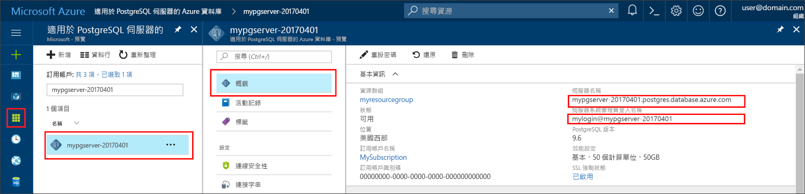

# <a name="azure-database-for-postgresql-use-go-language-tooconnect-and-query-data"></a>Azure PostgreSQL 資料庫： 使用 Go 語言 tooconnect 和查詢資料
本快速入門示範如何使用 PostgreSQL tooconnect tooan Azure 資料庫程式碼撰寫的 hello[移](https://golang.org/)語言 (golang)。 它會顯示 toouse SQL 陳述式 tooquery，如何插入、 更新和刪除 hello 資料庫中的資料。 本文假設您熟悉開發使用 Go，但是，您就可以新增 tooworking Azure PostgreSQL 資料庫。

## <a name="prerequisites"></a>必要條件
本快速入門會使用 hello 資源建立在其中一個這些指南做為起點：
- [建立 DB - 入口網站](quickstart-create-server-database-portal.md)
- [建立 DB - Azure CLI](quickstart-create-server-database-azure-cli.md)

## <a name="install-go-and-pq-connector"></a>安裝 Go 和 pq 連接器
安裝[移](https://golang.org/doc/install)和 hello[純移 Postgres 驅動程式 (pq)](https://github.com/lib/pq)自己電腦上。 根據您的平台，請依照下列步驟 hello:

### <a name="windows"></a>Windows
1. [下載](https://golang.org/dl/)並安裝 Microsoft windows 根據 toohello Go[安裝指示](https://golang.org/doc/install)。
2. 啟動 hello 從 hello [開始] 功能表的命令提示字元。
3. 為您的專案產生資料夾，例如 `mkdir  %USERPROFILE%\go\src\postgresqlgo`。
4. 將目錄變更至 hello 專案資料夾中，例如`cd %USERPROFILE%\go\src\postgresqlgo`。
5. 設定 GOPATH toopoint toohello 原始程式碼目錄的 hello 環境變數。 `set GOPATH=%USERPROFILE%\go`。
6. 安裝 hello[純移 Postgres 驅動程式 (pq)](https://github.com/lib/pq)執行 hello`go get github.com/lib/pq`命令。

   在 摘要 安裝到，然後 hello 命令提示字元中執行下列命令：
   ```cmd
   mkdir  %USERPROFILE%\go\src\postgresqlgo
   cd %USERPROFILE%\go\src\postgresqlgo
   set GOPATH=%USERPROFILE%\go
   go get github.com/lib/pq
   ```

### <a name="linux-ubuntu"></a>Linux (Ubuntu)
1. 啟動 hello Bash 殼層。 
2. 執行 `sudo apt-get install golang-go` 以安裝 Go。
3. 在主目錄中為您的專案產生資料夾，例如 `mkdir -p ~/go/src/postgresqlgo/`。
4. 將目錄變更至 hello 資料夾中，例如`cd ~/go/src/postgresqlgo/`。
5. 設定 hello GOPATH 環境變數 toopoint tooa 有效的來源目錄，例如您目前的首頁目錄移資料夾。 在 hello bash 殼層中，執行`export GOPATH=~/go`tooadd hello 走向 hello GOPATH hello 目前的殼層工作階段目錄。
6. 安裝 hello[純移 Postgres 驅動程式 (pq)](https://github.com/lib/pq)執行 hello`go get github.com/lib/pq`命令。

   總而言之，就是執行下列 bash 命令：
   ```bash
   sudo apt-get install golang-go
   mkdir -p ~/go/src/postgresqlgo/
   cd ~/go/src/postgresqlgo/
   export GOPATH=~/go/
   go get github.com/lib/pq
   ```

### <a name="apple-macos"></a>Apple macOS
1. 下載並安裝到根據 toohello[安裝指示](https://golang.org/doc/install)比對您的平台。 
2. 啟動 hello Bash 殼層。 
3. 在主目錄中為您的專案產生資料夾，例如 `mkdir -p ~/go/src/postgresqlgo/`。
4. 將目錄變更至 hello 資料夾中，例如`cd ~/go/src/postgresqlgo/`。
5. 設定 hello GOPATH 環境變數 toopoint tooa 有效的來源目錄，例如您目前的首頁目錄移資料夾。 在 hello bash 殼層中，執行`export GOPATH=~/go`tooadd hello 走向 hello GOPATH hello 目前的殼層工作階段目錄。
6. 安裝 hello[純移 Postgres 驅動程式 (pq)](https://github.com/lib/pq)執行 hello`go get github.com/lib/pq`命令。

   總而言之，就是安裝 Go，然後執行下列 bash 命令：
   ```bash
   mkdir -p ~/go/src/postgresqlgo/
   cd ~/go/src/postgresqlgo/
   export GOPATH=~/go/
   go get github.com/lib/pq
   ```

## <a name="get-connection-information"></a>取得連線資訊
取得 PostgreSQL hello 連線所需的資訊 tooconnect toohello Azure 資料庫。 您需要 hello 完整的伺服器名稱和登入認證。

1. 登入 toohello [Azure 入口網站](https://portal.azure.com/)。
2. 在 Azure 入口網站中的 hello 左側功能表中按一下**所有資源**，並搜尋您已經建立，例如 hello 伺服器**mypgserver 20170401**。
3. 按一下伺服器名稱，hello **mypgserver 20170401**。
4. 選取 hello 伺服器**概觀**頁面。 請記下 hello**伺服器名稱**和**伺服器系統管理員登入名稱**。
 
5. 如果您忘記您的伺服器登入資訊，請瀏覽 toohello**概觀** 頁面上，並檢視 hello 伺服器系統管理員登入名稱。 如有需要，重設 hello 密碼。

## <a name="build-and-run-go-code"></a>建置並執行 Go 程式碼 
1. toowrite Golang 程式碼，您可以使用簡單的文字編輯器，例如 [記事本] 在 Windows 中， [vi](http://manpages.ubuntu.com/manpages/xenial/man1/nvi.1.html#contenttoc5)或[Nano](https://www.nano-editor.org/) Ubuntu 或在 macOS TextEdit 中。 如果想要使用更豐富的互動式開發環境 (IDE)，您可以選擇 Jetbrains 的 [Gogland](https://www.jetbrains.com/go/)、Microsoft 的 [Visual Studio Code](https://code.visualstudio.com/)，或 [Atom](https://atom.io/)。
2. 從下方的 hello 區段的 hello Golang 程式碼貼入文字檔案，並儲存到專案資料夾中副檔名\*.go，例如 Windows 路徑`%USERPROFILE%\go\src\postgresqlgo\createtable.go`或 Linux 路徑`~/go/src/postgresqlgo/createtable.go`。
3. 找出 hello `HOST`， `DATABASE`， `USER`，和`PASSWORD`hello 程式碼，並以您自己的值取代 hello 範例值中的常數。  
4. 啟動 hello 命令提示字元，或被殼層。 將目錄切換到專案資料夾。 例如，在 Windows 上為 `cd %USERPROFILE%\go\src\postgresqlgo\`。 在 Linux 上為 `cd ~/go/src/postgresqlgo/`。 部分所述的 hello IDE 環境提供偵錯和執行階段功能而不需要殼層命令。
5. 輸入 hello 命令執行 hello 程式碼`go run createtable.go`toocompile hello 應用程式，並執行它。 
6. 或者，toobuild hello 碼轉換為原生應用程式， `go build createtable.go`，然後啟動`createtable.exe`toorun hello 應用程式。

## <a name="connect-and-create-a-table"></a>連線及建立資料表
使用 hello 下列程式碼 tooconnect 並建立資料表，使用**CREATE TABLE** SQL 陳述式，後面接著**INSERT INTO** hello 資料表的 SQL 陳述式 tooadd 資料列。

hello 程式碼匯入三個封裝： hello [sql 封裝](https://golang.org/pkg/database/sql/)，hello [pq 封裝](http://godoc.org/github.com/lib/pq)為 hello hello Postgres 伺服器，與驅動程式 toocommunicate [fmt 封裝](https://golang.org/pkg/fmt/)列印輸入和輸出 hello 命令列上。

hello 程式碼呼叫方法[sql。Open （)](http://godoc.org/github.com/lib/pq#Open) tooconnect tooAzure PostgreSQL 和使用方法檢查 hello 連接資料庫的[db。Ping()](https://golang.org/pkg/database/sql/#DB.Ping)。 A[資料庫控制代碼](https://golang.org/pkg/database/sql/#DB)會完全使用，保留 hello hello 的資料庫伺服器的連接集區。 hello 程式碼呼叫 hello [exec （)](https://golang.org/pkg/database/sql/#DB.Exec)方法多次 toorun 數個 SQL 命令。 每次自訂 checkError() 方法 toocheck，如果發生錯誤，且驚慌 tooexit，如果發生錯誤。

取代 hello `HOST`， `DATABASE`， `USER`，和`PASSWORD`參數以您自己的值。 

```go
package main

import (
    "database/sql"
    "fmt"
    _ "github.com/lib/pq"
)

const (
    // Initialize connection constants.
    HOST     = "mypgserver-20170401.postgres.database.azure.com"
    DATABASE = "mypgsqldb"
    USER     = "mylogin@mypgserver-20170401"
    PASSWORD = "<server_admin_password>"
)

func checkError(err error) {
    if err != nil {
        panic(err)
    }
}

func main() {
    // Initialize connection string.
    var connectionString string = fmt.Sprintf("host=%s user=%s password=%s dbname=%s sslmode=require", HOST, USER, PASSWORD, DATABASE)

    // Initialize connection object.
    db, err := sql.Open("postgres", connectionString)
    checkError(err)

    err = db.Ping()
    checkError(err)
    fmt.Println("Successfully created connection toodatabase")

    // Drop previous table of same name if one exists.
    _, err = db.Exec("DROP TABLE IF EXISTS inventory;")
    checkError(err)
    fmt.Println("Finished dropping table (if existed)")

    // Create table.
    _, err = db.Exec("CREATE TABLE inventory (id serial PRIMARY KEY, name VARCHAR(50), quantity INTEGER);")
    checkError(err)
    fmt.Println("Finished creating table")

    // Insert some data into table.
    sql_statement := "INSERT INTO inventory (name, quantity) VALUES ($1, $2);"
    _, err = db.Exec(sql_statement, "banana", 150)
    checkError(err)
    _, err = db.Exec(sql_statement, "orange", 154)
    checkError(err)
    _, err = db.Exec(sql_statement, "apple", 100)
    checkError(err)
    fmt.Println("Inserted 3 rows of data")
}
```

## <a name="read-data"></a>讀取資料
使用 hello 下列程式碼 tooconnect 並讀取 hello 資料使用**選取**SQL 陳述式。 

hello 程式碼匯入三個封裝： hello [sql 封裝](https://golang.org/pkg/database/sql/)，hello [pq 封裝](http://godoc.org/github.com/lib/pq)為 hello hello Postgres 伺服器，與驅動程式 toocommunicate [fmt 封裝](https://golang.org/pkg/fmt/)列印輸入和輸出 hello 命令列上。

hello 程式碼呼叫方法[sql。Open （)](http://godoc.org/github.com/lib/pq#Open) tooconnect tooAzure PostgreSQL 和使用方法檢查 hello 連接資料庫的[db。Ping()](https://golang.org/pkg/database/sql/#DB.Ping)。 A[資料庫控制代碼](https://golang.org/pkg/database/sql/#DB)會完全使用，保留 hello hello 的資料庫伺服器的連接集區。 呼叫方法來執行 hello select 查詢[db。Query （)](https://golang.org/pkg/database/sql/#DB.Query)，並且 hello 產生的資料列會保留在類型的變數[列](https://golang.org/pkg/database/sql/#Rows)。 hello 程式碼會讀取使用方法 hello 目前資料列中的 hello 資料行資料值[資料列。Scan()](https://golang.org/pkg/database/sql/#Rows.Scan)和 hello 資料列使用 hello 迭代器，透過迴圈[資料列。Next （)](https://golang.org/pkg/database/sql/#Rows.Next)直到沒有其他資料列存在。 每個資料列的資料行值為出列印的 toohello 主控台。每次自訂 checkError() 方法 toocheck，如果發生錯誤，且驚慌 tooexit，如果發生錯誤。

取代 hello `HOST`， `DATABASE`， `USER`，和`PASSWORD`參數以您自己的值。 

```go
package main

import (
    "database/sql"
    "fmt"
    _ "github.com/lib/pq"
)

const (
    // Initialize connection constants.
    HOST     = "mypgserver-20170401.postgres.database.azure.com"
    DATABASE = "mypgsqldb"
    USER     = "mylogin@mypgserver-20170401"
    PASSWORD = "<server_admin_password>"
)

func checkError(err error) {
    if err != nil {
        panic(err)
    }
}

func main() {

    // Initialize connection string.
    var connectionString string = fmt.Sprintf("host=%s user=%s password=%s dbname=%s sslmode=require", HOST, USER, PASSWORD, DATABASE)

    // Initialize connection object.
    db, err := sql.Open("postgres", connectionString)
    checkError(err)

    err = db.Ping()
    checkError(err)
    fmt.Println("Successfully created connection toodatabase")

    // Read rows from table.
    var id int
    var name string
    var quantity int

    sql_statement := "SELECT * from inventory;"
    rows, err := db.Query(sql_statement)
    checkError(err)

    for rows.Next() {
        switch err := rows.Scan(&id, &name, &quantity); err {
        case sql.ErrNoRows:
            fmt.Println("No rows were returned")
        case nil:
            fmt.Printf("Data row = (%d, %s, %d)\n", id, name, quantity)
        default:
            checkError(err)
        }
    }
}
```

## <a name="update-data"></a>更新資料
使用 hello 下列程式碼 tooconnect 並更新 hello 資料使用**更新**SQL 陳述式。

hello 程式碼匯入三個封裝： hello [sql 封裝](https://golang.org/pkg/database/sql/)，hello [pq 封裝](http://godoc.org/github.com/lib/pq)為 hello hello Postgres 伺服器，與驅動程式 toocommunicate [fmt 封裝](https://golang.org/pkg/fmt/)列印輸入和輸出 hello 命令列上。

hello 程式碼呼叫方法[sql。Open （)](http://godoc.org/github.com/lib/pq#Open) tooconnect tooAzure PostgreSQL 和使用方法檢查 hello 連接資料庫的[db。Ping()](https://golang.org/pkg/database/sql/#DB.Ping)。 A[資料庫控制代碼](https://golang.org/pkg/database/sql/#DB)會完全使用，保留 hello hello 的資料庫伺服器的連接集區。 hello 程式碼呼叫 hello [exec （)](https://golang.org/pkg/database/sql/#DB.Exec)方法 toorun hello 更新 hello 資料表的 SQL 陳述式。 自訂 checkError() 方法 toocheck 如果發生錯誤，而驚慌 tooexit 錯誤時，就會發生。

取代 hello `HOST`， `DATABASE`， `USER`，和`PASSWORD`參數以您自己的值。 
```go
package main

import (
  "database/sql"
  _ "github.com/lib/pq"
  "fmt"
)

const (
    // Initialize connection constants.
    HOST     = "mypgserver-20170401.postgres.database.azure.com"
    DATABASE = "mypgsqldb"
    USER     = "mylogin@mypgserver-20170401"
    PASSWORD = "<server_admin_password>"
)

func checkError(err error) {
    if err != nil {
        panic(err)
    }
}

func main() {
    
    // Initialize connection string.
    var connectionString string = 
        fmt.Sprintf("host=%s user=%s password=%s dbname=%s sslmode=require", HOST, USER, PASSWORD, DATABASE)

    // Initialize connection object.
    db, err := sql.Open("postgres", connectionString)
    checkError(err)

    err = db.Ping()
    checkError(err)
    fmt.Println("Successfully created connection toodatabase")

    // Modify some data in table.
    sql_statement := "UPDATE inventory SET quantity = $2 WHERE name = $1;"
    _, err = db.Exec(sql_statement, "banana", 200)
    checkError(err)
    fmt.Println("Updated 1 row of data")
}
```

## <a name="delete-data"></a>刪除資料
使用 hello 下列程式碼 tooconnect 並讀取 hello 資料使用**刪除**SQL 陳述式。 

hello 程式碼匯入三個封裝： hello [sql 封裝](https://golang.org/pkg/database/sql/)，hello [pq 封裝](http://godoc.org/github.com/lib/pq)為 hello hello Postgres 伺服器，與驅動程式 toocommunicate [fmt 封裝](https://golang.org/pkg/fmt/)列印輸入和輸出 hello 命令列上。

hello 程式碼呼叫方法[sql。Open （)](http://godoc.org/github.com/lib/pq#Open) tooconnect tooAzure PostgreSQL 和使用方法檢查 hello 連接資料庫的[db。Ping()](https://golang.org/pkg/database/sql/#DB.Ping)。 A[資料庫控制代碼](https://golang.org/pkg/database/sql/#DB)會完全使用，保留 hello hello 的資料庫伺服器的連接集區。 hello 程式碼呼叫 hello [exec （)](https://golang.org/pkg/database/sql/#DB.Exec)方法 toorun hello 更新 hello 資料表的 SQL 陳述式。 自訂 checkError() 方法 toocheck 如果發生錯誤，而驚慌 tooexit 錯誤時，就會發生。

取代 hello `HOST`， `DATABASE`， `USER`，和`PASSWORD`參數以您自己的值。 
```go
package main

import (
  "database/sql"
  _ "github.com/lib/pq"
  "fmt"
)

const (
    // Initialize connection constants.
    HOST     = "mypgserver-20170401.postgres.database.azure.com"
    DATABASE = "mypgsqldb"
    USER     = "mylogin@mypgserver-20170401"
    PASSWORD = "<server_admin_password>"
)

func checkError(err error) {
    if err != nil {
        panic(err)
    }
}

func main() {
    
    // Initialize connection string.
    var connectionString string = 
        fmt.Sprintf("host=%s user=%s password=%s dbname=%s sslmode=require", HOST, USER, PASSWORD, DATABASE)

    // Initialize connection object.
    db, err := sql.Open("postgres", connectionString)
    checkError(err)

    err = db.Ping()
    checkError(err)
    fmt.Println("Successfully created connection toodatabase")

    // Delete some data from table.
    sql_statement := "DELETE FROM inventory WHERE name = $1;"
    _, err = db.Exec(sql_statement, "orange")
    checkError(err)
    fmt.Println("Deleted 1 row of data")
}
```

## <a name="next-steps"></a>後續步驟
> [!div class="nextstepaction"]
> [使用匯出和匯入來移轉資料庫](./howto-migrate-using-export-and-import.md)
