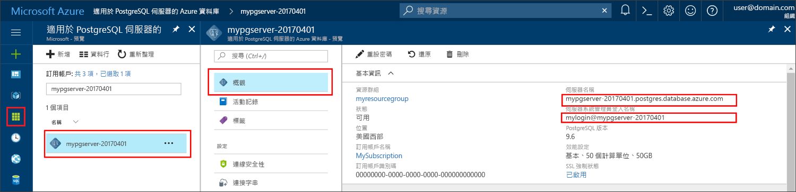

# <a name="azure-database-for-postgresql-use-php-to-connect-and-query-data"></a><span data-ttu-id="288ad-103">Azure Database for PostgreSQL︰使用 PHP 連線及查詢資料</span><span class="sxs-lookup"><span data-stu-id="288ad-103">Azure Database for PostgreSQL: Use PHP to connect and query data</span></span>
<span data-ttu-id="288ad-104">本快速入門示範如何使用 [PHP](http://php.net/manual/intro-whatis.php) 應用程式來連線到 Azure Database for PostgreSQL。</span><span class="sxs-lookup"><span data-stu-id="288ad-104">This quickstart demonstrates how to connect to an Azure Database for PostgreSQL using a [PHP](http://php.net/manual/intro-whatis.php) application.</span></span> <span data-ttu-id="288ad-105">它會顯示如何使用 SQL 陳述式來查詢、插入、更新和刪除資料庫中的資料。</span><span class="sxs-lookup"><span data-stu-id="288ad-105">It shows how to use SQL statements to query, insert, update, and delete data in the database.</span></span> <span data-ttu-id="288ad-106">本文假設您已熟悉使用 PHP 進行開發，但不熟悉 Azure Database for PostgreSQL。</span><span class="sxs-lookup"><span data-stu-id="288ad-106">This article assumes you are familiar with development using PHP, but that you are new to working with Azure Database for PostgreSQL.</span></span>

## <a name="prerequisites"></a><span data-ttu-id="288ad-107">必要條件</span><span class="sxs-lookup"><span data-stu-id="288ad-107">Prerequisites</span></span>
<span data-ttu-id="288ad-108">本快速入門使用在以下任一指南中建立的資源作為起點︰</span><span class="sxs-lookup"><span data-stu-id="288ad-108">This quickstart uses the resources created in either of these guides as a starting point:</span></span>
- [<span data-ttu-id="288ad-109">建立 DB - 入口網站</span><span class="sxs-lookup"><span data-stu-id="288ad-109">Create DB - Portal</span></span>](quickstart-create-server-database-portal.md)
- [<span data-ttu-id="288ad-110">建立 DB - Azure CLI</span><span class="sxs-lookup"><span data-stu-id="288ad-110">Create DB - Azure CLI</span></span>](quickstart-create-server-database-azure-cli.md)

## <a name="install-php"></a><span data-ttu-id="288ad-111">安裝 PHP</span><span class="sxs-lookup"><span data-stu-id="288ad-111">Install PHP</span></span>
<span data-ttu-id="288ad-112">在自己的伺服器上安裝 PHP，或建立 Azure [Web 應用程式](https://docs.microsoft.com/en-us/azure/app-service-web/app-service-web-overview) (包括 PHP)。</span><span class="sxs-lookup"><span data-stu-id="288ad-112">Install PHP on your own server, or create an Azure [web app](https://docs.microsoft.com/en-us/azure/app-service-web/app-service-web-overview) that includes PHP.</span></span>

### <a name="windows"></a><span data-ttu-id="288ad-113">Windows</span><span class="sxs-lookup"><span data-stu-id="288ad-113">Windows</span></span>
- <span data-ttu-id="288ad-114">下載 [PHP 7.1.4 非執行緒安全 (x64) 版本](http://windows.php.net/download#php-7.1)</span><span class="sxs-lookup"><span data-stu-id="288ad-114">Download [PHP 7.1.4 non-thread safe (x64) version](http://windows.php.net/download#php-7.1)</span></span>
- <span data-ttu-id="288ad-115">安裝 PHP 並參考 [PHP 手冊](http://php.net/manual/install.windows.php)以便進一步設定</span><span class="sxs-lookup"><span data-stu-id="288ad-115">Install PHP and refer to the [PHP manual](http://php.net/manual/install.windows.php) for further configuration</span></span>
- <span data-ttu-id="288ad-116">程式碼會使用 PHP 安裝內含的 **pgsql** 類別 (ext/php_pgsql.dll)。</span><span class="sxs-lookup"><span data-stu-id="288ad-116">The code uses the **pgsql** class (ext/php_pgsql.dll)  that is included in the PHP installation.</span></span> 
- <span data-ttu-id="288ad-117">藉由編輯 php.ini 組態 (通常位於 `C:\Program Files\PHP\v7.1\php.ini`)，啟用 **pgsql** 擴充功能。</span><span class="sxs-lookup"><span data-stu-id="288ad-117">Enabled the **pgsql** extension by editing the php.ini configuration file, typically located at `C:\Program Files\PHP\v7.1\php.ini`.</span></span> <span data-ttu-id="288ad-118">組態檔應包含具有 `extension=php_pgsql.so` 文字的一行。</span><span class="sxs-lookup"><span data-stu-id="288ad-118">The configuration file should contain a line with the text `extension=php_pgsql.so`.</span></span> <span data-ttu-id="288ad-119">如果未顯示，請新增文字並儲存檔案。</span><span class="sxs-lookup"><span data-stu-id="288ad-119">If it is not shown, add the text and save the file.</span></span> <span data-ttu-id="288ad-120">如果此文字存在，但以分號前置詞標註，請藉由移除分號來取消註解文字。</span><span class="sxs-lookup"><span data-stu-id="288ad-120">If the text is present, but commented with a semicolon prefix, uncomment the text by removing the semicolon.</span></span>

### <a name="linux-ubuntu"></a><span data-ttu-id="288ad-121">Linux (Ubuntu)</span><span class="sxs-lookup"><span data-stu-id="288ad-121">Linux (Ubuntu)</span></span>
- <span data-ttu-id="288ad-122">下載 [PHP 7.1.4 非執行緒安全 (x64) 版本](http://php.net/downloads.php)</span><span class="sxs-lookup"><span data-stu-id="288ad-122">Download [PHP 7.1.4 non-thread safe (x64) version](http://php.net/downloads.php)</span></span> 
- <span data-ttu-id="288ad-123">安裝 PHP 並參考 [PHP 手冊](http://php.net/manual/install.unix.php)以便進一步設定</span><span class="sxs-lookup"><span data-stu-id="288ad-123">Install PHP and refer to the [PHP manual](http://php.net/manual/install.unix.php) for further configuration</span></span>
- <span data-ttu-id="288ad-124">程式碼會使用 **pgsql** 類別 (php_pgsql.so)。</span><span class="sxs-lookup"><span data-stu-id="288ad-124">The code uses the **pgsql** class (php_pgsql.so).</span></span> <span data-ttu-id="288ad-125">透過執行 `sudo apt-get install php-pgsql` 來進行安裝。</span><span class="sxs-lookup"><span data-stu-id="288ad-125">Install it by running `sudo apt-get install php-pgsql`.</span></span>
- <span data-ttu-id="288ad-126">藉由編輯 `/etc/php/7.0/mods-available/pgsql.ini` 組態檔，啟用 **pgsql** 擴充功能。</span><span class="sxs-lookup"><span data-stu-id="288ad-126">Enabled the **pgsql** extension by editing the `/etc/php/7.0/mods-available/pgsql.ini` configuration file.</span></span> <span data-ttu-id="288ad-127">組態檔應包含具有 `extension=php_pgsql.so` 文字的一行。</span><span class="sxs-lookup"><span data-stu-id="288ad-127">The configuration file should contain a line with the text `extension=php_pgsql.so`.</span></span> <span data-ttu-id="288ad-128">如果未顯示，請新增文字並儲存檔案。</span><span class="sxs-lookup"><span data-stu-id="288ad-128">If it is not shown, add the text and save the file.</span></span> <span data-ttu-id="288ad-129">如果此文字存在，但以分號前置詞標註，請藉由移除分號來取消註解文字。</span><span class="sxs-lookup"><span data-stu-id="288ad-129">If the text is present, but commented with a semicolon prefix, uncomment the text by removing the semicolon.</span></span>

### <a name="macos"></a><span data-ttu-id="288ad-130">MacOS</span><span class="sxs-lookup"><span data-stu-id="288ad-130">MacOS</span></span>
- <span data-ttu-id="288ad-131">下載 [PHP 7.1.4 版本](http://php.net/downloads.php)</span><span class="sxs-lookup"><span data-stu-id="288ad-131">Download [PHP 7.1.4 version](http://php.net/downloads.php)</span></span>
- <span data-ttu-id="288ad-132">安裝 PHP 並參考 [PHP 手冊](http://php.net/manual/install.macosx.php)以便進一步設定</span><span class="sxs-lookup"><span data-stu-id="288ad-132">Install PHP and refer to the [PHP manual](http://php.net/manual/install.macosx.php) for further configuration</span></span>

## <a name="get-connection-information"></a><span data-ttu-id="288ad-133">取得連線資訊</span><span class="sxs-lookup"><span data-stu-id="288ad-133">Get connection information</span></span>
<span data-ttu-id="288ad-134">取得連線到 Azure Database for PostgreSQL 所需的連線資訊。</span><span class="sxs-lookup"><span data-stu-id="288ad-134">Get the connection information needed to connect to the Azure Database for PostgreSQL.</span></span> <span data-ttu-id="288ad-135">您需要完整的伺服器名稱和登入認證。</span><span class="sxs-lookup"><span data-stu-id="288ad-135">You need the fully qualified server name and login credentials.</span></span>

1. <span data-ttu-id="288ad-136">登入 [Azure 入口網站](https://portal.azure.com/)。</span><span class="sxs-lookup"><span data-stu-id="288ad-136">Log in to the [Azure portal](https://portal.azure.com/).</span></span>
2. <span data-ttu-id="288ad-137">從 Azure 入口網站的左側功能表中，按一下 [所有資源]，然後搜尋您所建立的伺服器，例如 **mypgserver-20170401**。</span><span class="sxs-lookup"><span data-stu-id="288ad-137">From the left-hand menu in Azure portal, click **All resources** and search for the server you have created, such as **mypgserver-20170401**.</span></span>
3. <span data-ttu-id="288ad-138">按一下伺服器名稱 [mypgserver-20170401]。</span><span class="sxs-lookup"><span data-stu-id="288ad-138">Click the server name **mypgserver-20170401**.</span></span>
4. <span data-ttu-id="288ad-139">選取伺服器的 [概觀] 頁面。</span><span class="sxs-lookup"><span data-stu-id="288ad-139">Select the server's **Overview** page.</span></span> <span data-ttu-id="288ad-140">記下 [伺服器名稱] 和 [伺服器管理員登入名稱]。</span><span class="sxs-lookup"><span data-stu-id="288ad-140">Make a note of the **Server name** and **Server admin login name**.</span></span>
 <span data-ttu-id="288ad-141"></span><span class="sxs-lookup"><span data-stu-id="288ad-141"></span></span>
5. <span data-ttu-id="288ad-142">如果您忘記伺服器登入資訊，請瀏覽至 [概觀] 頁面來檢視伺服器管理員登入名稱，並視需要重設密碼。</span><span class="sxs-lookup"><span data-stu-id="288ad-142">If you forget your server login information, navigate to the **Overview** page to view the Server admin login name and, if necessary, reset the password.</span></span>

## <a name="connect-and-create-a-table"></a><span data-ttu-id="288ad-143">連線及建立資料表</span><span class="sxs-lookup"><span data-stu-id="288ad-143">Connect and create a table</span></span>
<span data-ttu-id="288ad-144">使用下列程式碼搭配 **CREATE TABLE** SQL 陳述式 (後面接著 **INSERT INTO** SQL 陳述式) 來連線和建立資料表，進而將資料列新增至資料表中。</span><span class="sxs-lookup"><span data-stu-id="288ad-144">Use the following code to connect and create a table using **CREATE TABLE** SQL statement, followed by **INSERT INTO** SQL statements to add rows into the table.</span></span>

<span data-ttu-id="288ad-145">程式碼會呼叫 [pg_connect()](http://php.net/manual/en/function.pg-connect.php) 方法以連線至 Azure Database for PostgreSQL。</span><span class="sxs-lookup"><span data-stu-id="288ad-145">The code call method [pg_connect()](http://php.net/manual/en/function.pg-connect.php) to connect to Azure Database for PostgreSQL.</span></span> <span data-ttu-id="288ad-146">然後它會呼叫 [pg_query()](http://php.net/manual/en/function.pg-query.php) 方法數次來執行數個命令，以及呼叫 [pg_last_error()](http://php.net/manual/en/function.pg-last-error.php) 來檢查詳細資料，是否每次都會發生錯誤。</span><span class="sxs-lookup"><span data-stu-id="288ad-146">Then it calls method [pg_query()](http://php.net/manual/en/function.pg-query.php) several times to run several commands, and [pg_last_error()](http://php.net/manual/en/function.pg-last-error.php) to check the details if an error occurred each time.</span></span> <span data-ttu-id="288ad-147">然後它會呼叫 [pg_close()](http://php.net/manual/en/function.pg-close.php) 方法來關閉連線。</span><span class="sxs-lookup"><span data-stu-id="288ad-147">Then it calls method [pg_close()](http://php.net/manual/en/function.pg-close.php) to close the connection.</span></span>

<span data-ttu-id="288ad-148">以您自己的值取代 `$host`、`$database`、`$user` 和 `$password` 參數。</span><span class="sxs-lookup"><span data-stu-id="288ad-148">Replace the `$host`, `$database`, `$user`, and `$password` parameters with your own values.</span></span> 

```php
<?php
    // Initialize connection variables.
    $host = "mypgserver-20170401.postgres.database.azure.com";
    $database = "mypgsqldb";
    $user = "mylogin@mypgserver-20170401";
    $password = "<server_admin_password>";

    // Initialize connection object.
    $connection = pg_connect("host=$host dbname=$database user=$user password=$password") 
        or die("Failed to create connection to database: ". pg_last_error(). "<br/>");
    print "Successfully created connection to database.<br/>";

    // Drop previous table of same name if one exists.
    $query = "DROP TABLE IF EXISTS inventory;";
    pg_query($connection, $query) 
        or die("Encountered an error when executing given sql statement: ". pg_last_error(). "<br/>");
    print "Finished dropping table (if existed).<br/>";

    // Create table.
    $query = "CREATE TABLE inventory (id serial PRIMARY KEY, name VARCHAR(50), quantity INTEGER);";
    pg_query($connection, $query) 
        or die("Encountered an error when executing given sql statement: ". pg_last_error(). "<br/>");
    print "Finished creating table.<br/>";

    // Insert some data into table.
    $name = '\'banana\'';
    $quantity = 150;
    $query = "INSERT INTO inventory (name, quantity) VALUES ($1, $2);";
    pg_query($connection, $query) 
        or die("Encountered an error when executing given sql statement: ". pg_last_error(). "<br/>");

    $name = '\'orange\'';
    $quantity = 154;
    $query = "INSERT INTO inventory (name, quantity) VALUES ($name, $quantity);";
    pg_query($connection, $query) 
        or die("Encountered an error when executing given sql statement: ". pg_last_error(). "<br/>");

    $name = '\'apple\'';
    $quantity = 100;
    $query = "INSERT INTO inventory (name, quantity) VALUES ($name, $quantity);";
    pg_query($connection, $query) 
        or die("Encountered an error when executing given sql statement: ". pg_last_error()). "<br/>";

    print "Inserted 3 rows of data.<br/>";

    // Closing connection
    pg_close($connection);
?>
```

## <a name="read-data"></a><span data-ttu-id="288ad-149">讀取資料</span><span class="sxs-lookup"><span data-stu-id="288ad-149">Read data</span></span>
<span data-ttu-id="288ad-150">使用下列程式碼搭配 **SELECT** SQL 陳述式來連線和讀取資料。</span><span class="sxs-lookup"><span data-stu-id="288ad-150">Use the following code to connect and read the data using a **SELECT** SQL statement.</span></span> 

 <span data-ttu-id="288ad-151">程式碼會呼叫 [pg_connect()](http://php.net/manual/en/function.pg-connect.php) 方法以連線至 Azure Database for PostgreSQL。</span><span class="sxs-lookup"><span data-stu-id="288ad-151">The code call method [pg_connect()](http://php.net/manual/en/function.pg-connect.php) to connect to Azure Database for PostgreSQL.</span></span> <span data-ttu-id="288ad-152">然後它會呼叫 [pg_query()](http://php.net/manual/en/function.pg-query.php) 方法來執行 SELECT 命令，並將結果保留在結果集中，以及呼叫 [pg_last_error()](http://php.net/manual/en/function.pg-last-error.php) 來檢查詳細資料，是否發生錯誤。</span><span class="sxs-lookup"><span data-stu-id="288ad-152">Then it calls method [pg_query()](http://php.net/manual/en/function.pg-query.php) to run the SELECT command, keeping the results in a result set, and [pg_last_error()](http://php.net/manual/en/function.pg-last-error.php) to check the details if an error occurred.</span></span>  <span data-ttu-id="288ad-153">若要讀取結果集，則會在迴圈中呼叫 [pg_fetch_row()](http://php.net/manual/en/function.pg-fetch-row.php) 方法 (每列一次)，並在 `$row` 陣列中擷取資料列資料，而每個陣列位置中的每個資料行都有一個資料值。</span><span class="sxs-lookup"><span data-stu-id="288ad-153">To read the result set, method [pg_fetch_row()](http://php.net/manual/en/function.pg-fetch-row.php) is called in a loop, once per row, and the row data is retrieved in an array `$row`, with one data value per column in each array position.</span></span>  <span data-ttu-id="288ad-154">若要釋出結果集，則會呼叫 [pg_free_result()](http://php.net/manual/en/function.pg-free-result.php)。</span><span class="sxs-lookup"><span data-stu-id="288ad-154">To free the result set, method [pg_free_result()](http://php.net/manual/en/function.pg-free-result.php) is called.</span></span> <span data-ttu-id="288ad-155">然後它會呼叫 [pg_close()](http://php.net/manual/en/function.pg-close.php) 方法來關閉連線。</span><span class="sxs-lookup"><span data-stu-id="288ad-155">Then it calls method [pg_close()](http://php.net/manual/en/function.pg-close.php) to close the connection.</span></span>

<span data-ttu-id="288ad-156">以您自己的值取代 `$host`、`$database`、`$user` 和 `$password` 參數。</span><span class="sxs-lookup"><span data-stu-id="288ad-156">Replace the `$host`, `$database`, `$user`, and `$password` parameters with your own values.</span></span> 

```php
<?php
    // Initialize connection variables.
    $host = "mypgserver-20170401.postgres.database.azure.com";
    $database = "mypgsqldb";
    $user = "mylogin@mypgserver-20170401";
    $password = "<server_admin_password>";
    
    // Initialize connection object.
    $connection = pg_connect("host=$host dbname=$database user=$user password=$password")
                or die("Failed to create connection to database: ". pg_last_error(). "<br/>");

    print "Successfully created connection to database. <br/>";

    // Perform some SQL queries over the connection.
    $query = "SELECT * from inventory";
    $result_set = pg_query($connection, $query) 
        or die("Encountered an error when executing given sql statement: ". pg_last_error(). "<br/>");
    while ($row = pg_fetch_row($result_set))
    {
        print "Data row = ($row[0], $row[1], $row[2]). <br/>";
    }

    // Free result_set
    pg_free_result($result_set);

    // Closing connection
    pg_close($connection);
?>
```

## <a name="update-data"></a><span data-ttu-id="288ad-157">更新資料</span><span class="sxs-lookup"><span data-stu-id="288ad-157">Update data</span></span>
<span data-ttu-id="288ad-158">使用下列程式碼搭配 **UPDATE** SQL 陳述式來連線和更新資料。</span><span class="sxs-lookup"><span data-stu-id="288ad-158">Use the following code to connect and update the data using a **UPDATE** SQL statement.</span></span>

<span data-ttu-id="288ad-159">程式碼會呼叫 [pg_connect()](http://php.net/manual/en/function.pg-connect.php) 方法以連線至 Azure Database for PostgreSQL。</span><span class="sxs-lookup"><span data-stu-id="288ad-159">The code call method [pg_connect()](http://php.net/manual/en/function.pg-connect.php) to connect to Azure Database for PostgreSQL.</span></span> <span data-ttu-id="288ad-160">然後它會呼叫 [pg_query()](http://php.net/manual/en/function.pg-query.php) 方法來執行命令，以及呼叫 [pg_last_error()](http://php.net/manual/en/function.pg-last-error.php) 來檢查詳細資料，是否會發生錯誤。</span><span class="sxs-lookup"><span data-stu-id="288ad-160">Then it calls method [pg_query()](http://php.net/manual/en/function.pg-query.php) to run a command, and [pg_last_error()](http://php.net/manual/en/function.pg-last-error.php) to check the details if an error occurred.</span></span> <span data-ttu-id="288ad-161">然後它會呼叫 [pg_close()](http://php.net/manual/en/function.pg-close.php) 方法來關閉連線。</span><span class="sxs-lookup"><span data-stu-id="288ad-161">Then it calls method [pg_close()](http://php.net/manual/en/function.pg-close.php) to close the connection.</span></span>

<span data-ttu-id="288ad-162">以您自己的值取代 `$host`、`$database`、`$user` 和 `$password` 參數。</span><span class="sxs-lookup"><span data-stu-id="288ad-162">Replace the `$host`, `$database`, `$user`, and `$password` parameters with your own values.</span></span> 

```php
<?php
    // Initialize connection variables.
    $host = "mypgserver-20170401.postgres.database.azure.com";
    $database = "mypgsqldb";
    $user = "mylogin@mypgserver-20170401";
    $password = "<server_admin_password>";

    // Initialize connection object.
    $connection = pg_connect("host=$host dbname=$database user=$user password=$password")
                or die("Failed to create connection to database: ". pg_last_error(). ".<br/>");

    print "Successfully created connection to database. <br/>";

    // Modify some data in table.
    $new_quantity = 200;
    $name = '\'banana\'';
    $query = "UPDATE inventory SET quantity = $new_quantity WHERE name = $name;";
    pg_query($connection, $query) 
        or die("Encountered an error when executing given sql statement: ". pg_last_error(). ".<br/>");
    print "Updated 1 row of data. </br>";

    // Closing connection
    pg_close($connection);
?>
```


## <a name="delete-data"></a><span data-ttu-id="288ad-163">刪除資料</span><span class="sxs-lookup"><span data-stu-id="288ad-163">Delete data</span></span>
<span data-ttu-id="288ad-164">使用下列程式碼搭配 **DELETE** SQL 陳述式來連線和讀取資料。</span><span class="sxs-lookup"><span data-stu-id="288ad-164">Use the following code to connect and read the data using a **DELETE** SQL statement.</span></span> 

 <span data-ttu-id="288ad-165">程式碼會呼叫 [pg_connect()](http://php.net/manual/en/function.pg-connect.php) 方法以連線至 Azure Database for PostgreSQL。</span><span class="sxs-lookup"><span data-stu-id="288ad-165">The code call method [pg_connect()](http://php.net/manual/en/function.pg-connect.php) to connect to  Azure Database for PostgreSQL.</span></span> <span data-ttu-id="288ad-166">然後它會呼叫 [pg_query()](http://php.net/manual/en/function.pg-query.php) 方法來執行命令，以及呼叫 [pg_last_error()](http://php.net/manual/en/function.pg-last-error.php) 來檢查詳細資料，是否會發生錯誤。</span><span class="sxs-lookup"><span data-stu-id="288ad-166">Then it calls method [pg_query()](http://php.net/manual/en/function.pg-query.php) to run a command, and [pg_last_error()](http://php.net/manual/en/function.pg-last-error.php) to check the details if an error occurred.</span></span> <span data-ttu-id="288ad-167">然後它會呼叫 [pg_close()](http://php.net/manual/en/function.pg-close.php) 方法來關閉連線。</span><span class="sxs-lookup"><span data-stu-id="288ad-167">Then it calls method [pg_close()](http://php.net/manual/en/function.pg-close.php) to close the connection.</span></span>

<span data-ttu-id="288ad-168">以您自己的值取代 `$host`、`$database`、`$user` 和 `$password` 參數。</span><span class="sxs-lookup"><span data-stu-id="288ad-168">Replace the `$host`, `$database`, `$user`, and `$password` parameters with your own values.</span></span> 

```php
<?php
    // Initialize connection variables.
    $host = "mypgserver-20170401.postgres.database.azure.com";
    $database = "mypgsqldb";
    $user = "mylogin@mypgserver-20170401";
    $password = "<server_admin_password>";

    // Initialize connection object.
    $connection = pg_connect("host=$host dbname=$database user=$user password=$password")
            or die("Failed to create connection to database: ". pg_last_error(). ". </br>");

    print "Successfully created connection to database. <br/>";

    // Delete some data from table.
    $name = '\'orange\'';
    $query = "DELETE FROM inventory WHERE name = $name;";
    pg_query($connection, $query) 
        or die("Encountered an error when executing given sql statement: ". pg_last_error(). ". <br/>");
    print "Deleted 1 row of data. <br/>";

    // Closing connection
    pg_close($connection);
?>
```

## <a name="next-steps"></a><span data-ttu-id="288ad-169">後續步驟</span><span class="sxs-lookup"><span data-stu-id="288ad-169">Next steps</span></span>
> [!div class="nextstepaction"]
> [<span data-ttu-id="288ad-170">使用匯出和匯入來移轉資料庫</span><span class="sxs-lookup"><span data-stu-id="288ad-170">Migrate your database using Export and Import</span></span>](./howto-migrate-using-export-and-import.md)
