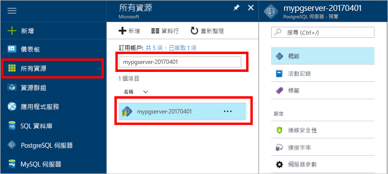

# TooBackup 和還原 Azure 資料庫中的伺服器使用 PostgreSQL hello Azure 入口網站How tooBackup and Restore a server in Azure Database for PostgreSQL using hello Azure portal

## 備份會自動進行Backup happens Automatically
當使用 Azure 資料庫的 PostgreSQL，hello 資料庫服務會自動將 hello 服務的備份每隔 5 分鐘。When using Azure Database for PostgreSQL, hello database service automatically makes a backup of hello service every 5 minutes. 

hello 備份時，可以使用 7 天內使用基本層次中，則為 35 天使用標準層時。hello backups are available for 7 days when using Basic Tier, and 35 days when using Standard Tier. 如需詳細資訊，請參閱[適用於 PostgreSQL 的 Azure 資料庫服務層](concepts-service-tiers.md)For more information, see [Azure Database for PostgreSQL service tiers](concepts-service-tiers.md)

使用這個自動備份功能您可能會到新伺服器 tooan 稍早的時間點還原 hello 伺服器及其所有資料庫。Using this automatic backup feature you may restore hello server and all its databases into a new server tooan earlier point-in-time.

## 將還原的 hello Azure 入口網站Restore in hello Azure portal
Azure PostgreSQL 資料庫可讓您 toorestore hello 伺服器回復 tooa 點的時間，並置於 tooa hello 伺服器新複本。Azure Database for PostgreSQL allows you toorestore hello server back tooa point in time and into tooa new copy of hello server. 您可以使用這個新的伺服器 toorecover 您的資料。You can use this new server toorecover your data. 

比方說，如果資料表已意外卸除正午現在，您無法還原 toohello 正午之前的時間，擷取 hello 遺漏的資料表和資料從 hello 伺服器的新複本。For example, if a table was accidentally dropped at noon today, you could restore toohello time just before noon and retrieve hello missing table and data from that new copy of hello server.

hello 下列的步驟還原 hello 範例伺服器 tooa 點時間：hello following steps restore hello sample server tooa point in time:
1. 登入 hello [Azure 入口網站](https://portal.azure.com/)Sign into hello [Azure portal](https://portal.azure.com/)
2. 找出您的「適用於 PostgreSQL 的 Azure 資料庫」伺服器。Locate your Azure Database for PostgreSQL server. 在 hello Azure 入口網站，按一下**所有資源**從 hello 左側功能表，然後輸入 hello 名稱，例如**mypgserver 20170401**，toosearch 您現有的伺服器。In hello Azure portal, click **All Resources** from hello left-hand menu and type in hello name, such as **mypgserver-20170401**, toosearch for your existing server. 按一下 hello hello 搜尋結果中所列的伺服器名稱。Click hello server name listed in hello search result. hello**概觀**頁面會針對您的伺服器會開啟，並提供進一步組態的選項。hello **Overview** page for your server opens and provides options for further configuration.

   

3. 在 hello hello 伺服器概觀刀鋒視窗頂端，按一下 **還原**hello 工具列上。On hello top of hello server overview blade, click **Restore** on hello toolbar. hello 還原刀鋒視窗隨即開啟。hello Restore blade opens.

   

4. 填寫 hello 還原表單 hello 所需的資訊：Fill out hello Restore form with hello required information:

   
  - **還原點**： 選取在時間點所發生之前 hello 伺服器已變更**Restore point**: Select a point-in-time that occurs before hello server was changed
  - **目標伺服器**： 提供新的伺服器名稱，您想要 toorestore**Target server**: Provide a new server name you want toorestore to
  - **位置**： 您無法選取 hello 區域，依預設它是與 hello 來源伺服器相同**Location**: You cannot select hello region, by default it is same as hello source server
  - **定價層**︰還原伺服器時，您無法變更此值。**Pricing tier**: You cannot change this value when restoring a server. 它是與 hello 來源伺服器相同。It is same as hello source server. 

5. 按一下**確定**toorestore hello 伺服器 toorestore tooa 時間點。Click **OK** toorestore hello server toorestore tooa point in time. 

6. 一旦 hello 還原完成時，找出 hello 建立 tooverify hello 如預期般，已還原資料的新伺服器。Once hello restore finishes, locate hello new server that is created tooverify hello data was restored as expected.

## 後續步驟Next steps
- [「適用於 PostgreSQL 的 Azure 資料庫」的連線庫Connection libraries for Azure Database for PostgreSQL](concepts-connection-libraries.md)
