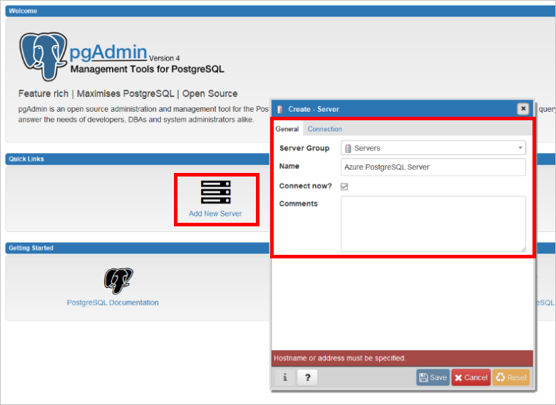

# <a name="create-an-azure-database-for-postgresql-using-hello-azure-cli"></a>建立 Azure 資料庫，使用 Azure CLI hello PostgreSQL
Azure PostgreSQL 資料庫是受管理的服務，可讓您 toorun、 管理及調整 hello 雲端中的高可用性 PostgreSQL 資料庫。 hello Azure CLI 會使用的 toocreate 和管理 Azure 資源，從 hello 命令列或指令碼中。 本快速入門示範如何 toocreate Azure 資料庫中的 PostgreSQL 伺服器[Azure 資源群組](https://docs.microsoft.com/azure/azure-resource-manager/resource-group-overview)使用 hello Azure CLI。

如果您沒有 Azure 訂用帳戶，請在開始前建立[免費帳戶](https://azure.microsoft.com/free/) 。

[!INCLUDE [cloud-shell-try-it](../../includes/cloud-shell-try-it.md)]

如果您選擇 tooinstall，並在本機上使用 hello CLI，本主題會需要您執行 hello Azure CLI 版本 2.0 或更新版本。 執行`az --version`toofind hello 版本。 如果您需要 tooinstall 或升級，請參閱[安裝 Azure CLI 2.0]( /cli/azure/install-azure-cli)。 

如果您有多個訂閱，請選擇 計費 hello 資源 hello 適當訂用帳戶。 使用 [az account set](/cli/azure/account#set) 命令來選取您帳戶底下的特定訂用帳戶 ID。
```azurecli-interactive
az account set --subscription 00000000-0000-0000-0000-000000000000
```

## <a name="create-a-resource-group"></a>建立資源群組

建立[Azure 資源群組](../azure-resource-manager/resource-group-overview.md)使用 hello [az 群組建立](/cli/azure/group#create)命令。 資源群組是在其中以群組方式部署與管理 Azure 資源的邏輯容器。 hello 下列範例會建立名為的資源群組`myresourcegroup`在 hello`westus`位置。
```azurecli-interactive
az group create --name myresourcegroup --location westus
```

## <a name="create-an-azure-database-for-postgresql-server"></a>建立適用於 PostgreSQL 的 Azure 資料庫伺服器

建立[PostgreSQL server 的 Azure 資料庫](overview.md)使用 hello [az postgres 伺服器建立](/cli/azure/postgres/server#create)命令。 一個伺服器會包含一組以群組方式管理的資料庫。 

hello 下列範例會建立一個名為伺服器`mypgserver-20170401`資源群組中`myresourcegroup`與伺服器系統管理員登入`mylogin`。 伺服器 hello 名稱 tooDNS 名稱對應，因此在 Azure 中全域唯一的必要的 toobe。 替代 hello`<server_admin_password>`與您自己的值。
```azurecli-interactive
az postgres server create --resource-group myresourcegroup --name mypgserver-20170401  --location westus --admin-user mylogin --admin-password <server_admin_password> --performance-tier Basic --compute-units 50 --version 9.6
```

> [!IMPORTANT]
> hello 伺服器系統管理員登入和密碼，您在此處指定為 toohello server 中的必要的 toolog 和其資料庫，稍後在這個快速入門。 請記住或記錄此資訊，以供稍後使用。

根據預設，**postgres** 資料庫會建立在您的伺服器底下。 hello [postgres](https://www.postgresql.org/docs/9.6/static/app-initdb.html)資料庫是適用於由使用者、 公用程式及協力廠商應用程式的預設資料庫。 


## <a name="configure-a-server-level-firewall-rule"></a>設定伺服器層級防火牆規則

建立 Azure PostgreSQL 伺服器層級防火牆規則以 hello [az postgres 伺服器防火牆規則建立](/cli/azure/postgres/server/firewall-rule#create)命令。 伺服器層級防火牆規則允許外部應用程式，例如[psql](https://www.postgresql.org/docs/9.2/static/app-psql.html)或[PgAdmin](https://www.pgadmin.org/) tooconnect tooyour 伺服器透過 hello Azure PostgreSQL 服務防火牆。 

您可以設定防火牆規則，它涵蓋了 IP 範圍 toobe 無法 tooconnect 從您的網路。 hello 下列範例會使用[az postgres 伺服器防火牆規則建立](/cli/azure/postgres/server/firewall-rule#create)toocreate 防火牆規則`AllowAllIps`ip 位址範圍。 tooopen 所有 IP 位址，都作為 hello 起始 IP 位址和 255.255.255.255 hello 結束位址為 0.0.0.0。
```azurecli-interactive
az postgres server firewall-rule create --resource-group myresourcegroup --server mypgserver-20170401 --name AllowAllIps --start-ip-address 0.0.0.0 --end-ip-address 255.255.255.255
```

> [!NOTE]
> Azure PostgreSQL 伺服器會透過連接埠 5432 進行通訊。 當您從公司網路內進行連線時，網路的防火牆可能不允許透過連接埠 5432 的輸出流量。 具有您開啟通訊埠 5432 tooconnect tooyour Azure SQL Database 伺服器的 IT 部門。

## <a name="get-hello-connection-information"></a>取得 hello 的連接資訊

tooconnect tooyour 伺服器，您需要 tooprovide 主機資訊和存取認證。
```azurecli-interactive
az postgres server show --resource-group myresourcegroup --name mypgserver-20170401
```

hello 結果是以 JSON 格式。 請記下 hello **administratorLogin**和**fullyQualifiedDomainName**。
```json
{
  "administratorLogin": "mylogin",
  "fullyQualifiedDomainName": "mypgserver-20170401.postgres.database.azure.com",
  "id": "/subscriptions/00000000-0000-0000-0000-000000000000/resourceGroups/myresourcegroup/providers/Microsoft.DBforPostgreSQL/servers/mypgserver-20170401",
  "location": "westus",
  "name": "mypgserver-20170401",
  "resourceGroup": "myresourcegroup",
  "sku": {
    "capacity": 50,
    "family": null,
    "name": "PGSQLS2M50",
    "size": null,
    "tier": "Basic"
  },
  "sslEnforcement": null,
  "storageMb": 51200,
  "tags": null,
  "type": "Microsoft.DBforPostgreSQL/servers",
  "userVisibleState": "Ready",
  "version": "9.6"
}
```

## <a name="connect-toopostgresql-database-using-psql"></a>連接使用 psql tooPostgreSQL 資料庫

如果您的用戶端電腦已安裝的 PostgreSQL，您可以使用的本機執行個體[psql](https://www.postgresql.org/docs/9.6/static/app-psql.html) tooconnect tooan Azure PostgreSQL 伺服器。 我們現在使用 hello psql 命令列公用程式 tooconnect toohello Azure PostgreSQL 伺服器。

1. 執行下列 psql 命令 tooconnect tooan Azure Database PostgreSQL 伺服器 hello
```azurecli-interactive
psql --host=<servername> --port=<port> --username=<user@servername> --dbname=<dbname>
```

  比方說，下列命令的 hello 連接 toohello 預設資料庫呼叫**postgres** PostgreSQL 伺服器上**mypgserver 20170401.postgres.database.azure.com**使用存取認證。 輸入 hello`<server_admin_password>`您選擇當系統提示您輸入密碼。
  
  ```azurecli-interactive
psql --host=mypgserver-20170401.postgres.database.azure.com --port=5432 --username=mylogin@mypgserver-20170401 --dbname=postgres
```

2.  一旦您已連線的 toohello 伺服器，建立一個空白資料庫在 hello 提示字元。
```sql
CREATE DATABASE mypgsqldb;
```

3.  在 hello 提示字元中執行下列命令 tooswitch 連線 toohello 新建資料庫的 hello **mypgsqldb**:
```sql
\c mypgsqldb
```

## <a name="connect-toopostgresql-database-using-pgadmin"></a>連接使用 pgAdmin tooPostgreSQL 資料庫

使用 hello GUI 工具 tooconnect tooAzure PostgreSQL 伺服器_pgAdmin_
1.  啟動 hello _pgAdmin_應用程式用戶端電腦上。 您可以從 http://www.pgadmin.org/ 安裝 _pgAdmin_。
2.  選擇**新增伺服器**從 hello**快速連結**功能表。
3.  在 hello**建立-伺服器**對話方塊**一般**索引標籤上，輸入 hello 伺服器的唯一易記名稱。 例如 **Azure PostgreSQL 伺服器**。
 
4.  在 [hello**建立-伺服器**對話方塊中，**連接**] 索引標籤：
    - 輸入 hello 完整的伺服器名稱 (例如， **mypgserver 20170401.postgres.database.azure.com**) 在 hello**主機名稱 / 位址**方塊。 
    - 輸入連接埠 5432 hello**連接埠**方塊。 
    - 輸入 hello **Server 系統管理員登入 (user@mypgserver)**稍早在此快速入門和您建立 hello hello 伺服器時輸入的密碼取得**Username**和**密碼**方塊中分別。
    - 將 [SSL 模式] 選取為 [必要]。 根據預設，所有的 Azure PostgreSQL 伺服器建立時都會開啟強制使用 SSL。 tooturn 關閉 SSL 強制執行，請參閱詳細資料中的[強制 SSL](./concepts-ssl-connection-security.md)。

    
5.  按一下 [儲存] 。
6.  Hello 瀏覽器左窗格中，展開 hello**伺服器群組**。 選擇您的伺服器 [Azure PostgreSQL 伺服器]。
7.  選擇 hello**伺服器**您連線到，並選擇 **資料庫**其下。 
8.  以滑鼠右鍵按一下**資料庫**tooCreate 資料庫。
9.  選擇資料庫名稱**mypgsqldb**和 hello 擁有者，做為伺服器系統管理員登入**mylogin**。
10. 按一下**儲存**toocreate 空白資料庫。
11. 在 hello**瀏覽器**，依序展開 hello**伺服器**群組。 展開您所建立的 hello 伺服器，並查看 hello 資料庫**mypgsqldb**其下。
 


## <a name="clean-up-resources"></a>清除資源

清除您要建立 hello 快速入門中刪除 hello 的所有資源[Azure 資源群組](../azure-resource-manager/resource-group-overview.md)。

> [!TIP]
> 此集合中的其他快速入門會以本快速入門為基礎。 如果您計劃與後續 toowork toocontinue 快速入門，無法清除不要 hello 建立本快速入門的資源。 如果您不打算 toocontinue，使用下列步驟 toodelete hello 本快速入門中 hello Azure CLI 所建立的所有資源。

```azurecli-interactive
az group delete --name myresourcegroup
```

如果您想要 toodelete hello 一個新建立的伺服器，您可以執行[az postgres 伺服器刪除](/cli/azure/postgres/server#delete)命令。
```azurecli-interactive
az postgres server delete --resource-group myresourcegroup --name mypgserver-20170401
```

## <a name="next-steps"></a>後續步驟
> [!div class="nextstepaction"]
> [使用匯出和匯入來移轉資料庫](./howto-migrate-using-export-and-import.md)
