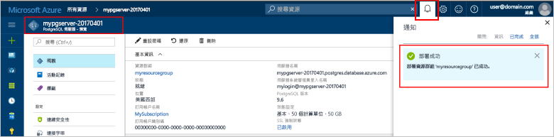

# <a name="create-an-azure-database-for-postgresql-in-hello-azure-portal"></a><span data-ttu-id="ccd5a-103">Hello Azure 入口網站中建立 PostgreSQL Azure 資料庫</span><span class="sxs-lookup"><span data-stu-id="ccd5a-103">Create an Azure Database for PostgreSQL in hello Azure portal</span></span>

<span data-ttu-id="ccd5a-104">Azure PostgreSQL 資料庫是受管理的服務，可讓您 toorun、 管理及調整 hello 雲端中的高可用性 PostgreSQL 資料庫。</span><span class="sxs-lookup"><span data-stu-id="ccd5a-104">Azure Database for PostgreSQL is a managed service that enables you toorun, manage, and scale highly available PostgreSQL databases in hello cloud.</span></span> <span data-ttu-id="ccd5a-105">本快速入門示範如何 toocreate Azure 資料庫 PostgreSQL hello Azure 入口網站使用在五分鐘內的伺服器。</span><span class="sxs-lookup"><span data-stu-id="ccd5a-105">This quickstart shows you how toocreate an Azure Database for PostgreSQL server using hello Azure portal in about five minutes.</span></span>

<span data-ttu-id="ccd5a-106">如果您沒有 Azure 訂用帳戶，請在開始前建立[免費帳戶](https://azure.microsoft.com/free/) 。</span><span class="sxs-lookup"><span data-stu-id="ccd5a-106">If you don't have an Azure subscription, create a [free](https://azure.microsoft.com/free/) account before you begin.</span></span>

## <a name="log-in-toohello-azure-portal"></a><span data-ttu-id="ccd5a-107">登入 toohello Azure 入口網站</span><span class="sxs-lookup"><span data-stu-id="ccd5a-107">Log in toohello Azure portal</span></span>
<span data-ttu-id="ccd5a-108">開啟網頁瀏覽器，並瀏覽 toohello [Microsoft Azure 入口網站](https://portal.azure.com/)。</span><span class="sxs-lookup"><span data-stu-id="ccd5a-108">Open your web browser, and navigate toohello [Microsoft Azure portal](https://portal.azure.com/).</span></span> <span data-ttu-id="ccd5a-109">輸入認證 toosign toohello 入口網站中。</span><span class="sxs-lookup"><span data-stu-id="ccd5a-109">Enter your credentials toosign in toohello portal.</span></span> <span data-ttu-id="ccd5a-110">hello 預設檢視是服務儀表板。</span><span class="sxs-lookup"><span data-stu-id="ccd5a-110">hello default view is your service dashboard.</span></span>

## <a name="create-an-azure-database-for-postgresql"></a><span data-ttu-id="ccd5a-111">建立適用於 PostgreSQL 的 Azure 資料庫</span><span class="sxs-lookup"><span data-stu-id="ccd5a-111">Create an Azure Database for PostgreSQL</span></span>

<span data-ttu-id="ccd5a-112">「適用於 PostgreSQL 的 Azure 資料庫」伺服器是以一組已定義的[計算和儲存體資源](./concepts-compute-unit-and-storage.md)所建立。</span><span class="sxs-lookup"><span data-stu-id="ccd5a-112">An Azure Database for PostgreSQL server is created with a defined set of [compute and storage resources](./concepts-compute-unit-and-storage.md).</span></span> <span data-ttu-id="ccd5a-113">hello 伺服器內建立[Azure 資源群組](../azure-resource-manager/resource-group-overview.md)。</span><span class="sxs-lookup"><span data-stu-id="ccd5a-113">hello server is created within an [Azure resource group](../azure-resource-manager/resource-group-overview.md).</span></span>

<span data-ttu-id="ccd5a-114">請遵循這些步驟 toocreate PostgreSQL server Azure 資料庫：</span><span class="sxs-lookup"><span data-stu-id="ccd5a-114">Follow these steps toocreate an Azure Database for PostgreSQL server:</span></span>
1.  <span data-ttu-id="ccd5a-115">按一下 hello**新增**hello 的左上角 hello Azure 入口網站上找到的按鈕 （+）。</span><span class="sxs-lookup"><span data-stu-id="ccd5a-115">Click hello **New** button (+) found on hello upper left-hand corner of hello Azure portal.</span></span>
2.  <span data-ttu-id="ccd5a-116">選取**資料庫**從 hello**新增**頁面上，並選取**Azure PostgreSQL 資料庫**從 hello**資料庫**頁面。</span><span class="sxs-lookup"><span data-stu-id="ccd5a-116">Select **Databases** from hello **New** page, and select **Azure Database for PostgreSQL** from hello **Databases** page.</span></span>
 <span data-ttu-id="ccd5a-117"></span><span class="sxs-lookup"><span data-stu-id="ccd5a-117"></span></span>

3.  <span data-ttu-id="ccd5a-118">填寫 hello 新伺服器詳細資料表單以下列資訊，hello hello 前面影像所示：</span><span class="sxs-lookup"><span data-stu-id="ccd5a-118">Fill out hello new server details form with hello following information, as shown on hello preceding image:</span></span>

    <span data-ttu-id="ccd5a-119">設定</span><span class="sxs-lookup"><span data-stu-id="ccd5a-119">Setting</span></span>|<span data-ttu-id="ccd5a-120">建議的值</span><span class="sxs-lookup"><span data-stu-id="ccd5a-120">Suggested value</span></span>|<span data-ttu-id="ccd5a-121">說明</span><span class="sxs-lookup"><span data-stu-id="ccd5a-121">Description</span></span>
    ---|---|---
    <span data-ttu-id="ccd5a-122">伺服器名稱</span><span class="sxs-lookup"><span data-stu-id="ccd5a-122">Server name</span></span> |<span data-ttu-id="ccd5a-123">*mypgserver-20170401*</span><span class="sxs-lookup"><span data-stu-id="ccd5a-123">*mypgserver-20170401*</span></span>|<span data-ttu-id="ccd5a-124">選擇可識別 Azure Database for PostgreSQL 伺服器的唯一名稱。</span><span class="sxs-lookup"><span data-stu-id="ccd5a-124">Choose a unique name that identifies your Azure Database for PostgreSQL server.</span></span> <span data-ttu-id="ccd5a-125">hello 網域名稱*postgres.database.azure.com*是您提供的應用程式 tooconnect 來附加的 toohello 伺服器名稱。</span><span class="sxs-lookup"><span data-stu-id="ccd5a-125">hello domain name *postgres.database.azure.com* is appended toohello server name you provide for applications tooconnect to.</span></span> <span data-ttu-id="ccd5a-126">hello 伺服器名稱只能包含小寫字母、 數字和 hello 連字號 （-） 字元，而且它必須包含 3 到 63 個字元。</span><span class="sxs-lookup"><span data-stu-id="ccd5a-126">hello server name can contain only lowercase letters, numbers, and hello hyphen (-) character, and it must contain from 3 through 63 characters.</span></span>
    <span data-ttu-id="ccd5a-127">訂用帳戶</span><span class="sxs-lookup"><span data-stu-id="ccd5a-127">Subscription</span></span>|<span data-ttu-id="ccd5a-128">*您的訂用帳戶*</span><span class="sxs-lookup"><span data-stu-id="ccd5a-128">*Your subscription*</span></span>|<span data-ttu-id="ccd5a-129">hello toouse 需您伺服器的 Azure 訂用帳戶。</span><span class="sxs-lookup"><span data-stu-id="ccd5a-129">hello Azure subscription that you want toouse for your server.</span></span> <span data-ttu-id="ccd5a-130">如果您有多個訂閱，請選擇所在 hello 資源支付 hello 適當訂用帳戶。</span><span class="sxs-lookup"><span data-stu-id="ccd5a-130">If you have multiple subscriptions, choose hello appropriate subscription in which hello resource is billed for.</span></span>
    <span data-ttu-id="ccd5a-131">資源群組</span><span class="sxs-lookup"><span data-stu-id="ccd5a-131">Resource Group</span></span>|<span data-ttu-id="ccd5a-132">*myresourcegroup*</span><span class="sxs-lookup"><span data-stu-id="ccd5a-132">*myresourcegroup*</span></span>| <span data-ttu-id="ccd5a-133">您可以產生新的資源群組名稱，或使用您訂用帳戶中現有的資源群組名稱。</span><span class="sxs-lookup"><span data-stu-id="ccd5a-133">You may make a new resource group name, or use an existing one from your subscription.</span></span>
    <span data-ttu-id="ccd5a-134">伺服器管理員登入</span><span class="sxs-lookup"><span data-stu-id="ccd5a-134">Server admin login</span></span> |<span data-ttu-id="ccd5a-135">*mylogin*</span><span class="sxs-lookup"><span data-stu-id="ccd5a-135">*mylogin*</span></span>| <span data-ttu-id="ccd5a-136">連接 toohello 伺服器時，請您自己的登入帳戶 toouse。</span><span class="sxs-lookup"><span data-stu-id="ccd5a-136">Make your own login account toouse when connecting toohello server.</span></span> <span data-ttu-id="ccd5a-137">hello 管理員登入名稱不能 'azure_superuser'、 'azure_pg_admin'、 'admin'、 'administrator'、 'root'、 'guest' public'，而且不能以 'pg_' 開頭。</span><span class="sxs-lookup"><span data-stu-id="ccd5a-137">hello admin login name cannot be 'azure_superuser', 'azure_pg_admin', 'admin', 'administrator', 'root', 'guest', or 'public', and cannot start with 'pg_'.</span></span>
    <span data-ttu-id="ccd5a-138">密碼</span><span class="sxs-lookup"><span data-stu-id="ccd5a-138">Password</span></span> |<span data-ttu-id="ccd5a-139">您的選擇</span><span class="sxs-lookup"><span data-stu-id="ccd5a-139">*Your choice*</span></span> | <span data-ttu-id="ccd5a-140">建立 hello 伺服器系統管理員帳戶的新密碼。</span><span class="sxs-lookup"><span data-stu-id="ccd5a-140">Create a new password for hello server admin account.</span></span> <span data-ttu-id="ccd5a-141">必須包含 8 too128 個字元。</span><span class="sxs-lookup"><span data-stu-id="ccd5a-141">Must contain from 8 too128 characters.</span></span> <span data-ttu-id="ccd5a-142">您的密碼必須包含下列類別目錄的 hello 其中三種字元-英文大寫字母、 英文小寫字母、 數字 (0-9) 和非英數字元 (！、 $、 #、 %等。)。</span><span class="sxs-lookup"><span data-stu-id="ccd5a-142">Your password must contain characters from three of hello following categories – English uppercase letters, English lowercase letters, numbers (0-9), and non-alphanumeric characters (!, $, #, %, etc.).</span></span>
    <span data-ttu-id="ccd5a-143">位置</span><span class="sxs-lookup"><span data-stu-id="ccd5a-143">Location</span></span>|<span data-ttu-id="ccd5a-144">*hello 區域最接近 tooyour 使用者*</span><span class="sxs-lookup"><span data-stu-id="ccd5a-144">*hello region closest tooyour users*</span></span>| <span data-ttu-id="ccd5a-145">選擇最接近 tooyour 使用者 hello 位置。</span><span class="sxs-lookup"><span data-stu-id="ccd5a-145">Choose hello location that's closest tooyour users.</span></span>
    <span data-ttu-id="ccd5a-146">PostgreSQL 版本</span><span class="sxs-lookup"><span data-stu-id="ccd5a-146">PostgreSQL Version</span></span>|<span data-ttu-id="ccd5a-147">*選擇 hello 最新版本*</span><span class="sxs-lookup"><span data-stu-id="ccd5a-147">*Choose hello latest version*</span></span>| <span data-ttu-id="ccd5a-148">除非您有特定需求，請選擇 hello 最新版本。</span><span class="sxs-lookup"><span data-stu-id="ccd5a-148">Choose hello latest version unless you have specific requirements.</span></span>
    <span data-ttu-id="ccd5a-149">定價層</span><span class="sxs-lookup"><span data-stu-id="ccd5a-149">Pricing Tier</span></span> | <span data-ttu-id="ccd5a-150">[基本]、[50 個計算單位]、[50 GB]</span><span class="sxs-lookup"><span data-stu-id="ccd5a-150">**Basic**, **50 Compute Units** **50 GB**</span></span> | <span data-ttu-id="ccd5a-151">按一下**定價層**toospecify hello 服務層和效能層級的新資料庫。</span><span class="sxs-lookup"><span data-stu-id="ccd5a-151">Click **Pricing tier** toospecify hello service tier and performance level for your new database.</span></span> <span data-ttu-id="ccd5a-152">選擇基本層 hello hello 頂端的索引標籤中。</span><span class="sxs-lookup"><span data-stu-id="ccd5a-152">Choose Basic tier in hello tab at hello top.</span></span> <span data-ttu-id="ccd5a-153">按一下左邊 hello 計算單位滑桿 tooadjust hello 值 toohello hello 供本快速入門的最少。</span><span class="sxs-lookup"><span data-stu-id="ccd5a-153">Click hello left end of hello Compute Units slider tooadjust hello value toohello least amount available for this quickstart.</span></span> <span data-ttu-id="ccd5a-154">按一下**確定**toosave hello 定價層選擇。</span><span class="sxs-lookup"><span data-stu-id="ccd5a-154">Click **Ok** toosave hello pricing tier selection.</span></span> <span data-ttu-id="ccd5a-155">請參閱下列螢幕擷取畫面的 hello。</span><span class="sxs-lookup"><span data-stu-id="ccd5a-155">See hello following screenshot.</span></span>
    | <span data-ttu-id="ccd5a-156">Pin toodashboard</span><span class="sxs-lookup"><span data-stu-id="ccd5a-156">Pin toodashboard</span></span> | <span data-ttu-id="ccd5a-157">勾選</span><span class="sxs-lookup"><span data-stu-id="ccd5a-157">Check</span></span> | <span data-ttu-id="ccd5a-158">檢查 hello **Pin toodashboard**選項 tooallow 輕鬆追蹤您的伺服器在 hello 前端儀表板 頁面上的 Azure 入口網站。</span><span class="sxs-lookup"><span data-stu-id="ccd5a-158">Check hello **Pin toodashboard** option tooallow easy tracking of your server on hello front dashboard page of your Azure portal.</span></span>

  > [!IMPORTANT]
  > <span data-ttu-id="ccd5a-159">hello 伺服器系統管理員登入和密碼，您在此處指定為 toohello server 中的必要的 toolog 和其資料庫，稍後在這個快速入門。</span><span class="sxs-lookup"><span data-stu-id="ccd5a-159">hello server admin login and password that you specify here are required toolog in toohello server and its databases later in this quick start.</span></span> <span data-ttu-id="ccd5a-160">請記住或記錄此資訊，以供稍後使用。</span><span class="sxs-lookup"><span data-stu-id="ccd5a-160">Remember or record this information for later use.</span></span>

    

4.  <span data-ttu-id="ccd5a-162">按一下**建立**tooprovision hello 伺服器。</span><span class="sxs-lookup"><span data-stu-id="ccd5a-162">Click **Create** tooprovision hello server.</span></span> <span data-ttu-id="ccd5a-163">佈建需要幾分鐘，向上 too20 分鐘的時間上限。</span><span class="sxs-lookup"><span data-stu-id="ccd5a-163">Provisioning takes a few minutes, up too20 minutes maximum.</span></span>

5.  <span data-ttu-id="ccd5a-164">在 [hello] 工具列上按一下**通知**toomonitor hello 部署程序。</span><span class="sxs-lookup"><span data-stu-id="ccd5a-164">On hello toolbar, click **Notifications** toomonitor hello deployment process.</span></span>
 <span data-ttu-id="ccd5a-165"></span><span class="sxs-lookup"><span data-stu-id="ccd5a-165"></span></span>
   
  <span data-ttu-id="ccd5a-166">根據預設，**postgres** 資料庫會建立在您的伺服器底下。</span><span class="sxs-lookup"><span data-stu-id="ccd5a-166">By default, **postgres** database gets created under your server.</span></span> <span data-ttu-id="ccd5a-167">hello [postgres](https://www.postgresql.org/docs/9.6/static/app-initdb.html)資料庫是適用於由使用者、 公用程式及協力廠商應用程式的預設資料庫。</span><span class="sxs-lookup"><span data-stu-id="ccd5a-167">hello [postgres](https://www.postgresql.org/docs/9.6/static/app-initdb.html) database is a default database meant for use by users, utilities, and third-party applications.</span></span> 

## <a name="configure-a-server-level-firewall-rule"></a><span data-ttu-id="ccd5a-168">設定伺服器層級防火牆規則</span><span class="sxs-lookup"><span data-stu-id="ccd5a-168">Configure a server-level firewall rule</span></span>

<span data-ttu-id="ccd5a-169">PostgreSQL 服務的 hello Azure 資料庫建立 hello 伺服器層級的防火牆。</span><span class="sxs-lookup"><span data-stu-id="ccd5a-169">hello Azure Database for PostgreSQL service creates a firewall at hello server-level.</span></span> <span data-ttu-id="ccd5a-170">此防火牆會阻止外部應用程式和工具連接 toohello 伺服器和任何伺服器上的資料庫 hello，除非針對特定的 IP 位址的 tooopen hello 防火牆就會建立防火牆規則。</span><span class="sxs-lookup"><span data-stu-id="ccd5a-170">This firewall prevents external applications and tools from connecting toohello server and any databases on hello server, unless a firewall rule is created tooopen hello firewall for specific IP addresses.</span></span> 

1.  <span data-ttu-id="ccd5a-171">Hello 部署完成之後，請找出您的伺服器。</span><span class="sxs-lookup"><span data-stu-id="ccd5a-171">Locate your server after hello deployment completes.</span></span> <span data-ttu-id="ccd5a-172">如有需要，您可以搜尋它。</span><span class="sxs-lookup"><span data-stu-id="ccd5a-172">If needed, you can search for it.</span></span> <span data-ttu-id="ccd5a-173">例如，按一下**所有資源**從 hello 左側功能表和 hello 伺服器名稱 中的型別 (例如 hello 範例*mypgserver 20170401*) toosearch 您新建立的伺服器。</span><span class="sxs-lookup"><span data-stu-id="ccd5a-173">For example, click **All Resources** from hello left-hand menu and type in hello server name (such as hello example *mypgserver-20170401*) toosearch for your newly created server.</span></span> <span data-ttu-id="ccd5a-174">按一下您 hello 搜尋結果中所列的伺服器名稱。</span><span class="sxs-lookup"><span data-stu-id="ccd5a-174">Click on your server name listed in hello search result.</span></span> <span data-ttu-id="ccd5a-175">hello**概觀**頁面會針對您的伺服器會開啟，並提供進一步組態的選項。</span><span class="sxs-lookup"><span data-stu-id="ccd5a-175">hello **Overview** page for your server opens and provides options for further configuration.</span></span>
 
    

2.  <span data-ttu-id="ccd5a-177">在 hello 伺服器頁面上，選取 **連線安全性**。</span><span class="sxs-lookup"><span data-stu-id="ccd5a-177">On hello server page, select **Connection security**.</span></span> 
    <span data-ttu-id="ccd5a-178"></span><span class="sxs-lookup"><span data-stu-id="ccd5a-178"></span></span>

3.  <span data-ttu-id="ccd5a-179">在 hello**防火牆規則**hello 空白文字方塊中 hello 標題之下，按一下**規則名稱**建立 hello 防火牆規則的資料行 toobegin。</span><span class="sxs-lookup"><span data-stu-id="ccd5a-179">Under hello **Firewall rules** heading, click in hello blank text box in hello **Rule Name** column toobegin creating hello firewall rule.</span></span> 

    <span data-ttu-id="ccd5a-180">針對這個快速入門中，我們允許所有 IP 位址 hello 伺服器填入 hello 文字方塊中，每個資料行中，在以 hello 下列值：</span><span class="sxs-lookup"><span data-stu-id="ccd5a-180">For this quick start, let's allow all IP addresses into hello server by filling in hello text box in each column with hello following values:</span></span>

    <span data-ttu-id="ccd5a-181">規則名稱</span><span class="sxs-lookup"><span data-stu-id="ccd5a-181">Rule Name</span></span> | <span data-ttu-id="ccd5a-182">起始 IP</span><span class="sxs-lookup"><span data-stu-id="ccd5a-182">Start IP</span></span> | <span data-ttu-id="ccd5a-183">結束 IP</span><span class="sxs-lookup"><span data-stu-id="ccd5a-183">End IP</span></span> 
    ---|---|---
    <span data-ttu-id="ccd5a-184">AllowAllIps</span><span class="sxs-lookup"><span data-stu-id="ccd5a-184">AllowAllIps</span></span> |  <span data-ttu-id="ccd5a-185">0.0.0.0</span><span class="sxs-lookup"><span data-stu-id="ccd5a-185">0.0.0.0</span></span> | <span data-ttu-id="ccd5a-186">255.255.255.255</span><span class="sxs-lookup"><span data-stu-id="ccd5a-186">255.255.255.255</span></span>

4. <span data-ttu-id="ccd5a-187">在 hello hello 連線安全性頁面的上方工具列上，按一下 **儲存**。</span><span class="sxs-lookup"><span data-stu-id="ccd5a-187">On hello upper toolbar of hello Connection security page, click **Save**.</span></span> <span data-ttu-id="ccd5a-188">請等候幾分鐘的時間，顯示 更新連接安全性已成功完成的繼續之前請注意 hello 通知。</span><span class="sxs-lookup"><span data-stu-id="ccd5a-188">Wait for a few moments and notice hello notification showing that updating connection security has finished successfully before continuing.</span></span>

    > [!NOTE]
    > <span data-ttu-id="ccd5a-189">透過連接埠 5432 通訊 PostgreSQL 伺服器的連線 tooyour Azure 資料庫。</span><span class="sxs-lookup"><span data-stu-id="ccd5a-189">Connections tooyour Azure Database for PostgreSQL server communicate over port 5432.</span></span> <span data-ttu-id="ccd5a-190">如果您嘗試 tooconnect 從公司網路內，透過連接埠 5432 輸出流量可能不允許您的網路防火牆。</span><span class="sxs-lookup"><span data-stu-id="ccd5a-190">If you are trying tooconnect from within a corporate network, outbound traffic over port 5432 may not be allowed by your network's firewall.</span></span> <span data-ttu-id="ccd5a-191">如果是的話，就能 tooconnect tooyour 伺服器除非您的 IT 部門會開啟連接埠 5432。</span><span class="sxs-lookup"><span data-stu-id="ccd5a-191">If so, you will not be able tooconnect tooyour server unless your IT department opens port 5432.</span></span>
    >

## <a name="get-hello-connection-information"></a><span data-ttu-id="ccd5a-192">取得 hello 的連接資訊</span><span class="sxs-lookup"><span data-stu-id="ccd5a-192">Get hello connection information</span></span>

<span data-ttu-id="ccd5a-193">當我們建立 Azure Database for PostgreSQL 伺服器時，系統會建立名為 **postgres** 的預設資料庫。</span><span class="sxs-lookup"><span data-stu-id="ccd5a-193">When we created our Azure Database for PostgreSQL server, a default database named **postgres** gets created.</span></span> <span data-ttu-id="ccd5a-194">tooconnect tooyour 資料庫伺服器時，您需要 tooremember hello 完整的伺服器名稱和系統管理員登入認證。</span><span class="sxs-lookup"><span data-stu-id="ccd5a-194">tooconnect tooyour database server, you need tooremember hello full server name and admin login credentials.</span></span> <span data-ttu-id="ccd5a-195">您可能已記下這些 hello 快速入門文件中稍早的值。</span><span class="sxs-lookup"><span data-stu-id="ccd5a-195">You may have noted those values earlier in hello quick start article.</span></span> <span data-ttu-id="ccd5a-196">如果您沒有這樣做，您可以輕鬆找到 hello 伺服器名稱和登入資訊從 hello 伺服器概觀 頁面中 hello Azure 入口網站。</span><span class="sxs-lookup"><span data-stu-id="ccd5a-196">In case you did not, you can easily find hello server name and login information from hello server Overview page in hello Azure portal.</span></span>

1. <span data-ttu-id="ccd5a-197">開啟伺服器的 [概觀] 頁面。</span><span class="sxs-lookup"><span data-stu-id="ccd5a-197">Open your server's **Overview** page.</span></span> <span data-ttu-id="ccd5a-198">請記下 hello**伺服器名稱**和**伺服器系統管理員登入名稱**。</span><span class="sxs-lookup"><span data-stu-id="ccd5a-198">Make a note of hello **Server name** and **Server admin login name**.</span></span>
    <span data-ttu-id="ccd5a-199">您的游標停留在每個欄位，和 hello 複製圖示會出現 toohello 右邊的 hello 文字。</span><span class="sxs-lookup"><span data-stu-id="ccd5a-199">Hover your cursor over each field, and hello copy icon appears toohello right of hello text.</span></span> <span data-ttu-id="ccd5a-200">按一下 hello 複製圖示，做為所需的 toocopy hello 值。</span><span class="sxs-lookup"><span data-stu-id="ccd5a-200">Click hello copy icon as needed toocopy hello values.</span></span>

 

## <a name="connect-toopostgresql-database-using-psql-in-cloud-shell"></a><span data-ttu-id="ccd5a-202">連接雲端殼層中使用 psql tooPostgreSQL 資料庫</span><span class="sxs-lookup"><span data-stu-id="ccd5a-202">Connect tooPostgreSQL database using psql in Cloud Shell</span></span>

<span data-ttu-id="ccd5a-203">有許多應用程式可以使用 tooconnect tooyour Azure Database PostgreSQL 伺服器。</span><span class="sxs-lookup"><span data-stu-id="ccd5a-203">There are a number of applications you can use tooconnect tooyour Azure Database for PostgreSQL server.</span></span> <span data-ttu-id="ccd5a-204">讓我們先使用如何 hello psql 命令列公用程式 tooillustrate tooconnect toohello 伺服器。</span><span class="sxs-lookup"><span data-stu-id="ccd5a-204">Let's first use hello psql command-line utility tooillustrate how tooconnect toohello server.</span></span>  <span data-ttu-id="ccd5a-205">您可以使用網頁瀏覽器和 hello Azure 雲端殼層與這裡所述但 hello 不需要 tooinstall 任何額外的軟體。</span><span class="sxs-lookup"><span data-stu-id="ccd5a-205">You can use a web browser and hello Azure Cloud Shell as described here without hello need tooinstall any additional software.</span></span> <span data-ttu-id="ccd5a-206">如果您擁有 hello psql 公用程式的電腦上本機安裝，您可以從該處進行連線。</span><span class="sxs-lookup"><span data-stu-id="ccd5a-206">If you have hello psql utility installed locally on your own machine, you can connect from there as well.</span></span>

1. <span data-ttu-id="ccd5a-207">啟動 hello Azure 雲端殼層透過 hello hello 上方瀏覽窗格上的終端機 圖示。</span><span class="sxs-lookup"><span data-stu-id="ccd5a-207">Launch hello Azure Cloud Shell via hello terminal icon on hello top navigation pane.</span></span>

   

2. <span data-ttu-id="ccd5a-209">hello Azure 雲端殼層會開啟瀏覽器中，讓您 tootype bash 殼層命令。</span><span class="sxs-lookup"><span data-stu-id="ccd5a-209">hello Azure Cloud Shell opens in your browser, enabling you tootype bash shell commands.</span></span>

   

3. <span data-ttu-id="ccd5a-211">在 hello 雲端殼層提示字元中，會在 hello 綠色提示字元中輸入 hello psql 命令列連接 tooa PostgreSQL 伺服器的 Azure 資料庫中的資料庫。</span><span class="sxs-lookup"><span data-stu-id="ccd5a-211">At hello Cloud Shell prompt, connect tooa database in your Azure Database for PostgreSQL server by typing hello psql command line at hello green prompt.</span></span>

    <span data-ttu-id="ccd5a-212">hello 下列格式是使用的 tooconnect tooan Azure Database PostgreSQL 伺服器 hello [psql](https://www.postgresql.org/docs/9.6/static/app-psql.html)公用程式：</span><span class="sxs-lookup"><span data-stu-id="ccd5a-212">hello following format is used tooconnect tooan Azure Database for PostgreSQL server with hello [psql](https://www.postgresql.org/docs/9.6/static/app-psql.html) utility:</span></span>
    ```bash
    psql --host=<yourserver> --port=<port> --username=<server admin login> --dbname=<database name>
    ```

    <span data-ttu-id="ccd5a-213">例如，下列命令的 hello 連接 tooan 範例伺服器：</span><span class="sxs-lookup"><span data-stu-id="ccd5a-213">For example, hello following command connects tooan example server:</span></span>

    ```bash
    psql --host=mypgserver-20170401.postgres.database.azure.com --port=5432 --username=mylogin@mypgserver-20170401 --dbname=postgres
    ```

    <span data-ttu-id="ccd5a-214">psql 參數</span><span class="sxs-lookup"><span data-stu-id="ccd5a-214">psql parameter</span></span> |<span data-ttu-id="ccd5a-215">建議的值</span><span class="sxs-lookup"><span data-stu-id="ccd5a-215">Suggested value</span></span>|<span data-ttu-id="ccd5a-216">說明</span><span class="sxs-lookup"><span data-stu-id="ccd5a-216">Description</span></span>
    ---|---|---
    <span data-ttu-id="ccd5a-217">--host</span><span class="sxs-lookup"><span data-stu-id="ccd5a-217">--host</span></span> | <span data-ttu-id="ccd5a-218">伺服器名稱</span><span class="sxs-lookup"><span data-stu-id="ccd5a-218">*server name*</span></span> | <span data-ttu-id="ccd5a-219">指定您 hello Azure Database PostgreSQL 如稍早建立時所用的 hello 的伺服器名稱值。</span><span class="sxs-lookup"><span data-stu-id="ccd5a-219">Specify hello server name value that was used when you created hello Azure Database for PostgreSQL earlier.</span></span> <span data-ttu-id="ccd5a-220">顯示的範例伺服器是 mypgserver-20170401.postgres.database.azure.com。使用 hello 完整的網域名稱 (\*。 postgres.database.azure.com) hello 範例所示。</span><span class="sxs-lookup"><span data-stu-id="ccd5a-220">Our example server shown is mypgserver-20170401.postgres.database.azure.com. Use hello fully qualified domain name (\*.postgres.database.azure.com) as shown in hello example.</span></span> <span data-ttu-id="ccd5a-221">如果您不記得您的伺服器名稱，請遵循 hello 前一個區段 tooget hello 連接資訊中的 hello 步驟。</span><span class="sxs-lookup"><span data-stu-id="ccd5a-221">Follow hello steps in hello previous section tooget hello connection information if you do not remember your server name.</span></span> 
    <span data-ttu-id="ccd5a-222">--port</span><span class="sxs-lookup"><span data-stu-id="ccd5a-222">--port</span></span> | <span data-ttu-id="ccd5a-223">**5432**</span><span class="sxs-lookup"><span data-stu-id="ccd5a-223">**5432**</span></span> | <span data-ttu-id="ccd5a-224">一律使用連接埠 5432 tooAzure 資料庫連接的 PostgreSQL 時。</span><span class="sxs-lookup"><span data-stu-id="ccd5a-224">Always use port 5432 when connecting tooAzure Database for PostgreSQL.</span></span> 
    <span data-ttu-id="ccd5a-225">--username</span><span class="sxs-lookup"><span data-stu-id="ccd5a-225">--username</span></span> | <span data-ttu-id="ccd5a-226">伺服器管理員登入名稱</span><span class="sxs-lookup"><span data-stu-id="ccd5a-226">*server admin login name*</span></span> |<span data-ttu-id="ccd5a-227">輸入的 hello 伺服器系統管理員登入密碼時建立 hello Azure Database PostgreSQL 稍早所提供。</span><span class="sxs-lookup"><span data-stu-id="ccd5a-227">Type in hello  server admin login username supplied when you created hello Azure Database for PostgreSQL earlier.</span></span> <span data-ttu-id="ccd5a-228">如果您不記得 hello 使用者名稱，請遵循 hello 前一個區段 tooget hello 連接資訊中的 hello 步驟。</span><span class="sxs-lookup"><span data-stu-id="ccd5a-228">Follow hello steps in hello previous section tooget hello connection information if you do not remember hello username.</span></span>  <span data-ttu-id="ccd5a-229">hello 格式是 *username@servername* 。</span><span class="sxs-lookup"><span data-stu-id="ccd5a-229">hello format is *username@servername*.</span></span>
    <span data-ttu-id="ccd5a-230">--dbname</span><span class="sxs-lookup"><span data-stu-id="ccd5a-230">--dbname</span></span> | <span data-ttu-id="ccd5a-231">**postgres**</span><span class="sxs-lookup"><span data-stu-id="ccd5a-231">**postgres**</span></span> | <span data-ttu-id="ccd5a-232">使用 hello 預設系統產生的資料庫名稱*postgres* hello 第一個連接。</span><span class="sxs-lookup"><span data-stu-id="ccd5a-232">Use hello default system generated database name *postgres* for hello first connection.</span></span> <span data-ttu-id="ccd5a-233">您稍後會建立自己的資料庫。</span><span class="sxs-lookup"><span data-stu-id="ccd5a-233">Later you create your own database.</span></span>

    <span data-ttu-id="ccd5a-234">執行 hello psql 命令之後, 您自己的參數值，您在提示的 tootype hello 伺服器系統管理員密碼。</span><span class="sxs-lookup"><span data-stu-id="ccd5a-234">After running hello psql command, with your own parameter values, you are prompted tootype hello server admin password.</span></span> <span data-ttu-id="ccd5a-235">此密碼是 hello 相同時建立 hello 伺服器提供。</span><span class="sxs-lookup"><span data-stu-id="ccd5a-235">This password is hello same that you provided when you created hello server.</span></span> 

    <span data-ttu-id="ccd5a-236">psql 參數</span><span class="sxs-lookup"><span data-stu-id="ccd5a-236">psql parameter</span></span> |<span data-ttu-id="ccd5a-237">建議的值</span><span class="sxs-lookup"><span data-stu-id="ccd5a-237">Suggested value</span></span>|<span data-ttu-id="ccd5a-238">說明</span><span class="sxs-lookup"><span data-stu-id="ccd5a-238">Description</span></span>
    ---|---|---
    <span data-ttu-id="ccd5a-239">password</span><span class="sxs-lookup"><span data-stu-id="ccd5a-239">password</span></span> | <span data-ttu-id="ccd5a-240">*您的系統管理員密碼*</span><span class="sxs-lookup"><span data-stu-id="ccd5a-240">*your admin password*</span></span> | <span data-ttu-id="ccd5a-241">請注意，hello 字元不會顯示 hello bash 提示輸入的密碼。</span><span class="sxs-lookup"><span data-stu-id="ccd5a-241">Note, hello typed password characters are not shown on hello bash prompt.</span></span> <span data-ttu-id="ccd5a-242">按 enter 鍵之後，您輸入的所有 hello 字元 tooauthenticate 並連接。</span><span class="sxs-lookup"><span data-stu-id="ccd5a-242">Press enter after you have typed all hello characters tooauthenticate and connect.</span></span>

    <span data-ttu-id="ccd5a-243">一旦連接之後，hello psql 公用程式會顯示 postgres 提示您輸入 sql 命令。</span><span class="sxs-lookup"><span data-stu-id="ccd5a-243">Once connected, hello psql utility displays a postgres prompt where you type sql commands.</span></span> <span data-ttu-id="ccd5a-244">在 hello 初始連線輸出中，因為在 hello Azure 雲端殼層中的 hello psql 可能是針對 PostgreSQL 伺服器版本的 hello Azure 資料庫的版本不同，可能會顯示警告。</span><span class="sxs-lookup"><span data-stu-id="ccd5a-244">In hello initial connection output, a warning may be displayed since hello psql in hello Azure Cloud Shell may be a different  version than hello Azure Database for PostgreSQL server version.</span></span> 
    
    <span data-ttu-id="ccd5a-245">psql 輸出範例：</span><span class="sxs-lookup"><span data-stu-id="ccd5a-245">Example psql output:</span></span>
    ```bash
    psql (9.5.7, server 9.6.2)
    WARNING: psql major version 9.5, server major version 9.6.
        Some psql features might not work.
    SSL connection (protocol: TLSv1.2, cipher: ECDHE-RSA-AES256-SHA384, bits: 256, compression: off)
    Type "help" for help.
   
    postgres=> 
    ```

    > [!TIP]
    > <span data-ttu-id="ccd5a-246">如果不是 hello 防火牆設定 tooallow hello IP 位址的 hello Azure 雲端殼層，hello 會發生下列錯誤：</span><span class="sxs-lookup"><span data-stu-id="ccd5a-246">If hello firewall is not configured tooallow hello IP address of hello Azure Cloud Shell, hello following error occurs:</span></span>
    > 
    > <span data-ttu-id="ccd5a-247">"psql: FATAL:  no pg_hba.conf entry for host "138.91.195.82", user "mylogin", database "postgres", SSL on FATAL：需要 SSL 連線。</span><span class="sxs-lookup"><span data-stu-id="ccd5a-247">"psql: FATAL:  no pg_hba.conf entry for host "138.91.195.82", user "mylogin", database "postgres", SSL on FATAL:  SSL connection is required.</span></span> <span data-ttu-id="ccd5a-248">請指定 SSL 選項，然後再試一次。</span><span class="sxs-lookup"><span data-stu-id="ccd5a-248">Please specify SSL options and retry.</span></span>
    > 
    > <span data-ttu-id="ccd5a-249">tooresolve hello 錯誤，請確定 hello 伺服器組態相符項目中 hello 步驟 hello*設定伺服器層級防火牆規則*hello 文章一節。</span><span class="sxs-lookup"><span data-stu-id="ccd5a-249">tooresolve hello error, make sure hello server configuration matches hello steps in hello *Configure a server-level firewall rule* section of hello article.</span></span>

4.  <span data-ttu-id="ccd5a-250">建立空白資料庫在 hello 提示輸入下列命令的 hello:</span><span class="sxs-lookup"><span data-stu-id="ccd5a-250">Create a blank database at hello prompt by typing hello following command:</span></span>
    ```bash
    CREATE DATABASE mypgsqldb;
    ```
    <span data-ttu-id="ccd5a-251">hello 命令可能需要幾分鐘的時間 toocomplete。</span><span class="sxs-lookup"><span data-stu-id="ccd5a-251">hello command may take a few moments toocomplete.</span></span> 

5.  <span data-ttu-id="ccd5a-252">在 hello 提示字元中執行下列命令 tooswitch 連線 toohello 新建資料庫的 hello **mypgsqldb**。</span><span class="sxs-lookup"><span data-stu-id="ccd5a-252">At hello prompt, execute hello following command tooswitch connection toohello newly created database **mypgsqldb**.</span></span>
    ```bash
    \c mypgsqldb
    ```

6.  <span data-ttu-id="ccd5a-253">輸入 \q，然後按 ENTER tooquit psql。</span><span class="sxs-lookup"><span data-stu-id="ccd5a-253">Type \q and then press ENTER tooquit psql.</span></span> <span data-ttu-id="ccd5a-254">您在完成之後，您可以關閉 hello Azure 雲端殼層。</span><span class="sxs-lookup"><span data-stu-id="ccd5a-254">You can close hello Azure Cloud Shell after you are done.</span></span>

<span data-ttu-id="ccd5a-255">現在您已連接 PostgreSQL toohello Azure 資料庫，而且建立空白的使用者資料庫。</span><span class="sxs-lookup"><span data-stu-id="ccd5a-255">Now you have connected toohello Azure Database for PostgreSQL and created a blank user database.</span></span> <span data-ttu-id="ccd5a-256">繼續 toohello 使用其他常見的工具，pgAdmin 下一個區段 tooconnect。</span><span class="sxs-lookup"><span data-stu-id="ccd5a-256">Continue toohello next section tooconnect using another common tool, pgAdmin.</span></span>

## <a name="connect-toopostgresql-database-using-pgadmin"></a><span data-ttu-id="ccd5a-257">連接使用 pgAdmin tooPostgreSQL 資料庫</span><span class="sxs-lookup"><span data-stu-id="ccd5a-257">Connect tooPostgreSQL database using pgAdmin</span></span>

<span data-ttu-id="ccd5a-258">使用 hello GUI 工具 tooconnect tooAzure PostgreSQL 伺服器_pgAdmin_</span><span class="sxs-lookup"><span data-stu-id="ccd5a-258">tooconnect tooAzure PostgreSQL server using hello GUI tool _pgAdmin_</span></span>
1.  <span data-ttu-id="ccd5a-259">啟動 hello _pgAdmin_應用程式用戶端電腦上。</span><span class="sxs-lookup"><span data-stu-id="ccd5a-259">Launch hello _pgAdmin_ application on your client computer.</span></span> <span data-ttu-id="ccd5a-260">您可以從 http://www.pgadmin.org/ 安裝 _pgAdmin_。</span><span class="sxs-lookup"><span data-stu-id="ccd5a-260">You can install _pgAdmin_ from http://www.pgadmin.org/.</span></span>
2.  <span data-ttu-id="ccd5a-261">按一下 hello**新增伺服器**圖示從 hello**快速連結**hello 中心中的 hello 儀表板頁面區段。</span><span class="sxs-lookup"><span data-stu-id="ccd5a-261">Click hello **Add New Server** icon from hello **Quick Links** section in hello center of hello Dashboard page.</span></span>
3.  <span data-ttu-id="ccd5a-262">在 hello**建立-伺服器**對話方塊**一般**索引標籤上，輸入 hello 伺服器的唯一易記名稱，例如**Azure PostgreSQL Server**。</span><span class="sxs-lookup"><span data-stu-id="ccd5a-262">In hello **Create - Server** dialog box **General** tab, enter a unique friendly Name for hello server, such as **Azure PostgreSQL Server**.</span></span>
<span data-ttu-id="ccd5a-263"></span><span class="sxs-lookup"><span data-stu-id="ccd5a-263"></span></span>
4.  <span data-ttu-id="ccd5a-264">在 hello**建立-伺服器**對話方塊中，**連接**索引標籤上，使用指定的 hello 設定，然後按一下**儲存**。</span><span class="sxs-lookup"><span data-stu-id="ccd5a-264">In hello **Create - Server** dialog box, **Connection** tab, use hello settings as specified and click **Save**.</span></span>
   <span data-ttu-id="ccd5a-265"></span><span class="sxs-lookup"><span data-stu-id="ccd5a-265"></span></span>

    <span data-ttu-id="ccd5a-266">pgAdmin 參數</span><span class="sxs-lookup"><span data-stu-id="ccd5a-266">pgAdmin parameter</span></span> |<span data-ttu-id="ccd5a-267">建議的值</span><span class="sxs-lookup"><span data-stu-id="ccd5a-267">Suggested value</span></span>|<span data-ttu-id="ccd5a-268">說明</span><span class="sxs-lookup"><span data-stu-id="ccd5a-268">Description</span></span>
    ---|---|---
    <span data-ttu-id="ccd5a-269">主機名稱/位址</span><span class="sxs-lookup"><span data-stu-id="ccd5a-269">Host Name/Address</span></span> | <span data-ttu-id="ccd5a-270">伺服器名稱</span><span class="sxs-lookup"><span data-stu-id="ccd5a-270">*server name*</span></span> | <span data-ttu-id="ccd5a-271">指定您 hello Azure Database PostgreSQL 如稍早建立時所用的 hello 的伺服器名稱值。</span><span class="sxs-lookup"><span data-stu-id="ccd5a-271">Specify hello server name value that was used when you created hello Azure Database for PostgreSQL earlier.</span></span> <span data-ttu-id="ccd5a-272">顯示的範例伺服器是 mypgserver-20170401.postgres.database.azure.com。使用 hello 完整的網域名稱 (\*。 postgres.database.azure.com) hello 範例所示。</span><span class="sxs-lookup"><span data-stu-id="ccd5a-272">Our example server shown is mypgserver-20170401.postgres.database.azure.com. Use hello fully qualified domain name (\*.postgres.database.azure.com) as shown in hello example.</span></span> <span data-ttu-id="ccd5a-273">如果您不記得您的伺服器名稱，請遵循 hello 前一個區段 tooget hello 連接資訊中的 hello 步驟。</span><span class="sxs-lookup"><span data-stu-id="ccd5a-273">Follow hello steps in hello previous section tooget hello connection information if you do not remember your server name.</span></span> 
    <span data-ttu-id="ccd5a-274">Port</span><span class="sxs-lookup"><span data-stu-id="ccd5a-274">Port</span></span> | <span data-ttu-id="ccd5a-275">**5432**</span><span class="sxs-lookup"><span data-stu-id="ccd5a-275">**5432**</span></span> | <span data-ttu-id="ccd5a-276">一律使用連接埠 5432 tooAzure 資料庫連接的 PostgreSQL 時。</span><span class="sxs-lookup"><span data-stu-id="ccd5a-276">Always use port 5432 when connecting tooAzure Database for PostgreSQL.</span></span>  
    <span data-ttu-id="ccd5a-277">維護資料庫</span><span class="sxs-lookup"><span data-stu-id="ccd5a-277">Maintenance Database</span></span> | <span data-ttu-id="ccd5a-278">**postgres**</span><span class="sxs-lookup"><span data-stu-id="ccd5a-278">**postgres**</span></span> | <span data-ttu-id="ccd5a-279">使用 hello 預設系統產生的資料庫名稱*postgres*。</span><span class="sxs-lookup"><span data-stu-id="ccd5a-279">Use hello default system generated database name *postgres*.</span></span>
    <span data-ttu-id="ccd5a-280">使用者名稱</span><span class="sxs-lookup"><span data-stu-id="ccd5a-280">User Name</span></span> | <span data-ttu-id="ccd5a-281">伺服器管理員登入名稱</span><span class="sxs-lookup"><span data-stu-id="ccd5a-281">*server admin login name*</span></span> | <span data-ttu-id="ccd5a-282">輸入的 hello 伺服器系統管理員登入密碼時建立 hello Azure Database PostgreSQL 稍早所提供。</span><span class="sxs-lookup"><span data-stu-id="ccd5a-282">Type in hello server admin login username supplied when you created hello Azure Database for PostgreSQL earlier.</span></span> <span data-ttu-id="ccd5a-283">如果您不記得 hello 使用者名稱，請遵循 hello 前一個區段 tooget hello 連接資訊中的 hello 步驟。</span><span class="sxs-lookup"><span data-stu-id="ccd5a-283">Follow hello steps in hello previous section tooget hello connection information if you do not remember hello username.</span></span> <span data-ttu-id="ccd5a-284">hello 格式是 *username@servername* 。</span><span class="sxs-lookup"><span data-stu-id="ccd5a-284">hello format is *username@servername*.</span></span>
    <span data-ttu-id="ccd5a-285">密碼</span><span class="sxs-lookup"><span data-stu-id="ccd5a-285">Password</span></span> | <span data-ttu-id="ccd5a-286">*您的系統管理員密碼*</span><span class="sxs-lookup"><span data-stu-id="ccd5a-286">*your admin password*</span></span> |  <span data-ttu-id="ccd5a-287">hello 密碼稍早在本快速入門中建立 hello 伺服器時所選擇。</span><span class="sxs-lookup"><span data-stu-id="ccd5a-287">hello password you chose when you created hello server earlier in this quickstart.</span></span>
    <span data-ttu-id="ccd5a-288">角色</span><span class="sxs-lookup"><span data-stu-id="ccd5a-288">Role</span></span> | <span data-ttu-id="ccd5a-289">保留空白</span><span class="sxs-lookup"><span data-stu-id="ccd5a-289">*leave blank*</span></span> | <span data-ttu-id="ccd5a-290">不需要 tooprovide 角色名稱此時。</span><span class="sxs-lookup"><span data-stu-id="ccd5a-290">No need tooprovide a role name at this point.</span></span> <span data-ttu-id="ccd5a-291">將 hello 欄位保留空白。</span><span class="sxs-lookup"><span data-stu-id="ccd5a-291">Leave hello field blank.</span></span>
    <span data-ttu-id="ccd5a-292">SSL 模式</span><span class="sxs-lookup"><span data-stu-id="ccd5a-292">SSL Mode</span></span> | <span data-ttu-id="ccd5a-293">必要</span><span class="sxs-lookup"><span data-stu-id="ccd5a-293">Require</span></span> | <span data-ttu-id="ccd5a-294">根據預設，所有的 Azure PostgreSQL 伺服器建立時都會開啟強制使用 SSL。</span><span class="sxs-lookup"><span data-stu-id="ccd5a-294">By default, all Azure PostgreSQL servers are created with SSL enforcing turned ON.</span></span> <span data-ttu-id="ccd5a-295">tooturn 關閉 SSL 強制執行，請參閱詳細資料中的[強制 SSL](./concepts-ssl-connection-security.md)。</span><span class="sxs-lookup"><span data-stu-id="ccd5a-295">tooturn OFF SSL enforcing, see details in [Enforcing SSL](./concepts-ssl-connection-security.md).</span></span>
    
5.  <span data-ttu-id="ccd5a-296">按一下 [儲存] 。</span><span class="sxs-lookup"><span data-stu-id="ccd5a-296">Click **Save**.</span></span>
6.  <span data-ttu-id="ccd5a-297">Hello 瀏覽器左窗格中，展開 hello**伺服器**節點。</span><span class="sxs-lookup"><span data-stu-id="ccd5a-297">In hello Browser left pane, expand hello **Servers** node.</span></span> <span data-ttu-id="ccd5a-298">選擇您的伺服器，例如**Azure PostgreSQL Server**按一下 tooconnect tooit。</span><span class="sxs-lookup"><span data-stu-id="ccd5a-298">Choose your server, for example **Azure PostgreSQL Server** and click tooconnect tooit.</span></span>
7. <span data-ttu-id="ccd5a-299">展開 hello 伺服器節點，然後再展開**資料庫**其下。</span><span class="sxs-lookup"><span data-stu-id="ccd5a-299">Expand hello server node, and then expand **Databases** under it.</span></span> <span data-ttu-id="ccd5a-300">hello 清單應該包括現有*postgres*資料庫以及任何新建的使用者資料庫，例如*mypgsqldb*，我們建立 hello 前一節。</span><span class="sxs-lookup"><span data-stu-id="ccd5a-300">hello list should include your existing *postgres* database, and any newly created user database, such as *mypgsqldb*, that we created in hello previous section.</span></span> <span data-ttu-id="ccd5a-301">請注意，您可以使用 Azure Database for PostgreSQL，為每一部伺服器建立多個資料庫。</span><span class="sxs-lookup"><span data-stu-id="ccd5a-301">Notice that you may create multiple databases per server with Azure Database for PostgreSQL.</span></span>
8. <span data-ttu-id="ccd5a-302">以滑鼠右鍵按一下**資料庫**，選擇 hello**建立**功能表，然後按一下**資料庫**。</span><span class="sxs-lookup"><span data-stu-id="ccd5a-302">Right-click on **Databases**, choose hello **Create** menu, and click **Database**.</span></span>
9.  <span data-ttu-id="ccd5a-303">輸入您選擇的資料庫名稱在 hello**資料庫**欄位，例如*mypgsqldb* hello 範例所示。</span><span class="sxs-lookup"><span data-stu-id="ccd5a-303">Type a database name of your choice in hello **Database** field, such as *mypgsqldb* shown in hello example.</span></span> 
10. <span data-ttu-id="ccd5a-304">選取 hello**擁有者**hello hello 下拉式清單方塊中的資料庫。</span><span class="sxs-lookup"><span data-stu-id="ccd5a-304">Select hello **Owner** for hello database from hello drop-down box.</span></span> <span data-ttu-id="ccd5a-305">選擇您的伺服器系統管理員登入名稱，例如 mylogin。</span><span class="sxs-lookup"><span data-stu-id="ccd5a-305">Choose your server admin login name, such as our example *mylogin*.</span></span>
10. <span data-ttu-id="ccd5a-306">按一下**儲存**toocreate 新的空白資料庫。</span><span class="sxs-lookup"><span data-stu-id="ccd5a-306">Click **Save** toocreate a new blank database.</span></span>
11. <span data-ttu-id="ccd5a-307">在 [hello**瀏覽器**] 窗格中，請參閱 hello 您在建立的資料庫的資料庫 hello 清單下您的伺服器名稱。</span><span class="sxs-lookup"><span data-stu-id="ccd5a-307">In hello **Browser** pane, see hello database you created in hello list of Databases under your server name.</span></span>
 <span data-ttu-id="ccd5a-308"></span><span class="sxs-lookup"><span data-stu-id="ccd5a-308"></span></span>


## <a name="clean-up-resources"></a><span data-ttu-id="ccd5a-309">清除資源</span><span class="sxs-lookup"><span data-stu-id="ccd5a-309">Clean up resources</span></span>
<span data-ttu-id="ccd5a-310">清除您建立 hello 快速入門中的 hello 資源藉由刪除 hello [Azure 資源群組](../azure-resource-manager/resource-group-overview.md)、 hello 資源群組中，包括所有 hello 資源，或藉由刪除 hello 一部伺服器的資源，如果您想 tookeep hello其他資源保持不變。</span><span class="sxs-lookup"><span data-stu-id="ccd5a-310">Clean up hello resources you created in hello quickstart either by deleting hello [Azure resource group](../azure-resource-manager/resource-group-overview.md), which includes all hello resources in hello resource group, or by deleting hello one server resource if you want tookeep hello other resources intact.</span></span>

> [!TIP]
> <span data-ttu-id="ccd5a-311">此集合中的其他快速入門會以本快速入門為基礎。</span><span class="sxs-lookup"><span data-stu-id="ccd5a-311">Other quickstarts in this collection build upon this quick start.</span></span> <span data-ttu-id="ccd5a-312">如果您計劃與後續 toowork toocontinue 快速入門，無法清除不要 hello 建立本快速入門的資源。</span><span class="sxs-lookup"><span data-stu-id="ccd5a-312">If you plan toocontinue on toowork with subsequent quickstarts, do not clean up hello resources created in this quickstart.</span></span> <span data-ttu-id="ccd5a-313">如果您不打算 toocontinue，使用下列步驟 toodelete 資源本快速入門 hello Azure 入口網站中所建立的 hello。</span><span class="sxs-lookup"><span data-stu-id="ccd5a-313">If you do not plan toocontinue, use hello following steps toodelete resources created by this quickstart in hello Azure portal.</span></span>

<span data-ttu-id="ccd5a-314">toodelete hello 整個資源群組包括 hello 新建立的伺服器：</span><span class="sxs-lookup"><span data-stu-id="ccd5a-314">toodelete hello entire resource group including hello newly created server:</span></span>
1.  <span data-ttu-id="ccd5a-315">Hello Azure 入口網站中，找出您的資源群組。</span><span class="sxs-lookup"><span data-stu-id="ccd5a-315">Locate your resource group in hello Azure portal.</span></span> <span data-ttu-id="ccd5a-316">Hello Azure 入口網站中的 hello 左側功能表中按一下**資源群組**，然後按一下您的資源群組，例如我們的範例中的 hello 名稱**myresourcegroup**。</span><span class="sxs-lookup"><span data-stu-id="ccd5a-316">From hello left-hand menu in hello Azure portal, click **Resource groups** and then click hello name of your resource group, such as our example **myresourcegroup**.</span></span>
2.  <span data-ttu-id="ccd5a-317">在資源群組頁面上，按一下 [刪除]。</span><span class="sxs-lookup"><span data-stu-id="ccd5a-317">On your resource group page, click **Delete**.</span></span> <span data-ttu-id="ccd5a-318">然後類型 hello 的資源群組名稱，例如我們的範例**myresourcegroup**，在 hello 文字方塊 tooconfirm 刪除、，然後按一下**刪除**。</span><span class="sxs-lookup"><span data-stu-id="ccd5a-318">Then type hello name of your resource group, such as our example **myresourcegroup**, in hello text box tooconfirm deletion, and then click **Delete**.</span></span>

<span data-ttu-id="ccd5a-319">或者，相反地，toodelete hello 新建伺服器：</span><span class="sxs-lookup"><span data-stu-id="ccd5a-319">Or instead, toodelete hello newly created server:</span></span>
1.  <span data-ttu-id="ccd5a-320">如果您沒有開啟，請在 hello Azure 入口網站中尋找您的伺服器。</span><span class="sxs-lookup"><span data-stu-id="ccd5a-320">Locate your server in hello Azure portal, if you do not have it open.</span></span> <span data-ttu-id="ccd5a-321">在 Azure 入口網站中的 hello 左側功能表中按一下**所有資源**，然後搜尋您所建立的 hello 伺服器。</span><span class="sxs-lookup"><span data-stu-id="ccd5a-321">From hello left-hand menu in Azure portal, click **All resources**, and then search for hello server you created.</span></span>
2.  <span data-ttu-id="ccd5a-322">在 hello**概觀**頁面上，按一下 hello**刪除**hello 上方窗格上的按鈕。</span><span class="sxs-lookup"><span data-stu-id="ccd5a-322">On hello **Overview** page, click hello **Delete** button on hello top pane.</span></span>
<span data-ttu-id="ccd5a-323"></span><span class="sxs-lookup"><span data-stu-id="ccd5a-323"></span></span>
3.  <span data-ttu-id="ccd5a-324">確認您想 toodelete，並顯示其下的 hello 資料庫受影響的 hello 的伺服器名稱。</span><span class="sxs-lookup"><span data-stu-id="ccd5a-324">Confirm hello server name you want toodelete, and show hello databases under it that are affected.</span></span> <span data-ttu-id="ccd5a-325">您的伺服器名稱方塊中輸入 hello 文字，例如我們的範例**mypgserver 20170401**，然後按一下**刪除**。</span><span class="sxs-lookup"><span data-stu-id="ccd5a-325">Type your server name in hello text box, such as our example **mypgserver-20170401**, and then click **Delete**.</span></span>

## <a name="next-steps"></a><span data-ttu-id="ccd5a-326">後續步驟</span><span class="sxs-lookup"><span data-stu-id="ccd5a-326">Next steps</span></span>
> [!div class="nextstepaction"]
> [<span data-ttu-id="ccd5a-327">使用匯出和匯入來移轉資料庫</span><span class="sxs-lookup"><span data-stu-id="ccd5a-327">Migrate your database using Export and Import</span></span>](./howto-migrate-using-export-and-import.md)
