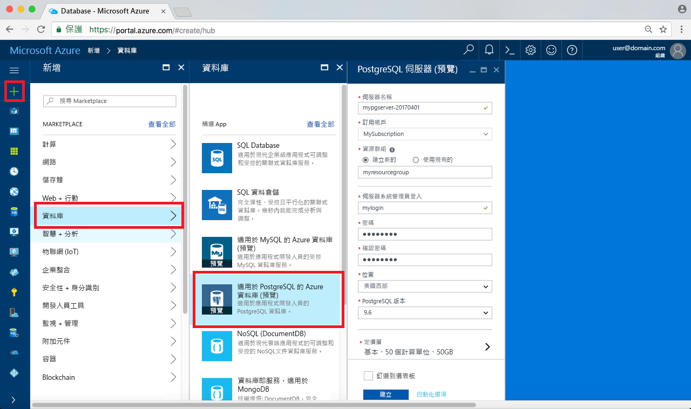
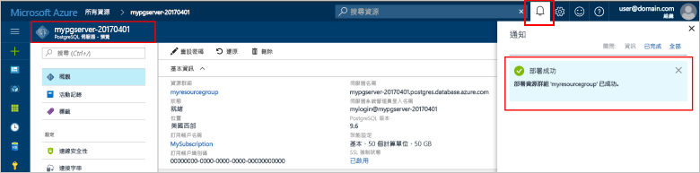
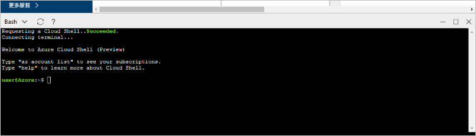

# <a name="design-your-first-azure-database-for-postgresql-using-hello-azure-portal"></a><span data-ttu-id="cc165-103">PostgreSQL 使用 hello Azure 入口網站來設計您的第一個 Azure 資料庫</span><span class="sxs-lookup"><span data-stu-id="cc165-103">Design your first Azure Database for PostgreSQL using hello Azure portal</span></span>

<span data-ttu-id="cc165-104">Azure PostgreSQL 資料庫是受管理的服務，可讓您 toorun、 管理及調整 hello 雲端中的高可用性 PostgreSQL 資料庫。</span><span class="sxs-lookup"><span data-stu-id="cc165-104">Azure Database for PostgreSQL is a managed service that enables you toorun, manage, and scale highly available PostgreSQL databases in hello cloud.</span></span> <span data-ttu-id="cc165-105">使用 hello Azure 入口網站，可以輕鬆地管理您的伺服器及設計資料庫。</span><span class="sxs-lookup"><span data-stu-id="cc165-105">Using hello Azure portal, you can easily manage your server and design a database.</span></span>

<span data-ttu-id="cc165-106">在此教學課程中，您可以使用 hello Azure 入口網站 toolearn 如何以：</span><span class="sxs-lookup"><span data-stu-id="cc165-106">In this tutorial, you use hello Azure portal toolearn how to:</span></span>
> [!div class="checklist"]
> * <span data-ttu-id="cc165-107">建立適用於 PostgreSQL 的 Azure 資料庫</span><span class="sxs-lookup"><span data-stu-id="cc165-107">Create an Azure Database for PostgreSQL</span></span>
> * <span data-ttu-id="cc165-108">Hello 伺服器防火牆設定</span><span class="sxs-lookup"><span data-stu-id="cc165-108">Configure hello server firewall</span></span>
> * <span data-ttu-id="cc165-109">使用[ **psql** ](https://www.postgresql.org/docs/9.6/static/app-psql.html)公用程式 toocreate 資料庫</span><span class="sxs-lookup"><span data-stu-id="cc165-109">Use [**psql**](https://www.postgresql.org/docs/9.6/static/app-psql.html) utility toocreate a database</span></span>
> * <span data-ttu-id="cc165-110">載入範例資料</span><span class="sxs-lookup"><span data-stu-id="cc165-110">Load sample data</span></span>
> * <span data-ttu-id="cc165-111">查詢資料</span><span class="sxs-lookup"><span data-stu-id="cc165-111">Query data</span></span>
> * <span data-ttu-id="cc165-112">更新資料</span><span class="sxs-lookup"><span data-stu-id="cc165-112">Update data</span></span>
> * <span data-ttu-id="cc165-113">還原資料</span><span class="sxs-lookup"><span data-stu-id="cc165-113">Restore data</span></span>

## <a name="prerequisites"></a><span data-ttu-id="cc165-114">必要條件</span><span class="sxs-lookup"><span data-stu-id="cc165-114">Prerequisites</span></span>
<span data-ttu-id="cc165-115">如果您沒有 Azure 訂用帳戶，請在開始前建立[免費帳戶](https://azure.microsoft.com/free/) 。</span><span class="sxs-lookup"><span data-stu-id="cc165-115">If you don't have an Azure subscription, create a [free](https://azure.microsoft.com/free/) account before you begin.</span></span>

## <a name="log-in-toohello-azure-portal"></a><span data-ttu-id="cc165-116">登入 toohello Azure 入口網站</span><span class="sxs-lookup"><span data-stu-id="cc165-116">Log in toohello Azure portal</span></span>
<span data-ttu-id="cc165-117">登入 toohello [Azure 入口網站](https://portal.azure.com)。</span><span class="sxs-lookup"><span data-stu-id="cc165-117">Log in toohello [Azure portal](https://portal.azure.com).</span></span>

## <a name="create-an-azure-database-for-postgresql"></a><span data-ttu-id="cc165-118">建立適用於 PostgreSQL 的 Azure 資料庫</span><span class="sxs-lookup"><span data-stu-id="cc165-118">Create an Azure Database for PostgreSQL</span></span>

<span data-ttu-id="cc165-119">「適用於 PostgreSQL 的 Azure 資料庫」伺服器是以一組已定義的[計算和儲存體資源](./concepts-compute-unit-and-storage.md)所建立。</span><span class="sxs-lookup"><span data-stu-id="cc165-119">An Azure Database for PostgreSQL server is created with a defined set of [compute and storage resources](./concepts-compute-unit-and-storage.md).</span></span> <span data-ttu-id="cc165-120">hello 伺服器內建立[Azure 資源群組](../azure-resource-manager/resource-group-overview.md)。</span><span class="sxs-lookup"><span data-stu-id="cc165-120">hello server is created within an [Azure resource group](../azure-resource-manager/resource-group-overview.md).</span></span>

<span data-ttu-id="cc165-121">請遵循這些步驟 toocreate PostgreSQL server Azure 資料庫：</span><span class="sxs-lookup"><span data-stu-id="cc165-121">Follow these steps toocreate an Azure Database for PostgreSQL server:</span></span>
1.  <span data-ttu-id="cc165-122">按一下 hello **+ 新增**hello 的左上角 hello Azure 入口網站上找到的按鈕。</span><span class="sxs-lookup"><span data-stu-id="cc165-122">Click hello **+ New**  button found on hello upper left-hand corner of hello Azure portal.</span></span>
2.  <span data-ttu-id="cc165-123">選取**資料庫**從 hello**新增**頁面上，並選取**Azure PostgreSQL 資料庫**從 hello**資料庫**頁面。</span><span class="sxs-lookup"><span data-stu-id="cc165-123">Select **Databases** from hello **New** page, and select **Azure Database for PostgreSQL** from hello **Databases** page.</span></span>
 <span data-ttu-id="cc165-124"></span><span class="sxs-lookup"><span data-stu-id="cc165-124"></span></span>

3.  <span data-ttu-id="cc165-125">填寫 hello 新伺服器詳細資料表單以下列資訊，hello hello 前面影像所示：</span><span class="sxs-lookup"><span data-stu-id="cc165-125">Fill out hello new server details form with hello following information, as shown on hello preceding image:</span></span>
    - <span data-ttu-id="cc165-126">伺服器名稱： **mypgserver 20170401** （伺服器的名稱將 tooDNS 名稱對應，因此需要的 toobe 全域唯一）</span><span class="sxs-lookup"><span data-stu-id="cc165-126">Server name: **mypgserver-20170401** (name of a server maps tooDNS name and is thus required toobe globally unique)</span></span> 
    - <span data-ttu-id="cc165-127">訂用帳戶： 如果您有多個訂閱，選擇適當 hello 訂閱 hello 資源存在或計費的。</span><span class="sxs-lookup"><span data-stu-id="cc165-127">Subscription: If you have multiple subscriptions, choose hello appropriate subscription in which hello resource exists or is billed for.</span></span>
    - <span data-ttu-id="cc165-128">資源群組︰**myresourcegroup**</span><span class="sxs-lookup"><span data-stu-id="cc165-128">Resource group: **myresourcegroup**</span></span>
    - <span data-ttu-id="cc165-129">您選擇的伺服器管理員登入和密碼</span><span class="sxs-lookup"><span data-stu-id="cc165-129">Server admin login and password of your choice</span></span>
    - <span data-ttu-id="cc165-130">位置</span><span class="sxs-lookup"><span data-stu-id="cc165-130">Location</span></span>
    - <span data-ttu-id="cc165-131">PostgreSQL 版本</span><span class="sxs-lookup"><span data-stu-id="cc165-131">PostgreSQL Version</span></span>

  > [!IMPORTANT]
  > <span data-ttu-id="cc165-132">hello 伺服器系統管理員登入和密碼，您在此處指定為 toohello server 中的必要的 toolog 和其資料庫，稍後在這個快速入門。</span><span class="sxs-lookup"><span data-stu-id="cc165-132">hello server admin login and password that you specify here are required toolog in toohello server and its databases later in this quick start.</span></span> <span data-ttu-id="cc165-133">請記住或記錄此資訊，以供稍後使用。</span><span class="sxs-lookup"><span data-stu-id="cc165-133">Remember or record this information for later use.</span></span>

4.  <span data-ttu-id="cc165-134">按一下**定價層**toospecify hello 服務層和效能層級的新資料庫。</span><span class="sxs-lookup"><span data-stu-id="cc165-134">Click **Pricing tier** toospecify hello service tier and performance level for your new database.</span></span> <span data-ttu-id="cc165-135">針對本快速入門，選取 [基本] 層、[50 個計算單位] 及 [50 GB] 的內含儲存體。</span><span class="sxs-lookup"><span data-stu-id="cc165-135">For this quick start, select **Basic** Tier, **50 Compute Units** and **50 GB** of included storage.</span></span>
 <span data-ttu-id="cc165-136"></span><span class="sxs-lookup"><span data-stu-id="cc165-136"></span></span>
5.  <span data-ttu-id="cc165-137">按一下 [確定] 。</span><span class="sxs-lookup"><span data-stu-id="cc165-137">Click **Ok**.</span></span>
6.  <span data-ttu-id="cc165-138">按一下**建立**tooprovision hello 伺服器。</span><span class="sxs-lookup"><span data-stu-id="cc165-138">Click **Create** tooprovision hello server.</span></span> <span data-ttu-id="cc165-139">佈建需要幾分鐘的時間。</span><span class="sxs-lookup"><span data-stu-id="cc165-139">Provisioning takes a few minutes.</span></span>

  > [!TIP]
  > <span data-ttu-id="cc165-140">檢查 hello **Pin toodashboard**選項 tooallow 輕鬆追蹤您的部署。</span><span class="sxs-lookup"><span data-stu-id="cc165-140">Check hello **Pin toodashboard** option tooallow easy tracking of your deployments.</span></span>

7.  <span data-ttu-id="cc165-141">在 [hello] 工具列上按一下**通知**toomonitor hello 部署程序。</span><span class="sxs-lookup"><span data-stu-id="cc165-141">On hello toolbar, click **Notifications** toomonitor hello deployment process.</span></span>
 <span data-ttu-id="cc165-142"></span><span class="sxs-lookup"><span data-stu-id="cc165-142"></span></span>
   
  <span data-ttu-id="cc165-143">根據預設，**postgres** 資料庫會建立在您的伺服器底下。</span><span class="sxs-lookup"><span data-stu-id="cc165-143">By default, **postgres** database gets created under your server.</span></span> <span data-ttu-id="cc165-144">hello [postgres](https://www.postgresql.org/docs/9.6/static/app-initdb.html)資料庫是適用於由使用者、 公用程式及協力廠商應用程式的預設資料庫。</span><span class="sxs-lookup"><span data-stu-id="cc165-144">hello [postgres](https://www.postgresql.org/docs/9.6/static/app-initdb.html) database is a default database meant for use by users, utilities, and third-party applications.</span></span> 

## <a name="configure-a-server-level-firewall-rule"></a><span data-ttu-id="cc165-145">設定伺服器層級防火牆規則</span><span class="sxs-lookup"><span data-stu-id="cc165-145">Configure a server-level firewall rule</span></span>

<span data-ttu-id="cc165-146">PostgreSQL 服務的 hello Azure 資料庫建立 hello 伺服器層級的防火牆。</span><span class="sxs-lookup"><span data-stu-id="cc165-146">hello Azure Database for PostgreSQL service creates a firewall at hello server-level.</span></span> <span data-ttu-id="cc165-147">此防火牆會阻止外部應用程式和工具連接 toohello 伺服器和伺服器 hello 上的任何資料庫，除非針對特定的 IP 位址的 tooopen hello 防火牆就會建立防火牆規則。</span><span class="sxs-lookup"><span data-stu-id="cc165-147">This firewall prevents external applications and tools from connecting toohello server and any databases on hello server unless a firewall rule is created tooopen hello firewall for specific IP addresses.</span></span> 

1.  <span data-ttu-id="cc165-148">Hello 部署完成之後，請按一下**所有資源**hello 左側功能表，然後輸入 hello 名稱從**mypgserver 20170401** toosearch 您新建立的伺服器。</span><span class="sxs-lookup"><span data-stu-id="cc165-148">After hello deployment completes, click **All Resources** from hello left-hand menu and type in hello name **mypgserver-20170401** toosearch for your newly created server.</span></span> <span data-ttu-id="cc165-149">按一下 hello hello 搜尋結果中所列的伺服器名稱。</span><span class="sxs-lookup"><span data-stu-id="cc165-149">Click hello server name listed in hello search result.</span></span> <span data-ttu-id="cc165-150">hello**概觀**頁面會針對您的伺服器會開啟，並提供進一步組態的選項。</span><span class="sxs-lookup"><span data-stu-id="cc165-150">hello **Overview** page for your server opens and provides options for further configuration.</span></span>
 
 

2.  <span data-ttu-id="cc165-152">在 hello 伺服器刀鋒視窗中，選取 **連線安全性**。</span><span class="sxs-lookup"><span data-stu-id="cc165-152">In hello server blade, select **Connection Security**.</span></span> 
3.  <span data-ttu-id="cc165-153">按一下底下的 hello 文字方塊中的 **規則名稱**並加入新防火牆規則 toowhitelist hello 的 IP 範圍的連線。</span><span class="sxs-lookup"><span data-stu-id="cc165-153">Click in hello text box under **Rule Name,** and add a new firewall rule toowhitelist hello IP range for connectivity.</span></span> <span data-ttu-id="cc165-154">針對本教學課程，我們將輸入 **Rule Name = AllowAllIps**、**Start IP = 0.0.0.0** 及 **End IP = 255.255.255.255**，然後按一下儲存，來允許所有 IP。</span><span class="sxs-lookup"><span data-stu-id="cc165-154">For this tutorial, let's allow all IPs by typing in **Rule Name = AllowAllIps**, **Start IP = 0.0.0.0** and **End IP = 255.255.255.255** and then click **Save**.</span></span> <span data-ttu-id="cc165-155">您可以設定防火牆規則，它涵蓋了 IP 範圍 toobe 無法 tooconnect 從您的網路。</span><span class="sxs-lookup"><span data-stu-id="cc165-155">You can set a firewall rule that covers an IP range toobe able tooconnect from your network.</span></span>
 
 

4.  <span data-ttu-id="cc165-157">按一下**儲存**然後按一下hello **X** tooclose hello**連線安全性**頁面。</span><span class="sxs-lookup"><span data-stu-id="cc165-157">Click **Save** and then click hello **X** tooclose hello **Connections Security** page.</span></span>

  > [!NOTE]
  > <span data-ttu-id="cc165-158">Azure PostgreSQL 伺服器會透過連接埠 5432 進行通訊。</span><span class="sxs-lookup"><span data-stu-id="cc165-158">Azure PostgreSQL server communicates over port 5432.</span></span> <span data-ttu-id="cc165-159">如果您嘗試 tooconnect 從公司網路內，透過連接埠 5432 輸出流量可能不允許您的網路防火牆。</span><span class="sxs-lookup"><span data-stu-id="cc165-159">If you are trying tooconnect from within a corporate network, outbound traffic over port 5432 may not be allowed by your network's firewall.</span></span> <span data-ttu-id="cc165-160">如果是的話，就能 tooconnect tooyour Azure SQL Database 伺服器除非您的 IT 部門會開啟連接埠 5432。</span><span class="sxs-lookup"><span data-stu-id="cc165-160">If so, you will not be able tooconnect tooyour Azure SQL Database server unless your IT department opens port 5432.</span></span>
  >


## <a name="get-hello-connection-information"></a><span data-ttu-id="cc165-161">取得 hello 的連接資訊</span><span class="sxs-lookup"><span data-stu-id="cc165-161">Get hello connection information</span></span>

<span data-ttu-id="cc165-162">當我們建立 PostgreSQL server 我們 Azure 資料庫時，hello 預設**postgres**也取得建立資料庫。</span><span class="sxs-lookup"><span data-stu-id="cc165-162">When we created our Azure Database for PostgreSQL server, hello default **postgres** database also gets created.</span></span> <span data-ttu-id="cc165-163">tooconnect tooyour 資料庫伺服器時，您需要 tooprovide 主機資訊和存取認證。</span><span class="sxs-lookup"><span data-stu-id="cc165-163">tooconnect tooyour database server, you need tooprovide host information and access credentials.</span></span>

1. <span data-ttu-id="cc165-164">在 Azure 入口網站中的 hello 左側功能表中按一下**所有資源**，並搜尋您剛才建立的 hello 伺服器**mypgserver 20170401**。</span><span class="sxs-lookup"><span data-stu-id="cc165-164">From hello left-hand menu in Azure portal, click **All resources** and search for hello server you just created **mypgserver-20170401**.</span></span>

  

3. <span data-ttu-id="cc165-166">按一下伺服器名稱，hello **mypgserver 20170401**。</span><span class="sxs-lookup"><span data-stu-id="cc165-166">Click hello server name **mypgserver-20170401**.</span></span>
4. <span data-ttu-id="cc165-167">選取 hello 伺服器**概觀**頁面。</span><span class="sxs-lookup"><span data-stu-id="cc165-167">Select hello server's **Overview** page.</span></span> <span data-ttu-id="cc165-168">請記下 hello**伺服器名稱**和**伺服器系統管理員登入名稱**。</span><span class="sxs-lookup"><span data-stu-id="cc165-168">Make a note of hello **Server name** and **Server admin login name**.</span></span>

 


## <a name="connect-toopostgresql-database-using-psql-in-cloud-shell"></a><span data-ttu-id="cc165-170">連接雲端殼層中使用 psql tooPostgreSQL 資料庫</span><span class="sxs-lookup"><span data-stu-id="cc165-170">Connect tooPostgreSQL database using psql in Cloud Shell</span></span>

<span data-ttu-id="cc165-171">我們現在使用 hello psql 命令列公用程式 tooconnect toohello Azure Database PostgreSQL 伺服器。</span><span class="sxs-lookup"><span data-stu-id="cc165-171">Let's now use hello psql command-line utility tooconnect toohello Azure Database for PostgreSQL server.</span></span> 
1. <span data-ttu-id="cc165-172">啟動 hello Azure 雲端殼層透過 hello hello 上方瀏覽窗格上的終端機 圖示。</span><span class="sxs-lookup"><span data-stu-id="cc165-172">Launch hello Azure Cloud Shell via hello terminal icon on hello top navigation pane.</span></span>

   

2. <span data-ttu-id="cc165-174">在瀏覽器中，讓您 tootype bash 命令中，開啟 hello Azure 雲端殼層。</span><span class="sxs-lookup"><span data-stu-id="cc165-174">hello Azure Cloud Shell opens in your browser, enabling you tootype bash commands.</span></span>

   

3. <span data-ttu-id="cc165-176">在 hello 雲端殼層提示字元中，連接適用於使用 hello psql 命令 PostgreSQL 伺服器 tooyour Azure 資料庫。</span><span class="sxs-lookup"><span data-stu-id="cc165-176">At hello Cloud Shell prompt, connect tooyour Azure Database for PostgreSQL server using hello psql commands.</span></span> <span data-ttu-id="cc165-177">hello 下列格式是使用的 tooconnect tooan Azure Database PostgreSQL 伺服器 hello [psql](https://www.postgresql.org/docs/9.6/static/app-psql.html)公用程式：</span><span class="sxs-lookup"><span data-stu-id="cc165-177">hello following format is used tooconnect tooan Azure Database for PostgreSQL server with hello [psql](https://www.postgresql.org/docs/9.6/static/app-psql.html) utility:</span></span>
   ```bash
   psql --host=<myserver> --port=<port> --username=<server admin login> --dbname=<database name>
   ```

   <span data-ttu-id="cc165-178">比方說，下列命令的 hello 連接 toohello 預設資料庫呼叫**postgres** PostgreSQL 伺服器上**mypgserver 20170401.postgres.database.azure.com**使用存取認證。</span><span class="sxs-lookup"><span data-stu-id="cc165-178">For example, hello following command connects toohello default database called **postgres** on your PostgreSQL server **mypgserver-20170401.postgres.database.azure.com** using access credentials.</span></span> <span data-ttu-id="cc165-179">在系統提示時輸入您的伺服器管理員密碼。</span><span class="sxs-lookup"><span data-stu-id="cc165-179">Enter your server admin password when prompted.</span></span>

   ```bash
   psql --host=mypgserver-20170401.postgres.database.azure.com --port=5432 --username=mylogin@mypgserver-20170401 --dbname=postgres
   ```

## <a name="create-a-new-database"></a><span data-ttu-id="cc165-180">建立新資料庫</span><span class="sxs-lookup"><span data-stu-id="cc165-180">Create a New Database</span></span>
<span data-ttu-id="cc165-181">一旦您已連線的 toohello 伺服器，請在 hello 提示字元建立一個空白資料庫。</span><span class="sxs-lookup"><span data-stu-id="cc165-181">Once you're connected toohello server, create a blank database at hello prompt.</span></span>
```bash
CREATE DATABASE mypgsqldb;
```

<span data-ttu-id="cc165-182">在 hello 提示字元中執行下列命令 tooswitch 連線 toohello 新建資料庫的 hello **mypgsqldb**。</span><span class="sxs-lookup"><span data-stu-id="cc165-182">At hello prompt, execute hello following command tooswitch connection toohello newly created database **mypgsqldb**.</span></span>
```bash
\c mypgsqldb
```
## <a name="create-tables-in-hello-database"></a><span data-ttu-id="cc165-183">Hello 資料庫中建立資料表</span><span class="sxs-lookup"><span data-stu-id="cc165-183">Create tables in hello database</span></span>
<span data-ttu-id="cc165-184">您現在知道如何 tooconnect toohello PostgreSQL 的 Azure 資料庫，我們可能會超出如何 toocomplete 某些基本工作。</span><span class="sxs-lookup"><span data-stu-id="cc165-184">Now that you know how tooconnect toohello Azure Database for PostgreSQL, we can go over how toocomplete some basic tasks.</span></span>

<span data-ttu-id="cc165-185">首先，我們可以建立資料表並在其中載入一些資料。</span><span class="sxs-lookup"><span data-stu-id="cc165-185">First, we can create a table and load it with some data.</span></span> <span data-ttu-id="cc165-186">我們將建立一個追蹤清查資訊的資料表。</span><span class="sxs-lookup"><span data-stu-id="cc165-186">Let's create a table that tracks inventory information.</span></span>
```sql
CREATE TABLE inventory (
    id serial PRIMARY KEY, 
    name VARCHAR(50), 
    quantity INTEGER
);
```

<span data-ttu-id="cc165-187">您可以看到新建立的資料表中 tabvles hello 清單現在輸入 hello:</span><span class="sxs-lookup"><span data-stu-id="cc165-187">You can see hello newly created table in hello list of tabvles now by typing:</span></span>
```sql
\dt
```

## <a name="load-data-into-hello-tables"></a><span data-ttu-id="cc165-188">資料載入至 hello 資料表</span><span class="sxs-lookup"><span data-stu-id="cc165-188">Load data into hello tables</span></span>
<span data-ttu-id="cc165-189">既然我們已有資料表，我們可以在其中插入一些資料。</span><span class="sxs-lookup"><span data-stu-id="cc165-189">Now that we have a table, we can insert some data into it.</span></span> <span data-ttu-id="cc165-190">在 hello 開啟命令提示字元視窗中，執行下列查詢 tooinsert hello 某些資料列的資料</span><span class="sxs-lookup"><span data-stu-id="cc165-190">At hello open command prompt window, run hello following query tooinsert some rows of data</span></span>
```sql
INSERT INTO inventory (id, name, quantity) VALUES (1, 'banana', 150); 
INSERT INTO inventory (id, name, quantity) VALUES (2, 'orange', 154);
```

<span data-ttu-id="cc165-191">您有範例資料插入您稍早建立的 hello 資料表現在包含兩個資料列。</span><span class="sxs-lookup"><span data-stu-id="cc165-191">You have now two rows of sample data into hello table you created earlier.</span></span>

## <a name="query-and-update-hello-data-in-hello-tables"></a><span data-ttu-id="cc165-192">查詢和更新 hello 資料表中的 hello 資料</span><span class="sxs-lookup"><span data-stu-id="cc165-192">Query and update hello data in hello tables</span></span>
<span data-ttu-id="cc165-193">執行 hello hello 資料庫資料表中的下列查詢 tooretrieve 資訊。</span><span class="sxs-lookup"><span data-stu-id="cc165-193">Execute hello following query tooretrieve information from hello database table.</span></span> 
```sql
SELECT * FROM inventory;
```

<span data-ttu-id="cc165-194">您也可以更新 hello 資料表中的 hello 資料</span><span class="sxs-lookup"><span data-stu-id="cc165-194">You can also update hello data in hello tables</span></span>
```sql
UPDATE inventory SET quantity = 200 WHERE name = 'banana';
```

<span data-ttu-id="cc165-195">當您擷取資料時，取得據以更新 hello 資料列。</span><span class="sxs-lookup"><span data-stu-id="cc165-195">hello row gets updated accordingly when you retrieve data.</span></span>
```sql
SELECT * FROM inventory;
```

## <a name="restore-data-tooa-previous-point-in-time"></a><span data-ttu-id="cc165-196">還原資料 tooa 前一個點的時間</span><span class="sxs-lookup"><span data-stu-id="cc165-196">Restore data tooa previous point in time</span></span>
<span data-ttu-id="cc165-197">想像一下您不小心刪除了這個資料表。</span><span class="sxs-lookup"><span data-stu-id="cc165-197">Imagine you have accidentally deleted this table.</span></span> <span data-ttu-id="cc165-198">這是您無法輕易復原的情況。</span><span class="sxs-lookup"><span data-stu-id="cc165-198">This situation is something you cannot easily recover from.</span></span> <span data-ttu-id="cc165-199">Azure PostgreSQL 資料庫可讓您 （在最後一個向上 too7 天 （基本） 則為 35 天 （標準） hello) 的 toogo 後 tooany 在時間點，並還原這個時間點 tooa 新的伺服器。</span><span class="sxs-lookup"><span data-stu-id="cc165-199">Azure Database for PostgreSQL allows you toogo back tooany point-in-time (in hello last up too7 days (Basic) and 35 days (Standard)) and restore this point-in-time tooa new server.</span></span> <span data-ttu-id="cc165-200">您可以使用這個新的伺服器 toorecover 刪除的資料。</span><span class="sxs-lookup"><span data-stu-id="cc165-200">You can use this new server toorecover your deleted data.</span></span> <span data-ttu-id="cc165-201">hello 加入 hello 資料表之前，請遵循步驟還原 hello 範例伺服器 tooa 點。</span><span class="sxs-lookup"><span data-stu-id="cc165-201">hello following steps restore hello sample server tooa point before hello table was added.</span></span>

1.  <span data-ttu-id="cc165-202">PostgreSQL 頁面為您的伺服器 hello Azure 資料庫上按一下**還原**hello 工具列上。</span><span class="sxs-lookup"><span data-stu-id="cc165-202">On hello Azure Database for PostgreSQL page for your server, click **Restore** on hello toolbar.</span></span> <span data-ttu-id="cc165-203">hello**還原**頁面隨即開啟。</span><span class="sxs-lookup"><span data-stu-id="cc165-203">hello **Restore** page opens.</span></span>
  <span data-ttu-id="cc165-204"></span><span class="sxs-lookup"><span data-stu-id="cc165-204"></span></span>
2.  <span data-ttu-id="cc165-205">填寫 hello**還原**hello 所需資訊的表單：</span><span class="sxs-lookup"><span data-stu-id="cc165-205">Fill out hello **Restore** form with hello required information:</span></span>

  
  - <span data-ttu-id="cc165-207">**還原點**： 選取在時間點所發生之前 hello 伺服器已變更</span><span class="sxs-lookup"><span data-stu-id="cc165-207">**Restore point**: Select a point-in-time that occurs before hello server was changed</span></span>
  - <span data-ttu-id="cc165-208">**目標伺服器**： 提供新的伺服器名稱，您想要 toorestore</span><span class="sxs-lookup"><span data-stu-id="cc165-208">**Target server**: Provide a new server name you want toorestore to</span></span>
  - <span data-ttu-id="cc165-209">**位置**： 您無法選取 hello 區域，依預設它是與 hello 來源伺服器相同</span><span class="sxs-lookup"><span data-stu-id="cc165-209">**Location**: You cannot select hello region, by default it is same as hello source server</span></span>
  - <span data-ttu-id="cc165-210">**定價層**︰還原伺服器時，您無法變更此值。</span><span class="sxs-lookup"><span data-stu-id="cc165-210">**Pricing tier**: You cannot change this value when restoring a server.</span></span> <span data-ttu-id="cc165-211">它是與 hello 來源伺服器相同。</span><span class="sxs-lookup"><span data-stu-id="cc165-211">It is same as hello source server.</span></span> 
3.  <span data-ttu-id="cc165-212">按一下**確定**toorestore hello 伺服器太[還原 tooa 時間點](./howto-restore-server-portal.md)hello 資料表已被刪除之前。</span><span class="sxs-lookup"><span data-stu-id="cc165-212">Click **OK** toorestore hello server too[restore tooa point-in-time](./howto-restore-server-portal.md) before hello tables was deleted.</span></span> <span data-ttu-id="cc165-213">還原伺服器 tooa 不同點時間建立重複的新伺服器與 hello 原始伺服器在您指定的時間點 hello，前提是它在 hello 的保留期限內是您[服務層](./concepts-service-tiers.md)。</span><span class="sxs-lookup"><span data-stu-id="cc165-213">Restoring a server tooa different point in time creates a duplicate new server as hello original server as of hello point in time you specify, provided that it is within hello retention period for your [service tier](./concepts-service-tiers.md).</span></span>

## <a name="next-steps"></a><span data-ttu-id="cc165-214">後續步驟</span><span class="sxs-lookup"><span data-stu-id="cc165-214">Next Steps</span></span>
<span data-ttu-id="cc165-215">在本教學課程中，您學到如何 toouse hello Azure 入口網站和其他公用程式：</span><span class="sxs-lookup"><span data-stu-id="cc165-215">In this tutorial, you learned how toouse hello Azure portal and other utilities to:</span></span>
> [!div class="checklist"]
> * <span data-ttu-id="cc165-216">建立適用於 PostgreSQL 的 Azure 資料庫</span><span class="sxs-lookup"><span data-stu-id="cc165-216">Create an Azure Database for PostgreSQL</span></span>
> * <span data-ttu-id="cc165-217">Hello 伺服器防火牆設定</span><span class="sxs-lookup"><span data-stu-id="cc165-217">Configure hello server firewall</span></span>
> * <span data-ttu-id="cc165-218">使用[ **psql** ](https://www.postgresql.org/docs/9.6/static/app-psql.html)公用程式 toocreate 資料庫</span><span class="sxs-lookup"><span data-stu-id="cc165-218">Use [**psql**](https://www.postgresql.org/docs/9.6/static/app-psql.html) utility toocreate a database</span></span>
> * <span data-ttu-id="cc165-219">載入範例資料</span><span class="sxs-lookup"><span data-stu-id="cc165-219">Load sample data</span></span>
> * <span data-ttu-id="cc165-220">查詢資料</span><span class="sxs-lookup"><span data-stu-id="cc165-220">Query data</span></span>
> * <span data-ttu-id="cc165-221">更新資料</span><span class="sxs-lookup"><span data-stu-id="cc165-221">Update data</span></span>
> * <span data-ttu-id="cc165-222">還原資料</span><span class="sxs-lookup"><span data-stu-id="cc165-222">Restore data</span></span>

<span data-ttu-id="cc165-223">接下來，深入了解如何 toouse Azure CLI toodo 類似的工作，檢閱本教學課程：[針對使用 Azure CLI PostgreSQL 設計您的第一個 Azure 資料庫](tutorial-design-database-using-azure-cli.md)</span><span class="sxs-lookup"><span data-stu-id="cc165-223">Next, learn how toouse Azure CLI toodo similar tasks, review this tutorial: [Design your first Azure Database for PostgreSQL using Azure CLI](tutorial-design-database-using-azure-cli.md)</span></span>
