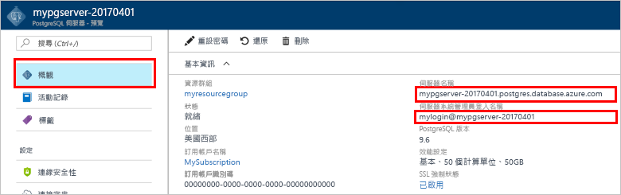

# <a name="design-your-first-azure-database-for-postgresql-using-the-azure-portal"></a><span data-ttu-id="85b5f-103">使用 Azure 入口網站來設計您第一個適用於 PostgreSQL 的 Azure 資料庫</span><span class="sxs-lookup"><span data-stu-id="85b5f-103">Design your first Azure Database for PostgreSQL using the Azure portal</span></span>

<span data-ttu-id="85b5f-104">「適用於 PostgreSQL 的 Azure 資料庫」是一個受管理的服務，可讓您在雲端執行、管理及調整高可用性 PostgreSQL 資料庫。</span><span class="sxs-lookup"><span data-stu-id="85b5f-104">Azure Database for PostgreSQL is a managed service that enables you to run, manage, and scale highly available PostgreSQL databases in the cloud.</span></span> <span data-ttu-id="85b5f-105">使用 Azure 入口網站，您可以輕鬆管理伺服器和設計資料庫。</span><span class="sxs-lookup"><span data-stu-id="85b5f-105">Using the Azure portal, you can easily manage your server and design a database.</span></span>

<span data-ttu-id="85b5f-106">在本教學課程中，您將使用 Azure 入口網站來學習如何：</span><span class="sxs-lookup"><span data-stu-id="85b5f-106">In this tutorial, you use the Azure portal to learn how to:</span></span>
> [!div class="checklist"]
> * <span data-ttu-id="85b5f-107">建立適用於 PostgreSQL 的 Azure 資料庫</span><span class="sxs-lookup"><span data-stu-id="85b5f-107">Create an Azure Database for PostgreSQL</span></span>
> * <span data-ttu-id="85b5f-108">設定伺服器防火牆</span><span class="sxs-lookup"><span data-stu-id="85b5f-108">Configure the server firewall</span></span>
> * <span data-ttu-id="85b5f-109">使用 [**psql**](https://www.postgresql.org/docs/9.6/static/app-psql.html) 公用程式來建立資料庫</span><span class="sxs-lookup"><span data-stu-id="85b5f-109">Use [**psql**](https://www.postgresql.org/docs/9.6/static/app-psql.html) utility to create a database</span></span>
> * <span data-ttu-id="85b5f-110">載入範例資料</span><span class="sxs-lookup"><span data-stu-id="85b5f-110">Load sample data</span></span>
> * <span data-ttu-id="85b5f-111">查詢資料</span><span class="sxs-lookup"><span data-stu-id="85b5f-111">Query data</span></span>
> * <span data-ttu-id="85b5f-112">更新資料</span><span class="sxs-lookup"><span data-stu-id="85b5f-112">Update data</span></span>
> * <span data-ttu-id="85b5f-113">還原資料</span><span class="sxs-lookup"><span data-stu-id="85b5f-113">Restore data</span></span>

## <a name="prerequisites"></a><span data-ttu-id="85b5f-114">必要條件</span><span class="sxs-lookup"><span data-stu-id="85b5f-114">Prerequisites</span></span>
<span data-ttu-id="85b5f-115">如果您沒有 Azure 訂用帳戶，請在開始前建立[免費帳戶](https://azure.microsoft.com/free/) 。</span><span class="sxs-lookup"><span data-stu-id="85b5f-115">If you don't have an Azure subscription, create a [free](https://azure.microsoft.com/free/) account before you begin.</span></span>

## <a name="log-in-to-the-azure-portal"></a><span data-ttu-id="85b5f-116">登入 Azure 入口網站</span><span class="sxs-lookup"><span data-stu-id="85b5f-116">Log in to the Azure portal</span></span>
<span data-ttu-id="85b5f-117">登入 [Azure 入口網站](https://portal.azure.com)。</span><span class="sxs-lookup"><span data-stu-id="85b5f-117">Log in to the [Azure portal](https://portal.azure.com).</span></span>

## <a name="create-an-azure-database-for-postgresql"></a><span data-ttu-id="85b5f-118">建立適用於 PostgreSQL 的 Azure 資料庫</span><span class="sxs-lookup"><span data-stu-id="85b5f-118">Create an Azure Database for PostgreSQL</span></span>

<span data-ttu-id="85b5f-119">「適用於 PostgreSQL 的 Azure 資料庫」伺服器是以一組已定義的[計算和儲存體資源](./concepts-compute-unit-and-storage.md)所建立。</span><span class="sxs-lookup"><span data-stu-id="85b5f-119">An Azure Database for PostgreSQL server is created with a defined set of [compute and storage resources](./concepts-compute-unit-and-storage.md).</span></span> <span data-ttu-id="85b5f-120">伺服器會建立在 [Azure 資源群組](../azure-resource-manager/resource-group-overview.md)內。</span><span class="sxs-lookup"><span data-stu-id="85b5f-120">The server is created within an [Azure resource group](../azure-resource-manager/resource-group-overview.md).</span></span>

<span data-ttu-id="85b5f-121">請依照下列步驟來建立「適用於 PostgreSQL 的 Azure 資料庫」伺服器：</span><span class="sxs-lookup"><span data-stu-id="85b5f-121">Follow these steps to create an Azure Database for PostgreSQL server:</span></span>
1.  <span data-ttu-id="85b5f-122">按一下 Azure 入口網站左上角的 [+ 新增] 按鈕。</span><span class="sxs-lookup"><span data-stu-id="85b5f-122">Click the **+ New**  button found on the upper left-hand corner of the Azure portal.</span></span>
2.  <span data-ttu-id="85b5f-123">從 [新增] 頁面中選取 [資料庫]，然後從 [資料庫] 頁面中選取 [適用於 PostgreSQL 的 Azure 資料庫]。</span><span class="sxs-lookup"><span data-stu-id="85b5f-123">Select **Databases** from the **New** page, and select **Azure Database for PostgreSQL** from the **Databases** page.</span></span>
 <span data-ttu-id="85b5f-124"></span><span class="sxs-lookup"><span data-stu-id="85b5f-124"></span></span>

3.  <span data-ttu-id="85b5f-125">在新伺服器詳細資料表單中填入下列資訊，如上圖所示︰</span><span class="sxs-lookup"><span data-stu-id="85b5f-125">Fill out the new server details form with the following information, as shown on the preceding image:</span></span>
    - <span data-ttu-id="85b5f-126">伺服器名稱：**mypgserver-20170401** (伺服器的名稱會與 DNS 名稱對應，因此必須是全域唯一的)</span><span class="sxs-lookup"><span data-stu-id="85b5f-126">Server name: **mypgserver-20170401** (name of a server maps to DNS name and is thus required to be globally unique)</span></span> 
    - <span data-ttu-id="85b5f-127">訂用帳戶：如果您有多個訂用帳戶，請選擇資源所在或作為計費對象的適當訂用帳戶。</span><span class="sxs-lookup"><span data-stu-id="85b5f-127">Subscription: If you have multiple subscriptions, choose the appropriate subscription in which the resource exists or is billed for.</span></span>
    - <span data-ttu-id="85b5f-128">資源群組︰**myresourcegroup**</span><span class="sxs-lookup"><span data-stu-id="85b5f-128">Resource group: **myresourcegroup**</span></span>
    - <span data-ttu-id="85b5f-129">您選擇的伺服器管理員登入和密碼</span><span class="sxs-lookup"><span data-stu-id="85b5f-129">Server admin login and password of your choice</span></span>
    - <span data-ttu-id="85b5f-130">位置</span><span class="sxs-lookup"><span data-stu-id="85b5f-130">Location</span></span>
    - <span data-ttu-id="85b5f-131">PostgreSQL 版本</span><span class="sxs-lookup"><span data-stu-id="85b5f-131">PostgreSQL Version</span></span>

  > [!IMPORTANT]
  > <span data-ttu-id="85b5f-132">需要伺服器系統管理員登入以及您在此處指定的密碼，稍後才能在本快速入門中登入伺服器及其資料庫。</span><span class="sxs-lookup"><span data-stu-id="85b5f-132">The server admin login and password that you specify here are required to log in to the server and its databases later in this quick start.</span></span> <span data-ttu-id="85b5f-133">請記住或記錄此資訊，以供稍後使用。</span><span class="sxs-lookup"><span data-stu-id="85b5f-133">Remember or record this information for later use.</span></span>

4.  <span data-ttu-id="85b5f-134">按一下 [定價層] 指定新資料庫的服務層和效能等級。</span><span class="sxs-lookup"><span data-stu-id="85b5f-134">Click **Pricing tier** to specify the service tier and performance level for your new database.</span></span> <span data-ttu-id="85b5f-135">針對本快速入門，選取 [基本] 層、[50 個計算單位] 及 [50 GB] 的內含儲存體。</span><span class="sxs-lookup"><span data-stu-id="85b5f-135">For this quick start, select **Basic** Tier, **50 Compute Units** and **50 GB** of included storage.</span></span>
 <span data-ttu-id="85b5f-136"></span><span class="sxs-lookup"><span data-stu-id="85b5f-136"></span></span>
5.  <span data-ttu-id="85b5f-137">按一下 [確定] 。</span><span class="sxs-lookup"><span data-stu-id="85b5f-137">Click **Ok**.</span></span>
6.  <span data-ttu-id="85b5f-138">按一下 [建立] 以佈建伺服器。</span><span class="sxs-lookup"><span data-stu-id="85b5f-138">Click **Create** to provision the server.</span></span> <span data-ttu-id="85b5f-139">佈建需要幾分鐘的時間。</span><span class="sxs-lookup"><span data-stu-id="85b5f-139">Provisioning takes a few minutes.</span></span>

  > [!TIP]
  > <span data-ttu-id="85b5f-140">選取 [釘選到儀表板] 選項以輕鬆追蹤部署。</span><span class="sxs-lookup"><span data-stu-id="85b5f-140">Check the **Pin to dashboard** option to allow easy tracking of your deployments.</span></span>

7.  <span data-ttu-id="85b5f-141">在工具列上，按一下 [通知] 以監視部署程序。</span><span class="sxs-lookup"><span data-stu-id="85b5f-141">On the toolbar, click **Notifications** to monitor the deployment process.</span></span>
 <span data-ttu-id="85b5f-142"></span><span class="sxs-lookup"><span data-stu-id="85b5f-142"></span></span>
   
  <span data-ttu-id="85b5f-143">根據預設，**postgres** 資料庫會建立在您的伺服器底下。</span><span class="sxs-lookup"><span data-stu-id="85b5f-143">By default, **postgres** database gets created under your server.</span></span> <span data-ttu-id="85b5f-144">[postgres](https://www.postgresql.org/docs/9.6/static/app-initdb.html) 資料庫是要供使用者、公用程式及第三方應用程式使用的預設資料庫。</span><span class="sxs-lookup"><span data-stu-id="85b5f-144">The [postgres](https://www.postgresql.org/docs/9.6/static/app-initdb.html) database is a default database meant for use by users, utilities, and third-party applications.</span></span> 

## <a name="configure-a-server-level-firewall-rule"></a><span data-ttu-id="85b5f-145">設定伺服器層級防火牆規則</span><span class="sxs-lookup"><span data-stu-id="85b5f-145">Configure a server-level firewall rule</span></span>

<span data-ttu-id="85b5f-146">「適用於 PostgreSQL 的 Azure 資料庫」服務會在伺服器層級建立防火牆。</span><span class="sxs-lookup"><span data-stu-id="85b5f-146">The Azure Database for PostgreSQL service creates a firewall at the server-level.</span></span> <span data-ttu-id="85b5f-147">此防火牆會防止外部應用程式和工具連線到伺服器及伺服器上的任何資料庫，除非已建立防火牆規則以針對特定的 IP 位址開啟防火牆。</span><span class="sxs-lookup"><span data-stu-id="85b5f-147">This firewall prevents external applications and tools from connecting to the server and any databases on the server unless a firewall rule is created to open the firewall for specific IP addresses.</span></span> 

1.  <span data-ttu-id="85b5f-148">完成部署之後，從左側功能表中按一下 [所有資源]，然後輸入名稱 **mypgserver-20170401** 來搜尋新建立的伺服器。</span><span class="sxs-lookup"><span data-stu-id="85b5f-148">After the deployment completes, click **All Resources** from the left-hand menu and type in the name **mypgserver-20170401** to search for your newly created server.</span></span> <span data-ttu-id="85b5f-149">按一下搜尋結果中列出的伺服器名稱。</span><span class="sxs-lookup"><span data-stu-id="85b5f-149">Click the server name listed in the search result.</span></span> <span data-ttu-id="85b5f-150">伺服器的 [概觀] 頁面隨即開啟，並提供可進行進一步設定的選項。</span><span class="sxs-lookup"><span data-stu-id="85b5f-150">The **Overview** page for your server opens and provides options for further configuration.</span></span>
 
 

2.  <span data-ttu-id="85b5f-152">在伺服器刀鋒視窗中，選取 [連線安全性]。</span><span class="sxs-lookup"><span data-stu-id="85b5f-152">In the server blade, select **Connection Security**.</span></span> 
3.  <span data-ttu-id="85b5f-153">在 [規則名稱] 底下的文字方塊中按一下，然後新增新的防火牆規則，以將 IP 範圍加入白名單來獲得連線能力。</span><span class="sxs-lookup"><span data-stu-id="85b5f-153">Click in the text box under **Rule Name,** and add a new firewall rule to whitelist the IP range for connectivity.</span></span> <span data-ttu-id="85b5f-154">針對本教學課程，我們將輸入 **Rule Name = AllowAllIps**、**Start IP = 0.0.0.0** 及 **End IP = 255.255.255.255**，然後按一下 [儲存]，來允許所有 IP。</span><span class="sxs-lookup"><span data-stu-id="85b5f-154">For this tutorial, let's allow all IPs by typing in **Rule Name = AllowAllIps**, **Start IP = 0.0.0.0** and **End IP = 255.255.255.255** and then click **Save**.</span></span> <span data-ttu-id="85b5f-155">您可以設定一個防火牆規則，來涵蓋能夠從您網路連線的 IP 範圍。</span><span class="sxs-lookup"><span data-stu-id="85b5f-155">You can set a firewall rule that covers an IP range to be able to connect from your network.</span></span>
 
 

4.  <span data-ttu-id="85b5f-157">按一下 [儲存]，然後按一下 [X]，以關閉 [連線安全性] 頁面。</span><span class="sxs-lookup"><span data-stu-id="85b5f-157">Click **Save** and then click the **X** to close the **Connections Security** page.</span></span>

  > [!NOTE]
  > <span data-ttu-id="85b5f-158">Azure PostgreSQL 伺服器會透過連接埠 5432 進行通訊。</span><span class="sxs-lookup"><span data-stu-id="85b5f-158">Azure PostgreSQL server communicates over port 5432.</span></span> <span data-ttu-id="85b5f-159">如果您嘗試從公司網路內進行連線，您網路的防火牆可能不允許透過連接埠 5432 的輸出流量。</span><span class="sxs-lookup"><span data-stu-id="85b5f-159">If you are trying to connect from within a corporate network, outbound traffic over port 5432 may not be allowed by your network's firewall.</span></span> <span data-ttu-id="85b5f-160">若是如此，除非 IT 部門開啟連接埠 5432，否則您將無法連線到 Azure SQL Database 伺服器。</span><span class="sxs-lookup"><span data-stu-id="85b5f-160">If so, you will not be able to connect to your Azure SQL Database server unless your IT department opens port 5432.</span></span>
  >


## <a name="get-the-connection-information"></a><span data-ttu-id="85b5f-161">取得連線資訊</span><span class="sxs-lookup"><span data-stu-id="85b5f-161">Get the connection information</span></span>

<span data-ttu-id="85b5f-162">當我們建立「適用於 PostgreSQL 的 Azure 資料庫」伺服器時，會一併建立預設的 **postgres** 資料庫。</span><span class="sxs-lookup"><span data-stu-id="85b5f-162">When we created our Azure Database for PostgreSQL server, the default **postgres** database also gets created.</span></span> <span data-ttu-id="85b5f-163">若要連線到您的資料庫伺服器，您必須提供主機資訊和存取認證。</span><span class="sxs-lookup"><span data-stu-id="85b5f-163">To connect to your database server, you need to provide host information and access credentials.</span></span>

1. <span data-ttu-id="85b5f-164">從 Azure 入口網站的左側功能表中，按一下 [所有資源]，然後搜尋您剛建立的伺服器 **mypgserver-20170401**。</span><span class="sxs-lookup"><span data-stu-id="85b5f-164">From the left-hand menu in Azure portal, click **All resources** and search for the server you just created **mypgserver-20170401**.</span></span>

  

3. <span data-ttu-id="85b5f-166">按一下伺服器名稱 [mypgserver-20170401]。</span><span class="sxs-lookup"><span data-stu-id="85b5f-166">Click the server name **mypgserver-20170401**.</span></span>
4. <span data-ttu-id="85b5f-167">選取伺服器的 [概觀] 頁面。</span><span class="sxs-lookup"><span data-stu-id="85b5f-167">Select the server's **Overview** page.</span></span> <span data-ttu-id="85b5f-168">記下 [伺服器名稱] 和 [伺服器管理員登入名稱]。</span><span class="sxs-lookup"><span data-stu-id="85b5f-168">Make a note of the **Server name** and **Server admin login name**.</span></span>

 


## <a name="connect-to-postgresql-database-using-psql-in-cloud-shell"></a><span data-ttu-id="85b5f-170">在 Cloud Shell 中使用 psql 來連線到 PostgreSQL 資料庫</span><span class="sxs-lookup"><span data-stu-id="85b5f-170">Connect to PostgreSQL database using psql in Cloud Shell</span></span>

<span data-ttu-id="85b5f-171">現在我們將使用 psql 命令列公用程式來連線到「適用於 PostgreSQL 的 Azure 資料庫」伺服器。</span><span class="sxs-lookup"><span data-stu-id="85b5f-171">Let's now use the psql command-line utility to connect to the Azure Database for PostgreSQL server.</span></span> 
1. <span data-ttu-id="85b5f-172">透過頂端瀏覽窗格上的終端機圖示啟動 Azure Cloud Shell。</span><span class="sxs-lookup"><span data-stu-id="85b5f-172">Launch the Azure Cloud Shell via the terminal icon on the top navigation pane.</span></span>

   

2. <span data-ttu-id="85b5f-174">Azure Cloud Shell 會在您的瀏覽器中開啟，讓您能夠輸入 bash 命令。</span><span class="sxs-lookup"><span data-stu-id="85b5f-174">The Azure Cloud Shell opens in your browser, enabling you to type bash commands.</span></span>

   

3. <span data-ttu-id="85b5f-176">在 Cloud Shell 提示字元處，使用 psql 命令來連線到「適用於 PostgreSQL 的 Azure 資料庫」伺服器。</span><span class="sxs-lookup"><span data-stu-id="85b5f-176">At the Cloud Shell prompt, connect to your Azure Database for PostgreSQL server using the psql commands.</span></span> <span data-ttu-id="85b5f-177">下列格式可用來透過 [psql](https://www.postgresql.org/docs/9.6/static/app-psql.html) 公用程式連線到「適用於 PostgreSQL 的 Azure 資料庫」伺服器：</span><span class="sxs-lookup"><span data-stu-id="85b5f-177">The following format is used to connect to an Azure Database for PostgreSQL server with the [psql](https://www.postgresql.org/docs/9.6/static/app-psql.html) utility:</span></span>
   ```bash
   psql --host=<myserver> --port=<port> --username=<server admin login> --dbname=<database name>
   ```

   <span data-ttu-id="85b5f-178">例如，下列命令會使用存取認證，連線到 PostgreSQL 伺服器 **mypgserver-20170401.postgres.database.azure.com** 上名為 **postgres** 的預設資料庫。</span><span class="sxs-lookup"><span data-stu-id="85b5f-178">For example, the following command connects to the default database called **postgres** on your PostgreSQL server **mypgserver-20170401.postgres.database.azure.com** using access credentials.</span></span> <span data-ttu-id="85b5f-179">在系統提示時輸入您的伺服器管理員密碼。</span><span class="sxs-lookup"><span data-stu-id="85b5f-179">Enter your server admin password when prompted.</span></span>

   ```bash
   psql --host=mypgserver-20170401.postgres.database.azure.com --port=5432 --username=mylogin@mypgserver-20170401 --dbname=postgres
   ```

## <a name="create-a-new-database"></a><span data-ttu-id="85b5f-180">建立新資料庫</span><span class="sxs-lookup"><span data-stu-id="85b5f-180">Create a New Database</span></span>
<span data-ttu-id="85b5f-181">連線到伺服器之後，在提示字元建立空白資料庫。</span><span class="sxs-lookup"><span data-stu-id="85b5f-181">Once you're connected to the server, create a blank database at the prompt.</span></span>
```bash
CREATE DATABASE mypgsqldb;
```

<span data-ttu-id="85b5f-182">在提示字元，執行下列命令以將連線切換到新建立的資料庫 **mypgsqldb**。</span><span class="sxs-lookup"><span data-stu-id="85b5f-182">At the prompt, execute the following command to switch connection to the newly created database **mypgsqldb**.</span></span>
```bash
\c mypgsqldb
```
## <a name="create-tables-in-the-database"></a><span data-ttu-id="85b5f-183">在資料庫中建立資料表</span><span class="sxs-lookup"><span data-stu-id="85b5f-183">Create tables in the database</span></span>
<span data-ttu-id="85b5f-184">既然您已知道如何連線到「適用於 PostgreSQL 的 Azure 資料庫」，我們可以了解一下如何完成一些基本工作。</span><span class="sxs-lookup"><span data-stu-id="85b5f-184">Now that you know how to connect to the Azure Database for PostgreSQL, we can go over how to complete some basic tasks.</span></span>

<span data-ttu-id="85b5f-185">首先，我們可以建立資料表並在其中載入一些資料。</span><span class="sxs-lookup"><span data-stu-id="85b5f-185">First, we can create a table and load it with some data.</span></span> <span data-ttu-id="85b5f-186">我們將建立一個追蹤清查資訊的資料表。</span><span class="sxs-lookup"><span data-stu-id="85b5f-186">Let's create a table that tracks inventory information.</span></span>
```sql
CREATE TABLE inventory (
    id serial PRIMARY KEY, 
    name VARCHAR(50), 
    quantity INTEGER
);
```

<span data-ttu-id="85b5f-187">您現在可以輸入下列命令來查看資料表清單中新建立的資料表：</span><span class="sxs-lookup"><span data-stu-id="85b5f-187">You can see the newly created table in the list of tabvles now by typing:</span></span>
```sql
\dt
```

## <a name="load-data-into-the-tables"></a><span data-ttu-id="85b5f-188">將資料載入到資料表</span><span class="sxs-lookup"><span data-stu-id="85b5f-188">Load data into the tables</span></span>
<span data-ttu-id="85b5f-189">既然我們已有資料表，我們可以在其中插入一些資料。</span><span class="sxs-lookup"><span data-stu-id="85b5f-189">Now that we have a table, we can insert some data into it.</span></span> <span data-ttu-id="85b5f-190">在開啟的命令提示字元視窗，執行下列查詢以插入幾列資料</span><span class="sxs-lookup"><span data-stu-id="85b5f-190">At the open command prompt window, run the following query to insert some rows of data</span></span>
```sql
INSERT INTO inventory (id, name, quantity) VALUES (1, 'banana', 150); 
INSERT INTO inventory (id, name, quantity) VALUES (2, 'orange', 154);
```

<span data-ttu-id="85b5f-191">您現在已將兩列範例資料插入到先前建立的資料表。</span><span class="sxs-lookup"><span data-stu-id="85b5f-191">You have now two rows of sample data into the table you created earlier.</span></span>

## <a name="query-and-update-the-data-in-the-tables"></a><span data-ttu-id="85b5f-192">查詢並更新資料表中的資料</span><span class="sxs-lookup"><span data-stu-id="85b5f-192">Query and update the data in the tables</span></span>
<span data-ttu-id="85b5f-193">執行下列查詢，以從資料庫資料表中擷取資訊。</span><span class="sxs-lookup"><span data-stu-id="85b5f-193">Execute the following query to retrieve information from the database table.</span></span> 
```sql
SELECT * FROM inventory;
```

<span data-ttu-id="85b5f-194">您也可以更新資料表中的資料</span><span class="sxs-lookup"><span data-stu-id="85b5f-194">You can also update the data in the tables</span></span>
```sql
UPDATE inventory SET quantity = 200 WHERE name = 'banana';
```

<span data-ttu-id="85b5f-195">當您擷取資料時，資料列會相應地更新。</span><span class="sxs-lookup"><span data-stu-id="85b5f-195">The row gets updated accordingly when you retrieve data.</span></span>
```sql
SELECT * FROM inventory;
```

## <a name="restore-data-to-a-previous-point-in-time"></a><span data-ttu-id="85b5f-196">將資料還原到先前的時間點</span><span class="sxs-lookup"><span data-stu-id="85b5f-196">Restore data to a previous point in time</span></span>
<span data-ttu-id="85b5f-197">想像一下您不小心刪除了這個資料表。</span><span class="sxs-lookup"><span data-stu-id="85b5f-197">Imagine you have accidentally deleted this table.</span></span> <span data-ttu-id="85b5f-198">這是您無法輕易復原的情況。</span><span class="sxs-lookup"><span data-stu-id="85b5f-198">This situation is something you cannot easily recover from.</span></span> <span data-ttu-id="85b5f-199">「適用於 PostgreSQL 的 Azure 資料庫」可讓您返回到任何時間點 (最長可達過去 7 天 (基本) 和 35 天 (標準))，並將此時間點還原到新資料庫。</span><span class="sxs-lookup"><span data-stu-id="85b5f-199">Azure Database for PostgreSQL allows you to go back to any point-in-time (in the last up to 7 days (Basic) and 35 days (Standard)) and restore this point-in-time to a new server.</span></span> <span data-ttu-id="85b5f-200">您可以使用這個新的伺服器來復原已刪除的資料。</span><span class="sxs-lookup"><span data-stu-id="85b5f-200">You can use this new server to recover your deleted data.</span></span> <span data-ttu-id="85b5f-201">下列步驟會將範例伺服器還原到新增資料表之前的時間點。</span><span class="sxs-lookup"><span data-stu-id="85b5f-201">The following steps restore the sample server to a point before the table was added.</span></span>

1.  <span data-ttu-id="85b5f-202">在您伺服器的 [適用於 PostgreSQL 的 Azure 資料庫] 頁面上，按一下工具列上的 [還原]。</span><span class="sxs-lookup"><span data-stu-id="85b5f-202">On the Azure Database for PostgreSQL page for your server, click **Restore** on the toolbar.</span></span> <span data-ttu-id="85b5f-203">[還原] 頁面隨即開啟。</span><span class="sxs-lookup"><span data-stu-id="85b5f-203">The **Restore** page opens.</span></span>
  <span data-ttu-id="85b5f-204"></span><span class="sxs-lookup"><span data-stu-id="85b5f-204"></span></span>
2.  <span data-ttu-id="85b5f-205">在 [還原] 表單中填入必要資訊︰</span><span class="sxs-lookup"><span data-stu-id="85b5f-205">Fill out the **Restore** form with the required information:</span></span>

  
  - <span data-ttu-id="85b5f-207">**還原點**：選取在變更伺服器之前的時間點</span><span class="sxs-lookup"><span data-stu-id="85b5f-207">**Restore point**: Select a point-in-time that occurs before the server was changed</span></span>
  - <span data-ttu-id="85b5f-208">**目標伺服器**︰提供要作為還原目的地的新伺服器名稱</span><span class="sxs-lookup"><span data-stu-id="85b5f-208">**Target server**: Provide a new server name you want to restore to</span></span>
  - <span data-ttu-id="85b5f-209">**位置**︰您無法選取區域，預設是與來源伺服器相同的區域</span><span class="sxs-lookup"><span data-stu-id="85b5f-209">**Location**: You cannot select the region, by default it is same as the source server</span></span>
  - <span data-ttu-id="85b5f-210">**定價層**︰還原伺服器時，您無法變更此值。</span><span class="sxs-lookup"><span data-stu-id="85b5f-210">**Pricing tier**: You cannot change this value when restoring a server.</span></span> <span data-ttu-id="85b5f-211">它與來源伺服器相同。</span><span class="sxs-lookup"><span data-stu-id="85b5f-211">It is same as the source server.</span></span> 
3.  <span data-ttu-id="85b5f-212">按一下 [確定]，以將伺服器[還原到刪除資料表之前的時間點](./howto-restore-server-portal.md)。</span><span class="sxs-lookup"><span data-stu-id="85b5f-212">Click **OK** to restore the server to [restore to a point-in-time](./howto-restore-server-portal.md) before the tables was deleted.</span></span> <span data-ttu-id="85b5f-213">如果將伺服器還原到不同的時間點，將會從您指定的時間點 (前提是此時間點在您[服務層](./concepts-service-tiers.md)的保留期限內) 開始，建立重複的新伺服器作為原始伺服器。</span><span class="sxs-lookup"><span data-stu-id="85b5f-213">Restoring a server to a different point in time creates a duplicate new server as the original server as of the point in time you specify, provided that it is within the retention period for your [service tier](./concepts-service-tiers.md).</span></span>

## <a name="next-steps"></a><span data-ttu-id="85b5f-214">後續步驟</span><span class="sxs-lookup"><span data-stu-id="85b5f-214">Next Steps</span></span>
<span data-ttu-id="85b5f-215">在本教學課程中，您已了解如何使用 Azure 入口網站和其他公用程式來：</span><span class="sxs-lookup"><span data-stu-id="85b5f-215">In this tutorial, you learned how to use the Azure portal and other utilities to:</span></span>
> [!div class="checklist"]
> * <span data-ttu-id="85b5f-216">建立適用於 PostgreSQL 的 Azure 資料庫</span><span class="sxs-lookup"><span data-stu-id="85b5f-216">Create an Azure Database for PostgreSQL</span></span>
> * <span data-ttu-id="85b5f-217">設定伺服器防火牆</span><span class="sxs-lookup"><span data-stu-id="85b5f-217">Configure the server firewall</span></span>
> * <span data-ttu-id="85b5f-218">使用 [**psql**](https://www.postgresql.org/docs/9.6/static/app-psql.html) 公用程式來建立資料庫</span><span class="sxs-lookup"><span data-stu-id="85b5f-218">Use [**psql**](https://www.postgresql.org/docs/9.6/static/app-psql.html) utility to create a database</span></span>
> * <span data-ttu-id="85b5f-219">載入範例資料</span><span class="sxs-lookup"><span data-stu-id="85b5f-219">Load sample data</span></span>
> * <span data-ttu-id="85b5f-220">查詢資料</span><span class="sxs-lookup"><span data-stu-id="85b5f-220">Query data</span></span>
> * <span data-ttu-id="85b5f-221">更新資料</span><span class="sxs-lookup"><span data-stu-id="85b5f-221">Update data</span></span>
> * <span data-ttu-id="85b5f-222">還原資料</span><span class="sxs-lookup"><span data-stu-id="85b5f-222">Restore data</span></span>

<span data-ttu-id="85b5f-223">接著，了解如何使用 Azure CLI 來執行類似的工作，請檢閱此教學課程：[使用 Azure CLI 來設計您第一個適用於 PostgreSQL 的 Azure 資料庫](tutorial-design-database-using-azure-cli.md)</span><span class="sxs-lookup"><span data-stu-id="85b5f-223">Next, learn how to use Azure CLI to do similar tasks, review this tutorial: [Design your first Azure Database for PostgreSQL using Azure CLI](tutorial-design-database-using-azure-cli.md)</span></span>
