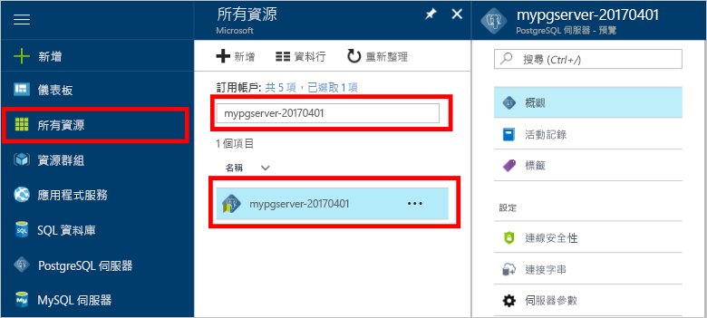

# <a name="design-your-first-azure-database-for-postgresql-using-hello-azure-portal"></a>PostgreSQL 使用 hello Azure 入口網站來設計您的第一個 Azure 資料庫

Azure PostgreSQL 資料庫是受管理的服務，可讓您 toorun、 管理及調整 hello 雲端中的高可用性 PostgreSQL 資料庫。 使用 hello Azure 入口網站，可以輕鬆地管理您的伺服器及設計資料庫。

在此教學課程中，您可以使用 hello Azure 入口網站 toolearn 如何以：
> [!div class="checklist"]
> * 建立適用於 PostgreSQL 的 Azure 資料庫
> * Hello 伺服器防火牆設定
> * 使用[ **psql** ](https://www.postgresql.org/docs/9.6/static/app-psql.html)公用程式 toocreate 資料庫
> * 載入範例資料
> * 查詢資料
> * 更新資料
> * 還原資料

## <a name="prerequisites"></a>必要條件
如果您沒有 Azure 訂用帳戶，請在開始前建立[免費帳戶](https://azure.microsoft.com/free/) 。

## <a name="log-in-toohello-azure-portal"></a>登入 toohello Azure 入口網站
登入 toohello [Azure 入口網站](https://portal.azure.com)。

## <a name="create-an-azure-database-for-postgresql"></a>建立適用於 PostgreSQL 的 Azure 資料庫

「適用於 PostgreSQL 的 Azure 資料庫」伺服器是以一組已定義的[計算和儲存體資源](./concepts-compute-unit-and-storage.md)所建立。 hello 伺服器內建立[Azure 資源群組](../azure-resource-manager/resource-group-overview.md)。

請遵循這些步驟 toocreate PostgreSQL server Azure 資料庫：
1.  按一下 hello **+ 新增**hello 的左上角 hello Azure 入口網站上找到的按鈕。
2.  選取**資料庫**從 hello**新增**頁面上，並選取**Azure PostgreSQL 資料庫**從 hello**資料庫**頁面。
 

3.  填寫 hello 新伺服器詳細資料表單以下列資訊，hello hello 前面影像所示：
    - 伺服器名稱： **mypgserver 20170401** （伺服器的名稱將 tooDNS 名稱對應，因此需要的 toobe 全域唯一） 
    - 訂用帳戶： 如果您有多個訂閱，選擇適當 hello 訂閱 hello 資源存在或計費的。
    - 資源群組︰**myresourcegroup**
    - 您選擇的伺服器管理員登入和密碼
    - 位置
    - PostgreSQL 版本

  > [!IMPORTANT]
  > hello 伺服器系統管理員登入和密碼，您在此處指定為 toohello server 中的必要的 toolog 和其資料庫，稍後在這個快速入門。 請記住或記錄此資訊，以供稍後使用。

4.  按一下**定價層**toospecify hello 服務層和效能層級的新資料庫。 針對本快速入門，選取 [基本] 層、[50 個計算單位] 及 [50 GB] 的內含儲存體。
 
5.  按一下 [確定] 。
6.  按一下**建立**tooprovision hello 伺服器。 佈建需要幾分鐘的時間。

  > [!TIP]
  > 檢查 hello **Pin toodashboard**選項 tooallow 輕鬆追蹤您的部署。

7.  在 [hello] 工具列上按一下**通知**toomonitor hello 部署程序。
 
   
  根據預設，**postgres** 資料庫會建立在您的伺服器底下。 hello [postgres](https://www.postgresql.org/docs/9.6/static/app-initdb.html)資料庫是適用於由使用者、 公用程式及協力廠商應用程式的預設資料庫。 

## <a name="configure-a-server-level-firewall-rule"></a>設定伺服器層級防火牆規則

PostgreSQL 服務的 hello Azure 資料庫建立 hello 伺服器層級的防火牆。 此防火牆會阻止外部應用程式和工具連接 toohello 伺服器和伺服器 hello 上的任何資料庫，除非針對特定的 IP 位址的 tooopen hello 防火牆就會建立防火牆規則。 

1.  Hello 部署完成之後，請按一下**所有資源**hello 左側功能表，然後輸入 hello 名稱從**mypgserver 20170401** toosearch 您新建立的伺服器。 按一下 hello hello 搜尋結果中所列的伺服器名稱。 hello**概觀**頁面會針對您的伺服器會開啟，並提供進一步組態的選項。
 
 

2.  在 hello 伺服器刀鋒視窗中，選取 **連線安全性**。 
3.  按一下底下的 hello 文字方塊中的 **規則名稱**並加入新防火牆規則 toowhitelist hello 的 IP 範圍的連線。 針對本教學課程，我們將輸入 **Rule Name = AllowAllIps**、**Start IP = 0.0.0.0** 及 **End IP = 255.255.255.255**，然後按一下儲存，來允許所有 IP。 您可以設定防火牆規則，它涵蓋了 IP 範圍 toobe 無法 tooconnect 從您的網路。
 
 

4.  按一下**儲存**然後按一下hello **X** tooclose hello**連線安全性**頁面。

  > [!NOTE]
  > Azure PostgreSQL 伺服器會透過連接埠 5432 進行通訊。 如果您嘗試 tooconnect 從公司網路內，透過連接埠 5432 輸出流量可能不允許您的網路防火牆。 如果是的話，就能 tooconnect tooyour Azure SQL Database 伺服器除非您的 IT 部門會開啟連接埠 5432。
  >


## <a name="get-hello-connection-information"></a>取得 hello 的連接資訊

當我們建立 PostgreSQL server 我們 Azure 資料庫時，hello 預設**postgres**也取得建立資料庫。 tooconnect tooyour 資料庫伺服器時，您需要 tooprovide 主機資訊和存取認證。

1. 在 Azure 入口網站中的 hello 左側功能表中按一下**所有資源**，並搜尋您剛才建立的 hello 伺服器**mypgserver 20170401**。

  

3. 按一下伺服器名稱，hello **mypgserver 20170401**。
4. 選取 hello 伺服器**概觀**頁面。 請記下 hello**伺服器名稱**和**伺服器系統管理員登入名稱**。

 


## <a name="connect-toopostgresql-database-using-psql-in-cloud-shell"></a>連接雲端殼層中使用 psql tooPostgreSQL 資料庫

我們現在使用 hello psql 命令列公用程式 tooconnect toohello Azure Database PostgreSQL 伺服器。 
1. 啟動 hello Azure 雲端殼層透過 hello hello 上方瀏覽窗格上的終端機 圖示。

   

2. 在瀏覽器中，讓您 tootype bash 命令中，開啟 hello Azure 雲端殼層。

   

3. 在 hello 雲端殼層提示字元中，連接適用於使用 hello psql 命令 PostgreSQL 伺服器 tooyour Azure 資料庫。 hello 下列格式是使用的 tooconnect tooan Azure Database PostgreSQL 伺服器 hello [psql](https://www.postgresql.org/docs/9.6/static/app-psql.html)公用程式：
   ```bash
   psql --host=<myserver> --port=<port> --username=<server admin login> --dbname=<database name>
   ```

   比方說，下列命令的 hello 連接 toohello 預設資料庫呼叫**postgres** PostgreSQL 伺服器上**mypgserver 20170401.postgres.database.azure.com**使用存取認證。 在系統提示時輸入您的伺服器管理員密碼。

   ```bash
   psql --host=mypgserver-20170401.postgres.database.azure.com --port=5432 --username=mylogin@mypgserver-20170401 --dbname=postgres
   ```

## <a name="create-a-new-database"></a>建立新資料庫
一旦您已連線的 toohello 伺服器，請在 hello 提示字元建立一個空白資料庫。
```bash
CREATE DATABASE mypgsqldb;
```

在 hello 提示字元中執行下列命令 tooswitch 連線 toohello 新建資料庫的 hello **mypgsqldb**。
```bash
\c mypgsqldb
```
## <a name="create-tables-in-hello-database"></a>Hello 資料庫中建立資料表
您現在知道如何 tooconnect toohello PostgreSQL 的 Azure 資料庫，我們可能會超出如何 toocomplete 某些基本工作。

首先，我們可以建立資料表並在其中載入一些資料。 我們將建立一個追蹤清查資訊的資料表。
```sql
CREATE TABLE inventory (
    id serial PRIMARY KEY, 
    name VARCHAR(50), 
    quantity INTEGER
);
```

您可以看到新建立的資料表中 tabvles hello 清單現在輸入 hello:
```sql
\dt
```

## <a name="load-data-into-hello-tables"></a>資料載入至 hello 資料表
既然我們已有資料表，我們可以在其中插入一些資料。 在 hello 開啟命令提示字元視窗中，執行下列查詢 tooinsert hello 某些資料列的資料
```sql
INSERT INTO inventory (id, name, quantity) VALUES (1, 'banana', 150); 
INSERT INTO inventory (id, name, quantity) VALUES (2, 'orange', 154);
```

您有範例資料插入您稍早建立的 hello 資料表現在包含兩個資料列。

## <a name="query-and-update-hello-data-in-hello-tables"></a>查詢和更新 hello 資料表中的 hello 資料
執行 hello hello 資料庫資料表中的下列查詢 tooretrieve 資訊。 
```sql
SELECT * FROM inventory;
```

您也可以更新 hello 資料表中的 hello 資料
```sql
UPDATE inventory SET quantity = 200 WHERE name = 'banana';
```

當您擷取資料時，取得據以更新 hello 資料列。
```sql
SELECT * FROM inventory;
```

## <a name="restore-data-tooa-previous-point-in-time"></a>還原資料 tooa 前一個點的時間
想像一下您不小心刪除了這個資料表。 這是您無法輕易復原的情況。 Azure PostgreSQL 資料庫可讓您 （在最後一個向上 too7 天 （基本） 則為 35 天 （標準） hello) 的 toogo 後 tooany 在時間點，並還原這個時間點 tooa 新的伺服器。 您可以使用這個新的伺服器 toorecover 刪除的資料。 hello 加入 hello 資料表之前，請遵循步驟還原 hello 範例伺服器 tooa 點。

1.  PostgreSQL 頁面為您的伺服器 hello Azure 資料庫上按一下**還原**hello 工具列上。 hello**還原**頁面隨即開啟。
  
2.  填寫 hello**還原**hello 所需資訊的表單：

  
  - **還原點**： 選取在時間點所發生之前 hello 伺服器已變更
  - **目標伺服器**： 提供新的伺服器名稱，您想要 toorestore
  - **位置**： 您無法選取 hello 區域，依預設它是與 hello 來源伺服器相同
  - **定價層**︰還原伺服器時，您無法變更此值。 它是與 hello 來源伺服器相同。 
3.  按一下**確定**toorestore hello 伺服器太[還原 tooa 時間點](./howto-restore-server-portal.md)hello 資料表已被刪除之前。 還原伺服器 tooa 不同點時間建立重複的新伺服器與 hello 原始伺服器在您指定的時間點 hello，前提是它在 hello 的保留期限內是您[服務層](./concepts-service-tiers.md)。

## <a name="next-steps"></a>後續步驟
在本教學課程中，您學到如何 toouse hello Azure 入口網站和其他公用程式：
> [!div class="checklist"]
> * 建立適用於 PostgreSQL 的 Azure 資料庫
> * Hello 伺服器防火牆設定
> * 使用[ **psql** ](https://www.postgresql.org/docs/9.6/static/app-psql.html)公用程式 toocreate 資料庫
> * 載入範例資料
> * 查詢資料
> * 更新資料
> * 還原資料

接下來，深入了解如何 toouse Azure CLI toodo 類似的工作，檢閱本教學課程：[針對使用 Azure CLI PostgreSQL 設計您的第一個 Azure 資料庫](tutorial-design-database-using-azure-cli.md)
