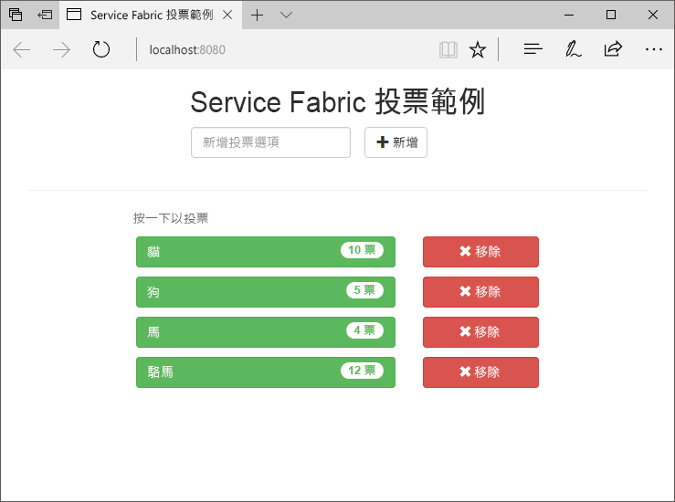
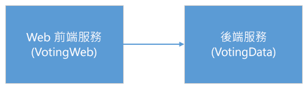
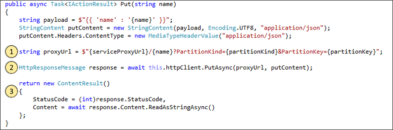
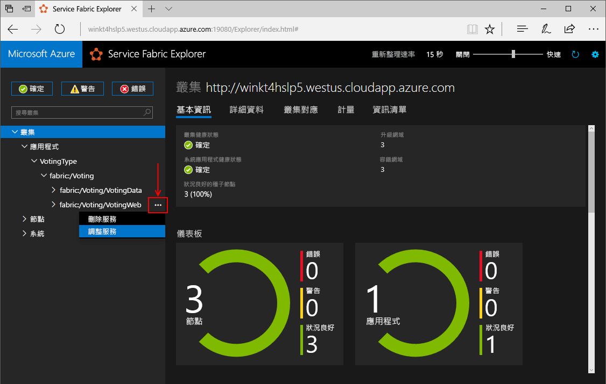
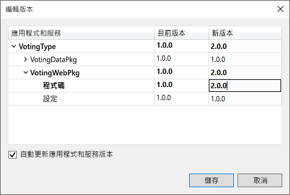
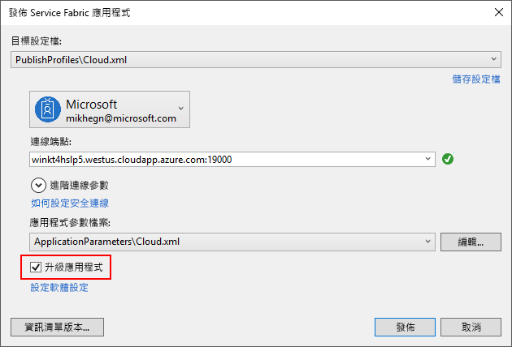
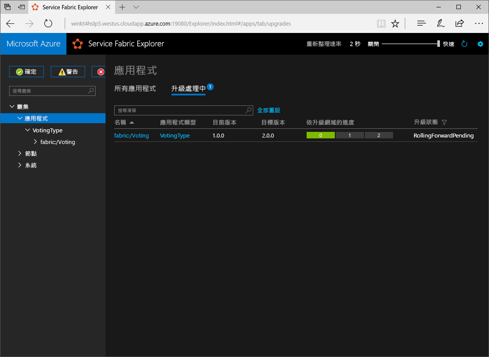

# <a name="create-a-net-service-fabric-application-in-azure"></a>在 Azure 中建立 .NET Service Fabric 應用程式
Azure Service Fabric 是一個分散式系統平台，可讓您部署及管理可調整和可信賴的微服務與容器。 

本快速入門示範如何 toodeploy 您第一次的.NET 應用程式 tooService 網狀架構。 當您完成時，必須具有 ASP.NET Core web 前端，將投票的結果儲存在可設定狀態的後端服務 hello 叢集中的投票應用程式。



使用此應用程式，您將了解如何：
> [!div class="checklist"]
> * 建立使用 .NET 和 Service Fabric 的應用程式
> * 使用 ASP.NET Core 作為 Web 前端
> * 將應用程式資料儲存在具狀態服務中
> * 在本機偵錯您的應用程式
> * 部署在 Azure 中的 hello 應用程式 tooa 叢集
> * 在多個節點的向外延展 hello 應用程式
> * 執行輪流應用程式升級

## <a name="prerequisites"></a>必要條件
toocomplete 本快速入門：
1. [安裝 Visual Studio 2017](https://www.visualstudio.com/)以 hello **Azure 開發**和**ASP.NET 及 web 開發**工作負載。
2. [安裝 Git](https://git-scm.com/)
3. [安裝 Microsoft Azure Service Fabric SDK hello](http://www.microsoft.com/web/handlers/webpi.ashx?command=getinstallerredirect&appid=MicrosoftAzure-ServiceFabric-CoreSDK)
4. 執行下列命令 tooenable Visual Studio toodeploy toohello 本機 Service Fabric 叢集 hello:
    ```powershell
    Set-ExecutionPolicy -ExecutionPolicy Unrestricted -Force -Scope CurrentUser
    ```

## <a name="download-hello-sample"></a>下載 hello 範例
在命令視窗中，執行下列命令 tooclone hello 範例應用程式儲存機制 tooyour 本機電腦的 hello。
```
git clone https://github.com/Azure-Samples/service-fabric-dotnet-quickstart
```

## <a name="run-hello-application-locally"></a>在本機執行 hello 應用程式
Hello hello 開始] 功能表中的 Visual Studio 圖示上按一下滑鼠右鍵，然後選擇 [**系統管理員身分執行**。 在順序 tooattach hello 偵錯工具 tooyour services 中，您會需要 toorun Visual Studio 系統管理員身分。

開啟 hello **Voting.sln** hello 您用於複製的儲存機制中的 Visual Studio 方案。

toodeploy hello 應用程式，請按**F5**。

> [!NOTE]
> hello 第一次執行，並部署 hello 應用程式，Visual Studio 會建立偵錯的本機叢集。 這項作業可能需要一些時間。 hello Visual Studio 輸出 視窗中會顯示 hello 叢集建立狀態。

Hello 部署完成後，啟動瀏覽器，並開啟此頁面： `http://localhost:8080` -hello web 前端的 hello 應用程式。


您現在可以新增一組投票選項，並開始進行投票。 hello 應用程式執行，並將所有資料都儲存在 Service Fabric 叢集中，而需要不同的資料庫在 hello。

## <a name="walk-through-hello-voting-sample-application"></a>逐步解說 hello 投票範例應用程式
hello 投票應用程式是由兩個服務所組成：
- Web 前端服務 (VotingWeb)-ASP.NET Core web 前端服務，會做 hello 網頁，並公開 web Api toocommunicate 與 hello 後端服務。
- 後端服務 (VotingData)-ASP.NET Core web 服務會公開 API toostore hello 投票結果可靠的字典中保存在磁碟。



當您在下列的 hello 應用程式 hello 投票事件就會發生：
1. JavaScript 會以 HTTP PUT 要求傳送 hello web 前端服務中的 hello 投票要求 toohello web API。

2. hello web 前端服務會使用 proxy toolocate 及轉送 HTTP PUT 要求 toohello 後端服務。

3. hello 後端服務大約需要 hello 傳入的要求，並儲存區 hello 更新在可靠字典中，取得複寫的 toomultiple hello 叢集中的節點，並保存在磁碟上的結果。 所有 hello 應用程式的資料儲存在 hello 叢集中，因此不需要任何資料庫。

## <a name="debug-in-visual-studio"></a>在 Visual Studio 中偵錯
在 Visual Studio 中偵錯應用程式時，您會使用本機 Service Fabric 開發叢集。 您擁有 hello 選項 tooadjust 您偵錯的體驗 tooyour 案例。 在此應用程式中，我們將資料儲存在使用可靠字典的後端服務中。 Visual Studio 移除 hello 應用程式，根據預設，當您停止 hello 偵錯工具。 移除 hello 應用程式造成 hello 資料在 hello 後端服務 tooalso 被移除。 toopersist hello 偵錯工作階段之間的資料，您可以變更 hello**應用程式偵錯模式**為 hello 屬性**投票**Visual Studio 專案中的。

在發生的事 hello 程式碼中，完成下列步驟的 hello toolook:
1. 開啟 hello **VotesController.cs**檔案，並設定中斷點，在 hello web API 的**放**方法 （列 47）-您可以搜尋 hello Visual Studio 中的 [方案總管] 中的 hello 檔案。

2. 開啟 hello **VoteDataController.cs**檔案，並設定中斷點，在這個 web API**放**方法 （行 50）。

3. 返回 toohello 瀏覽器後，請按一下投票選項或加入新的投票選項。 您已達到 hello hello web 前端端的 api 控制器中的第一個中斷點。
    - 這是其中 hello 瀏覽器中的 hello JavaScript 要求 toohello web API 控制器會以傳送 hello 前端服務。
    
    

    - 我們第一次針對我們的後端服務建構 hello URL toohello ReverseProxy **(1)**。
    - 接著，我們將傳送嗨 HTTP PUT 要求 toohello ReverseProxy **(2)**。
    - 最後 hello 我們決定傳回 hello 回應 hello 後端服務 toohello 用戶端從**(3)**。

4. 按**F5** toocontinue
    - 現在您已位於 hello 中斷點 hello 後端服務。
    
    

    - Hello hello 方法中的第一行**(1)**我們使用 hello `StateManager` tooget 或可靠的字典，稱為`counts`。
    - 與可靠字典中的值進行的所有互動，都需要交易，這會使用陳述式 **(2)** 建立該交易。
    - 在 hello 交易中，我們再更新 hello hello hello 投票選項的相關索引鍵的值，而且認可 hello 作業**(3)**。 一旦認可 hello 方法傳回時，hello 資料更新 hello 字典中，然後複寫 tooother hello 叢集中的節點。 hello 現在會安全地儲存資料 hello 叢集中，hello 後端服務可以容錯移轉 tooother 節點，仍有可用的 hello 資料。
5. 按**F5** toocontinue

偵錯工作階段，請按 toostop hello **Shift + F5**。

## <a name="deploy-hello-application-tooazure"></a>部署 hello 應用程式 tooAzure
toodeploy hello 應用程式 tooa 叢集在 Azure 中的，您可以選擇 toocreate 您自己的叢集或使用合作對象叢集。

合作對象的叢集是免費的限時 Service Fabric 叢集裝載於 Azure，並執行 hello Service Fabric 小組的任何人都可以在此部署的應用程式，並了解 hello 平台。 tooget 存取 tooa 合作對象叢集[遵循 hello](http://aka.ms/tryservicefabric)。 

如需建立您自己叢集的資訊，請參閱[在 Azure 上建立您的第一個 Service Fabric 叢集](service-fabric-get-started-azure-cluster.md)。

> [!Note]
> 設定連入流量的連接埠 8080 上 toolisten hello web 前端服務。 請確定您的叢集中已開啟該連接埠。 如果您使用 hello 合作對象叢集，此連接埠已開啟。
>

### <a name="deploy-hello-application-using-visual-studio"></a>部署使用 Visual Studio 的 hello 應用程式
現在已準備好 hello 應用程式，您可以直接從 Visual Studio tooa 叢集對它進行部署。

1. 以滑鼠右鍵按一下**投票**hello 中的 方案總管，然後選擇 **發行**。 hello 發行對話方塊隨即出現。

    ![[發佈] 對話方塊](./media/service-fabric-quickstart-dotnet/publish-app.png)

2. Hello 連接端點中的型別，hello 中的 hello 叢集**連接端點**欄位，然後按一下**發行**。 註冊 hello 合作對象叢集，請 hello 連接端點就會提供在 hello 瀏覽器中。 例如 `winh1x87d1d.westus.cloudapp.azure.com:19000`。

3. 比方說，在 hello 叢集位址-開啟瀏覽器並輸入`http://winh1x87d1d.westus.cloudapp.azure.com`。 您現在應該會看到 hello Azure 中的 hello 叢集中執行的應用程式。


## <a name="scale-applications-and-services-in-a-cluster"></a>調整叢集中的應用程式和服務
Service Fabric 服務輕鬆地跨越叢集 tooaccommodate hello 負載 hello 服務上的變更。 您可以調整服務藉由變更 hello hello 叢集中執行的執行個體的數目。 您有多種方法來調整您的服務，您可以使用 PowerShell 或 Service Fabric CLI (sfctl) 中的指令碼或命令。 在此範例中，我們使用 Service Fabric Explorer。

Service Fabric 總管執行所有的 Service Fabric 叢集中，並可以從瀏覽器，瀏覽 toohello 叢集 HTTP 管理連接埠 (19080)，例如，存取`http://winh1x87d1d.westus.cloudapp.azure.com:19080`。

tooscale hello web 前端服務，請執行下列步驟 hello:

1. 在您的叢集中開啟 Service Fabric Explorer，例如 `http://winh1x87d1d.westus.cloudapp.azure.com:19080`。
2. 按一下 下一步 toohello 的 hello 省略符號 （三個點）**網狀架構： 投票/VotingWeb**節點在 hello 樹狀檢視，然後選擇 **縮放服務**。

    

    您現在可以選擇 tooscale hello 數目 hello web 前端服務的執行個體。

3. 變更 hello 編號太**2**按一下**縮放服務**。
4. 按一下 hello **fabric: / 投票/VotingWeb** hello 樹狀檢視中的節點，並展開 hello 資料分割的節點 （以 GUID 表示）。

    ![Service Fabric Explorer 的 [調整服務]](./media/service-fabric-quickstart-dotnet/service-fabric-explorer-scaled-service.png)

    您現在可以看到 hello 服務有兩個執行個體，和 hello 樹狀檢視中，您查看 hello 執行個體執行的節點。

這項簡單的管理工作，我們的一倍 hello 資源可以使用我們的前端服務 tooprocess 使用者負載。 您不需要它能夠可靠地執行服務 toohave 的多個執行個體的重要 toounderstand 它。 如果服務失敗時，Service Fabric 可確保新的服務執行個體執行於 hello 叢集中。

## <a name="perform-a-rolling-application-upgrade"></a>執行輪流應用程式升級
在部署新的更新 tooyour 應用程式時，Service Fabric 中推出 hello 更新安全的方式。 輪流升級可讓您在不需要停機的情況下進行升級，並在發生錯誤時自動復原。

tooupgrade hello 應用程式中，執行下列 hello:

1. 開啟 hello **Index.cshtml**檔案在 Visual Studio-您可以搜尋 hello Visual Studio 中的 [方案總管] 中的 hello 檔案。
2. 加入一些文字-例如，變更 hello hello 頁面上的標題。
    ```html
        <div class="col-xs-8 col-xs-offset-2 text-center">
            <h2>Service Fabric Voting Sample v2</h2>
        </div>
    ```
3. 儲存 hello 檔案。
4. 以滑鼠右鍵按一下**投票**hello 中的 方案總管，然後選擇 **發行**。 hello 發行對話方塊隨即出現。
5. 按一下 hello**資訊清單版本**按鈕 toochange hello hello 服務版本與應用程式。
6. 變更 hello 版的 hello**程式碼**項目底下**VotingWebPkg**太"2.0.0"，範例中，然後按一下**儲存**。

    
7. 在 hello**發行 Service Fabric 應用程式**對話方塊中，核取 hello 升級 hello 應用程式核取方塊，然後按一下**發行**。

    
8. 開啟您的瀏覽器並瀏覽 toohello 19080-連接埠上的叢集位址，例如`http://winh1x87d1d.westus.cloudapp.azure.com:19080`。
9. 按一下 hello**應用程式**hello 樹狀檢視中的節點，然後**升級正在進行中的**hello 右側窗格中。 您會看到如何 hello 升級彙透過 hello 升級網域中您的叢集，並確定每個網域是下一步之前繼續 toohello 狀況良好。
    

    Service Fabric 可確保升級安全藉由等待兩分鐘後升級 hello hello 叢集中的每個節點上的服務。 預期 hello 整個更新 tootake 約 8 分鐘。

10. 當執行 hello 升級時，您仍然可以使用 hello 應用程式。 由於您擁有 hello 叢集中執行的 hello 服務的兩個執行個體，部分您要求可能會收到已升級的版本的 hello 應用程式，而其他人可能仍會收到 hello 舊版本。

## <a name="next-steps"></a>後續步驟
在此快速入門中，您已了解如何：

> [!div class="checklist"]
> * 建立使用 .NET 和 Service Fabric 的應用程式
> * 使用 ASP.NET Core 作為 Web 前端
> * 將應用程式資料儲存在具狀態服務中
> * 在本機偵錯您的應用程式
> * 部署在 Azure 中的 hello 應用程式 tooa 叢集
> * 在多個節點的向外延展 hello 應用程式
> * 執行輪流應用程式升級

深入了解服務的網狀架構和.NET toolearn 看一下本教學課程：
> [!div class="nextstepaction"]
> [Service Fabric 上的 .NET 應用程式](service-fabric-tutorial-create-dotnet-app.md)