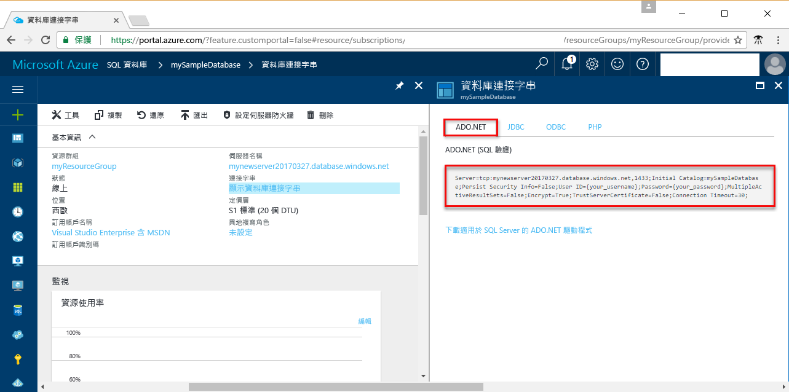

# <a name="use-net-c-with-visual-studio-tooconnect-and-query-an-azure-sql-database"></a><span data-ttu-id="5a506-103">使用 Visual Studio tooconnect.NET (C#) 和查詢 Azure SQL database</span><span class="sxs-lookup"><span data-stu-id="5a506-103">Use .NET (C#) with Visual Studio tooconnect and query an Azure SQL database</span></span>

<span data-ttu-id="5a506-104">本快速入門教學課程示範如何 toouse hello [.NET framework](https://www.microsoft.com/net/) toocreate C# 程式使用 Visual Studio tooconnect tooan Azure SQL database，並使用 Transact SQL 陳述式 tooquery 資料。</span><span class="sxs-lookup"><span data-stu-id="5a506-104">This quick start tutorial demonstrates how toouse hello [.NET framework](https://www.microsoft.com/net/) toocreate a C# program with Visual Studio tooconnect tooan Azure SQL database and use Transact-SQL statements tooquery data.</span></span>

## <a name="prerequisites"></a><span data-ttu-id="5a506-105">必要條件</span><span class="sxs-lookup"><span data-stu-id="5a506-105">Prerequisites</span></span>

<span data-ttu-id="5a506-106">toocomplete 此快速入門教學課程，請確定您擁有 hello 下列：</span><span class="sxs-lookup"><span data-stu-id="5a506-106">toocomplete this quick start tutorial, make sure you have hello following:</span></span>

- <span data-ttu-id="5a506-107">Azure SQL Database。</span><span class="sxs-lookup"><span data-stu-id="5a506-107">An Azure SQL database.</span></span> <span data-ttu-id="5a506-108">本快速入門會使用 hello 資源建立在其中一個這些快速入門：</span><span class="sxs-lookup"><span data-stu-id="5a506-108">This quick start uses hello resources created in one of these quick starts:</span></span> 

   - [<span data-ttu-id="5a506-109">建立 DB - 入口網站</span><span class="sxs-lookup"><span data-stu-id="5a506-109">Create DB - Portal</span></span>](sql-database-get-started-portal.md)
   - [<span data-ttu-id="5a506-110">建立 DB - CLI</span><span class="sxs-lookup"><span data-stu-id="5a506-110">Create DB - CLI</span></span>](sql-database-get-started-cli.md)
   - [<span data-ttu-id="5a506-111">建立 DB - PowerShell</span><span class="sxs-lookup"><span data-stu-id="5a506-111">Create DB - PowerShell</span></span>](sql-database-get-started-powershell.md)

- <span data-ttu-id="5a506-112">A[伺服器層級防火牆規則](sql-database-get-started-portal.md#create-a-server-level-firewall-rule)您使用此快速入門教學課程中的 hello 電腦 hello 公用 IP 位址。</span><span class="sxs-lookup"><span data-stu-id="5a506-112">A [server-level firewall rule](sql-database-get-started-portal.md#create-a-server-level-firewall-rule) for hello public IP address of hello computer you use for this quick start tutorial.</span></span>
- <span data-ttu-id="5a506-113">安裝 [Visual Studio Community 2017、Visual Studio Professional 2017 或 Visual Studio Enterprise 2017](https://www.visualstudio.com/downloads/)。</span><span class="sxs-lookup"><span data-stu-id="5a506-113">An installation of [Visual Studio Community 2017, Visual Studio Professional 2017, or Visual Studio Enterprise 2017](https://www.visualstudio.com/downloads/).</span></span>

## <a name="sql-server-connection-information"></a><span data-ttu-id="5a506-114">SQL Server 連線資訊</span><span class="sxs-lookup"><span data-stu-id="5a506-114">SQL server connection information</span></span>

<span data-ttu-id="5a506-115">收到 hello 連線所需的資訊 tooconnect toohello Azure SQL database。</span><span class="sxs-lookup"><span data-stu-id="5a506-115">Get hello connection information needed tooconnect toohello Azure SQL database.</span></span> <span data-ttu-id="5a506-116">您需要 hello 完整的伺服器名稱、 資料庫名稱，以及 hello 下一個程序中的登入資訊。</span><span class="sxs-lookup"><span data-stu-id="5a506-116">You will need hello fully qualified server name, database name, and login information in hello next procedures.</span></span>

1. <span data-ttu-id="5a506-117">登入 toohello [Azure 入口網站](https://portal.azure.com/)。</span><span class="sxs-lookup"><span data-stu-id="5a506-117">Log in toohello [Azure portal](https://portal.azure.com/).</span></span>
2. <span data-ttu-id="5a506-118">選取**SQL 資料庫**從 hello 左側功能表中，按一下您的資料庫上 hello **SQL 資料庫**頁面。</span><span class="sxs-lookup"><span data-stu-id="5a506-118">Select **SQL Databases** from hello left-hand menu, and click your database on hello **SQL databases** page.</span></span> 
3. <span data-ttu-id="5a506-119">在 hello**概觀**頁面為您的資料庫檢閱 hello 完整伺服器名稱 hello 下列影像所示。</span><span class="sxs-lookup"><span data-stu-id="5a506-119">On hello **Overview** page for your database, review hello fully qualified server name as shown in hello following image.</span></span> <span data-ttu-id="5a506-120">您可以將滑鼠停留在 hello 伺服器名稱 toobring 向上 hello**按一下 toocopy**選項。</span><span class="sxs-lookup"><span data-stu-id="5a506-120">You can hover over hello server name toobring up hello **Click toocopy** option.</span></span> 

    

4. <span data-ttu-id="5a506-122">如果您忘記您的 Azure SQL Database 伺服器登入資訊，請瀏覽 toohello SQL 資料庫伺服器頁面 tooview hello 伺服器管理員的名稱。</span><span class="sxs-lookup"><span data-stu-id="5a506-122">If you forget your Azure SQL Database server login information, navigate toohello SQL Database server page tooview hello server admin name.</span></span> <span data-ttu-id="5a506-123">如有必要，您可以將 hello 密碼重設。</span><span class="sxs-lookup"><span data-stu-id="5a506-123">You can reset hello password if necessary.</span></span>

5. <span data-ttu-id="5a506-124">按一下 [顯示資料庫連接字串]。</span><span class="sxs-lookup"><span data-stu-id="5a506-124">Click **Show database connection strings**.</span></span>

6. <span data-ttu-id="5a506-125">完成檢閱 hello **ADO.NET**連接字串。</span><span class="sxs-lookup"><span data-stu-id="5a506-125">Review hello complete **ADO.NET** connection string.</span></span>

    

> [!IMPORTANT]
> <span data-ttu-id="5a506-127">防火牆規則必須可供您執行本教學課程中的 hello 電腦的 hello 公用 IP 位址。</span><span class="sxs-lookup"><span data-stu-id="5a506-127">You must have a firewall rule in place for hello public IP address of hello computer on which you perform this tutorial.</span></span> <span data-ttu-id="5a506-128">如果您在不同電腦上或有不同的公用 IP 位址，建立[伺服器層級防火牆規則使用 hello Azure 入口網站](sql-database-get-started-portal.md#create-a-server-level-firewall-rule)。</span><span class="sxs-lookup"><span data-stu-id="5a506-128">If you are on a different computer or have a different public IP address, create a [server-level firewall rule using hello Azure portal](sql-database-get-started-portal.md#create-a-server-level-firewall-rule).</span></span> 
>
  
## <a name="create-a-new-visual-studio-project"></a><span data-ttu-id="5a506-129">建立新的 Visual Studio 專案</span><span class="sxs-lookup"><span data-stu-id="5a506-129">Create a new Visual Studio project</span></span>

1. <span data-ttu-id="5a506-130">在 Visual Studio 中，選擇 [檔案]、[新增]、[專案]。</span><span class="sxs-lookup"><span data-stu-id="5a506-130">In Visual Studio, choose **File**, **New**, **Project**.</span></span> 
2. <span data-ttu-id="5a506-131">在 [hello**新專案**] 對話方塊中，展開**Visual C#**。</span><span class="sxs-lookup"><span data-stu-id="5a506-131">In hello **New Project** dialog, and expand **Visual C#**.</span></span>
3. <span data-ttu-id="5a506-132">選取**主控台應用程式**輸入*sqltest* hello 專案名稱。</span><span class="sxs-lookup"><span data-stu-id="5a506-132">Select **Console App** and enter *sqltest* for hello project name.</span></span>
4. <span data-ttu-id="5a506-133">按一下**確定**toocreate 和 Visual Studio 中的開啟 hello 新專案</span><span class="sxs-lookup"><span data-stu-id="5a506-133">Click **OK** toocreate and open hello new project in Visual Studio</span></span>
4. <span data-ttu-id="5a506-134">在 [方案總管] 中，以滑鼠右鍵按一下 [sqltest]，然後按一下 [管理 NuGet 套件]。</span><span class="sxs-lookup"><span data-stu-id="5a506-134">In Solution Explorer, right-click **sqltest** and click **Manage NuGet Packages**.</span></span> 
5. <span data-ttu-id="5a506-135">在 hello**瀏覽**，搜尋```System.Data.SqlClient```，當找到，請選取。</span><span class="sxs-lookup"><span data-stu-id="5a506-135">On hello **Browse**, search for ```System.Data.SqlClient``` and, when found, select it.</span></span>
6. <span data-ttu-id="5a506-136">在 hello **System.Data.SqlClient**頁面上，按一下**安裝**。</span><span class="sxs-lookup"><span data-stu-id="5a506-136">In hello **System.Data.SqlClient** page, click **Install**.</span></span>
7. <span data-ttu-id="5a506-137">Hello 安裝完成時，檢閱 hello 變更，然後按一下**確定**tooclose hello**預覽**視窗。</span><span class="sxs-lookup"><span data-stu-id="5a506-137">When hello install completes, review hello changes and then click **OK** tooclose hello **Preview** window.</span></span> 
8. <span data-ttu-id="5a506-138">如果 [授權接受] 視窗出現時，按一下 [我接受]。</span><span class="sxs-lookup"><span data-stu-id="5a506-138">If a **License Acceptance** window appears, click **I Accept**.</span></span>

## <a name="insert-code-tooquery-sql-database"></a><span data-ttu-id="5a506-139">插入程式碼 tooquery SQL 資料庫</span><span class="sxs-lookup"><span data-stu-id="5a506-139">Insert code tooquery SQL database</span></span>
1. <span data-ttu-id="5a506-140">太切換 （或開啟如有必要） **Program.cs**</span><span class="sxs-lookup"><span data-stu-id="5a506-140">Switch too(or open if necessary) **Program.cs**</span></span>

2. <span data-ttu-id="5a506-141">取代 hello 內容**Program.cs**以 hello 下列程式碼並新增值 hello 適當伺服器、 資料庫、 使用者及密碼。</span><span class="sxs-lookup"><span data-stu-id="5a506-141">Replace hello contents of **Program.cs** with hello following code and add hello appropriate values for your server, database, user, and password.</span></span>

```csharp
using System;
using System.Data.SqlClient;
using System.Text;

namespace sqltest
{
    class Program
    {
        static void Main(string[] args)
        {
            try 
            { 
                SqlConnectionStringBuilder builder = new SqlConnectionStringBuilder();
                builder.DataSource = "your_server.database.windows.net"; 
                builder.UserID = "your_user";            
                builder.Password = "your_password";     
                builder.InitialCatalog = "your_database";

                using (SqlConnection connection = new SqlConnection(builder.ConnectionString))
                {
                    Console.WriteLine("\nQuery data example:");
                    Console.WriteLine("=========================================\n");
                    
                    connection.Open();       
                    StringBuilder sb = new StringBuilder();
                    sb.Append("SELECT TOP 20 pc.Name as CategoryName, p.name as ProductName ");
                    sb.Append("FROM [SalesLT].[ProductCategory] pc ");
                    sb.Append("JOIN [SalesLT].[Product] p ");
                    sb.Append("ON pc.productcategoryid = p.productcategoryid;");
                    String sql = sb.ToString();

                    using (SqlCommand command = new SqlCommand(sql, connection))
                    {
                        using (SqlDataReader reader = command.ExecuteReader())
                        {
                            while (reader.Read())
                            {
                                Console.WriteLine("{0} {1}", reader.GetString(0), reader.GetString(1));
                            }
                        }
                    }                    
                }
            }
            catch (SqlException e)
            {
                Console.WriteLine(e.ToString());
            }
            Console.ReadLine();
        }
    }
}
```

## <a name="run-hello-code"></a><span data-ttu-id="5a506-142">執行 hello 程式碼</span><span class="sxs-lookup"><span data-stu-id="5a506-142">Run hello code</span></span>

1. <span data-ttu-id="5a506-143">按**F5** toorun hello 應用程式。</span><span class="sxs-lookup"><span data-stu-id="5a506-143">Press **F5** toorun hello application.</span></span>
2. <span data-ttu-id="5a506-144">請確認 hello 前 20 個資料列會傳回，，然後關閉 hello 應用程式視窗。</span><span class="sxs-lookup"><span data-stu-id="5a506-144">Verify that hello top 20 rows are returned and then close hello application window.</span></span>

## <a name="next-steps"></a><span data-ttu-id="5a506-145">後續步驟</span><span class="sxs-lookup"><span data-stu-id="5a506-145">Next steps</span></span>

- <span data-ttu-id="5a506-146">了解如何太[連接及查詢 Azure SQL database 使用.NET core](sql-database-connect-query-dotnet-core.md) Windows/Linux/macOS 上。</span><span class="sxs-lookup"><span data-stu-id="5a506-146">Learn how too[connect and query an Azure SQL database using .NET core](sql-database-connect-query-dotnet-core.md) on Windows/Linux/macOS.</span></span>  
- <span data-ttu-id="5a506-147">深入了解[開始使用 Windows/Linux/macOS 使用 hello 命令列上的.NET Core](/dotnet/core/tutorials/using-with-xplat-cli)。</span><span class="sxs-lookup"><span data-stu-id="5a506-147">Learn about [Getting started with .NET Core on Windows/Linux/macOS using hello command line](/dotnet/core/tutorials/using-with-xplat-cli).</span></span>
- <span data-ttu-id="5a506-148">了解如何太[設計第一個 Azure SQL database 使用 SSMS](sql-database-design-first-database.md)或[設計第一個 Azure SQL database 使用.NET](sql-database-design-first-database-csharp.md)。</span><span class="sxs-lookup"><span data-stu-id="5a506-148">Learn how too[Design your first Azure SQL database using SSMS](sql-database-design-first-database.md) or [Design your first Azure SQL database using .NET](sql-database-design-first-database-csharp.md).</span></span>
- <span data-ttu-id="5a506-149">如需 .NET 的詳細資訊，請參閱 [.NET 文件](https://docs.microsoft.com/dotnet/)。</span><span class="sxs-lookup"><span data-stu-id="5a506-149">For more information about .NET, see [.NET documentation](https://docs.microsoft.com/dotnet/).</span></span>
