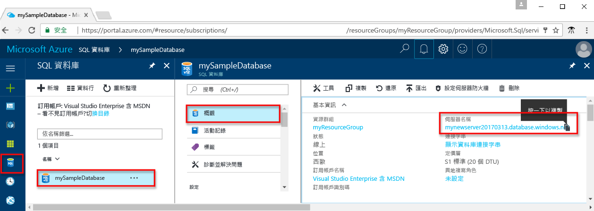

# <a name="use-nodejs-tooquery-an-azure-sql-database"></a>使用 Node.js tooquery Azure SQL database

本快速入門教學課程示範如何 toouse [Node.js](https://nodejs.org/en/) toocreate 程式 tooconnect tooan Azure SQL 資料庫，將 TRANSACT-SQL 陳述式 tooquery 資料。

## <a name="prerequisites"></a>必要條件

toocomplete 此快速入門教學課程，請確定您擁有 hello 下列：

- Azure SQL Database。 本快速入門會使用 hello 資源建立在其中一個這些快速入門： 

   - [建立 DB - 入口網站](sql-database-get-started-portal.md)
   - [建立 DB - CLI](sql-database-get-started-cli.md)
   - [建立 DB - PowerShell](sql-database-get-started-powershell.md)

- A[伺服器層級防火牆規則](sql-database-get-started-portal.md#create-a-server-level-firewall-rule)您使用此快速入門教學課程中的 hello 電腦 hello 公用 IP 位址。
- 您已安裝適用於您作業系統的 Node.js 和相關軟體。
    - **MacOS**： 安裝 Homebrew 和 Node.js，然後再安裝 hello ODBC 驅動程式和 SQLCMD。 請參閱[步驟 1.2 和 1.3](https://www.microsoft.com/sql-server/developer-get-started/node/mac/)。
    - **Ubuntu**： 安裝 Node.js，然後再安裝 hello ODBC 驅動程式和 SQLCMD。 請參閱[步驟 1.2 和 1.3](https://www.microsoft.com/sql-server/developer-get-started/node/ubuntu/)。
    - **Windows**： 安裝 Chocolatey 和 Node.js，然後再安裝 hello ODBC 驅動程式和 SQL CMD. 請參閱[步驟 1.2 和 1.3](https://www.microsoft.com/sql-server/developer-get-started/node/windows/)。

## <a name="sql-server-connection-information"></a>SQL Server 連線資訊

收到 hello 連線所需的資訊 tooconnect toohello Azure SQL database。 您需要 hello 完整的伺服器名稱、 資料庫名稱，以及 hello 下一個程序中的登入資訊。

1. 登入 toohello [Azure 入口網站](https://portal.azure.com/)。
2. 選取**SQL 資料庫**從 hello 左側功能表中，按一下您的資料庫上 hello **SQL 資料庫**頁面。 
3. 在 hello**概觀**頁面為您的資料庫檢閱 hello 完整伺服器名稱 hello 下列影像所示。 您可以將滑鼠停留在 hello 伺服器名稱 toobring 向上 hello**按一下 toocopy**選項。 

    

4. 如果您的 Azure SQL Database 伺服器忘記 hello 登入資訊，請瀏覽 toohello SQL 資料庫伺服器頁面 tooview hello 伺服器管理員的名稱，如有需要，重設 hello 密碼。

> [!IMPORTANT]
> 防火牆規則必須可供您執行本教學課程中的 hello 電腦的 hello 公用 IP 位址。 如果您在不同電腦上或有不同的公用 IP 位址，建立[伺服器層級防火牆規則使用 hello Azure 入口網站](sql-database-get-started-portal.md#create-a-server-level-firewall-rule)。 

## <a name="create-a-nodejs-project"></a>建立 Node.js 專案

開啟命令提示字元，並建立名為 sqltest 的資料夾。 瀏覽您建立並執行下列命令的 hello toohello 資料夾：

    
    npm init -y
    npm install tedious
    npm install async
    

## <a name="insert-code-tooquery-sql-database"></a>插入程式碼 tooquery SQL 資料庫

1. 在您的開發環境或慣用的文字編輯器中，建立新的檔案 **sqltest.js**。

2. 以下列程式碼並新增值 hello 適當伺服器、 資料庫、 使用者及密碼的 hello 取代 hello 內容。

   ```js
   var Connection = require('tedious').Connection;
   var Request = require('tedious').Request;

   // Create connection toodatabase
   var config = 
      {
        userName: 'someuser', // update me
        password: 'somepassword', // update me
        server: 'edmacasqlserver.database.windows.net', // update me
        options: 
           {
              database: 'somedb' //update me
              , encrypt: true
           }
      }
   var connection = new Connection(config);

   // Attempt tooconnect and execute queries if connection goes through
   connection.on('connect', function(err) 
      {
        if (err) 
          {
             console.log(err)
          }
       else
          {
              queryDatabase()
          }
      }
    );

   function queryDatabase()
      { console.log('Reading rows from hello Table...');

          // Read all rows from table
        request = new Request(
             "SELECT TOP 20 pc.Name as CategoryName, p.name as ProductName FROM [SalesLT].[ProductCategory] pc JOIN [SalesLT].[Product] p ON pc.productcategoryid = p.productcategoryid",
                function(err, rowCount, rows) 
                   {
                       console.log(rowCount + ' row(s) returned');
                       process.exit();
                   }
               );
    
        request.on('row', function(columns) {
           columns.forEach(function(column) {
               console.log("%s\t%s", column.metadata.colName, column.value);
            });
                });
        connection.execSql(request);
      }
```

## <a name="run-hello-code"></a>執行 hello 程式碼

1. 在 hello 命令提示字元中執行下列命令的 hello:

   ```js
   node sqltest.js
   ```

2. 請確認 hello 前 20 個資料列會傳回，，然後關閉 hello 應用程式視窗。

## <a name="next-steps"></a>後續步驟

- 深入了解 hello [Microsoft Node.js Driver for SQL Server](https://docs.microsoft.com/sql/connect/node-js/node-js-driver-for-sql-server/)
- 了解如何太[連接及查詢 Azure SQL database 使用.NET core](sql-database-connect-query-dotnet-core.md) Windows/Linux/macOS 上。  
- 深入了解[開始使用 Windows/Linux/macOS 使用 hello 命令列上的.NET Core](/dotnet/core/tutorials/using-with-xplat-cli)。
- 了解如何太[設計第一個 Azure SQL database 使用 SSMS](sql-database-design-first-database.md)或[設計第一個 Azure SQL database 使用.NET](sql-database-design-first-database-csharp.md)。
- 了解如何太[連接和查詢使用 SSMS](sql-database-connect-query-ssms.md)
- 了解如何太[連接和使用 Visual Studio 程式碼查詢](sql-database-connect-query-vscode.md)。


