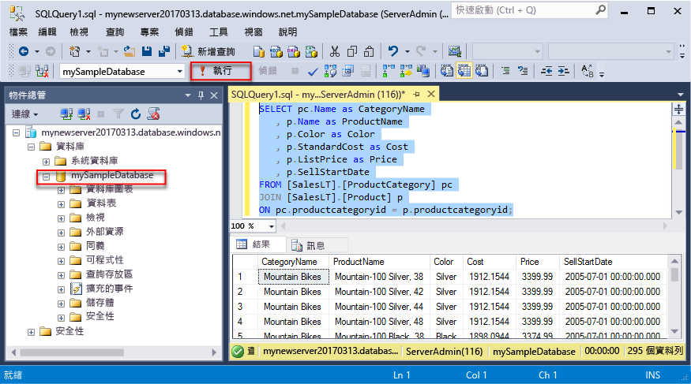
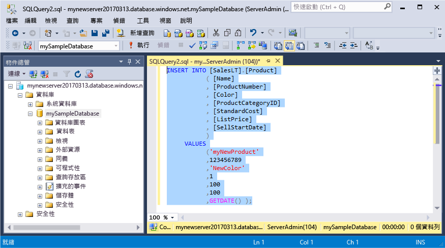
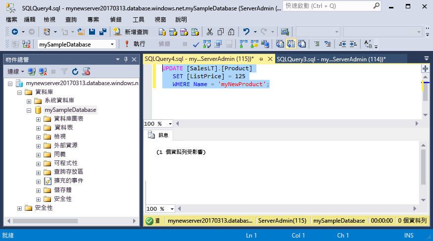
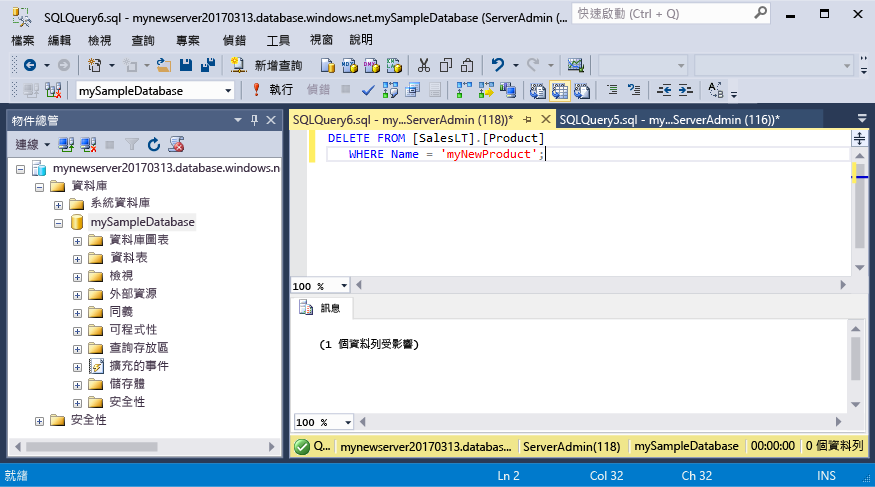

# <a name="azure-sql-database-use-sql-server-management-studio-tooconnect-and-query-data"></a>Azure SQL Database： 使用 SQL Server Management Studio tooconnect 和查詢資料

[SQL Server Management Studio](https://msdn.microsoft.com/library/ms174173.aspx) (SSMS) 是用於管理任何 SQL 基礎結構，從 SQL Server tooSQL 資料庫的 Microsoft Windows 整合式的環境。 本快速入門示範如何 toouse SSMS tooconnect tooan Azure SQL database，然後再使用 TRANSACT-SQL 陳述式 tooquery，插入、 更新和刪除 hello 資料庫中的資料。 

## <a name="prerequisites"></a>必要條件

本快速入門會使用為其起始點 hello 的資源建立在其中一個這些快速入門：

- [建立 DB - 入口網站](sql-database-get-started-portal.md)
- [建立 DB - CLI](sql-database-get-started-cli.md)
- [建立 DB - PowerShell](sql-database-get-started-powershell.md)

開始之前，請確定您已安裝最新版本的中 hello [SSMS](https://msdn.microsoft.com/library/mt238290.aspx)。 

## <a name="sql-server-connection-information"></a>SQL Server 連線資訊

收到 hello 連線所需的資訊 tooconnect toohello Azure SQL database。 您需要 hello 完整的伺服器名稱、 資料庫名稱，以及 hello 下一個程序中的登入資訊。

1. 登入 toohello [Azure 入口網站](https://portal.azure.com/)。
2. 選取**SQL 資料庫**從 hello 左側功能表中，按一下您的資料庫上 hello **SQL 資料庫**頁面。 
3. 在 hello**概觀**為您的資料庫頁面上，檢閱 hello 完整的伺服器名稱，如 hello 圖所示。 您可以將滑鼠停留在 hello 伺服器名稱 toobring 向上 hello**按一下 toocopy**選項。

    

4. 如果您的 Azure SQL Database 伺服器忘記 hello 登入資訊，請瀏覽 toohello SQL 資料庫伺服器頁面 tooview hello 伺服器管理員的名稱，如有需要，重設 hello 密碼。 

## <a name="connect-tooyour-database"></a>連接 tooyour 資料庫

使用 SQL Server Management Studio tooestablish 連接 tooyour Azure SQL Database 伺服器。 

> [!IMPORTANT]
> Azure SQL Database 邏輯伺服器會接聽連接埠 1433。 如果您正嘗試 tooconnect tooan Azure SQL Database 邏輯伺服器從公司防火牆內，此連接埠必須在 hello 公司防火牆中開啟您 toosuccessfully 連線。
>

1. 開啟 SQL Server Management Studio。

2. 在 hello**連接 tooServer**對話方塊方塊中，輸入下列資訊的 hello:

   | 設定       | 建議的值 | 說明 | 
   | ------------ | ------------------ | ------------------------------------------------- | 
   | **伺服器類型** | 資料庫引擎 | 需要此值。 |
   | **伺服器名稱** | hello 完整的伺服器名稱 | hello 名稱應該像下面這樣： **mynewserver20170313.database.windows.net**。 |
   | **驗證** | SQL Server 驗證 | SQL 驗證是我們已在此教學課程中的 hello 唯一的驗證類型。 |
   | **登入** | hello 伺服器系統管理員帳戶 | 這是您指定當您建立 hello 伺服器 hello 帳戶。 |
   | **密碼** | hello 伺服器系統管理員帳戶的密碼 | 這是您指定當您建立 hello 伺服器 hello 密碼。 |

     

3. 按一下**選項**在 hello**連接 tooserver**  對話方塊。 在 hello**連接 toodatabase**區段中，輸入**mySampleDatabase** tooconnect toothis 資料庫。

     

4. 按一下 [ **連接**]。 在 SSMS 中，開啟 hello 物件總管 視窗。 

     

5. 在 物件總管 中，展開**資料庫**，然後展開  **mySampleDatabase** tooview hello 範例資料庫中的 hello 物件。

## <a name="query-data"></a>查詢資料

使用 hello 下列程式碼 tooquery 的 hello 前 20 個產品類別目錄使用 hello[選取](https://msdn.microsoft.com/library/ms189499.aspx)TRANSACT-SQL 陳述式。

1. 在 物件總管 中，於 **mySampleDatabase** 上按一下滑鼠右鍵，然後按一下新增查詢。 空白查詢視窗，也就是開啟連接的 tooyour 資料庫。
2. 在 hello 查詢視窗中，輸入下列查詢的 hello:

   ```sql
   SELECT pc.Name as CategoryName, p.name as ProductName
   FROM [SalesLT].[ProductCategory] pc
   JOIN [SalesLT].[Product] p
   ON pc.productcategoryid = p.productcategoryid;
   ```

3. 在 [hello] 工具列上按一下**Execute** tooretrieve hello Product 和 ProductCategory 資料表的資料。

    

## <a name="insert-data"></a>插入資料

使用 hello 下列程式碼會 tooinsert 新產品到 hello SalesLT.Product 資料表使用 hello[插入](https://msdn.microsoft.com/library/ms174335.aspx)TRANSACT-SQL 陳述式。

1. 在 hello 查詢視窗中，取代 hello 下列查詢中的 hello 上一個查詢：

   ```sql
   INSERT INTO [SalesLT].[Product]
           ( [Name]
           , [ProductNumber]
           , [Color]
           , [ProductCategoryID]
           , [StandardCost]
           , [ListPrice]
           , [SellStartDate]
           )
     VALUES
           ('myNewProduct'
           ,123456789
           ,'NewColor'
           ,1
           ,100
           ,100
           ,GETDATE() );
   ```

2. 在 [hello] 工具列上按一下**Execute** tooinsert hello Product 資料表中的新資料列。

    

## <a name="update-data"></a>更新資料

使用 hello 下列程式碼 tooupdate hello 新產品您先前加入使用 hello[更新](https://msdn.microsoft.com/library/ms177523.aspx)TRANSACT-SQL 陳述式。

1. 在 hello 查詢視窗中，取代 hello 下列查詢中的 hello 上一個查詢：

   ```sql
   UPDATE [SalesLT].[Product]
   SET [ListPrice] = 125
   WHERE Name = 'myNewProduct';
   ```

2. 在 [hello] 工具列上按一下**Execute** tooupdate hello 指定的資料列 hello Product 資料表中。

    

## <a name="delete-data"></a>刪除資料

使用 hello 下列程式碼 toodelete hello 新產品您先前加入使用 hello[刪除](https://msdn.microsoft.com/library/ms189835.aspx)TRANSACT-SQL 陳述式。

1. 在 hello 查詢視窗中，取代 hello 下列查詢中的 hello 上一個查詢：

   ```sql
   DELETE FROM [SalesLT].[Product]
   WHERE Name = 'myNewProduct';
   ```

2. 在 [hello] 工具列上按一下**Execute** toodelete hello 指定的資料列 hello Product 資料表中。

    

## <a name="next-steps"></a>後續步驟

- toolearn 有關建立和管理伺服器和資料庫使用 TRANSACT-SQL，請參閱[深入了解 Azure SQL Database 伺服器和資料庫](sql-database-servers-databases.md)。
- 如需有關 SSMS 的資訊，請參閱 [使用 SQL Server Management Studio](https://msdn.microsoft.com/library/ms174173.aspx)。
- tooconnect 和查詢中使用 Visual Studio 程式碼，請參閱[連接和使用 Visual Studio 程式碼查詢](sql-database-connect-query-vscode.md)。
- tooconnect 和查詢中使用.NET 中，請參閱[連接和查詢的.NET](sql-database-connect-query-dotnet.md)。
- tooconnect 及查詢使用 PHP 時，請參閱[連接和查詢使用 PHP](sql-database-connect-query-php.md)。
- tooconnect 及查詢使用 Node.js，請參閱[連接和查詢使用 Node.js](sql-database-connect-query-nodejs.md)。
- tooconnect 及查詢使用 Java，請參閱[連接和查詢使用 Java](sql-database-connect-query-java.md)。
- tooconnect 和查詢中使用 Python，請參閱[連接和查詢使用 Python](sql-database-connect-query-python.md)。
- tooconnect 及查詢使用 Ruby，請參閱[連接和查詢 Ruby](sql-database-connect-query-ruby.md)。
