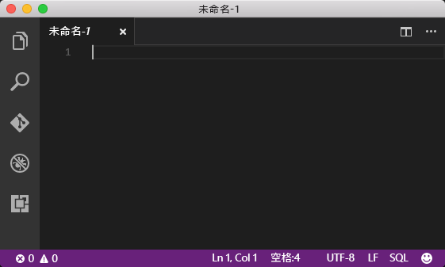
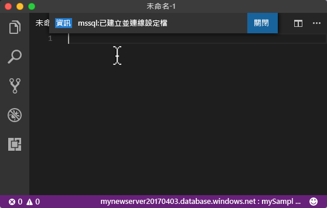
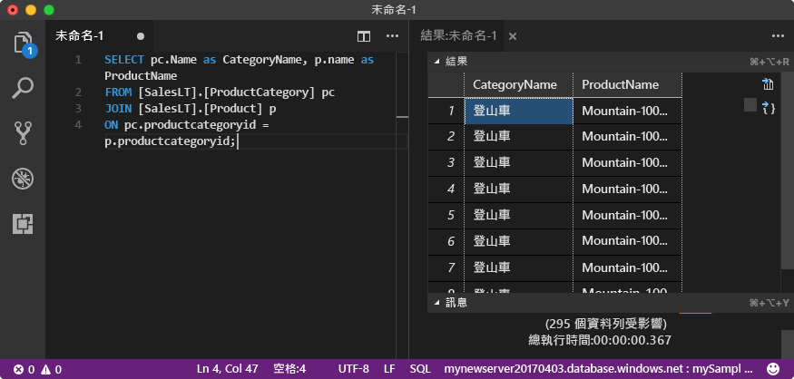

# <a name="azure-sql-database-use-visual-studio-code-tooconnect-and-query-data"></a><span data-ttu-id="fc377-105">Azure SQL Database： 使用 Visual Studio 程式碼 tooconnect 和查詢資料</span><span class="sxs-lookup"><span data-stu-id="fc377-105">Azure SQL Database: Use Visual Studio Code tooconnect and query data</span></span>

<span data-ttu-id="fc377-106">[Visual Studio Code](https://code.visualstudio.com/docs)是適用於 Linux，macOS，圖形化的程式碼編輯器，可支援擴充功能，包括 Windows hello [mssql 延伸](https://aka.ms/mssql-marketplace)Microsoft SQL Server、 Azure SQL Database 和 SQL 資料倉儲查詢。</span><span class="sxs-lookup"><span data-stu-id="fc377-106">[Visual Studio Code](https://code.visualstudio.com/docs) is a graphical code editor for Linux, macOS, and Windows that supports extensions, including hello [mssql extension](https://aka.ms/mssql-marketplace) for querying Microsoft SQL Server, Azure SQL Database, and SQL Data Warehouse.</span></span> <span data-ttu-id="fc377-107">本快速入門示範如何 toouse Visual Studio Code tooconnect tooan Azure SQL database，然後再使用 TRANSACT-SQL 陳述式 tooquery，插入、 更新和刪除 hello 資料庫中的資料。</span><span class="sxs-lookup"><span data-stu-id="fc377-107">This quick start demonstrates how toouse Visual Studio Code tooconnect tooan Azure SQL database, and then use Transact-SQL statements tooquery, insert, update, and delete data in hello database.</span></span>

## <a name="prerequisites"></a><span data-ttu-id="fc377-108">必要條件</span><span class="sxs-lookup"><span data-stu-id="fc377-108">Prerequisites</span></span>

<span data-ttu-id="fc377-109">本快速入門會使用為其起始點 hello 的資源建立在其中一個這些快速入門：</span><span class="sxs-lookup"><span data-stu-id="fc377-109">This quick start uses as its starting point hello resources created in one of these quick starts:</span></span>

- [<span data-ttu-id="fc377-110">建立 DB - 入口網站</span><span class="sxs-lookup"><span data-stu-id="fc377-110">Create DB - Portal</span></span>](sql-database-get-started-portal.md)
- [<span data-ttu-id="fc377-111">建立 DB - CLI</span><span class="sxs-lookup"><span data-stu-id="fc377-111">Create DB - CLI</span></span>](sql-database-get-started-cli.md)
- [<span data-ttu-id="fc377-112">建立 DB - PowerShell</span><span class="sxs-lookup"><span data-stu-id="fc377-112">Create DB - PowerShell</span></span>](sql-database-get-started-powershell.md)

<span data-ttu-id="fc377-113">開始之前，請確定您已安裝最新版本的中 hello [Visual Studio 程式碼](https://code.visualstudio.com/Download)並載入的 hello [mssql 延伸](https://aka.ms/mssql-marketplace)。</span><span class="sxs-lookup"><span data-stu-id="fc377-113">Before you start, make sure you have installed hello newest version of [Visual Studio Code](https://code.visualstudio.com/Download) and loaded hello [mssql extension](https://aka.ms/mssql-marketplace).</span></span> <span data-ttu-id="fc377-114">如需安裝 hello mssql 擴充功能的指引，請參閱[安裝 VS Code](https://docs.microsoft.com/sql/linux/sql-server-linux-develop-use-vscode#install-vs-code) ，請參閱[mssql Visual Studio 程式碼](https://marketplace.visualstudio.com/items?itemName=ms-mssql.mssql)。</span><span class="sxs-lookup"><span data-stu-id="fc377-114">For installation guidance for hello mssql extension, see [Install VS Code](https://docs.microsoft.com/sql/linux/sql-server-linux-develop-use-vscode#install-vs-code) and see [mssql for Visual Studio Code](https://marketplace.visualstudio.com/items?itemName=ms-mssql.mssql).</span></span> 

## <a name="configure-vs-code"></a><span data-ttu-id="fc377-115">設定 VS Code</span><span class="sxs-lookup"><span data-stu-id="fc377-115">Configure VS Code</span></span> 

### <a name="mac-os"></a><span data-ttu-id="fc377-116">**Mac OS**</span><span class="sxs-lookup"><span data-stu-id="fc377-116">**Mac OS**</span></span>
<span data-ttu-id="fc377-117">MacOS，您需要 tooinstall 也就是先決條件的 DotNet 核心該 mssql 附檔名不會使用 OpenSSL。</span><span class="sxs-lookup"><span data-stu-id="fc377-117">For macOS, you need tooinstall OpenSSL which is a prerequiste for DotNet Core that mssql extention uses.</span></span> <span data-ttu-id="fc377-118">開啟您的終端機，並輸入下列命令 tooinstall hello **brew**和**OpenSSL**。</span><span class="sxs-lookup"><span data-stu-id="fc377-118">Open your terminal and enter hello following commands tooinstall **brew** and **OpenSSL**.</span></span> 

```bash
ruby -e "$(curl -fsSL https://raw.githubusercontent.com/Homebrew/install/master/install)"
brew update
brew install openssl
mkdir -p /usr/local/lib
ln -s /usr/local/opt/openssl/lib/libcrypto.1.0.0.dylib /usr/local/lib/
ln -s /usr/local/opt/openssl/lib/libssl.1.0.0.dylib /usr/local/lib/
```

### <a name="linux-ubuntu"></a><span data-ttu-id="fc377-119">**Linux (Ubuntu)**</span><span class="sxs-lookup"><span data-stu-id="fc377-119">**Linux (Ubuntu)**</span></span>

<span data-ttu-id="fc377-120">不需要特別設定。</span><span class="sxs-lookup"><span data-stu-id="fc377-120">No special configuration needed.</span></span>

### <a name="windows"></a><span data-ttu-id="fc377-121">**Windows**</span><span class="sxs-lookup"><span data-stu-id="fc377-121">**Windows**</span></span>

<span data-ttu-id="fc377-122">不需要特別設定。</span><span class="sxs-lookup"><span data-stu-id="fc377-122">No special configuration needed.</span></span>

## <a name="sql-server-connection-information"></a><span data-ttu-id="fc377-123">SQL Server 連線資訊</span><span class="sxs-lookup"><span data-stu-id="fc377-123">SQL server connection information</span></span>

<span data-ttu-id="fc377-124">收到 hello 連線所需的資訊 tooconnect toohello Azure SQL database。</span><span class="sxs-lookup"><span data-stu-id="fc377-124">Get hello connection information needed tooconnect toohello Azure SQL database.</span></span> <span data-ttu-id="fc377-125">您需要 hello 完整的伺服器名稱、 資料庫名稱，以及 hello 下一個程序中的登入資訊。</span><span class="sxs-lookup"><span data-stu-id="fc377-125">You will need hello fully qualified server name, database name, and login information in hello next procedures.</span></span>

1. <span data-ttu-id="fc377-126">登入 toohello [Azure 入口網站](https://portal.azure.com/)。</span><span class="sxs-lookup"><span data-stu-id="fc377-126">Log in toohello [Azure portal](https://portal.azure.com/).</span></span>
2. <span data-ttu-id="fc377-127">選取**SQL 資料庫**從 hello 左側功能表中，按一下您的資料庫上 hello **SQL 資料庫**頁面。</span><span class="sxs-lookup"><span data-stu-id="fc377-127">Select **SQL Databases** from hello left-hand menu, and click your database on hello **SQL databases** page.</span></span> 
3. <span data-ttu-id="fc377-128">在 hello**概觀**頁面為您的資料庫檢閱 hello 完整伺服器名稱 hello 下列影像所示。</span><span class="sxs-lookup"><span data-stu-id="fc377-128">On hello **Overview** page for your database, review hello fully qualified server name as shown in hello following image.</span></span> <span data-ttu-id="fc377-129">您可以將滑鼠停留在 hello 伺服器名稱 toobring 向上 hello**按一下 toocopy**選項。</span><span class="sxs-lookup"><span data-stu-id="fc377-129">You can hover over hello server name toobring up hello **Click toocopy** option.</span></span>

    

4. <span data-ttu-id="fc377-131">如果您的 Azure SQL Database 伺服器忘記 hello 登入資訊，請瀏覽 toohello SQL 資料庫伺服器頁面 tooview hello 伺服器管理員的名稱，如有需要，重設 hello 密碼。</span><span class="sxs-lookup"><span data-stu-id="fc377-131">If you have forgotten hello login information for your Azure SQL Database server, navigate toohello SQL Database server page tooview hello server admin name and, if necessary, reset hello password.</span></span> 

## <a name="set-language-mode-toosql"></a><span data-ttu-id="fc377-132">設定語言模式 tooSQL</span><span class="sxs-lookup"><span data-stu-id="fc377-132">Set language mode tooSQL</span></span>

<span data-ttu-id="fc377-133">設定 hello 語言模式設定得**SQL** Visual Studio Code tooenable mssql 命令以及 T-SQL IntelliSense。</span><span class="sxs-lookup"><span data-stu-id="fc377-133">Set hello language mode is set too**SQL** in Visual Studio Code tooenable mssql commands and T-SQL IntelliSense.</span></span>

1. <span data-ttu-id="fc377-134">開啟新的 Visual Studio Code 視窗。</span><span class="sxs-lookup"><span data-stu-id="fc377-134">Open a new Visual Studio Code window.</span></span> 

2. <span data-ttu-id="fc377-135">按一下**純文字**hello 右下角的 hello 狀態列中。</span><span class="sxs-lookup"><span data-stu-id="fc377-135">Click **Plain Text** in hello lower right-hand corner of hello status bar.</span></span>
3. <span data-ttu-id="fc377-136">在 hello**選取的語言模式**開啟下拉式選單中，輸入**SQL**，然後按**ENTER** tooset hello 語言模式 tooSQL。</span><span class="sxs-lookup"><span data-stu-id="fc377-136">In hello **Select language mode** drop-down menu that opens, type **SQL**, and then press **ENTER** tooset hello language mode tooSQL.</span></span> 

   

## <a name="connect-tooyour-database"></a><span data-ttu-id="fc377-138">連接 tooyour 資料庫</span><span class="sxs-lookup"><span data-stu-id="fc377-138">Connect tooyour database</span></span>

<span data-ttu-id="fc377-139">使用 Visual Studio Code tooestablish 連接 tooyour Azure SQL Database 伺服器。</span><span class="sxs-lookup"><span data-stu-id="fc377-139">Use Visual Studio Code tooestablish a connection tooyour Azure SQL Database server.</span></span>

> [!IMPORTANT]
> <span data-ttu-id="fc377-140">在繼續之前，確定您已備妥伺服器、資料庫和登入資訊。</span><span class="sxs-lookup"><span data-stu-id="fc377-140">Before continuing, make sure that you have your server, database, and login information ready.</span></span> <span data-ttu-id="fc377-141">您開始輸入 hello 連線設定檔資訊，如果您將焦點變更 Visual Studio 程式碼，您便可以 toorestart 建立 hello 連線設定檔。</span><span class="sxs-lookup"><span data-stu-id="fc377-141">Once you begin entering hello connection profile information, if you change your focus from Visual Studio Code, you have toorestart creating hello connection profile.</span></span>
>

1. <span data-ttu-id="fc377-142">在 VS Code 按**CTRL + SHIFT + P** (或**F1**) tooopen hello 命令選擇區。</span><span class="sxs-lookup"><span data-stu-id="fc377-142">In VS Code, press **CTRL+SHIFT+P** (or **F1**) tooopen hello Command Palette.</span></span>

2. <span data-ttu-id="fc377-143">輸入 **sqlcon** 並且按 **ENTER**。</span><span class="sxs-lookup"><span data-stu-id="fc377-143">Type **sqlcon** and press **ENTER**.</span></span>

3. <span data-ttu-id="fc377-144">按**ENTER** tooselect**建立連線設定檔**。</span><span class="sxs-lookup"><span data-stu-id="fc377-144">Press **ENTER** tooselect **Create Connection Profile**.</span></span> <span data-ttu-id="fc377-145">這會為您的 SQL Server 執行個體建立連線設定檔。</span><span class="sxs-lookup"><span data-stu-id="fc377-145">This creates a connection profile for your SQL Server instance.</span></span>

4. <span data-ttu-id="fc377-146">請遵循 hello 提示 toospecify hello 連接 hello 新連線設定檔的內容。</span><span class="sxs-lookup"><span data-stu-id="fc377-146">Follow hello prompts toospecify hello connection properties for hello new connection profile.</span></span> <span data-ttu-id="fc377-147">指定每個值之後, 按**ENTER** toocontinue。</span><span class="sxs-lookup"><span data-stu-id="fc377-147">After specifying each value, press **ENTER** toocontinue.</span></span> 

   | <span data-ttu-id="fc377-148">設定</span><span class="sxs-lookup"><span data-stu-id="fc377-148">Setting</span></span>       | <span data-ttu-id="fc377-149">建議的值</span><span class="sxs-lookup"><span data-stu-id="fc377-149">Suggested value</span></span> | <span data-ttu-id="fc377-150">說明</span><span class="sxs-lookup"><span data-stu-id="fc377-150">Description</span></span> |
   | ------------ | ------------------ | ------------------------------------------------- | 
   | <span data-ttu-id="fc377-151">**伺服器名稱</span><span class="sxs-lookup"><span data-stu-id="fc377-151">**Server name</span></span> | <span data-ttu-id="fc377-152">hello 完整的伺服器名稱</span><span class="sxs-lookup"><span data-stu-id="fc377-152">hello fully qualified server name</span></span> | <span data-ttu-id="fc377-153">hello 名稱應該像下面這樣： **mynewserver20170313.database.windows.net**。</span><span class="sxs-lookup"><span data-stu-id="fc377-153">hello name should be something like this: **mynewserver20170313.database.windows.net**.</span></span> |
   | <span data-ttu-id="fc377-154">**資料庫名稱**</span><span class="sxs-lookup"><span data-stu-id="fc377-154">**Database name**</span></span> | <span data-ttu-id="fc377-155">mySampleDatabase</span><span class="sxs-lookup"><span data-stu-id="fc377-155">mySampleDatabase</span></span> | <span data-ttu-id="fc377-156">hello 資料庫 toowhich tooconnect hello 名稱。</span><span class="sxs-lookup"><span data-stu-id="fc377-156">hello name of hello database toowhich tooconnect.</span></span> |
   | <span data-ttu-id="fc377-157">**驗證**</span><span class="sxs-lookup"><span data-stu-id="fc377-157">**Authentication**</span></span> | <span data-ttu-id="fc377-158">SQL 登入</span><span class="sxs-lookup"><span data-stu-id="fc377-158">SQL Login</span></span>| <span data-ttu-id="fc377-159">SQL 驗證是我們已在此教學課程中的 hello 唯一的驗證類型。</span><span class="sxs-lookup"><span data-stu-id="fc377-159">SQL Authentication is hello only authentication type that we have configured in this tutorial.</span></span> |
   | <span data-ttu-id="fc377-160">**使用者名稱**</span><span class="sxs-lookup"><span data-stu-id="fc377-160">**User name**</span></span> | <span data-ttu-id="fc377-161">hello 伺服器系統管理員帳戶</span><span class="sxs-lookup"><span data-stu-id="fc377-161">hello server admin account</span></span> | <span data-ttu-id="fc377-162">這是您指定當您建立 hello 伺服器 hello 帳戶。</span><span class="sxs-lookup"><span data-stu-id="fc377-162">This is hello account that you specified when you created hello server.</span></span> |
   | <span data-ttu-id="fc377-163">**密碼 (SQL 登入)**</span><span class="sxs-lookup"><span data-stu-id="fc377-163">**Password (SQL Login)**</span></span> | <span data-ttu-id="fc377-164">hello 伺服器系統管理員帳戶的密碼</span><span class="sxs-lookup"><span data-stu-id="fc377-164">hello password for your server admin account</span></span> | <span data-ttu-id="fc377-165">這是您指定當您建立 hello 伺服器 hello 密碼。</span><span class="sxs-lookup"><span data-stu-id="fc377-165">This is hello password that you specified when you created hello server.</span></span> |
   | <span data-ttu-id="fc377-166">**儲存密碼？**</span><span class="sxs-lookup"><span data-stu-id="fc377-166">**Save Password?**</span></span> | <span data-ttu-id="fc377-167">是或否</span><span class="sxs-lookup"><span data-stu-id="fc377-167">Yes or No</span></span> | <span data-ttu-id="fc377-168">如果您不想 tooenter hello 密碼每次，請選取 [是]。</span><span class="sxs-lookup"><span data-stu-id="fc377-168">Select Yes if you do not want tooenter hello password each time.</span></span> |
   | <span data-ttu-id="fc377-169">**輸入這個設定檔的名稱**</span><span class="sxs-lookup"><span data-stu-id="fc377-169">**Enter a name for this profile**</span></span> | <span data-ttu-id="fc377-170">設定檔名稱，例如 **mySampleDatabase**</span><span class="sxs-lookup"><span data-stu-id="fc377-170">A profile name, such as **mySampleDatabase**</span></span> | <span data-ttu-id="fc377-171">儲存設定檔名稱可讓您在後續登入時加快連線速度。</span><span class="sxs-lookup"><span data-stu-id="fc377-171">A saved profile name speeds your connection on subsequent logins.</span></span> | 

5. <span data-ttu-id="fc377-172">按 hello **ESC**金鑰 tooclose hello 資訊訊息，通知您已建立 hello 設定檔，並連接。</span><span class="sxs-lookup"><span data-stu-id="fc377-172">Press hello **ESC** key tooclose hello info message that informs you that hello profile is created and connected.</span></span>

6. <span data-ttu-id="fc377-173">請確認您 hello 狀態列中的連線。</span><span class="sxs-lookup"><span data-stu-id="fc377-173">Verify your connection in hello status bar.</span></span>

   

## <a name="query-data"></a><span data-ttu-id="fc377-175">查詢資料</span><span class="sxs-lookup"><span data-stu-id="fc377-175">Query data</span></span>

<span data-ttu-id="fc377-176">使用 hello 下列程式碼 tooquery 的 hello 前 20 個產品類別目錄使用 hello[選取](https://msdn.microsoft.com/library/ms189499.aspx)TRANSACT-SQL 陳述式。</span><span class="sxs-lookup"><span data-stu-id="fc377-176">Use hello following code tooquery for hello top 20 products by category using hello [SELECT](https://msdn.microsoft.com/library/ms189499.aspx) Transact-SQL statement.</span></span>

1. <span data-ttu-id="fc377-177">在 hello**編輯器**視窗中，輸入下列查詢在 hello 空白查詢視窗中的 hello:</span><span class="sxs-lookup"><span data-stu-id="fc377-177">In hello **Editor** window, enter hello following query in hello empty query window:</span></span>

   ```sql
   SELECT pc.Name as CategoryName, p.name as ProductName
   FROM [SalesLT].[ProductCategory] pc
   JOIN [SalesLT].[Product] p
   ON pc.productcategoryid = p.productcategoryid;
   ```

2. <span data-ttu-id="fc377-178">按**CTRL + SHIFT + E** tooretrieve hello Product 和 ProductCategory 資料表的資料。</span><span class="sxs-lookup"><span data-stu-id="fc377-178">Press **CTRL+SHIFT+E** tooretrieve data from hello Product and ProductCategory tables.</span></span>

    

## <a name="insert-data"></a><span data-ttu-id="fc377-180">插入資料</span><span class="sxs-lookup"><span data-stu-id="fc377-180">Insert data</span></span>

<span data-ttu-id="fc377-181">使用 hello 下列程式碼會 tooinsert 新產品到 hello SalesLT.Product 資料表使用 hello[插入](https://msdn.microsoft.com/library/ms174335.aspx)TRANSACT-SQL 陳述式。</span><span class="sxs-lookup"><span data-stu-id="fc377-181">Use hello following code tooinsert a new product into hello SalesLT.Product table using hello [INSERT](https://msdn.microsoft.com/library/ms174335.aspx) Transact-SQL statement.</span></span>

1. <span data-ttu-id="fc377-182">在 hello**編輯器**視窗中，刪除 hello 上一個查詢，然後輸入 hello 下列查詢：</span><span class="sxs-lookup"><span data-stu-id="fc377-182">In hello **Editor** window, delete hello previous query and enter hello following query:</span></span>

   ```sql
   INSERT INTO [SalesLT].[Product]
           ( [Name]
           , [ProductNumber]
           , [Color]
           , [ProductCategoryID]
           , [StandardCost]
           , [ListPrice]
           , [SellStartDate]
           )
     VALUES
           ('myNewProduct'
           ,123456789
           ,'NewColor'
           ,1
           ,100
           ,100
           ,GETDATE() );
   ```

2. <span data-ttu-id="fc377-183">按**CTRL + SHIFT + E** tooinsert hello Product 資料表中的新資料列。</span><span class="sxs-lookup"><span data-stu-id="fc377-183">Press **CTRL+SHIFT+E** tooinsert a new row in hello Product table.</span></span>

## <a name="update-data"></a><span data-ttu-id="fc377-184">更新資料</span><span class="sxs-lookup"><span data-stu-id="fc377-184">Update data</span></span>

<span data-ttu-id="fc377-185">使用 hello 下列程式碼 tooupdate hello 新產品您先前加入使用 hello[更新](https://msdn.microsoft.com/library/ms177523.aspx)TRANSACT-SQL 陳述式。</span><span class="sxs-lookup"><span data-stu-id="fc377-185">Use hello following code tooupdate hello new product that you previously added using hello [UPDATE](https://msdn.microsoft.com/library/ms177523.aspx) Transact-SQL statement.</span></span>

1.  <span data-ttu-id="fc377-186">在 hello**編輯器**視窗中，刪除 hello 上一個查詢，然後輸入 hello 下列查詢：</span><span class="sxs-lookup"><span data-stu-id="fc377-186">In hello **Editor** window, delete hello previous query and enter hello following query:</span></span>

   ```sql
   UPDATE [SalesLT].[Product]
   SET [ListPrice] = 125
   WHERE Name = 'myNewProduct';
   ```

2. <span data-ttu-id="fc377-187">按**CTRL + SHIFT + E** tooupdate hello 指定的資料列 hello Product 資料表中。</span><span class="sxs-lookup"><span data-stu-id="fc377-187">Press **CTRL+SHIFT+E** tooupdate hello specified row in hello Product table.</span></span>

## <a name="delete-data"></a><span data-ttu-id="fc377-188">刪除資料</span><span class="sxs-lookup"><span data-stu-id="fc377-188">Delete data</span></span>

<span data-ttu-id="fc377-189">使用 hello 下列程式碼 toodelete hello 新產品您先前加入使用 hello[刪除](https://msdn.microsoft.com/library/ms189835.aspx)TRANSACT-SQL 陳述式。</span><span class="sxs-lookup"><span data-stu-id="fc377-189">Use hello following code toodelete hello new product that you previously added using hello [DELETE](https://msdn.microsoft.com/library/ms189835.aspx) Transact-SQL statement.</span></span>

1. <span data-ttu-id="fc377-190">在 hello**編輯器**視窗中，刪除 hello 上一個查詢，然後輸入 hello 下列查詢：</span><span class="sxs-lookup"><span data-stu-id="fc377-190">In hello **Editor** window, delete hello previous query and enter hello following query:</span></span>

   ```sql
   DELETE FROM [SalesLT].[Product]
   WHERE Name = 'myNewProduct';
   ```

2. <span data-ttu-id="fc377-191">按**CTRL + SHIFT + E** toodelete hello 指定的資料列 hello Product 資料表中。</span><span class="sxs-lookup"><span data-stu-id="fc377-191">Press **CTRL+SHIFT+E** toodelete hello specified row in hello Product table.</span></span>

## <a name="next-steps"></a><span data-ttu-id="fc377-192">後續步驟</span><span class="sxs-lookup"><span data-stu-id="fc377-192">Next steps</span></span>

- <span data-ttu-id="fc377-193">tooconnect 和查詢中使用 SQL Server Management Studio，請參閱[連接和查詢使用 SSMS](sql-database-connect-query-ssms.md)。</span><span class="sxs-lookup"><span data-stu-id="fc377-193">tooconnect and query using SQL Server Management Studio, see [Connect and query with SSMS](sql-database-connect-query-ssms.md).</span></span>
- <span data-ttu-id="fc377-194">如需有關使用 Visual Studio Code 的 MSDN 雜誌文章，請參閱[使用 MSSQL 擴充功能建立資料庫 IDE 部落格文章](https://msdn.microsoft.com/magazine/mt809115)。</span><span class="sxs-lookup"><span data-stu-id="fc377-194">For an MSDN magazine article on using Visual Studio Code, see [Create a database IDE with MSSQL extension blog post](https://msdn.microsoft.com/magazine/mt809115).</span></span>
