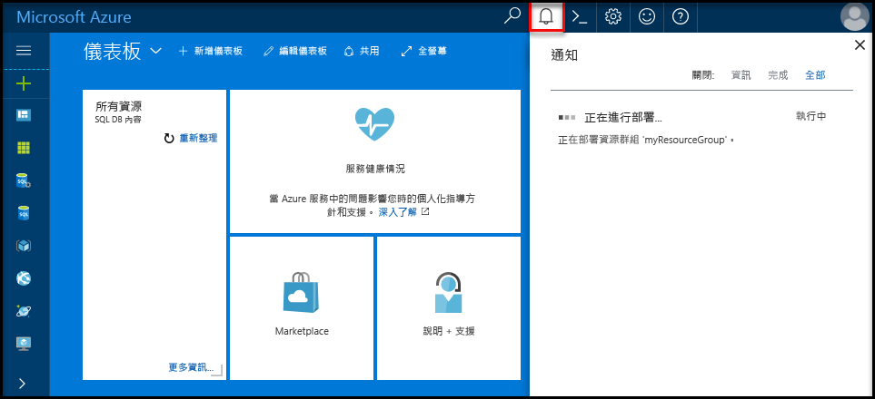
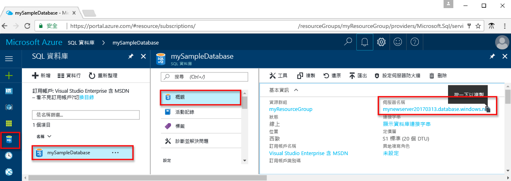
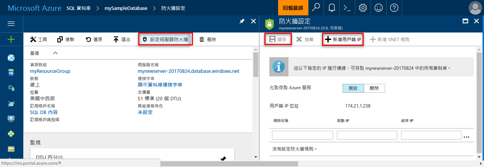
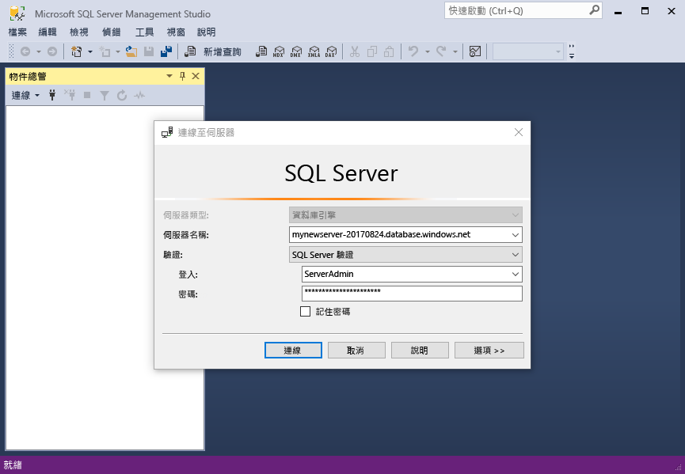
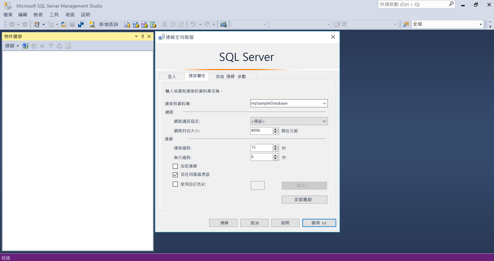
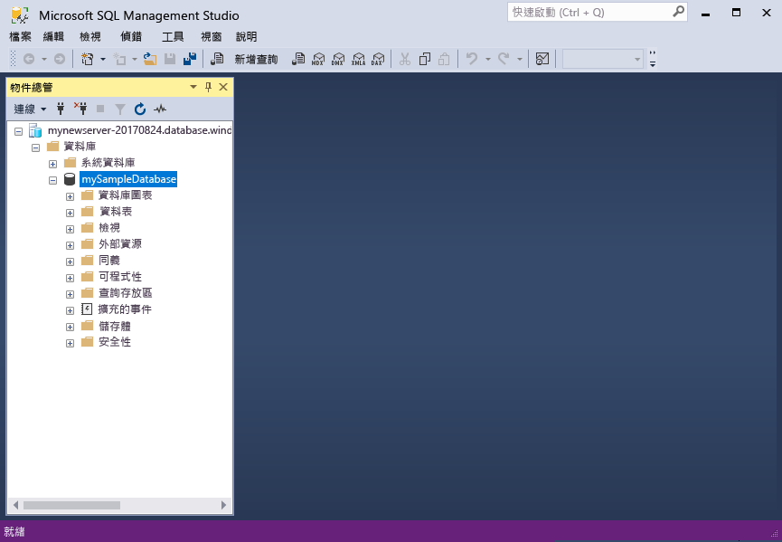

# <a name="design-your-first-azure-sql-database"></a><span data-ttu-id="e5b46-103">設計您的第一個 Azure SQL Database</span><span class="sxs-lookup"><span data-stu-id="e5b46-103">Design your first Azure SQL database</span></span>

<span data-ttu-id="e5b46-104">Azure SQL Database 是關聯式資料庫做為-的中的服務 (DBaaS) hello Microsoft 雲端 ("Azure")。</span><span class="sxs-lookup"><span data-stu-id="e5b46-104">Azure SQL Database is a relational database-as-a service (DBaaS) in hello Microsoft Cloud ("Azure").</span></span> <span data-ttu-id="e5b46-105">在此教學課程中，您學習如何 toouse hello Azure 入口網站和[SQL Server Management Studio](https://msdn.microsoft.com/library/ms174173.aspx) (SSMS) 來：</span><span class="sxs-lookup"><span data-stu-id="e5b46-105">In this tutorial, you learn how toouse hello Azure portal and [SQL Server Management Studio](https://msdn.microsoft.com/library/ms174173.aspx) (SSMS) to:</span></span> 

> [!div class="checklist"]
> * <span data-ttu-id="e5b46-106">Hello Azure 入口網站中建立資料庫</span><span class="sxs-lookup"><span data-stu-id="e5b46-106">Create a database in hello Azure portal</span></span>
> * <span data-ttu-id="e5b46-107">設定在 hello Azure 入口網站中的伺服器層級防火牆規則</span><span class="sxs-lookup"><span data-stu-id="e5b46-107">Set up a server-level firewall rule in hello Azure portal</span></span>
> * <span data-ttu-id="e5b46-108">使用 SSMS 連接 toohello 資料庫</span><span class="sxs-lookup"><span data-stu-id="e5b46-108">Connect toohello database with SSMS</span></span>
> * <span data-ttu-id="e5b46-109">使用 SSMS 建立資料表</span><span class="sxs-lookup"><span data-stu-id="e5b46-109">Create tables with SSMS</span></span>
> * <span data-ttu-id="e5b46-110">使用 BCP 大量載入資料</span><span class="sxs-lookup"><span data-stu-id="e5b46-110">Bulk load data with BCP</span></span>
> * <span data-ttu-id="e5b46-111">使用 SSMS 查詢該資料</span><span class="sxs-lookup"><span data-stu-id="e5b46-111">Query that data with SSMS</span></span>
> * <span data-ttu-id="e5b46-112">還原先前的 hello 資料庫 tooa[還原時間點](sql-database-recovery-using-backups.md#point-in-time-restore)hello Azure 入口網站中</span><span class="sxs-lookup"><span data-stu-id="e5b46-112">Restore hello database tooa previous [point in time restore](sql-database-recovery-using-backups.md#point-in-time-restore) in hello Azure portal</span></span>

<span data-ttu-id="e5b46-113">如果您沒有 Azure 訂用帳戶，請在開始之前先[建立免費帳戶](https://azure.microsoft.com/free/)。</span><span class="sxs-lookup"><span data-stu-id="e5b46-113">If you don't have an Azure subscription, [create a free account](https://azure.microsoft.com/free/) before you begin.</span></span>

## <a name="prerequisites"></a><span data-ttu-id="e5b46-114">必要條件</span><span class="sxs-lookup"><span data-stu-id="e5b46-114">Prerequisites</span></span>

<span data-ttu-id="e5b46-115">toocomplete 此教學課程，請確定您已安裝：</span><span class="sxs-lookup"><span data-stu-id="e5b46-115">toocomplete this tutorial, make sure you have installed:</span></span>
- <span data-ttu-id="e5b46-116">hello 最新版本的[SQL Server Management Studio](https://msdn.microsoft.com/library/ms174173.aspx) (SSMS)。</span><span class="sxs-lookup"><span data-stu-id="e5b46-116">hello newest version of [SQL Server Management Studio](https://msdn.microsoft.com/library/ms174173.aspx) (SSMS).</span></span>
- <span data-ttu-id="e5b46-117">hello 最新版本的[BCP 和 SQLCMD](https://www.microsoft.com/download/details.aspx?id=36433)。</span><span class="sxs-lookup"><span data-stu-id="e5b46-117">hello newest version of [BCP and SQLCMD](https://www.microsoft.com/download/details.aspx?id=36433).</span></span>

## <a name="log-in-toohello-azure-portal"></a><span data-ttu-id="e5b46-118">登入 toohello Azure 入口網站</span><span class="sxs-lookup"><span data-stu-id="e5b46-118">Log in toohello Azure portal</span></span>

<span data-ttu-id="e5b46-119">登入 toohello [Azure 入口網站](https://portal.azure.com/)。</span><span class="sxs-lookup"><span data-stu-id="e5b46-119">Log in toohello [Azure portal](https://portal.azure.com/).</span></span>

## <a name="create-a-blank-sql-database"></a><span data-ttu-id="e5b46-120">建立空白 SQL Database</span><span class="sxs-lookup"><span data-stu-id="e5b46-120">Create a blank SQL database</span></span>

<span data-ttu-id="e5b46-121">Azure SQL Database 會使用一組定義的[計算和儲存體資源](sql-database-service-tiers.md)建立。</span><span class="sxs-lookup"><span data-stu-id="e5b46-121">An Azure SQL database is created with a defined set of [compute and storage resources](sql-database-service-tiers.md).</span></span> <span data-ttu-id="e5b46-122">hello 資料庫內建立[Azure 資源群組](../azure-resource-manager/resource-group-overview.md)和[Azure SQL Database 邏輯伺服器](sql-database-features.md)。</span><span class="sxs-lookup"><span data-stu-id="e5b46-122">hello database is created within an [Azure resource group](../azure-resource-manager/resource-group-overview.md) and in an [Azure SQL Database logical server](sql-database-features.md).</span></span> 

<span data-ttu-id="e5b46-123">請遵循這些步驟 toocreate 空白的 SQL 資料庫。</span><span class="sxs-lookup"><span data-stu-id="e5b46-123">Follow these steps toocreate a blank SQL database.</span></span> 

1. <span data-ttu-id="e5b46-124">按一下 hello**新增**hello 的左上角 hello Azure 入口網站上找到的按鈕。</span><span class="sxs-lookup"><span data-stu-id="e5b46-124">Click hello **New** button found on hello upper left-hand corner of hello Azure portal.</span></span>

2. <span data-ttu-id="e5b46-125">選取**資料庫**從 hello**新增**頁面上，並選取**SQL Database**從 hello**資料庫**頁面。</span><span class="sxs-lookup"><span data-stu-id="e5b46-125">Select **Databases** from hello **New** page, and select **SQL Database** from hello **Databases** page.</span></span> 

   

3. <span data-ttu-id="e5b46-127">填寫 hello SQL Database 表單以下列資訊，hello hello 前面影像所示：</span><span class="sxs-lookup"><span data-stu-id="e5b46-127">Fill out hello SQL Database form with hello following information, as shown on hello preceding image:</span></span>   

   | <span data-ttu-id="e5b46-128">設定</span><span class="sxs-lookup"><span data-stu-id="e5b46-128">Setting</span></span>       | <span data-ttu-id="e5b46-129">建議的值</span><span class="sxs-lookup"><span data-stu-id="e5b46-129">Suggested value</span></span> | <span data-ttu-id="e5b46-130">說明</span><span class="sxs-lookup"><span data-stu-id="e5b46-130">Description</span></span> | 
   | ------------ | ------------------ | ------------------------------------------------- | 
   | <span data-ttu-id="e5b46-131">**資料庫名稱**</span><span class="sxs-lookup"><span data-stu-id="e5b46-131">**Database name**</span></span> | <span data-ttu-id="e5b46-132">mySampleDatabase</span><span class="sxs-lookup"><span data-stu-id="e5b46-132">mySampleDatabase</span></span> | <span data-ttu-id="e5b46-133">如需有效的資料庫名稱，請參閱[資料庫識別碼](https://docs.microsoft.com/sql/relational-databases/databases/database-identifiers)。</span><span class="sxs-lookup"><span data-stu-id="e5b46-133">For valid database names, see [Database Identifiers](https://docs.microsoft.com/sql/relational-databases/databases/database-identifiers).</span></span> | 
   | <span data-ttu-id="e5b46-134">**訂用帳戶**</span><span class="sxs-lookup"><span data-stu-id="e5b46-134">**Subscription**</span></span> | <span data-ttu-id="e5b46-135">您的訂用帳戶</span><span class="sxs-lookup"><span data-stu-id="e5b46-135">Your subscription</span></span>  | <span data-ttu-id="e5b46-136">如需訂用帳戶的詳細資訊，請參閱[訂用帳戶](https://account.windowsazure.com/Subscriptions)。</span><span class="sxs-lookup"><span data-stu-id="e5b46-136">For details about your subscriptions, see [Subscriptions](https://account.windowsazure.com/Subscriptions).</span></span> |
   | <span data-ttu-id="e5b46-137">**資源群組**</span><span class="sxs-lookup"><span data-stu-id="e5b46-137">**Resource group**</span></span> | <span data-ttu-id="e5b46-138">myResourceGroup</span><span class="sxs-lookup"><span data-stu-id="e5b46-138">myResourceGroup</span></span> | <span data-ttu-id="e5b46-139">如需有效的資源群組名稱，請參閱[命名規則和限制](https://docs.microsoft.com/azure/architecture/best-practices/naming-conventions)。</span><span class="sxs-lookup"><span data-stu-id="e5b46-139">For valid resource group names, see [Naming rules and restrictions](https://docs.microsoft.com/azure/architecture/best-practices/naming-conventions).</span></span> |
   | <span data-ttu-id="e5b46-140">**選取來源**</span><span class="sxs-lookup"><span data-stu-id="e5b46-140">**Select source**</span></span> | <span data-ttu-id="e5b46-141">空白資料庫</span><span class="sxs-lookup"><span data-stu-id="e5b46-141">Blank database</span></span> | <span data-ttu-id="e5b46-142">指定應建立空白資料庫。</span><span class="sxs-lookup"><span data-stu-id="e5b46-142">Specifies that a blank database should be created.</span></span> |

4. <span data-ttu-id="e5b46-143">按一下**伺服器**toocreate 及設定新的伺服器，為您新的資料庫。</span><span class="sxs-lookup"><span data-stu-id="e5b46-143">Click **Server** toocreate and configure a new server for your new database.</span></span> <span data-ttu-id="e5b46-144">填寫 hello**表單的新伺服器**以 hello 下列資訊：</span><span class="sxs-lookup"><span data-stu-id="e5b46-144">Fill out hello **New server form** with hello following information:</span></span> 

   | <span data-ttu-id="e5b46-145">設定</span><span class="sxs-lookup"><span data-stu-id="e5b46-145">Setting</span></span>       | <span data-ttu-id="e5b46-146">建議的值</span><span class="sxs-lookup"><span data-stu-id="e5b46-146">Suggested value</span></span> | <span data-ttu-id="e5b46-147">說明</span><span class="sxs-lookup"><span data-stu-id="e5b46-147">Description</span></span> | 
   | ------------ | ------------------ | ------------------------------------------------- | 
   | <span data-ttu-id="e5b46-148">**伺服器名稱**</span><span class="sxs-lookup"><span data-stu-id="e5b46-148">**Server name**</span></span> | <span data-ttu-id="e5b46-149">任何全域唯一名稱</span><span class="sxs-lookup"><span data-stu-id="e5b46-149">Any globally unique name</span></span> | <span data-ttu-id="e5b46-150">如需有效的伺服器名稱，請參閱[命名規則和限制](https://docs.microsoft.com/azure/architecture/best-practices/naming-conventions)。</span><span class="sxs-lookup"><span data-stu-id="e5b46-150">For valid server names, see [Naming rules and restrictions](https://docs.microsoft.com/azure/architecture/best-practices/naming-conventions).</span></span> | 
   | <span data-ttu-id="e5b46-151">**伺服器管理員登入**</span><span class="sxs-lookup"><span data-stu-id="e5b46-151">**Server admin login**</span></span> | <span data-ttu-id="e5b46-152">任何有效名稱</span><span class="sxs-lookup"><span data-stu-id="e5b46-152">Any valid name</span></span> | <span data-ttu-id="e5b46-153">如需有效的登入名稱，請參閱[資料庫識別碼](https://docs.microsoft.com/sql/relational-databases/databases/database-identifiers)。</span><span class="sxs-lookup"><span data-stu-id="e5b46-153">For valid login names, see [Database Identifiers](https://docs.microsoft.com/sql/relational-databases/databases/database-identifiers).</span></span>|
   | <span data-ttu-id="e5b46-154">**密碼**</span><span class="sxs-lookup"><span data-stu-id="e5b46-154">**Password**</span></span> | <span data-ttu-id="e5b46-155">任何有效密碼</span><span class="sxs-lookup"><span data-stu-id="e5b46-155">Any valid password</span></span> | <span data-ttu-id="e5b46-156">您的密碼必須至少為 8 個字元，且必須包含下列類別目錄的 hello 的其中三種字元： 大寫字母、 小寫字元、 數字和非英數字元。</span><span class="sxs-lookup"><span data-stu-id="e5b46-156">Your password must have at least 8 characters and must contain characters from three of hello following categories: upper case characters, lower case characters, numbers, and non-alphanumeric characters.</span></span> |
   | <span data-ttu-id="e5b46-157">**位置**</span><span class="sxs-lookup"><span data-stu-id="e5b46-157">**Location**</span></span> | <span data-ttu-id="e5b46-158">任何有效位置</span><span class="sxs-lookup"><span data-stu-id="e5b46-158">Any valid location</span></span> | <span data-ttu-id="e5b46-159">如需區域的相關資訊，請參閱 [Azure 區域](https://azure.microsoft.com/regions/)。</span><span class="sxs-lookup"><span data-stu-id="e5b46-159">For information about regions, see [Azure Regions](https://azure.microsoft.com/regions/).</span></span> |

   

5. <span data-ttu-id="e5b46-161">按一下 [選取] 。</span><span class="sxs-lookup"><span data-stu-id="e5b46-161">Click **Select**.</span></span>

6. <span data-ttu-id="e5b46-162">按一下**定價層**toospecify hello 服務層和效能層級的新資料庫。</span><span class="sxs-lookup"><span data-stu-id="e5b46-162">Click **Pricing tier** toospecify hello service tier and performance level for your new database.</span></span> <span data-ttu-id="e5b46-163">針對此快速入門，選取 [20 DTUs (20 個 DTU)] 和 [250] GB 儲存體。</span><span class="sxs-lookup"><span data-stu-id="e5b46-163">For this tutorial, select **20 DTUs** and **250** GB of storage.</span></span>

   

7. <span data-ttu-id="e5b46-165">按一下 [Apply (套用)] 。</span><span class="sxs-lookup"><span data-stu-id="e5b46-165">Click **Apply**.</span></span>  

8. <span data-ttu-id="e5b46-166">選取**定序**hello （適用於此教學課程中，使用 hello 預設值） 的空白資料庫。</span><span class="sxs-lookup"><span data-stu-id="e5b46-166">Select a **collation** for hello blank database (for this tutorial, use hello default value).</span></span> <span data-ttu-id="e5b46-167">如需定序的詳細資訊，請參閱[定序](https://docs.microsoft.com/sql/t-sql/statements/collations)。</span><span class="sxs-lookup"><span data-stu-id="e5b46-167">For more information about collations, see [Collations](https://docs.microsoft.com/sql/t-sql/statements/collations)</span></span>

9. <span data-ttu-id="e5b46-168">按一下**建立**tooprovision hello 資料庫。</span><span class="sxs-lookup"><span data-stu-id="e5b46-168">Click **Create** tooprovision hello database.</span></span> <span data-ttu-id="e5b46-169">提供有關分鐘半 toocomplete 採用。</span><span class="sxs-lookup"><span data-stu-id="e5b46-169">Provisioning takes about a minute and a half toocomplete.</span></span> 

10. <span data-ttu-id="e5b46-170">在 [hello] 工具列上按一下**通知**toomonitor hello 部署程序。</span><span class="sxs-lookup"><span data-stu-id="e5b46-170">On hello toolbar, click **Notifications** toomonitor hello deployment process.</span></span>

   

## <a name="create-a-server-level-firewall-rule"></a><span data-ttu-id="e5b46-172">建立伺服器層級防火牆規則</span><span class="sxs-lookup"><span data-stu-id="e5b46-172">Create a server-level firewall rule</span></span>

<span data-ttu-id="e5b46-173">hello SQL Database 服務會建立防火牆 hello 伺服器層級，避免外部應用程式和工具連接 toohello 伺服器或 hello 伺服器上的任何資料庫，除非針對特定的 IP 位址的 tooopen hello 防火牆就會建立防火牆規則。</span><span class="sxs-lookup"><span data-stu-id="e5b46-173">hello SQL Database service creates a firewall at hello server-level that prevents external applications and tools from connecting toohello server or any databases on hello server unless a firewall rule is created tooopen hello firewall for specific IP addresses.</span></span> <span data-ttu-id="e5b46-174">請遵循這些步驟 toocreate [SQL Database 伺服器層級防火牆規則](sql-database-firewall-configure.md)對您的用戶端 IP 位址，並透過您的 IP 位址只的 hello SQL Database 防火牆的外部連接。</span><span class="sxs-lookup"><span data-stu-id="e5b46-174">Follow these steps toocreate a [SQL Database server-level firewall rule](sql-database-firewall-configure.md) for your client's IP address and enable external connectivity through hello SQL Database firewall for your IP address only.</span></span> 

> [!NOTE]
> <span data-ttu-id="e5b46-175">SQL Database 會透過連接埠 1433 通訊。</span><span class="sxs-lookup"><span data-stu-id="e5b46-175">SQL Database communicates over port 1433.</span></span> <span data-ttu-id="e5b46-176">如果您嘗試 tooconnect 從公司網路內，由您的網路防火牆可能不允許透過通訊埠 1433年的輸出流量。</span><span class="sxs-lookup"><span data-stu-id="e5b46-176">If you are trying tooconnect from within a corporate network, outbound traffic over port 1433 may not be allowed by your network's firewall.</span></span> <span data-ttu-id="e5b46-177">如果是這樣，您無法連接 tooyour Azure SQL Database 伺服器，除非您的 IT 部門會開啟通訊埠 1433年。</span><span class="sxs-lookup"><span data-stu-id="e5b46-177">If so, you cannot connect tooyour Azure SQL Database server unless your IT department opens port 1433.</span></span>
>

1. <span data-ttu-id="e5b46-178">Hello 部署完成之後，請按一下**SQL 資料庫**從 hello 左側功能表，然後按一下**mySampleDatabase**上 hello **SQL 資料庫**頁面。</span><span class="sxs-lookup"><span data-stu-id="e5b46-178">After hello deployment completes, click **SQL databases** from hello left-hand menu and then click **mySampleDatabase** on hello **SQL databases** page.</span></span> <span data-ttu-id="e5b46-179">hello 概觀 頁面的資料庫會開啟，顯示您 hello 完全符合規定的伺服器名稱 (例如**mynewserver20170313.database.windows.net**)，並提供進一步組態的選項。</span><span class="sxs-lookup"><span data-stu-id="e5b46-179">hello overview page for your database opens, showing you hello fully qualified server name (such as **mynewserver20170313.database.windows.net**) and provides options for further configuration.</span></span> <span data-ttu-id="e5b46-180">將這個完整伺服器名稱複製起來，以供稍後使用。</span><span class="sxs-lookup"><span data-stu-id="e5b46-180">Copy this fully qualified server name for use later.</span></span>

   > [!IMPORTANT]
   > <span data-ttu-id="e5b46-181">您需要此完整的伺服器名稱 tooconnect tooyour 伺服器和其後續的快速入門中的資料庫。</span><span class="sxs-lookup"><span data-stu-id="e5b46-181">You need this fully qualified server name tooconnect tooyour server and its databases in subsequent quick starts.</span></span>
   > 

    

2. <span data-ttu-id="e5b46-183">按一下**設定伺服器防火牆**hello 工具列 hello 如上圖所示。</span><span class="sxs-lookup"><span data-stu-id="e5b46-183">Click **Set server firewall** on hello toolbar as shown in hello previous image.</span></span> <span data-ttu-id="e5b46-184">hello**防火牆設定**hello SQL 資料庫伺服器 頁面隨即開啟。</span><span class="sxs-lookup"><span data-stu-id="e5b46-184">hello **Firewall settings** page for hello SQL Database server opens.</span></span> 

    


3. <span data-ttu-id="e5b46-186">按一下**新增用戶端 IP** hello 工具列 tooadd 上目前的 IP 位址 tooa 新防火牆規則。</span><span class="sxs-lookup"><span data-stu-id="e5b46-186">Click **Add client IP** on hello toolbar tooadd your current IP address tooa new firewall rule.</span></span> <span data-ttu-id="e5b46-187">防火牆規則可以針對單一 IP 位址或 IP 位址範圍開啟連接埠 1433。</span><span class="sxs-lookup"><span data-stu-id="e5b46-187">A firewall rule can open port 1433 for a single IP address or a range of IP addresses.</span></span>

4. <span data-ttu-id="e5b46-188">按一下 [儲存] 。</span><span class="sxs-lookup"><span data-stu-id="e5b46-188">Click **Save**.</span></span> <span data-ttu-id="e5b46-189">為開啟通訊埠 1433 hello 邏輯伺服器上的目前的 IP 位址建立伺服器層級防火牆規則。</span><span class="sxs-lookup"><span data-stu-id="e5b46-189">A server-level firewall rule is created for your current IP address opening port 1433 on hello logical server.</span></span>

    

4. <span data-ttu-id="e5b46-191">按一下**確定**，然後關閉 hello**防火牆設定**頁面。</span><span class="sxs-lookup"><span data-stu-id="e5b46-191">Click **OK** and then close hello **Firewall settings** page.</span></span>

<span data-ttu-id="e5b46-192">您現在可以連接 toohello SQL Database 伺服器和資料庫使用 SQL Server Management Studio 或您選擇從這個 IP 位址，使用先前建立的 hello 伺服器系統管理員帳戶的其他工具。</span><span class="sxs-lookup"><span data-stu-id="e5b46-192">You can now connect toohello SQL Database server and its databases using SQL Server Management Studio or another tool of your choice from this IP address using hello server admin account created previously.</span></span>

> [!IMPORTANT]
> <span data-ttu-id="e5b46-193">根據預設，透過 hello SQL Database 防火牆會啟用所有 Azure 服務。</span><span class="sxs-lookup"><span data-stu-id="e5b46-193">By default, access through hello SQL Database firewall is enabled for all Azure services.</span></span> <span data-ttu-id="e5b46-194">按一下**OFF**上所有的 Azure 服務的這個頁面 toodisable。</span><span class="sxs-lookup"><span data-stu-id="e5b46-194">Click **OFF** on this page toodisable for all Azure services.</span></span>

## <a name="sql-server-connection-information"></a><span data-ttu-id="e5b46-195">SQL Server 連線資訊</span><span class="sxs-lookup"><span data-stu-id="e5b46-195">SQL server connection information</span></span>

<span data-ttu-id="e5b46-196">取得 hello Azure 入口網站中的 hello Azure SQL Database 伺服器的完整的伺服器名稱。</span><span class="sxs-lookup"><span data-stu-id="e5b46-196">Get hello fully qualified server name for your Azure SQL Database server in hello Azure portal.</span></span> <span data-ttu-id="e5b46-197">您使用 hello 完整的伺服器名稱 tooconnect tooyour 伺服器使用 SQL Server Management Studio。</span><span class="sxs-lookup"><span data-stu-id="e5b46-197">You use hello fully qualified server name tooconnect tooyour server using SQL Server Management Studio.</span></span>

1. <span data-ttu-id="e5b46-198">登入 toohello [Azure 入口網站](https://portal.azure.com/)。</span><span class="sxs-lookup"><span data-stu-id="e5b46-198">Log in toohello [Azure portal](https://portal.azure.com/).</span></span>
2. <span data-ttu-id="e5b46-199">選取**SQL 資料庫**從 hello 左側功能表中，按一下您的資料庫上 hello **SQL 資料庫**頁面。</span><span class="sxs-lookup"><span data-stu-id="e5b46-199">Select **SQL Databases** from hello left-hand menu, and click your database on hello **SQL databases** page.</span></span> 
3. <span data-ttu-id="e5b46-200">在 [hello **Essentials** hello Azure 入口網站頁面，為您的資料庫中] 窗格找到並複製 hello**伺服器名稱**。</span><span class="sxs-lookup"><span data-stu-id="e5b46-200">In hello **Essentials** pane in hello Azure portal page for your database, locate and then copy hello **Server name**.</span></span>

   

## <a name="connect-toohello-database-with-ssms"></a><span data-ttu-id="e5b46-202">使用 SSMS 連接 toohello 資料庫</span><span class="sxs-lookup"><span data-stu-id="e5b46-202">Connect toohello database with SSMS</span></span>

<span data-ttu-id="e5b46-203">使用[SQL Server Management Studio](https://docs.microsoft.com/sql/ssms/sql-server-management-studio-ssms) tooestablish 連接 tooyour Azure SQL Database 伺服器。</span><span class="sxs-lookup"><span data-stu-id="e5b46-203">Use [SQL Server Management Studio](https://docs.microsoft.com/sql/ssms/sql-server-management-studio-ssms) tooestablish a connection tooyour Azure SQL Database server.</span></span>

1. <span data-ttu-id="e5b46-204">開啟 SQL Server Management Studio。</span><span class="sxs-lookup"><span data-stu-id="e5b46-204">Open SQL Server Management Studio.</span></span>

2. <span data-ttu-id="e5b46-205">在 hello**連接 tooServer**對話方塊方塊中，輸入下列資訊的 hello:</span><span class="sxs-lookup"><span data-stu-id="e5b46-205">In hello **Connect tooServer** dialog box, enter hello following information:</span></span>

   | <span data-ttu-id="e5b46-206">設定</span><span class="sxs-lookup"><span data-stu-id="e5b46-206">Setting</span></span>       | <span data-ttu-id="e5b46-207">建議的值</span><span class="sxs-lookup"><span data-stu-id="e5b46-207">Suggested value</span></span> | <span data-ttu-id="e5b46-208">說明</span><span class="sxs-lookup"><span data-stu-id="e5b46-208">Description</span></span> | 
   | ------------ | ------------------ | ------------------------------------------------- | 
   | <span data-ttu-id="e5b46-209">伺服器類型</span><span class="sxs-lookup"><span data-stu-id="e5b46-209">Server type</span></span> | <span data-ttu-id="e5b46-210">資料庫引擎</span><span class="sxs-lookup"><span data-stu-id="e5b46-210">Database engine</span></span> | <span data-ttu-id="e5b46-211">這是必要值</span><span class="sxs-lookup"><span data-stu-id="e5b46-211">This value is required</span></span> |
   | <span data-ttu-id="e5b46-212">伺服器名稱</span><span class="sxs-lookup"><span data-stu-id="e5b46-212">Server name</span></span> | <span data-ttu-id="e5b46-213">hello 完整的伺服器名稱</span><span class="sxs-lookup"><span data-stu-id="e5b46-213">hello fully qualified server name</span></span> | <span data-ttu-id="e5b46-214">hello 名稱應該像下面這樣： **mynewserver20170313.database.windows.net**。</span><span class="sxs-lookup"><span data-stu-id="e5b46-214">hello name should be something like this: **mynewserver20170313.database.windows.net**.</span></span> |
   | <span data-ttu-id="e5b46-215">驗證</span><span class="sxs-lookup"><span data-stu-id="e5b46-215">Authentication</span></span> | <span data-ttu-id="e5b46-216">SQL Server 驗證</span><span class="sxs-lookup"><span data-stu-id="e5b46-216">SQL Server Authentication</span></span> | <span data-ttu-id="e5b46-217">SQL 驗證是我們已在此教學課程中的 hello 唯一的驗證類型。</span><span class="sxs-lookup"><span data-stu-id="e5b46-217">SQL Authentication is hello only authentication type that we have configured in this tutorial.</span></span> |
   | <span data-ttu-id="e5b46-218">登入</span><span class="sxs-lookup"><span data-stu-id="e5b46-218">Login</span></span> | <span data-ttu-id="e5b46-219">hello 伺服器系統管理員帳戶</span><span class="sxs-lookup"><span data-stu-id="e5b46-219">hello server admin account</span></span> | <span data-ttu-id="e5b46-220">這是您指定當您建立 hello 伺服器 hello 帳戶。</span><span class="sxs-lookup"><span data-stu-id="e5b46-220">This is hello account that you specified when you created hello server.</span></span> |
   | <span data-ttu-id="e5b46-221">密碼</span><span class="sxs-lookup"><span data-stu-id="e5b46-221">Password</span></span> | <span data-ttu-id="e5b46-222">hello 伺服器系統管理員帳戶的密碼</span><span class="sxs-lookup"><span data-stu-id="e5b46-222">hello password for your server admin account</span></span> | <span data-ttu-id="e5b46-223">這是您指定當您建立 hello 伺服器 hello 密碼。</span><span class="sxs-lookup"><span data-stu-id="e5b46-223">This is hello password that you specified when you created hello server.</span></span> |

   

3. <span data-ttu-id="e5b46-225">按一下**選項**在 hello**連接 tooserver**  對話方塊。</span><span class="sxs-lookup"><span data-stu-id="e5b46-225">Click **Options** in hello **Connect tooserver** dialog box.</span></span> <span data-ttu-id="e5b46-226">在 hello**連接 toodatabase**區段中，輸入**mySampleDatabase** tooconnect toothis 資料庫。</span><span class="sxs-lookup"><span data-stu-id="e5b46-226">In hello **Connect toodatabase** section, enter **mySampleDatabase** tooconnect toothis database.</span></span>

     

4. <span data-ttu-id="e5b46-228">按一下 [ **連接**]。</span><span class="sxs-lookup"><span data-stu-id="e5b46-228">Click **Connect**.</span></span> <span data-ttu-id="e5b46-229">在 SSMS 中，開啟 hello 物件總管 視窗。</span><span class="sxs-lookup"><span data-stu-id="e5b46-229">hello Object Explorer window opens in SSMS.</span></span> 

5. <span data-ttu-id="e5b46-230">在 物件總管 中，展開**資料庫**，然後展開  **mySampleDatabase** tooview hello 範例資料庫中的 hello 物件。</span><span class="sxs-lookup"><span data-stu-id="e5b46-230">In Object Explorer, expand **Databases** and then expand **mySampleDatabase** tooview hello objects in hello sample database.</span></span>

     

## <a name="create-tables-in-hello-database"></a><span data-ttu-id="e5b46-232">Hello 資料庫中建立資料表</span><span class="sxs-lookup"><span data-stu-id="e5b46-232">Create tables in hello database</span></span> 

<span data-ttu-id="e5b46-233">使用四個資料表建立資料庫結構描述，其會使用 [Transact-SQL](https://docs.microsoft.com/sql/t-sql/language-reference) 建立大學的學生管理系統模型：</span><span class="sxs-lookup"><span data-stu-id="e5b46-233">Create a database schema with four tables that model a student management system for universities using [Transact-SQL](https://docs.microsoft.com/sql/t-sql/language-reference):</span></span>

- <span data-ttu-id="e5b46-234">Person</span><span class="sxs-lookup"><span data-stu-id="e5b46-234">Person</span></span>
- <span data-ttu-id="e5b46-235">課程</span><span class="sxs-lookup"><span data-stu-id="e5b46-235">Course</span></span>
- <span data-ttu-id="e5b46-236">學生</span><span class="sxs-lookup"><span data-stu-id="e5b46-236">Student</span></span>
- <span data-ttu-id="e5b46-237">建立大學專屬學生管理系統的信用額度</span><span class="sxs-lookup"><span data-stu-id="e5b46-237">Credit that model a student management system for universities</span></span>

<span data-ttu-id="e5b46-238">hello 下圖顯示這些資料表的其他相關的 tooeach 的方式。</span><span class="sxs-lookup"><span data-stu-id="e5b46-238">hello following diagram shows how these tables are related tooeach other.</span></span> <span data-ttu-id="e5b46-239">在這當中有部分資料表會參考其他資料表的資料欄。</span><span class="sxs-lookup"><span data-stu-id="e5b46-239">Some of these tables reference columns in other tables.</span></span> <span data-ttu-id="e5b46-240">例如，hello 學生資料表參考 hello **PersonId** hello 的資料行**人員**資料表。</span><span class="sxs-lookup"><span data-stu-id="e5b46-240">For example, hello Student table references hello **PersonId** column of hello **Person** table.</span></span> <span data-ttu-id="e5b46-241">研究 hello 圖表 toounderstand hello 本教學課程中的資料表是相關的 tooone 另一個。</span><span class="sxs-lookup"><span data-stu-id="e5b46-241">Study hello diagram toounderstand how hello tables in this tutorial are related tooone another.</span></span> <span data-ttu-id="e5b46-242">深入了解如何針對 toocreate 有效的資料庫資料表，請參閱[建立有效的資料庫資料表](https://msdn.microsoft.com/library/cc505842.aspx)。</span><span class="sxs-lookup"><span data-stu-id="e5b46-242">For an in-depth look at how toocreate effective database tables, see [Create effective database tables](https://msdn.microsoft.com/library/cc505842.aspx).</span></span> <span data-ttu-id="e5b46-243">如需選擇資料類型的相關資訊，請參閱[資料類型 (英文)](https://docs.microsoft.com/sql/t-sql/data-types/data-types-transact-sql)。</span><span class="sxs-lookup"><span data-stu-id="e5b46-243">For information about choosing data types, see [Data types](https://docs.microsoft.com/sql/t-sql/data-types/data-types-transact-sql).</span></span>

> [!NOTE]
> <span data-ttu-id="e5b46-244">您也可以使用 hello[資料表設計工具中 SQL Server Management Studio](https://msdn.microsoft.com/library/hh272695.aspx) toocreate 和設計您的資料表。</span><span class="sxs-lookup"><span data-stu-id="e5b46-244">You can also use hello [table designer in SQL Server Management Studio](https://msdn.microsoft.com/library/hh272695.aspx) toocreate and design your tables.</span></span> 


1. <span data-ttu-id="e5b46-246">在 物件總管 中，於 **mySampleDatabase** 上按一下滑鼠右鍵，然後按一下新增查詢。</span><span class="sxs-lookup"><span data-stu-id="e5b46-246">In Object Explorer, right-click **mySampleDatabase** and click **New Query**.</span></span> <span data-ttu-id="e5b46-247">空白查詢視窗，也就是開啟連接的 tooyour 資料庫。</span><span class="sxs-lookup"><span data-stu-id="e5b46-247">A blank query window opens that is connected tooyour database.</span></span>

2. <span data-ttu-id="e5b46-248">在 hello 查詢視窗中，執行下列查詢 toocreate 四份資料表在資料庫中的 hello:</span><span class="sxs-lookup"><span data-stu-id="e5b46-248">In hello query window, execute hello following query toocreate four tables in your database:</span></span> 

   ```sql 
   -- Create Person table

   CREATE TABLE Person
   (
   PersonId   INT IDENTITY PRIMARY KEY,
   FirstName   NVARCHAR(128) NOT NULL,
   MiddelInitial NVARCHAR(10),
   LastName   NVARCHAR(128) NOT NULL,
   DateOfBirth   DATE NOT NULL
   )
   
   -- Create Student table
 
   CREATE TABLE Student
   (
   StudentId INT IDENTITY PRIMARY KEY,
   PersonId  INT REFERENCES Person (PersonId),
   Email   NVARCHAR(256)
   )
   
   -- Create Course table
 
   CREATE TABLE Course
   (
   CourseId  INT IDENTITY PRIMARY KEY,
   Name   NVARCHAR(50) NOT NULL,
   Teacher   NVARCHAR(256) NOT NULL
   ) 

   -- Create Credit table
 
   CREATE TABLE Credit
   (
   StudentId   INT REFERENCES Student (StudentId),
   CourseId   INT REFERENCES Course (CourseId),
   Grade   DECIMAL(5,2) CHECK (Grade <= 100.00),
   Attempt   TINYINT,
   CONSTRAINT  [UQ_studentgrades] UNIQUE CLUSTERED
   (
   StudentId, CourseId, Grade, Attempt
   )
   )
   ```

   

3. <span data-ttu-id="e5b46-250">展開 hello SQL Server Management Studio 物件總管 中 toosee hello 您建立的資料表中的 hello 「 資料表 」 節點。</span><span class="sxs-lookup"><span data-stu-id="e5b46-250">Expand hello 'tables' node in hello SQL Server Management Studio Object explorer toosee hello tables you created.</span></span>

   

## <a name="load-data-into-hello-tables"></a><span data-ttu-id="e5b46-252">資料載入至 hello 資料表</span><span class="sxs-lookup"><span data-stu-id="e5b46-252">Load data into hello tables</span></span>

1. <span data-ttu-id="e5b46-253">建立資料夾，稱為**SampleTableData**您下載資料夾 toostore 的範例資料為您的資料庫中。</span><span class="sxs-lookup"><span data-stu-id="e5b46-253">Create a folder called **SampleTableData** in your Downloads folder toostore sample data for your database.</span></span> 

2. <span data-ttu-id="e5b46-254">以滑鼠右鍵按一下 hello 下列連結，並將它們儲存成 hello **SampleTableData**資料夾。</span><span class="sxs-lookup"><span data-stu-id="e5b46-254">Right-click hello following links and save them into hello **SampleTableData** folder.</span></span> 

   - [<span data-ttu-id="e5b46-255">SampleCourseData</span><span class="sxs-lookup"><span data-stu-id="e5b46-255">SampleCourseData</span></span>](https://sqldbtutorial.blob.core.windows.net/tutorials/SampleCourseData)
   - [<span data-ttu-id="e5b46-256">SamplePersonData</span><span class="sxs-lookup"><span data-stu-id="e5b46-256">SamplePersonData</span></span>](https://sqldbtutorial.blob.core.windows.net/tutorials/SamplePersonData)
   - [<span data-ttu-id="e5b46-257">SampleStudentData</span><span class="sxs-lookup"><span data-stu-id="e5b46-257">SampleStudentData</span></span>](https://sqldbtutorial.blob.core.windows.net/tutorials/SampleStudentData)
   - [<span data-ttu-id="e5b46-258">SampleCreditData</span><span class="sxs-lookup"><span data-stu-id="e5b46-258">SampleCreditData</span></span>](https://sqldbtutorial.blob.core.windows.net/tutorials/SampleCreditData)

3. <span data-ttu-id="e5b46-259">開啟 [命令提示字元] 視窗，並瀏覽 toohello SampleTableData 資料夾。</span><span class="sxs-lookup"><span data-stu-id="e5b46-259">Open a command prompt window and navigate toohello SampleTableData folder.</span></span>

4. <span data-ttu-id="e5b46-260">執行下列命令 tooinsert 範例資料插入 hello 資料表取代 hello 值的 hello **ServerName**， **DatabaseName**， **UserName**，和**密碼**與您的環境的 hello 值。</span><span class="sxs-lookup"><span data-stu-id="e5b46-260">Execute hello following commands tooinsert sample data into hello tables replacing hello values for **ServerName**, **DatabaseName**, **UserName**, and **Password** with hello values for your environment.</span></span>
  
   ```bcp
   bcp Course in SampleCourseData -S <ServerName>.database.windows.net -d <DatabaseName> -U <Username> -P <password> -q -c -t ","
   bcp Person in SamplePersonData -S <ServerName>.database.windows.net -d <DatabaseName> -U <Username> -P <password> -q -c -t ","
   bcp Student in SampleStudentData -S <ServerName>.database.windows.net -d <DatabaseName> -U <Username> -P <password> -q -c -t ","
   bcp Credit in SampleCreditData -S <ServerName>.database.windows.net -d <DatabaseName> -U <Username> -P <password> -q -c -t ","
   ```

<span data-ttu-id="e5b46-261">您現在已將您稍早建立的 hello 資料表載入資料範例。</span><span class="sxs-lookup"><span data-stu-id="e5b46-261">You have now loaded sample data into hello tables you created earlier.</span></span>

## <a name="query-data"></a><span data-ttu-id="e5b46-262">查詢資料</span><span class="sxs-lookup"><span data-stu-id="e5b46-262">Query data</span></span>

<span data-ttu-id="e5b46-263">執行 hello hello 資料庫資料表中的下列查詢 tooretrieve 資訊。</span><span class="sxs-lookup"><span data-stu-id="e5b46-263">Execute hello following queries tooretrieve information from hello database tables.</span></span> <span data-ttu-id="e5b46-264">請參閱[撰寫 SQL 查詢](https://technet.microsoft.com/library/bb264565.aspx)toolearn 深入了解撰寫 SQL 查詢。</span><span class="sxs-lookup"><span data-stu-id="e5b46-264">See [Writing SQL Queries](https://technet.microsoft.com/library/bb264565.aspx) toolearn more about writing SQL queries.</span></span> <span data-ttu-id="e5b46-265">hello 第一個查詢會聯結所有四個資料表 toofind 所有 hello 學生都教導由 'Dominick 教宗' 他類別中具有高於 75%的等級。</span><span class="sxs-lookup"><span data-stu-id="e5b46-265">hello first query joins all four tables toofind all hello students taught by 'Dominick Pope' who have a grade higher than 75% in his class.</span></span> <span data-ttu-id="e5b46-266">hello 第二個查詢聯結所有的四個資料表，並尋找所在 'Noe 智傑' 曾經已註冊的所有課程。</span><span class="sxs-lookup"><span data-stu-id="e5b46-266">hello second query joins all four tables and finds all courses in which 'Noe Coleman' has ever enrolled.</span></span>

1. <span data-ttu-id="e5b46-267">在 SQL Server Management Studio 查詢視窗中，執行下列查詢的 hello:</span><span class="sxs-lookup"><span data-stu-id="e5b46-267">In a SQL Server Management Studio query window, execute hello following query:</span></span>

   ```sql 
   -- Find hello students taught by Dominick Pope who have a grade higher than 75%

   SELECT  person.FirstName,
   person.LastName,
   course.Name,
   credit.Grade
   FROM  Person AS person
   INNER JOIN Student AS student ON person.PersonId = student.PersonId
   INNER JOIN Credit AS credit ON student.StudentId = credit.StudentId
   INNER JOIN Course AS course ON credit.CourseId = course.courseId
   WHERE course.Teacher = 'Dominick Pope' 
   AND Grade > 75
   ```

2. <span data-ttu-id="e5b46-268">在 [SQL Server Management Studio] 查詢視窗中，執行下列查詢︰</span><span class="sxs-lookup"><span data-stu-id="e5b46-268">In a SQL Server Management Studio query window, execute following query:</span></span>

   ```sql
   -- Find all hello courses in which Noe Coleman has ever enrolled

   SELECT  course.Name,
   course.Teacher,
   credit.Grade
   FROM  Course AS course
   INNER JOIN Credit AS credit ON credit.CourseId = course.CourseId
   INNER JOIN Student AS student ON student.StudentId = credit.StudentId
   INNER JOIN Person AS person ON person.PersonId = student.PersonId
   WHERE person.FirstName = 'Noe'
   AND person.LastName = 'Coleman'
   ```

## <a name="restore-a-database-tooa-previous-point-in-time"></a><span data-ttu-id="e5b46-269">還原資料庫 tooa 前一個點的時間</span><span class="sxs-lookup"><span data-stu-id="e5b46-269">Restore a database tooa previous point in time</span></span>

<span data-ttu-id="e5b46-270">假設您不小心刪除了資料表。</span><span class="sxs-lookup"><span data-stu-id="e5b46-270">Imagine you have accidentally deleted a table.</span></span> <span data-ttu-id="e5b46-271">這是您無法輕易復原的情況。</span><span class="sxs-lookup"><span data-stu-id="e5b46-271">This is something you cannot easily recover from.</span></span> <span data-ttu-id="e5b46-272">Azure SQL Database 可讓您 toogo 後 tooany 點時間 hello 上次向上 too35 天並還原階段 tooa 新資料庫中的這一點。</span><span class="sxs-lookup"><span data-stu-id="e5b46-272">Azure SQL Database allows you toogo back tooany point in time in hello last up too35 days and restore this point in time tooa new database.</span></span> <span data-ttu-id="e5b46-273">您可以此資料庫 toorecover 刪除的資料。</span><span class="sxs-lookup"><span data-stu-id="e5b46-273">You can you this database toorecover your deleted data.</span></span> <span data-ttu-id="e5b46-274">hello 下列步驟之前，還原 hello 範例資料庫 tooa 點 hello 資料表加入。</span><span class="sxs-lookup"><span data-stu-id="e5b46-274">hello following steps restore hello sample database tooa point before hello tables were added.</span></span>

1. <span data-ttu-id="e5b46-275">在 hello 您資料庫的 SQL Database 頁面上，按一下 **還原**hello 工具列上。</span><span class="sxs-lookup"><span data-stu-id="e5b46-275">On hello SQL Database page for your database, click **Restore** on hello toolbar.</span></span> <span data-ttu-id="e5b46-276">hello**還原**頁面隨即開啟。</span><span class="sxs-lookup"><span data-stu-id="e5b46-276">hello **Restore** page opens.</span></span>

   

2. <span data-ttu-id="e5b46-278">填寫 hello**還原**hello 所需資訊的表單：</span><span class="sxs-lookup"><span data-stu-id="e5b46-278">Fill out hello **Restore** form with hello required information:</span></span>
    * <span data-ttu-id="e5b46-279">資料庫名稱︰提供資料庫名稱</span><span class="sxs-lookup"><span data-stu-id="e5b46-279">Database name: Provide a database name</span></span> 
    * <span data-ttu-id="e5b46-280">時間點： 選取 hello**時間點**hello 還原表單上的索引標籤</span><span class="sxs-lookup"><span data-stu-id="e5b46-280">Point-in-time: Select hello **Point-in-time** tab on hello Restore form</span></span> 
    * <span data-ttu-id="e5b46-281">還原點： 選取 hello 資料庫已變更之前發生的時間</span><span class="sxs-lookup"><span data-stu-id="e5b46-281">Restore point: Select a time that occurs before hello database was changed</span></span>
    * <span data-ttu-id="e5b46-282">目標伺服器︰還原資料庫時，您無法變更此值</span><span class="sxs-lookup"><span data-stu-id="e5b46-282">Target server: You cannot change this value when restoring a database</span></span> 
    * <span data-ttu-id="e5b46-283">彈性資料庫集區：選取 [無]</span><span class="sxs-lookup"><span data-stu-id="e5b46-283">Elastic database pool: Select **None**</span></span>  
    * <span data-ttu-id="e5b46-284">定價層：選取 [20 DTU] 和 [250 GB] 的儲存體。</span><span class="sxs-lookup"><span data-stu-id="e5b46-284">Pricing tier: Select **20 DTUs** and **250 GB** of storage.</span></span>

   

3. <span data-ttu-id="e5b46-286">按一下**確定**toorestore hello 資料庫太[還原時間點 tooa](sql-database-recovery-using-backups.md#point-in-time-restore) hello 資料表加入之前。</span><span class="sxs-lookup"><span data-stu-id="e5b46-286">Click **OK** toorestore hello database too[restore tooa point in time](sql-database-recovery-using-backups.md#point-in-time-restore) before hello tables were added.</span></span> <span data-ttu-id="e5b46-287">還原資料庫 tooa 不同點時間 hello 中建立重複的資料庫與 as of 時間點 hello hello 原始資料庫相同的伺服器指定，只要 hello 的保留期限內您[服務層](sql-database-service-tiers.md)。</span><span class="sxs-lookup"><span data-stu-id="e5b46-287">Restoring a database tooa different point in time creates a duplicate database in hello same server as hello original database as of hello point in time you specify, as long as it is within hello retention period for your [service tier](sql-database-service-tiers.md).</span></span>

## <a name="next-steps"></a><span data-ttu-id="e5b46-288">後續步驟</span><span class="sxs-lookup"><span data-stu-id="e5b46-288">Next Steps</span></span> 
<span data-ttu-id="e5b46-289">在本教學課程中，您已了解基本的資料庫工作，例如建立資料庫和資料表、 載入和查詢資料，以及還原 hello 資料庫 tooa 前一個點的時間。</span><span class="sxs-lookup"><span data-stu-id="e5b46-289">In this tutorial, you learned basic database tasks such as create a database and tables, load and query data, and restore hello database tooa previous point in time.</span></span> <span data-ttu-id="e5b46-290">您已了解如何︰</span><span class="sxs-lookup"><span data-stu-id="e5b46-290">You learned how to:</span></span>
> [!div class="checklist"]
> * <span data-ttu-id="e5b46-291">建立資料庫</span><span class="sxs-lookup"><span data-stu-id="e5b46-291">Create a database</span></span>
> * <span data-ttu-id="e5b46-292">設定防火牆規則</span><span class="sxs-lookup"><span data-stu-id="e5b46-292">Set up a firewall rule</span></span>
> * <span data-ttu-id="e5b46-293">連接與 toohello 資料庫[SQL Server Management Studio](https://msdn.microsoft.com/library/ms174173.aspx) (SSMS)</span><span class="sxs-lookup"><span data-stu-id="e5b46-293">Connect toohello database with [SQL Server Management Studio](https://msdn.microsoft.com/library/ms174173.aspx) (SSMS)</span></span>
> * <span data-ttu-id="e5b46-294">建立資料表</span><span class="sxs-lookup"><span data-stu-id="e5b46-294">Create tables</span></span>
> * <span data-ttu-id="e5b46-295">大量載入資料</span><span class="sxs-lookup"><span data-stu-id="e5b46-295">Bulk load data</span></span>
> * <span data-ttu-id="e5b46-296">查詢該資料</span><span class="sxs-lookup"><span data-stu-id="e5b46-296">Query that data</span></span>
> * <span data-ttu-id="e5b46-297">使用 SQL Database 的時間還原 hello 資料庫 tooa 先前點[還原時間點](sql-database-recovery-using-backups.md#point-in-time-restore)功能</span><span class="sxs-lookup"><span data-stu-id="e5b46-297">Restore hello database tooa previous point in time using SQL Database [point in time restore](sql-database-recovery-using-backups.md#point-in-time-restore) capabilities</span></span>

<span data-ttu-id="e5b46-298">前進 toohello 下一個教學課程的 toolearn 關於設計資料庫，使用 Visual Studio 和 C#。</span><span class="sxs-lookup"><span data-stu-id="e5b46-298">Advance toohello next tutorial toolearn about designing a database using Visual Studio and C#.</span></span>

> [!div class="nextstepaction"]
>[<span data-ttu-id="e5b46-299">設計 Azure SQL Database 並連接 C# 和 ADO.NET</span><span class="sxs-lookup"><span data-stu-id="e5b46-299">Design an Azure SQL database and connect with C# and ADO.NET</span></span>](sql-database-design-first-database-csharp.md)
