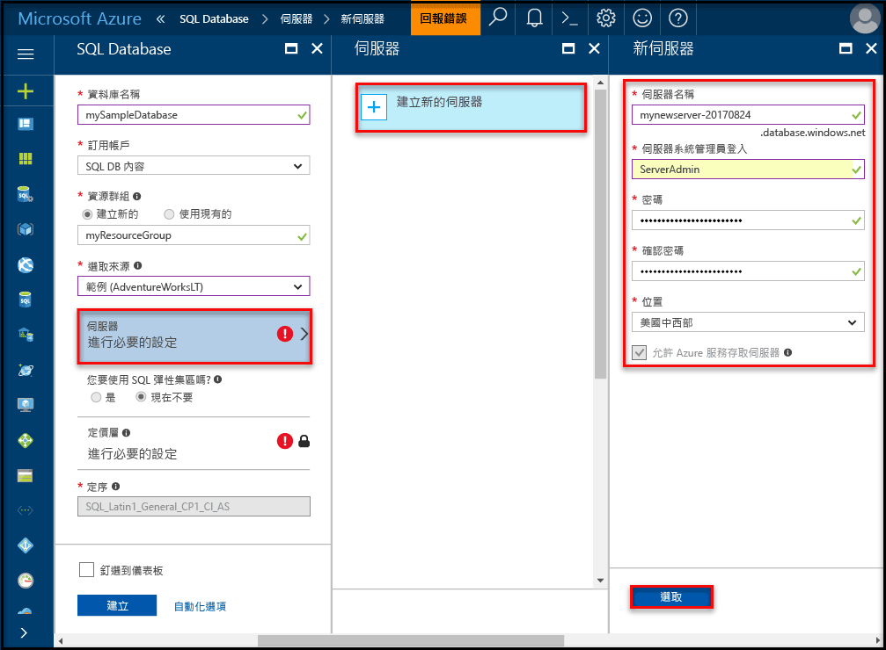
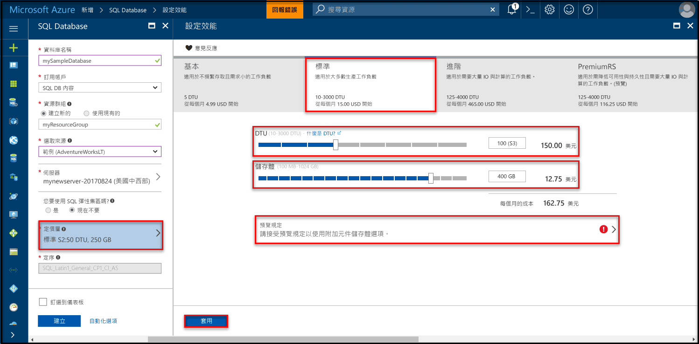

# <a name="create-an-azure-sql-database-in-hello-azure-portal"></a><span data-ttu-id="d5b56-105">在 hello Azure 入口網站中建立 Azure SQL database</span><span class="sxs-lookup"><span data-stu-id="d5b56-105">Create an Azure SQL database in hello Azure portal</span></span>

<span data-ttu-id="d5b56-106">本快速入門教學課程會逐步 toocreate SQL Azure 中的資料庫。</span><span class="sxs-lookup"><span data-stu-id="d5b56-106">This quick start tutorial walks through how toocreate a SQL database in Azure.</span></span> <span data-ttu-id="d5b56-107">Azure SQL Database 是 「 資料庫做為-服務 「 供應項目，可讓您 toorun 和小數位數高可用性 SQL Server 資料庫 hello 雲端中。</span><span class="sxs-lookup"><span data-stu-id="d5b56-107">Azure SQL Database is a “Database-as-a-Service” offering that enables you toorun and scale highly available SQL Server databases in hello cloud.</span></span> <span data-ttu-id="d5b56-108">本快速入門示範如何 tooget 一開始會建立使用 hello Azure 入口網站的 SQL 資料庫。</span><span class="sxs-lookup"><span data-stu-id="d5b56-108">This quick start shows you how tooget started by creating a SQL database using hello Azure portal.</span></span>

<span data-ttu-id="d5b56-109">如果您沒有 Azure 訂用帳戶，請在開始前建立[免費帳戶](https://azure.microsoft.com/free/) 。</span><span class="sxs-lookup"><span data-stu-id="d5b56-109">If you don't have an Azure subscription, create a [free](https://azure.microsoft.com/free/) account before you begin.</span></span>

## <a name="log-in-toohello-azure-portal"></a><span data-ttu-id="d5b56-110">登入 toohello Azure 入口網站</span><span class="sxs-lookup"><span data-stu-id="d5b56-110">Log in toohello Azure portal</span></span>

<span data-ttu-id="d5b56-111">登入 toohello [Azure 入口網站](https://portal.azure.com/)。</span><span class="sxs-lookup"><span data-stu-id="d5b56-111">Log in toohello [Azure portal](https://portal.azure.com/).</span></span>

## <a name="create-a-sql-database"></a><span data-ttu-id="d5b56-112">建立 SQL 資料庫</span><span class="sxs-lookup"><span data-stu-id="d5b56-112">Create a SQL database</span></span>

<span data-ttu-id="d5b56-113">Azure SQL Database 會使用一組定義的[計算和儲存體資源](sql-database-service-tiers.md)建立。</span><span class="sxs-lookup"><span data-stu-id="d5b56-113">An Azure SQL database is created with a defined set of [compute and storage resources](sql-database-service-tiers.md).</span></span> <span data-ttu-id="d5b56-114">hello 資料庫內建立[Azure 資源群組](../azure-resource-manager/resource-group-overview.md)和[Azure SQL Database 邏輯伺服器](sql-database-features.md)。</span><span class="sxs-lookup"><span data-stu-id="d5b56-114">hello database is created within an [Azure resource group](../azure-resource-manager/resource-group-overview.md) and in an [Azure SQL Database logical server](sql-database-features.md).</span></span> 

<span data-ttu-id="d5b56-115">請遵循這些步驟 toocreate 包含 hello Adventure Works LT 範例資料的 SQL 資料庫。</span><span class="sxs-lookup"><span data-stu-id="d5b56-115">Follow these steps toocreate a SQL database containing hello Adventure Works LT sample data.</span></span> 

1. <span data-ttu-id="d5b56-116">按一下 hello**新增**hello 的左上角 hello Azure 入口網站上找到的按鈕。</span><span class="sxs-lookup"><span data-stu-id="d5b56-116">Click hello **New** button found on hello upper left-hand corner of hello Azure portal.</span></span>

2. <span data-ttu-id="d5b56-117">選取**資料庫**從 hello**新增**頁面上，並選取**SQL Database**從 hello**資料庫**頁面。</span><span class="sxs-lookup"><span data-stu-id="d5b56-117">Select **Databases** from hello **New** page, and select **SQL Database** from hello **Databases** page.</span></span>

   

3. <span data-ttu-id="d5b56-119">填寫 hello SQL Database 表單以下列資訊，hello hello 前面影像所示：</span><span class="sxs-lookup"><span data-stu-id="d5b56-119">Fill out hello SQL Database form with hello following information, as shown on hello preceding image:</span></span>   

   | <span data-ttu-id="d5b56-120">設定</span><span class="sxs-lookup"><span data-stu-id="d5b56-120">Setting</span></span>       | <span data-ttu-id="d5b56-121">建議的值</span><span class="sxs-lookup"><span data-stu-id="d5b56-121">Suggested value</span></span> | <span data-ttu-id="d5b56-122">說明</span><span class="sxs-lookup"><span data-stu-id="d5b56-122">Description</span></span> | 
   | ------------ | ------------------ | ------------------------------------------------- | 
   | <span data-ttu-id="d5b56-123">**資料庫名稱**</span><span class="sxs-lookup"><span data-stu-id="d5b56-123">**Database name**</span></span> | <span data-ttu-id="d5b56-124">mySampleDatabase</span><span class="sxs-lookup"><span data-stu-id="d5b56-124">mySampleDatabase</span></span> | <span data-ttu-id="d5b56-125">如需有效的資料庫名稱，請參閱[資料庫識別碼](https://docs.microsoft.com/en-us/sql/relational-databases/databases/database-identifiers)。</span><span class="sxs-lookup"><span data-stu-id="d5b56-125">For valid database names, see [Database Identifiers](https://docs.microsoft.com/en-us/sql/relational-databases/databases/database-identifiers).</span></span> | 
   | <span data-ttu-id="d5b56-126">**訂用帳戶**</span><span class="sxs-lookup"><span data-stu-id="d5b56-126">**Subscription**</span></span> | <span data-ttu-id="d5b56-127">您的訂用帳戶</span><span class="sxs-lookup"><span data-stu-id="d5b56-127">Your subscription</span></span>  | <span data-ttu-id="d5b56-128">如需訂用帳戶的詳細資訊，請參閱[訂用帳戶](https://account.windowsazure.com/Subscriptions)。</span><span class="sxs-lookup"><span data-stu-id="d5b56-128">For details about your subscriptions, see [Subscriptions](https://account.windowsazure.com/Subscriptions).</span></span> |
   | <span data-ttu-id="d5b56-129">**資源群組**</span><span class="sxs-lookup"><span data-stu-id="d5b56-129">**Resource group**</span></span>  | <span data-ttu-id="d5b56-130">myResourceGroup</span><span class="sxs-lookup"><span data-stu-id="d5b56-130">myResourceGroup</span></span> | <span data-ttu-id="d5b56-131">如需有效的資源群組名稱，請參閱[命名規則和限制](https://docs.microsoft.com/azure/architecture/best-practices/naming-conventions)。</span><span class="sxs-lookup"><span data-stu-id="d5b56-131">For valid resource group names, see [Naming rules and restrictions](https://docs.microsoft.com/azure/architecture/best-practices/naming-conventions).</span></span> |
   | <span data-ttu-id="d5b56-132">**來源**</span><span class="sxs-lookup"><span data-stu-id="d5b56-132">**Source source**</span></span> | <span data-ttu-id="d5b56-133">範例 (AdventureWorksLT)</span><span class="sxs-lookup"><span data-stu-id="d5b56-133">Sample (AdventureWorksLT)</span></span> | <span data-ttu-id="d5b56-134">載入新的資料庫中的 hello AdventureWorksLT 結構描述和資料</span><span class="sxs-lookup"><span data-stu-id="d5b56-134">Loads hello AdventureWorksLT schema and data into your new database</span></span> |

   > [!IMPORTANT]
   > <span data-ttu-id="d5b56-135">您必須選取 hello 這個表單上的範例資料庫，因為它會使用此快速入門 hello 其餘部分。</span><span class="sxs-lookup"><span data-stu-id="d5b56-135">You must select hello sample database on this form because it is used in hello remainder of this quick start.</span></span>
   > 

4. <span data-ttu-id="d5b56-136">在下**伺服器**，按一下 **設定必要設定**和填寫 hello SQL 伺服器 （邏輯伺服器） 格式以 hello hello 下列影像所示，下列資訊，請：</span><span class="sxs-lookup"><span data-stu-id="d5b56-136">Under **Server**, click **Configure required settings** and fill out hello SQL server (logical server) form with hello following information, as shown on hello following image:</span></span>   

   | <span data-ttu-id="d5b56-137">設定</span><span class="sxs-lookup"><span data-stu-id="d5b56-137">Setting</span></span>       | <span data-ttu-id="d5b56-138">建議的值</span><span class="sxs-lookup"><span data-stu-id="d5b56-138">Suggested value</span></span> | <span data-ttu-id="d5b56-139">說明</span><span class="sxs-lookup"><span data-stu-id="d5b56-139">Description</span></span> | 
   | ------------ | ------------------ | ------------------------------------------------- | 
   | <span data-ttu-id="d5b56-140">**伺服器名稱**</span><span class="sxs-lookup"><span data-stu-id="d5b56-140">**Server name**</span></span> | <span data-ttu-id="d5b56-141">任何全域唯一名稱</span><span class="sxs-lookup"><span data-stu-id="d5b56-141">Any globally unique name</span></span> | <span data-ttu-id="d5b56-142">如需有效的伺服器名稱，請參閱[命名規則和限制](https://docs.microsoft.com/azure/architecture/best-practices/naming-conventions)。</span><span class="sxs-lookup"><span data-stu-id="d5b56-142">For valid server names, see [Naming rules and restrictions](https://docs.microsoft.com/azure/architecture/best-practices/naming-conventions).</span></span> | 
   | <span data-ttu-id="d5b56-143">**伺服器管理員登入**</span><span class="sxs-lookup"><span data-stu-id="d5b56-143">**Server admin login**</span></span> | <span data-ttu-id="d5b56-144">任何有效名稱</span><span class="sxs-lookup"><span data-stu-id="d5b56-144">Any valid name</span></span> | <span data-ttu-id="d5b56-145">如需有效的登入名稱，請參閱[資料庫識別碼](https://docs.microsoft.com/en-us/sql/relational-databases/databases/database-identifiers)。</span><span class="sxs-lookup"><span data-stu-id="d5b56-145">For valid login names, see [Database Identifiers](https://docs.microsoft.com/en-us/sql/relational-databases/databases/database-identifiers).</span></span> |
   | <span data-ttu-id="d5b56-146">**密碼**</span><span class="sxs-lookup"><span data-stu-id="d5b56-146">**Password**</span></span> | <span data-ttu-id="d5b56-147">任何有效密碼</span><span class="sxs-lookup"><span data-stu-id="d5b56-147">Any valid password</span></span> | <span data-ttu-id="d5b56-148">您的密碼必須至少為 8 個字元，且必須包含下列類別目錄的 hello 的其中三種字元： 大寫字母、 小寫字元、 數字，以及非英數字元。</span><span class="sxs-lookup"><span data-stu-id="d5b56-148">Your password must have at least 8 characters and must contain characters from three of hello following categories: upper case characters, lower case characters, numbers, and and non-alphanumeric characters.</span></span> |
   | <span data-ttu-id="d5b56-149">**訂用帳戶**</span><span class="sxs-lookup"><span data-stu-id="d5b56-149">**Subscription**</span></span> | <span data-ttu-id="d5b56-150">您的訂用帳戶</span><span class="sxs-lookup"><span data-stu-id="d5b56-150">Your subscription</span></span> | <span data-ttu-id="d5b56-151">如需訂用帳戶的詳細資訊，請參閱[訂用帳戶](https://account.windowsazure.com/Subscriptions)。</span><span class="sxs-lookup"><span data-stu-id="d5b56-151">For details about your subscriptions, see [Subscriptions](https://account.windowsazure.com/Subscriptions).</span></span> |
   | <span data-ttu-id="d5b56-152">**資源群組**</span><span class="sxs-lookup"><span data-stu-id="d5b56-152">**Resource group**</span></span> | <span data-ttu-id="d5b56-153">myResourceGroup</span><span class="sxs-lookup"><span data-stu-id="d5b56-153">myResourceGroup</span></span> | <span data-ttu-id="d5b56-154">如需有效的資源群組名稱，請參閱[命名規則和限制](https://docs.microsoft.com/azure/architecture/best-practices/naming-conventions)。</span><span class="sxs-lookup"><span data-stu-id="d5b56-154">For valid resource group names, see [Naming rules and restrictions](https://docs.microsoft.com/azure/architecture/best-practices/naming-conventions).</span></span> |
   | <span data-ttu-id="d5b56-155">**位置**</span><span class="sxs-lookup"><span data-stu-id="d5b56-155">**Location**</span></span> | <span data-ttu-id="d5b56-156">任何有效位置</span><span class="sxs-lookup"><span data-stu-id="d5b56-156">Any valid location</span></span> | <span data-ttu-id="d5b56-157">如需區域的相關資訊，請參閱 [Azure 區域](https://azure.microsoft.com/regions/)。</span><span class="sxs-lookup"><span data-stu-id="d5b56-157">For information about regions, see [Azure Regions](https://azure.microsoft.com/regions/).</span></span> |

   > [!IMPORTANT]
   > <span data-ttu-id="d5b56-158">hello 伺服器系統管理員登入和密碼，您在此處指定為 toohello server 中的必要的 toolog 和其資料庫，稍後在這個快速入門。</span><span class="sxs-lookup"><span data-stu-id="d5b56-158">hello server admin login and password that you specify here are required toolog in toohello server and its databases later in this quick start.</span></span> <span data-ttu-id="d5b56-159">請記住或記錄此資訊，以供稍後使用。</span><span class="sxs-lookup"><span data-stu-id="d5b56-159">Remember or record this information for later use.</span></span> 
   >  

   

5. <span data-ttu-id="d5b56-161">完成 hello 表單後，按一下**選取**。</span><span class="sxs-lookup"><span data-stu-id="d5b56-161">When you have completed hello form, click **Select**.</span></span>

6. <span data-ttu-id="d5b56-162">按一下**定價層**toospecify hello 服務層和效能層級的新資料庫。</span><span class="sxs-lookup"><span data-stu-id="d5b56-162">Click **Pricing tier** toospecify hello service tier and performance level for your new database.</span></span> <span data-ttu-id="d5b56-163">使用 hello 滑桿 tooselect **20 Dtu**和**250** GB 的儲存體。</span><span class="sxs-lookup"><span data-stu-id="d5b56-163">Use hello slider tooselect **20 DTUs** and **250** GB of storage.</span></span> <span data-ttu-id="d5b56-164">如需 DTU 的詳細資訊，請參閱[什麼是 DTU？](sql-database-what-is-a-dtu.md)。</span><span class="sxs-lookup"><span data-stu-id="d5b56-164">For more information on DTUs, see [What is a DTU?](sql-database-what-is-a-dtu.md).</span></span>

   

7. <span data-ttu-id="d5b56-166">在選取的 hello Dtu 數量之後, 按**套用**。</span><span class="sxs-lookup"><span data-stu-id="d5b56-166">After selected hello amount of DTUs, click **Apply**.</span></span>  

8. <span data-ttu-id="d5b56-167">現在您已完成 hello SQL Database 的表單，請按一下**建立**tooprovision hello 資料庫。</span><span class="sxs-lookup"><span data-stu-id="d5b56-167">Now that you have completed hello SQL Database form, click **Create** tooprovision hello database.</span></span> <span data-ttu-id="d5b56-168">佈建需要幾分鐘的時間。</span><span class="sxs-lookup"><span data-stu-id="d5b56-168">Provisioning takes a few minutes.</span></span> 

9. <span data-ttu-id="d5b56-169">在 [hello] 工具列上按一下**通知**toomonitor hello 部署程序。</span><span class="sxs-lookup"><span data-stu-id="d5b56-169">On hello toolbar, click **Notifications** toomonitor hello deployment process.</span></span>

   

## <a name="create-a-server-level-firewall-rule"></a><span data-ttu-id="d5b56-171">建立伺服器層級防火牆規則</span><span class="sxs-lookup"><span data-stu-id="d5b56-171">Create a server-level firewall rule</span></span>

<span data-ttu-id="d5b56-172">hello SQL Database 服務會建立防火牆 hello 伺服器層級，避免外部應用程式和工具連接 toohello 伺服器或 hello 伺服器上的任何資料庫，除非針對特定的 IP 位址的 tooopen hello 防火牆就會建立防火牆規則。</span><span class="sxs-lookup"><span data-stu-id="d5b56-172">hello SQL Database service creates a firewall at hello server-level that prevents external applications and tools from connecting toohello server or any databases on hello server unless a firewall rule is created tooopen hello firewall for specific IP addresses.</span></span> <span data-ttu-id="d5b56-173">請遵循這些步驟 toocreate [SQL Database 伺服器層級防火牆規則](sql-database-firewall-configure.md)對您的用戶端 IP 位址，並透過您的 IP 位址只的 hello SQL Database 防火牆的外部連接。</span><span class="sxs-lookup"><span data-stu-id="d5b56-173">Follow these steps toocreate a [SQL Database server-level firewall rule](sql-database-firewall-configure.md) for your client's IP address and enable external connectivity through hello SQL Database firewall for your IP address only.</span></span> 

> [!NOTE]
> <span data-ttu-id="d5b56-174">SQL Database 會透過連接埠 1433 通訊。</span><span class="sxs-lookup"><span data-stu-id="d5b56-174">SQL Database communicates over port 1433.</span></span> <span data-ttu-id="d5b56-175">如果您嘗試 tooconnect 從公司網路內，由您的網路防火牆可能不允許透過通訊埠 1433年的輸出流量。</span><span class="sxs-lookup"><span data-stu-id="d5b56-175">If you are trying tooconnect from within a corporate network, outbound traffic over port 1433 may not be allowed by your network's firewall.</span></span> <span data-ttu-id="d5b56-176">如果是這樣，您無法連接 tooyour Azure SQL Database 伺服器，除非您的 IT 部門會開啟通訊埠 1433年。</span><span class="sxs-lookup"><span data-stu-id="d5b56-176">If so, you cannot connect tooyour Azure SQL Database server unless your IT department opens port 1433.</span></span>
>

1. <span data-ttu-id="d5b56-177">Hello 部署完成之後，請按一下**SQL 資料庫**從 hello 左側功能表，然後按一下**mySampleDatabase**上 hello **SQL 資料庫**頁面。</span><span class="sxs-lookup"><span data-stu-id="d5b56-177">After hello deployment completes, click **SQL databases** from hello left-hand menu and then click **mySampleDatabase** on hello **SQL databases** page.</span></span> <span data-ttu-id="d5b56-178">hello 概觀 頁面的資料庫會開啟，顯示您 hello 完全符合規定的伺服器名稱 (例如**mynewserver20170313.database.windows.net**)，並提供進一步組態的選項。</span><span class="sxs-lookup"><span data-stu-id="d5b56-178">hello overview page for your database opens, showing you hello fully qualified server name (such as **mynewserver20170313.database.windows.net**) and provides options for further configuration.</span></span> <span data-ttu-id="d5b56-179">將這個完整伺服器名稱複製起來，以供稍後使用。</span><span class="sxs-lookup"><span data-stu-id="d5b56-179">Copy this fully qualified server name for use later.</span></span>

   > [!IMPORTANT]
   > <span data-ttu-id="d5b56-180">您需要此完整的伺服器名稱 tooconnect tooyour 伺服器和其後續的快速入門中的資料庫。</span><span class="sxs-lookup"><span data-stu-id="d5b56-180">You need this fully qualified server name tooconnect tooyour server and its databases in subsequent quick starts.</span></span>
   > 

    

2. <span data-ttu-id="d5b56-182">按一下**設定伺服器防火牆**hello 工具列 hello 如上圖所示。</span><span class="sxs-lookup"><span data-stu-id="d5b56-182">Click **Set server firewall** on hello toolbar as shown in hello previous image.</span></span> <span data-ttu-id="d5b56-183">hello**防火牆設定**hello SQL 資料庫伺服器 頁面隨即開啟。</span><span class="sxs-lookup"><span data-stu-id="d5b56-183">hello **Firewall settings** page for hello SQL Database server opens.</span></span> 

    

3. <span data-ttu-id="d5b56-185">按一下**新增用戶端 IP** hello 工具列 tooadd 上目前的 IP 位址 tooa 新防火牆規則。</span><span class="sxs-lookup"><span data-stu-id="d5b56-185">Click **Add client IP** on hello toolbar tooadd your current IP address tooa new firewall rule.</span></span> <span data-ttu-id="d5b56-186">防火牆規則可以針對單一 IP 位址或 IP 位址範圍開啟連接埠 1433。</span><span class="sxs-lookup"><span data-stu-id="d5b56-186">A firewall rule can open port 1433 for a single IP address or a range of IP addresses.</span></span>

4. <span data-ttu-id="d5b56-187">按一下 [儲存] 。</span><span class="sxs-lookup"><span data-stu-id="d5b56-187">Click **Save**.</span></span> <span data-ttu-id="d5b56-188">為開啟通訊埠 1433 hello 邏輯伺服器上的目前的 IP 位址建立伺服器層級防火牆規則。</span><span class="sxs-lookup"><span data-stu-id="d5b56-188">A server-level firewall rule is created for your current IP address opening port 1433 on hello logical server.</span></span>

    

4. <span data-ttu-id="d5b56-190">按一下**確定**，然後關閉 hello**防火牆設定**頁面。</span><span class="sxs-lookup"><span data-stu-id="d5b56-190">Click **OK** and then close hello **Firewall settings** page.</span></span>

<span data-ttu-id="d5b56-191">您現在可以連接 toohello SQL Database 伺服器和資料庫使用 SQL Server Management Studio 或您選擇從這個 IP 位址，使用先前建立的 hello 伺服器系統管理員帳戶的其他工具。</span><span class="sxs-lookup"><span data-stu-id="d5b56-191">You can now connect toohello SQL Database server and its databases using SQL Server Management Studio or another tool of your choice from this IP address using hello server admin account created previously.</span></span>

> [!IMPORTANT]
> <span data-ttu-id="d5b56-192">根據預設，透過 hello SQL Database 防火牆會啟用所有 Azure 服務。</span><span class="sxs-lookup"><span data-stu-id="d5b56-192">By default, access through hello SQL Database firewall is enabled for all Azure services.</span></span> <span data-ttu-id="d5b56-193">按一下**OFF**上所有的 Azure 服務的這個頁面 toodisable。</span><span class="sxs-lookup"><span data-stu-id="d5b56-193">Click **OFF** on this page toodisable for all Azure services.</span></span>
>

## <a name="query-hello-sql-database"></a><span data-ttu-id="d5b56-194">查詢 hello SQL 資料庫</span><span class="sxs-lookup"><span data-stu-id="d5b56-194">Query hello SQL database</span></span>

<span data-ttu-id="d5b56-195">既然您已經在 Azure 中建立範例資料庫，讓我們使用 hello hello Azure 入口網站的 tooconfirm，您可以連接 toohello 資料庫和查詢 hello 資料中的內建查詢工具。</span><span class="sxs-lookup"><span data-stu-id="d5b56-195">Now that you have created a sample database in Azure, let’s use hello built-in query tool within hello Azure portal tooconfirm that you can connect toohello database and query hello data.</span></span> 

1. <span data-ttu-id="d5b56-196">在 hello 您資料庫的 SQL Database 頁面上，按一下 **工具**hello 工具列上。</span><span class="sxs-lookup"><span data-stu-id="d5b56-196">On hello SQL Database page for your database, click **Tools** on hello toolbar.</span></span> <span data-ttu-id="d5b56-197">hello**工具**頁面隨即開啟。</span><span class="sxs-lookup"><span data-stu-id="d5b56-197">hello **Tools** page opens.</span></span>

   ![[工具] 功能表](./media/sql-database-get-started-portal/tools-menu.png) 

2. <span data-ttu-id="d5b56-199">按一下**查詢編輯器 （預覽）**，按一下 hello**預覽條款**核取方塊，然後按一下**確定**。</span><span class="sxs-lookup"><span data-stu-id="d5b56-199">Click **Query editor (preview)**, click hello **Preview terms** checkbox, and then click **OK**.</span></span> <span data-ttu-id="d5b56-200">hello 查詢編輯器 頁面隨即開啟。</span><span class="sxs-lookup"><span data-stu-id="d5b56-200">hello Query editor page opens.</span></span>

3. <span data-ttu-id="d5b56-201">按一下**登入**出現提示時，然後選取**SQL server 驗證**，然後提供 hello 伺服器系統管理員登入和您稍早建立的密碼。</span><span class="sxs-lookup"><span data-stu-id="d5b56-201">Click **Login** and then, when prompted, select **SQL server authentication** and then provide hello server admin login and password that you created earlier.</span></span>

    

4. <span data-ttu-id="d5b56-203">按一下**確定**toolog 中的。</span><span class="sxs-lookup"><span data-stu-id="d5b56-203">Click **OK** toolog in.</span></span>

5. <span data-ttu-id="d5b56-204">通過驗證之後，輸入下列查詢 hello 查詢編輯器 窗格中的 hello。</span><span class="sxs-lookup"><span data-stu-id="d5b56-204">After you are authenticated, type hello following query in hello query editor pane.</span></span>

   ```sql
   SELECT TOP 20 pc.Name as CategoryName, p.name as ProductName
   FROM SalesLT.ProductCategory pc
   JOIN SalesLT.Product p
   ON pc.productcategoryid = p.productcategoryid;
   ```

6. <span data-ttu-id="d5b56-205">按一下**執行**然後檢閱 hello 查詢結果中 hello**結果**窗格。</span><span class="sxs-lookup"><span data-stu-id="d5b56-205">Click **Run** and then review hello query results in hello **Results** pane.</span></span>

   

7. <span data-ttu-id="d5b56-207">關閉 hello**查詢編輯器**頁面和 hello**工具**頁面。</span><span class="sxs-lookup"><span data-stu-id="d5b56-207">Close hello **Query editor** page and hello **Tools** page.</span></span>

## <a name="clean-up-resources"></a><span data-ttu-id="d5b56-208">清除資源</span><span class="sxs-lookup"><span data-stu-id="d5b56-208">Clean up resources</span></span>

<span data-ttu-id="d5b56-209">如果您不需要這些資源之另一個的快速入門教學 (請參閱[後續步驟](#next-steps))，您可以刪除它們藉由下列 hello:</span><span class="sxs-lookup"><span data-stu-id="d5b56-209">If you don't need these resources for another quickstart/tutorial (see [Next steps](#next-steps)), you can delete them by doing hello following:</span></span>


1. <span data-ttu-id="d5b56-210">Hello Azure 入口網站中的 hello 左側功能表中按一下**資源群組**，然後按一下 **myResourceGroup**。</span><span class="sxs-lookup"><span data-stu-id="d5b56-210">From hello left-hand menu in hello Azure portal, click **Resource groups** and then click **myResourceGroup**.</span></span> 
2. <span data-ttu-id="d5b56-211">在資源群組頁面上，按一下 **刪除**，型別**myResourceGroup**在 hello 文字方塊中，然後按一下**刪除**。</span><span class="sxs-lookup"><span data-stu-id="d5b56-211">On your resource group page, click **Delete**, type **myResourceGroup** in hello text box, and then click **Delete**.</span></span>

## <a name="next-steps"></a><span data-ttu-id="d5b56-212">後續步驟</span><span class="sxs-lookup"><span data-stu-id="d5b56-212">Next steps</span></span>

<span data-ttu-id="d5b56-213">您現在具有資料庫，您可使用最愛的工具進行連線和查詢。</span><span class="sxs-lookup"><span data-stu-id="d5b56-213">Now that you have a database, you can connect and query using your favorite tools.</span></span> <span data-ttu-id="d5b56-214">選擇下列工具來深入了解︰</span><span class="sxs-lookup"><span data-stu-id="d5b56-214">Learn more by choosing your tool below:</span></span>

- [<span data-ttu-id="d5b56-215">SQL Server Management Studio</span><span class="sxs-lookup"><span data-stu-id="d5b56-215">SQL Server Management Studio</span></span>](sql-database-connect-query-ssms.md)
- [<span data-ttu-id="d5b56-216">Visual Studio Code</span><span class="sxs-lookup"><span data-stu-id="d5b56-216">Visual Studio Code</span></span>](sql-database-connect-query-vscode.md)
- [<span data-ttu-id="d5b56-217">.NET</span><span class="sxs-lookup"><span data-stu-id="d5b56-217">.NET</span></span>](sql-database-connect-query-dotnet.md)
- [<span data-ttu-id="d5b56-218">PHP</span><span class="sxs-lookup"><span data-stu-id="d5b56-218">PHP</span></span>](sql-database-connect-query-php.md)
- [<span data-ttu-id="d5b56-219">Node.js</span><span class="sxs-lookup"><span data-stu-id="d5b56-219">Node.js</span></span>](sql-database-connect-query-nodejs.md)
- [<span data-ttu-id="d5b56-220">Java</span><span class="sxs-lookup"><span data-stu-id="d5b56-220">Java</span></span>](sql-database-connect-query-java.md)
- [<span data-ttu-id="d5b56-221">Python</span><span class="sxs-lookup"><span data-stu-id="d5b56-221">Python</span></span>](sql-database-connect-query-python.md)
- [<span data-ttu-id="d5b56-222">Ruby</span><span class="sxs-lookup"><span data-stu-id="d5b56-222">Ruby</span></span>](sql-database-connect-query-ruby.md)
