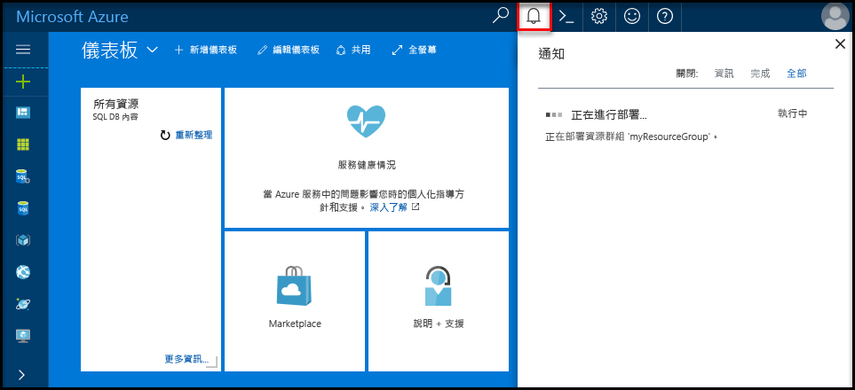

# <a name="create-an-azure-sql-database-in-hello-azure-portal"></a>在 hello Azure 入口網站中建立 Azure SQL database

本快速入門教學課程會逐步 toocreate SQL Azure 中的資料庫。 Azure SQL Database 是 「 資料庫做為-服務 「 供應項目，可讓您 toorun 和小數位數高可用性 SQL Server 資料庫 hello 雲端中。 本快速入門示範如何 tooget 一開始會建立使用 hello Azure 入口網站的 SQL 資料庫。

如果您沒有 Azure 訂用帳戶，請在開始前建立[免費帳戶](https://azure.microsoft.com/free/) 。

## <a name="log-in-toohello-azure-portal"></a>登入 toohello Azure 入口網站

登入 toohello [Azure 入口網站](https://portal.azure.com/)。

## <a name="create-a-sql-database"></a>建立 SQL 資料庫

Azure SQL Database 會使用一組定義的[計算和儲存體資源](sql-database-service-tiers.md)建立。 hello 資料庫內建立[Azure 資源群組](../azure-resource-manager/resource-group-overview.md)和[Azure SQL Database 邏輯伺服器](sql-database-features.md)。 

請遵循這些步驟 toocreate 包含 hello Adventure Works LT 範例資料的 SQL 資料庫。 

1. 按一下 hello**新增**hello 的左上角 hello Azure 入口網站上找到的按鈕。

2. 選取**資料庫**從 hello**新增**頁面上，並選取**SQL Database**從 hello**資料庫**頁面。

   

3. 填寫 hello SQL Database 表單以下列資訊，hello hello 前面影像所示：   

   | 設定       | 建議的值 | 說明 | 
   | ------------ | ------------------ | ------------------------------------------------- | 
   | **資料庫名稱** | mySampleDatabase | 如需有效的資料庫名稱，請參閱[資料庫識別碼](https://docs.microsoft.com/en-us/sql/relational-databases/databases/database-identifiers)。 | 
   | **訂用帳戶** | 您的訂用帳戶  | 如需訂用帳戶的詳細資訊，請參閱[訂用帳戶](https://account.windowsazure.com/Subscriptions)。 |
   | **資源群組**  | myResourceGroup | 如需有效的資源群組名稱，請參閱[命名規則和限制](https://docs.microsoft.com/azure/architecture/best-practices/naming-conventions)。 |
   | **來源** | 範例 (AdventureWorksLT) | 載入新的資料庫中的 hello AdventureWorksLT 結構描述和資料 |

   > [!IMPORTANT]
   > 您必須選取 hello 這個表單上的範例資料庫，因為它會使用此快速入門 hello 其餘部分。
   > 

4. 在下**伺服器**，按一下 **設定必要設定**和填寫 hello SQL 伺服器 （邏輯伺服器） 格式以 hello hello 下列影像所示，下列資訊，請：   

   | 設定       | 建議的值 | 說明 | 
   | ------------ | ------------------ | ------------------------------------------------- | 
   | **伺服器名稱** | 任何全域唯一名稱 | 如需有效的伺服器名稱，請參閱[命名規則和限制](https://docs.microsoft.com/azure/architecture/best-practices/naming-conventions)。 | 
   | **伺服器管理員登入** | 任何有效名稱 | 如需有效的登入名稱，請參閱[資料庫識別碼](https://docs.microsoft.com/en-us/sql/relational-databases/databases/database-identifiers)。 |
   | **密碼** | 任何有效密碼 | 您的密碼必須至少為 8 個字元，且必須包含下列類別目錄的 hello 的其中三種字元： 大寫字母、 小寫字元、 數字，以及非英數字元。 |
   | **訂用帳戶** | 您的訂用帳戶 | 如需訂用帳戶的詳細資訊，請參閱[訂用帳戶](https://account.windowsazure.com/Subscriptions)。 |
   | **資源群組** | myResourceGroup | 如需有效的資源群組名稱，請參閱[命名規則和限制](https://docs.microsoft.com/azure/architecture/best-practices/naming-conventions)。 |
   | **位置** | 任何有效位置 | 如需區域的相關資訊，請參閱 [Azure 區域](https://azure.microsoft.com/regions/)。 |

   > [!IMPORTANT]
   > hello 伺服器系統管理員登入和密碼，您在此處指定為 toohello server 中的必要的 toolog 和其資料庫，稍後在這個快速入門。 請記住或記錄此資訊，以供稍後使用。 
   >  

   

5. 完成 hello 表單後，按一下**選取**。

6. 按一下**定價層**toospecify hello 服務層和效能層級的新資料庫。 使用 hello 滑桿 tooselect **20 Dtu**和**250** GB 的儲存體。 如需 DTU 的詳細資訊，請參閱[什麼是 DTU？](sql-database-what-is-a-dtu.md)。

   

7. 在選取的 hello Dtu 數量之後, 按**套用**。  

8. 現在您已完成 hello SQL Database 的表單，請按一下**建立**tooprovision hello 資料庫。 佈建需要幾分鐘的時間。 

9. 在 [hello] 工具列上按一下**通知**toomonitor hello 部署程序。

   

## <a name="create-a-server-level-firewall-rule"></a>建立伺服器層級防火牆規則

hello SQL Database 服務會建立防火牆 hello 伺服器層級，避免外部應用程式和工具連接 toohello 伺服器或 hello 伺服器上的任何資料庫，除非針對特定的 IP 位址的 tooopen hello 防火牆就會建立防火牆規則。 請遵循這些步驟 toocreate [SQL Database 伺服器層級防火牆規則](sql-database-firewall-configure.md)對您的用戶端 IP 位址，並透過您的 IP 位址只的 hello SQL Database 防火牆的外部連接。 

> [!NOTE]
> SQL Database 會透過連接埠 1433 通訊。 如果您嘗試 tooconnect 從公司網路內，由您的網路防火牆可能不允許透過通訊埠 1433年的輸出流量。 如果是這樣，您無法連接 tooyour Azure SQL Database 伺服器，除非您的 IT 部門會開啟通訊埠 1433年。
>

1. Hello 部署完成之後，請按一下**SQL 資料庫**從 hello 左側功能表，然後按一下**mySampleDatabase**上 hello **SQL 資料庫**頁面。 hello 概觀 頁面的資料庫會開啟，顯示您 hello 完全符合規定的伺服器名稱 (例如**mynewserver20170313.database.windows.net**)，並提供進一步組態的選項。 將這個完整伺服器名稱複製起來，以供稍後使用。

   > [!IMPORTANT]
   > 您需要此完整的伺服器名稱 tooconnect tooyour 伺服器和其後續的快速入門中的資料庫。
   > 

    

2. 按一下**設定伺服器防火牆**hello 工具列 hello 如上圖所示。 hello**防火牆設定**hello SQL 資料庫伺服器 頁面隨即開啟。 

    

3. 按一下**新增用戶端 IP** hello 工具列 tooadd 上目前的 IP 位址 tooa 新防火牆規則。 防火牆規則可以針對單一 IP 位址或 IP 位址範圍開啟連接埠 1433。

4. 按一下 [儲存] 。 為開啟通訊埠 1433 hello 邏輯伺服器上的目前的 IP 位址建立伺服器層級防火牆規則。

    

4. 按一下**確定**，然後關閉 hello**防火牆設定**頁面。

您現在可以連接 toohello SQL Database 伺服器和資料庫使用 SQL Server Management Studio 或您選擇從這個 IP 位址，使用先前建立的 hello 伺服器系統管理員帳戶的其他工具。

> [!IMPORTANT]
> 根據預設，透過 hello SQL Database 防火牆會啟用所有 Azure 服務。 按一下**OFF**上所有的 Azure 服務的這個頁面 toodisable。
>

## <a name="query-hello-sql-database"></a>查詢 hello SQL 資料庫

既然您已經在 Azure 中建立範例資料庫，讓我們使用 hello hello Azure 入口網站的 tooconfirm，您可以連接 toohello 資料庫和查詢 hello 資料中的內建查詢工具。 

1. 在 hello 您資料庫的 SQL Database 頁面上，按一下 **工具**hello 工具列上。 hello**工具**頁面隨即開啟。

   ![[工具] 功能表](./media/sql-database-get-started-portal/tools-menu.png) 

2. 按一下**查詢編輯器 （預覽）**，按一下 hello**預覽條款**核取方塊，然後按一下**確定**。 hello 查詢編輯器 頁面隨即開啟。

3. 按一下**登入**出現提示時，然後選取**SQL server 驗證**，然後提供 hello 伺服器系統管理員登入和您稍早建立的密碼。

    

4. 按一下**確定**toolog 中的。

5. 通過驗證之後，輸入下列查詢 hello 查詢編輯器 窗格中的 hello。

   ```sql
   SELECT TOP 20 pc.Name as CategoryName, p.name as ProductName
   FROM SalesLT.ProductCategory pc
   JOIN SalesLT.Product p
   ON pc.productcategoryid = p.productcategoryid;
   ```

6. 按一下**執行**然後檢閱 hello 查詢結果中 hello**結果**窗格。

   

7. 關閉 hello**查詢編輯器**頁面和 hello**工具**頁面。

## <a name="clean-up-resources"></a>清除資源

如果您不需要這些資源之另一個的快速入門教學 (請參閱[後續步驟](#next-steps))，您可以刪除它們藉由下列 hello:


1. Hello Azure 入口網站中的 hello 左側功能表中按一下**資源群組**，然後按一下 **myResourceGroup**。 
2. 在資源群組頁面上，按一下 **刪除**，型別**myResourceGroup**在 hello 文字方塊中，然後按一下**刪除**。

## <a name="next-steps"></a>後續步驟

您現在具有資料庫，您可使用最愛的工具進行連線和查詢。 選擇下列工具來深入了解︰

- [SQL Server Management Studio](sql-database-connect-query-ssms.md)
- [Visual Studio Code](sql-database-connect-query-vscode.md)
- [.NET](sql-database-connect-query-dotnet.md)
- [PHP](sql-database-connect-query-php.md)
- [Node.js](sql-database-connect-query-nodejs.md)
- [Java](sql-database-connect-query-java.md)
- [Python](sql-database-connect-query-python.md)
- [Ruby](sql-database-connect-query-ruby.md)
