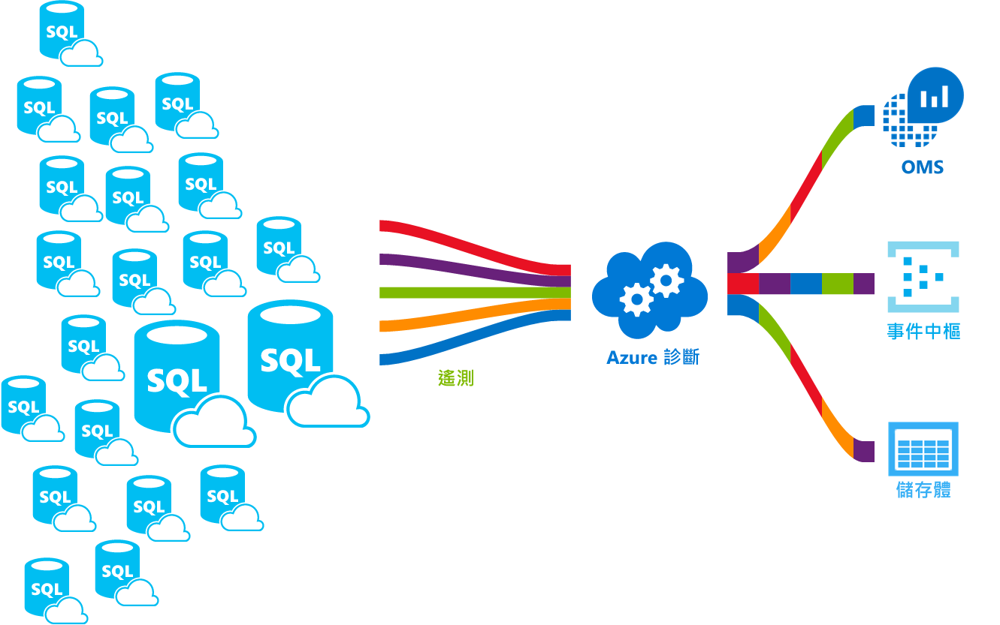

# <a name="azure-sql-database-metrics-and-diagnostics-logging"></a><span data-ttu-id="44a1b-103">Azure SQL Database 計量和診斷記錄</span><span class="sxs-lookup"><span data-stu-id="44a1b-103">Azure SQL Database metrics and diagnostics logging</span></span> 
<span data-ttu-id="44a1b-104">Azure SQL Database 可以發出計量和診斷記錄，以便進行監視。</span><span class="sxs-lookup"><span data-stu-id="44a1b-104">Azure SQL Database can emit metrics and diagnostic logs for easier monitoring.</span></span> <span data-ttu-id="44a1b-105">您可以設定 Azure SQL Database toostore 資源使用狀況、 背景工作工作階段，以及連線至一個 Azure 資源：</span><span class="sxs-lookup"><span data-stu-id="44a1b-105">You can configure Azure SQL Database toostore resource usage, workers and sessions, and connectivity into one of these Azure resources:</span></span>
- <span data-ttu-id="44a1b-106">**Azure 儲存體**：用於封存大量遙測資料，價格低廉</span><span class="sxs-lookup"><span data-stu-id="44a1b-106">**Azure Storage**: For archiving vast amounts of telemetry for a small price</span></span>
- <span data-ttu-id="44a1b-107">**Azure 事件中樞**：用於整合 Azure SQL Database 遙測與自訂監視解決方案或管線</span><span class="sxs-lookup"><span data-stu-id="44a1b-107">**Azure Event Hub**: For integrating Azure SQL Database telemetry with your custom monitoring solution or hot pipelines</span></span>
- <span data-ttu-id="44a1b-108">**Azure 記錄分析**： 的現成 hello 監視與報告、 警示與緩和功能解決方案</span><span class="sxs-lookup"><span data-stu-id="44a1b-108">**Azure Log Analytics**: For out of hello box monitoring solution with reporting, alerting, and mitigating capabilities</span></span> 

    

## <a name="enable-logging"></a><span data-ttu-id="44a1b-110">啟用記錄</span><span class="sxs-lookup"><span data-stu-id="44a1b-110">Enable logging</span></span>

<span data-ttu-id="44a1b-111">預設未啟用計量和診斷記錄功能。</span><span class="sxs-lookup"><span data-stu-id="44a1b-111">Metrics and diagnostics logging is not enabled by default.</span></span> <span data-ttu-id="44a1b-112">您可以啟用和管理度量和診斷記錄，使用其中一種 hello 下列方法：</span><span class="sxs-lookup"><span data-stu-id="44a1b-112">You can enable and manage metrics and diagnostics logging using one of hello following methods:</span></span>
- <span data-ttu-id="44a1b-113">Azure 入口網站</span><span class="sxs-lookup"><span data-stu-id="44a1b-113">Azure portal</span></span>
- <span data-ttu-id="44a1b-114">PowerShell</span><span class="sxs-lookup"><span data-stu-id="44a1b-114">PowerShell</span></span>
- <span data-ttu-id="44a1b-115">Azure CLI</span><span class="sxs-lookup"><span data-stu-id="44a1b-115">Azure CLI</span></span>
- <span data-ttu-id="44a1b-116">REST API</span><span class="sxs-lookup"><span data-stu-id="44a1b-116">REST API</span></span> 
- <span data-ttu-id="44a1b-117">Resource Manager 範本</span><span class="sxs-lookup"><span data-stu-id="44a1b-117">Resource Manager template</span></span>

<span data-ttu-id="44a1b-118">當您啟用度量和診斷記錄時，您會需要 toospecify hello Azure 資源收集選取的資料的位置。</span><span class="sxs-lookup"><span data-stu-id="44a1b-118">When you enable metrics and diagnostics logging, you need toospecify hello Azure resource where selected data is collected.</span></span> <span data-ttu-id="44a1b-119">可用的選項︰</span><span class="sxs-lookup"><span data-stu-id="44a1b-119">Options available:</span></span>
- <span data-ttu-id="44a1b-120">Log Analytics</span><span class="sxs-lookup"><span data-stu-id="44a1b-120">Log analytics</span></span>
- <span data-ttu-id="44a1b-121">事件中樞</span><span class="sxs-lookup"><span data-stu-id="44a1b-121">Event Hub</span></span>
- <span data-ttu-id="44a1b-122">Azure 儲存體</span><span class="sxs-lookup"><span data-stu-id="44a1b-122">Azure Storage</span></span> 

<span data-ttu-id="44a1b-123">您可以佈建新的 Azure 資源，或選取現有的資源。</span><span class="sxs-lookup"><span data-stu-id="44a1b-123">You can provision a new Azure resource or select an existing resource.</span></span> <span data-ttu-id="44a1b-124">選取後 hello 儲存體資源，您需要 toospecify 哪些資料 toocollect。</span><span class="sxs-lookup"><span data-stu-id="44a1b-124">After selecting hello storage resource, you need toospecify which data toocollect.</span></span> <span data-ttu-id="44a1b-125">可用的選項包括︰</span><span class="sxs-lookup"><span data-stu-id="44a1b-125">Options available include:</span></span>

- <span data-ttu-id="44a1b-126">**[1 分鐘的計量](sql-database-metrics-diag-logging.md#1-minute-metrics)** - 包含 DTU 百分比、DTU 限制、CPU 百分比、實體資料讀取百分比、記錄寫入百分比、成功/失敗/防火牆封鎖的連線、工作階段百分比、背景工作百分比、儲存體、儲存體百分比、XTP 儲存體百分比</span><span class="sxs-lookup"><span data-stu-id="44a1b-126">**[1-minute metrics](sql-database-metrics-diag-logging.md#1-minute-metrics)** - contains DTU percentage, DTU limit, CPU percentage, Physical data read percentage, Log write percentage, Successful/Failed/Blocked by firewall connections, sessions percentage, workers percentage, storage, storage percentage, XTP storage percentage</span></span>

<span data-ttu-id="44a1b-127">如果您指定事件中心] 或 [AzureStorage 帳戶，您可以指定保留原則 toospecify 早於所選時段會刪除該資料。</span><span class="sxs-lookup"><span data-stu-id="44a1b-127">If you specify Event Hub or an AzureStorage account, you can specify a retention policy toospecify that data that is older than a selected time period is deleted.</span></span> <span data-ttu-id="44a1b-128">如果您指定記錄分析，hello 保留原則必須倚賴 hello 選取的定價層。</span><span class="sxs-lookup"><span data-stu-id="44a1b-128">If you specify Log Analytics, hello retention policy depends on hello selected pricing tier.</span></span> <span data-ttu-id="44a1b-129">深入了解 [Log Analytics 價格](https://azure.microsoft.com/pricing/details/log-analytics/)。</span><span class="sxs-lookup"><span data-stu-id="44a1b-129">Read more about [Log Analytics pricing](https://azure.microsoft.com/pricing/details/log-analytics/).</span></span> 

<span data-ttu-id="44a1b-130">我們建議您先閱讀這兩個 hello[的 Microsoft Azure 中的度量概觀](../monitoring-and-diagnostics/monitoring-overview-metrics.md)和[概觀的 Azure 診斷記錄檔](../monitoring-and-diagnostics/monitoring-overview-of-diagnostic-logs.md)文章 toogain 了解不只如何 tooenable 記錄，但 hello度量和記錄檔分類 hello 支援各種 Azure 服務。</span><span class="sxs-lookup"><span data-stu-id="44a1b-130">We recommend that you read both hello [Overview of metrics in Microsoft Azure](../monitoring-and-diagnostics/monitoring-overview-metrics.md) and [Overview of Azure Diagnostic Logs](../monitoring-and-diagnostics/monitoring-overview-of-diagnostic-logs.md) articles toogain an understanding of not only how tooenable logging, but hello metrics and log categories supported by hello various Azure services.</span></span>

### <a name="azure-portal"></a><span data-ttu-id="44a1b-131">Azure 入口網站</span><span class="sxs-lookup"><span data-stu-id="44a1b-131">Azure portal</span></span>

<span data-ttu-id="44a1b-132">tooenable 度量 hello Azure 入口網站中的診斷記錄檔集合 tooyour Azure SQL 資料庫或彈性集區 頁面上，瀏覽，然後按一下**診斷設定**。</span><span class="sxs-lookup"><span data-stu-id="44a1b-132">tooenable metrics and diagnostic logs collection in hello Azure portal, navigate tooyour Azure SQL database or elastic pool page, and then click **Diagnostic settings**.</span></span>

   

### <a name="powershell"></a><span data-ttu-id="44a1b-134">PowerShell</span><span class="sxs-lookup"><span data-stu-id="44a1b-134">PowerShell</span></span>

<span data-ttu-id="44a1b-135">tooenable 度量和記錄診斷使用 PowerShell，使用下列命令的 hello:</span><span class="sxs-lookup"><span data-stu-id="44a1b-135">tooenable metrics and diagnostics logging using PowerShell, use hello following commands:</span></span>

- <span data-ttu-id="44a1b-136">tooenable 儲存體的診斷記錄檔儲存體帳戶，使用此命令：</span><span class="sxs-lookup"><span data-stu-id="44a1b-136">tooenable storage of Diagnostic Logs in a Storage Account, use this command:</span></span>

   ```powershell
   Set-AzureRmDiagnosticSetting -ResourceId [your resource id] -StorageAccountId [your storage account id] -Enabled $true
   ```

   <span data-ttu-id="44a1b-137">儲存體帳戶識別碼 hello 是 hello 資源識別碼 hello 儲存體帳戶 toowhich 想 toosend hello 記錄檔。</span><span class="sxs-lookup"><span data-stu-id="44a1b-137">hello Storage Account ID is hello resource id for hello storage account toowhich you want toosend hello logs.</span></span>

- <span data-ttu-id="44a1b-138">tooenable 串流的診斷記錄檔 tooan 事件中心使用此命令：</span><span class="sxs-lookup"><span data-stu-id="44a1b-138">tooenable streaming of Diagnostic Logs tooan Event Hub, use this command:</span></span>

   ```powershell
   Set-AzureRmDiagnosticSetting -ResourceId [your resource id] -ServiceBusRuleId [your service bus rule id] -Enabled $true
   ```

   <span data-ttu-id="44a1b-139">服務匯流排規則識別碼 hello 是這種格式的字串：</span><span class="sxs-lookup"><span data-stu-id="44a1b-139">hello Service Bus Rule ID is a string with this format:</span></span>

   ```powershell
   {service bus resource ID}/authorizationrules/{key name}
   ``` 

- <span data-ttu-id="44a1b-140">tooenable 傳送的診斷記錄檔 tooa 記錄分析工作區中，使用此命令：</span><span class="sxs-lookup"><span data-stu-id="44a1b-140">tooenable sending of Diagnostic Logs tooa Log Analytics workspace, use this command:</span></span>

   ```powershell
   Set-AzureRmDiagnosticSetting -ResourceId [your resource id] -WorkspaceId [resource id of hello log analytics workspace] -Enabled $true
   ```

- <span data-ttu-id="44a1b-141">您可以取得您記錄分析工作區中使用下列命令的 hello hello 資源識別碼：</span><span class="sxs-lookup"><span data-stu-id="44a1b-141">You can obtain hello resource id of your Log Analytics workspace using hello following command:</span></span>

   ```powershell
   (Get-AzureRmOperationalInsightsWorkspace).ResourceId
   ```

<span data-ttu-id="44a1b-142">您可以結合這些參數 tooenable 多個輸出選項。</span><span class="sxs-lookup"><span data-stu-id="44a1b-142">You can combine these parameters tooenable multiple output options.</span></span>

### <a name="cli"></a><span data-ttu-id="44a1b-143">CLI</span><span class="sxs-lookup"><span data-stu-id="44a1b-143">CLI</span></span>

<span data-ttu-id="44a1b-144">tooenable 度量和診斷記錄使用 hello Azure CLI，下列命令使用 hello:</span><span class="sxs-lookup"><span data-stu-id="44a1b-144">tooenable metrics and diagnostics logging using hello Azure CLI, use hello following commands:</span></span>

- <span data-ttu-id="44a1b-145">tooenable 儲存體的診斷記錄檔儲存體帳戶，使用此命令：</span><span class="sxs-lookup"><span data-stu-id="44a1b-145">tooenable storage of Diagnostic Logs in a Storage Account, use this command:</span></span>

   ```azurecli-interactive
   azure insights diagnostic set --resourceId <resourceId> --storageId <storageAccountId> --enabled true
   ```

   <span data-ttu-id="44a1b-146">儲存體帳戶識別碼 hello 是 hello 資源識別碼 hello 儲存體帳戶 toowhich 想 toosend hello 記錄檔。</span><span class="sxs-lookup"><span data-stu-id="44a1b-146">hello Storage Account ID is hello resource id for hello storage account toowhich you want toosend hello logs.</span></span>

- <span data-ttu-id="44a1b-147">tooenable 串流的診斷記錄檔 tooan 事件中心使用此命令：</span><span class="sxs-lookup"><span data-stu-id="44a1b-147">tooenable streaming of Diagnostic Logs tooan Event Hub, use this command:</span></span>

   ```azurecli-interactive
   azure insights diagnostic set --resourceId <resourceId> --serviceBusRuleId <serviceBusRuleId> --enabled true
   ```

   <span data-ttu-id="44a1b-148">服務匯流排規則識別碼 hello 是這種格式的字串：</span><span class="sxs-lookup"><span data-stu-id="44a1b-148">hello Service Bus Rule ID is a string with this format:</span></span>

   ```azurecli-interactive
   {service bus resource ID}/authorizationrules/{key name}
   ```

- <span data-ttu-id="44a1b-149">tooenable 傳送的診斷記錄檔 tooa 記錄分析工作區中，使用此命令：</span><span class="sxs-lookup"><span data-stu-id="44a1b-149">tooenable sending of Diagnostic Logs tooa Log Analytics workspace, use this command:</span></span>

   ```azurecli-interactive
   azure insights diagnostic set --resourceId <resourceId> --workspaceId <resource id of hello log analytics workspace> --enabled true
   ```

<span data-ttu-id="44a1b-150">您可以結合這些參數 tooenable 多個輸出選項。</span><span class="sxs-lookup"><span data-stu-id="44a1b-150">You can combine these parameters tooenable multiple output options.</span></span>

### <a name="rest-api"></a><span data-ttu-id="44a1b-151">REST API</span><span class="sxs-lookup"><span data-stu-id="44a1b-151">REST API</span></span>

<span data-ttu-id="44a1b-152">了解太[變更使用 hello Azure 監視 REST API 的診斷設定](https://msdn.microsoft.com/library/azure/dn931931.aspx)。</span><span class="sxs-lookup"><span data-stu-id="44a1b-152">Read about how too[change Diagnostic settings using hello Azure Monitor REST API](https://msdn.microsoft.com/library/azure/dn931931.aspx).</span></span> 

### <a name="resource-manager-template"></a><span data-ttu-id="44a1b-153">Resource Manager 範本</span><span class="sxs-lookup"><span data-stu-id="44a1b-153">Resource Manager template</span></span>

<span data-ttu-id="44a1b-154">了解太[啟用診斷設定，在建立資源時使用資源管理員範本](../monitoring-and-diagnostics/monitoring-enable-diagnostic-logs-using-template.md)。</span><span class="sxs-lookup"><span data-stu-id="44a1b-154">Read about how too[enable Diagnostic settings at resource creation using Resource Manager template](../monitoring-and-diagnostics/monitoring-enable-diagnostic-logs-using-template.md).</span></span> 

## <a name="stream-into-log-analytics"></a><span data-ttu-id="44a1b-155">串流到 Log Analytics 中</span><span class="sxs-lookup"><span data-stu-id="44a1b-155">Stream into Log Analytics</span></span> 
<span data-ttu-id="44a1b-156">Azure SQL Database 標準和診斷的記錄檔可以傳送到記錄分析使用 hello 內建 「 傳送 tooLog 分析 」 選項，在 hello 入口網站或透過 Azure PowerShell cmdlet、 Azure CLI 或 Azure 監視 REST 的診斷設定中啟用記錄分析應用程式開發介面。</span><span class="sxs-lookup"><span data-stu-id="44a1b-156">Azure SQL Database metrics and diagnostic logs can be streamed into Log Analytics using hello built-in “Send tooLog Analytics” option in hello portal, or by enabling Log Analytics in a diagnostic setting via Azure PowerShell cmdlets, Azure CLI, or Azure Monitor REST API.</span></span>

### <a name="installation-overview"></a><span data-ttu-id="44a1b-157">安裝概觀</span><span class="sxs-lookup"><span data-stu-id="44a1b-157">Installation overview</span></span>

<span data-ttu-id="44a1b-158">透過 Log Analytics 可以輕易監視 Azure SQL Database Fleet。</span><span class="sxs-lookup"><span data-stu-id="44a1b-158">Monitoring Azure SQL Database fleet is simple with Log Analytics.</span></span> <span data-ttu-id="44a1b-159">需要三個步驟：</span><span class="sxs-lookup"><span data-stu-id="44a1b-159">Three steps are required:</span></span>

1.  <span data-ttu-id="44a1b-160">建立 Log Analytics 資源</span><span class="sxs-lookup"><span data-stu-id="44a1b-160">Create Log Analytics resource</span></span>
2.  <span data-ttu-id="44a1b-161">將資料庫 toorecord 標準和診斷的記錄檔設定成 hello 建立記錄分析</span><span class="sxs-lookup"><span data-stu-id="44a1b-161">Configure databases toorecord metrics and diagnostic logs into hello created Log Analytics</span></span>
3.  <span data-ttu-id="44a1b-162">在 Log Analytics 中從資源庫安裝 **Azure SQL 分析**解決方案</span><span class="sxs-lookup"><span data-stu-id="44a1b-162">Install **Azure SQL Analytics** solution from gallery in Log Analytics</span></span>

### <a name="create-log-analytics-resource"></a><span data-ttu-id="44a1b-163">建立 Log Analytics 資源</span><span class="sxs-lookup"><span data-stu-id="44a1b-163">Create Log Analytics resource</span></span>

1. <span data-ttu-id="44a1b-164">按一下**新增**hello 左側功能表中。</span><span class="sxs-lookup"><span data-stu-id="44a1b-164">Click **New** in hello left-hand menu.</span></span>
2. <span data-ttu-id="44a1b-165">按一下 [監視 + 管理]</span><span class="sxs-lookup"><span data-stu-id="44a1b-165">Click **Monitoring + Management**</span></span>
3. <span data-ttu-id="44a1b-166">按一下 [Log Analytics]</span><span class="sxs-lookup"><span data-stu-id="44a1b-166">Click **Log Analytics**</span></span>
4. <span data-ttu-id="44a1b-167">Hello 記錄分析表單中填入 hello 所需的其他資訊： 工作區名稱、 訂用帳戶、 資源群組、 位置及定價層。</span><span class="sxs-lookup"><span data-stu-id="44a1b-167">Fill in hello Log Analytics form with hello additional information required: workspace name, subscription, resource group, location, and pricing tier.</span></span>

   

### <a name="configure-databases-toorecord-metrics-and-diagnostic-logs"></a><span data-ttu-id="44a1b-169">設定資料庫 toorecord 標準和診斷的記錄檔</span><span class="sxs-lookup"><span data-stu-id="44a1b-169">Configure databases toorecord metrics and diagnostic logs</span></span>

<span data-ttu-id="44a1b-170">hello 其中資料庫會記錄其度量最簡單方式 tooconfigure 是透過 hello Azure 入口網站。</span><span class="sxs-lookup"><span data-stu-id="44a1b-170">hello easiest way tooconfigure where databases record their metrics is through hello Azure portal.</span></span> <span data-ttu-id="44a1b-171">在 hello Azure 入口網站，瀏覽 tooyour Azure SQL Database 資源，並按一下**診斷設定**。</span><span class="sxs-lookup"><span data-stu-id="44a1b-171">In hello Azure portal, navigate tooyour Azure SQL Database resource and click **Diagnostics settings**.</span></span> 

### <a name="install-hello-azure-sql-analytics-solution-from-gallery"></a><span data-ttu-id="44a1b-172">從組件庫安裝 hello Azure SQL 分析解決方案</span><span class="sxs-lookup"><span data-stu-id="44a1b-172">Install hello Azure SQL Analytics solution from gallery</span></span>  

1. <span data-ttu-id="44a1b-173">一旦建立 hello 記錄分析資源，且您的資料會流入，Azure SQL 分析方案的安裝。</span><span class="sxs-lookup"><span data-stu-id="44a1b-173">Once hello Log Analytics resource is created and your data is flowing into it, install Azure SQL Analytics solution.</span></span> <span data-ttu-id="44a1b-174">這可以透過 hello**解決方案資源庫**hello OMS 首頁上和 hello 側邊功能表可以找到。</span><span class="sxs-lookup"><span data-stu-id="44a1b-174">This can be done through hello **Solutions Gallery** that you can find on hello OMS homepage and in hello side menu.</span></span> <span data-ttu-id="44a1b-175">在 hello 圖庫中，尋找並按一下**Azure SQL 分析**方案，然後按一下**新增**。</span><span class="sxs-lookup"><span data-stu-id="44a1b-175">In hello gallery, find and click **Azure SQL Analytics** solution and click **Add**.</span></span>

   

2. <span data-ttu-id="44a1b-177">您的 OMS 首頁上隨即出現名為 [Azure SQL 分析] 的新圖格。</span><span class="sxs-lookup"><span data-stu-id="44a1b-177">On your OMS homepage, a new tile called **Azure SQL Analytics** appears.</span></span> <span data-ttu-id="44a1b-178">選取此磚會開啟 hello Azure SQL 分析儀表板。</span><span class="sxs-lookup"><span data-stu-id="44a1b-178">Selecting this tile opens hello Azure SQL Analytics dashboard.</span></span>

### <a name="using-azure-sql-analytics-solution"></a><span data-ttu-id="44a1b-179">使用 Azure SQL 分析解決方案</span><span class="sxs-lookup"><span data-stu-id="44a1b-179">Using Azure SQL Analytics Solution</span></span>

<span data-ttu-id="44a1b-180">Azure SQL 分析是階層式的儀表板，可讓您透過 Azure SQL Database 資源的 hello 階層 toonavigate。</span><span class="sxs-lookup"><span data-stu-id="44a1b-180">Azure SQL Analytics is a hierarchical dashboard that allows you toonavigate through hello hierarchy of Azure SQL Database resources.</span></span> <span data-ttu-id="44a1b-181">高層級，但它也監視的您 toodo 可讓您 tooscope 此功能可讓您正確監視 toojust hello 設定的資源。</span><span class="sxs-lookup"><span data-stu-id="44a1b-181">This capability enables you toodo high-level monitoring but it also enables you tooscope your monitoring toojust hello right set of resources.</span></span>
<span data-ttu-id="44a1b-182">儀表板包含 hello hello 選取資源 下的不同資源的清單。</span><span class="sxs-lookup"><span data-stu-id="44a1b-182">Dashboard contains hello lists of different resources under hello selected resource.</span></span> <span data-ttu-id="44a1b-183">例如，針對選取的訂閱您所見 hello 選取訂用帳戶的所有伺服器、 彈性集區和 toohello 屬於資料庫。</span><span class="sxs-lookup"><span data-stu-id="44a1b-183">For example, for a selected subscription you can see hello all servers, elastic pools and databases that belong toohello selected subscription.</span></span> <span data-ttu-id="44a1b-184">此外，彈性集區和資料庫，您可以看到該資源的 hello 資源使用量度量。</span><span class="sxs-lookup"><span data-stu-id="44a1b-184">Additionally, for Elastic Pools and databases, you can see hello resource usage metrics of that resource.</span></span> <span data-ttu-id="44a1b-185">這包括 DTU、CPU、IO、LOG、工作階段、背景工作、連線和儲存體 (以 GB 為單位) 的圖表。</span><span class="sxs-lookup"><span data-stu-id="44a1b-185">This includes charts for DTU, CPU, IO, LOG, sessions, workers, connections, and storage in GB.</span></span>

## <a name="stream-into-azure-event-hub"></a><span data-ttu-id="44a1b-186">串流到 Azure 事件中樞中</span><span class="sxs-lookup"><span data-stu-id="44a1b-186">Stream into Azure Event Hub</span></span>

<span data-ttu-id="44a1b-187">Azure SQL Database 標準和診斷的記錄檔可以傳送到事件中心使用 hello 內建 「 資料流 tooan 事件中樞 」 選項，在 hello 入口網站或透過 Azure PowerShell Cmdlet、 Azure CLI 或 Azure 監視 REST 的診斷設定中啟用服務匯流排規則識別碼應用程式開發介面。</span><span class="sxs-lookup"><span data-stu-id="44a1b-187">Azure SQL Database metrics and diagnostic logs can be streamed into Event Hub using hello built-in “Stream tooan event hub” option in hello portal, or by enabling Service Bus Rule Id in a diagnostic setting via Azure PowerShell Cmdlets, Azure CLI, or Azure Monitor REST API.</span></span> 

### <a name="what-toodo-with-metrics-and-diagnostic-logs-in-event-hub"></a><span data-ttu-id="44a1b-188">計量和事件中心中的診斷記錄檔以何種 toodo？</span><span class="sxs-lookup"><span data-stu-id="44a1b-188">What toodo with metrics and diagnostic logs in Event Hub?</span></span>
<span data-ttu-id="44a1b-189">一旦選取 hello 資料流到事件中心時，會是一個進階監視案例的步驟接近 tooenabling。</span><span class="sxs-lookup"><span data-stu-id="44a1b-189">Once hello selected data is streamed into Event Hub, you are one step closer tooenabling advanced monitoring scenarios.</span></span> <span data-ttu-id="44a1b-190">事件中心做為 hello 「 前端 」 是事件管線，而一旦資料收集到事件中心時，它可以轉換，並儲存使用即時分析的任何提供者或批次處理/儲存體介面卡。</span><span class="sxs-lookup"><span data-stu-id="44a1b-190">Event Hubs acts as hello "front door" for an event pipeline, and once data is collected into an Event Hub, it can be transformed and stored using any real-time analytics provider or batching/storage adapters.</span></span> <span data-ttu-id="44a1b-191">事件中心，讓事件取用者可以存取自己的排程上的 hello 事件，以減少 hello 生產環境的 hello 耗用量的那些事件的事件資料流。</span><span class="sxs-lookup"><span data-stu-id="44a1b-191">Event Hubs decouples hello production of a stream of events from hello consumption of those events, so that event consumers can access hello events on their own schedule.</span></span> <span data-ttu-id="44a1b-192">如需事件中樞的詳細資訊，請參閱：</span><span class="sxs-lookup"><span data-stu-id="44a1b-192">For more information on Event Hub, see:</span></span>

- <span data-ttu-id="44a1b-193">[Azure 事件中樞是什麼](../event-hubs/event-hubs-what-is-event-hubs.md)？</span><span class="sxs-lookup"><span data-stu-id="44a1b-193">[What are Azure Event Hubs](../event-hubs/event-hubs-what-is-event-hubs.md)?</span></span>
- [<span data-ttu-id="44a1b-194">開始使用事件中樞</span><span class="sxs-lookup"><span data-stu-id="44a1b-194">Get started with Event Hubs</span></span>](../event-hubs/event-hubs-csharp-ephcs-getstarted.md)


<span data-ttu-id="44a1b-195">以下是幾個方法，您可能會使用資料流功能的 hello:</span><span class="sxs-lookup"><span data-stu-id="44a1b-195">Here are just a few ways you might use hello streaming capability:</span></span>

-   <span data-ttu-id="44a1b-196">檢視服務健全狀況透過串流處理將 [最忙碌路徑] 資料 tooPowerBI-使用事件中心、 Stream Analytics 中，與 power Bi，您可以輕鬆地將轉換度量和診斷資料接近即時的深入資訊在您的 Azure 服務。</span><span class="sxs-lookup"><span data-stu-id="44a1b-196">View service health by streaming “hot path” data tooPowerBI - Using Event Hubs, Stream Analytics, and PowerBI, you can easily transform your metrics and diagnostics data into near real-time insights on your Azure services.</span></span> <span data-ttu-id="44a1b-197">概觀 tooset 向上事件中心，使用 Stream Analytics 中，處理資料，以及使用 power Bi 做為輸出，請參閱[Stream Analytics 與 Power BI](../stream-analytics/stream-analytics-power-bi-dashboard.md)。</span><span class="sxs-lookup"><span data-stu-id="44a1b-197">For an overview of how tooset up an Event Hubs, process data with Stream Analytics, and use PowerBI as an output, see [Stream Analytics and Power BI](../stream-analytics/stream-analytics-power-bi-dashboard.md).</span></span>
-   <span data-ttu-id="44a1b-198">資料流記錄 toothird 合作對象記錄與遙測資料流 – 使用事件中心的串流處理您可以取得您的診斷記錄檔和度量 toodifferent 第三方監視和記錄檔分析解決方案。</span><span class="sxs-lookup"><span data-stu-id="44a1b-198">Stream logs toothird-party logging and telemetry streams – Using Event Hubs streaming you can get your metrics and diagnostic logs in toodifferent third-party monitoring and log analytics solutions.</span></span> 
-   <span data-ttu-id="44a1b-199">如果您已自訂的遙測平台，或都只考慮的建立一個具有高擴充性 hello 發行-訂閱性質的事件中心可讓您 tooflexibly 擷取診斷記錄檔，請建立自訂遙測及記錄平台。</span><span class="sxs-lookup"><span data-stu-id="44a1b-199">Build a custom telemetry and logging platform – If you already have a custom-built telemetry platform or are just thinking about building one, hello highly scalable publish-subscribe nature of Event Hubs allows you tooflexibly ingest diagnostic logs.</span></span> <span data-ttu-id="44a1b-200">請參閱[Dan Rosanova 指南 toousing 事件中心全球遙測平台中](https://azure.microsoft.com/documentation/videos/build-2015-designing-and-sizing-a-global-scale-telemetry-platform-on-azure-event-Hubs/)。</span><span class="sxs-lookup"><span data-stu-id="44a1b-200">See [Dan Rosanova’s guide toousing Event Hubs in a global scale telemetry platform](https://azure.microsoft.com/documentation/videos/build-2015-designing-and-sizing-a-global-scale-telemetry-platform-on-azure-event-Hubs/).</span></span>

## <a name="stream-into-azure-storage"></a><span data-ttu-id="44a1b-201">串流到 Azure 儲存體中</span><span class="sxs-lookup"><span data-stu-id="44a1b-201">Stream into Azure Storage</span></span>

<span data-ttu-id="44a1b-202">Azure SQL Database 的度量和診斷記錄檔可以儲存到 Azure 儲存體使用 hello 內建 「 封存 tooa 儲存體帳戶 選項，在 hello Azure 入口網站，或藉由啟用 Azure 儲存體透過 Azure PowerShell Cmdlet、 Azure CLI 或 Azure 診斷設定監視 REST API。</span><span class="sxs-lookup"><span data-stu-id="44a1b-202">Azure SQL Database metrics and diagnostic logs can be stored into Azure Storage using hello built-in "Archive tooa storage account” option in hello Azure portal, or by enabling Azure Storage in a diagnostic setting via Azure PowerShell Cmdlets, Azure CLI, or Azure Monitor REST API.</span></span>

### <a name="schema-of-metrics-and-diagnostic-logs-in-hello-storage-account"></a><span data-ttu-id="44a1b-203">標準和 hello 儲存體帳戶中的診斷記錄檔的結構描述</span><span class="sxs-lookup"><span data-stu-id="44a1b-203">Schema of metrics and diagnostic logs in hello storage account</span></span>

<span data-ttu-id="44a1b-204">在您設定的度量和診斷記錄檔集合，hello hello 第一個資料列的資料可用時，您選取的儲存體帳戶中建立儲存體容器。</span><span class="sxs-lookup"><span data-stu-id="44a1b-204">Once you have set up metrics and diagnostic logs collection, a storage container is created in hello storage account you selected when hello first rows of data are available.</span></span> <span data-ttu-id="44a1b-205">這些 blob hello 結構是：</span><span class="sxs-lookup"><span data-stu-id="44a1b-205">hello structure of these blobs is:</span></span>

```powershell
insights-{metrics|logs}-{category name}/resourceId=/SUBSCRIPTIONS/{subscription ID}/ RESOURCEGROUPS/{resource group name}/PROVIDERS/Microsoft.SQL/servers/{resource_server}/ databases/{database_name}/y={four-digit numeric year}/m={two-digit numeric month}/d={two-digit numeric day}/h={two-digit 24-hour clock hour}/m=00/PT1H.json
```
    
<span data-ttu-id="44a1b-206">或者，形式更簡單：</span><span class="sxs-lookup"><span data-stu-id="44a1b-206">Or, more simply:</span></span>

```powershell
insights-{metrics|logs}-{category name}/resourceId=/{resource Id}/y={four-digit numeric year}/m={two-digit numeric month}/d={two-digit numeric day}/h={two-digit 24-hour clock hour}/m=00/PT1H.json
```

<span data-ttu-id="44a1b-207">例如，1 分鐘計量的 blob 名稱可能是︰</span><span class="sxs-lookup"><span data-stu-id="44a1b-207">For example, a blob name for 1-minute metrics might be:</span></span>

```powershell
insights-metrics-minute/resourceId=/SUBSCRIPTIONS/s1id1234-5679-0123-4567-890123456789/RESOURCEGROUPS/TESTRESOURCEGROUP/PROVIDERS/MICROSOFT.SQL/ servers/Server1/databases/database1/y=2016/m=08/d=22/h=18/m=00/PT1H.json
```

<span data-ttu-id="44a1b-208">如果您想 toorecord hello hello 彈性集區的資料時，blob 名稱是有點不同：</span><span class="sxs-lookup"><span data-stu-id="44a1b-208">In case you want toorecord hello data from hello Elastic Pool, blob name is a bit different:</span></span>

```powershell
insights-{metrics|logs}-{category name}/resourceId=/SUBSCRIPTIONS/{subscription ID}/ RESOURCEGROUPS/{resource group name}/PROVIDERS/Microsoft.SQL/servers/{resource_server}/ elasticPools/{elastic_pool_name}/y={four-digit numeric year}/m={two-digit numeric month}/d={two-digit numeric day}/h={two-digit 24-hour clock hour}/m=00/PT1H.json
```

### <a name="download-metrics-and-logs-from-azure-storage"></a><span data-ttu-id="44a1b-209">從 Azure 儲存體下載計量和記錄</span><span class="sxs-lookup"><span data-stu-id="44a1b-209">Download metrics and logs from Azure storage</span></span>

<span data-ttu-id="44a1b-210">請參閱[從 Azure 儲存體下載計量和診斷記錄](../storage/blobs/storage-dotnet-how-to-use-blobs.md#download-blobs)</span><span class="sxs-lookup"><span data-stu-id="44a1b-210">See [Download metrics and diagnostic logs from Azure Storage](../storage/blobs/storage-dotnet-how-to-use-blobs.md#download-blobs)</span></span>

## <a name="1-minute-metrics"></a><span data-ttu-id="44a1b-211">1 分鐘計量</span><span class="sxs-lookup"><span data-stu-id="44a1b-211">1-minute metrics</span></span>

| |  |
|---|---|
|<span data-ttu-id="44a1b-212">**Resource**</span><span class="sxs-lookup"><span data-stu-id="44a1b-212">**Resource**</span></span>|<span data-ttu-id="44a1b-213">**計量**</span><span class="sxs-lookup"><span data-stu-id="44a1b-213">**Metrics**</span></span>|
|<span data-ttu-id="44a1b-214">資料庫</span><span class="sxs-lookup"><span data-stu-id="44a1b-214">Database</span></span>|<span data-ttu-id="44a1b-215">DTU 百分比、使用的 DTU、DTU 限制、CPU 百分比、實體資料讀取百分比、記錄寫入百分比、成功/失敗/防火牆封鎖的連線、工作階段百分比、背景工作百分比、儲存體、儲存體百分比、XTP 儲存體百分比、死結</span><span class="sxs-lookup"><span data-stu-id="44a1b-215">DTU percentage, DTU used, DTU limit, CPU percentage, Physical data read percentage, Log write percentage, Successful/Failed/Blocked by firewall connections, sessions percentage, workers percentage, storage, storage percentage, XTP storage percentage, deadlocks</span></span> |
|<span data-ttu-id="44a1b-216">彈性集區</span><span class="sxs-lookup"><span data-stu-id="44a1b-216">Elastic pool</span></span>|<span data-ttu-id="44a1b-217">eDTU 百分比、使用的 eDTU、eDTU 限制、CPU 百分比、實體資料讀取百分比、記錄寫入百分比、工作階段百分比、背景工作百分比、儲存體、儲存體百分比、儲存體限制、XTP 儲存體百分比</span><span class="sxs-lookup"><span data-stu-id="44a1b-217">eDTU percentage, eDTU used, eDTU limit, CPU percentage, Physical data read percentage, Log write percentage, sessions percentage, workers percentage, storage, storage percentage, storage limit, XTP storage percentage</span></span> |
|||

## <a name="next-steps"></a><span data-ttu-id="44a1b-218">後續步驟</span><span class="sxs-lookup"><span data-stu-id="44a1b-218">Next steps</span></span>

- <span data-ttu-id="44a1b-219">讀取這兩個 hello[的 Microsoft Azure 中的度量概觀](../monitoring-and-diagnostics/monitoring-overview-metrics.md)和[概觀的 Azure 診斷記錄檔](../monitoring-and-diagnostics/monitoring-overview-of-diagnostic-logs.md)文章 toogain 了解不只如何 tooenable 記錄，但 hello 度量和記錄類別目錄支援 hello 各種 Azure 服務。</span><span class="sxs-lookup"><span data-stu-id="44a1b-219">Read both hello [Overview of metrics in Microsoft Azure](../monitoring-and-diagnostics/monitoring-overview-metrics.md) and [Overview of Azure Diagnostic Logs](../monitoring-and-diagnostics/monitoring-overview-of-diagnostic-logs.md) articles toogain an understanding of not only how tooenable logging, but hello metrics and log categories supported by hello various Azure services.</span></span>
- <span data-ttu-id="44a1b-220">閱讀有關事件中心這些文章 toolearn:</span><span class="sxs-lookup"><span data-stu-id="44a1b-220">Read these articles toolearn about event hubs:</span></span>
   - <span data-ttu-id="44a1b-221">[Azure 事件中樞是什麼](../event-hubs/event-hubs-what-is-event-hubs.md)？</span><span class="sxs-lookup"><span data-stu-id="44a1b-221">[What are Azure Event Hubs](../event-hubs/event-hubs-what-is-event-hubs.md)?</span></span>
   - [<span data-ttu-id="44a1b-222">開始使用事件中樞</span><span class="sxs-lookup"><span data-stu-id="44a1b-222">Get started with Event Hubs</span></span>](../event-hubs/event-hubs-csharp-ephcs-getstarted.md)
- <span data-ttu-id="44a1b-223">請參閱[從 Azure 儲存體下載計量和診斷記錄](../storage/blobs/storage-dotnet-how-to-use-blobs.md#download-blobs)</span><span class="sxs-lookup"><span data-stu-id="44a1b-223">See [Download metrics and diagnostic logs from Azure Storage](../storage/blobs/storage-dotnet-how-to-use-blobs.md#download-blobs)</span></span>
